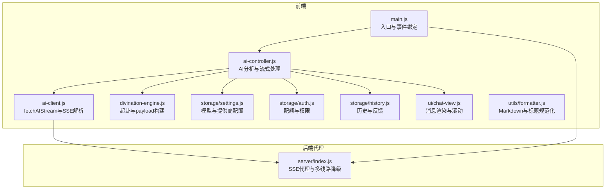
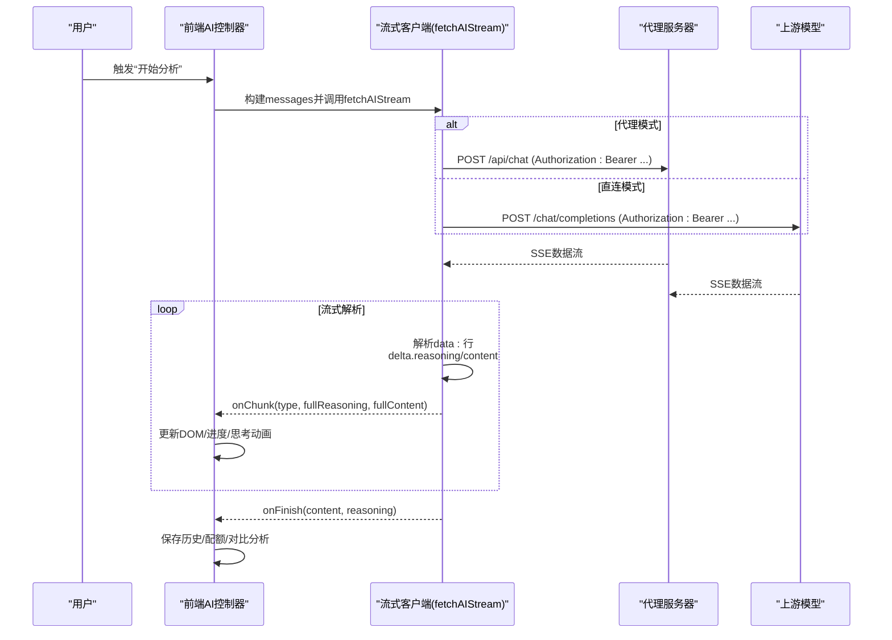
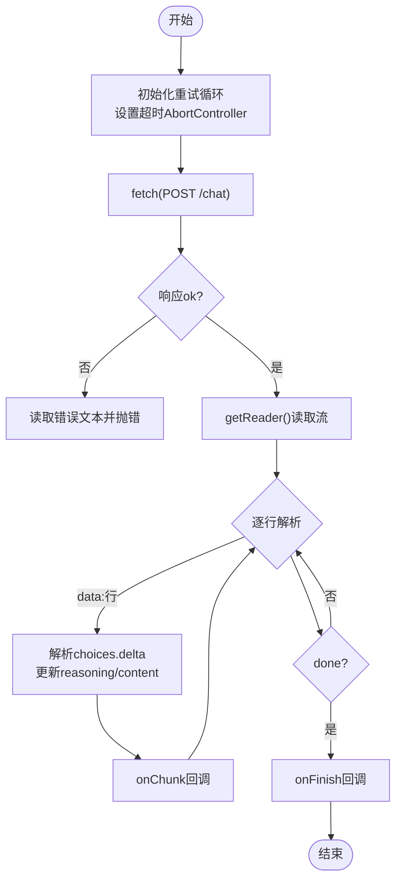
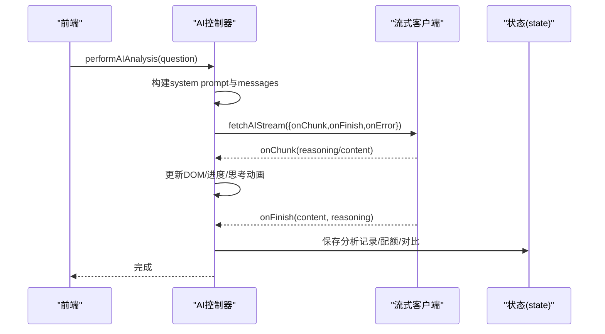
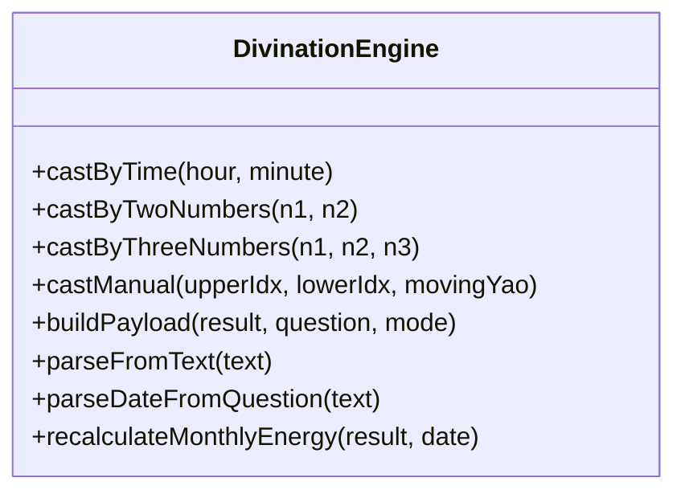
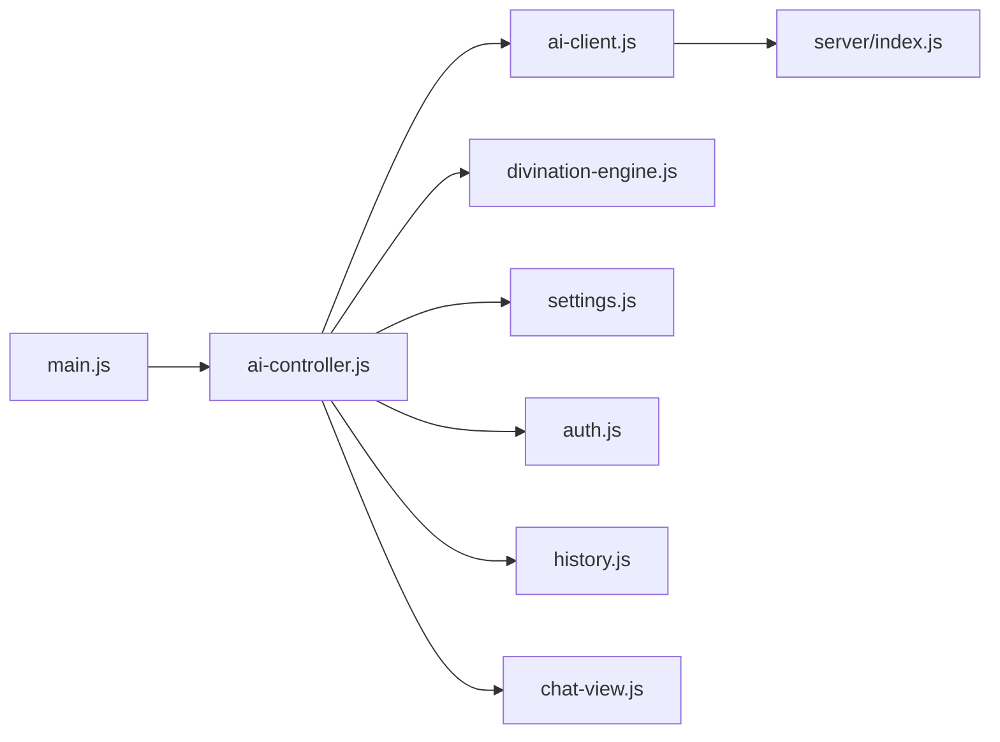

# AI推理接口

<cite>
**本文引用的文件**
- [src/api/ai-client.js](file://src/api/ai-client.js)
- [src/controllers/ai-controller.js](file://src/controllers/ai-controller.js)
- [src/core/divination-engine.js](file://src/core/divination-engine.js)
- [src/storage/settings.js](file://src/storage/settings.js)
- [src/storage/history.js](file://src/storage/history.js)
- [src/storage/auth.js](file://src/storage/auth.js)
- [src/controllers/state.js](file://src/controllers/state.js)
- [src/ui/chat-view.js](file://src/ui/chat-view.js)
- [src/utils/formatter.js](file://src/utils/formatter.js)
- [src/main.js](file://src/main.js)
- [server/index.js](file://server/index.js)
</cite>

## 目录
1. [简介](#简介)
2. [项目结构](#项目结构)
3. [核心组件](#核心组件)
4. [架构总览](#架构总览)
5. [详细组件分析](#详细组件分析)
6. [依赖分析](#依赖分析)
7. [性能考虑](#性能考虑)
8. [故障排查指南](#故障排查指南)
9. [结论](#结论)
10. [附录](#附录)

## 简介
本文件为“AI推理接口”的详细API文档，面向开发者与运维人员，聚焦于流式响应处理、多模型支持、温度参数配置、代理模式与直连模式差异、重试与超时策略、错误恢复与容错机制、以及性能优化与最佳实践。文档同时提供请求与响应格式说明、思考过程与正文分层输出、以及与后端代理服务器的对接要点。

## 项目结构
该项目采用前端单页应用与独立代理服务器分离的架构：
- 前端模块负责用户交互、消息渲染、流式解析、重试与超时控制、配额与权限管理、历史与反馈存储。
- 代理服务器负责上游多线路负载、SSE透传、超时控制与错误聚合、CORS与会话管理。

图表来源
- [src/main.js:167-249](file://src/main.js#L167-L249)
- [src/controllers/ai-controller.js:24-112](file://src/controllers/ai-controller.js#L24-L112)
- [src/api/ai-client.js:31-76](file://src/api/ai-client.js#L31-L76)
- [server/index.js:514-646](file://server/index.js#L514-L646)

章节来源
- [src/main.js:167-249](file://src/main.js#L167-L249)
- [server/index.js:514-646](file://server/index.js#L514-L646)

## 核心组件
- 流式客户端与SSE解析：封装fetch与ReadableStream，解析data:行，兼容非流式一次性返回，支持超时与重试。
- AI控制器：组织系统提示、构建messages、驱动流式渲染、处理中断与续传、对比分析、历史持久化与配额控制。
- 起卦引擎：将用户输入解析为卦象，构建分析payload，含月令、体用、变卦、对卦与义理文本。
- 配置与权限：模型注册表、提供商默认端点、API Key存储、用户配额与专业版权限。
- 历史与反馈：本地与云端历史同步、反馈学习注入系统提示。
- UI渲染：消息容器、双列对比布局、滚动与加载指示、Markdown渲染与标题规范化。

章节来源
- [src/api/ai-client.js:31-185](file://src/api/ai-client.js#L31-L185)
- [src/controllers/ai-controller.js:24-524](file://src/controllers/ai-controller.js#L24-L524)
- [src/core/divination-engine.js:297-346](file://src/core/divination-engine.js#L297-L346)
- [src/storage/settings.js:17-86](file://src/storage/settings.js#L17-L86)
- [src/storage/auth.js:249-323](file://src/storage/auth.js#L249-L323)
- [src/storage/history.js:15-102](file://src/storage/history.js#L15-L102)
- [src/ui/chat-view.js:7-114](file://src/ui/chat-view.js#L7-L114)
- [src/utils/formatter.js:61-92](file://src/utils/formatter.js#L61-L92)

## 架构总览
AI推理接口通过前端流式客户端与后端代理协作实现：
- 前端发起POST /api/chat（代理端点）或直连上游API，携带messages、model、stream=true、temperature、max_tokens等参数。
- 后端代理按顺序尝试多条线路，透传SSE响应，强制flush，处理超时与错误，最终聚合为标准SSE。
- 前端解析SSE，分别推送“思考过程”与“正文”，并维护进度条与思考动画。

图表来源
- [src/controllers/ai-controller.js:203-524](file://src/controllers/ai-controller.js#L203-L524)
- [src/api/ai-client.js:31-185](file://src/api/ai-client.js#L31-L185)
- [server/index.js:514-646](file://server/index.js#L514-L646)

## 详细组件分析

### 流式客户端与SSE解析（ai-client.js）
- 超时与重试
  - 默认超时180秒，最大重试2次，每次重试间隔递增。
  - 超时与AbortError区分：用户中止静默退出，超时转为错误提示。
- SSE解析
  - 逐行解析data:前缀，支持reasoning_content与content双通道增量。
  - 兼容一次性非流式JSON返回，自动兜底为一次性content事件。
- 参数与头部
  - 默认temperature=0.35，max_tokens=8192，stream=true。
  - 代理模式不带Authorization，直连模式带Bearer Key。
- 错误处理
  - 401/403不重试；网络类错误触发自动续传（配合中断上下文）。

图表来源
- [src/api/ai-client.js:78-185](file://src/api/ai-client.js#L78-L185)

章节来源
- [src/api/ai-client.js:22-76](file://src/api/ai-client.js#L22-L76)
- [src/api/ai-client.js:78-185](file://src/api/ai-client.js#L78-L185)

### AI控制器（ai-controller.js）
- 系统提示与模式
  - 支持简化版与专业版两种输出模式，专业版注入“反馈学习”历史记录。
  - 根据用户权限自动切换模式，付费/管理员优先专业版。
- 消息构建与流式渲染
  - 构建messages：system prompt + user payload（JSON序列化）。
  - 流式渲染：先渲染“思考进度”，再切换为正文Markdown；支持reasoning-only阶段保持动画。
- 中断与续传
  - 记录interruptedCtx（partialContent/partialReasoning、messages、targetEl等），支持自动续传。
  - 网络抖动时自动续传一次，减少用户操作。
- 对比分析
  - 模型切换时，将上次分析结果与新模型并排展示，左为旧模型，右为新模型。
- 历史与配额
  - 新断卦扣配额，追问不扣；保存分析记录，支持云端合并与去重。
  - 存储不足时自动裁剪旧记录。

图表来源
- [src/controllers/ai-controller.js:24-112](file://src/controllers/ai-controller.js#L24-L112)
- [src/controllers/ai-controller.js:203-524](file://src/controllers/ai-controller.js#L203-L524)

章节来源
- [src/controllers/ai-controller.js:24-112](file://src/controllers/ai-controller.js#L24-L112)
- [src/controllers/ai-controller.js:203-524](file://src/controllers/ai-controller.js#L203-L524)

### 起卦引擎与payload构建（divination-engine.js）
- 起卦方式
  - 时间起卦、两数/三数法、手动选卦，统一输出本卦、变卦、对卦、体用、月令与义理文本。
- payload结构
  - 包含体用位置、三卦信息、月令状态、天道义理（卦辞与动爻爻辞）、用户问题。
- 日期解析与月令修正
  - 支持从问题中解析精确日期或仅月份，必要时重新计算月令能量。

图表来源
- [src/core/divination-engine.js:35-201](file://src/core/divination-engine.js#L35-L201)
- [src/core/divination-engine.js:297-346](file://src/core/divination-engine.js#L297-L346)

章节来源
- [src/core/divination-engine.js:35-201](file://src/core/divination-engine.js#L35-L201)
- [src/core/divination-engine.js:297-346](file://src/core/divination-engine.js#L297-L346)

### 配置与权限（settings.js、auth.js）
- 模型注册表
  - 主线：deepseek-reasoner；备线：DeepSeek-R1；增强：Qwen3.5-397B-A17B。
  - 支持reasoning通道与标签化展示。
- 提供商与默认端点
  - deepseek、siliconflow等默认端点，支持用户覆盖。
- 权限与配额
  - 管理员/付费用户开启专业版；普通用户固定主线模型。
  - 今日配额限制，游客有限额；VIP码提升上限。

章节来源
- [src/storage/settings.js:17-86](file://src/storage/settings.js#L17-L86)
- [src/storage/auth.js:232-289](file://src/storage/auth.js#L232-L289)

### 历史与反馈（history.js）
- 本地localStorage为主，云端同步为辅。
- 云端保存/加载接口，登录后与本地合并去重，最多保留50条。
- 反馈学习：将用户对历史结果的评价与偏差指正注入系统提示，提升后续推演精度。

章节来源
- [src/storage/history.js:15-102](file://src/storage/history.js#L15-L102)
- [src/controllers/ai-controller.js:526-732](file://src/controllers/ai-controller.js#L526-L732)

### UI渲染与Markdown（chat-view.js、formatter.js）
- 双列对比布局：左侧旧模型，右侧新模型，加载时右侧显示加载点。
- Markdown渲染：标题规范化、加粗闭合、列表与换行处理。
- 滚动与可见性：自动滚动到底部，移动端按钮可见性随滚动与侧边栏状态变化。

章节来源
- [src/ui/chat-view.js:44-75](file://src/ui/chat-view.js#L44-L75)
- [src/utils/formatter.js:61-92](file://src/utils/formatter.js#L61-L92)

## 依赖分析
- 前端依赖链
  - main.js绑定事件，调用ai-controller.js发起分析。
  - ai-controller.js依赖divination-engine.js构建payload、settings.js读取模型配置、auth.js检查配额、history.js持久化、ui/chat-view.js渲染、utils/formatter.js格式化。
  - ai-client.js被ai-controller.js调用，负责SSE解析与重试。
- 后端依赖链
  - server/index.js监听/api/chat，按顺序尝试多条上游线路，透传SSE，设置flushHeaders，处理超时与错误。

图表来源
- [src/main.js:296-554](file://src/main.js#L296-L554)
- [src/controllers/ai-controller.js:24-112](file://src/controllers/ai-controller.js#L24-L112)
- [src/api/ai-client.js:31-76](file://src/api/ai-client.js#L31-L76)
- [server/index.js:514-646](file://server/index.js#L514-L646)

章节来源
- [src/main.js:296-554](file://src/main.js#L296-L554)
- [src/controllers/ai-controller.js:24-112](file://src/controllers/ai-controller.js#L24-L112)
- [src/api/ai-client.js:31-76](file://src/api/ai-client.js#L31-L76)
- [server/index.js:514-646](file://server/index.js#L514-L646)

## 性能考虑
- 流式渲染与进度
  - 前端在首chunk到达前即渲染“思考进度”，提升感知速度；reasoning-only阶段维持动画，避免空白。
- 超时与重试
  - 默认180秒超时，2次重试，避免长时间挂起；网络类错误自动续传一次，降低人工干预。
- SSE透传与flush
  - 后端设置X-Accel-Buffering=no与flush，确保中间层不缓存，实时推送。
- 模型选择与配额
  - 普通用户固定主线模型，避免备线不稳定；付费/管理员可切换增强模型。
- 存储与历史
  - 本地历史最多50条，存储不足时自动裁剪；云端同步异步进行，不阻塞主流程。

[本节为通用性能建议，不直接分析特定文件]

## 故障排查指南
- 代理模式与直连模式
  - 代理模式：PROXY_ENDPOINT启用，不带Authorization，密钥由服务器中转；适合生产部署。
  - 直连模式：直接调用上游API，带Authorization，密钥在浏览器可见。
- 常见错误与恢复
  - 401/403：不重试，检查API Key与权限。
  - 超时：自动转为错误提示，可点击“继续”接续未完成内容。
  - 网络抖动：自动续传一次，减少用户操作。
  - 无内容返回：提示“解析中断（返回为空）”，可点击继续接续。
- 历史与配额
  - 存储配额不足：自动裁剪旧记录；游客/普通用户配额限制，付费/管理员提升上限。
- 日志与调试
  - 使用logger模块输出info/warn/error级别日志，生产环境默认仅warn+。

章节来源
- [src/api/ai-client.js:12-25](file://src/api/ai-client.js#L12-L25)
- [src/controllers/ai-controller.js:478-523](file://src/controllers/ai-controller.js#L478-L523)
- [src/storage/history.js:32-44](file://src/storage/history.js#L32-L44)
- [src/storage/auth.js:249-323](file://src/storage/auth.js#L249-L323)
- [src/utils/logger.js:14-34](file://src/utils/logger.js#L14-L34)

## 结论
本项目通过前端流式客户端与后端代理的协同，实现了稳定、可扩展的AI推理接口。其特性包括：
- 流式SSE解析与双通道增量输出（思考过程与正文）
- 多模型支持与智能切换（主线/备线/增强）
- 代理模式与直连模式灵活部署
- 完整的重试、超时、错误恢复与自动续传
- 历史与反馈学习注入，持续优化推演质量

[本节为总结，不直接分析特定文件]

## 附录

### 接口定义与请求格式
- 端点
  - 代理模式：POST /api/chat
  - 直连模式：上游模型的/chat/completions（如SiliconFlow、DeepSeek）
- 请求头
  - Content-Type: application/json
  - 代理模式：无Authorization
  - 直连模式：Authorization: Bearer <API Key>
- 请求体
  - model: 选定模型标识
  - messages: 数组，元素为{role, content}，系统提示与用户payload
  - stream: true
  - temperature: 0.35
  - max_tokens: 8192
- 响应
  - SSE流，逐行data: JSON对象，包含choices[0].delta.reasoning_content与content增量。
  - 兼容一次性返回：choices[0].message.content。

章节来源
- [src/api/ai-client.js:97-108](file://src/api/ai-client.js#L97-L108)
- [server/index.js:556-568](file://server/index.js#L556-L568)

### 响应格式与输出结构
- 流式事件
  - type='reasoning'：仅思考过程，用于维持进度动画
  - type='content'：正文增量，最终拼接为完整Markdown
- 完整事件
  - onFinish：返回{content, reasoning}
- Markdown渲染
  - 标题规范化、加粗闭合、列表与换行处理
  - 专业版与简化版输出结构不同，前者更详细，后者更口语化

章节来源
- [src/api/ai-client.js:121-158](file://src/api/ai-client.js#L121-L158)
- [src/utils/formatter.js:61-92](file://src/utils/formatter.js#L61-L92)
- [src/controllers/ai-controller.js:526-732](file://src/controllers/ai-controller.js#L526-L732)

### 代理模式与直连模式对比
- 代理模式
  - 优点：密钥在服务端，安全性更高；可多线路降级；统一CORS与会话管理
  - 配置：PROXY_ENDPOINT指向代理地址，isProxyMode启用
- 直连模式
  - 优点：延迟更低；便于调试
  - 风险：API Key暴露在浏览器，需配合CSP与密钥限额

章节来源
- [src/api/ai-client.js:12-25](file://src/api/ai-client.js#L12-L25)
- [server/index.js:514-646](file://server/index.js#L514-L646)

### 重试机制与超时策略
- 重试次数：最多2次
- 重试间隔：递增等待
- 超时：默认180秒
- 错误分类：401/403不重试；网络类错误自动续传一次

章节来源
- [src/api/ai-client.js:22-76](file://src/api/ai-client.js#L22-L76)

### 温度参数与推理稳定性
- 默认temperature=0.35，兼顾创造性与稳定性
- 专业版与简化版共享同一系统提示与推理内核，差异在于输出格式与术语约束

章节来源
- [src/api/ai-client.js:25](file://src/api/ai-client.js#L25)
- [server/index.js:40](file://server/index.js#L40)
- [src/controllers/ai-controller.js:526-732](file://src/controllers/ai-controller.js#L526-L732)

### 请求示例与响应示例（路径指引）
- 请求体构建（messages）：参考[构建payload与messages:82-85](file://src/controllers/ai-controller.js#L82-L85)与[起卦payload:297-346](file://src/core/divination-engine.js#L297-L346)
- SSE流解析：参考[流式解析与回调:121-158](file://src/api/ai-client.js#L121-158)
- Markdown渲染：参考[格式化工具:61-92](file://src/utils/formatter.js#L61-92)