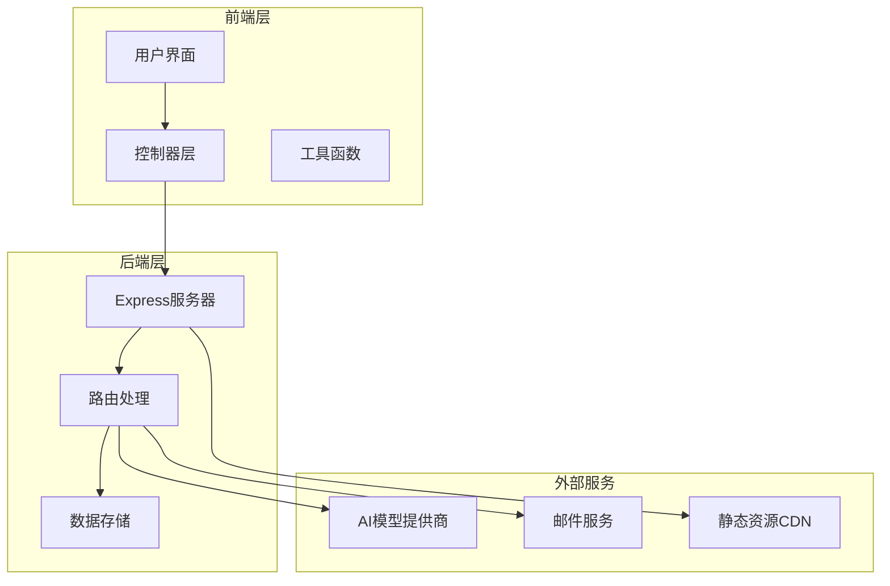
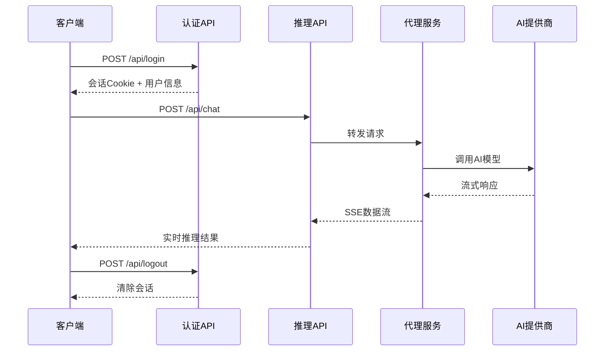

# API接口文档

<cite>
**本文档引用的文件**
- [server/index.js](file://server/index.js)
- [src/api/ai-client.js](file://src/api/ai-client.js)
- [src/controllers/ai-controller.js](file://src/controllers/ai-controller.js)
- [src/controllers/auth-controller.js](file://src/controllers/auth-controller.js)
- [src/storage/auth.js](file://src/storage/auth.js)
- [src/storage/history.js](file://src/storage/history.js)
- [src/storage/settings.js](file://src/storage/settings.js)
- [src/controllers/state.js](file://src/controllers/state.js)
- [src/ui/modals.js](file://src/ui/modals.js)
- [package.json](file://package.json)
- [vercel.json](file://vercel.json)
</cite>

## 目录
1. [简介](#简介)
2. [项目结构](#项目结构)
3. [核心组件](#核心组件)
4. [架构概览](#架构概览)
5. [详细组件分析](#详细组件分析)
6. [依赖分析](#依赖分析)
7. [性能考虑](#性能考虑)
8. [故障排除指南](#故障排除指南)
9. [结论](#结论)
10. [附录](#附录)

## 简介
本项目是一个基于Express.js的梅花义理AI推理系统，提供易学断卦、用户认证、历史管理等核心功能。系统采用前后端分离架构，后端提供RESTful API，前端通过AJAX调用实现交互式AI推理体验。

## 项目结构
项目采用模块化设计，主要分为以下层次：



**图表来源**
- [server/index.js:1-668](file://server/index.js#L1-L668)
- [src/controllers/ai-controller.js:1-733](file://src/controllers/ai-controller.js#L1-L733)

**章节来源**
- [server/index.js:1-668](file://server/index.js#L1-L668)
- [package.json:1-32](file://package.json#L1-L32)

## 核心组件
系统包含以下核心组件：

### 1. 认证组件
- 用户注册/登录/登出
- 会话管理
- 密码重置
- 权限控制

### 2. AI推理组件
- 推理引擎
- 流式响应处理
- 多模型支持
- 推理参数配置

### 3. 历史管理组件
- 本地存储
- 云端同步
- 历史记录管理
- 反馈学习

### 4. 配置管理组件
- 模型配置
- 提供商设置
- 应用设置

**章节来源**
- [src/storage/auth.js:1-350](file://src/storage/auth.js#L1-L350)
- [src/api/ai-client.js:1-185](file://src/api/ai-client.js#L1-L185)
- [src/storage/history.js:1-143](file://src/storage/history.js#L1-L143)
- [src/storage/settings.js:1-86](file://src/storage/settings.js#L1-L86)

## 架构概览



**图表来源**
- [server/index.js:302-345](file://server/index.js#L302-L345)
- [server/index.js:514-646](file://server/index.js#L514-L646)
- [src/api/ai-client.js:31-76](file://src/api/ai-client.js#L31-L76)

## 详细组件分析

### 认证API接口

#### 用户注册
- **HTTP方法**: POST
- **URL模式**: `/api/register`
- **请求参数**:
  - `name`: 用户名 (必需)
  - `passwordHash`: 密码哈希 (必需)
  - `email`: 邮箱地址 (可选)

- **响应格式**:
  ```json
  {
    "success": true,
    "user": {
      "name": "用户名"
    }
  }
  ```

- **错误处理**:
  - 400: 缺少必需参数或用户名格式不合法
  - 409: 用户已存在
  - 500: 服务器内部错误

#### 用户登录
- **HTTP方法**: POST
- **URL模式**: `/api/login`
- **请求参数**:
  - `name`: 用户名 (必需)
  - `passwordHash`: 密码哈希 (必需)

- **响应格式**:
  ```json
  {
    "success": true,
    "user": {
      "name": "用户名",
      "hasEmail": true
    }
  }
  ```

- **错误处理**:
  - 400: 缺少必需参数
  - 404: 用户尚未注册
  - 401: 密码错误

#### 会话状态查询
- **HTTP方法**: GET
- **URL模式**: `/api/session/current`

- **响应格式**:
  ```json
  {
    "success": true,
    "user": {
      "name": "用户名",
      "hasEmail": true
    }
  }
  ```

#### 用户登出
- **HTTP方法**: POST
- **URL模式**: `/api/logout`

- **响应格式**:
  ```json
  {
    "success": true
  }
  ```

**章节来源**
- [server/index.js:279-345](file://server/index.js#L279-L345)
- [src/storage/auth.js:46-87](file://src/storage/auth.js#L46-L87)

### AI推理API接口

#### 推理请求
- **HTTP方法**: POST
- **URL模式**: `/api/chat`
- **请求参数**:
  - `messages`: 消息数组 (必需)
  - `mode`: 推理模式 (可选)

- **消息格式**:
  ```json
  {
    "role": "system/user/assistant",
    "content": "消息内容"
  }
  ```

- **响应格式**: SSE流式响应
  - 内容类型: `text/event-stream`
  - 数据格式: JSON对象包装的事件数据

- **流式响应示例**:
  ```
  data: {"content": "部分响应内容"}
  data: {"reasoning": "推理过程"}
  data: {"content": "完整响应内容"}
  data: {"error": "错误信息"}
  ```

- **错误处理**:
  - 400: 缺少messages字段
  - 503: 服务器未配置API密钥
  - 500: 代理请求失败

**章节来源**
- [server/index.js:514-646](file://server/index.js#L514-L646)
- [src/api/ai-client.js:31-185](file://src/api/ai-client.js#L31-L185)

### 历史管理API接口

#### 保存历史记录
- **HTTP方法**: POST
- **URL模式**: `/api/history/save`
- **请求参数**:
  - `username`: 用户名 (必需)
  - `records`: 历史记录数组 (必需)

- **响应格式**:
  ```json
  {
    "success": true
  }
  ```

#### 读取历史记录
- **HTTP方法**: GET
- **URL模式**: `/api/history/load`
- **查询参数**:
  - `username`: 用户名 (必需)

- **响应格式**:
  ```json
  {
    "success": true,
    "records": []
  }
  ```

**章节来源**
- [server/index.js:489-511](file://server/index.js#L489-L511)
- [src/storage/history.js:64-102](file://src/storage/history.js#L64-L102)

### 管理员API接口

#### 统计信息
- **HTTP方法**: GET
- **URL模式**: `/api/admin/stats`
- **查询参数**:
  - `admin`: 管理员用户名 (必需)

- **响应格式**:
  ```json
  {
    "totalUsers": 0,
    "users": []
  }
  ```

#### 重置用户密码
- **HTTP方法**: POST
- **URL模式**: `/api/admin/reset-password`
- **请求参数**:
  - `admin`: 管理员用户名 (必需)
  - `targetUser`: 目标用户 (必需)
  - `newPasswordHash`: 新密码哈希 (必需)

**章节来源**
- [server/index.js:347-420](file://server/index.js#L347-L420)

### 用户管理API接口

#### 绑定邮箱
- **HTTP方法**: POST
- **URL模式**: `/api/bind-email`
- **请求参数**:
  - `name`: 用户名 (必需)
  - `email`: 邮箱地址 (必需)

#### 修改密码
- **HTTP方法**: POST
- **URL模式**: `/api/change-password`
- **请求参数**:
  - `name`: 用户名 (必需)
  - `oldPasswordHash`: 旧密码哈希 (必需)
  - `newPasswordHash`: 新密码哈希 (必需)

#### 发送验证码
- **HTTP方法**: POST
- **URL模式**: `/api/send-code`
- **请求参数**:
  - `name`: 用户名 (必需)

#### 重置密码
- **HTTP方法**: POST
- **URL模式**: `/api/reset-password`
- **请求参数**:
  - `name`: 用户名 (必需)
  - `code`: 验证码 (必需)
  - `newPasswordHash`: 新密码哈希 (必需)

**章节来源**
- [server/index.js:359-487](file://server/index.js#L359-L487)

## 依赖分析

```mermaid
graph LR
subgraph "核心依赖"
Express[express@^4.18.0]
Cors[cors@^2.8.5]
Nodemailer[nodemailer@^6.9.0]
end
subgraph "开发依赖"
Vite[vite@^7.3.1]
Jest[jest@^29.7.0]
ESLint[eslint@^8.50.0]
end
subgraph "运行时依赖"
Crypto[crypto]
FS[fs]
Path[path]
end
Express --> Cors
Express --> Nodemailer
```

**图表来源**
- [package.json:1-32](file://package.json#L1-L32)

**章节来源**
- [package.json:1-32](file://package.json#L1-L32)

## 性能考虑

### CORS配置
系统采用严格的CORS策略：
- 允许来源：`https://meihuayili.com` 和 `http://localhost:5173`
- 支持方法：GET, POST, OPTIONS
- 允许头部：Content-Type
- 支持凭据：启用

### 会话管理
- 会话有效期：180天
- Cookie属性：httpOnly, secure, sameSite=lax
- 自动续期机制

### 流式响应优化
- SSE流式传输
- 即时刷新机制
- 超时控制：180秒
- 最大重试：2次

### 存储策略
- 本地存储：localStorage
- 云端同步：异步执行
- 存储配额：50条历史记录
- 错误处理：自动修剪

## 故障排除指南

### 常见错误代码
- **400**: 参数错误或格式不正确
- **401**: 未授权访问
- **403**: 权限不足
- **404**: 资源不存在
- **409**: 资源冲突
- **429**: 请求过于频繁
- **500**: 服务器内部错误
- **503**: 服务不可用

### 错误处理机制
1. **客户端错误**：直接返回错误信息
2. **网络错误**：自动重试机制
3. **超时处理**：180秒超时限制
4. **会话失效**：自动清除无效会话

### 调试建议
1. 检查网络连接和CORS配置
2. 验证API密钥有效性
3. 确认会话Cookie状态
4. 查看浏览器开发者工具中的网络请求

**章节来源**
- [server/index.js:244-264](file://server/index.js#L244-L264)
- [src/api/ai-client.js:45-76](file://src/api/ai-client.js#L45-L76)

## 结论
本API接口文档详细描述了梅花义理系统的RESTful API设计，包括认证、推理、历史管理等核心功能。系统采用现代化的架构设计，支持流式响应、会话管理和多模型推理，为用户提供完整的易学断卦体验。

## 附录

### 安全考虑
1. **CORS配置**：严格限制允许的来源
2. **会话管理**：安全的Cookie设置和自动续期
3. **API密钥**：服务器端存储，前端不直接访问
4. **输入验证**：严格的参数验证和过滤

### 最佳实践
1. **错误处理**：完善的错误捕获和用户提示
2. **性能优化**：流式响应和缓存策略
3. **安全性**：HTTPS传输和安全的会话管理
4. **可维护性**：清晰的API设计和文档

### 版本信息
- **版本**: 3.8.0
- **构建工具**: Vite
- **测试框架**: Jest
- **代码质量**: ESLint

**章节来源**
- [vercel.json:1-23](file://vercel.json#L1-L23)
- [package.json:1-32](file://package.json#L1-L32)