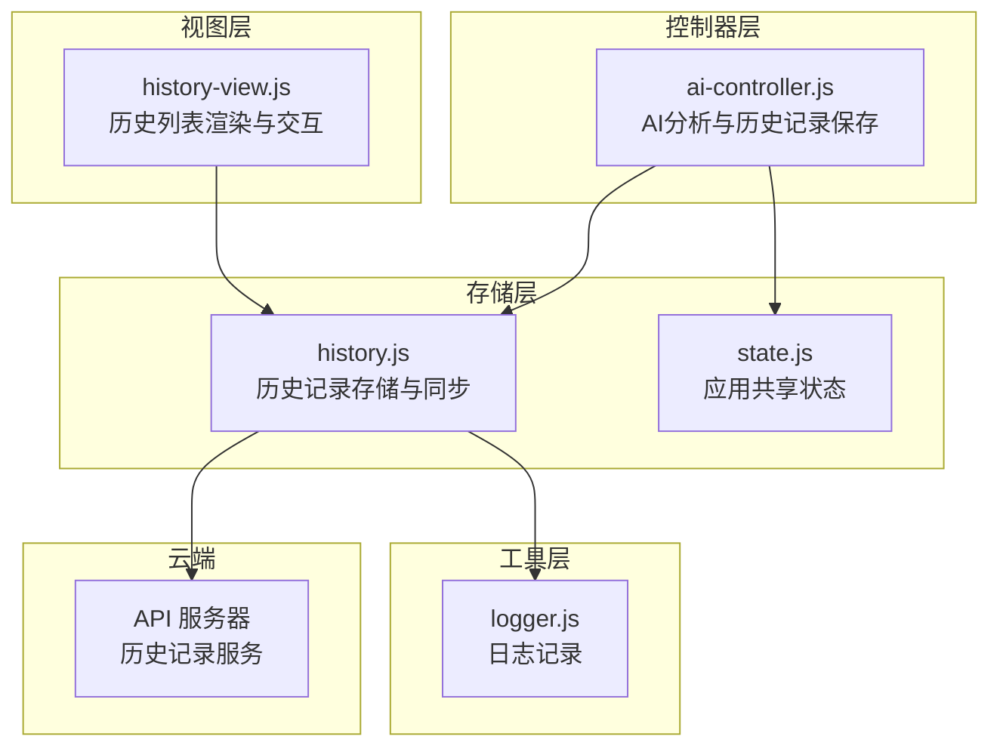
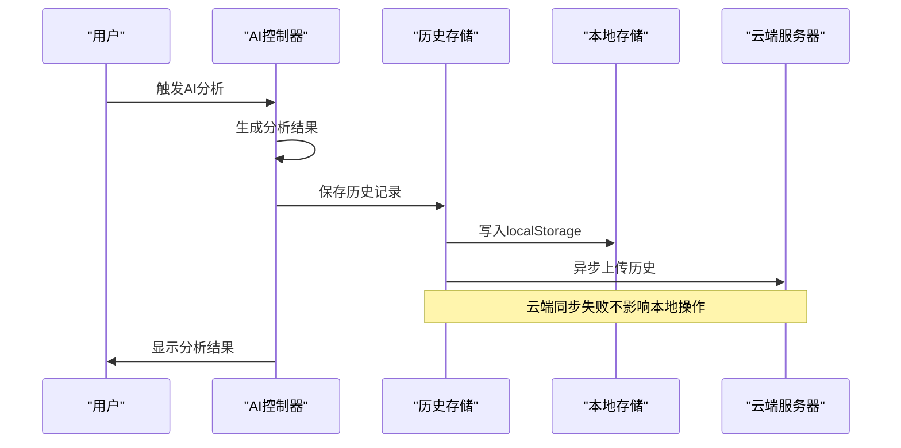
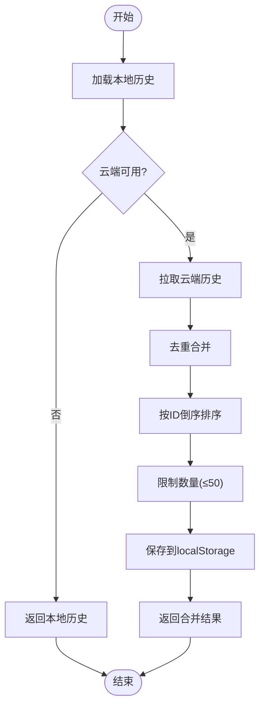
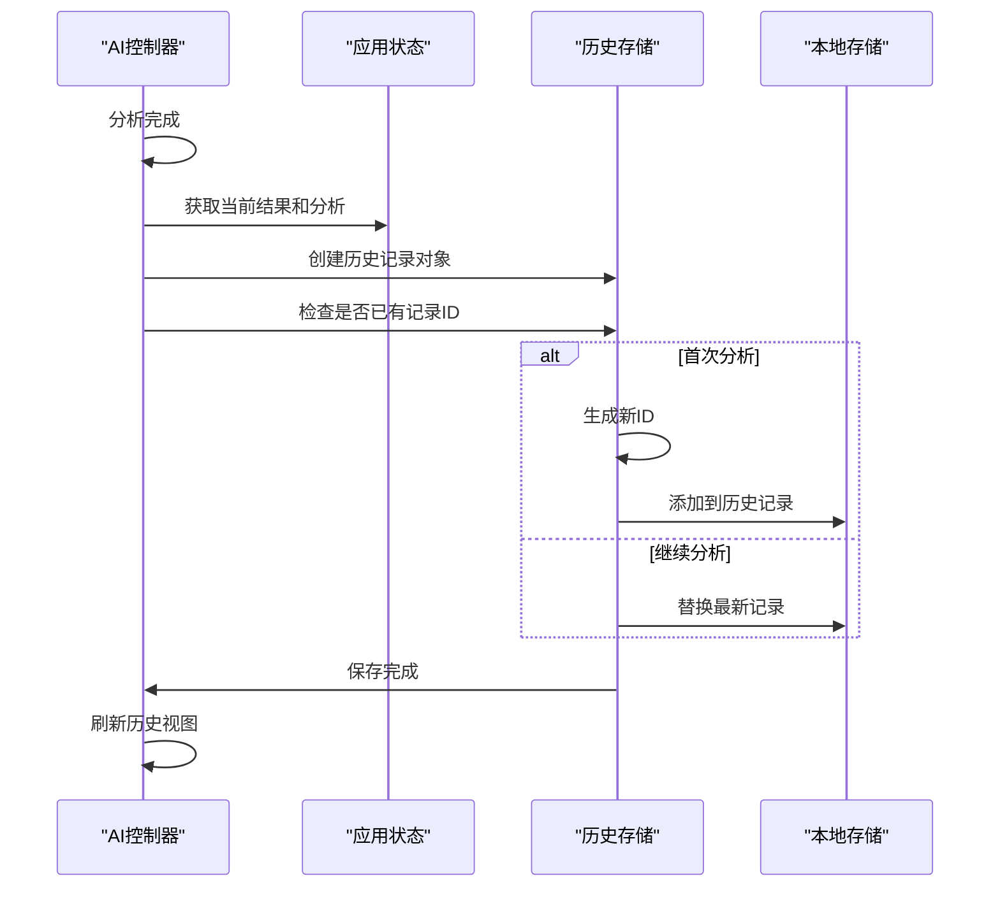
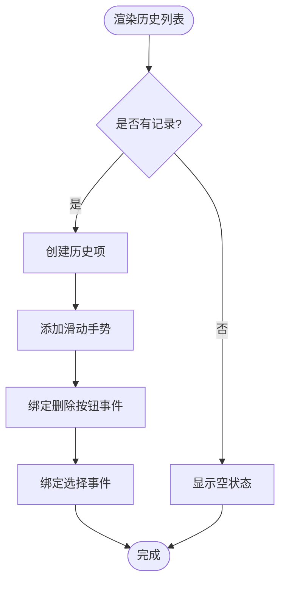
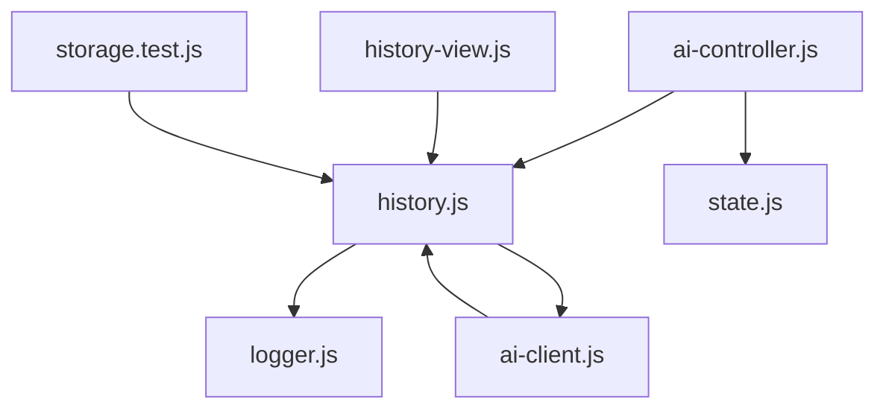

# 历史管理接口

<cite>
**本文档引用的文件**
- [src/storage/history.js](file://src/storage/history.js)
- [src/controllers/ai-controller.js](file://src/controllers/ai-controller.js)
- [src/ui/history-view.js](file://src/ui/history-view.js)
- [src/controllers/state.js](file://src/controllers/state.js)
- [src/api/ai-client.js](file://src/api/ai-client.js)
- [src/utils/logger.js](file://src/utils/logger.js)
- [__tests__/storage.test.js](file://__tests__/storage.test.js)
</cite>

## 目录
1. [简介](#简介)
2. [项目结构](#项目结构)
3. [核心组件](#核心组件)
4. [架构概览](#架构概览)
5. [详细组件分析](#详细组件分析)
6. [依赖分析](#依赖分析)
7. [性能考虑](#性能考虑)
8. [故障排除指南](#故障排除指南)
9. [结论](#结论)
10. [附录](#附录)

## 简介
本文件为历史管理接口的详细API文档，涵盖历史记录的保存、加载、删除、合并同步等操作。文档详细说明了历史数据的存储格式、查询条件、分页机制，以及本地存储与云端同步的机制（包括数据一致性保证和冲突解决策略）。同时记录了历史记录的数据结构（包括卦例信息、用户输入、AI分析结果等字段定义），并提供批量操作接口和单条记录操作接口的使用示例。最后说明了数据备份和恢复机制，并包含性能优化建议和大数据量处理策略。

## 项目结构
历史管理功能主要分布在以下模块：
- 存储层：负责本地localStorage的历史记录持久化与云端同步
- 控制器层：负责AI分析流程中的历史记录自动保存与合并
- 视图层：负责历史列表的渲染与交互
- 工具层：提供日志记录能力



**图表来源**
- [src/storage/history.js:1-143](file://src/storage/history.js#L1-L143)
- [src/controllers/ai-controller.js:1-733](file://src/controllers/ai-controller.js#L1-L733)
- [src/ui/history-view.js:1-168](file://src/ui/history-view.js#L1-L168)
- [src/controllers/state.js:1-24](file://src/controllers/state.js#L1-L24)
- [src/utils/logger.js:1-34](file://src/utils/logger.js#L1-L34)

**章节来源**
- [src/storage/history.js:1-143](file://src/storage/history.js#L1-L143)
- [src/controllers/ai-controller.js:1-733](file://src/controllers/ai-controller.js#L1-L733)
- [src/ui/history-view.js:1-168](file://src/ui/history-view.js#L1-L168)
- [src/controllers/state.js:1-24](file://src/controllers/state.js#L1-L24)
- [src/utils/logger.js:1-34](file://src/utils/logger.js#L1-L34)

## 核心组件
- 历史记录存储模块：提供历史记录的加载、保存、添加、删除、云端同步与合并等功能
- AI控制器：在AI分析完成后自动保存历史记录，并处理继续分析、比较分析等场景
- 历史视图：负责历史列表的渲染、滑动删除交互与选择事件
- 应用状态：维护当前用户、历史记录、当前分析结果等全局状态
- 日志工具：提供统一的日志记录能力，便于调试和监控

**章节来源**
- [src/storage/history.js:15-102](file://src/storage/history.js#L15-L102)
- [src/controllers/ai-controller.js:24-524](file://src/controllers/ai-controller.js#L24-L524)
- [src/ui/history-view.js:7-167](file://src/ui/history-view.js#L7-L167)
- [src/controllers/state.js:5-21](file://src/controllers/state.js#L5-L21)
- [src/utils/logger.js:14-31](file://src/utils/logger.js#L14-L31)

## 架构概览
历史管理采用"本地优先 + 异步云端同步"的架构设计：
- 本地存储：使用localStorage作为主存储，键名为`meihua_history_{username}`
- 云端同步：异步上传至服务器，登录后从服务器拉取并合并历史记录
- 数据一致性：通过ID去重和时间倒序排序保证合并后的数据一致性
- 冲突解决：云端新增记录与本地记录去重，保留本地最新修改



**图表来源**
- [src/controllers/ai-controller.js:403-477](file://src/controllers/ai-controller.js#L403-L477)
- [src/storage/history.js:26-72](file://src/storage/history.js#L26-L72)

**章节来源**
- [src/controllers/ai-controller.js:403-477](file://src/controllers/ai-controller.js#L403-L477)
- [src/storage/history.js:26-72](file://src/storage/history.js#L26-L72)

## 详细组件分析

### 历史记录存储模块
历史记录存储模块提供了完整的CRUD操作和云端同步功能：

#### 数据结构定义
历史记录采用JSON格式存储，每个记录包含以下字段：
- id：记录唯一标识符（时间戳或自增ID）
- timestamp：记录创建时间
- result：卦例信息（包含本卦、变卦、对卦、体用关系等）
- question：用户问题
- analyses：AI分析结果数组
- analysis：最新AI分析内容
- reasoning：推理过程

#### 核心API接口
- `getUserHistoryKey(userName)`：获取用户历史记录的localStorage键名
- `loadHistory(userName)`：加载指定用户的全部历史记录
- `saveHistory(userName, history)`：保存历史记录到localStorage
- `addHistoryRecord(userName, record)`：添加新记录并限制数量
- `deleteHistoryRecord(userName, recordId)`：删除指定ID的记录
- `mergeCloudHistory(userName)`：从云端拉取并合并历史记录

#### 云端同步机制
- 异步上传：每次本地保存后异步调用云端保存接口
- 登录合并：用户登录后从云端拉取历史，与本地去重合并
- 去重策略：基于记录ID进行去重，保留云端新增记录
- 排序规则：按ID倒序排列，确保最新记录在前



**图表来源**
- [src/storage/history.js:75-102](file://src/storage/history.js#L75-L102)

**章节来源**
- [src/storage/history.js:11-102](file://src/storage/history.js#L11-L102)

### AI控制器集成
AI控制器在分析完成后自动保存历史记录：
- 自动生成记录ID（首次分析时使用当前时间戳）
- 更新现有记录（继续分析时替换最新记录）
- 处理存储配额不足的情况
- 刷新历史视图并提示用户

#### 自动保存流程


**图表来源**
- [src/controllers/ai-controller.js:403-477](file://src/controllers/ai-controller.js#L403-L477)

**章节来源**
- [src/controllers/ai-controller.js:403-477](file://src/controllers/ai-controller.js#L403-L477)

### 历史视图交互
历史视图提供了直观的列表展示和滑动删除交互：
- 左滑显示删除按钮，点击确认删除
- 支持点击打开选定的卦例
- 自动滚动到最新记录
- 空状态提示



**图表来源**
- [src/ui/history-view.js:7-167](file://src/ui/history-view.js#L7-L167)

**章节来源**
- [src/ui/history-view.js:7-167](file://src/ui/history-view.js#L7-L167)

### 应用状态管理
应用状态集中管理当前用户、历史记录、分析结果等全局信息：
- currentUser：当前登录用户
- history：当前用户的历史记录数组
- currentResult：当前卦例结果
- lastRecordId：最后一次分析的记录ID
- modelAnalyses：模型分析结果数组

**章节来源**
- [src/controllers/state.js:5-21](file://src/controllers/state.js#L5-L21)

## 依赖分析
历史管理模块的依赖关系清晰，耦合度适中：



**图表来源**
- [src/storage/history.js:5-7](file://src/storage/history.js#L5-L7)
- [src/api/ai-client.js:8](file://src/api/ai-client.js#L8)
- [src/controllers/ai-controller.js:6](file://src/controllers/ai-controller.js#L6)
- [src/ui/history-view.js:5](file://src/ui/history-view.js#L5)
- [__tests__/storage.test.js:18-22](file://__tests__/storage.test.js#L18-L22)

**章节来源**
- [src/storage/history.js:5-7](file://src/storage/history.js#L5-L7)
- [src/api/ai-client.js:8](file://src/api/ai-client.js#L8)
- [src/controllers/ai-controller.js:6](file://src/controllers/ai-controller.js#L6)
- [src/ui/history-view.js:5](file://src/ui/history-view.js#L5)
- [__tests__/storage.test.js:18-22](file://__tests__/storage.test.js#L18-L22)

## 性能考虑
历史管理模块在性能方面采用了多项优化策略：

### 存储容量控制
- 单用户最多保存50条历史记录
- 存储配额不足时自动清理最旧记录
- 反馈记录最多保存30条

### 异步操作
- 云端同步采用异步方式，不阻塞本地操作
- 自动保存完成后才刷新界面，避免渲染错误掩盖保存成功

### 内存优化
- 历史记录按ID倒序排列，便于快速访问最新记录
- 删除操作采用过滤方式，避免频繁的数组重排

### 网络优化
- 云端同步失败不影响本地功能
- 合并策略避免重复数据传输

**章节来源**
- [src/storage/history.js:32-42](file://src/storage/history.js#L32-L42)
- [src/storage/history.js:107-142](file://src/storage/history.js#L107-L142)
- [src/controllers/ai-controller.js:449-466](file://src/controllers/ai-controller.js#L449-L466)

## 故障排除指南
历史管理模块的常见问题及解决方案：

### 存储配额不足
**现象**：保存历史记录时报错，提示存储空间不足
**原因**：localStorage容量达到上限
**解决方案**：
- 系统会自动清理最旧的历史记录
- 用户可手动删除不需要的历史记录
- 检查浏览器隐私模式下的存储限制

### 云端同步失败
**现象**：历史记录无法同步到云端
**原因**：网络连接问题或服务器异常
**解决方案**：
- 系统会记录警告日志但不影响本地功能
- 下次网络正常时自动重试
- 检查API服务器状态

### 数据不一致
**现象**：本地和云端历史记录不一致
**原因**：并发修改或网络延迟
**解决方案**：
- 登录后自动合并历史记录
- 基于ID去重，保留云端新增记录
- 按ID倒序排序确保最新记录在前

### 性能问题
**现象**：历史列表加载缓慢
**原因**：历史记录过多或DOM渲染复杂
**解决方案**：
- 系统自动限制历史记录数量
- 使用虚拟滚动优化大量数据展示
- 检查浏览器性能监控

**章节来源**
- [src/storage/history.js:20-42](file://src/storage/history.js#L20-L42)
- [src/utils/logger.js:14-31](file://src/utils/logger.js#L14-L31)
- [src/controllers/ai-controller.js:478-522](file://src/controllers/ai-controller.js#L478-L522)

## 结论
历史管理接口采用简洁高效的架构设计，实现了本地优先、云端同步的数据管理模式。通过严格的容量控制、异步操作和智能合并策略，确保了良好的用户体验和数据一致性。模块间的职责清晰，依赖关系简单，便于维护和扩展。

## 附录

### API使用示例

#### 单条记录操作
```javascript
// 添加新记录
const newRecord = {
    id: Date.now(),
    timestamp: new Date().toLocaleString(),
    result: currentResult,
    question: "测试问题",
    analysis: "分析结果",
    reasoning: "推理过程"
};
addHistoryRecord("用户名", newRecord);

// 删除指定记录
deleteHistoryRecord("用户名", recordId);

// 加载用户历史
const history = loadHistory("用户名");
```

#### 批量操作
```javascript
// 合并云端历史（登录后调用）
await mergeCloudHistory("用户名");

// 批量清理历史记录
const history = loadHistory("用户名");
if (history.length > 50) {
    const trimmed = history.slice(0, 50);
    saveHistory("用户名", trimmed);
}
```

#### 数据结构定义
```javascript
// 历史记录对象结构
{
    id: number,                    // 记录ID
    timestamp: string,             // 创建时间
    result: object,               // 卦例信息
    question: string,             // 用户问题
    analyses: array,              // 分析结果数组
    analysis: string,             // 最新分析内容
    reasoning: string             // 推理过程
}

// 卦例结果结构
{
    original: object,             // 本卦
    changed: object,              // 变卦  
    opposite: object,             // 对卦
    movingYao: number,            // 动爻位置
    tiYong: object,              // 体用关系
    energy: object               // 能量信息
}
```

**章节来源**
- [src/storage/history.js:47-60](file://src/storage/history.js#L47-L60)
- [src/controllers/ai-controller.js:407-415](file://src/controllers/ai-controller.js#L407-L415)

### 数据备份与恢复
- 备份方式：localStorage中的历史记录可视为本地备份
- 恢复方式：重新安装应用后，历史记录仍保留在localStorage中
- 跨设备同步：通过云端账户登录实现历史记录同步
- 备份建议：定期清理不需要的历史记录，避免占用过多存储空间

**章节来源**
- [src/storage/history.js:15-24](file://src/storage/history.js#L15-L24)
- [src/storage/history.js:75-102](file://src/storage/history.js#L75-L102)