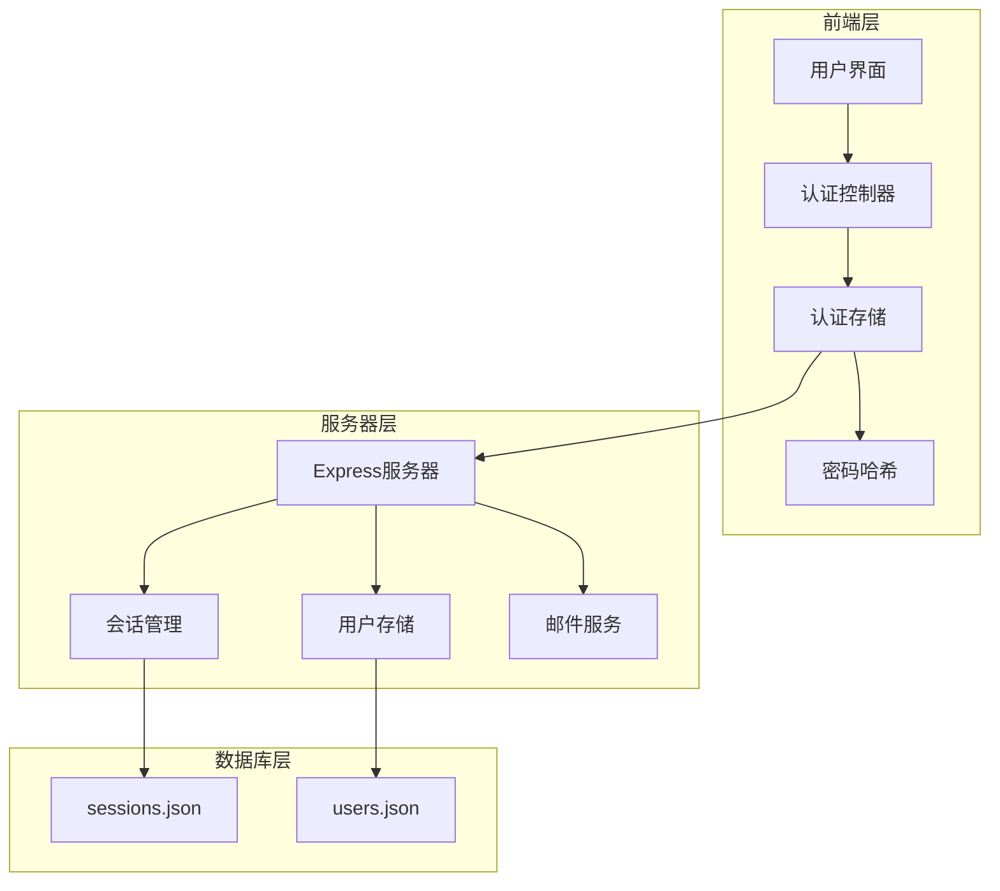
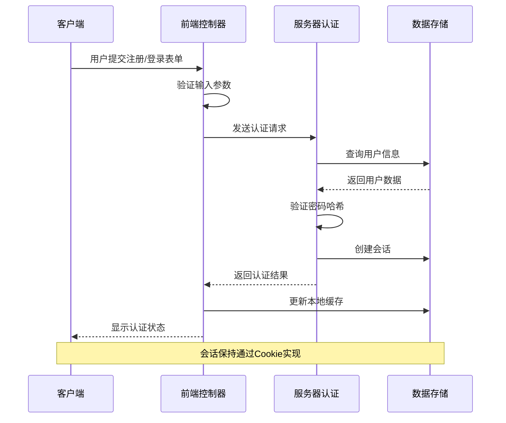
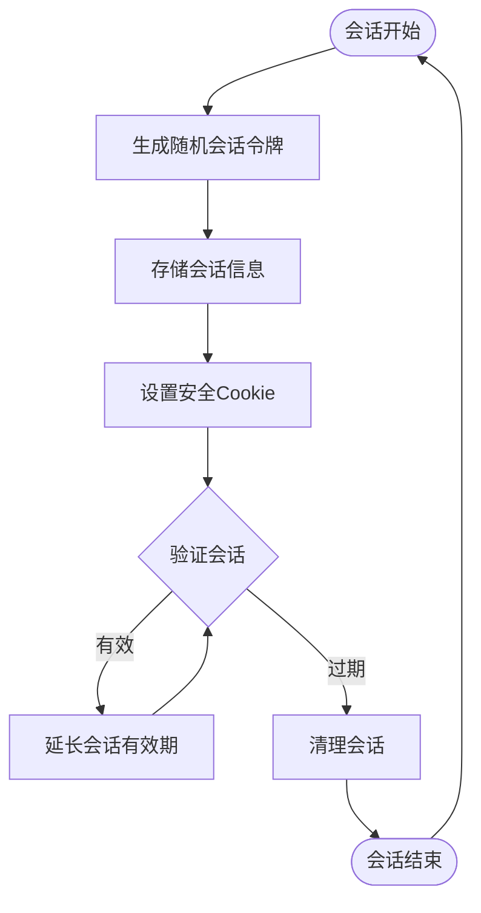
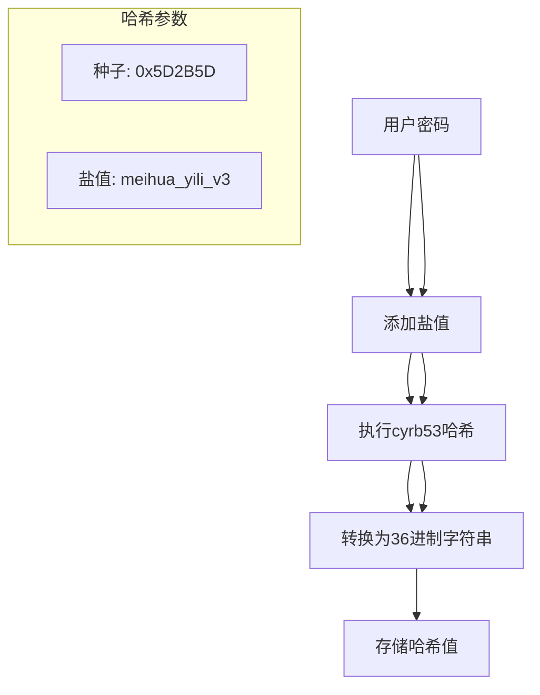
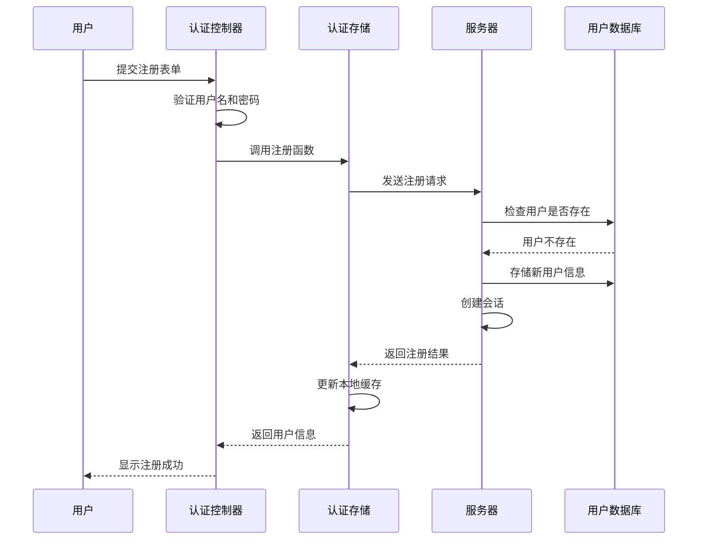
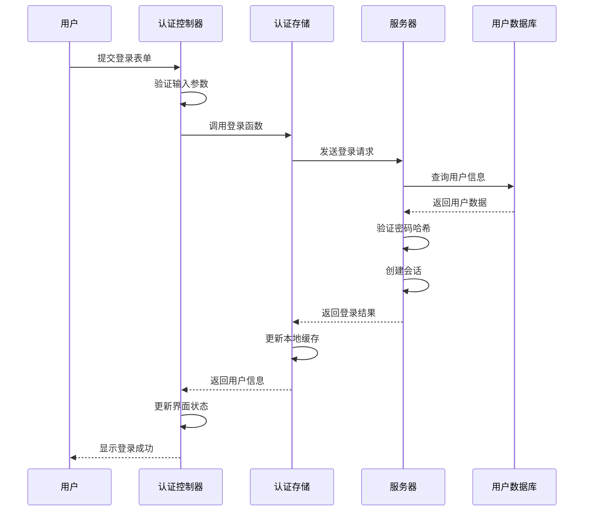
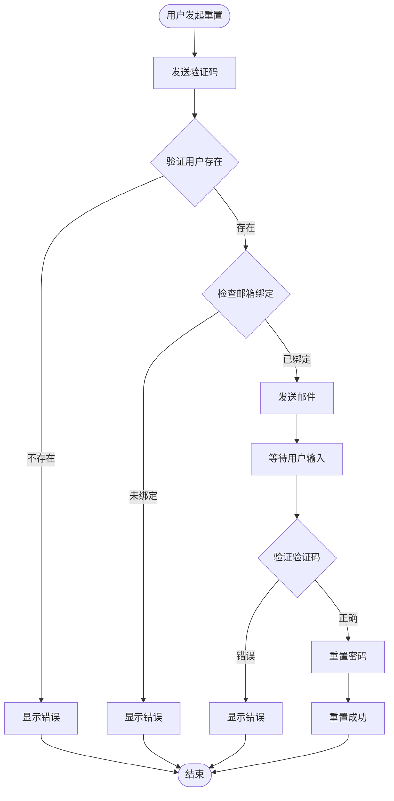
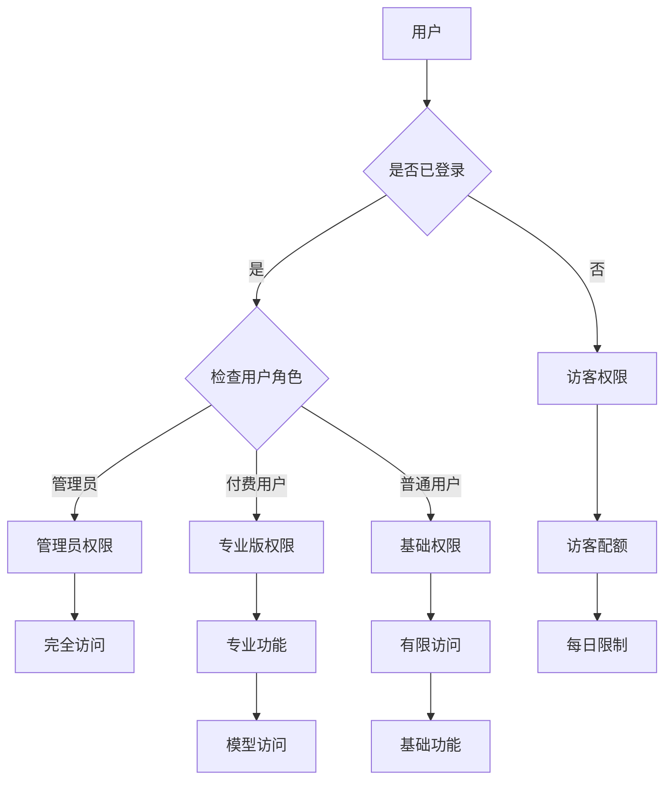
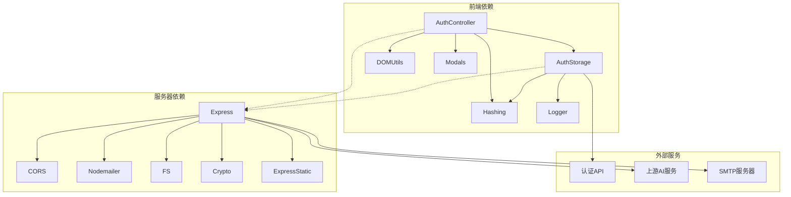

# 用户认证接口

<cite>
**本文档引用的文件**
- [auth-controller.js](file://src/controllers/auth-controller.js)
- [auth-storage.js](file://src/storage/auth.js)
- [hashing.js](file://src/utils/hashing.js)
- [server-index.js](file://server/index.js)
- [main.js](file://src/main.js)
- [modals.js](file://src/ui/modals.js)
- [vercel.json](file://vercel.json)
</cite>

## 目录
1. [简介](#简介)
2. [项目结构](#项目结构)
3. [核心组件](#核心组件)
4. [架构概览](#架构概览)
5. [详细组件分析](#详细组件分析)
6. [依赖关系分析](#依赖关系分析)
7. [性能考虑](#性能考虑)
8. [故障排除指南](#故障排除指南)
9. [结论](#结论)

## 简介

本文档详细描述了"梅花义理"AI占卜系统的用户认证接口规范。该系统采用基于会话的认证机制，结合本地存储和服务器端会话管理，提供完整的用户注册、登录、会话管理和权限控制功能。

系统的核心特点包括：
- 基于Express.js的服务器端认证服务
- 前端JavaScript控制器处理用户交互
- 本地存储与服务器同步的双重认证机制
- 完整的密码加密和会话管理
- 支持忘记密码和邮箱绑定功能

## 项目结构

认证系统由三个主要层次组成：

**图表来源**
- [auth-controller.js:1-592](file://src/controllers/auth-controller.js#L1-L592)
- [auth-storage.js:1-350](file://src/storage/auth.js#L1-L350)
- [server-index.js:1-668](file://server/index.js#L1-L668)

**章节来源**
- [auth-controller.js:1-592](file://src/controllers/auth-controller.js#L1-L592)
- [auth-storage.js:1-350](file://src/storage/auth.js#L1-L350)
- [server-index.js:1-668](file://server/index.js#L1-L668)

## 核心组件

### 认证控制器 (Auth Controller)
负责处理用户界面交互和认证逻辑：
- 用户注册和登录表单处理
- 密码输入辅助功能
- 忘记密码流程管理
- 用户权限检查
- 会话状态更新

### 认证存储 (Auth Storage)
提供认证相关的数据持久化：
- 用户信息存储和检索
- 本地缓存管理
- 服务器通信封装
- 会话状态同步

### 服务器认证服务
基于Express.js的完整认证服务：
- 会话Cookie管理
- 用户注册和登录处理
- 密码哈希验证
- 邮箱验证码发送
- 权限控制和安全检查

**章节来源**
- [auth-controller.js:251-310](file://src/controllers/auth-controller.js#L251-L310)
- [auth-storage.js:46-225](file://src/storage/auth.js#L46-L225)
- [server-index.js:279-487](file://server/index.js#L279-L487)

## 架构概览

系统采用前后端分离的架构设计，认证流程如下：

**图表来源**
- [auth-controller.js:251-310](file://src/controllers/auth-controller.js#L251-L310)
- [auth-storage.js:46-125](file://src/storage/auth.js#L46-L125)
- [server-index.js:302-319](file://server/index.js#L302-L319)

## 详细组件分析

### 会话管理系统

系统使用基于Cookie的会话管理机制：

**图表来源**
- [server-index.js:177-242](file://server/index.js#L177-L242)
- [auth-storage.js:194-225](file://src/storage/auth.js#L194-L225)

#### 会话配置参数
- 会话名称: `meihua_session`
- 会话有效期: 180天
- Cookie属性: httpOnly, secure, sameSite=lax
- 路径: `/`

#### 会话生命周期管理
1. **创建会话**: 用户登录成功后创建新的会话令牌
2. **会话验证**: 每次请求时验证会话有效性
3. **会话续期**: 活跃会话自动延长有效期
4. **过期清理**: 定期清理过期会话

**章节来源**
- [server-index.js:108-242](file://server/index.js#L108-L242)
- [auth-storage.js:194-225](file://src/storage/auth.js#L194-L225)

### 密码加密机制

系统采用自定义的密码哈希算法：

**图表来源**
- [hashing.js:4-19](file://src/utils/hashing.js#L4-L19)

#### 密码哈希特点
- 使用cyrb53算法进行哈希计算
- 固定盐值增强安全性
- 输出转换为36进制字符串便于存储
- 支持历史密码格式兼容

**章节来源**
- [hashing.js:1-20](file://src/utils/hashing.js#L1-L20)
- [auth-storage.js:48-86](file://src/storage/auth.js#L48-L86)

### 用户注册流程

**图表来源**
- [auth-controller.js:278-296](file://src/controllers/auth-controller.js#L278-L296)
- [auth-storage.js:89-125](file://src/storage/auth.js#L89-L125)
- [server-index.js:279-299](file://server/index.js#L279-L299)

#### 注册验证规则
- **用户名限制**: 1-20个字符，支持中英文、数字、下划线
- **密码限制**: 至少4个字符，最多64个字符
- **邮箱验证**: 可选，需符合标准邮箱格式
- **唯一性检查**: 用户名必须唯一

**章节来源**
- [auth-controller.js:247-275](file://src/controllers/auth-controller.js#L247-L275)
- [auth-storage.js:89-125](file://src/storage/auth.js#L89-L125)
- [server-index.js:288-292](file://server/index.js#L288-L292)

### 用户登录流程

**图表来源**
- [auth-controller.js:286-309](file://src/controllers/auth-controller.js#L286-L309)
- [auth-storage.js:46-87](file://src/storage/auth.js#L46-L87)
- [server-index.js:302-319](file://server/index.js#L302-L319)

#### 登录验证流程
1. **参数验证**: 检查用户名和密码是否为空
2. **服务器验证**: 通过API验证用户凭据
3. **本地回退**: 服务器不可用时使用本地存储验证
4. **会话创建**: 验证成功后创建会话Cookie
5. **状态同步**: 更新本地用户状态

**章节来源**
- [auth-controller.js:251-310](file://src/controllers/auth-controller.js#L251-L310)
- [auth-storage.js:46-87](file://src/storage/auth.js#L46-L87)

### 忘记密码功能

系统提供完整的密码重置功能：

**图表来源**
- [auth-controller.js:353-428](file://src/controllers/auth-controller.js#L353-L428)
- [auth-storage.js:127-146](file://src/storage/auth.js#L127-L146)
- [server-index.js:423-487](file://server/index.js#L423-L487)

#### 验证码机制
- **有效期**: 10分钟
- **发送频率**: 同一邮箱每60秒内只能发送一次
- **尝试限制**: 最多允许5次错误尝试
- **邮箱脱敏**: 在响应中显示部分脱敏邮箱

**章节来源**
- [auth-controller.js:353-428](file://src/controllers/auth-controller.js#L353-L428)
- [auth-storage.js:127-146](file://src/storage/auth.js#L127-L146)
- [server-index.js:423-487](file://server/index.js#L423-L487)

### 权限控制系统

系统实现了多层次的权限控制：

**图表来源**
- [auth-storage.js:232-247](file://src/storage/auth.js#L232-L247)
- [auth-controller.js:199-214](file://src/controllers/auth-controller.js#L199-L214)

#### 权限分级
- **管理员**: 特殊白名单用户，拥有最高权限
- **付费用户**: 通过VIP码获得专业功能
- **普通用户**: 基础功能访问权限
- **访客**: 有限的免费访问权限

**章节来源**
- [auth-storage.js:232-247](file://src/storage/auth.js#L232-L247)
- [auth-controller.js:199-214](file://src/controllers/auth-controller.js#L199-L214)

## 依赖关系分析

### 组件依赖图

**图表来源**
- [auth-controller.js:4-9](file://src/controllers/auth-controller.js#L4-L9)
- [auth-storage.js:5-6](file://src/storage/auth.js#L5-L6)
- [server-index.js:12-18](file://server/index.js#L12-L18)

### 数据流分析

认证系统的主要数据流包括：

1. **用户输入流**: 用户界面 → 认证控制器 → 认证存储 → 服务器
2. **会话管理流**: 服务器 → 会话存储 → Cookie → 客户端
3. **权限检查流**: 请求 → 会话验证 → 权限授权 → 资源访问
4. **状态同步流**: 服务器状态 → 本地缓存 → 界面更新

**章节来源**
- [auth-controller.js:251-310](file://src/controllers/auth-controller.js#L251-L310)
- [auth-storage.js:194-225](file://src/storage/auth.js#L194-L225)
- [server-index.js:321-338](file://server/index.js#L321-L338)

## 性能考虑

### 会话优化策略
- **会话预清理**: 启动时清理过期会话，减少存储压力
- **动态续期**: 活跃会话自动延长有效期，提升用户体验
- **内存管理**: 使用Map结构存储验证码，避免磁盘I/O

### 前端性能优化
- **本地缓存**: 用户信息和会话状态本地持久化
- **异步操作**: 所有网络请求采用异步处理，避免阻塞
- **状态同步**: 后台静默验证会话，不影响用户操作

### 安全性能平衡
- **密码哈希**: 自定义算法在安全性与性能间取得平衡
- **会话Cookie**: 安全属性配置确保传输安全
- **输入验证**: 前后端双重验证防止恶意输入

## 故障排除指南

### 常见认证问题

#### 登录失败
**症状**: 用户无法登录，显示"用户名或密码错误"
**可能原因**:
- 密码哈希不匹配
- 用户名大小写问题
- 服务器连接失败

**解决方案**:
1. 检查用户名是否正确（大小写敏感）
2. 确认密码哈希算法一致性
3. 验证服务器连接状态

#### 会话过期
**症状**: 登录后一段时间自动退出
**可能原因**:
- 会话Cookie丢失
- 会话有效期过期
- 浏览器Cookie设置问题

**解决方案**:
1. 检查浏览器Cookie设置
2. 验证会话Cookie是否正确设置
3. 确认服务器时间同步

#### 注册冲突
**症状**: 用户注册时报"用户已存在"
**可能原因**:
- 用户名已被占用
- 服务器数据不一致
- 并发注册冲突

**解决方案**:
1. 更换用户名
2. 清理本地缓存后重试
3. 稍后重试注册操作

### 调试工具

#### 前端调试
- 使用浏览器开发者工具查看网络请求
- 检查localStorage中的用户信息
- 监控认证控制器的状态变化

#### 服务器调试
- 查看服务器日志输出
- 检查会话文件状态
- 验证用户数据库完整性

**章节来源**
- [auth-controller.js:251-310](file://src/controllers/auth-controller.js#L251-L310)
- [server-index.js:148-175](file://server/index.js#L148-L175)

## 结论

"梅花义理"用户认证系统采用现代化的前后端分离架构，结合会话管理和本地缓存机制，提供了安全可靠的用户认证体验。系统的主要优势包括：

1. **安全性**: 基于会话的认证机制，配合安全的Cookie配置
2. **可靠性**: 前后端双重验证，支持服务器不可用时的本地回退
3. **用户体验**: 无缝的会话管理和权限控制
4. **可扩展性**: 模块化的架构设计，便于功能扩展

系统在密码加密、会话管理、权限控制等方面都采用了成熟的技术方案，能够满足AI占卜应用的安全需求。通过合理的错误处理和用户反馈机制，确保了良好的用户体验。