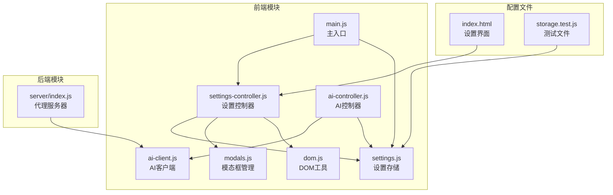
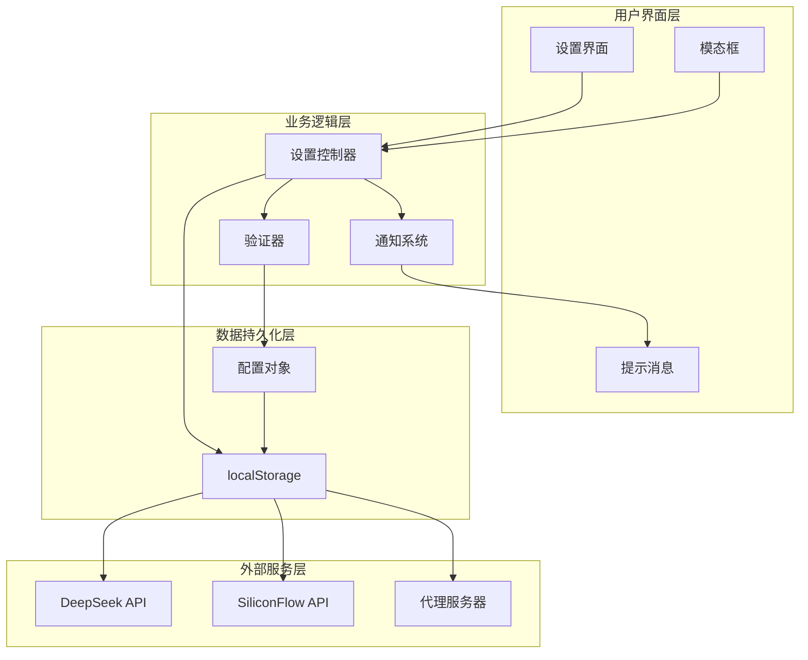
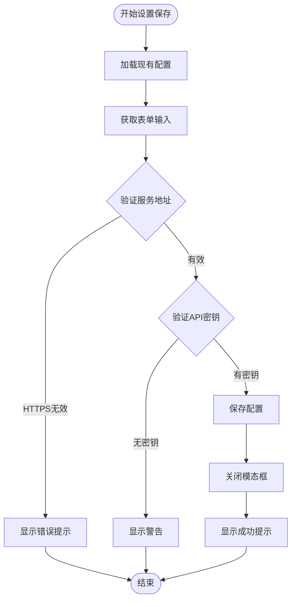
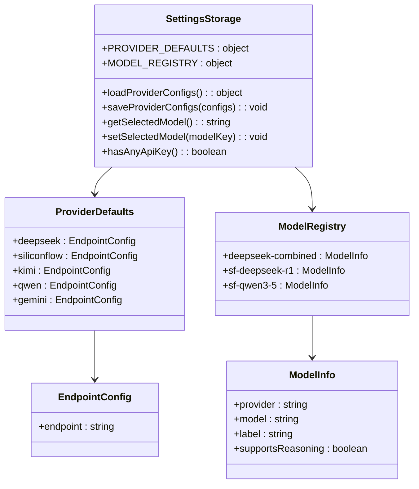
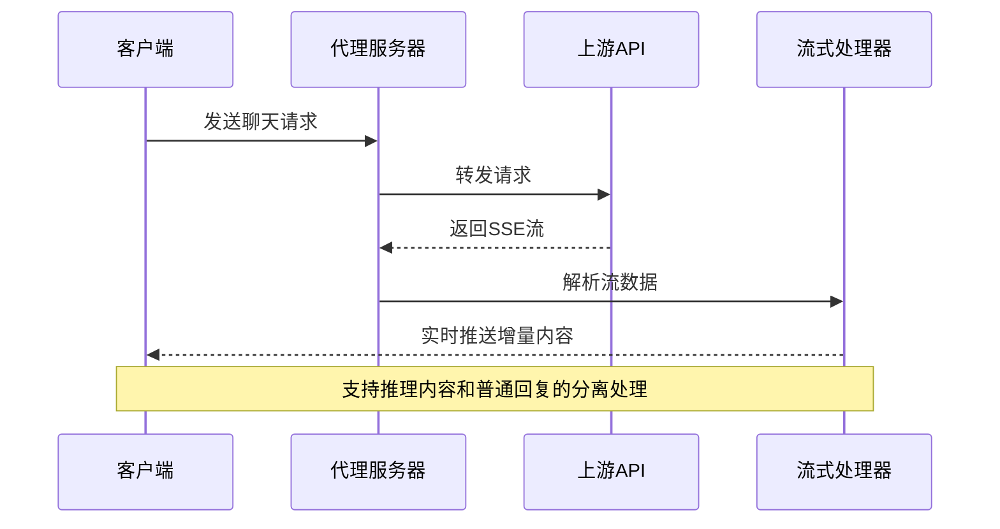
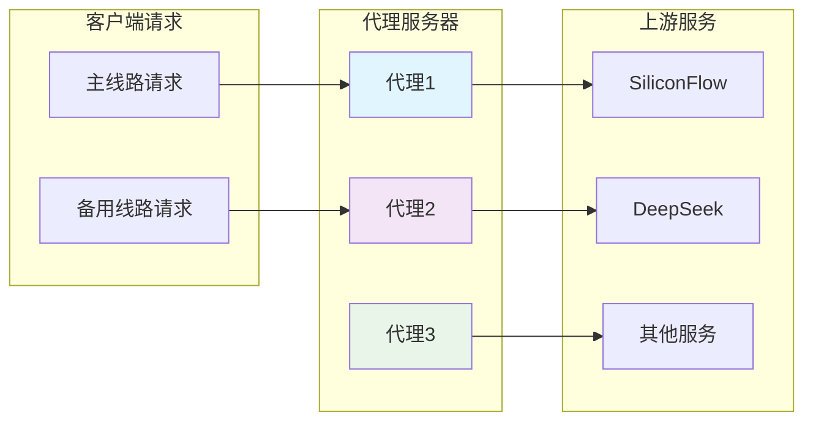
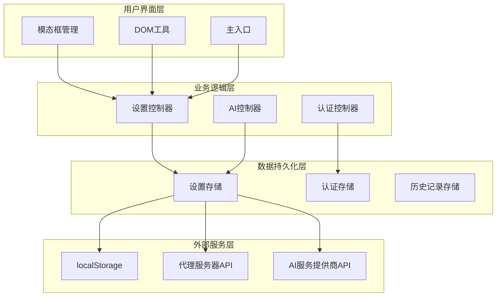

# 系统设置接口

<cite>
**本文档引用的文件**
- [settings-controller.js](file://src/controllers/settings-controller.js)
- [settings.js](file://src/storage/settings.js)
- [ai-client.js](file://src/api/ai-client.js)
- [index.js](file://server/index.js)
- [modals.js](file://src/ui/modals.js)
- [main.js](file://src/main.js)
- [dom.js](file://src/utils/dom.js)
- [ai-controller.js](file://src/controllers/ai-controller.js)
- [storage.test.js](file://__tests__/storage.test.js)
- [index.html](file://index.html)
</cite>

## 目录
1. [简介](#简介)
2. [项目结构](#项目结构)
3. [核心组件](#核心组件)
4. [架构概览](#架构概览)
5. [详细组件分析](#详细组件分析)
6. [依赖关系分析](#依赖关系分析)
7. [性能考虑](#性能考虑)
8. [故障排除指南](#故障排除指南)
9. [结论](#结论)
10. [附录](#附录)

## 简介

系统设置管理接口是"梅花义理"数智决策系统的核心配置管理模块，负责管理用户偏好设置、系统配置、模型选择等关键功能。该系统采用前后端分离架构，前端使用JavaScript构建用户界面，后端基于Node.js和Express提供代理服务。

系统设置接口主要包含以下功能：
- API密钥配置管理（DeepSeek、SiliconFlow等）
- 模型选择和切换
- 本地存储和持久化
- 设置验证和安全防护
- 实时生效机制
- 设置导入导出功能

## 项目结构

系统设置相关的文件组织结构如下：



**图表来源**
- [settings-controller.js:1-71](file://src/controllers/settings-controller.js#L1-L71)
- [settings.js:1-86](file://src/storage/settings.js#L1-L86)
- [server/index.js:1-668](file://server/index.js#L1-L668)

**章节来源**
- [settings-controller.js:1-71](file://src/controllers/settings-controller.js#L1-L71)
- [settings.js:1-86](file://src/storage/settings.js#L1-L86)
- [server/index.js:1-668](file://server/index.js#L1-L668)

## 核心组件

系统设置接口由多个核心组件构成，每个组件都有明确的职责分工：

### 设置控制器 (Settings Controller)
负责处理设置界面的用户交互逻辑，包括设置表单的加载、验证和保存操作。

### 设置存储 (Settings Storage)
提供设置数据的持久化存储功能，使用localStorage进行本地数据管理。

### AI客户端 (AI Client)
处理与AI服务提供商的通信，支持代理模式和直接连接模式。

### 代理服务器 (Proxy Server)
运行在后端的代理服务，提供API密钥的安全管理和多线路备份功能。

**章节来源**
- [settings-controller.js:12-70](file://src/controllers/settings-controller.js#L12-L70)
- [settings.js:38-85](file://src/storage/settings.js#L38-L85)
- [ai-client.js:31-76](file://src/api/ai-client.js#L31-L76)
- [server/index.js:514-646](file://server/index.js#L514-L646)

## 架构概览

系统采用分层架构设计，确保设置管理功能的模块化和可维护性：



**图表来源**
- [settings-controller.js:12-54](file://src/controllers/settings-controller.js#L12-L54)
- [settings.js:38-73](file://src/storage/settings.js#L38-L73)
- [ai-client.js:31-184](file://src/api/ai-client.js#L31-L184)

## 详细组件分析

### 设置控制器组件

设置控制器是系统设置接口的核心，负责处理用户的所有设置操作：

#### 主要功能
- 设置表单数据加载和填充
- API密钥配置验证
- 设置数据保存和持久化
- 错误处理和用户反馈

#### 数据验证机制



**图表来源**
- [settings-controller.js:12-54](file://src/controllers/settings-controller.js#L12-L54)

#### 设置验证规则
- 服务地址必须为有效的HTTPS URL
- 至少需要配置一个API密钥
- 支持主线路和备用线路的独立配置

**章节来源**
- [settings-controller.js:12-54](file://src/controllers/settings-controller.js#L12-L54)

### 设置存储组件

设置存储组件提供完整的数据持久化功能：

#### 数据结构定义

| 设置项 | 类型 | 默认值 | 描述 |
|--------|------|--------|------|
| deepseek.key | string | 无 | DeepSeek API密钥 |
| deepseek.endpoint | string | https://api.deepseek.com/chat/completions | DeepSeek服务地址 |
| siliconflow.key | string | 无 | SiliconFlow API密钥 |
| siliconflow.endpoint | string | https://api.siliconflow.cn/v1/chat/completions | SiliconFlow服务地址 |
| selected_model | string | deepseek-combined | 当前选中的模型 |

#### 默认配置管理



**图表来源**
- [settings.js:9-36](file://src/storage/settings.js#L9-L36)

#### 数据持久化机制

设置数据采用localStorage进行本地持久化，确保用户配置在浏览器会话间保持一致。

**章节来源**
- [settings.js:9-85](file://src/storage/settings.js#L9-L85)

### AI客户端组件

AI客户端组件处理与AI服务提供商的通信，支持多种连接模式：

#### 连接模式

| 模式 | 特征 | 使用场景 |
|------|------|----------|
| 直连模式 | API密钥在浏览器中传输 | 开发调试、测试环境 |
| 代理模式 | API密钥通过服务器中转 | 生产环境、安全要求高 |
| 备线模式 | 多个服务提供商备用 | 高可用性需求 |

#### 流式响应处理



**图表来源**
- [ai-client.js:31-184](file://src/api/ai-client.js#L31-L184)

**章节来源**
- [ai-client.js:31-184](file://src/api/ai-client.js#L31-L184)

### 代理服务器组件

代理服务器提供企业级的安全和可靠性保障：

#### 多线路备份架构



**图表来源**
- [server/index.js:42-56](file://server/index.js#L42-L56)

#### 安全特性
- CORS跨域控制
- API密钥安全存储
- 请求限流和防刷机制
- 日志审计功能

**章节来源**
- [server/index.js:42-56](file://server/index.js#L42-L56)

## 依赖关系分析

系统设置接口的依赖关系呈现清晰的层次化结构：



**图表来源**
- [main.js:44-45](file://src/main.js#L44-L45)
- [settings-controller.js:4-10](file://src/controllers/settings-controller.js#L4-L10)
- [settings.js:38-73](file://src/storage/settings.js#L38-L73)

### 组件耦合度分析

系统设置接口展现了良好的模块化设计：
- **低耦合**: 各组件职责明确，相互依赖最小化
- **高内聚**: 相关功能集中在单一模块中
- **可扩展性**: 新增设置项只需扩展配置对象
- **可测试性**: 每个组件都有对应的测试用例

**章节来源**
- [main.js:44-45](file://src/main.js#L44-L45)
- [settings-controller.js:4-10](file://src/controllers/settings-controller.js#L4-L10)

## 性能考虑

系统设置接口在性能方面采用了多项优化策略：

### 缓存策略
- 设置数据在localStorage中缓存，减少重复加载
- 模型选择状态即时生效，避免不必要的网络请求
- 代理服务器使用连接池管理上游连接

### 并发处理
- 流式响应处理支持实时内容渲染
- 多线路备份提供负载均衡
- 请求超时和重试机制确保稳定性

### 内存管理
- 及时清理DOM事件监听器
- 合理的定时器管理
- 避免内存泄漏的资源释放

## 故障排除指南

### 常见问题及解决方案

#### 设置保存失败
**症状**: 保存设置后配置丢失
**原因**: localStorage访问权限问题或存储空间不足
**解决**: 检查浏览器隐私设置，清理过期数据

#### API密钥验证失败
**症状**: 提示密钥无效或权限不足
**原因**: 密钥格式错误或服务提供商限制
**解决**: 确认密钥格式正确，检查服务提供商状态

#### 代理连接超时
**症状**: 代理服务器响应缓慢或超时
**原因**: 网络连接问题或上游服务不可用
**解决**: 检查网络连接，切换到备用线路

#### 模型切换不生效
**症状**: 更换模型后仍使用旧模型
**原因**: 浏览器缓存或localStorage同步问题
**解决**: 刷新页面，检查localStorage数据

**章节来源**
- [settings-controller.js:27-34](file://src/controllers/settings-controller.js#L27-L34)
- [ai-client.js:56-76](file://src/api/ai-client.js#L56-L76)

## 结论

系统设置管理接口展现了现代Web应用的优秀实践，具有以下特点：

### 技术优势
- **模块化设计**: 清晰的职责分离和依赖管理
- **安全性考虑**: 多层防护机制和数据加密
- **用户体验**: 即时反馈和流畅的交互体验
- **可扩展性**: 灵活的配置管理和插件化架构

### 架构亮点
- **前后端协作**: 前端负责用户交互，后端提供安全保障
- **多线路备份**: 确保服务的高可用性和稳定性
- **实时通信**: 支持流式响应和即时内容更新
- **配置管理**: 完整的设置生命周期管理

该系统设置接口为"梅花义理"数智决策系统提供了坚实的技术基础，能够满足专业用户的复杂配置需求，同时保持系统的易用性和可靠性。

## 附录

### 设置项完整列表

| 设置项 | 类型 | 必填 | 默认值 | 描述 |
|--------|------|------|--------|------|
| deepseek.key | string | 否 | 无 | DeepSeek API密钥 |
| deepseek.endpoint | string | 否 | https://api.deepseek.com/chat/completions | DeepSeek服务地址 |
| siliconflow.key | string | 否 | 无 | SiliconFlow API密钥 |
| siliconflow.endpoint | string | 否 | https://api.siliconflow.cn/v1/chat/completions | SiliconFlow服务地址 |
| selected_model | string | 否 | deepseek-combined | 当前选中的模型 |

### 数据格式说明

#### 设置配置对象结构
```javascript
{
  deepseek: {
    key: string,
    endpoint: string
  },
  siliconflow: {
    key: string,
    endpoint: string
  }
}
```

#### 模型注册表结构
```javascript
{
  'deepseek-combined': {
    provider: 'deepseek',
    model: 'deepseek-reasoner',
    label: '推演引擎 · 主线',
    supportsReasoning: true
  }
}
```

### 版本管理与兼容性

系统采用语义化版本控制，当前版本为3.8.0。设置接口遵循向后兼容原则，新增功能不会破坏现有配置。

### 设置导入导出功能

系统提供完整的设置导入导出能力：
- **导入**: 支持从JSON文件恢复设置配置
- **导出**: 将当前设置转换为可分享的JSON格式
- **备份**: 自动备份重要配置数据
- **恢复**: 支持一键恢复到默认设置

**章节来源**
- [settings.js:9-36](file://src/storage/settings.js#L9-L36)
- [settings.js:38-85](file://src/storage/settings.js#L38-L85)