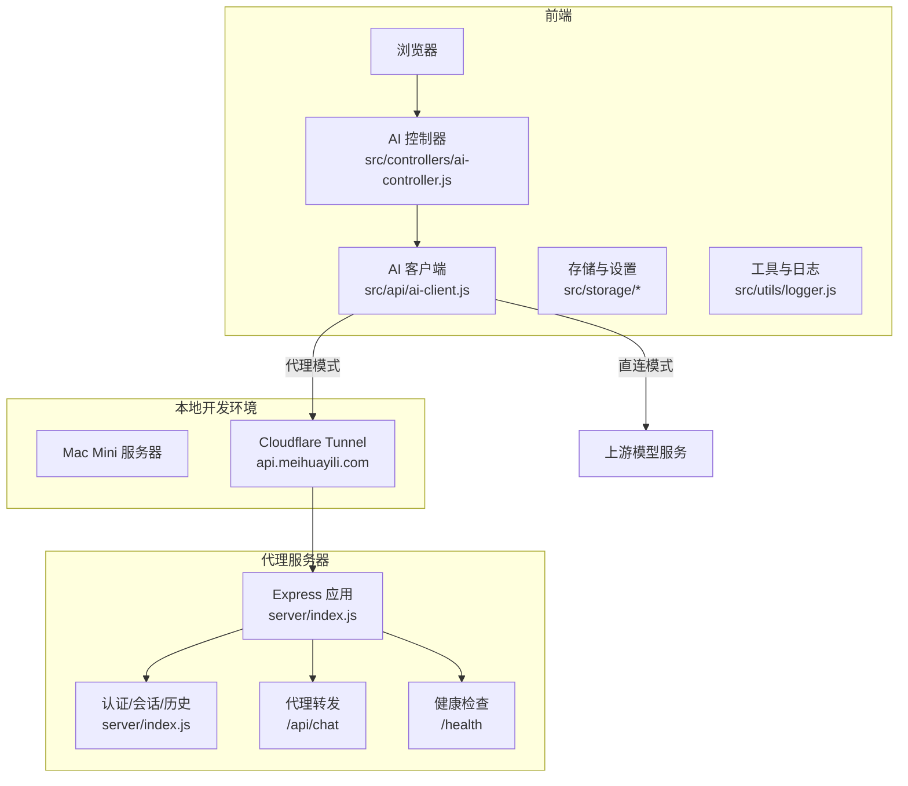
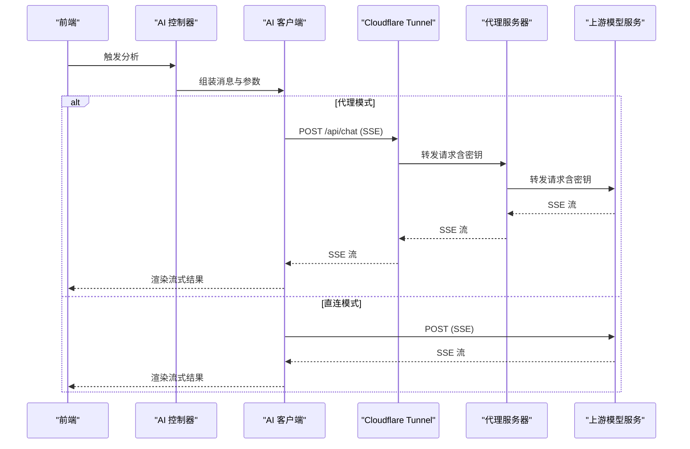
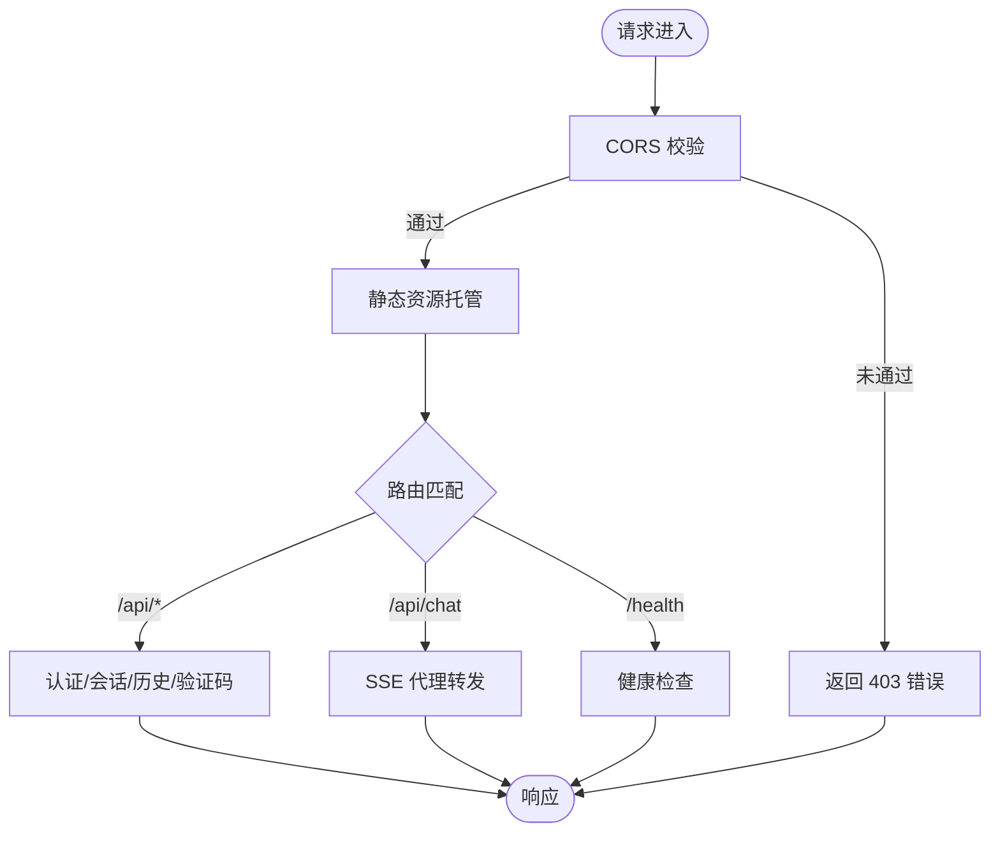
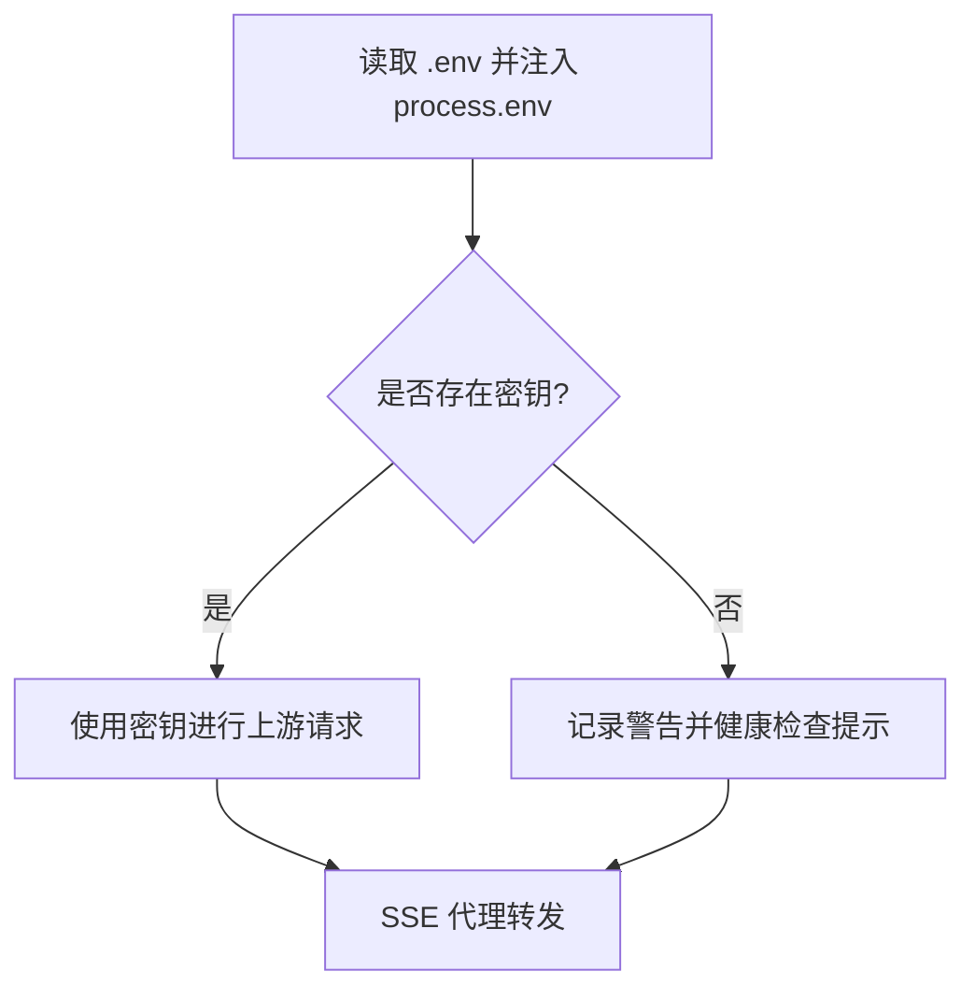
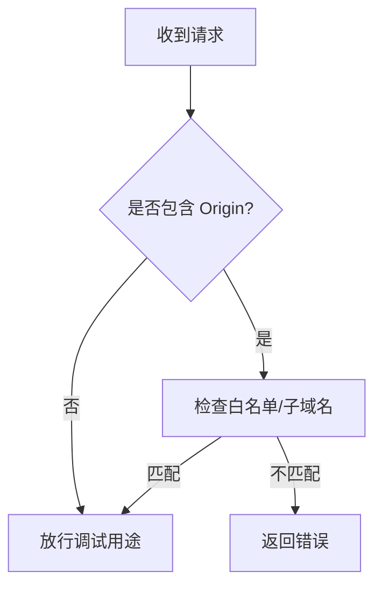
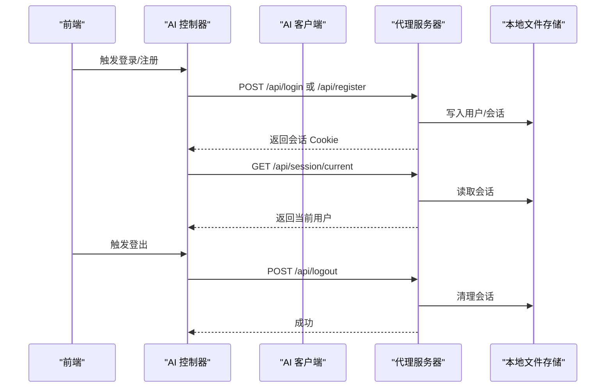
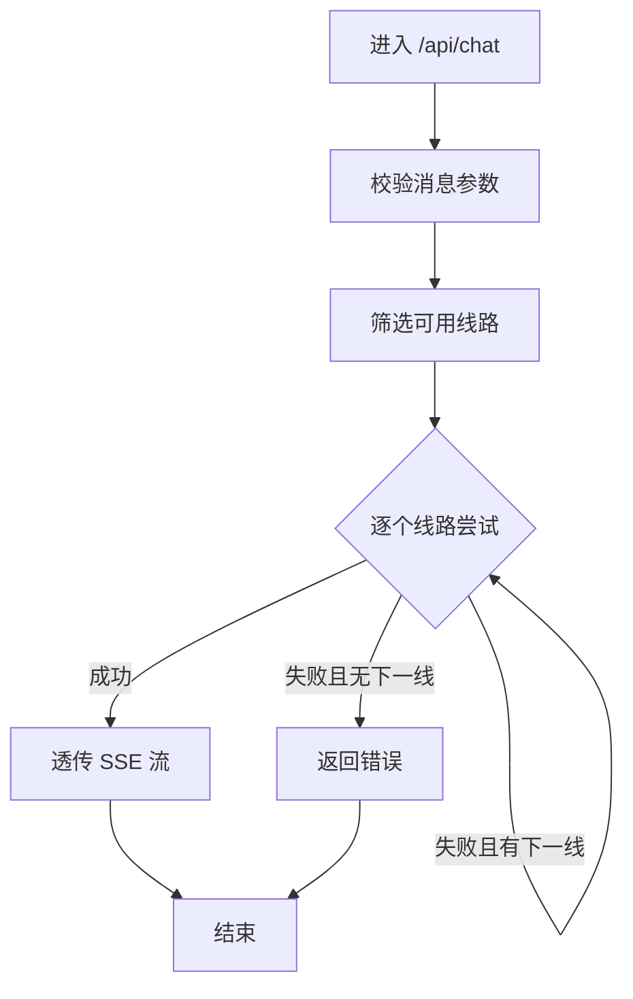
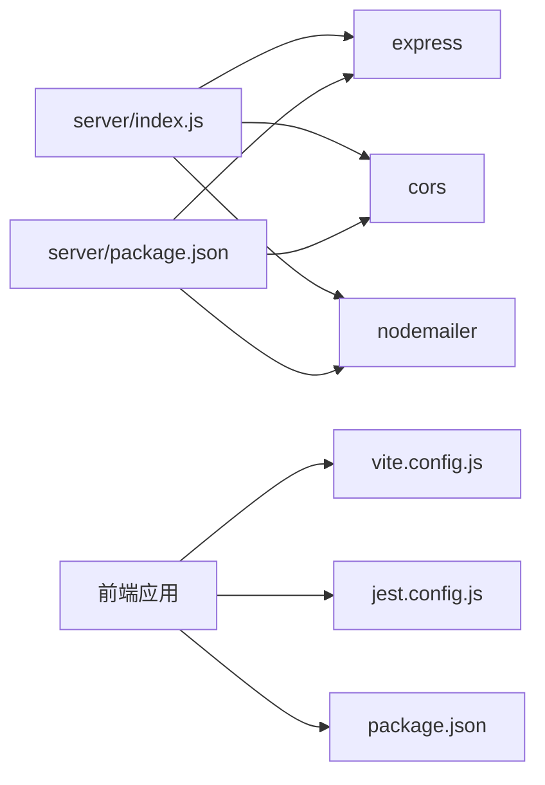

# 代理服务器

<cite>
**本文引用的文件**   
- [server/index.js](file://server/index.js)
- [server/package.json](file://server/package.json)
- [server/README.md](file://server/README.md)
- [src/api/ai-client.js](file://src/api/ai-client.js)
- [src/storage/settings.js](file://src/storage/settings.js)
- [src/utils/logger.js](file://src/utils/logger.js)
- [vite.config.js](file://vite.config.js)
- [vercel.json](file://vercel.json)
- [package.json](file://package.json)
</cite>

## 更新摘要
**所做更改**   
- 更新部署架构以反映本地开发场景的简化配置
- 移除Vercel云部署配置，专注于Mac Mini本地运行
- 增加Cloudflare Tunnel外网访问配置指南
- 更新代理服务器启动和监控方法
- 简化环境变量配置和API密钥管理流程

## 目录
1. [简介](#简介)
2. [项目结构](#项目结构)
3. [核心组件](#核心组件)
4. [架构总览](#架构总览)
5. [详细组件分析](#详细组件分析)
6. [依赖分析](#依赖分析)
7. [性能考虑](#性能考虑)
8. [故障排查指南](#故障排查指南)
9. [结论](#结论)
10. [附录](#附录)

## 简介
本项目为"梅花义理"的代理服务器，专为Mac Mini本地开发场景设计，核心目标是将第三方 AI 接口的 API 密钥完全保留在服务端，确保客户端（浏览器）永不直接接触密钥，从而提升安全性与合规性。代理服务器提供健康检查、会话与认证、历史记录、邮件验证码、以及核心的流式代理接口，用于将前端请求透明转发至上游模型服务，并以 Server-Sent Events（SSE）形式回传流式结果。

**更新** 服务器现在专注于本地开发场景，移除了云部署配置选项，专门支持Mac Mini作为代理服务器运行。通过Cloudflare Tunnel实现外网访问，确保本地开发的安全性和便利性。

## 项目结构
- 服务端（server）：基于 Express 的 Node.js 服务，负责认证、会话、历史、邮件、代理转发与健康检查，专为Mac Mini设计。
- 前端（src）：Vite 构建，包含 AI 客户端、控制器、存储与工具模块，支持代理模式与直连模式两种调用路径。
- 部署与构建：本地开发配置、Cloudflare Tunnel外网访问、Vite 构建配置。

**图表来源**
- [server/index.js:64-100](file://server/index.js#L64-L100)
- [src/api/ai-client.js:12-25](file://src/api/ai-client.js#L12-L25)
- [server/README.md:79-101](file://server/README.md#L79-L101)

**章节来源**
- [server/index.js:1-100](file://server/index.js#L1-L100)
- [server/README.md:1-101](file://server/README.md#L1-L101)
- [vite.config.js:1-20](file://vite.config.js#L1-L20)

## 核心组件
- Express 应用与中间件
  - CORS 白名单与凭据支持，限制方法与头部，保障跨域安全。
  - JSON 请求体解析与静态资源托管（国内加速）。
- 认证与会话
  - 用户注册/登录/登出、会话创建与过期清理、Cookie 安全策略（HttpOnly、Secure、SameSite、Max-Age）。
- 存储与历史
  - 用户、会话、历史记录的本地文件存储与云端同步。
- 邮件验证码
  - 使用 SMTP 发送验证码邮件，内存存储验证码与防刷控制。
- 代理转发
  - SSE 流式代理，支持多线路自动降级、超时控制、中途中断与错误透传。
- 健康检查
  - 返回服务状态与已配置上游线路列表。

**章节来源**
- [server/index.js:64-100](file://server/index.js#L64-L100)
- [server/index.js:102-242](file://server/index.js#L102-L242)
- [server/index.js:278-487](file://server/index.js#L278-L487)
- [server/index.js:513-646](file://server/index.js#L513-L646)
- [server/index.js:92-100](file://server/index.js#L92-L100)

## 架构总览
代理服务器采用"前端直连/代理转发"双模式，专为Mac Mini本地开发场景设计：
- 代理模式：前端将消息发送到Cloudflare Tunnel提供的外网地址，代理服务器以 SSE 形式回传流式结果。
- 直连模式：前端直接调用上游接口，密钥在浏览器端携带。

**更新** 架构现在专注于本地开发，通过Cloudflare Tunnel实现外网访问，确保开发过程中的安全性和便利性。

**图表来源**
- [src/api/ai-client.js:31-76](file://src/api/ai-client.js#L31-L76)
- [src/api/ai-client.js:78-184](file://src/api/ai-client.js#L78-L184)
- [server/index.js:513-646](file://server/index.js#L513-L646)
- [server/README.md:79-101](file://server/README.md#L79-L101)

## 详细组件分析

### Express 服务器与路由
- CORS 配置
  - 允许来源白名单（含子域名），支持凭据与指定方法/头部。
- 静态资源
  - 若存在 dist 目录，托管前端静态文件，资产目录长期缓存，其他文件禁用缓存。
- 健康检查
  - GET /health 返回服务状态与已配置线路。
- 会话与认证
  - 注册、登录、当前会话、登出、管理员统计、绑定邮箱、改密、验证码发送与重置。
- 历史记录
  - 保存与加载用户历史记录，支持云端同步。
- 代理接口
  - POST /api/chat 以 SSE 转发上游响应，支持多线路自动降级与超时控制。

**图表来源**
- [server/index.js:64-100](file://server/index.js#L64-L100)
- [server/index.js:278-487](file://server/index.js#L278-L487)
- [server/index.js:513-646](file://server/index.js#L513-L646)
- [server/index.js:92-100](file://server/index.js#L92-L100)

**章节来源**
- [server/index.js:64-100](file://server/index.js#L64-L100)
- [server/index.js:278-487](file://server/index.js#L278-L487)
- [server/index.js:513-646](file://server/index.js#L513-L646)
- [server/index.js:92-100](file://server/index.js#L92-L100)

### API 密钥管理与环境变量
- .env 加载机制
  - 服务启动时读取 .env 文件，逐行解析键值对并注入到 process.env（若未被覆盖）。
- 上游密钥配置
  - 支持多条线路（主/备），每条线路包含 endpoint、model 与密钥。
  - 若未配置任何密钥，健康检查会提示并记录警告。
- 前端密钥策略
  - 前端 settings.js 提供内置运营密钥占位，但默认不返回密钥；若用户未配置，将提示前往设置页配置。
  - 代理模式下，前端不携带密钥，由代理服务器在服务端注入 Authorization。

**更新** 环境变量配置现在更加简洁，专注于本地开发场景，移除了复杂的云部署配置。

**图表来源**
- [server/index.js:20-35](file://server/index.js#L20-L35)
- [server/index.js:42-56](file://server/index.js#L42-L56)
- [src/storage/settings.js:5-7](file://src/storage/settings.js#L5-L7)
- [src/storage/settings.js:38-69](file://src/storage/settings.js#L38-L69)

**章节来源**
- [server/index.js:20-35](file://server/index.js#L20-L35)
- [server/index.js:42-56](file://server/index.js#L42-L56)
- [src/storage/settings.js:5-7](file://src/storage/settings.js#L5-L7)
- [src/storage/settings.js:38-69](file://src/storage/settings.js#L38-L69)

### CORS 策略与跨域处理
- 允许来源
  - 支持显式白名单与子域名通配（.meihuayili.com）。
- 凭据与方法
  - 允许 Credentials，支持 GET/POST/OPTIONS，允许 Content-Type。
- 无 Origin 场景
  - curl 等无 Origin 的场景默认放行，便于调试。

**图表来源**
- [server/index.js:66-78](file://server/index.js#L66-L78)

**章节来源**
- [server/index.js:66-78](file://server/index.js#L66-L78)

### 会话与认证流程
- 注册/登录
  - 前端提交加密后的密码哈希，服务端校验并创建会话 Cookie。
- 当前会话
  - 读取 Cookie 获取会话，若失效则清理并返回未认证。
- 登出
  - 删除会话并清除 Cookie。
- 管理员功能
  - 统计用户、重置密码等。

**图表来源**
- [server/index.js:278-345](file://server/index.js#L278-L345)
- [src/storage/auth.js:46-87](file://src/storage/auth.js#L46-87)
- [src/storage/auth.js:194-217](file://src/storage/auth.js#L194-217)

**章节来源**
- [server/index.js:278-345](file://server/index.js#L278-L345)
- [src/storage/auth.js:46-87](file://src/storage/auth.js#L46-87)
- [src/storage/auth.js:194-217](file://src/storage/auth.js#L194-217)

### 代理转发与流式处理
- SSE 透传
  - 设置必要的响应头，保持连接与无缓冲，逐块转发上游流。
- 多线路降级
  - 按顺序尝试可用线路，遇错误自动切换下一线路，最后失败时返回错误。
- 超时与中断
  - 统一超时控制与客户端断开监听，避免僵尸连接。
- 错误处理
  - 将上游错误与网络错误分类，必要时返回可读错误信息。

**图表来源**
- [server/index.js:513-646](file://server/index.js#L513-L646)

**章节来源**
- [server/index.js:513-646](file://server/index.js#L513-L646)

### 日志与错误处理
- 日志级别
  - 生产环境仅输出 warn 及以上级别，开发环境输出 debug 及以上。
- 错误处理
  - 代理转发捕获超时、网络与上游错误，必要时返回可读错误；前端根据错误类型提示重试或继续。

**章节来源**
- [src/utils/logger.js:1-34](file://src/utils/logger.js#L1-L34)
- [src/api/ai-client.js:45-76](file://src/api/ai-client.js#L45-L76)
- [src/api/ai-client.js:478-522](file://src/api/ai-client.js#L478-L522)

## 依赖分析
- 服务端依赖
  - express、cors、dotenv、nodemailer。
- 前端构建与测试
  - Vite、Jest、ESLint；Vite 插件移除 crossorigin 避免微信浏览器 CORS 问题。
- 部署与缓存
  - Vercel 配置 HTML 与 sw.js 的缓存头，避免缓存带来的问题。

**更新** 移除了Vercel云部署配置，专注于本地开发依赖。

**图表来源**
- [server/package.json:11-16](file://server/package.json#L11-L16)
- [vite.config.js:1-20](file://vite.config.js#L1-L20)
- [jest.config.js:1-43](file://jest.config.js#L1-L43)
- [package.json:1-32](file://package.json#L1-L32)

**章节来源**
- [server/package.json:11-16](file://server/package.json#L11-L16)
- [vite.config.js:1-20](file://vite.config.js#L1-L20)
- [jest.config.js:1-43](file://jest.config.js#L1-L43)
- [package.json:1-32](file://package.json#L1-L32)

## 性能考虑
- SSE 与流式传输
  - 代理服务器设置 X-Accel-Buffering=no 与 flushHeaders，避免中间层缓存导致延迟。
- 超时与降级
  - 统一超时时间与多线路降级，提升可用性与稳定性。
- 静态资源缓存
  - 前端资产目录长期缓存，HTML 等文件禁用缓存，兼顾性能与更新及时性。
- 前端构建优化
  - 移除 crossorigin 避免微信浏览器兼容问题；禁用 modulePreload polyfill 降低开销。

**章节来源**
- [server/index.js:527-533](file://server/index.js#L527-L533)
- [vite.config.js:1-20](file://vite.config.js#L1-L20)
- [vercel.json:1-23](file://vercel.json#L1-L23)

## 故障排查指南
- 未配置 API 密钥
  - 症状：健康检查提示未配置密钥。
  - 处理：在 .env 中填写 SF_API_KEY/DS_API_KEY，并重启服务。
- CORS 跨域失败
  - 症状：浏览器报跨域错误。
  - 处理：确认请求来源在 ALLOWED_ORIGINS 白名单内，或使用子域名通配。
- 会话异常
  - 症状：登录后仍提示未登录。
  - 处理：检查 Cookie 是否包含、Secure 与 SameSite 设置是否与站点一致；清理无效会话。
- 代理超时或中断
  - 症状：SSE 流中断或超时。
  - 处理：检查上游服务状态、网络连通性与超时阈值；必要时切换到备线。
- 邮件验证码发送失败
  - 症状：验证码发送接口返回 500。
  - 处理：检查 SMTP 配置与网络；查看服务端错误日志。
- Cloudflare Tunnel 连接问题
  - 症状：外网无法访问本地代理服务器。
  - 处理：检查 cloudflared 服务状态、隧道配置与DNS记录。

**更新** 新增Cloudflare Tunnel相关的故障排查指南。

**章节来源**
- [server/index.js:656-667](file://server/index.js#L656-L667)
- [server/index.js:66-78](file://server/index.js#L66-L78)
- [server/index.js:102-242](file://server/index.js#L102-L242)
- [server/index.js:538-631](file://server/index.js#L538-L631)
- [server/index.js:114-146](file://server/index.js#L114-L146)
- [server/README.md:79-101](file://server/README.md#L79-L101)

## 结论
本代理服务器通过"代理模式"将 API 密钥完全置于服务端，配合严格的 CORS 与 Cookie 安全策略，有效保护密钥与用户隐私。其多线路自动降级与 SSE 流式转发能力，兼顾了稳定性与用户体验。**更新** 现在专注于本地开发场景，通过Cloudflare Tunnel实现外网访问，确保开发过程中的安全性和便利性。建议在生产环境中启用 HTTPS、合理设置超时与缓存策略，并持续监控健康检查与日志，确保服务稳定运行。

## 附录

### 环境变量与配置
- 服务端
  - PORT：服务端口，默认 3210。
  - UPSTREAM_TIMEOUT_MS：上游请求超时（毫秒），默认 120000。
  - SF_API_KEY / DS_API_KEY：上游密钥。
  - ALLOWED_ORIGINS：CORS 白名单，逗号分隔。
  - SMTP_USER / SMTP_PASS：SMTP 邮件配置。
- 前端
  - PROXY_BASE_URL：代理服务器地址；留空则直连模式。
  - 内置运营密钥占位（settings.js）：仅供演示，不返回真实密钥。

**更新** 环境变量配置现在更加简洁，专注于本地开发场景。

**章节来源**
- [server/index.js:37-61](file://server/index.js#L37-L61)
- [src/storage/settings.js:5-7](file://src/storage/settings.js#L5-L7)
- [src/api/ai-client.js:12-20](file://src/api/ai-client.js#L12-L20)

### 启动与监控
- 本地开发启动
  - 进入 server 目录，安装依赖后复制 .env.example 为 .env，填写密钥后启动。
- 外网访问配置（Cloudflare Tunnel）
  - 安装 cloudflared，登录并创建隧道，配置DNS路由指向本地3210端口。
- 监控
  - 健康检查：GET /health。
  - 日志：生产环境仅输出 warn 及以上级别。

**更新** 新增Cloudflare Tunnel外网访问配置步骤。

**章节来源**
- [server/index.js:1-10](file://server/index.js#L1-L10)
- [server/index.js:92-100](file://server/index.js#L92-L100)
- [src/utils/logger.js:10-12](file://src/utils/logger.js#L10-L12)
- [server/README.md:79-101](file://server/README.md#L79-L101)

### 部署与生产建议
- 基础设施
  - 使用 HTTPS 与反向代理（如 Nginx/Cloudflare），开启 HSTS 与安全响应头。
- 安全加固
  - 限制来源白名单、启用 HttpOnly/Secure/SameSite Cookie、定期轮换密钥。
- 性能优化
  - 合理设置超时、启用 SSE 无缓冲、静态资源长期缓存。
- 监控与日志
  - 集成日志聚合与告警，关注上游错误率与超时比例。
- 本地开发最佳实践
  - 使用Mac Mini作为开发服务器，通过Cloudflare Tunnel实现安全外网访问。
  - 配置开机自启动，确保开发环境稳定运行。

**更新** 新增本地开发最佳实践和Cloudflare Tunnel配置建议。

**章节来源**
- [server/index.js:66-78](file://server/index.js#L66-L78)
- [server/index.js:225-242](file://server/index.js#L225-L242)
- [server/index.js:527-533](file://server/index.js#L527-L533)
- [vercel.json:1-23](file://vercel.json#L1-L23)
- [server/README.md:44-76](file://server/README.md#L44-L76)