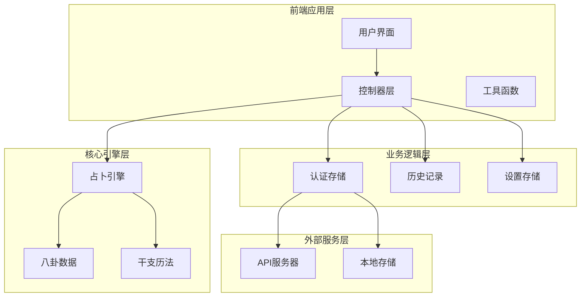
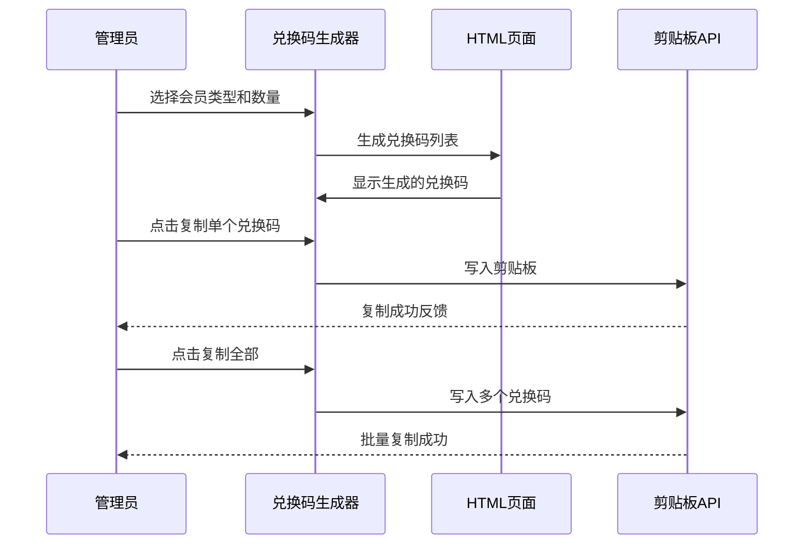
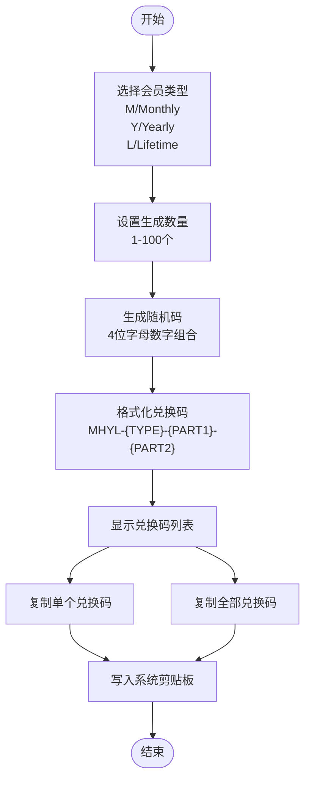
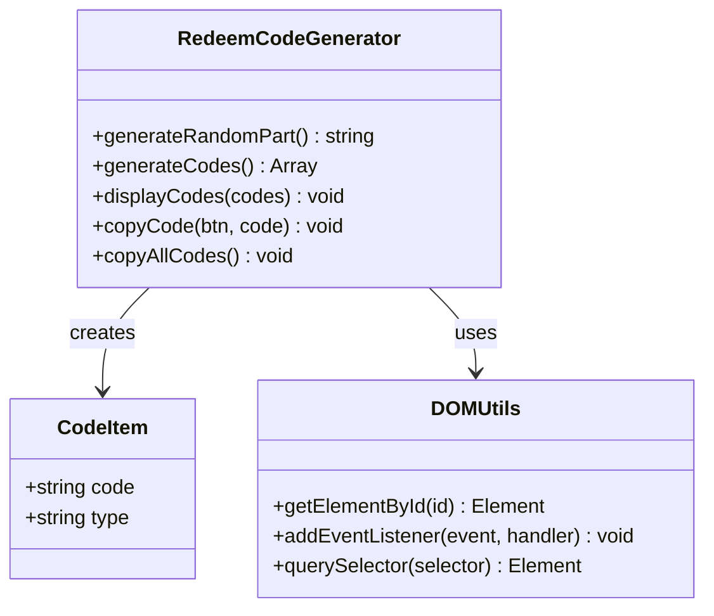
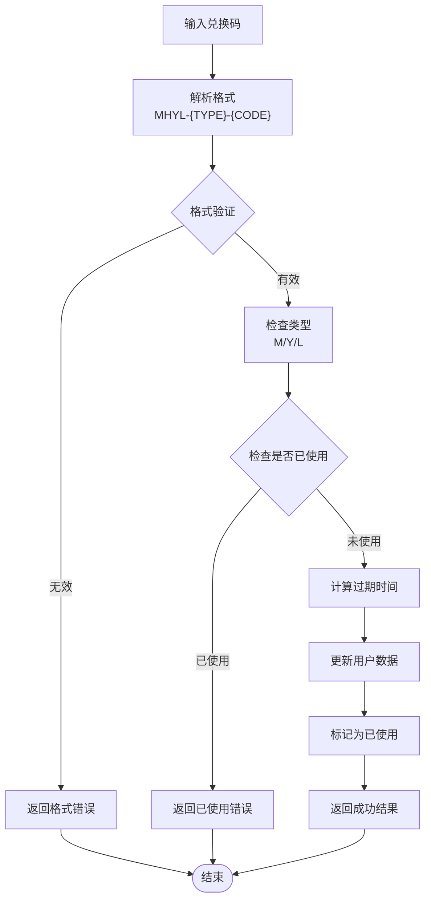
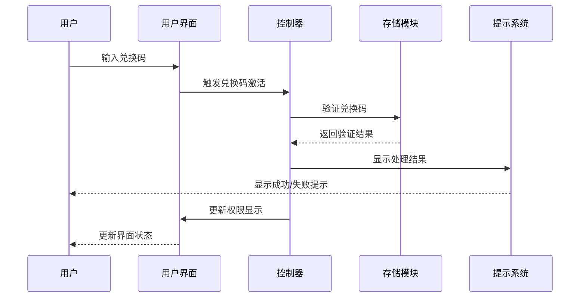
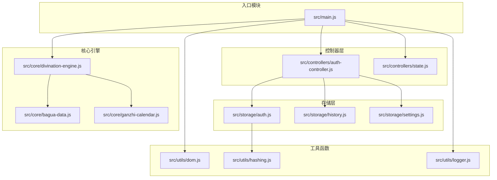

# 兑换码生成器

<cite>
**本文档引用的文件**
- [tools/redeem-code-generator.html](file://tools/redeem-code-generator.html)
- [src/main.js](file://src/main.js)
- [src/storage/auth.js](file://src/storage/auth.js)
- [src/controllers/auth-controller.js](file://src/controllers/auth-controller.js)
- [src/utils/hashing.js](file://src/utils/hashing.js)
- [src/utils/dom.js](file://src/utils/dom.js)
- [index.html](file://index.html)
- [package.json](file://package.json)
- [vite.config.js](file://vite.config.js)
</cite>

## 目录
1. [简介](#简介)
2. [项目结构](#项目结构)
3. [核心组件](#核心组件)
4. [架构概览](#架构概览)
5. [详细组件分析](#详细组件分析)
6. [依赖关系分析](#依赖关系分析)
7. [性能考虑](#性能考虑)
8. [故障排除指南](#故障排除指南)
9. [结论](#结论)

## 简介

这是一个基于Web技术开发的兑换码生成器系统，主要用于生成和管理梅花义理AI占卜平台的VIP会员兑换码。该系统提供了完整的前端界面，支持多种类型的VIP会员兑换码生成，包括月度、年度和终身会员类型。

系统采用现代化的前端技术栈，包括HTML5、CSS3、JavaScript ES6+，以及Vite构建工具。整个应用采用模块化设计，具有清晰的分层架构和良好的可维护性。

## 项目结构

该项目采用模块化的前端架构设计，主要分为以下几个层次：



**图表来源**
- [src/main.js:1-800](file://src/main.js#L1-L800)
- [src/storage/auth.js:1-495](file://src/storage/auth.js#L1-L495)

**章节来源**
- [package.json:1-32](file://package.json#L1-L32)
- [vite.config.js:1-20](file://vite.config.js#L1-L20)

## 核心组件

### 兑换码生成器核心功能

系统提供了两种主要的兑换码相关功能：

1. **管理员专用兑换码生成器** - 位于 `tools/redeem-code-generator.html`
2. **用户端兑换码激活系统** - 集成在主应用中

### 兑换码格式规范

系统支持三种类型的VIP会员兑换码，格式统一为：
```
MHYL-{TYPE}-{4位随机字符}-{4位随机字符}
```

其中 TYPE 参数含义：
- `M`: 月度 Pro (30天有效期)
- `Y`: 年度 Pro (365天有效期)  
- `L`: 终身 Pro (36500天有效期)

**章节来源**
- [tools/redeem-code-generator.html:230-236](file://tools/redeem-code-generator.html#L230-L236)
- [src/storage/auth.js:334-344](file://src/storage/auth.js#L334-L344)

## 架构概览

系统采用分层架构设计，各层职责明确：



**图表来源**
- [tools/redeem-code-generator.html:287-304](file://tools/redeem-code-generator.html#L287-L304)
- [tools/redeem-code-generator.html:331-359](file://tools/redeem-code-generator.html#L331-L359)

### 数据流架构



**图表来源**
- [tools/redeem-code-generator.html:277-304](file://tools/redeem-code-generator.html#L277-L304)

## 详细组件分析

### 兑换码生成器组件

#### HTML结构设计

兑换码生成器采用了现代化的响应式设计，具有以下特点：

- **渐变背景设计**：使用暖色调渐变背景，营造温馨的用户体验
- **卡片式布局**：采用圆角卡片设计，提升视觉层次感
- **交互式表单**：提供直观的类型选择和数量设置界面
- **实时结果显示**：动态展示生成的兑换码列表

#### 核心功能实现



**图表来源**
- [tools/redeem-code-generator.html:269-360](file://tools/redeem-code-generator.html#L269-L360)

#### 随机码生成算法

系统使用安全的随机字符生成算法：

1. **字符集定义**：包含A-Z字母和0-9数字
2. **随机选择机制**：使用Math.random()函数进行字符选择
3. **固定长度**：每个部分生成4位随机字符
4. **格式化输出**：按照MHYL-{TYPE}-{PART1}-{PART2}格式组合

**章节来源**
- [tools/redeem-code-generator.html:277-284](file://tools/redeem-code-generator.html#L277-L284)
- [tools/redeem-code-generator.html:294-301](file://tools/redeem-code-generator.html#L294-L301)

### 用户端兑换码激活系统

#### 认证存储模块

用户端的兑换码激活系统集成在主应用中，具有以下特性：

- **用户状态管理**：通过localStorage存储用户登录状态
- **兑换码验证**：验证兑换码格式和有效性
- **权限升级**：根据兑换码类型提升用户权限
- **过期时间计算**：根据类型计算相应的有效期

#### 兑换码解析流程



**图表来源**
- [src/storage/auth.js:353-425](file://src/storage/auth.js#L353-L425)

**章节来源**
- [src/storage/auth.js:332-425](file://src/storage/auth.js#L332-L425)

### 控制器层集成

#### 兑换码激活控制器

控制器层负责协调用户界面和业务逻辑：

- **事件绑定**：监听兑换码输入和提交事件
- **结果处理**：处理兑换码激活的成功和失败情况
- **UI更新**：更新用户界面显示兑换结果
- **权限同步**：同步用户的VIP权限状态

#### 界面交互设计



**图表来源**
- [src/main.js:1565-1616](file://src/main.js#L1565-L1616)
- [src/controllers/auth-controller.js:322-335](file://src/controllers/auth-controller.js#L322-L335)

**章节来源**
- [src/main.js:1565-1616](file://src/main.js#L1565-L1616)
- [src/controllers/auth-controller.js:322-335](file://src/controllers/auth-controller.js#L322-L335)

## 依赖关系分析

### 外部依赖

项目使用了现代化的前端构建工具链：

```mermaid
graph LR
subgraph "构建工具"
Vite[Vite构建工具]
Babel[Babel转译器]
ESLint[ESLint代码检查]
Jest[Jest测试框架]
end
subgraph "运行时依赖"
LucideIcons[Lucide图标库]
WebComponents[Web组件]
end
subgraph "开发依赖"
@babel/core[@babel/core]
@babel/preset-env[@babel/preset-env]
eslint[eslint]
jest[jest]
vite[vite]
end
Vite --> Babel
Vite --> ESLint
Vite --> Jest
Babel --> @babel/core
ESLint --> eslint
Jest --> jest
Vite --> vite
```

**图表来源**
- [package.json:24-31](file://package.json#L24-L31)

### 内部模块依赖



**图表来源**
- [src/main.js:1-800](file://src/main.js#L1-L800)
- [src/storage/auth.js:1-495](file://src/storage/auth.js#L1-L495)

**章节来源**
- [package.json:1-32](file://package.json#L1-L32)

## 性能考虑

### 前端性能优化

1. **懒加载策略**：非关键资源采用懒加载方式
2. **内存管理**：及时清理DOM事件监听器和定时器
3. **渲染优化**：使用requestAnimationFrame优化动画性能
4. **缓存策略**：合理使用localStorage减少网络请求

### 兑换码生成性能

- **批量生成**：支持一次性生成多个兑换码
- **内存优化**：生成的兑换码数组在使用后及时释放
- **剪贴板操作**：使用异步API避免阻塞主线程
- **UI响应**：生成过程中的UI更新采用节流机制

## 故障排除指南

### 常见问题及解决方案

#### 兑换码格式错误

**问题描述**：用户输入的兑换码格式不符合要求
**解决方法**：
1. 检查兑换码是否包含正确的前缀"MHYL-"
2. 验证类型参数是否为M、Y或L
3. 确认两个随机部分是否都是4位字符

#### 兑换码重复使用

**问题描述**：系统提示兑换码已被使用
**解决方法**：
1. 检查本地存储中的已使用兑换码列表
2. 生成新的兑换码进行替换
3. 清理本地存储中的使用记录

#### 浏览器兼容性问题

**问题描述**：某些浏览器不支持剪贴板API
**解决方法**：
1. 使用降级方案创建临时textarea元素
2. 通过execCommand方法实现复制功能
3. 提供手动复制的替代方案

**章节来源**
- [src/storage/auth.js:370-380](file://src/storage/auth.js#L370-L380)
- [src/main.js:541-555](file://src/main.js#L541-L555)

## 结论

这个兑换码生成器系统展现了现代前端开发的最佳实践，具有以下优势：

1. **模块化设计**：清晰的分层架构便于维护和扩展
2. **用户体验**：直观的界面设计和流畅的交互体验
3. **安全性**：采用哈希加密和本地存储双重保护
4. **可扩展性**：灵活的架构支持未来功能扩展
5. **性能优化**：合理的性能优化策略确保系统稳定运行

系统成功实现了管理员专用的兑换码生成功能，同时集成了用户端的兑换码激活机制，形成了完整的VIP会员管理解决方案。通过标准化的格式和严格的验证机制，确保了系统的可靠性和安全性。