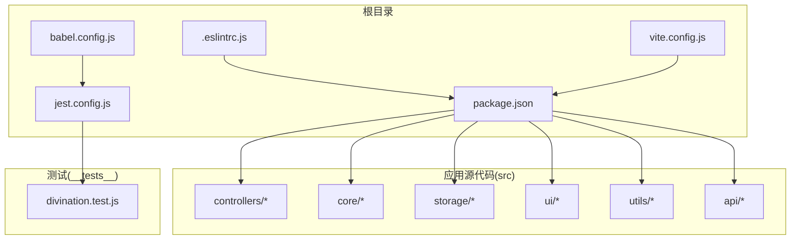
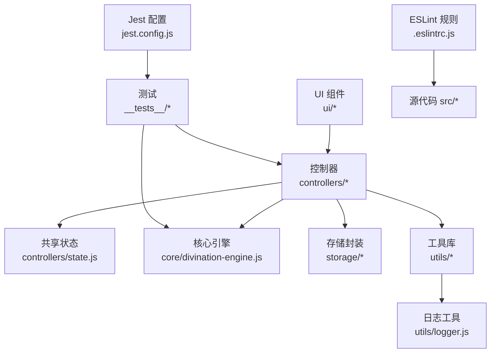
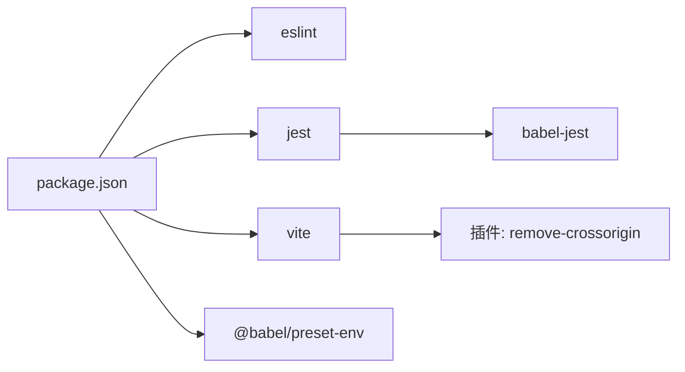
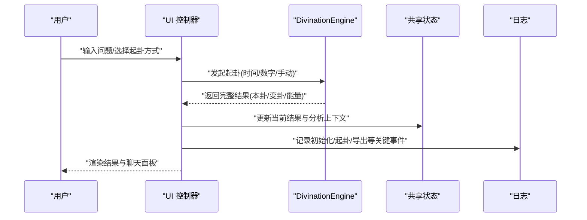
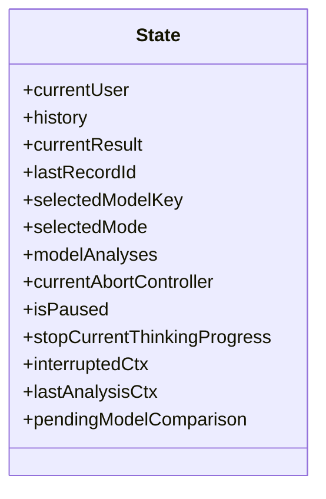
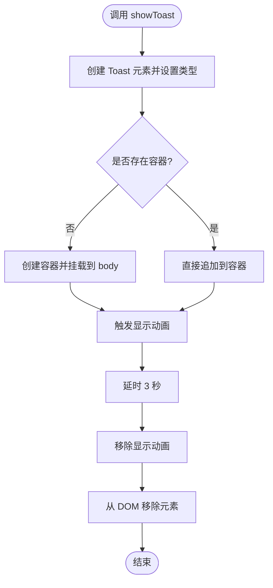

# 代码规范与标准

<cite>
**本文引用的文件**
- [.eslintrc.js](file://.eslintrc.js)
- [package.json](file://package.json)
- [lint_checker.js](file://lint_checker.js)
- [src/utils/logger.js](file://src/utils/logger.js)
- [src/main.js](file://src/main.js)
- [src/controllers/state.js](file://src/controllers/state.js)
- [src/utils/dom.js](file://src/utils/dom.js)
- [src/core/divination-engine.js](file://src/core/divination-engine.js)
- [legacy/app-core.js](file://legacy/app-core.js)
- [jest.config.js](file://jest.config.js)
- [jest.setup.js](file://jest.setup.js)
- [vite.config.js](file://vite.config.js)
- [babel.config.js](file://babel.config.js)
- [__tests__/divination.test.js](file://__tests__/divination.test.js)
</cite>

## 目录
1. [引言](#引言)
2. [项目结构](#项目结构)
3. [核心组件](#核心组件)
4. [架构总览](#架构总览)
5. [详细组件分析](#详细组件分析)
6. [依赖分析](#依赖分析)
7. [性能考虑](#性能考虑)
8. [故障排查指南](#故障排查指南)
9. [结论](#结论)
10. [附录](#附录)

## 引言
本文件为“梅花义理·数智决策系统”的代码规范与标准文档，面向前端与核心引擎开发人员，旨在统一 JavaScript 编码风格、明确 ESLint 规则与使用方式、规范全局变量与常量定义、建立日志与错误处理策略，并总结测试与质量保障最佳实践。文档同时给出可读性与可维护性的设计原则，帮助团队在长期迭代中保持一致性与高质量。

## 项目结构
项目采用按功能域划分的模块化组织方式，核心目录与职责如下：
- src：应用源代码
  - api：外部服务客户端
  - controllers：控制器层（路由与业务编排）
  - core：核心算法与引擎（如起卦引擎）
  - storage：本地存储封装
  - ui：视图与交互组件
  - utils：通用工具（DOM、格式化、日志等）
- server：服务端入口与配置
- __tests__：单元测试
- 根目录配置：ESLint、Jest、Vite、Babel、构建脚本等

图表来源
- [package.json:1-32](file://package.json#L1-L32)
- [.eslintrc.js:1-26](file://.eslintrc.js#L1-L26)
- [jest.config.js:1-43](file://jest.config.js#L1-L43)
- [vite.config.js:1-20](file://vite.config.js#L1-L20)
- [babel.config.js:1-6](file://babel.config.js#L1-L6)
- [__tests__/divination.test.js:1-174](file://__tests__/divination.test.js#L1-L174)

章节来源
- [package.json:1-32](file://package.json#L1-L32)

## 核心组件
- 起卦引擎：负责时间/数字/手动三种起卦模式、体用分析、能量场计算、三阶段推理与矩阵分类等核心逻辑。
- 应用入口与状态：应用初始化、事件绑定、主题切换、移动端抽屉、历史渲染与导出等；共享状态对象集中管理。
- 工具与日志：轻量日志工具，支持多级别输出与生产环境过滤；DOM 辅助函数与吐司提示。
- 测试与质量：Jest 配置与覆盖率阈值；ESLint 规则；基础语法检查脚本。

章节来源
- [src/core/divination-engine.js:1-433](file://src/core/divination-engine.js#L1-L433)
- [src/main.js:1-1199](file://src/main.js#L1-L1199)
- [src/controllers/state.js:1-24](file://src/controllers/state.js#L1-L24)
- [src/utils/logger.js:1-34](file://src/utils/logger.js#L1-L34)
- [src/utils/dom.js:1-41](file://src/utils/dom.js#L1-L41)
- [jest.config.js:1-43](file://jest.config.js#L1-L43)
- [.eslintrc.js:1-26](file://.eslintrc.js#L1-L26)

## 架构总览
应用采用“控制器-视图-存储-核心引擎”分层架构，通过共享状态对象协调各模块；日志工具贯穿业务流程；测试与 Lint 保障质量。

图表来源
- [src/main.js:1-1199](file://src/main.js#L1-L1199)
- [src/controllers/state.js:1-24](file://src/controllers/state.js#L1-L24)
- [src/core/divination-engine.js:1-433](file://src/core/divination-engine.js#L1-L433)
- [src/utils/logger.js:1-34](file://src/utils/logger.js#L1-L34)
- [jest.config.js:1-43](file://jest.config.js#L1-L43)
- [.eslintrc.js:1-26](file://.eslintrc.js#L1-L26)

## 详细组件分析

### ESLint 配置与规则
- 环境启用：浏览器、Node、ES2021、Jest。
- 全局变量声明：对项目中必要的全局标识符进行只读声明，避免误报未定义。
- 解析参数：ES12 模块语法。
- 关键规则：
  - 未使用变量：警告
  - 使用未定义变量：错误
- 推荐扩展：基于 eslint:recommended 的基础规则集，建议结合团队风格增加自定义规则（例如禁用 eval、强制使用 const/let 等）。

章节来源
- [.eslintrc.js:1-26](file://.eslintrc.js#L1-L26)
- [package.json:5-14](file://package.json#L5-L14)

### JavaScript 编码标准
- 变量命名
  - 常量：全大写下划线风格（如常量集合、配置键）。
  - 全局只读标识符：通过 ESLint globals 声明，避免重复定义。
  - 函数与变量：驼峰命名；类名首字母大写；私有成员以下划线前缀。
- 函数定义
  - 优先使用箭头函数表达式以减少 this 绑定问题；复杂逻辑使用具名函数提升可读性。
  - 将长函数拆分为多个职责单一的小函数，遵循单一职责原则。
- 注释要求
  - 文件顶部添加简要说明与版本信息。
  - 复杂算法与业务逻辑处添加注释，解释输入、输出与关键步骤。
  - TODO/NOTE 注释用于临时标记，需配合任务跟踪。
- 代码格式化
  - 使用 ESLint 自动修复命令统一格式（lint:fix）。
  - 避免多余空白、保持一致缩进与括号风格。
- 错误处理
  - 对外暴露的全局桥接函数（如窗口级触发器）需捕获异常并提示用户。
  - 控制器与引擎内部使用 try/catch 包裹异步流程，保证状态一致性。
- 日志记录
  - 使用统一日志工具，按级别输出；生产环境仅输出 warn 及以上级别。

章节来源
- [.eslintrc.js:8-15](file://.eslintrc.js#L8-L15)
- [src/main.js:1-1199](file://src/main.js#L1-L1199)
- [src/utils/logger.js:1-34](file://src/utils/logger.js#L1-L34)
- [legacy/app-core.js:154-166](file://legacy/app-core.js#L154-L166)

### 全局变量与常量定义
- 全局只读变量
  - 在 ESLint globals 中声明，如占卜相关常量与工具函数，确保其在全局作用域可用且不可修改。
- 常量定义
  - 使用 const/大写下划线风格常量存放配置键、枚举值与静态数据。
  - 对跨模块共享的只读数据（如三十六卦、五行属性）集中管理，避免散落定义。
- 状态对象
  - 共享状态集中于控制器层，避免在多处重复定义相同字段。

章节来源
- [.eslintrc.js:8-15](file://.eslintrc.js#L8-L15)
- [src/controllers/state.js:1-24](file://src/controllers/state.js#L1-L24)
- [src/main.js:1-1199](file://src/main.js#L1-L1199)

### 代码风格检查工具配置与使用
- ESLint
  - 命令：lint（检查）、lint:fix（自动修复）。
  - 范围：src 下所有 .js 文件。
- 基础语法检查脚本
  - 用于快速检测遗留代码的语法错误，作为预提交检查的补充手段。
- Jest
  - 测试环境：jsdom；覆盖率阈值：分支、函数、行、语句均不低于 50%。
  - 转换：Babel 预设用于测试环境转换。
  - 超时与缓存：测试超时 10 秒，缓存目录 .jest_cache。
- Vite
  - 构建优化：关闭 modulePreload polyfill。
  - HTML 处理：移除 crossorigin 避免微信浏览器跨域问题。
- Babel
  - 目标：当前 Node 版本，确保测试与构建兼容。

章节来源
- [package.json:5-14](file://package.json#L5-L14)
- [lint_checker.js:1-20](file://lint_checker.js#L1-L20)
- [jest.config.js:1-43](file://jest.config.js#L1-L43)
- [babel.config.js:1-6](file://babel.config.js#L1-L6)
- [vite.config.js:1-20](file://vite.config.js#L1-L20)

### 代码质量检查最佳实践
- 提交前检查
  - 运行 lint:fix 修复可自动修复的问题；运行 lint 检查剩余问题。
  - 运行测试并关注覆盖率阈值，确保新增/修改代码均有测试覆盖。
- 代码审查
  - 关注函数长度、嵌套深度与单一职责；避免魔法数字与字符串硬编码。
  - 对全局变量与副作用操作进行重点审查。
- 持续集成
  - 在 CI 中统一执行 Lint 与测试，失败即阻断合并。

章节来源
- [jest.config.js:23-30](file://jest.config.js#L23-L30)
- [package.json:5-14](file://package.json#L5-L14)

### 错误处理与日志记录规范
- 错误处理
  - 全局桥接函数捕获异常并提示用户，避免页面崩溃。
  - 控制器与引擎内部使用 try/catch 包裹异步流程，保证状态一致性与 UI 反馈。
- 日志记录
  - 使用统一日志工具，支持 debug/info/warn/error 四级。
  - 生产环境仅输出 warn 及以上级别，避免泄露敏感信息。
  - 在关键流程（初始化、起卦、导出、切换模型）输出 info 级日志。

章节来源
- [legacy/app-core.js:154-166](file://legacy/app-core.js#L154-L166)
- [src/main.js:167-249](file://src/main.js#L167-L249)
- [src/utils/logger.js:1-34](file://src/utils/logger.js#L1-L34)

### 可读性与可维护性设计原则
- 结构清晰
  - 按功能域划分模块，避免交叉耦合；控制器仅做编排，核心逻辑下沉至引擎。
- 命名一致
  - 常量、函数、变量、类名采用一致风格；避免缩写与歧义命名。
- 注释与文档
  - 对复杂算法与业务规则添加注释；对外接口提供简要说明。
- 测试驱动
  - 重要模块具备单元测试，覆盖率阈值保障质量；测试用例覆盖边界与异常路径。

章节来源
- [src/core/divination-engine.js:1-433](file://src/core/divination-engine.js#L1-L433)
- [__tests__/divination.test.js:1-174](file://__tests__/divination.test.js#L1-L174)

## 依赖分析
- 开发依赖
  - ESLint：代码规范与静态检查。
  - Jest：单元测试与覆盖率。
  - Vite：构建与开发服务器。
  - Babel：测试与构建的语法转换。
- 运行时依赖
  - 应用通过模块导入组织，避免全局污染；共享状态与工具函数集中管理。

图表来源
- [package.json:24-31](file://package.json#L24-L31)
- [jest.config.js:12-14](file://jest.config.js#L12-L14)
- [vite.config.js:4-12](file://vite.config.js#L4-L12)

章节来源
- [package.json:1-32](file://package.json#L1-L32)
- [jest.config.js:1-43](file://jest.config.js#L1-L43)
- [vite.config.js:1-20](file://vite.config.js#L1-L20)
- [babel.config.js:1-6](file://babel.config.js#L1-L6)

## 性能考虑
- 事件节流与防抖
  - 滚动与窗口尺寸变更采用节流/防抖，降低频繁重绘与布局开销。
- DOM 访问与批量更新
  - 避免频繁查询与多次重排；必要时使用 DocumentFragment 或一次性更新。
- 构建优化
  - Vite 关闭 modulePreload polyfill，减少冗余资源加载。
  - 移除 HTML 中的 crossorigin 属性，避免微信浏览器跨域问题。
- 日志级别
  - 生产环境仅输出 warn 及以上级别，降低控制台输出对性能的影响。

章节来源
- [src/main.js:357-371](file://src/main.js#L357-L371)
- [vite.config.js:4-12](file://vite.config.js#L4-L12)
- [src/utils/logger.js:10-12](file://src/utils/logger.js#L10-L12)

## 故障排查指南
- Lint 报错
  - 使用 lint:fix 自动修复；对未定义变量检查是否在 globals 中声明或是否拼写错误。
- 测试失败
  - 查看测试超时与覆盖率阈值；针对失败用例补充或修正测试。
- 构建问题
  - 检查 Vite 插件与 HTML 处理逻辑；确认 crossorigin 移除是否影响目标平台。
- 语法错误
  - 使用基础语法检查脚本定位问题文件与错误位置。

章节来源
- [package.json:5-14](file://package.json#L5-L14)
- [jest.config.js:23-30](file://jest.config.js#L23-L30)
- [lint_checker.js:1-20](file://lint_checker.js#L1-L20)
- [vite.config.js:4-12](file://vite.config.js#L4-L12)

## 结论
本规范以 ESLint、Jest、Vite、Babel 为核心工具链，结合统一的日志与错误处理策略，形成从编码风格、质量保障到性能优化的完整体系。建议在后续迭代中逐步引入更严格的规则与覆盖率目标，持续提升系统的稳定性与可维护性。

## 附录

### 起卦引擎处理流程（序列图）

图表来源
- [src/main.js:607-786](file://src/main.js#L607-L786)
- [src/core/divination-engine.js:35-201](file://src/core/divination-engine.js#L35-L201)
- [src/utils/logger.js:14-31](file://src/utils/logger.js#L14-L31)

### 共享状态结构（类图）

图表来源
- [src/controllers/state.js:5-21](file://src/controllers/state.js#L5-L21)

### DOM 工具与日志工具（流程图）

图表来源
- [src/utils/dom.js:17-40](file://src/utils/dom.js#L17-L40)