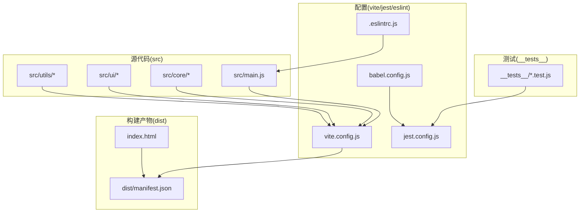
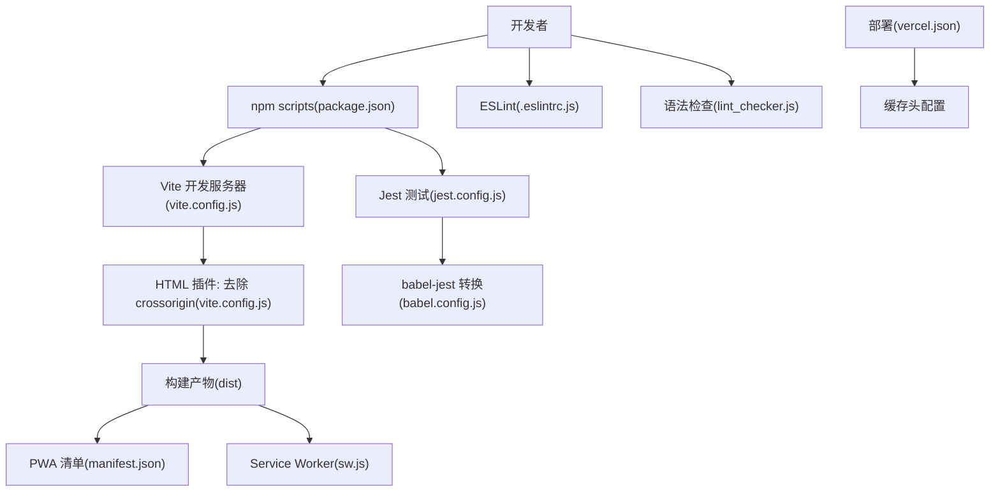
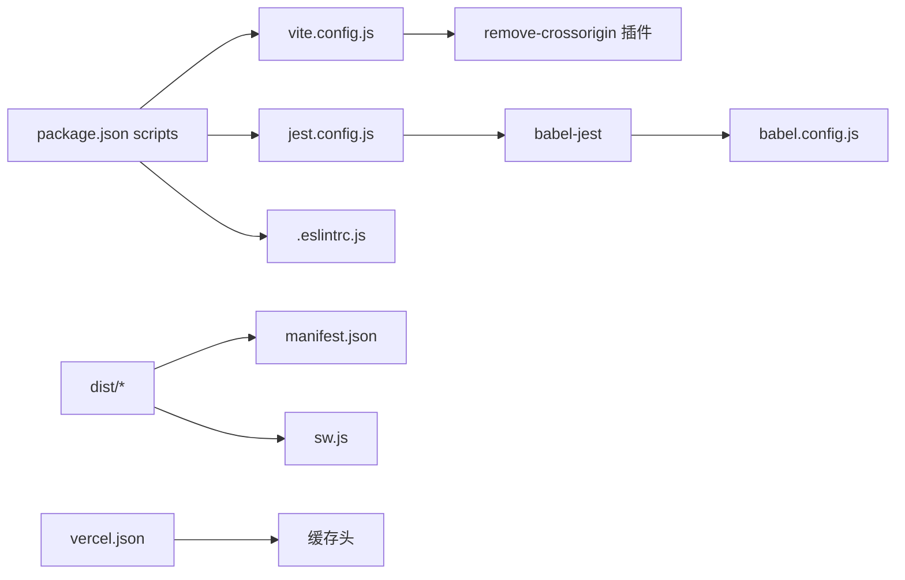

# 开发工具配置

<cite>
**本文引用的文件**
- [babel.config.js](file://babel.config.js)
- [vite.config.js](file://vite.config.js)
- [jest.config.js](file://jest.config.js)
- [jest.setup.js](file://jest.setup.js)
- [.eslintrc.js](file://.eslintrc.js)
- [package.json](file://package.json)
- [lint_checker.js](file://lint_checker.js)
- [index.html](file://index.html)
- [src/main.js](file://src/main.js)
- [src/core/divination-engine.js](file://src/core/divination-engine.js)
- [dist/manifest.json](file://dist/manifest.json)
- [public/sw.js](file://public/sw.js)
- [vercel.json](file://vercel.json)
- [__tests__/divination.test.js](file://__tests__/divination.test.js)
</cite>

## 目录
1. [简介](#简介)
2. [项目结构](#项目结构)
3. [核心组件](#核心组件)
4. [架构总览](#架构总览)
5. [详细组件分析](#详细组件分析)
6. [依赖关系分析](#依赖关系分析)
7. [性能考量](#性能考量)
8. [故障排查指南](#故障排查指南)
9. [结论](#结论)
10. [附录](#附录)

## 简介
本文件面向“梅花义理”项目的前端开发团队，系统化梳理并说明开发工具链的配置与使用，包括：
- Babel 转译配置与目标浏览器兼容策略
- Vite 构建工具配置、开发服务器与插件机制
- Jest 测试框架配置与测试环境设置
- 开发工具链的安装与初始化流程
- 热重载、代码分割与打包优化实践
- 各工具间的集成与协作机制
- 自定义与扩展方法

## 项目结构
该项目采用以功能域划分的目录组织方式，核心源代码位于 src 目录，测试用例位于 __tests__ 目录，构建产物输出至 dist 目录。关键配置文件集中在仓库根目录。

**图表来源**
- [vite.config.js:1-20](file://vite.config.js#L1-L20)
- [jest.config.js:1-43](file://jest.config.js#L1-L43)
- [.eslintrc.js:1-26](file://.eslintrc.js#L1-L26)
- [babel.config.js:1-6](file://babel.config.js#L1-L6)
- [src/main.js:1-50](file://src/main.js#L1-L50)
- [dist/manifest.json:1-22](file://dist/manifest.json#L1-L22)

**章节来源**
- [package.json:1-32](file://package.json#L1-L32)
- [vite.config.js:1-20](file://vite.config.js#L1-L20)
- [jest.config.js:1-43](file://jest.config.js#L1-L43)
- [.eslintrc.js:1-26](file://.eslintrc.js#L1-L26)
- [babel.config.js:1-6](file://babel.config.js#L1-L6)

## 核心组件
- 构建与开发服务器：Vite
- 转译与兼容：Babel
- 测试框架：Jest + jsdom
- 代码质量：ESLint
- 辅助脚本：语法检查与构建产物清单

**章节来源**
- [package.json:5-14](file://package.json#L5-L14)
- [vite.config.js:14-19](file://vite.config.js#L14-L19)
- [jest.config.js:2-39](file://jest.config.js#L2-L39)
- [.eslintrc.js:1-26](file://.eslintrc.js#L1-L26)
- [babel.config.js:1-6](file://babel.config.js#L1-L6)

## 架构总览
下图展示开发工具链在项目中的协作关系：开发者通过 npm scripts 启动 Vite 开发服务器，Vite 使用插件对 HTML 进行二次处理；构建阶段由 Vite 完成打包与优化；Jest 在测试环境中加载 Babel 转换器；ESLint 在开发期进行静态检查；辅助脚本负责基础校验与部署头信息配置。

**图表来源**
- [package.json:5-14](file://package.json#L5-L14)
- [vite.config.js:3-19](file://vite.config.js#L3-L19)
- [jest.config.js:12-14](file://jest.config.js#L12-L14)
- [babel.config.js:2-4](file://babel.config.js#L2-L4)
- [.eslintrc.js:1-26](file://.eslintrc.js#L1-L26)
- [lint_checker.js:1-20](file://lint_checker.js#L1-L20)
- [vercel.json:1-23](file://vercel.json#L1-L23)
- [dist/manifest.json:1-22](file://dist/manifest.json#L1-L22)
- [public/sw.js:1-45](file://public/sw.js#L1-L45)

## 详细组件分析

### Babel 转译配置与目标浏览器兼容
- 配置位置与内容要点
  - 预设：使用 @babel/preset-env
  - 目标：node: current（用于服务端/构建脚本场景）
- 兼容性说明
  - 当前配置针对 Node 运行时，不直接约束浏览器兼容性
  - 若需浏览器兼容，可在 preset-env 中显式设置 targets（如 browserslist 或 browsers 字段）
- 与 Jest 的集成
  - Jest 通过 babel-jest 使用 Babel 转换 .js 文件，适用于测试环境

最佳实践建议
- 在构建阶段为浏览器设置 targets，避免不必要的 polyfill
- 将浏览器兼容策略集中于 browserslist 或 package.json 的 browserslist 字段，便于统一管理

**章节来源**
- [babel.config.js:1-6](file://babel.config.js#L1-L6)
- [jest.config.js:12-14](file://jest.config.js#L12-L14)

### Vite 构建工具配置与开发服务器
- 开发服务器
  - 默认启动命令：dev -> vite
  - 无额外 devServer 配置，使用默认行为
- 构建优化
  - 关闭 modulePreload polyfill：modulePreload.polyfill=false
  - 目的：减少运行时开销，提升加载性能
- HTML 处理插件
  - 名称：remove-crossorigin
  - 作用：在生成阶段移除 HTML 中的 crossorigin 属性，规避微信浏览器跨域问题
  - 触发时机：enforce: post，在 HTML 转换阶段执行
- 入口与入口 HTML
  - 入口：src/main.js
  - 入口 HTML：index.html（包含 manifest 与 PWA 相关资源）

热重载与开发体验
- Vite 默认启用模块热替换（HMR），无需额外配置
- 插件在 transformIndexHtml 阶段修改 HTML，不影响 HMR 正常工作

代码分割与懒加载
- Vite 基于动态导入实现代码分割
- 项目中通过动态导入加载控制器与视图模块，符合现代打包策略

**章节来源**
- [package.json:6-8](file://package.json#L6-L8)
- [vite.config.js:3-19](file://vite.config.js#L3-L19)
- [src/main.js:1-25](file://src/main.js#L1-L25)
- [index.html:23](file://index.html#L23)

### Jest 测试框架配置与测试环境
- 测试环境
  - testEnvironment: jsdom（模拟浏览器 DOM 环境）
- 测试文件匹配
  - testMatch: 支持 test-*.js 与 __tests__/**/*.js
- 转换器
  - transform: babel-jest，结合 Babel 实现 ESNext 转译
- 覆盖率
  - collectCoverageFrom: 包含 src/**/*.js，排除入口与样式文件
  - coverageThreshold: 全局分支、函数、行、语句均要求 50%
- 行为参数
  - verbose: true
  - testTimeout: 10000 ms
  - cacheDirectory: ./ .jest_cache
- 设置文件
  - setupFilesAfterEnv: 加载 jest.setup.js，注入全局测试配置

示例测试用例
- __tests__/divination.test.js 覆盖起卦引擎的核心逻辑，验证结果完整性、卦名有效性、体用关系等

**章节来源**
- [jest.config.js:1-43](file://jest.config.js#L1-L43)
- [jest.setup.js:1-9](file://jest.setup.js#L1-L9)
- [babel.config.js:1-6](file://babel.config.js#L1-L6)
- [__tests__/divination.test.js:1-174](file://__tests__/divination.test.js#L1-L174)

### 代码质量与辅助脚本
- ESLint
  - 环境：browser、es2021、node、jest
  - 全局变量：TRIGRAMS、getShichen、DivinationEngine、GanzhiCalendar、getEnergyState、modalSettings（只读）
  - 规则：no-unused-vars 警告、no-undef 错误
- 语法检查脚本
  - lint_checker.js：对 legacy/app-core.js 进行基本语法检查（new Function）
  - 用途：快速发现遗留代码语法错误

**章节来源**
- [.eslintrc.js:1-26](file://.eslintrc.js#L1-L26)
- [lint_checker.js:1-20](file://lint_checker.js#L1-L20)

### PWA 与部署相关配置
- PWA 清单
  - dist/manifest.json：包含名称、图标、启动路径等
- Service Worker
  - public/sw.js：离线缓存策略（shell assets 缓存、网络优先）
  - 避免缓存 API 请求（/v1/、/api/）
- 部署头配置
  - vercel.json：对 sw.js、index.html、根路径设置 Cache-Control 头，避免缓存陈旧资源

**章节来源**
- [dist/manifest.json:1-22](file://dist/manifest.json#L1-L22)
- [public/sw.js:1-45](file://public/sw.js#L1-L45)
- [vercel.json:1-23](file://vercel.json#L1-L23)

## 依赖关系分析
- npm scripts 作为统一入口，分别调用 Vite、Jest、ESLint
- Vite 依赖插件系统，通过自定义插件实现 HTML 层面的微调
- Jest 依赖 babel-jest，间接使用 Babel 配置
- ESLint 与源代码耦合度高，影响开发期反馈速度
- PWA 与部署配置相互配合，保障生产环境可用性

**图表来源**
- [package.json:5-14](file://package.json#L5-L14)
- [vite.config.js:3-19](file://vite.config.js#L3-L19)
- [jest.config.js:12-14](file://jest.config.js#L12-L14)
- [babel.config.js:1-6](file://babel.config.js#L1-L6)
- [dist/manifest.json:1-22](file://dist/manifest.json#L1-L22)
- [public/sw.js:1-45](file://public/sw.js#L1-L45)
- [vercel.json:1-23](file://vercel.json#L1-L23)

**章节来源**
- [package.json:1-32](file://package.json#L1-L32)
- [vite.config.js:1-20](file://vite.config.js#L1-L20)
- [jest.config.js:1-43](file://jest.config.js#L1-L43)
- [babel.config.js:1-6](file://babel.config.js#L1-L6)
- [.eslintrc.js:1-26](file://.eslintrc.js#L1-L26)

## 性能考量
- 构建优化
  - 关闭 modulePreLoad polyfill，减少运行时负担
  - 代码分割通过动态导入实现，按需加载模块
- 浏览器兼容
  - 当前 Babel 目标为 Node，建议在构建阶段补充浏览器 targets，避免引入不必要的垫片
- Service Worker 与缓存
  - shell assets 缓存 + 网络优先策略，降低首屏与离线成本
  - 避免缓存 API 请求，确保数据实时性
- 开发体验
  - Vite 默认 HMR，无需额外配置；插件在 post 阶段修改 HTML，不影响热更新

[本节为通用指导，不直接分析具体文件]

## 故障排查指南
- Vite 构建后出现微信浏览器跨域问题
  - 现象：存在 crossorigin 属性导致跨域失败
  - 解决：使用 remove-crossorigin 插件在构建阶段移除该属性
  - 参考：vite.config.js 中的 removeCrossOrigin 插件
- 测试无法识别 ESNext 语法
  - 现象：测试报语法错误
  - 解决：确保 jest.config.js 使用 babel-jest，并正确配置 babel.config.js
  - 参考：jest.config.js 的 transform 与 babel.config.js 的 preset-env
- 覆盖率不达标
  - 现象：覆盖率阈值未满足
  - 解决：增加测试用例，提高分支与语句覆盖；必要时调整覆盖率阈值
  - 参考：jest.config.js 的 collectCoverageFrom 与 coverageThreshold
- ESLint 报错
  - 现象：全局变量未定义或未使用
  - 解决：在 .eslintrc.js 中声明全局变量或调整规则
  - 参考：.eslintrc.js 的 globals 与 rules
- 部署缓存问题
  - 现象：sw.js 或页面缓存陈旧
  - 解决：通过 vercel.json 设置 Cache-Control 头，强制刷新
  - 参考：vercel.json 的 headers 配置

**章节来源**
- [vite.config.js:3-19](file://vite.config.js#L3-L19)
- [jest.config.js:12-14](file://jest.config.js#L12-L14)
- [babel.config.js:1-6](file://babel.config.js#L1-L6)
- [jest.config.js:17-30](file://jest.config.js#L17-L30)
- [.eslintrc.js:8-24](file://.eslintrc.js#L8-L24)
- [vercel.json:2-21](file://vercel.json#L2-L21)

## 结论
本项目采用轻量且高效的开发工具链：Vite 提供快速开发与优化构建，Jest 配合 Babel 实现可靠的测试环境，ESLint 保障代码质量，PWA 与部署头配置提升用户体验与稳定性。建议在现有基础上补充浏览器兼容目标、完善测试覆盖率与规则配置，以进一步提升工程化水平。

[本节为总结性内容，不直接分析具体文件]

## 附录

### 开发工具链安装与初始化步骤
- 安装依赖
  - 使用包管理器安装 devDependencies（Vite、Jest、ESLint、Babel 等）
- 初始化开发服务器
  - 运行 npm 脚本：dev -> 启动 Vite 开发服务器
- 构建与预览
  - 构建：build -> 产出 dist 目录
  - 预览：preview -> 本地预览构建产物
- 测试
  - 单次测试：test
  - 监听测试：test:watch
  - 覆盖率：test:coverage
- 代码检查
  - lint：eslint src/ --ext .js
  - lint:fix：自动修复可修复问题

**章节来源**
- [package.json:5-14](file://package.json#L5-L14)

### 热重载、代码分割与打包优化方法
- 热重载
  - Vite 默认启用 HMR，无需额外配置
- 代码分割
  - 使用动态导入实现按需加载模块
  - 示例：在 src/main.js 中对控制器与视图模块采用动态导入
- 打包优化
  - 关闭 modulePreLoad polyfill，减少运行时开销
  - 移除 HTML 中的 crossorigin 属性，避免跨域问题

**章节来源**
- [vite.config.js:16-19](file://vite.config.js#L16-L19)
- [vite.config.js:4-11](file://vite.config.js#L4-L11)
- [src/main.js:24-45](file://src/main.js#L24-L45)

### 开发工具之间的集成与协作机制
- Vite 与 Jest
  - Jest 通过 babel-jest 使用 Babel 转换器，实现测试文件的 ESNext 转译
- Vite 与 PWA
  - 构建产物包含 manifest.json 与 sw.js，结合 vercel.json 的缓存头配置
- ESLint 与源代码
  - 在开发期进行静态检查，避免提交低质量代码

**章节来源**
- [jest.config.js:12-14](file://jest.config.js#L12-L14)
- [babel.config.js:1-6](file://babel.config.js#L1-L6)
- [dist/manifest.json:1-22](file://dist/manifest.json#L1-L22)
- [public/sw.js:1-45](file://public/sw.js#L1-L45)
- [vercel.json:1-23](file://vercel.json#L1-L23)

### 自定义与扩展方法
- 自定义 Vite 插件
  - 在 vite.config.js 的 plugins 数组中添加自定义插件
  - 注意 enforce 阶段（pre/post）与 transformIndexHtml 钩子
- 扩展 Jest 转换器
  - 在 jest.config.js 的 transform 中添加新的转换规则
  - 结合 Babel 配置支持更多语法特性
- 增强 ESLint 规则
  - 在 .eslintrc.js 的 rules 中新增或调整规则
  - 在 globals 中声明项目所需的全局变量
- 浏览器兼容策略
  - 在 Babel preset-env 中设置 targets，或使用 browserslist 字段统一管理

**章节来源**
- [vite.config.js:14-19](file://vite.config.js#L14-L19)
- [jest.config.js:12-14](file://jest.config.js#L12-L14)
- [babel.config.js:1-6](file://babel.config.js#L1-L6)
- [.eslintrc.js:16-24](file://.eslintrc.js#L16-L24)