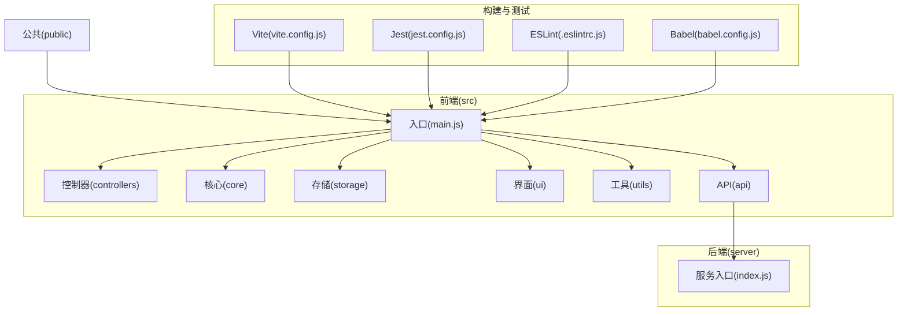
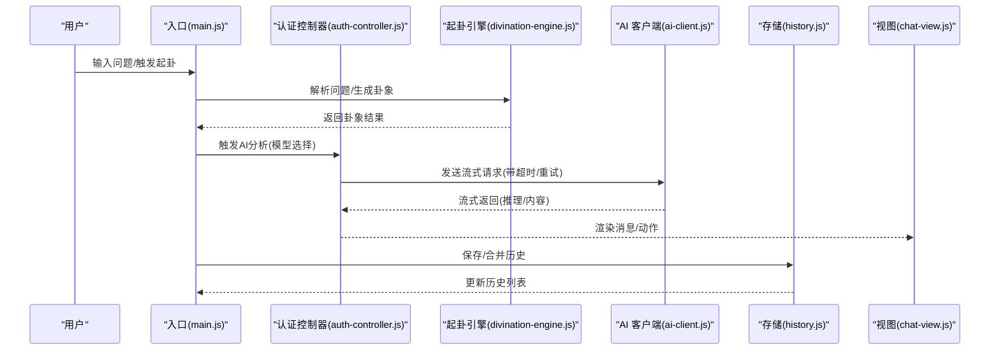
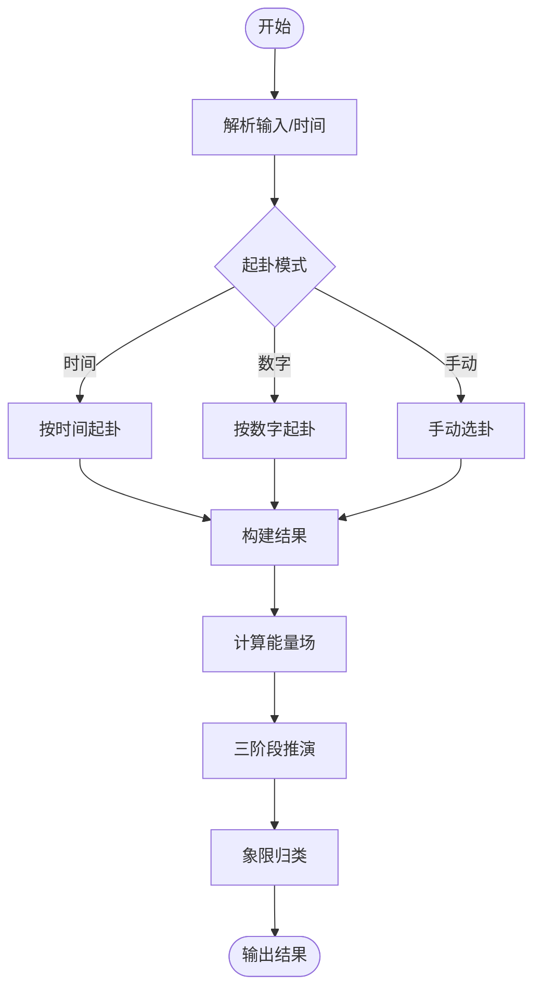
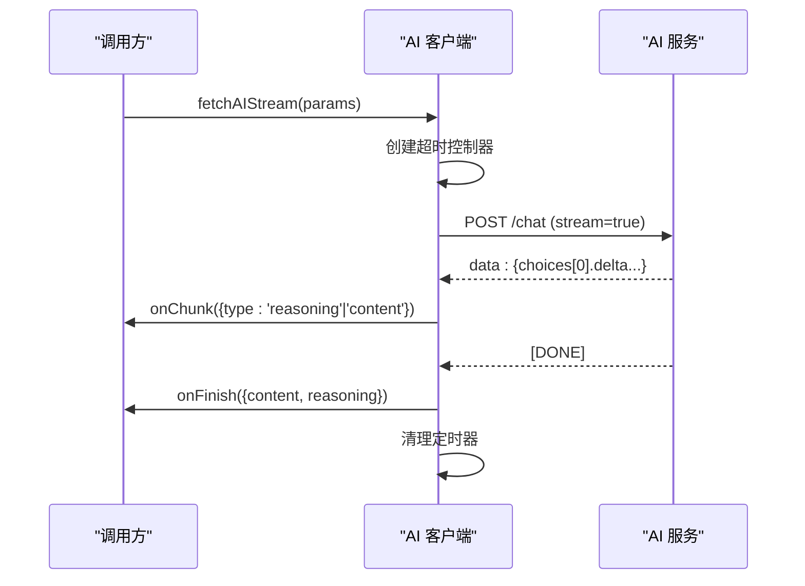
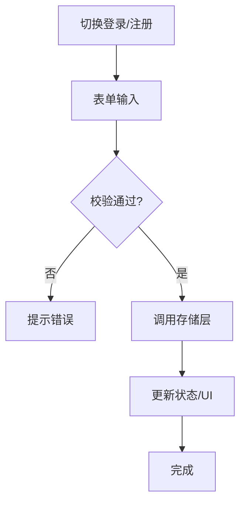
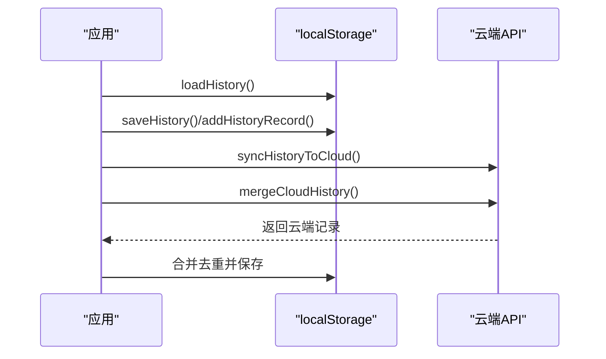
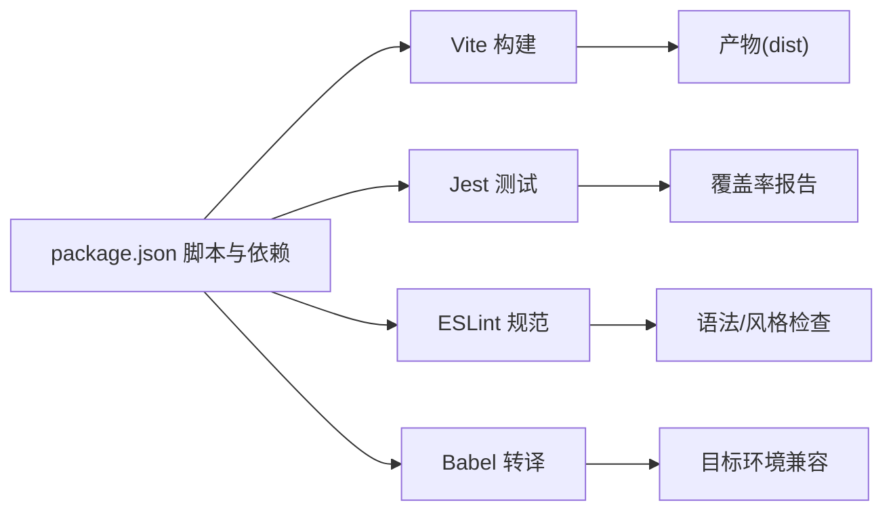

# 开发指南

<cite>
**本文引用的文件**
- [.eslintrc.js](file://.eslintrc.js)
- [babel.config.js](file://babel.config.js)
- [vite.config.js](file://vite.config.js)
- [package.json](file://package.json)
- [jest.config.js](file://jest.config.js)
- [jest.setup.js](file://jest.setup.js)
- [lint_checker.js](file://lint_checker.js)
- [src/main.js](file://src/main.js)
- [src/index.css](file://src/index.css)
- [src/utils/logger.js](file://src/utils/logger.js)
- [src/controllers/state.js](file://src/controllers/state.js)
- [src/core/divination-engine.js](file://src/core/divination-engine.js)
- [src/api/ai-client.js](file://src/api/ai-client.js)
- [src/controllers/auth-controller.js](file://src/controllers/auth-controller.js)
- [src/storage/history.js](file://src/storage/history.js)
- [src/ui/chat-view.js](file://src/ui/chat-view.js)
- [src/utils/dom.js](file://src/utils/dom.js)
- [server/index.js](file://server/index.js)
- [server/package.json](file://server/package.json)
- [vercel.json](file://vercel.json)
- [public/manifest.json](file://public/manifest.json)
- [public/sw.js](file://public/sw.js)
</cite>

## 目录
1. [简介](#简介)
2. [项目结构](#项目结构)
3. [核心组件](#核心组件)
4. [架构总览](#架构总览)
5. [详细组件分析](#详细组件分析)
6. [依赖分析](#依赖分析)
7. [性能考虑](#性能考虑)
8. [故障排查指南](#故障排查指南)
9. [结论](#结论)
10. [附录](#附录)

## 简介
本开发指南面向“梅花义理·数智决策系统”的前端与工具链开发者，目标是帮助团队建立一致的代码规范、最佳实践与协作流程。内容涵盖：
- 代码规范与 ESLint 配置
- 开发工具链（Vite、Babel、Jest、ESLint）
- 模块化设计与组件组织
- 新功能开发流程与模板
- 代码审查标准与检查清单
- 错误处理与日志记录规范
- 性能优化与调试技巧
- 团队协作与版本控制策略
- 开发环境个性化配置与扩展

## 项目结构
项目采用按职责分层的模块化组织方式，核心目录与职责如下：
- src：前端源码
  - api：AI 接口客户端
  - controllers：应用控制器（业务编排）
  - core：核心算法与数据（起卦引擎、干支历等）
  - storage：本地与云端数据持久化
  - ui：视图渲染与交互
  - utils：通用工具（DOM、日志、格式化等）
- server：后端服务（部署与运行）
- public：静态资源（PWA 清单与 Service Worker）
- 根目录：构建与测试配置（Vite、Jest、ESLint、Babel）

图表来源
- [src/main.js:1-120](file://src/main.js#L1-L120)
- [vite.config.js:1-20](file://vite.config.js#L1-L20)
- [jest.config.js:1-43](file://jest.config.js#L1-L43)
- [.eslintrc.js:1-26](file://.eslintrc.js#L1-L26)
- [babel.config.js:1-6](file://babel.config.js#L1-L6)

章节来源
- [src/main.js:1-120](file://src/main.js#L1-L120)
- [vite.config.js:1-20](file://vite.config.js#L1-L20)
- [jest.config.js:1-43](file://jest.config.js#L1-L43)
- [.eslintrc.js:1-26](file://.eslintrc.js#L1-L26)
- [babel.config.js:1-6](file://babel.config.js#L1-L6)

## 核心组件
- 应用入口与初始化：负责主题、图标、事件绑定、历史与用户态恢复、模型选择等
- 控制器：封装认证、设置、AI 分析、状态管理等业务逻辑
- 核心引擎：实现梅花易数起卦、体用关系与能量场分析
- 存储层：本地 localStorage + 云端同步，支持配额与去重合并
- UI 视图：聊天消息、历史列表、弹窗、卦象展示等
- 工具库：DOM 辅助、日志、格式化、哈希等
- API 客户端：支持超时、重试、流式 SSE 解析与代理模式

章节来源
- [src/main.js:167-250](file://src/main.js#L167-L250)
- [src/controllers/state.js:1-24](file://src/controllers/state.js#L1-L24)
- [src/core/divination-engine.js:23-201](file://src/core/divination-engine.js#L23-L201)
- [src/storage/history.js:15-102](file://src/storage/history.js#L15-L102)
- [src/ui/chat-view.js:7-114](file://src/ui/chat-view.js#L7-L114)
- [src/utils/logger.js:14-31](file://src/utils/logger.js#L14-L31)
- [src/api/ai-client.js:31-76](file://src/api/ai-client.js#L31-L76)

## 架构总览
系统采用“入口 -> 控制器 -> 核心引擎/存储/接口 -> UI 视图”的分层架构，通过共享状态对象协调各模块。

图表来源
- [src/main.js:606-786](file://src/main.js#L606-L786)
- [src/controllers/auth-controller.js:141-200](file://src/controllers/auth-controller.js#L141-L200)
- [src/core/divination-engine.js:212-266](file://src/core/divination-engine.js#L212-L266)
- [src/api/ai-client.js:78-184](file://src/api/ai-client.js#L78-L184)
- [src/storage/history.js:47-102](file://src/storage/history.js#L47-L102)
- [src/ui/chat-view.js:7-42](file://src/ui/chat-view.js#L7-L42)

## 详细组件分析

### 起卦引擎（DivinationEngine）
- 职责：时间/数字/手动起卦；三卦联动；体用关系与能量场分析；文本解析与日期修正
- 关键流程：构建结果 -> 计算变卦/对卦 -> 能量场对比 -> 三阶段推演 -> 象限归类

图表来源
- [src/core/divination-engine.js:35-201](file://src/core/divination-engine.js#L35-L201)
- [src/core/divination-engine.js:348-377](file://src/core/divination-engine.js#L348-L377)

章节来源
- [src/core/divination-engine.js:23-433](file://src/core/divination-engine.js#L23-L433)

### AI 客户端（AI 客户端）
- 职责：流式 SSE 解析、超时控制、自动重试、代理模式、错误分类
- 关键流程：构造请求 -> 读取流 -> 分割数据行 -> 解析增量内容 -> 结束回调

图表来源
- [src/api/ai-client.js:31-184](file://src/api/ai-client.js#L31-L184)

章节来源
- [src/api/ai-client.js:1-185](file://src/api/ai-client.js#L1-L185)

### 认证控制器（Auth Controller）
- 职责：登录/注册/登出、密码辅助、权限控制、模型选择器可见性
- 关键流程：切换模式 -> 表单校验 -> 调用存储层 -> 更新 UI

图表来源
- [src/controllers/auth-controller.js:141-200](file://src/controllers/auth-controller.js#L141-L200)
- [src/controllers/auth-controller.js:106-139](file://src/controllers/auth-controller.js#L106-L139)

章节来源
- [src/controllers/auth-controller.js:1-200](file://src/controllers/auth-controller.js#L1-L200)

### 历史存储（History Storage）
- 职责：本地持久化、云端同步、去重合并、配额管理
- 关键流程：加载 -> 保存/追加 -> 云端同步 -> 登录后合并

图表来源
- [src/storage/history.js:15-102](file://src/storage/history.js#L15-L102)

章节来源
- [src/storage/history.js:1-143](file://src/storage/history.js#L1-L143)

### 日志与工具（Logger/DOM）
- Logger：按级别输出，生产环境仅输出 warn+，便于控制噪音
- DOM：轻量选择器与转义、Toast 提示

章节来源
- [src/utils/logger.js:14-31](file://src/utils/logger.js#L14-L31)
- [src/utils/dom.js:4-41](file://src/utils/dom.js#L4-L41)

## 依赖分析
- 构建与打包：Vite（含自定义插件移除 crossorigin）
- 转译：Babel（preset-env）
- 测试：Jest（jsdom 环境、覆盖率阈值、Babel 转换）
- 规范：ESLint（推荐规则、全局变量声明）
- 服务器：Node.js（server/index.js）
- 部署：Vercel（vercel.json）

图表来源
- [package.json:5-31](file://package.json#L5-L31)
- [vite.config.js:14-19](file://vite.config.js#L14-L19)
- [jest.config.js:12-14](file://jest.config.js#L12-L14)
- [.eslintrc.js:16-24](file://.eslintrc.js#L16-L24)
- [babel.config.js:2-4](file://babel.config.js#L2-L4)

章节来源
- [package.json:1-32](file://package.json#L1-L32)
- [vite.config.js:1-20](file://vite.config.js#L1-L20)
- [jest.config.js:1-43](file://jest.config.js#L1-L43)
- [.eslintrc.js:1-26](file://.eslintrc.js#L1-L26)
- [babel.config.js:1-6](file://babel.config.js#L1-L6)

## 性能考虑
- 构建优化
  - 模块预加载：关闭 polyfill 以减少体积
  - 移除 crossorigin：避免微信浏览器跨域问题
- 运行时优化
  - 滚动与 resize 防抖/节流：降低重绘频率
  - 懒加载与条件渲染：仅在需要时渲染复杂视图
  - 图标与样式：使用 dataset 主题切换，减少重复计算
- 网络与流式
  - 超时与重试：平衡稳定性与体验
  - 代理模式：密钥中转，减少浏览器直连风险
- 存储与缓存
  - 本地容量不足时主动裁剪旧记录
  - 合并云端与本地历史，避免重复

章节来源
- [vite.config.js:16-19](file://vite.config.js#L16-L19)
- [vite.config.js:4-11](file://vite.config.js#L4-L11)
- [src/main.js:357-371](file://src/main.js#L357-L371)
- [src/api/ai-client.js:22-25](file://src/api/ai-client.js#L22-L25)
- [src/storage/history.js:32-42](file://src/storage/history.js#L32-L42)

## 故障排查指南
- 代码规范问题
  - 使用 ESLint 检查未使用变量与未定义变量
  - 使用 lint_checker 对遗留文件进行基础语法检查
- 测试与覆盖率
  - Jest 配置了 jsdom、Babel 转换、覆盖率阈值与超时
  - 通过脚本运行测试与覆盖率报告
- 构建与运行
  - Vite dev/build/preview 脚本
  - 如遇微信浏览器跨域问题，确认已移除 crossorigin
- 日志定位
  - 生产环境仅输出 warn+，便于聚焦问题
  - 在关键路径添加日志，区分模块前缀

章节来源
- [.eslintrc.js:21-24](file://.eslintrc.js#L21-L24)
- [lint_checker.js:1-20](file://lint_checker.js#L1-L20)
- [jest.config.js:1-43](file://jest.config.js#L1-L43)
- [package.json:5-13](file://package.json#L5-L13)
- [vite.config.js:4-11](file://vite.config.js#L4-L11)
- [src/utils/logger.js:10-12](file://src/utils/logger.js#L10-L12)

## 结论
本指南提供了从代码规范、工具链配置到模块化设计与性能优化的完整开发实践框架。建议团队在日常迭代中坚持：
- 统一的 ESLint 规则与提交前检查
- Jest 覆盖率与快照测试
- Vite 构建与代理模式下的网络健壮性
- 以状态为中心的控制器与清晰的 UI 渲染边界
- 以日志与错误分类为核心的可观测性

## 附录

### 代码规范与 ESLint 配置
- 环境与全局变量：浏览器、Node、Jest、项目自定义全局
- 规则：未使用变量警告、未定义变量错误
- 建议：新增规则如禁用 console、统一命名风格

章节来源
- [.eslintrc.js:2-15](file://.eslintrc.js#L2-L15)
- [.eslintrc.js:21-24](file://.eslintrc.js#L21-L24)

### 开发工具链配置
- Vite：移除 crossorigin 插件、模块预加载 polyfill 关闭
- Babel：preset-env 目标为当前 Node
- Jest：jsdom 环境、Babel 转换、覆盖率阈值、超时与缓存目录
- ESLint：脚本命令与扩展

章节来源
- [vite.config.js:14-19](file://vite.config.js#L14-L19)
- [babel.config.js:1-6](file://babel.config.js#L1-L6)
- [jest.config.js:1-43](file://jest.config.js#L1-L43)
- [package.json:5-13](file://package.json#L5-L13)

### 模块化开发与组件组织
- 分层：入口 -> 控制器 -> 核心/存储/API -> UI -> 工具
- 状态：集中于 state.js，避免跨模块耦合
- 视图：UI 组件只负责渲染与简单交互，复杂逻辑下沉到控制器
- 数据：存储层负责本地与云端一致性，API 层负责网络与流式

章节来源
- [src/main.js:23-46](file://src/main.js#L23-L46)
- [src/controllers/state.js:5-21](file://src/controllers/state.js#L5-L21)
- [src/ui/chat-view.js:7-42](file://src/ui/chat-view.js#L7-L42)

### 新功能开发流程与模板
- 需求评审：明确输入/输出、边界与性能要求
- 设计：确定模块边界、状态变更点、UI 渲染位置
- 实现：先写控制器/核心逻辑，再写 UI 与测试
- 测试：单元测试 + 集成测试（含流式与错误场景）
- 代码审查：遵循检查清单（见下一节）
- 部署：Vite 构建与预览，必要时验证微信浏览器跨域

### 代码审查标准与检查清单
- 规范性
  - 通过 ESLint 检查，无未使用变量/未定义变量
  - 命名清晰、注释必要
- 正确性
  - 单元测试覆盖主要分支与边界
  - 流式接口具备超时与重试处理
- 可维护性
  - 模块职责单一，状态变更可追踪
  - 日志级别合理，错误信息可诊断
- 性能
  - 避免不必要的重绘与网络请求
  - 大数据量场景具备分页/懒加载

### 错误处理与日志记录规范
- 日志级别：debug/info/warn/error，生产仅输出 warn+
- 错误分类：超时、鉴权失败、网络异常、存储配额不足
- 用户提示：Toast 与系统消息结合，避免泄露敏感信息

章节来源
- [src/utils/logger.js:8-31](file://src/utils/logger.js#L8-L31)
- [src/api/ai-client.js:56-76](file://src/api/ai-client.js#L56-L76)
- [src/storage/history.js:32-42](file://src/storage/history.js#L32-L42)

### 调试技巧与问题排查
- 构建：使用 dev/preview 验证跨域与样式
- 网络：启用代理模式，观察超时与重试行为
- 存储：检查 localStorage 限额与云端同步状态
- UI：利用 dataset 主题与滚动辅助函数定位布局问题

章节来源
- [vite.config.js:6-11](file://vite.config.js#L6-L11)
- [src/api/ai-client.js:78-184](file://src/api/ai-client.js#L78-L184)
- [src/storage/history.js:65-102](file://src/storage/history.js#L65-L102)

### 团队协作与版本控制策略
- 分支：feature/bugfix/hotfix 命名规范，PR 必须通过 CI
- 提交：遵循约定式提交，配合变更日志
- 审查：至少一名 reviewer，关注性能与可维护性
- 发布：版本号与变更日志同步更新

### 开发环境个性化配置与扩展
- Vite 插件：按需扩展（如移除 crossorigin 的条件开关）
- Jest：自定义匹配器与测试工具
- ESLint：团队定制规则与全局变量补充
- Babel：根据目标浏览器调整 preset-env 配置

章节来源
- [vite.config.js:4-11](file://vite.config.js#L4-L11)
- [jest.config.js:16-30](file://jest.config.js#L16-L30)
- [.eslintrc.js:8-15](file://.eslintrc.js#L8-L15)
- [babel.config.js:2-4](file://babel.config.js#L2-L4)