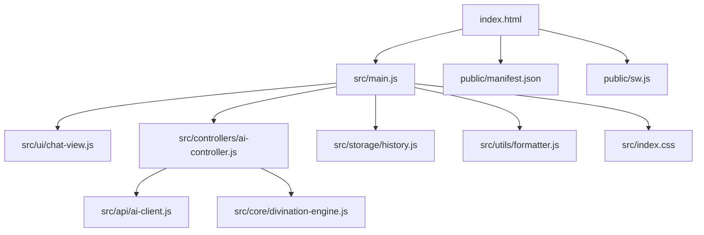
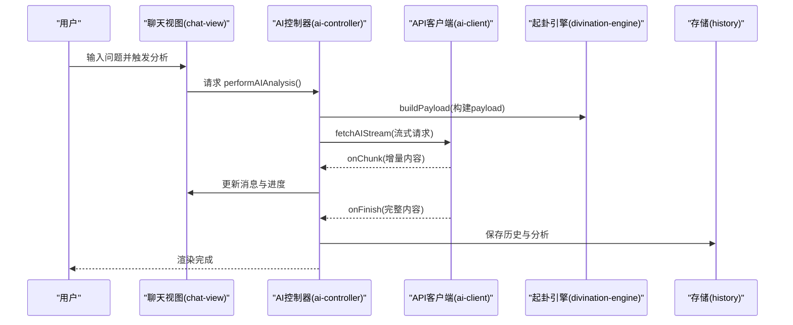
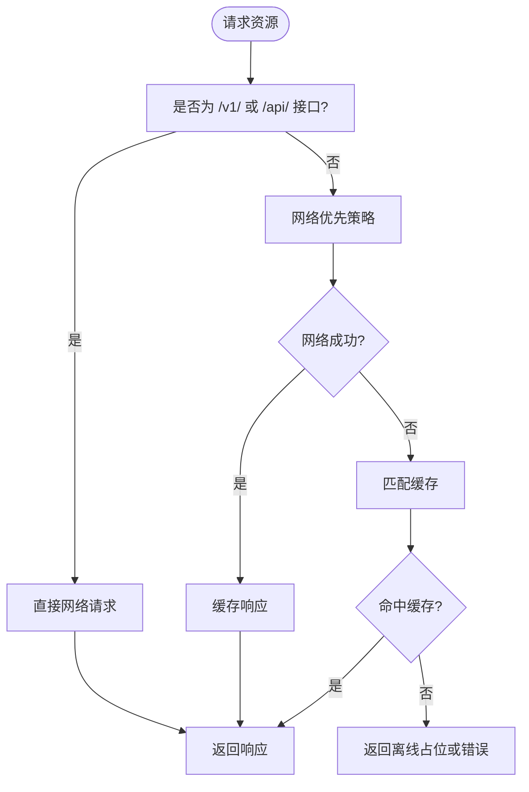
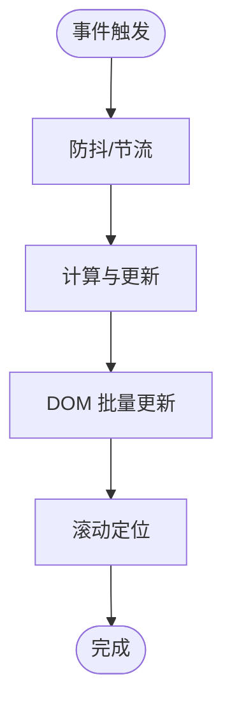
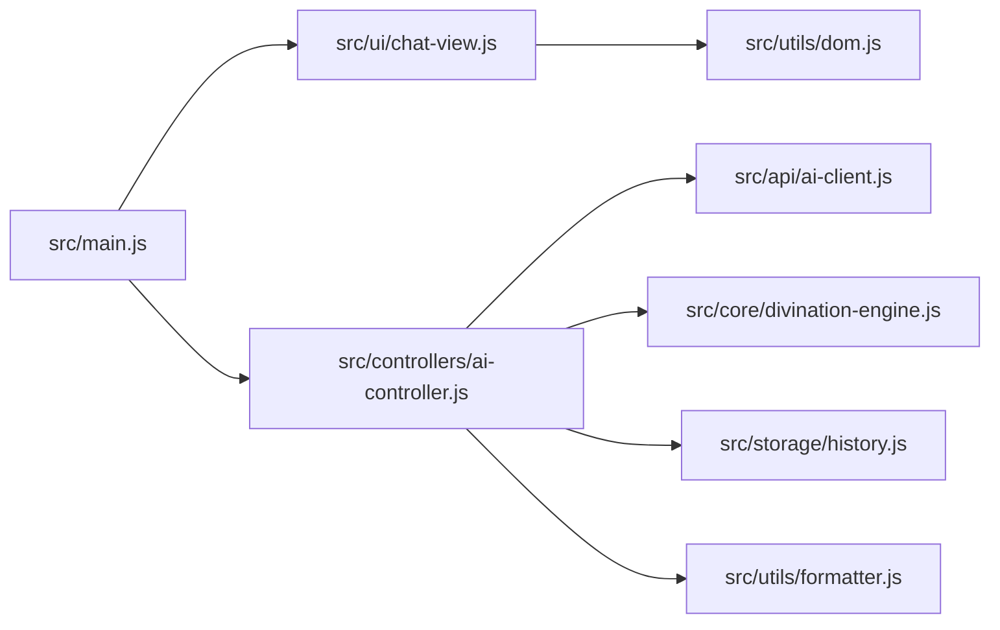

# 性能优化

<cite>
**本文引用的文件**
- [package.json](file://package.json)
- [vite.config.js](file://vite.config.js)
- [index.html](file://index.html)
- [public/manifest.json](file://public/manifest.json)
- [public/sw.js](file://public/sw.js)
- [src/main.js](file://src/main.js)
- [src/index.css](file://src/index.css)
- [src/utils/dom.js](file://src/utils/dom.js)
- [src/ui/chat-view.js](file://src/ui/chat-view.js)
- [src/controllers/ai-controller.js](file://src/controllers/ai-controller.js)
- [src/api/ai-client.js](file://src/api/ai-client.js)
- [src/storage/history.js](file://src/storage/history.js)
- [src/utils/formatter.js](file://src/utils/formatter.js)
- [src/core/divination-engine.js](file://src/core/divination-engine.js)
- [legacy/app-core.js](file://legacy/app-core.js)
</cite>

## 目录
1. [简介](#简介)
2. [项目结构](#项目结构)
3. [核心组件](#核心组件)
4. [架构总览](#架构总览)
5. [详细组件分析](#详细组件分析)
6. [依赖分析](#依赖分析)
7. [性能考量](#性能考量)
8. [故障排查指南](#故障排查指南)
9. [结论](#结论)
10. [附录](#附录)

## 简介
本文件面向“梅花义理”项目，系统梳理前端性能优化策略，覆盖代码分割与懒加载、缓存与PWA、CSS与JS执行效率、监控与分析、构建优化与包体积控制、以及性能测试与基准测试方法。内容基于仓库现有实现与配置，结合最佳实践，帮助在不改变业务逻辑的前提下显著提升用户体验与运行效率。

## 项目结构
项目采用 Vite 构建，入口 HTML 位于根目录，核心逻辑集中在 src 目录，静态资源与 PWA 相关文件位于 public 目录。主要模块职责：
- 入口与路由：index.html 作为 SPA 入口，通过脚本加载 main.js
- 控制器与视图：src/main.js 负责初始化、事件绑定与页面切换；ui 子模块负责聊天、历史、模态框等视图渲染
- 核心引擎：divination-engine.js 实现起卦与推演；ai-controller.js 负责流式分析与 UI 更新
- 数据与存储：history.js 管理本地历史与云端同步；formatter.js 处理 Markdown 渲染
- API 客户端：ai-client.js 提供流式请求、超时与重试机制
- 样式：index.css 提供主题与布局样式
- PWA：manifest.json 与 sw.js 提供安装与离线缓存能力

图表来源
- [index.html](file://index.html)
- [src/main.js](file://src/main.js)
- [src/ui/chat-view.js](file://src/ui/chat-view.js)
- [src/controllers/ai-controller.js](file://src/controllers/ai-controller.js)
- [src/api/ai-client.js](file://src/api/ai-client.js)
- [src/core/divination-engine.js](file://src/core/divination-engine.js)
- [src/storage/history.js](file://src/storage/history.js)
- [src/utils/formatter.js](file://src/utils/formatter.js)
- [src/index.css](file://src/index.css)
- [public/manifest.json](file://public/manifest.json)
- [public/sw.js](file://public/sw.js)

章节来源
- [index.html](file://index.html)
- [src/main.js](file://src/main.js)

## 核心组件
- 应用入口与初始化：负责主题、模态框、事件绑定、历史与模型选择、滚动与可见性控制等
- 流式分析控制器：封装流式请求、进度模拟、错误处理、自动续传、历史保存与 UI 更新
- API 客户端：统一的流式请求封装，支持超时、重试、代理模式
- 起卦引擎：构建三卦（本/变/对）与体用关系，支持日期重算月令能量
- 存储与历史：本地 localStorage + 云端同步，带配额溢出回退策略
- 视图与渲染：聊天消息、双列对比、滚动与近底判断、Markdown 渲染
- 样式与主题：CSS 变量驱动的主题切换，暗黑模式与动画过渡
- PWA 与缓存：Manifest 与 Service Worker，壳缓存与网络优先策略

章节来源
- [src/main.js](file://src/main.js)
- [src/controllers/ai-controller.js](file://src/controllers/ai-controller.js)
- [src/api/ai-client.js](file://src/api/ai-client.js)
- [src/core/divination-engine.js](file://src/core/divination-engine.js)
- [src/storage/history.js](file://src/storage/history.js)
- [src/ui/chat-view.js](file://src/ui/chat-view.js)
- [src/utils/formatter.js](file://src/utils/formatter.js)
- [src/index.css](file://src/index.css)
- [public/manifest.json](file://public/manifest.json)
- [public/sw.js](file://public/sw.js)

## 架构总览
应用采用“控制器-视图-模型”的分层设计，AI 分析通过流式接口逐步渲染，历史与配额在控制器中统一管理，样式通过 CSS 变量与主题切换实现。

图表来源
- [src/ui/chat-view.js](file://src/ui/chat-view.js)
- [src/controllers/ai-controller.js](file://src/controllers/ai-controller.js)
- [src/api/ai-client.js](file://src/api/ai-client.js)
- [src/core/divination-engine.js](file://src/core/divination-engine.js)
- [src/storage/history.js](file://src/storage/history.js)

## 详细组件分析

### 代码分割与懒加载
- 现状：入口通过单文件 main.js 加载，未启用动态 import 的代码分割
- 优化建议：
  - 将大型模块（如历史列表、聊天视图、设置面板）拆分为独立模块，使用动态 import 在需要时加载
  - 将第三方图标库（lucide）按需引入或延迟加载，避免首屏阻塞
  - 将重型计算（如起卦引擎）在首次使用时惰性初始化，或在 Web Worker 中执行以避免阻塞主线程

章节来源
- [src/main.js](file://src/main.js)
- [src/ui/chat-view.js](file://src/ui/chat-view.js)
- [src/controllers/ai-controller.js](file://src/controllers/ai-controller.js)

### 缓存策略与PWA
- Manifest 与安装：通过 manifest.json 提供安装元信息，支持 standalone 模式
- Service Worker：sw.js 使用壳缓存（shell caching）与网络优先策略，排除 /v1/ 与 /api/ 请求
- 现状与建议：
  - 壳缓存仅包含根路径与 index.html，建议增加关键静态资源（如字体、图标）的缓存
  - 对于非关键资源，采用 Cache-Control: immutable 或长 TTL，减少网络往返
  - 在生产环境开启 HTTPS 并确保 SW 正常激活与缓存清理

图表来源
- [public/sw.js](file://public/sw.js)
- [public/manifest.json](file://public/manifest.json)

章节来源
- [public/sw.js](file://public/sw.js)
- [public/manifest.json](file://public/manifest.json)

### CSS 优化与样式性能
- 主题变量：通过 CSS 变量集中管理颜色与阴影，减少重复定义
- 暗黑模式：通过 data-theme 切换，避免重复样式
- 性能建议：
  - 将高频动画（如加载指示器）使用 transform 与 opacity，避免触发布局
  - 合理使用 backdrop-filter 与阴影，注意在低端设备上的性能影响
  - 将媒体查询与复杂选择器拆分，减少重排与重绘

章节来源
- [src/index.css](file://src/index.css)

### JavaScript 执行效率与内存管理
- 事件绑定与节流防抖：滚动与窗口尺寸变更使用节流/防抖，降低频繁计算
- DOM 操作：批量插入与滚动定位，避免逐条 DOM 操作
- 流式渲染：聊天消息按增量更新，避免一次性渲染大量节点
- 内存管理：
  - 及时清理定时器与计时器（如思考进度）
  - 在分析完成或错误时释放中断上下文
  - 避免闭包持有大对象导致 GC 困难

图表来源
- [src/main.js](file://src/main.js)
- [src/ui/chat-view.js](file://src/ui/chat-view.js)

章节来源
- [src/main.js](file://src/main.js)
- [src/ui/chat-view.js](file://src/ui/chat-view.js)

### 性能监控与分析
- 浏览器开发者工具：使用 Performance 面板记录渲染与脚本执行；Memory 面板观察内存峰值
- 关键指标：
  - 首屏时间（FCP/FID/LCP）
  - 交互可用时间（TTI）
  - 流式分析首字节时间（TTFB）与吞吐
- 建议：
  - 在关键路径（起卦、流式渲染）埋点记录时间戳
  - 对网络错误与超时进行分类统计，辅助优化重试与代理策略

章节来源
- [src/controllers/ai-controller.js](file://src/controllers/ai-controller.js)
- [src/api/ai-client.js](file://src/api/ai-client.js)

### 构建优化与包体积控制
- 现状：Vite 默认配置，移除了 crossOrigin 属性以适配微信浏览器
- 优化建议：
  - 启用压缩与 Tree Shaking（Vite 已默认开启）
  - 使用动态 import 实现按需加载
  - 分析包体构成，剔除冗余依赖或替换更小版本
  - 生产环境开启资源压缩与缓存头

章节来源
- [vite.config.js](file://vite.config.js)
- [package.json](file://package.json)

### 性能测试与基准测试
- 基准场景：
  - 起卦到首字节：记录从触发到第一条增量内容的时间
  - 流式渲染吞吐：统计单位时间内渲染的消息片段数量
  - 历史加载：模拟大量历史记录的渲染与滚动
- 工具与方法：
  - Lighthouse（离线/在线）评估首屏与交互
  - WebPageTest 或自建基准脚本，模拟不同网络与设备
  - 持续集成中加入性能回归阈值

章节来源
- [src/controllers/ai-controller.js](file://src/controllers/ai-controller.js)
- [src/api/ai-client.js](file://src/api/ai-client.js)

## 依赖分析
- 外部依赖：Vite、Lucide 图标（按需使用）、浏览器原生 Fetch 与 AbortController
- 内部模块耦合：
  - main.js 依赖 ui、controllers、storage、utils
  - ai-controller 依赖 api-client、formatter、storage、core
  - chat-view 依赖 dom 与 formatter
- 建议：
  - 降低循环依赖，拆分通用工具模块
  - 对重型模块（如 legacy/app-core.js）进行迁移或隔离

图表来源
- [src/main.js](file://src/main.js)
- [src/ui/chat-view.js](file://src/ui/chat-view.js)
- [src/controllers/ai-controller.js](file://src/controllers/ai-controller.js)
- [src/api/ai-client.js](file://src/api/ai-client.js)
- [src/core/divination-engine.js](file://src/core/divination-engine.js)
- [src/storage/history.js](file://src/storage/history.js)
- [src/utils/formatter.js](file://src/utils/formatter.js)
- [src/utils/dom.js](file://src/utils/dom.js)

章节来源
- [src/main.js](file://src/main.js)
- [src/controllers/ai-controller.js](file://src/controllers/ai-controller.js)

## 性能考量
- 首屏与交互：
  - 优先保证 index.html 与关键 CSS/JS 下载
  - 将非关键脚本延迟加载
- 网络与流式：
  - 合理设置超时与重试，避免长时间挂起
  - 对代理模式与直连模式分别优化
- 存储与历史：
  - 本地存储容量接近上限时及时裁剪
  - 云端同步异步进行，不影响主流程

章节来源
- [src/storage/history.js](file://src/storage/history.js)
- [src/api/ai-client.js](file://src/api/ai-client.js)

## 故障排查指南
- 流式分析中断：
  - 检查网络错误类型，区分超时与鉴权失败
  - 自动续传逻辑仅在部分条件下生效，确认上下文是否保留
- PWA 安装与缓存：
  - 确认 sw.js 已注册且激活
  - 检查缓存命名与清理逻辑
- 主题与滚动：
  - 暗黑模式切换后检查 CSS 变量是否生效
  - 滚动定位与近底判断依赖容器尺寸，注意容器变化后的重算

章节来源
- [src/controllers/ai-controller.js](file://src/controllers/ai-controller.js)
- [public/sw.js](file://public/sw.js)
- [src/main.js](file://src/main.js)

## 结论
通过合理的代码分割、按需加载、缓存与 PWA 策略、CSS 与 JS 执行优化、完善的监控与测试体系，可在不牺牲功能与体验的前提下显著提升“梅花义理”的性能表现。建议优先实施低门槛优化（懒加载、缓存、事件节流）并逐步引入更深入的优化手段（Web Worker、资源压缩、包体分析）。

## 附录
- 术语说明：
  - 本卦/变卦/对卦：起卦、变化、终局的三阶段推演
  - 体用：主体与客体的对应关系，决定吉凶判断
  - 月令：节气月令对五行能量的影响