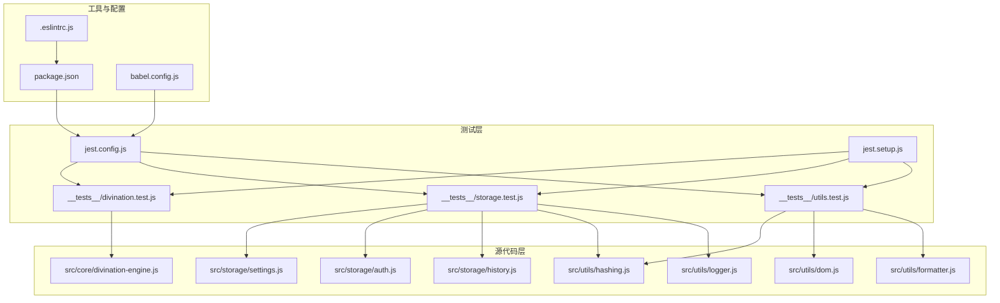
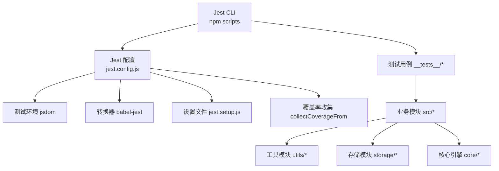
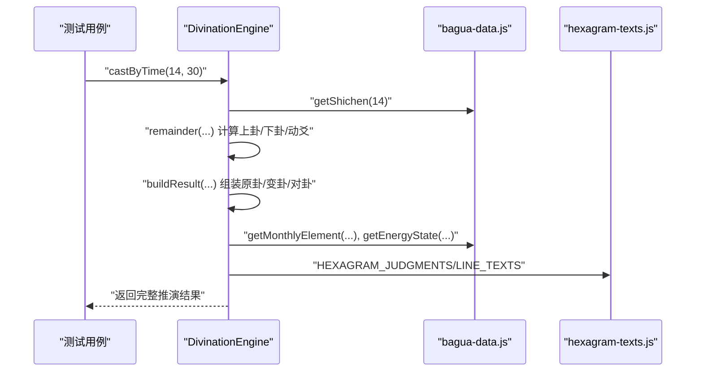
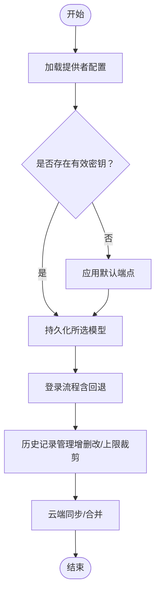
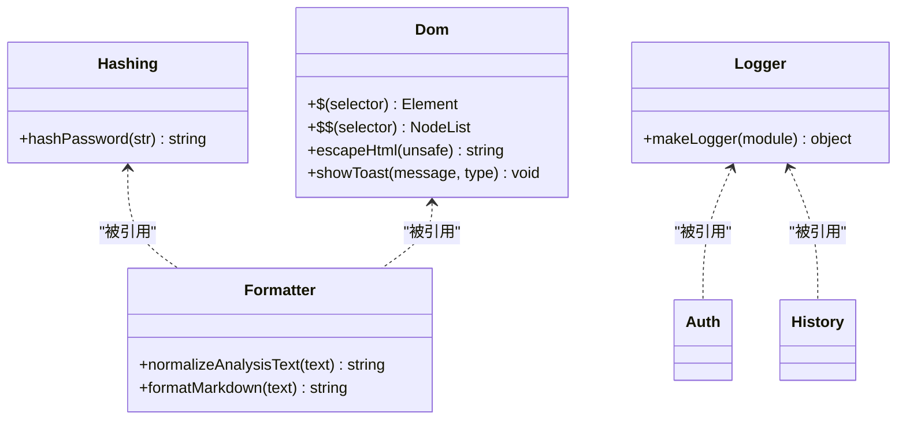
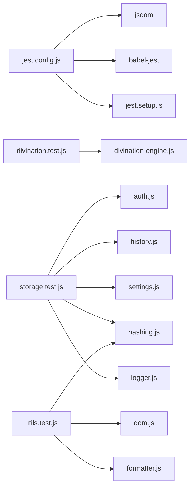

# 调试与测试

<cite>
**本文引用的文件**
- [jest.config.js](file://jest.config.js)
- [jest.setup.js](file://jest.setup.js)
- [package.json](file://package.json)
- [__tests__/divination.test.js](file://__tests__/divination.test.js)
- [__tests__/storage.test.js](file://__tests__/storage.test.js)
- [__tests__/utils.test.js](file://__tests__/utils.test.js)
- [src/core/divination-engine.js](file://src/core/divination-engine.js)
- [src/storage/settings.js](file://src/storage/settings.js)
- [src/storage/auth.js](file://src/storage/auth.js)
- [src/storage/history.js](file://src/storage/history.js)
- [src/utils/hashing.js](file://src/utils/hashing.js)
- [src/utils/dom.js](file://src/utils/dom.js)
- [src/utils/formatter.js](file://src/utils/formatter.js)
- [src/utils/logger.js](file://src/utils/logger.js)
- [.eslintrc.js](file://.eslintrc.js)
- [babel.config.js](file://babel.config.js)
</cite>

## 目录
1. [引言](#引言)
2. [项目结构](#项目结构)
3. [核心组件](#核心组件)
4. [架构总览](#架构总览)
5. [详细组件分析](#详细组件分析)
6. [依赖分析](#依赖分析)
7. [性能考虑](#性能考虑)
8. [故障排查指南](#故障排查指南)
9. [结论](#结论)
10. [附录](#附录)

## 引言
本文件面向“梅花义理”项目的开发与维护者，系统化阐述调试与测试实践，覆盖单元测试编写方法、测试用例设计原则、Jest 配置与运行方式、断言库使用与测试数据准备、调试技巧与问题排查、测试覆盖率要求与报告生成、集成测试与端到端测试思路，以及测试环境搭建与持续集成建议。目标是帮助团队建立稳定、可维护、可扩展的测试体系。

## 项目结构
项目采用模块化组织，核心业务逻辑集中在 src 目录，测试用例集中于 __tests__ 目录，测试运行通过 Jest 驱动，ESLint 提供静态检查，Babel 用于转换，Vite 提供开发与构建能力。

**图表来源**
- [jest.config.js:1-43](file://jest.config.js#L1-L43)
- [jest.setup.js:1-9](file://jest.setup.js#L1-L9)
- [package.json:1-32](file://package.json#L1-L32)
- [__tests__/divination.test.js:1-174](file://__tests__/divination.test.js#L1-L174)
- [__tests__/storage.test.js:1-198](file://__tests__/storage.test.js#L1-L198)
- [__tests__/utils.test.js:1-76](file://__tests__/utils.test.js#L1-L76)
- [src/core/divination-engine.js:1-433](file://src/core/divination-engine.js#L1-L433)
- [src/utils/hashing.js:1-20](file://src/utils/hashing.js#L1-L20)
- [src/utils/dom.js:1-41](file://src/utils/dom.js#L1-L41)
- [src/utils/formatter.js:1-92](file://src/utils/formatter.js#L1-L92)
- [src/storage/settings.js:1-86](file://src/storage/settings.js#L1-L86)
- [src/storage/auth.js:1-350](file://src/storage/auth.js#L1-L350)
- [src/storage/history.js:1-143](file://src/storage/history.js#L1-L143)
- [src/utils/logger.js:1-34](file://src/utils/logger.js#L1-L34)
- [babel.config.js:1-6](file://babel.config.js#L1-L6)
- [.eslintrc.js:1-26](file://.eslintrc.js#L1-L26)

**章节来源**
- [jest.config.js:1-43](file://jest.config.js#L1-L43)
- [jest.setup.js:1-9](file://jest.setup.js#L1-L9)
- [package.json:1-32](file://package.json#L1-L32)
- [.eslintrc.js:1-26](file://.eslintrc.js#L1-L26)
- [babel.config.js:1-6](file://babel.config.js#L1-L6)

## 核心组件
- 单元测试入口与配置：Jest 通过配置文件定义测试环境、匹配规则、转换器、覆盖率阈值、超时与设置文件等。
- 断言库：Jest 内置断言，配合测试数据准备（如 localStorage mock、fetch mock）实现对异步与本地存储场景的覆盖。
- 测试脚本：通过 npm scripts 提供 test、test:watch、test:coverage 等命令，便于快速执行与观察。
- 静态检查：ESLint 配置启用 jest 环境与全局只读变量，确保测试代码与业务代码的一致性与可维护性。
- 转换与兼容：Babel 配置确保测试在当前 Node 环境下正常运行。

**章节来源**
- [jest.config.js:1-43](file://jest.config.js#L1-L43)
- [jest.setup.js:1-9](file://jest.setup.js#L1-L9)
- [package.json:5-13](file://package.json#L5-L13)
- [.eslintrc.js:6-15](file://.eslintrc.js#L6-L15)
- [babel.config.js:1-6](file://babel.config.js#L1-L6)

## 架构总览
测试架构围绕“配置驱动 + 模块解耦 + 数据隔离”的原则设计，确保测试可重复、可定位、可扩展。

**图表来源**
- [jest.config.js:1-43](file://jest.config.js#L1-L43)
- [jest.setup.js:1-9](file://jest.setup.js#L1-L9)
- [package.json:5-13](file://package.json#L5-L13)
- [__tests__/divination.test.js:1-174](file://__tests__/divination.test.js#L1-L174)
- [__tests__/storage.test.js:1-198](file://__tests__/storage.test.js#L1-L198)
- [__tests__/utils.test.js:1-76](file://__tests__/utils.test.js#L1-L76)

## 详细组件分析

### DivinationEngine 单元测试
- 覆盖点：时间起卦、两数法、三数法、手动选卦、取余函数、payload 构造、三阶段推理、文本解析与校验、日期解析与重算月令能量。
- 设计原则：参数边界（1~8 的索引、1~6 的动爻）、状态一致性（原卦/变卦/对卦）、能量关系（体用生克）与文本映射（卦名、爻辞）。
- 断言策略：结构完整性（对象键存在、数组长度）、数值范围（索引与动爻）、关系枚举（能量状态）、字符串匹配（方法名与文本片段）。

**图表来源**
- [__tests__/divination.test.js:5-121](file://__tests__/divination.test.js#L5-L121)
- [src/core/divination-engine.js:35-201](file://src/core/divination-engine.js#L35-L201)

**章节来源**
- [__tests__/divination.test.js:1-174](file://__tests__/divination.test.js#L1-L174)
- [src/core/divination-engine.js:1-433](file://src/core/divination-engine.js#L1-L433)

### 存储模块（settings/auth/history）单元测试
- Mock 策略：使用 localStorage mock 与 fetch mock，隔离真实存储与网络请求；beforeEach 清理状态，避免跨用例污染。
- 关键路径：提供者配置加载/保存、模型选择、用户注册/登录/登出、历史记录增删改与上限控制、云端同步与合并、配额与访客额度。
- 断言要点：默认值与回退逻辑、空值与异常分支、幂等性与顺序性（新增记录前置）、容量裁剪（上限 50 条）。

**图表来源**
- [__tests__/storage.test.js:24-100](file://__tests__/storage.test.js#L24-L100)
- [src/storage/settings.js:38-85](file://src/storage/settings.js#L38-L85)
- [src/storage/auth.js:46-225](file://src/storage/auth.js#L46-L225)
- [src/storage/history.js:15-102](file://src/storage/history.js#L15-L102)

**章节来源**
- [__tests__/storage.test.js:1-198](file://__tests__/storage.test.js#L1-L198)
- [src/storage/settings.js:1-86](file://src/storage/settings.js#L1-L86)
- [src/storage/auth.js:1-350](file://src/storage/auth.js#L1-L350)
- [src/storage/history.js:1-143](file://src/storage/history.js#L1-L143)

### 工具模块（hashing/dom/formatter/logger）单元测试
- 哈希：确定性、不同输入不同输出、类型与非空校验。
- DOM：HTML 转义、特殊字符处理、空值安全。
- 格式化：标题规范化、Markdown 到 HTML 转换、列表与换行处理、输入转义与输出安全。
- 日志：级别过滤（生产仅 warn+），模块前缀输出。

**图表来源**
- [src/utils/hashing.js:1-20](file://src/utils/hashing.js#L1-L20)
- [src/utils/dom.js:1-41](file://src/utils/dom.js#L1-L41)
- [src/utils/formatter.js:1-92](file://src/utils/formatter.js#L1-L92)
- [src/utils/logger.js:1-34](file://src/utils/logger.js#L1-L34)
- [src/storage/auth.js:5-6](file://src/storage/auth.js#L5-L6)
- [src/storage/history.js:5](file://src/storage/history.js#L5)

**章节来源**
- [__tests__/utils.test.js:1-76](file://__tests__/utils.test.js#L1-L76)
- [src/utils/hashing.js:1-20](file://src/utils/hashing.js#L1-L20)
- [src/utils/dom.js:1-41](file://src/utils/dom.js#L1-L41)
- [src/utils/formatter.js:1-92](file://src/utils/formatter.js#L1-L92)
- [src/utils/logger.js:1-34](file://src/utils/logger.js#L1-L34)

## 依赖分析
- 测试依赖：Jest（测试运行与断言）、jsdom（DOM 环境）、babel-jest（语法转换）、jest-environment-jsdom（测试环境包）。
- 业务依赖：各模块内部通过导入关系耦合，测试通过模块化拆分降低耦合度；工具模块被多处复用，提升测试覆盖面。
- 外部接口：fetch 用于服务端交互，测试中以 mock 形式注入，保证可预测性与稳定性。

**图表来源**
- [jest.config.js:1-43](file://jest.config.js#L1-L43)
- [__tests__/divination.test.js:1-4](file://__tests__/divination.test.js#L1-L4)
- [__tests__/storage.test.js:1-22](file://__tests__/storage.test.js#L1-L22)
- [__tests__/utils.test.js:1-3](file://__tests__/utils.test.js#L1-L3)
- [src/core/divination-engine.js:6-21](file://src/core/divination-engine.js#L6-L21)
- [src/storage/auth.js:5-6](file://src/storage/auth.js#L5-L6)
- [src/storage/history.js:5](file://src/storage/history.js#L5)
- [src/storage/settings.js:1-86](file://src/storage/settings.js#L1-L86)
- [src/utils/hashing.js:1-20](file://src/utils/hashing.js#L1-L20)
- [src/utils/dom.js:1-41](file://src/utils/dom.js#L1-L41)
- [src/utils/formatter.js:1-92](file://src/utils/formatter.js#L1-L92)
- [src/utils/logger.js:1-34](file://src/utils/logger.js#L1-L34)

**章节来源**
- [jest.config.js:1-43](file://jest.config.js#L1-L43)
- [package.json:24-31](file://package.json#L24-L31)

## 性能考虑
- 测试超时：默认 10 秒，适用于包含异步与网络请求的测试；可根据实际场景调整。
- 覆盖率阈值：全局分支、函数、行、语句均设为 50%，建议在关键路径逐步提升阈值以保障质量。
- 缓存目录：启用 .jest_cache，减少重复计算，提升迭代速度。
- 转换器：babel-jest 仅在必要时开启，避免不必要的转换开销。

**章节来源**
- [jest.config.js:23-42](file://jest.config.js#L23-L42)

## 故障排查指南
- 测试未执行或匹配不到文件
  - 检查测试文件命名与路径是否符合匹配规则。
  - 确认 jest.setup.js 是否正确挂载到 setupFilesAfterEnv。
- DOM 相关测试失败
  - 确认 testEnvironment 使用 jsdom；若涉及元素查询，使用工具函数封装选择器。
- 异步与网络请求
  - 使用 fetch mock 注入失败时，检查 mock 定义与作用域；确保在 beforeEach 中重置。
- 本地存储污染
  - 使用 localStorage mock 并在 afterEach 恢复；避免跨用例共享状态。
- 覆盖率不足
  - 补充边界条件与异常分支用例；对分支密集区域进行针对性覆盖。
- 生产日志级别
  - 生产构建仅输出 warn+，调试时可临时降低级别或在本地开发环境运行测试。

**章节来源**
- [jest.config.js:3-42](file://jest.config.js#L3-L42)
- [jest.setup.js:4-8](file://jest.setup.js#L4-L8)
- [__tests__/storage.test.js:24-51](file://__tests__/storage.test.js#L24-L51)
- [src/utils/logger.js:10-12](file://src/utils/logger.js#L10-L12)

## 结论
通过明确的测试配置、规范的用例设计与充分的数据隔离，项目在单元测试层面建立了可靠的反馈机制。建议持续完善覆盖率阈值、补充集成与端到端测试，并结合 CI 自动化执行，以进一步提升交付质量与可维护性。

## 附录

### 单元测试编写方法与设计原则
- 分层断言：先断言结构完整性，再断言数值范围与关系枚举，最后断言字符串匹配。
- 边界测试：覆盖索引与动爻的最小/最大值、空输入与异常输入。
- 幂等性与顺序性：新增记录前置、上限裁剪、云端合并去重。
- 回退与默认值：网络失败时的本地回退、默认端点与模型选择。

**章节来源**
- [__tests__/divination.test.js:5-121](file://__tests__/divination.test.js#L5-L121)
- [__tests__/storage.test.js:24-100](file://__tests__/storage.test.js#L24-L100)
- [__tests__/utils.test.js:5-75](file://__tests__/utils.test.js#L5-L75)

### Jest 配置与运行方法
- 配置项概览
  - testEnvironment: jsdom
  - testMatch: 匹配 test-*.js 与 __tests__/**/*.js
  - transform: babel-jest
  - collectCoverageFrom: 收集 src 下 JS 文件（排除入口与样式）
  - coverageThreshold: 全局 50%
  - setupFilesAfterEnv: jest.setup.js
  - testTimeout: 10000ms
  - cacheDirectory: .jest_cache
- 运行命令
  - npm run test：一次性运行
  - npm run test:watch：监听模式
  - npm run test:coverage：生成覆盖率报告

**章节来源**
- [jest.config.js:1-43](file://jest.config.js#L1-L43)
- [jest.setup.js:1-9](file://jest.setup.js#L1-L9)
- [package.json:5-13](file://package.json#L5-L13)

### 断言库使用与测试数据准备
- 断言库：Jest 内置断言（toBeDefined、toHaveLength、toBe、toContain、toEqual 等）。
- 测试数据准备：
  - localStorage mock：统一注入全局 localStorage。
  - fetch mock：在 beforeEach 中注入拒绝的 Promise，验证错误分支。
  - 全局配置：通过 jest.setup.js 注入 testConfig。

**章节来源**
- [__tests__/storage.test.js:24-51](file://__tests__/storage.test.js#L24-L51)
- [jest.setup.js:4-8](file://jest.setup.js#L4-L8)

### 测试覆盖率要求与报告生成
- 覆盖率收集：src/**/*.js（排除入口与样式）。
- 阈值：全局分支、函数、行、语句均为 50%。
- 报告生成：通过 npm run test:coverage 生成报告。

**章节来源**
- [jest.config.js:16-30](file://jest.config.js#L16-L30)

### 集成测试与端到端测试实施方法
- 集成测试（概念性指导）
  - 场景：用户登录后进行起卦并查看历史记录，验证本地与云端同步。
  - 方法：组合 auth 与 history 模块，使用 fetch mock 验证同步流程与去重合并。
- 端到端测试（概念性指导）
  - 场景：浏览器打开页面，输入问题，触发 AI 推演，展示结果。
  - 方法：结合 jsdom 与真实浏览器（如 Playwright/Cypress）进行交互测试；关注 DOM 更新、事件绑定与网络请求。

[本节为概念性内容，不直接分析具体文件，故无“章节来源”]

### 测试环境搭建与持续集成
- 环境搭建
  - 安装依赖：Jest、jest-environment-jsdom、babel-jest、ESLint、Vite。
  - 配置 Babel 与 ESLint，确保测试与业务代码风格一致。
- 持续集成
  - 触发条件：push 与 pull_request。
  - 步骤建议：安装依赖、运行 Lint、运行 Jest（带覆盖率）、上传覆盖率（可选）。
  - 缓存：缓存 node_modules 与 .jest_cache 以加速流水线。

**章节来源**
- [package.json:24-31](file://package.json#L24-L31)
- [.eslintrc.js:1-26](file://.eslintrc.js#L1-L26)
- [babel.config.js:1-6](file://babel.config.js#L1-L6)