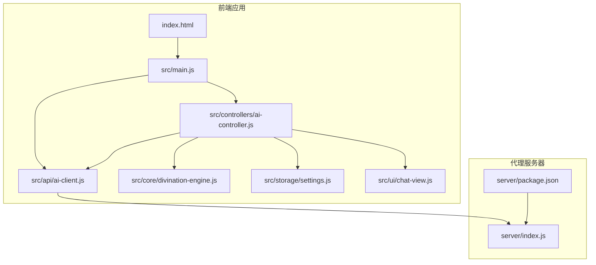
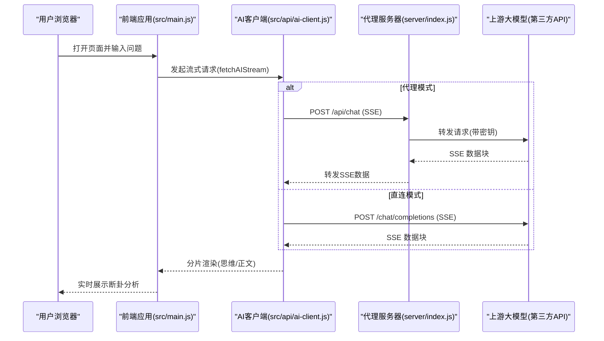
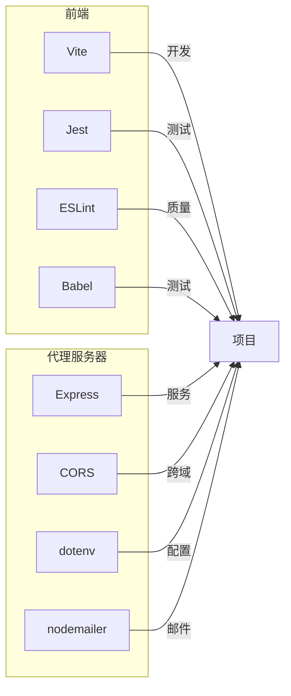

# 快速开始

<cite>
**本文引用的文件**
- [package.json](file://package.json)
- [vite.config.js](file://vite.config.js)
- [index.html](file://index.html)
- [src/main.js](file://src/main.js)
- [src/api/ai-client.js](file://src/api/ai-client.js)
- [src/controllers/ai-controller.js](file://src/controllers/ai-controller.js)
- [src/storage/settings.js](file://src/storage/settings.js)
- [src/core/divination-engine.js](file://src/core/divination-engine.js)
- [src/utils/logger.js](file://src/utils/logger.js)
- [src/ui/chat-view.js](file://src/ui/chat-view.js)
- [.eslintrc.js](file://.eslintrc.js)
- [jest.config.js](file://jest.config.js)
- [babel.config.js](file://babel.config.js)
- [vercel.json](file://vercel.json)
- [.gitignore](file://.gitignore)
- [server/package.json](file://server/package.json)
- [server/index.js](file://server/index.js)
- [dist/index.html](file://dist/index.html)
</cite>

## 更新摘要
**变更内容**
- 更新应用启动流程说明：移除了官方网站landing页面，应用现在直接进入主界面
- 更新初始化逻辑：应用启动时自动进入应用模式，无需用户交互
- 更新基本使用示例：用户可以直接开始使用核心功能，无需先访问landing页面

## 目录
1. [简介](#简介)
2. [项目结构](#项目结构)
3. [核心组件](#核心组件)
4. [架构总览](#架构总览)
5. [详细组件分析](#详细组件分析)
6. [依赖分析](#依赖分析)
7. [性能注意事项](#性能注意事项)
8. [故障排除指南](#故障排除指南)
9. [结论](#结论)
10. [附录](#附录)

## 简介
本指南面向首次接触"梅花义理"的开发者与使用者，帮助你在本地快速搭建开发环境、安装依赖、启动开发服务器，并理解项目目录结构与关键配置文件的作用。你将学会：
- 如何准备 Node.js 与包管理器环境
- 如何安装主项目与代理服务器依赖
- 如何启动 Vite 开发服务器与代理服务器
- 如何配置代理模式与模型接入
- 如何排查常见安装与运行问题
- 如何体验核心功能：起卦与 AI 断卦

**重要更新**：应用启动流程已简化，移除了官方网站landing页面，现在直接进入主界面，用户无需任何交互即可访问核心功能。

## 项目结构
项目采用前端单页应用（SPA）与独立代理服务器分离的架构设计，便于在生产环境中隐藏真实 API 密钥并提升安全性。

图表来源
- [index.html](file://index.html)
- [src/main.js](file://src/main.js)
- [src/api/ai-client.js](file://src/api/ai-client.js)
- [src/controllers/ai-controller.js](file://src/controllers/ai-controller.js)
- [src/core/divination-engine.js](file://src/core/divination-engine.js)
- [src/storage/settings.js](file://src/storage/settings.js)
- [src/ui/chat-view.js](file://src/ui/chat-view.js)
- [server/index.js](file://server/index.js)
- [server/package.json](file://server/package.json)

章节来源
- [package.json](file://package.json)
- [index.html](file://index.html)
- [src/main.js](file://src/main.js)
- [server/index.js](file://server/index.js)

## 核心组件
- 前端入口与初始化：index.html 作为 SPA 入口，src/main.js 负责应用初始化、事件绑定与控制器委派。
- AI 接入客户端：src/api/ai-client.js 提供流式 SSE 请求封装、超时与重试策略，并支持代理模式直连两种模式。
- AI 控制器：src/controllers/ai-controller.js 负责构建系统提示词、消息体、流式渲染与历史记录持久化。
- 起卦引擎：src/core/divination-engine.js 实现时间/报数/手动等多种起卦方式与三卦（本/变/对）联动分析。
- 设置与模型：src/storage/settings.js 管理提供商与模型配置、API Key 存储与默认值。
- UI 视图：src/ui/chat-view.js 负责聊天消息渲染、双列对比布局与滚动控制。
- 日志工具：src/utils/logger.js 提供按环境过滤的日志级别输出。
- 代理服务器：server/index.js 提供跨域、静态资源托管、会话与历史记录管理、SSE 代理与健康检查。

章节来源
- [src/main.js](file://src/main.js)
- [src/api/ai-client.js](file://src/api/ai-client.js)
- [src/controllers/ai-controller.js](file://src/controllers/ai-controller.js)
- [src/core/divination-engine.js](file://src/core/divination-engine.js)
- [src/storage/settings.js](file://src/storage/settings.js)
- [src/ui/chat-view.js](file://src/ui/chat-view.js)
- [src/utils/logger.js](file://src/utils/logger.js)
- [server/index.js](file://server/index.js)

## 架构总览
下图展示了从浏览器到代理服务器再到第三方大模型的请求链路，以及本地开发与生产部署的关键差异。

图表来源
- [src/main.js](file://src/main.js)
- [src/api/ai-client.js](file://src/api/ai-client.js)
- [server/index.js](file://server/index.js)

## 详细组件分析

### 环境准备与依赖安装
- Node.js 版本要求
  - 项目使用 Vite 与现代 ES 模块特性，推荐使用 Node.js LTS（如 18.x 或 20.x）。
  - 代理服务器使用 ES 模块与 dotenv，建议 Node.js 16+。
- 包管理器选择
  - 推荐使用 npm（Node.js 自带）或 pnpm（更快的依赖安装）。
- 安装步骤
  1) 在根目录安装主项目依赖：
     - 运行：npm install
  2) 在 server 目录安装代理服务器依赖：
     - 进入 server 目录：cd server
     - 运行：npm install
  3) 创建并配置代理服务器环境变量：
     - 复制示例文件：cp .env.example .env
     - 在 .env 中填写 ALLOWED_ORIGINS、SF_API_KEY、DS_API_KEY、SMTP_USER、SMTP_PASS 等参数。
- 开发脚本
  - 主项目：npm run dev 启动 Vite 开发服务器
  - 代理服务器：cd server && npm run dev 或 npm start

章节来源
- [package.json](file://package.json)
- [server/package.json](file://server/package.json)
- [server/index.js](file://server/index.js)

### Vite 开发环境配置
- Vite 配置要点
  - 移除 HTML 中的 crossorigin 属性，避免微信浏览器跨域问题。
  - 关闭 modulePreload polyfill，优化构建体积。
- 启动命令
  - npm run dev 在本地启动开发服务器，默认端口由 Vite 分配。
- 生产构建
  - npm run build 生成 dist 目录，供代理服务器托管静态资源。

章节来源
- [vite.config.js](file://vite.config.js)
- [package.json](file://package.json)

### 代理服务器配置与启动
- 代理路由
  - /api/chat：SSE 代理，支持多线路自动降级与超时控制。
  - /api/login、/api/register、/api/logout、/api/session/current：认证与会话管理。
  - /api/history/*：历史记录保存与读取。
  - /health：健康检查。
- CORS 与静态资源
  - 仅允许白名单来源访问（含 meihuayili.com 子域）。
  - 若存在 dist 目录，代理服务器会托管构建产物并缓存静态资源。
- 环境变量
  - ALLOWED_ORIGINS：允许的前端域名列表。
  - SF_API_KEY、DS_API_KEY：上游模型密钥。
  - SMTP_USER、SMTP_PASS：邮件服务凭据。
- 启动方式
  - 开发：cd server && npm run dev（启用 --watch）
  - 生产：cd server && npm start

章节来源
- [server/index.js](file://server/index.js)
- [server/package.json](file://server/package.json)

### 项目目录结构与关键文件
- 根目录
  - package.json：定义脚本与开发依赖（Vite、Jest、ESLint、Babel）。
  - vite.config.js：Vite 插件与构建配置。
  - index.html：SPA 入口与 UI 结构。
  - vercel.json：CDN 缓存头配置（部署场景）。
  - .eslintrc.js、jest.config.js、babel.config.js：质量与测试配置。
  - .gitignore：忽略 node_modules、dist、日志与敏感文件。
- src/
  - api/ai-client.js：AI 客户端，封装 fetch、SSE、超时与重试。
  - controllers/ai-controller.js：AI 分析控制器，构建系统提示词、消息体与流式渲染。
  - core/divination-engine.js：起卦引擎，实现多种起卦方式与三卦联动分析。
  - storage/settings.js：提供商与模型配置、API Key 存储。
  - ui/chat-view.js：聊天视图渲染、双列对比布局与滚动控制。
  - utils/logger.js：按环境过滤的日志输出。
  - main.js：应用入口，初始化、事件绑定与控制器委派。
- server/
  - index.js：代理服务器，CORS、静态资源、认证、会话、历史、SSE 代理与健康检查。
  - package.json：Express、CORS、dotenv、Nodemailer 等依赖。

章节来源
- [package.json](file://package.json)
- [vite.config.js](file://vite.config.js)
- [index.html](file://index.html)
- [src/main.js](file://src/main.js)
- [src/api/ai-client.js](file://src/api/ai-client.js)
- [src/controllers/ai-controller.js](file://src/controllers/ai-controller.js)
- [src/core/divination-engine.js](file://src/core/divination-engine.js)
- [src/storage/settings.js](file://src/storage/settings.js)
- [src/ui/chat-view.js](file://src/ui/chat-view.js)
- [src/utils/logger.js](file://src/utils/logger.js)
- [server/index.js](file://server/index.js)
- [server/package.json](file://server/package.json)
- [vercel.json](file://vercel.json)
- [.eslintrc.js](file://.eslintrc.js)
- [jest.config.js](file://jest.config.js)
- [babel.config.js](file://babel.config.js)
- [.gitignore](file://.gitignore)

### 基本使用示例
- 步骤
  1) 在浏览器打开开发服务器地址（Vite 默认端口）。
  2) 页面将直接进入主界面，无需任何交互。
  3) 在输入框中描述你的问题，点击"缘起此刻：一键起卦并分析"。
  4) 起卦完成后，AI 将在聊天区域展示断卦分析。
  5) 可在"设置"中配置模型与提供商密钥，或切换代理模式。
- 体验要点
  - 起卦方式：时间起卦、报数起卦（两数/三数）、手动选卦。
  - 模型选择：主线、备线、增强模型（需配置对应密钥）。
  - 代理模式：将密钥保留在服务器端，前端仅与代理通信。

**重要更新**：应用启动流程已简化，用户无需先访问landing页面，可以直接开始使用核心功能。

章节来源
- [src/main.js](file://src/main.js)
- [src/controllers/ai-controller.js](file://src/controllers/ai-controller.js)
- [src/api/ai-client.js](file://src/api/ai-client.js)
- [src/core/divination-engine.js](file://src/core/divination-engine.js)
- [src/storage/settings.js](file://src/storage/settings.js)

### 应用启动流程详解
- 启动初始化
  - 应用加载后，src/main.js 的 init() 函数会自动执行。
  - 初始化过程中，应用会移除 'mode-landing' 类并添加 'mode-app' 类。
  - landing 页面会被设置为隐藏状态，主应用页面显示。
- 用户体验优化
  - 移除了用户必须点击"开始使用"或"进入应用"按钮的步骤。
  - 用户可以直接看到起卦界面，立即开始使用核心功能。
  - 保持了原有的页面切换机制，但默认直接进入应用模式。

章节来源
- [src/main.js](file://src/main.js)
- [index.html](file://index.html)
- [dist/index.html](file://dist/index.html)

## 依赖分析
- 前端依赖
  - Vite：开发服务器与构建工具。
  - 测试：Jest + jsdom。
  - Lint：ESLint。
  - Babel：preset-env（用于测试环境）。
- 代理服务器依赖
  - Express：Web 服务。
  - CORS：跨域控制。
  - dotenv：加载 .env。
  - nodemailer：邮件验证码发送。

图表来源
- [package.json](file://package.json)
- [server/package.json](file://server/package.json)
- [jest.config.js](file://jest.config.js)
- [babel.config.js](file://babel.config.js)
- [.eslintrc.js](file://.eslintrc.js)

章节来源
- [package.json](file://package.json)
- [server/package.json](file://server/package.json)
- [jest.config.js](file://jest.config.js)
- [babel.config.js](file://babel.config.js)
- [.eslintrc.js](file://.eslintrc.js)

## 性能注意事项
- 构建优化
  - Vite 已默认优化打包与模块预加载策略，移除 crossorigin 可避免微信浏览器的额外握手开销。
- 网络与流式渲染
  - AI 客户端支持超时与重试，代理服务器对上游请求设置超时并自动降级备用线路。
- 存储与历史
  - 历史记录本地存储，容量不足时会自动裁剪旧记录，避免崩溃。
- 生产部署
  - 代理服务器托管 dist 目录并设置静态资源缓存头，减少带宽与延迟。

章节来源
- [vite.config.js](file://vite.config.js)
- [src/api/ai-client.js](file://src/api/ai-client.js)
- [server/index.js](file://server/index.js)
- [src/controllers/ai-controller.js](file://src/controllers/ai-controller.js)

## 故障排除指南
- 安装阶段
  - 依赖安装失败：检查网络与镜像源；使用 pnpm 可能更快；确保 Node.js 版本满足要求。
  - server/.env 未生效：确认 .env 文件存在且键名与 server/index.js 读取一致。
- 启动阶段
  - Vite 启动失败：检查端口占用；查看终端错误信息；确认 package.json 中 scripts 正确。
  - 代理服务器启动失败：检查 ALLOWED_ORIGINS、API 密钥是否配置；查看控制台输出的健康检查信息。
- 运行阶段
  - 代理模式无法连接：确认 PROXY_BASE_URL 已指向代理服务器地址；检查代理服务器 /health。
  - 直连模式报错：检查 PROVIDER 配置与 API Key；查看错误提示中的状态码与消息。
  - 流式渲染卡顿：检查网络稳定性；代理服务器会自动降级备用线路；必要时点击"继续"接续。
  - 历史记录保存失败：清理旧记录或释放存储空间；关注 QuotaExceededError 提示。
  - 应用启动异常：检查浏览器控制台是否有 JavaScript 错误；确认 src/main.js 的初始化逻辑正常执行。
- 调试技巧
  - 使用浏览器开发者工具 Network 面板观察 /api/chat 的 SSE 流。
  - 在 src/utils/logger.js 中查看日志级别过滤（生产环境仅显示 warn+）。
  - 使用 Jest 运行单元测试：npm run test 或 npm run test:watch。

章节来源
- [src/api/ai-client.js](file://src/api/ai-client.js)
- [src/controllers/ai-controller.js](file://src/controllers/ai-controller.js)
- [server/index.js](file://server/index.js)
- [src/utils/logger.js](file://src/utils/logger.js)
- [jest.config.js](file://jest.config.js)

## 结论
通过本指南，你可以在本地快速完成环境准备、依赖安装与开发服务器启动，并理解代理服务器在隐藏密钥与提升安全性方面的作用。应用启动流程已简化，移除了landing页面，用户可以直接开始使用核心功能。建议在开发阶段优先使用代理模式，生产部署时确保 .env 与 CORS 白名单配置正确，并定期检查上游模型可用性与网络稳定性。

## 附录

### 常用命令速查
- 安装主项目依赖：npm install
- 安装代理服务器依赖：cd server && npm install
- 启动前端开发服务器：npm run dev
- 启动代理服务器（开发）：cd server && npm run dev
- 启动代理服务器（生产）：cd server && npm start
- 运行测试：npm run test
- 运行测试（监听）：npm run test:watch
- 生成覆盖率：npm run test:coverage
- 代码检查：npm run lint
- 修复代码风格：npm run lint:fix
- 构建生产包：npm run build

### 应用启动流程说明
- 启动时序
  1. 浏览器加载 index.html
  2. 加载 src/main.js 脚本
  3. init() 函数自动执行
  4. 应用移除 landing 模式类，进入应用模式
  5. 主应用界面显示，用户可直接使用

章节来源
- [package.json](file://package.json)
- [server/package.json](file://server/package.json)
- [jest.config.js](file://jest.config.js)
- [.eslintrc.js](file://.eslintrc.js)
- [src/main.js](file://src/main.js)
- [index.html](file://index.html)