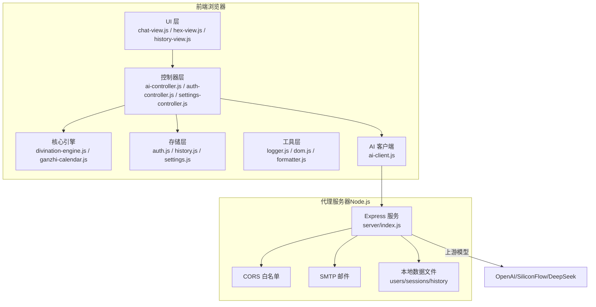
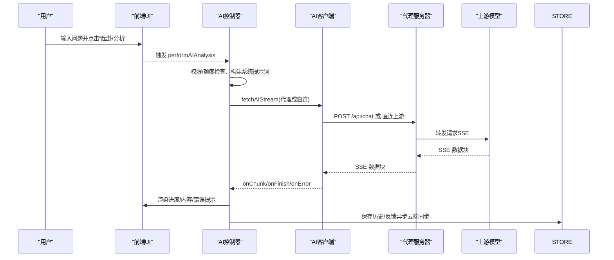
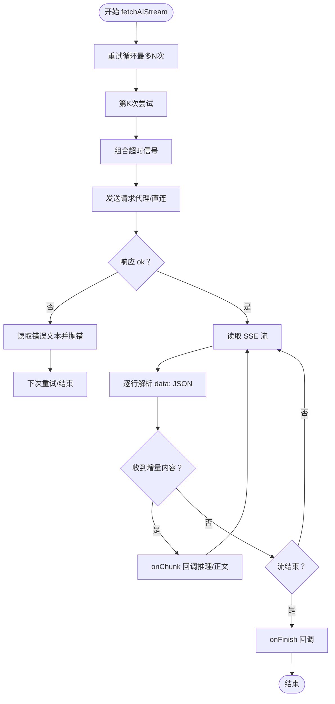
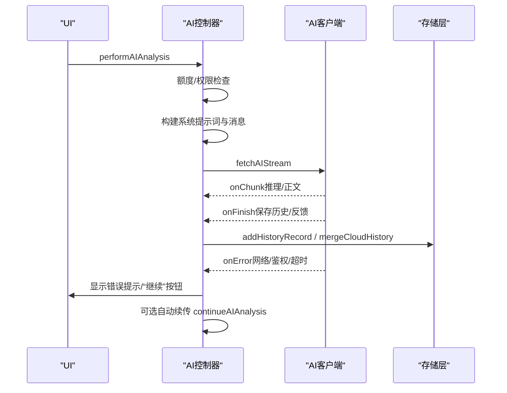
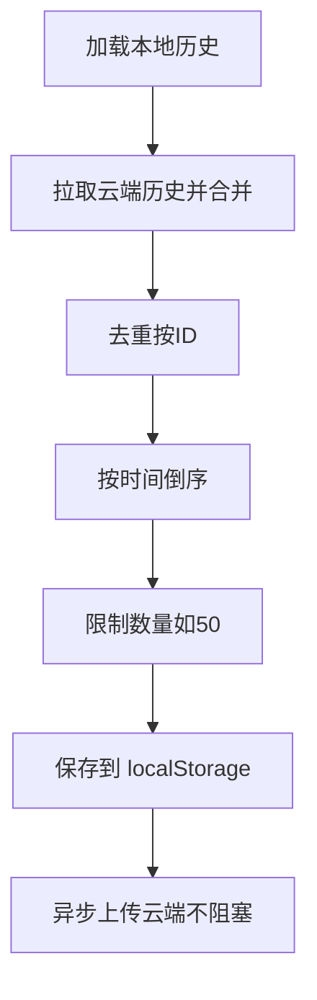
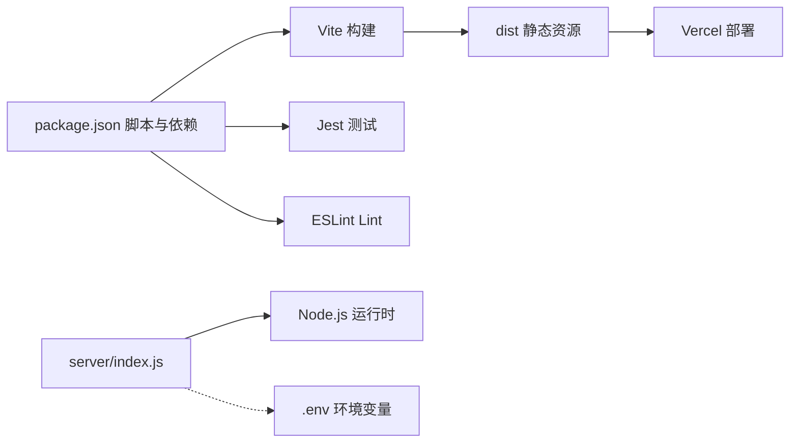
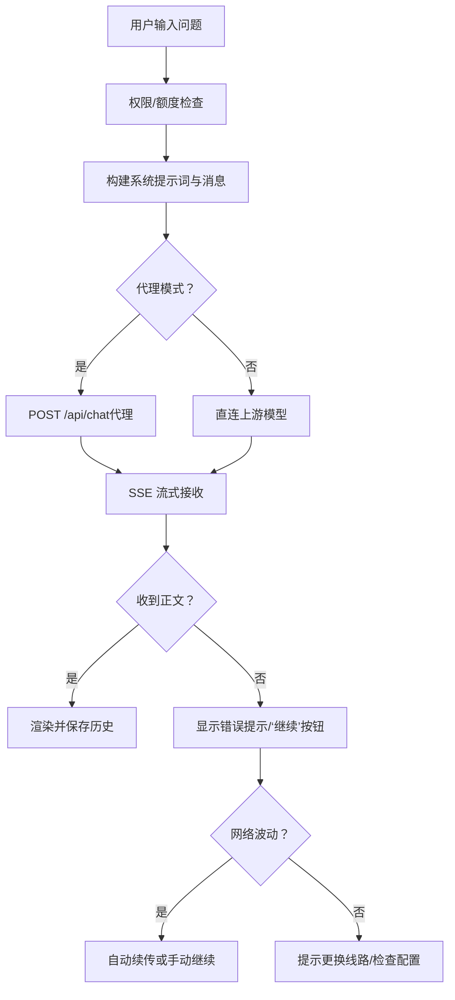

# 故障排除

<cite>
**本文引用的文件**
- [package.json](file://package.json)
- [server/package.json](file://server/package.json)
- [src/api/ai-client.js](file://src/api/ai-client.js)
- [src/controllers/ai-controller.js](file://src/controllers/ai-controller.js)
- [src/controllers/state.js](file://src/controllers/state.js)
- [src/storage/history.js](file://src/storage/history.js)
- [src/storage/auth.js](file://src/storage/auth.js)
- [src/utils/logger.js](file://src/utils/logger.js)
- [src/utils/dom.js](file://src/utils/dom.js)
- [src/ui/chat-view.js](file://src/ui/chat-view.js)
- [src/main.js](file://src/main.js)
- [server/index.js](file://server/index.js)
- [vercel.json](file://vercel.json)
- [__tests__/divination.test.js](file://__tests__/divination.test.js)
- [__tests__/storage.test.js](file://__tests__/storage.test.js)
</cite>

## 目录
1. [简介](#简介)
2. [项目结构](#项目结构)
3. [核心组件](#核心组件)
4. [架构总览](#架构总览)
5. [详细组件分析](#详细组件分析)
6. [依赖分析](#依赖分析)
7. [性能考虑](#性能考虑)
8. [故障排除指南](#故障排除指南)
9. [结论](#结论)
10. [附录](#附录)

## 简介
本指南面向“梅花义理·数智决策系统”的使用者与维护者，聚焦于安装、运行时错误、API 调用失败、日志分析、性能诊断、网络连接、浏览器兼容性、数据丢失与存储恢复、第三方服务集成、紧急恢复流程以及问题反馈渠道等常见问题的系统化排查与修复方法。文档同时提供可视化图示帮助快速定位问题根因。

## 项目结构
项目采用前端单页应用（SPA）+ 代理服务器的混合架构：
- 前端位于 src 目录，包含控制器、UI、核心推演引擎、存储与工具模块。
- 代理服务器位于 server 目录，负责隐藏真实 API 密钥、路由到上游模型、会话与邮件等服务。
- 构建与测试脚本在根目录 package.json 中定义，部署配置在 vercel.json 中。

图表来源
- [src/main.js](file://src/main.js)
- [src/controllers/ai-controller.js](file://src/controllers/ai-controller.js)
- [src/api/ai-client.js](file://src/api/ai-client.js)
- [server/index.js](file://server/index.js)

章节来源
- [src/main.js](file://src/main.js)
- [server/index.js](file://server/index.js)

## 核心组件
- 日志系统：轻量级分级日志，生产环境默认仅输出警告及以上级别，便于在控制台快速定位问题。
- AI 客户端：封装流式 SSE 接收、超时与重试、代理模式切换、错误分类与提示。
- 控制器：AI 分析流程编排、额度与权限控制、历史记录持久化与云端合并、错误处理与 UI 反馈。
- 存储：本地 localStorage + 云端同步，含配额与自动裁剪策略。
- 代理服务器：CORS 白名单、会话管理、健康检查、SSE 透传、多线路自动降级。
- 工具与 UI：DOM 辅助、消息提示、聊天视图滚动与布局、主题切换。

章节来源
- [src/utils/logger.js](file://src/utils/logger.js)
- [src/api/ai-client.js](file://src/api/ai-client.js)
- [src/controllers/ai-controller.js](file://src/controllers/ai-controller.js)
- [src/storage/history.js](file://src/storage/history.js)
- [server/index.js](file://server/index.js)
- [src/utils/dom.js](file://src/utils/dom.js)
- [src/ui/chat-view.js](file://src/ui/chat-view.js)

## 架构总览
前端通过 ai-client.js 与代理服务器交互，代理服务器再向上游模型发起请求，并以 SSE 流式返回。控制器负责组装消息、处理中断与续传、保存历史与反馈、权限与额度控制。存储层负责本地与云端的历史合并与反馈学习注入。

图表来源
- [src/controllers/ai-controller.js](file://src/controllers/ai-controller.js)
- [src/api/ai-client.js](file://src/api/ai-client.js)
- [server/index.js](file://server/index.js)
- [src/storage/history.js](file://src/storage/history.js)

## 详细组件分析

### 日志系统与调试
- 日志级别：debug < info < warn < error；生产环境默认仅输出 warn+，降低噪音。
- 使用方式：每个模块通过工厂函数创建带模块前缀的日志器，便于过滤与定位。
- 调试建议：在开发环境运行时可观察 debug/info 输出；生产环境可通过错误提示与 UI 错误面板定位问题。

章节来源
- [src/utils/logger.js](file://src/utils/logger.js)

### AI 客户端与流式处理
- 代理模式：通过配置代理地址启用，密钥在服务端中转，提升安全性。
- 超时与重试：内置最大重试次数与延迟，区分用户取消与超时，避免误报。
- SSE 解析：逐行解析 data: JSON，兼容部分网关非标准行为；错误消息透传。
- 错误分类：网络类、鉴权类、超时类分别处理，UI 提示与“继续”按钮联动。

图表来源
- [src/api/ai-client.js](file://src/api/ai-client.js)

章节来源
- [src/api/ai-client.js](file://src/api/ai-client.js)

### AI 控制器与分析流程
- 权限与额度：管理员/付费用户可切换专业版；普通用户每日额度限制；追问不扣额度。
- 模型选择：普通用户固定主线模型，避免备线不稳定；专业用户可切换。
- 中断与续传：记录 interruptedCtx，网络波动时自动续传；UI 提供“继续”按钮。
- 历史与反馈：自动保存分析记录，合并云端历史；反馈学习注入系统提示词。
- 错误处理：区分代理模式与直连模式提示；网络波动自动续传；存储不足自动裁剪。

图表来源
- [src/controllers/ai-controller.js](file://src/controllers/ai-controller.js)
- [src/api/ai-client.js](file://src/api/ai-client.js)
- [src/storage/history.js](file://src/storage/history.js)

章节来源
- [src/controllers/ai-controller.js](file://src/controllers/ai-controller.js)
- [src/controllers/state.js](file://src/controllers/state.js)

### 存储与历史合并
- 本地存储：localStorage 为主，容量不足时自动裁剪旧记录；反馈学习记录同样裁剪。
- 云端同步：登录后异步上传本地历史；合并云端与本地去重，按时间排序并限制数量。
- 错误处理：存储异常时降级提示；网络失败时保留本地数据。

图表来源
- [src/storage/history.js](file://src/storage/history.js)

章节来源
- [src/storage/history.js](file://src/storage/history.js)

### 认证与会话
- 会话：服务端基于 Cookie 的会话令牌，有效期约 180 天；登录后设置 Cookie。
- 注册/登录：优先服务端，失败时回退本地存储；支持邮箱绑定与验证码重置密码。
- 权限：管理员白名单；付费体系预留字段。

章节来源
- [src/storage/auth.js](file://src/storage/auth.js)
- [server/index.js](file://server/index.js)

### 代理服务器（Node.js）
- CORS 白名单：仅允许配置域名访问；支持 .meihuayili.com 子域。
- 多线路：主线 SiliconFlow + 备线 DeepSeek，自动顺序降级。
- 健康检查：/health 返回已配置线路列表。
- SSE 透传：设置必要响应头，强制实时推送，避免中间层缓冲。
- 邮件：SMTP QQ 邮箱用于验证码发送。

章节来源
- [server/package.json](file://server/package.json)
- [server/index.js](file://server/index.js)

## 依赖分析
- 前端依赖：Vite、Jest、ESLint；运行时依赖较少，主要通过浏览器 Fetch 与 SSE。
- 代理服务：Express、CORS、Nodemailer、dotenv；依赖 .env 配置密钥与白名单。
- 构建与部署：vercel.json 设置静态资源缓存策略，禁用 sw.js 与首页缓存以保证更新。

图表来源
- [package.json](file://package.json)
- [vercel.json](file://vercel.json)
- [server/index.js](file://server/index.js)

章节来源
- [package.json](file://package.json)
- [vercel.json](file://vercel.json)
- [server/package.json](file://server/package.json)

## 性能考虑
- 流式渲染：前端在收到首个增量内容后立即渲染，减少感知等待。
- 进度模拟：在首包到达前显示进度条与动画，改善用户体验。
- 超时与重试：合理设置超时与重试，避免长时间挂起；网络波动时自动续传。
- 存储裁剪：容量不足时自动删除旧记录，保障功能可用。
- 代理实时性：代理服务关闭中间层缓冲，确保 SSE 实时推送。

章节来源
- [src/controllers/ai-controller.js](file://src/controllers/ai-controller.js)
- [src/api/ai-client.js](file://src/api/ai-client.js)
- [src/storage/history.js](file://src/storage/history.js)
- [server/index.js](file://server/index.js)

## 故障排除指南

### 一、安装与环境问题
- 症状：本地启动失败、依赖缺失、端口占用。
- 排查步骤：
  - 确认 Node.js 版本满足依赖要求。
  - 安装前端依赖：npm run dev；安装代理服务依赖：cd server && npm install。
  - 检查端口占用：代理服务默认端口为 3210，可在 .env 中配置。
  - 配置 .env：代理服务器需设置 ALLOWED_ORIGINS、SF_API_KEY、DS_API_KEY、SMTP_* 等。
- 修复建议：
  - 更新依赖：npm install；清理缓存后重试。
  - 更换端口：在 .env 中设置 PORT=新端口。
  - 校验 .env 格式：键值对以 KEY=VALUE 形式，避免多余空格与引号。

章节来源
- [server/index.js](file://server/index.js)
- [server/package.json](file://server/package.json)

### 二、运行时错误与页面空白
- 症状：页面空白、图标不显示、主题切换无效。
- 排查步骤：
  - 检查浏览器控制台是否有跨域或资源加载错误。
  - 确认代理服务已启动且 /health 正常。
  - 检查 vercel.json 的缓存头设置是否影响静态资源更新。
- 修复建议：
  - 清理浏览器缓存或使用隐身模式访问。
  - 确保 ALLOWED_ORIGINS 包含当前访问域名。
  - 如使用 CDN，确认静态资源已重新部署。

章节来源
- [vercel.json](file://vercel.json)
- [server/index.js](file://server/index.js)

### 三、API 调用失败与鉴权问题
- 症状：提示“请在设置中配置 API Key”、“解析中断（返回为空）”、“接口调用异常”。
- 排查步骤：
  - 检查代理模式开关：PROXY_ENDPOINT 是否启用；直连模式下需配置 Provider Key。
  - 查看控制器中的错误分类：网络类、鉴权类（401/403）、超时。
  - 核对 Provider 配置与 MODEL_REGISTRY 选择。
- 修复建议：
  - 在设置中填写正确的 API Key 与 Endpoint。
  - 切换到另一条线路（代理服务器已内置多线路自动降级）。
  - 若为代理模式，确认代理地址可达且 /health 正常。

章节来源
- [src/controllers/ai-controller.js](file://src/controllers/ai-controller.js)
- [src/api/ai-client.js](file://src/api/ai-client.js)
- [server/index.js](file://server/index.js)

### 四、日志系统配置与分析
- 生产环境默认仅输出 warn+，便于在控制台快速定位问题。
- 建议：
  - 在开发环境运行时观察 debug/info 输出。
  - 使用模块前缀筛选日志，如 “AI”、“AIClient”、“History”、“Auth”。

章节来源
- [src/utils/logger.js](file://src/utils/logger.js)

### 五、网络连接问题
- 症状：超时、503/504/502、网络抖动导致解析中断。
- 排查步骤：
  - 代理服务器健康检查：访问 /health，确认已配置线路。
  - 检查上游模型可用性与配额。
  - 观察前端 onError 分类：网络类错误自动续传。
- 修复建议：
  - 更换线路或稍后重试。
  - 检查防火墙与 CDN 缓冲设置（代理已关闭 X-Accel-Buffering）。
  - 增大超时时间（客户端与代理服务均可调整）。

章节来源
- [server/index.js](file://server/index.js)
- [src/api/ai-client.js](file://src/api/ai-client.js)
- [src/controllers/ai-controller.js](file://src/controllers/ai-controller.js)

### 六、浏览器兼容性问题
- 症状：SSE 不生效、AbortController 未定义、Share API 不可用。
- 排查步骤：
  - 确认浏览器支持 Fetch 与 ReadableStream（SSE）。
  - 检查 AbortController polyfill（现代浏览器通常内置）。
  - navigator.share 降级为剪贴板复制。
- 修复建议：
  - 使用现代浏览器（Chrome/Firefox/Safari 最新版）。
  - 为老版本浏览器添加必要的 polyfill。
  - 若 Share API 不可用，系统会自动回退到复制到剪贴板。

章节来源
- [src/main.js](file://src/main.js)
- [src/api/ai-client.js](file://src/api/ai-client.js)

### 七、数据丢失与存储问题
- 症状：历史记录消失、存储空间不足、反馈学习丢失。
- 排查步骤：
  - 检查 localStorage 是否被清理或限额触发。
  - 观察存储层的自动裁剪逻辑（超过阈值时删除旧记录）。
  - 登录后检查云端历史合并是否成功。
- 修复建议：
  - 清理不需要的历史记录，释放空间。
  - 登录后触发云端同步，合并本地与云端数据。
  - 若本地损坏，可删除对应 key 后重新登录以重建。

章节来源
- [src/storage/history.js](file://src/storage/history.js)
- [src/storage/auth.js](file://src/storage/auth.js)

### 八、第三方服务集成问题
- 邮件服务：SMTP QQ 邮箱用于验证码发送；检查 SMTP_USER/SMTP_PASS。
- 验证码防刷：同一邮箱 60 秒内仅允许发送一次，错误次数过多会被限制。
- 修复建议：
  - 校验邮箱格式与 SMTP 配置。
  - 检查验证码有效期与尝试次数限制。

章节来源
- [server/index.js](file://server/index.js)

### 九、紧急情况下的故障恢复流程
- 代理服务不可用：
  - 检查 .env 是否正确加载，确认 API 密钥与白名单。
  - 临时关闭代理模式，切换到直连模式（需配置 Provider Key）。
- 前端异常：
  - 清理浏览器缓存与 Cookie，重新登录。
  - 检查网络与 CORS 配置，确认 ALLOWED_ORIGINS。
- 存储异常：
  - 删除损坏的 localStorage key，重新登录恢复。
  - 合并云端历史，确保数据完整性。

章节来源
- [server/index.js](file://server/index.js)
- [src/storage/auth.js](file://src/storage/auth.js)
- [src/storage/history.js](file://src/storage/history.js)

### 十、问题反馈与报告机制
- 建议收集的信息：
  - 操作步骤与截图（尤其是错误提示与控制台日志）。
  - 浏览器与设备信息、网络环境。
  - 是否使用代理模式、使用的 Provider 与模型。
  - 本地与云端历史状态（可提供关键字段说明，避免泄露隐私）。
- 反馈渠道：
  - 通过项目文档或 README 中提供的联系方式提交问题。
  - 提交前请确认已尝试上述排查步骤并附上最小复现步骤。

[本节为通用指导，不直接分析具体文件]

## 结论
通过本指南，您可以系统化地定位与修复“梅花义理”在安装、运行、API 调用、网络、浏览器兼容性、存储与第三方服务等方面的常见问题。建议在日常运维中：
- 开启必要的日志级别，关注 warn+ 以上错误。
- 定期检查代理服务健康状态与上游可用性。
- 使用代理模式隐藏密钥，提升安全性。
- 建立定期备份与云端同步机制，保障数据安全。

[本节为总结性内容，不直接分析具体文件]

## 附录

### A. 常见错误与提示对照
- “请在设置中配置 API Key”：未启用代理且未配置 Provider Key。
- “解析中断（返回为空）”：上游结束响应但未返回正文，可点击“继续”接续。
- “接口调用异常/解析服务器繁忙”：网络波动或上游限流，建议稍后重试。
- “存储空间不足”：localStorage 容量不足，系统自动裁剪旧记录。

章节来源
- [src/controllers/ai-controller.js](file://src/controllers/ai-controller.js)
- [src/storage/history.js](file://src/storage/history.js)

### B. 关键流程图（代码级）

图表来源
- [src/controllers/ai-controller.js](file://src/controllers/ai-controller.js)
- [src/api/ai-client.js](file://src/api/ai-client.js)
- [server/index.js](file://server/index.js)