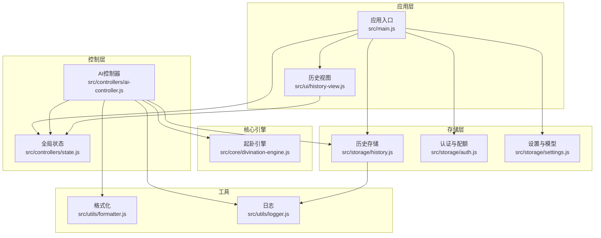
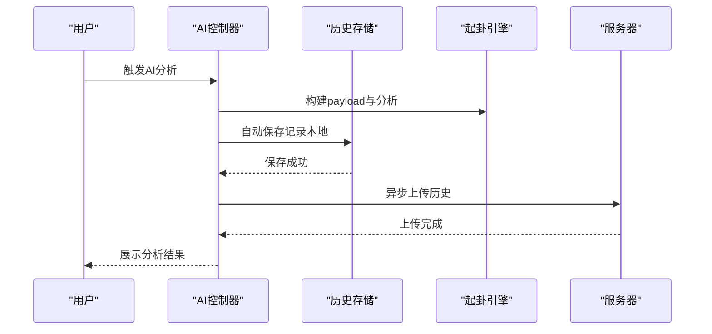
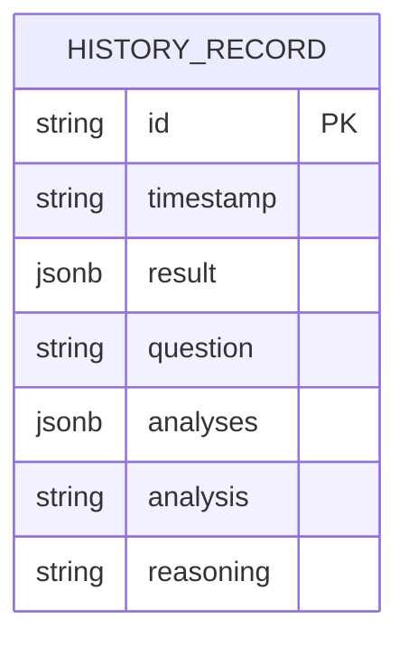
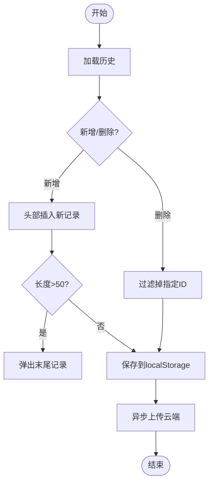
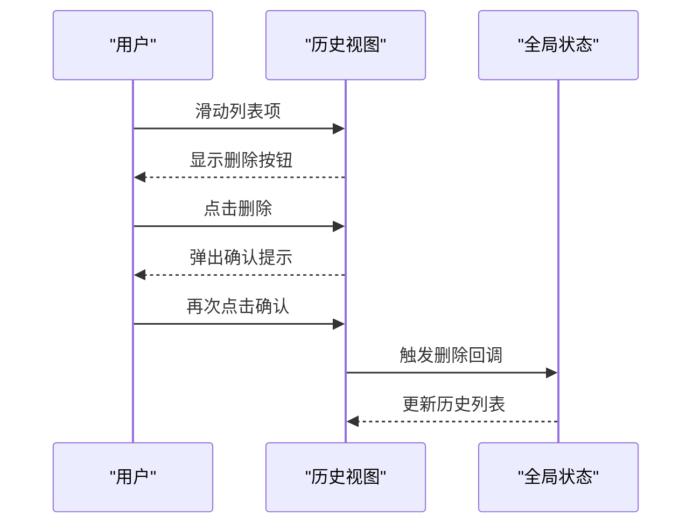
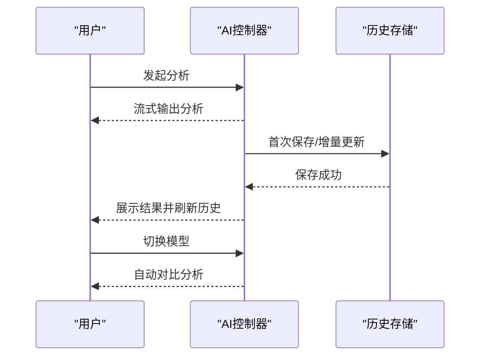
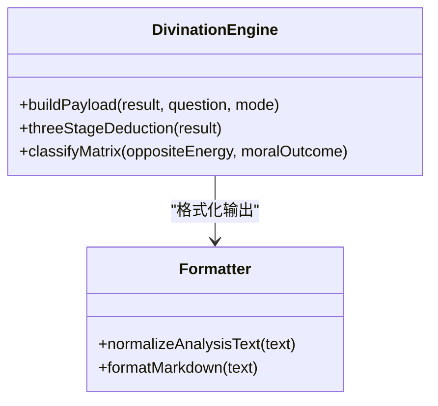
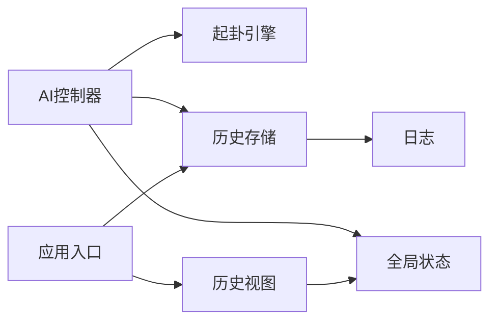

# 历史记录存储

<cite>
**本文引用的文件**
- [src/storage/history.js](file://src/storage/history.js)
- [src/ui/history-view.js](file://src/ui/history-view.js)
- [src/controllers/ai-controller.js](file://src/controllers/ai-controller.js)
- [src/controllers/state.js](file://src/controllers/state.js)
- [src/core/divination-engine.js](file://src/core/divination-engine.js)
- [src/utils/formatter.js](file://src/utils/formatter.js)
- [src/main.js](file://src/main.js)
- [src/storage/auth.js](file://src/storage/auth.js)
- [src/storage/settings.js](file://src/storage/settings.js)
- [src/utils/logger.js](file://src/utils/logger.js)
- [package.json](file://package.json)
- [__tests__/storage.test.js](file://__tests__/storage.test.js)
</cite>

## 目录
1. [简介](#简介)
2. [项目结构](#项目结构)
3. [核心组件](#核心组件)
4. [架构总览](#架构总览)
5. [详细组件分析](#详细组件分析)
6. [依赖分析](#依赖分析)
7. [性能考虑](#性能考虑)
8. [故障排查指南](#故障排查指南)
9. [结论](#结论)
10. [附录](#附录)

## 简介
本文件面向“梅花义理”的历史记录存储系统，系统性阐述卦例数据的结构设计与存储格式、增删改查操作实现、数据持久化与检索优化策略、数据模型（时间戳、卦象数据、AI分析结果、用户反馈）、分类管理（收藏、标签、搜索）、导入导出与备份恢复、容量限制与清理策略、数据压缩与性能优化，以及历史记录 API 的使用方法与数据访问模式。

## 项目结构
历史记录相关模块主要分布在以下目录与文件：
- 存储层：src/storage/history.js（本地 + 云端同步）、src/storage/auth.js（用户与配额）、src/storage/settings.js（模型与提供商配置）
- 控制层：src/controllers/ai-controller.js（AI分析与自动保存）、src/controllers/state.js（全局状态）
- 视图层：src/ui/history-view.js（历史列表渲染与交互）
- 核心引擎：src/core/divination-engine.js（构建分析载荷与结果）
- 工具与格式化：src/utils/formatter.js（Markdown 格式化）、src/utils/logger.js（日志）
- 应用入口：src/main.js（初始化、渲染历史、导出）

图表来源
- [src/ui/history-view.js:1-168](file://src/ui/history-view.js#L1-L168)
- [src/controllers/ai-controller.js:1-733](file://src/controllers/ai-controller.js#L1-L733)
- [src/controllers/state.js:1-24](file://src/controllers/state.js#L1-L24)
- [src/core/divination-engine.js:1-433](file://src/core/divination-engine.js#L1-L433)
- [src/storage/history.js:1-143](file://src/storage/history.js#L1-L143)
- [src/storage/auth.js:1-350](file://src/storage/auth.js#L1-L350)
- [src/storage/settings.js:1-86](file://src/storage/settings.js#L1-L86)
- [src/utils/formatter.js:1-92](file://src/utils/formatter.js#L1-L92)
- [src/utils/logger.js:1-34](file://src/utils/logger.js#L1-L34)
- [src/main.js:1-800](file://src/main.js#L1-L800)

章节来源
- [src/storage/history.js:1-143](file://src/storage/history.js#L1-L143)
- [src/ui/history-view.js:1-168](file://src/ui/history-view.js#L1-L168)
- [src/controllers/ai-controller.js:1-733](file://src/controllers/ai-controller.js#L1-L733)
- [src/controllers/state.js:1-24](file://src/controllers/state.js#L1-L24)
- [src/core/divination-engine.js:1-433](file://src/core/divination-engine.js#L1-L433)
- [src/utils/formatter.js:1-92](file://src/utils/formatter.js#L1-L92)
- [src/main.js:1-800](file://src/main.js#L1-L800)
- [src/storage/auth.js:1-350](file://src/storage/auth.js#L1-L350)
- [src/storage/settings.js:1-86](file://src/storage/settings.js#L1-L86)
- [src/utils/logger.js:1-34](file://src/utils/logger.js#L1-L34)

## 核心组件
- 历史记录存储（本地 + 云端）
  - 键命名：按用户名生成唯一键，避免冲突
  - 数据结构：数组，元素为记录对象，包含 id、timestamp、result、question、analyses、analysis、reasoning 等字段
  - 操作：加载、保存、新增、删除、云端同步与合并
  - 限制：本地最多 50 条，反馈最多 30 条；超出时自动裁剪
- 历史视图
  - 渲染列表、滑动删除、点击打开、空态提示
  - 支持手势滑动与确认删除
- AI 分析与自动保存
  - 分析完成后自动写入历史记录，支持增量更新与云端同步
- 全局状态
  - 维护当前用户、历史列表、当前结果、最后记录 ID、模型选择、分析上下文等
- 起卦引擎
  - 构建分析载荷（payload），用于 AI 推演与历史记录中的“本卦/变卦/对卦”等信息
- 导出与备份
  - 断卦结果导出为文本，支持系统分享或复制到剪贴板
  - 云端合并与备份（通过服务器接口）

章节来源
- [src/storage/history.js:11-102](file://src/storage/history.js#L11-L102)
- [src/ui/history-view.js:7-167](file://src/ui/history-view.js#L7-L167)
- [src/controllers/ai-controller.js:403-477](file://src/controllers/ai-controller.js#L403-L477)
- [src/controllers/state.js:5-21](file://src/controllers/state.js#L5-L21)
- [src/core/divination-engine.js:297-346](file://src/core/divination-engine.js#L297-L346)
- [src/main.js:426-498](file://src/main.js#L426-L498)

## 架构总览
历史记录系统采用“本地优先 + 云端同步”的双层架构：
- 本地层：localStorage 存储用户历史与反馈，保证离线可用与快速访问
- 云端层：登录后与服务器合并历史，避免跨设备丢失
- 控制层：AI 分析完成后自动保存，同时异步上传云端
- 视图层：历史列表渲染与交互，支持滑动删除与展开

图表来源
- [src/controllers/ai-controller.js:24-112](file://src/controllers/ai-controller.js#L24-L112)
- [src/storage/history.js:26-45](file://src/storage/history.js#L26-L45)
- [src/core/divination-engine.js:297-346](file://src/core/divination-engine.js#L297-L346)

## 详细组件分析

### 历史记录数据模型
- 记录字段
  - id：唯一标识（通常为时间戳）
  - timestamp：字符串形式的时间戳
  - result：起卦结果（包含本卦、变卦、对卦、体用关系、月令等）
  - question：用户问题
  - analyses：模型分析集合（含 content、reasoning、modelKey、modelLabel、timestamp）
  - analysis：最新分析正文
  - reasoning：推理过程（可选）
- 本地存储键
  - 历史键：meihua_history_{username}
  - 反馈键：meihua_feedback_{username}
- 云端接口
  - 保存：POST /api/history/save
  - 加载：GET /api/history/load?username={name}

图表来源
- [src/storage/history.js:407-415](file://src/storage/history.js#L407-L415)

章节来源
- [src/storage/history.js:11-142](file://src/storage/history.js#L11-L142)
- [src/controllers/ai-controller.js:407-415](file://src/controllers/ai-controller.js#L407-L415)

### 增删改查实现与持久化
- 加载历史
  - 通过 getUserHistoryKey 获取键，JSON.parse 读取，异常时返回空数组
- 新增记录
  - loadHistory -> unshift 新记录 -> 限制长度 50 -> 保存
- 删除记录
  - loadHistory -> 过滤匹配 id -> 保存
- 保存与裁剪
  - 保存时捕获存储配额错误，循环弹出最旧记录直到可写入
- 云端同步
  - 异步上传：POST /api/history/save
  - 登录后合并：GET /api/history/load，去重后按 id 倒序，限制长度 50，再写回本地

图表来源
- [src/storage/history.js:15-60](file://src/storage/history.js#L15-L60)
- [src/storage/history.js:65-102](file://src/storage/history.js#L65-L102)

章节来源
- [src/storage/history.js:15-102](file://src/storage/history.js#L15-L102)
- [__tests__/storage.test.js:154-197](file://__tests__/storage.test.js#L154-L197)

### 历史视图与交互
- 渲染
  - 使用模板拼装列表项，展示卦名、日期、问题摘要
- 交互
  - 左滑露出删除按钮，拖拽阈值与动画
  - 点击非删除区域打开记录详情
  - 删除二次确认（3秒内再次点击确认）

图表来源
- [src/ui/history-view.js:18-167](file://src/ui/history-view.js#L18-L167)

章节来源
- [src/ui/history-view.js:7-167](file://src/ui/history-view.js#L7-L167)

### AI 分析与自动保存
- 自动保存时机
  - 首次分析完成时创建记录（lastRecordId 为空）
  - 后续增量更新（按 id 替换对应记录）
- 保存内容
  - result、question、analyses、analysis、reasoning、timestamp
- 云端合并
  - 登录后拉取云端历史，与本地去重合并，限制长度 50，再写回本地
- 模型切换与对比
  - 若模型切换且已有分析，自动触发对比分析

图表来源
- [src/controllers/ai-controller.js:24-112](file://src/controllers/ai-controller.js#L24-L112)
- [src/controllers/ai-controller.js:403-477](file://src/controllers/ai-controller.js#L403-L477)
- [src/storage/history.js:47-60](file://src/storage/history.js#L47-L60)

章节来源
- [src/controllers/ai-controller.js:24-112](file://src/controllers/ai-controller.js#L24-L112)
- [src/controllers/ai-controller.js:403-477](file://src/controllers/ai-controller.js#L403-L477)
- [src/storage/history.js:47-60](file://src/storage/history.js#L47-L60)

### 数据模型与分析载荷
- 起卦引擎构建载荷
  - 包含体位、本卦/变卦/对卦、体用关系、月令状态、卦辞与爻辞等
- AI 分析载荷
  - 将 result 与 question 组合成 JSON 字符串，作为系统提示的输入
- Markdown 格式化
  - 归一化标题、去除冗余标记、转换为 HTML

图表来源
- [src/core/divination-engine.js:297-346](file://src/core/divination-engine.js#L297-L346)
- [src/utils/formatter.js:24-91](file://src/utils/formatter.js#L24-L91)

章节来源
- [src/core/divination-engine.js:297-346](file://src/core/divination-engine.js#L297-L346)
- [src/utils/formatter.js:24-91](file://src/utils/formatter.js#L24-L91)

### 分类管理与搜索
- 收藏与标签
  - 当前实现未提供收藏与标签字段；可在记录对象中扩展字段以支持
- 搜索
  - 历史列表渲染时可按问题、卦名、日期筛选（建议在 UI 层增加搜索框与过滤逻辑）
- 导航与展开
  - 历史面板默认折叠，首次保存后自动展开

章节来源
- [src/ui/history-view.js:18-33](file://src/ui/history-view.js#L18-L33)
- [src/main.js:788-800](file://src/main.js#L788-L800)

### 导入导出与备份恢复
- 导出
  - 优先从内存聚合分析内容，降级从 DOM 提取
  - 格式化为统一文本，支持系统分享或复制到剪贴板
- 备份恢复
  - 云端合并：登录后拉取历史，去重合并，限制长度
  - 本地备份：可将 localStorage 中的历史键导出为 JSON 文件（建议在设置中添加导出/导入按钮）

章节来源
- [src/main.js:426-498](file://src/main.js#L426-L498)
- [src/storage/history.js:75-102](file://src/storage/history.js#L75-L102)

### 存储容量限制与清理策略
- 本地限制
  - 历史记录上限：50 条
  - 反馈记录上限：30 条
  - 超限时自动裁剪最旧记录
- 云端限制
  - 登录后合并时同样限制长度 50
- 清理策略
  - 按 id 倒序排列，删除最早记录直至可写入
  - 反馈记录按最近使用排序，删除最旧项

章节来源
- [src/storage/history.js:47-60](file://src/storage/history.js#L47-L60)
- [src/storage/history.js:108-142](file://src/storage/history.js#L108-L142)
- [src/storage/history.js:92-102](file://src/storage/history.js#L92-L102)

### 性能优化与数据压缩
- 本地性能
  - 采用 JSON 序列化/反序列化，数组操作 O(1) 插入头部，O(n) 过滤删除
  - 限制数组长度，避免内存膨胀
- 云端同步
  - 异步上传，不阻塞 UI
  - 合并时使用 Set 去重，按 id 排序，减少重复传输
- 压缩建议
  - 可对 analyses 字段进行分块压缩（如 gzip），并在读取时解压
  - 对重复的卦象数据进行引用去重（如共享 result 的公共部分）

章节来源
- [src/storage/history.js:26-45](file://src/storage/history.js#L26-L45)
- [src/storage/history.js:75-102](file://src/storage/history.js#L75-L102)

### 历史记录 API 使用方法与数据访问模式
- 获取历史键
  - getUserHistoryKey(userName)：返回 meihua_history_{username}
- 加载/保存历史
  - loadHistory(userName)：返回数组
  - saveHistory(userName, history)：写入 localStorage，异步上传云端
- 新增/删除记录
  - addHistoryRecord(userName, record)：头部插入并限制长度
  - deleteHistoryRecord(userName, recordId)：过滤删除
- 云端合并
  - mergeCloudHistory(userName)：拉取云端，去重合并，限制长度，写回本地
- 反馈存储
  - loadFeedback(userName)/saveFeedback(userName, list)/addFeedbackRecord(userName, record)

章节来源
- [src/storage/history.js:11-142](file://src/storage/history.js#L11-L142)

## 依赖分析
- 组件耦合
  - AI 控制器依赖起卦引擎与历史存储，间接依赖全局状态
  - 历史视图依赖全局状态与 DOM 工具
  - 应用入口负责初始化、渲染历史与导出
- 外部依赖
  - 浏览器 localStorage、fetch API
  - 日志工具与格式化工具

图表来源
- [src/controllers/ai-controller.js:1-733](file://src/controllers/ai-controller.js#L1-L733)
- [src/storage/history.js:1-143](file://src/storage/history.js#L1-L143)
- [src/controllers/state.js:1-24](file://src/controllers/state.js#L1-L24)
- [src/ui/history-view.js:1-168](file://src/ui/history-view.js#L1-L168)
- [src/main.js:1-800](file://src/main.js#L1-L800)

章节来源
- [src/controllers/ai-controller.js:1-733](file://src/controllers/ai-controller.js#L1-L733)
- [src/storage/history.js:1-143](file://src/storage/history.js#L1-L143)
- [src/controllers/state.js:1-24](file://src/controllers/state.js#L1-L24)
- [src/ui/history-view.js:1-168](file://src/ui/history-view.js#L1-L168)
- [src/main.js:1-800](file://src/main.js#L1-L800)

## 性能考虑
- 时间复杂度
  - 新增：O(1)
  - 删除：O(n)
  - 合并：O(n log n)（排序）+ O(n)（去重）
- 空间复杂度
  - 历史数组长度上限 50，反馈数组上限 30
- 优化建议
  - 使用索引（Set）加速去重
  - 分页加载云端历史（未来扩展）
  - 对大型记录进行懒加载（仅在打开时渲染）

## 故障排查指南
- 本地存储配额不足
  - 现象：保存失败抛出 QuotaExceededError
  - 处理：自动裁剪最旧记录，若仍失败提示用户清理
- 云端同步失败
  - 现象：警告日志，不影响本地使用
  - 处理：重试或检查网络与凭证
- 历史列表空白
  - 现象：无记录
  - 处理：确认已起卦并完成分析；检查本地存储键是否存在
- 删除无效
  - 现象：点击删除无反应
  - 处理：确认 id 类型一致（字符串比较），检查事件绑定

章节来源
- [src/storage/history.js:32-42](file://src/storage/history.js#L32-L42)
- [src/storage/history.js:98-101](file://src/storage/history.js#L98-L101)
- [src/ui/history-view.js:146-166](file://src/ui/history-view.js#L146-L166)
- [src/utils/logger.js:14-31](file://src/utils/logger.js#L14-L31)

## 结论
历史记录存储系统以 localStorage 为核心，结合云端合并与异步上传，实现了跨设备的一致性与高性能。通过严格的容量限制与自动裁剪策略，保障了用户体验与系统稳定性。建议在未来版本中引入收藏/标签、搜索、分页与压缩等能力，进一步提升可发现性与性能表现。

## 附录
- 版本信息
  - 项目版本：3.8.0
- 关键常量
  - API 基础地址：https://api.meihuayili.com
  - 历史键前缀：meihua_history_
  - 反馈键前缀：meihua_feedback_

章节来源
- [package.json:1-32](file://package.json#L1-L32)
- [src/storage/history.js:9](file://src/storage/history.js#L9)
- [src/storage/history.js:11](file://src/storage/history.js#L11)
- [src/storage/history.js:107](file://src/storage/history.js#L107)