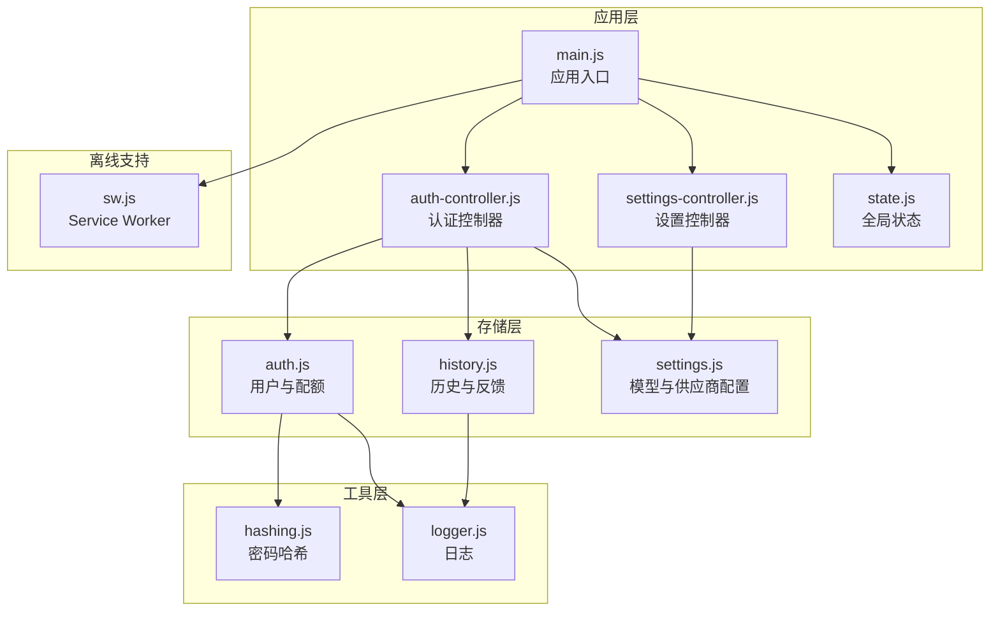
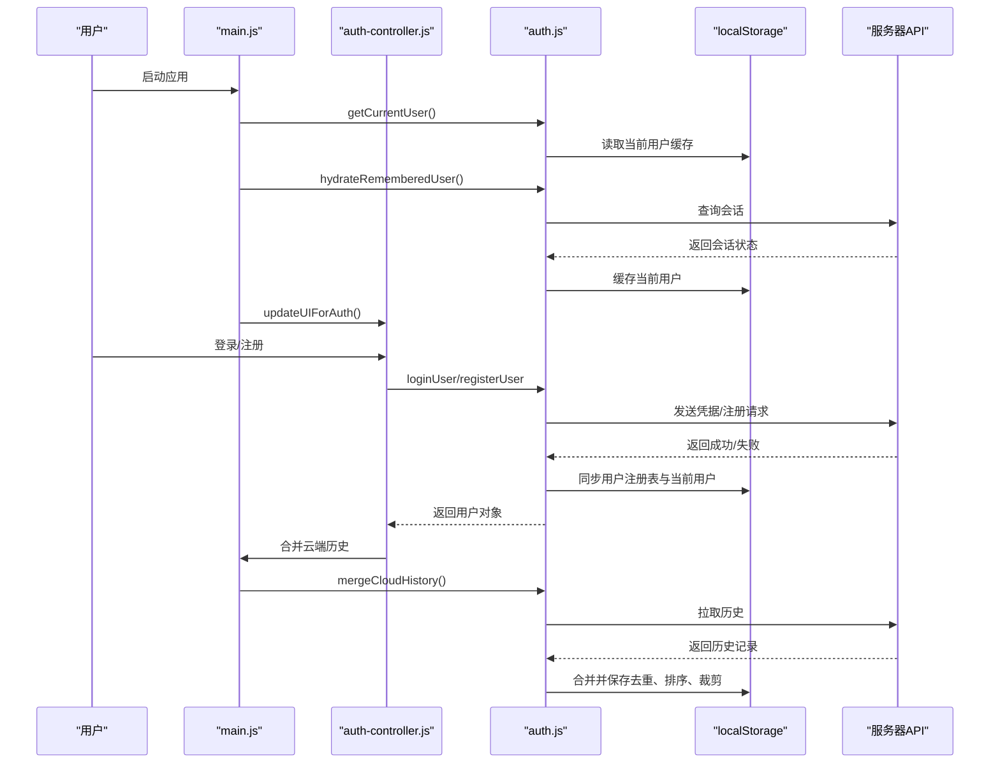
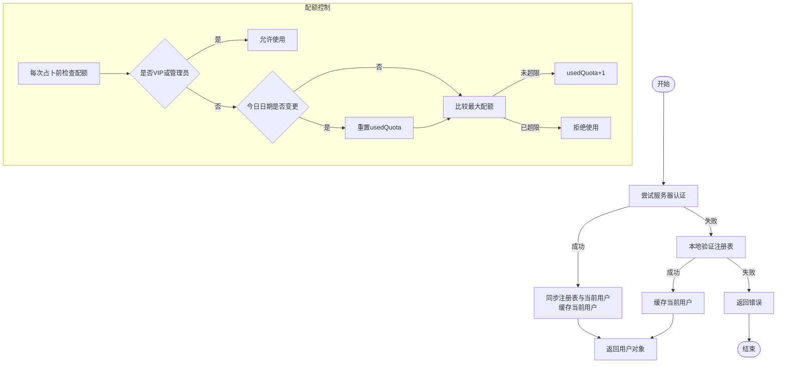
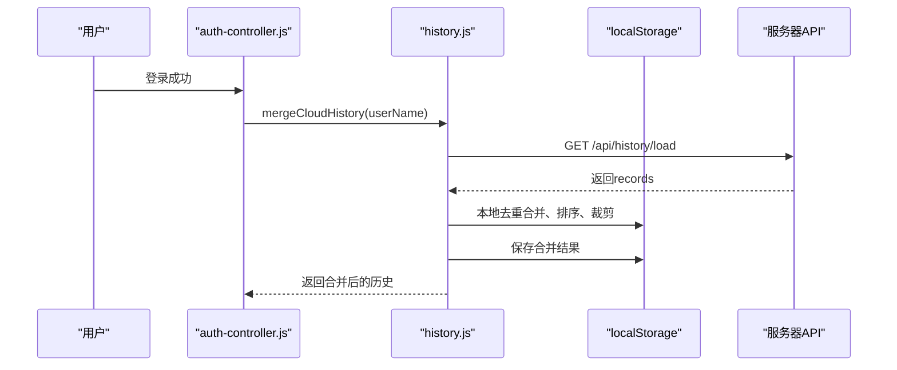
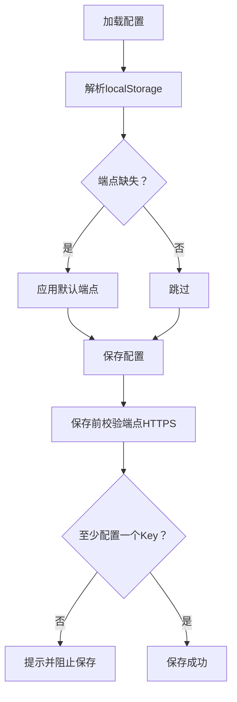
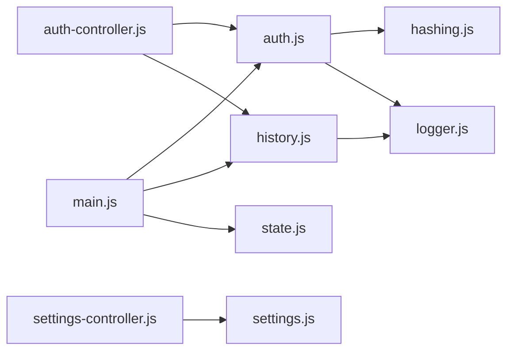

# 数据存储

<cite>
**本文档引用的文件**
- [auth.js](file://src/storage/auth.js)
- [history.js](file://src/storage/history.js)
- [settings.js](file://src/storage/settings.js)
- [hashing.js](file://src/utils/hashing.js)
- [logger.js](file://src/utils/logger.js)
- [auth-controller.js](file://src/controllers/auth-controller.js)
- [state.js](file://src/controllers/state.js)
- [main.js](file://src/main.js)
- [sw.js](file://public/sw.js)
- [storage.test.js](file://__tests__/storage.test.js)
- [settings-controller.js](file://src/controllers/settings-controller.js)
- [modals.js](file://src/ui/modals.js)
- [ai-controller.js](file://src/controllers/ai-controller.js)
</cite>

## 目录
1. [简介](#简介)
2. [项目结构](#项目结构)
3. [核心组件](#核心组件)
4. [架构总览](#架构总览)
5. [详细组件分析](#详细组件分析)
6. [依赖关系分析](#依赖关系分析)
7. [性能考量](#性能考量)
8. [故障排查指南](#故障排查指南)
9. [结论](#结论)
10. [附录](#附录)

## 简介
本文件面向“梅花义理”的数据存储系统，系统采用“云端优先 + 本地持久化”的混合架构，围绕三类核心数据进行设计：
- 用户认证信息与配额：用户注册、登录、会话保持、密码重置、邮箱绑定、管理员功能、额度控制（含游客额度与VIP兑换）。
- 历史记录与反馈：本地localStorage存储占卜历史，异步同步至云端；提供合并策略与容量管理。
- 系统设置：模型与供应商配置、主题偏好、API Key与端点管理。

同时涵盖数据持久化机制（浏览器存储API与序列化）、认证状态管理（会话与安全哈希）、历史记录的数据结构与查询优化、数据迁移与备份恢复、数据安全与隐私保护、数据访问模式与缓存策略、存储容量管理与性能优化、以及数据同步与离线支持。

## 项目结构
数据存储相关模块分布于以下目录：
- 存储层：src/storage 下的 auth.js、history.js、settings.js
- 工具层：src/utils 下的 hashing.js、logger.js
- 控制器层：src/controllers 下的 auth-controller.js、settings-controller.js、state.js
- 应用入口：src/main.js
- 离线支持：public/sw.js
- 测试：__tests__/storage.test.js

图表来源
- [main.js:167-249](file://src/main.js#L167-L249)
- [auth-controller.js:1-592](file://src/controllers/auth-controller.js#L1-L592)
- [settings-controller.js:1-71](file://src/controllers/settings-controller.js#L1-L71)
- [state.js:1-24](file://src/controllers/state.js#L1-L24)
- [auth.js:1-350](file://src/storage/auth.js#L1-L350)
- [history.js:1-143](file://src/storage/history.js#L1-L143)
- [settings.js:1-86](file://src/storage/settings.js#L1-L86)
- [hashing.js:1-20](file://src/utils/hashing.js#L1-L20)
- [logger.js:1-34](file://src/utils/logger.js#L1-L34)
- [sw.js:1-45](file://public/sw.js#L1-L45)

章节来源
- [main.js:167-249](file://src/main.js#L167-L249)
- [auth-controller.js:1-592](file://src/controllers/auth-controller.js#L1-L592)
- [settings-controller.js:1-71](file://src/controllers/settings-controller.js#L1-L71)
- [state.js:1-24](file://src/controllers/state.js#L1-L24)
- [auth.js:1-350](file://src/storage/auth.js#L1-L350)
- [history.js:1-143](file://src/storage/history.js#L1-L143)
- [settings.js:1-86](file://src/storage/settings.js#L1-L86)
- [hashing.js:1-20](file://src/utils/hashing.js#L1-L20)
- [logger.js:1-34](file://src/utils/logger.js#L1-L34)
- [sw.js:1-45](file://public/sw.js#L1-L45)

## 核心组件
- 认证与配额模块（auth.js）
  - 服务器优先的登录/注册/会话恢复，本地localStorage作为缓存与回退。
  - 密码安全：基于自定义哈希算法，结合盐值与种子，避免明文存储。
  - 用户配额：按日重置，区分普通用户与VIP用户，支持游客额度。
  - 管理员白名单与付费体系预留。
- 历史与反馈模块（history.js）
  - 本地localStorage存储占卜历史，上限50条，超限时自动裁剪。
  - 异步云端同步与合并，保证跨设备一致性。
  - 反馈存储（自我迭代学习），上限30条，超限裁剪。
- 设置模块（settings.js）
  - 供应商端点与API Key管理，内置默认端点。
  - 模型注册表与默认选型，主题偏好持久化。
- 工具与日志（hashing.js、logger.js）
  - 密码哈希函数与轻量日志工具，生产环境仅输出warn及以上级别。

章节来源
- [auth.js:1-350](file://src/storage/auth.js#L1-L350)
- [history.js:1-143](file://src/storage/history.js#L1-L143)
- [settings.js:1-86](file://src/storage/settings.js#L1-L86)
- [hashing.js:1-20](file://src/utils/hashing.js#L1-L20)
- [logger.js:1-34](file://src/utils/logger.js#L1-L34)

## 架构总览
系统采用“云端优先 + 本地持久化 + Service Worker离线缓存”的混合架构：
- 云端API负责用户认证、会话、历史同步与管理功能。
- localStorage作为本地缓存与回退，保障离线可用性与快速启动。
- Service Worker对静态资源进行网络优先缓存，避免API请求被缓存。

图表来源
- [main.js:167-249](file://src/main.js#L167-L249)
- [auth-controller.js:251-310](file://src/controllers/auth-controller.js#L251-L310)
- [auth.js:46-225](file://src/storage/auth.js#L46-L225)

章节来源
- [main.js:167-249](file://src/main.js#L167-L249)
- [auth-controller.js:251-310](file://src/controllers/auth-controller.js#L251-L310)
- [auth.js:46-225](file://src/storage/auth.js#L46-L225)

## 详细组件分析

### 认证与配额（auth.js）
- 设计要点
  - 服务器优先：登录/注册/会话恢复优先调用服务器，失败时回退到本地localStorage。
  - 安全哈希：密码通过自定义哈希函数生成，结合盐值与种子，避免明文存储。
  - 用户注册表：本地缓存所有注册用户的基本信息，用于本地回退与额度计算。
  - 会话管理：当前用户信息与注册表分别持久化，支持会话恢复与清理。
  - 配额系统：按日重置，普通用户每日10次，VIP用户每日15次，游客每日3次。
  - 管理员白名单：管理员账户可启用专业功能，付费体系预留。
- 关键流程
  - 登录：服务器验证 -> 成功则同步注册表与当前用户 -> 失败则本地验证 -> 失败则返回错误。
  - 注册：服务器注册 -> 成功则同步注册表与当前用户 -> 失败则本地注册。
  - 会话恢复：服务器查询会话 -> 成功则更新本地缓存 -> 失败则清理本地缓存。
  - 配额扣减：普通用户与VIP用户分别计算，超出配额返回false。
  - VIP兑换：登录后可兑换指定兑换码，成功后标记VIP状态。

图表来源
- [auth.js:46-225](file://src/storage/auth.js#L46-L225)
- [auth.js:249-289](file://src/storage/auth.js#L249-L289)

章节来源
- [auth.js:1-350](file://src/storage/auth.js#L1-L350)

### 历史记录与反馈（history.js）
- 设计要点
  - 数据结构：每个用户独立键空间，历史数组按时间倒序存储，上限50条。
  - 本地持久化：localStorage存储，异常时自动裁剪旧记录以释放空间。
  - 云端同步：异步上传，不阻塞本地操作；登录后从服务器拉取并合并，去重后保存。
  - 反馈存储：独立键空间，上限30条，用于自我迭代学习。
- 关键流程
  - 添加记录：前置插入，超限后尾部裁剪。
  - 删除记录：根据id过滤，保存回本地。
  - 合并云端：拉取服务器历史，与本地去重合并，排序并裁剪。
  - 错误处理：存储配额不足时，逐步裁剪旧记录直至成功。

图表来源
- [auth-controller.js:303-306](file://src/controllers/auth-controller.js#L303-L306)
- [history.js:75-102](file://src/storage/history.js#L75-L102)

章节来源
- [history.js:1-143](file://src/storage/history.js#L1-L143)

### 系统设置（settings.js）
- 设计要点
  - 供应商配置：支持主线路与备用线路的端点与API Key，内置默认端点。
  - 模型注册表：定义可用模型及其提供商与标签，支持“主线”“备线”“增强”等角色。
  - 选型持久化：默认模型与主题偏好持久化，应用启动时恢复。
  - 安全校验：保存前对端点URL进行HTTPS校验，防止SSRF风险。
- 关键流程
  - 加载配置：从localStorage读取，若缺失默认端点补齐。
  - 保存配置：校验端点HTTPS，至少配置一个API Key，保存到localStorage。
  - 选型管理：读取/设置当前模型键值，影响UI与分析引擎选择。

图表来源
- [settings.js:38-73](file://src/storage/settings.js#L38-L73)
- [settings-controller.js:12-54](file://src/controllers/settings-controller.js#L12-L54)

章节来源
- [settings.js:1-86](file://src/storage/settings.js#L1-L86)
- [settings-controller.js:1-71](file://src/controllers/settings-controller.js#L1-L71)

### 密码哈希与日志（hashing.js、logger.js）
- 密码哈希：使用自定义cyrb53变体，结合固定盐值与种子，输出36进制字符串，避免明文存储。
- 日志工具：按级别输出，生产环境仅输出warn及以上，便于调试与监控。

章节来源
- [hashing.js:1-20](file://src/utils/hashing.js#L1-L20)
- [logger.js:1-34](file://src/utils/logger.js#L1-L34)

### 应用入口与全局状态（main.js、state.js）
- 应用入口：初始化UI、恢复主题、加载历史与模型、绑定事件；后台静默验证会话并合并云端历史。
- 全局状态：集中管理当前用户、历史、模型选择、中断上下文等，供各控制器共享。

章节来源
- [main.js:167-249](file://src/main.js#L167-L249)
- [state.js:1-24](file://src/controllers/state.js#L1-L24)

### 离线支持（sw.js）
- Service Worker：安装时预缓存首页；激活时清理旧缓存；网络优先策略，API请求不缓存，静态资源优先走网络并缓存响应。
- 作用：提升静态资源加载速度，减少带宽占用，改善离线体验。

章节来源
- [sw.js:1-45](file://public/sw.js#L1-L45)

## 依赖关系分析
- 组件耦合
  - 认证控制器依赖认证存储与历史存储，用于登录后合并云端历史与更新UI。
  - 设置控制器依赖设置存储，用于加载/保存供应商配置与端点校验。
  - 应用入口依赖认证存储与历史存储，用于初始化与会话恢复。
- 外部依赖
  - 浏览器存储API：localStorage用于持久化。
  - Fetch API：与服务器交互，实现认证、历史同步与管理功能。
  - Service Worker：提供静态资源缓存与离线支持。
- 循环依赖
  - 未发现循环依赖，模块职责清晰，控制器仅依赖存储接口。

图表来源
- [auth-controller.js:1-592](file://src/controllers/auth-controller.js#L1-L592)
- [settings-controller.js:1-71](file://src/controllers/settings-controller.js#L1-L71)
- [main.js:167-249](file://src/main.js#L167-L249)
- [auth.js:1-350](file://src/storage/auth.js#L1-L350)
- [history.js:1-143](file://src/storage/history.js#L1-L143)
- [settings.js:1-86](file://src/storage/settings.js#L1-L86)
- [hashing.js:1-20](file://src/utils/hashing.js#L1-L20)
- [logger.js:1-34](file://src/utils/logger.js#L1-L34)

章节来源
- [auth-controller.js:1-592](file://src/controllers/auth-controller.js#L1-L592)
- [settings-controller.js:1-71](file://src/controllers/settings-controller.js#L1-L71)
- [main.js:167-249](file://src/main.js#L167-L249)
- [auth.js:1-350](file://src/storage/auth.js#L1-L350)
- [history.js:1-143](file://src/storage/history.js#L1-L143)
- [settings.js:1-86](file://src/storage/settings.js#L1-L86)
- [hashing.js:1-20](file://src/utils/hashing.js#L1-L20)
- [logger.js:1-34](file://src/utils/logger.js#L1-L34)

## 性能考量
- 存储容量管理
  - 历史记录上限50条，反馈上限30条，超限自动裁剪，避免localStorage溢出。
  - 云端同步异步进行，不阻塞本地操作，提升用户体验。
- 查询与更新优化
  - 历史记录按id去重合并，使用Set加速查找，排序后裁剪，减少重复写入。
  - 配额按日重置，避免频繁IO；VIP用户与管理员直通判断，减少分支开销。
- 离线与缓存
  - Service Worker网络优先策略，API请求不缓存，静态资源缓存响应，降低延迟。
  - 应用启动时先用本地缓存恢复用户，再静默验证服务器会话，缩短首屏时间。
- 并发与稳定性
  - 本地存储异常时自动降级裁剪，保证系统可用性。
  - 日志级别控制，生产环境仅输出必要日志，减少I/O开销。

[本节为通用性能讨论，不直接分析具体文件]

## 故障排查指南
- 常见问题与定位
  - 登录失败：检查服务器连通性与凭据；查看日志输出；确认本地回退路径是否生效。
  - 历史同步失败：检查网络状态与服务器响应；查看日志中的“云端同步失败”警告。
  - 存储配额不足：观察裁剪日志；确认历史/反馈长度是否超过阈值。
  - 配额异常：核对当日日期是否变更；检查VIP状态与兑换码。
- 排查步骤
  - 使用浏览器开发者工具查看Network面板，确认API请求与响应。
  - 检查Application面板中的localStorage键值，确认当前用户与历史数据。
  - 查看Console面板，关注warn/error级别的日志输出。
- 单元测试参考
  - 测试覆盖设置、认证、历史的关键行为，可作为回归测试依据。

章节来源
- [logger.js:1-34](file://src/utils/logger.js#L1-L34)
- [storage.test.js:1-198](file://__tests__/storage.test.js#L1-L198)

## 结论
本系统通过“云端优先 + 本地持久化 + Service Worker离线缓存”的架构，在保证数据一致性与用户体验的同时，兼顾了安全性与可维护性。认证采用安全哈希与双路径回退，历史与反馈具备容量管理与云端合并，设置模块提供灵活的供应商与模型配置。整体设计在有限的前端能力范围内实现了可靠的数据存储与同步。

[本节为总结性内容，不直接分析具体文件]

## 附录

### 数据迁移与备份恢复
- 迁移策略
  - 历史记录：通过云端合并接口实现跨设备迁移；本地键空间稳定，可直接导出/导入localStorage键值。
  - 用户注册表：云端同步后，本地注册表可作为回退；迁移时需确保服务器端用户存在。
  - 设置配置：localStorage键值稳定，可直接复制键值进行迁移。
- 备份与恢复
  - 备份：导出localStorage中相关键值（当前用户、注册表、历史、设置、主题等）。
  - 恢复：在目标设备上写入相同键值，重启应用后自动生效。
- 注意事项
  - 迁移前后需确保服务器端用户状态一致，避免配额与权限异常。
  - 导入前检查键值格式与版本兼容性。

章节来源
- [auth.js:46-225](file://src/storage/auth.js#L46-L225)
- [history.js:75-102](file://src/storage/history.js#L75-L102)
- [settings.js:38-73](file://src/storage/settings.js#L38-L73)

### 数据安全与隐私保护
- 密码安全
  - 使用自定义哈希算法，结合盐值与种子，避免明文存储；不暴露API Key于前端。
- 传输安全
  - 供应商端点与API Key保存在前端，需通过HTTPS访问；应用侧对端点进行HTTPS校验。
- 隐私保护
  - 本地存储最小化原则：仅存储必要的用户标识、历史与设置；不收集敏感信息。
  - 管理员白名单与付费体系预留，避免误判与越权。

章节来源
- [hashing.js:1-20](file://src/utils/hashing.js#L1-L20)
- [settings-controller.js:19-34](file://src/controllers/settings-controller.js#L19-L34)
- [auth.js:240-247](file://src/storage/auth.js#L240-L247)

### 数据访问模式与缓存策略
- 认证访问模式
  - 服务器优先：登录/注册/会话恢复优先调用服务器；失败回退本地。
  - 本地缓存：当前用户与注册表缓存，提升启动速度与离线可用性。
- 历史访问模式
  - 本地优先：启动时加载本地历史；后台静默合并云端历史。
  - 异步同步：添加/删除记录后异步上传，不阻塞UI。
- 缓存策略
  - Service Worker：静态资源网络优先缓存；API请求不缓存，确保数据实时性。

章节来源
- [auth.js:46-225](file://src/storage/auth.js#L46-L225)
- [history.js:26-45](file://src/storage/history.js#L26-L45)
- [sw.js:23-44](file://public/sw.js#L23-L44)

### 存储容量管理与性能优化建议
- 容量管理
  - 为历史与反馈设置合理上限，超限自动裁剪，避免localStorage溢出。
  - 对大文本内容进行压缩或分片存储，减少单条记录体积。
- 性能优化
  - 使用Set进行去重与查找，减少遍历成本。
  - 异步操作与批处理，避免主线程阻塞。
  - 生产环境降低日志级别，减少I/O开销。

章节来源
- [history.js:32-42](file://src/storage/history.js#L32-L42)
- [logger.js:10-12](file://src/utils/logger.js#L10-L12)

### 数据同步机制与离线支持
- 同步机制
  - 历史记录：本地变更后异步上传；登录后拉取云端并合并去重。
  - 会话恢复：应用启动时静默验证服务器会话，失败则清理本地缓存。
- 离线支持
  - Service Worker缓存静态资源，API请求不缓存；应用可使用本地缓存快速启动。
  - 认证与历史在无网络时仍可使用本地缓存，网络恢复后自动同步。

章节来源
- [history.js:65-102](file://src/storage/history.js#L65-L102)
- [auth.js:194-225](file://src/storage/auth.js#L194-L225)
- [sw.js:23-44](file://public/sw.js#L23-L44)