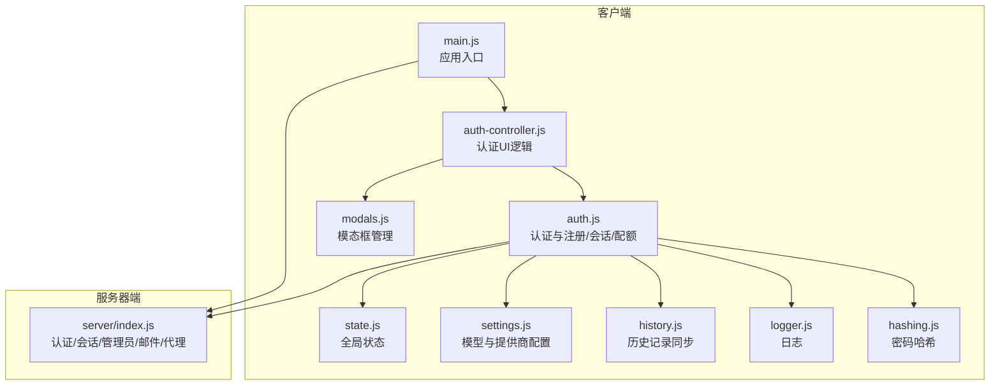
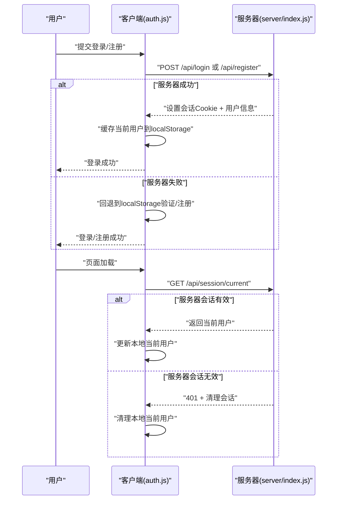
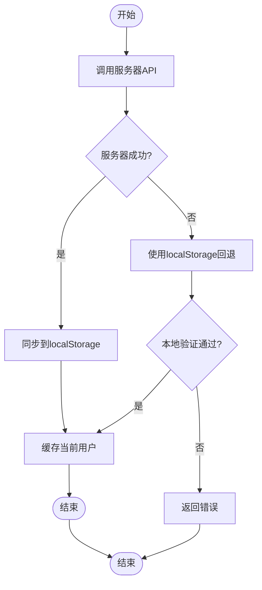
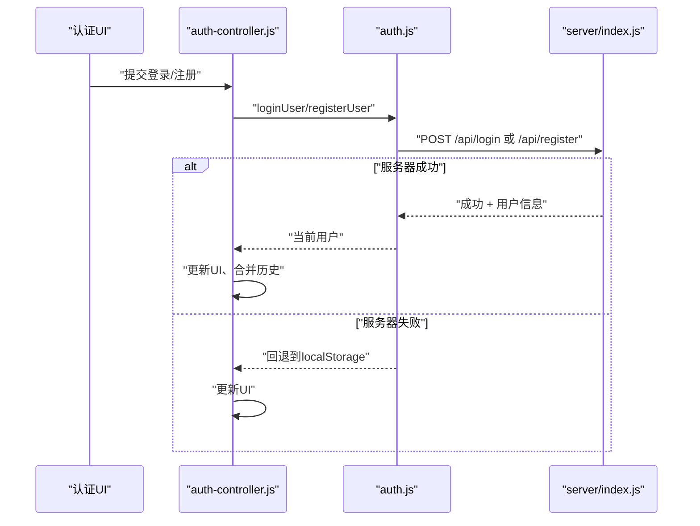
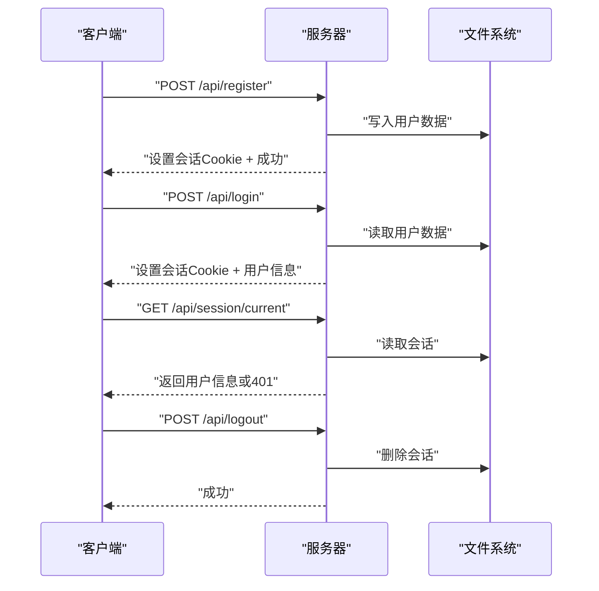
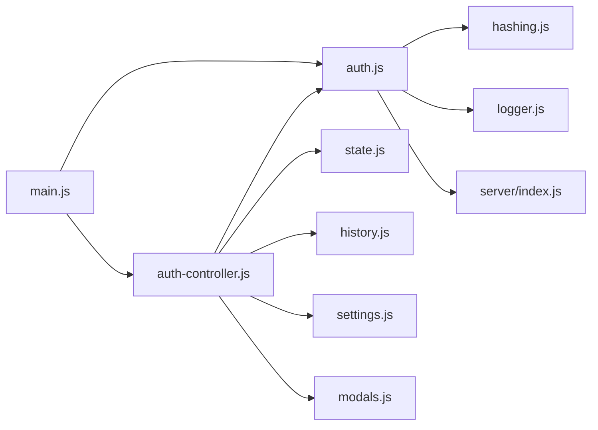

# 用户认证存储

<cite>
**本文档引用的文件**
- [auth.js](file://src/storage/auth.js)
- [auth-controller.js](file://src/controllers/auth-controller.js)
- [hashing.js](file://src/utils/hashing.js)
- [logger.js](file://src/utils/logger.js)
- [history.js](file://src/storage/history.js)
- [settings.js](file://src/storage/settings.js)
- [state.js](file://src/controllers/state.js)
- [modals.js](file://src/ui/modals.js)
- [index.js](file://server/index.js)
- [main.js](file://src/main.js)
- [storage.test.js](file://__tests__/storage.test.js)
</cite>

## 目录
1. [简介](#简介)
2. [项目结构](#项目结构)
3. [核心组件](#核心组件)
4. [架构总览](#架构总览)
5. [详细组件分析](#详细组件分析)
6. [依赖关系分析](#依赖关系分析)
7. [性能考量](#性能考量)
8. [故障排除指南](#故障排除指南)
9. [结论](#结论)
10. [附录](#附录)

## 简介
本文件面向“梅花义理”的用户认证与存储系统，围绕用户注册、登录、会话管理与密码安全机制进行深入解析。系统采用“服务器优先 + 本地回退”的混合策略，既保证云端统一认证与会话状态，又在服务器不可用时通过本地 localStorage 提供基础能力，确保用户体验连续性。同时，系统实现了游客配额与VIP特权机制，以及管理员权限控制与用户配额管理。本文还总结了安全哈希处理、密码加密与数据保护的最佳实践，并给出API接口使用方法与错误处理策略。

## 项目结构
认证与存储相关的核心模块分布如下：
- 存储层（客户端）：用户认证与注册、会话与配额、历史记录同步
- 控制器层（客户端）：认证UI逻辑、权限与配额展示、管理员面板
- 工具层（客户端）：密码哈希、日志
- 服务器端：统一认证、会话、配额、管理员与邮件验证码
- 应用入口：初始化、会话恢复、UI更新

图表来源
- [auth.js:1-350](file://src/storage/auth.js#L1-L350)
- [auth-controller.js:1-592](file://src/controllers/auth-controller.js#L1-L592)
- [hashing.js:1-20](file://src/utils/hashing.js#L1-L20)
- [logger.js:1-34](file://src/utils/logger.js#L1-L34)
- [history.js:1-143](file://src/storage/history.js#L1-L143)
- [settings.js:1-86](file://src/storage/settings.js#L1-L86)
- [state.js:1-24](file://src/controllers/state.js#L1-L24)
- [modals.js:1-57](file://src/ui/modals.js#L1-L57)
- [index.js:1-668](file://server/index.js#L1-L668)
- [main.js:167-249](file://src/main.js#L167-L249)

章节来源
- [auth.js:1-350](file://src/storage/auth.js#L1-L350)
- [auth-controller.js:1-592](file://src/controllers/auth-controller.js#L1-L592)
- [hashing.js:1-20](file://src/utils/hashing.js#L1-L20)
- [logger.js:1-34](file://src/utils/logger.js#L1-L34)
- [history.js:1-143](file://src/storage/history.js#L1-L143)
- [settings.js:1-86](file://src/storage/settings.js#L1-L86)
- [state.js:1-24](file://src/controllers/state.js#L1-L24)
- [modals.js:1-57](file://src/ui/modals.js#L1-L57)
- [index.js:1-668](file://server/index.js#L1-L668)
- [main.js:167-249](file://src/main.js#L167-L249)

## 核心组件
- 客户端认证存储（auth.js）
  - 服务器优先的登录/注册：优先调用服务器API，失败时回退到本地localStorage
  - 会话恢复：启动时尝试恢复服务器会话，失败则使用本地缓存
  - 密码哈希：使用自定义哈希函数对密码进行处理
  - 配额与VIP：游客配额、用户日配额、VIP兑换码
  - 管理员权限：基于白名单的管理员判断
- 认证控制器（auth-controller.js）
  - UI交互：登录/注册/忘记密码/个人面板/管理员面板
  - 权限与配额展示：根据hasProAccess与getUserQuota动态控制模型选择器与配额标签
  - 表单校验：用户名/密码长度与字符集限制
- 服务器端认证（server/index.js）
  - 会话管理：基于cookie的会话令牌，有效期180天
  - 用户注册/登录：用户名规范化、密码哈希比对、邮箱绑定
  - 管理员功能：统计用户、重置密码
  - 邮件验证码：发送与验证，防刷与防暴力破解
  - 历史记录：云端保存与加载
- 工具与状态
  - 密码哈希：hashing.js
  - 日志：logger.js
  - 全局状态：state.js
  - 模态框：modals.js
  - 历史记录：history.js

章节来源
- [auth.js:46-225](file://src/storage/auth.js#L46-L225)
- [auth-controller.js:141-320](file://src/controllers/auth-controller.js#L141-L320)
- [index.js:278-420](file://server/index.js#L278-L420)
- [hashing.js:4-19](file://src/utils/hashing.js#L4-L19)
- [logger.js:14-31](file://src/utils/logger.js#L14-L31)
- [state.js:5-21](file://src/controllers/state.js#L5-L21)
- [modals.js:11-32](file://src/ui/modals.js#L11-L32)
- [history.js:15-102](file://src/storage/history.js#L15-L102)

## 架构总览
系统采用“前端 + 服务器”的双层架构：
- 前端负责UI与本地持久化，优先调用服务器API；当服务器不可用时，使用本地localStorage维持基本功能
- 服务器负责统一认证、会话、配额、管理员与邮件验证码，保障数据一致性与安全性

图表来源
- [auth.js:46-87](file://src/storage/auth.js#L46-L87)
- [auth.js:194-217](file://src/storage/auth.js#L194-L217)
- [index.js:301-338](file://server/index.js#L301-L338)

## 详细组件分析

### 客户端认证存储（auth.js）
- 服务器优先策略
  - 登录/注册：优先调用服务器API，成功后同步到localStorage
  - 失败回退：网络异常或服务器不可用时，使用本地注册表与哈希进行验证
- 会话管理
  - 当前用户：localStorage中存储当前用户对象
  - 会话恢复：启动时调用服务器会话接口，若401则清理本地用户
  - 退出登录：清理本地用户并调用服务器登出
- 密码安全
  - 使用自定义哈希函数对密码进行处理，避免明文存储
  - 服务器端同样使用密码哈希进行比对
- 配额与VIP
  - 游客配额：每日最多3次，跨天清零
  - 用户配额：每日最多10次，VIP用户15次
  - VIP兑换：支持兑换码，仅限已登录用户
- 管理员权限
  - 基于白名单的管理员判断，用于控制专业版功能展示

图表来源
- [auth.js:46-125](file://src/storage/auth.js#L46-L125)
- [auth.js:194-217](file://src/storage/auth.js#L194-L217)

章节来源
- [auth.js:46-225](file://src/storage/auth.js#L46-L225)
- [auth.js:249-343](file://src/storage/auth.js#L249-L343)

### 认证控制器（auth-controller.js）
- UI与交互
  - 登录/注册模式切换、密码输入辅助（iOS微信环境）、表单校验
  - 忘记密码：发送验证码、重置密码
  - 个人面板：邮箱绑定、修改密码、管理员面板（统计与重置）
- 权限与配额展示
  - hasProAccess与getUserQuota驱动模型选择器与配额标签
  - VIP用户显示增强配额
- 会话恢复与历史合并
  - hydrateRememberedUser在应用初始化时恢复会话
  - mergeCloudHistory在登录后与云端历史合并

图表来源
- [auth-controller.js:251-310](file://src/controllers/auth-controller.js#L251-L310)
- [auth.js:46-125](file://src/storage/auth.js#L46-L125)
- [index.js:278-299](file://server/index.js#L278-L299)

章节来源
- [auth-controller.js:141-320](file://src/controllers/auth-controller.js#L141-L320)
- [auth-controller.js:337-591](file://src/controllers/auth-controller.js#L337-L591)

### 服务器端认证（server/index.js）
- 会话与Cookie
  - 会话令牌生成与保存，有效期180天
  - Cookie属性：httpOnly、secure、sameSite、maxAge
- 用户管理
  - 注册：用户名规范化、邮箱格式校验、密码哈希存储
  - 登录：用户名规范化、密码哈希比对、设置会话
  - 会话查询：校验会话有效性并刷新过期时间
  - 退出登录：销毁会话并清除Cookie
- 管理员功能
  - 统计用户：返回注册用户列表
  - 重置密码：管理员强制重置任意用户密码
- 邮件验证码
  - 发送：生成6位验证码并发送邮件，对邮箱脱敏显示
  - 验证：10分钟有效期，最多5次尝试
- 历史记录
  - 保存：按用户名分文件存储
  - 加载：按用户名读取并返回

图表来源
- [index.js:278-345](file://server/index.js#L278-L345)
- [index.js:422-487](file://server/index.js#L422-L487)

章节来源
- [index.js:278-420](file://server/index.js#L278-L420)
- [index.js:422-487](file://server/index.js#L422-L487)

### 密码哈希与安全
- 客户端哈希
  - 使用自定义哈希函数对密码进行处理，避免明文存储
- 服务器端哈希
  - 服务器同样使用密码哈希进行比对，确保一致性
- 安全建议
  - 生产环境应考虑使用更强的哈希算法（如bcrypt、argon2）与盐值管理
  - 传输层使用HTTPS，Cookie启用secure与sameSite
  - 防暴力破解：验证码、频率限制、尝试次数上限

章节来源
- [hashing.js:4-19](file://src/utils/hashing.js#L4-L19)
- [index.js:302-319](file://server/index.js#L302-L319)

### 配额与VIP机制
- 游客配额
  - 每日最多3次，跨天清零
- 用户配额
  - 每日最多10次，VIP用户15次
- VIP兑换
  - 支持兑换码，仅限已登录用户
- 权限控制
  - hasProAccess用于控制专业版功能展示

章节来源
- [auth.js:249-343](file://src/storage/auth.js#L249-L343)

### 管理员权限控制
- 白名单管理员
  - 仅管理员可见专业版功能与管理面板
- 管理员功能
  - 统计注册用户、重置任意用户密码
- 权限校验
  - 所有管理员接口均进行身份校验与权限检查

章节来源
- [auth.js:232-247](file://src/storage/auth.js#L232-L247)
- [auth-controller.js:431-497](file://src/controllers/auth-controller.js#L431-L497)
- [index.js:347-420](file://server/index.js#L347-L420)

### 历史记录与云端同步
- 本地存储
  - 每用户独立键空间，最多50条记录
- 云端同步
  - 登录后与云端合并，去重并按ID排序
  - 异步上传，不阻塞本地操作

章节来源
- [history.js:15-102](file://src/storage/history.js#L15-L102)

## 依赖关系分析
- 模块耦合
  - auth.js依赖hashing.js与logger.js，间接依赖服务器API
  - auth-controller.js依赖auth.js、settings.js、history.js、modals.js、state.js
  - main.js依赖auth-controller.js与auth.js，负责初始化与会话恢复
  - server/index.js提供统一认证与会话服务
- 外部依赖
  - fetch用于HTTP通信
  - localStorage用于本地持久化
  - Cookie用于会话标识

图表来源
- [auth-controller.js:1-10](file://src/controllers/auth-controller.js#L1-L10)
- [auth.js:1-10](file://src/storage/auth.js#L1-L10)
- [main.js:24-46](file://src/main.js#L24-L46)

章节来源
- [auth-controller.js:1-10](file://src/controllers/auth-controller.js#L1-L10)
- [auth.js:1-10](file://src/storage/auth.js#L1-L10)
- [main.js:24-46](file://src/main.js#L24-L46)

## 性能考量
- 服务器优先策略
  - 减少本地冲突，提升一致性
  - 降低前端复杂度，便于维护
- 本地回退
  - 保证离线/弱网场景下的可用性
  - 通过localStorage减少网络依赖
- 会话恢复
  - 应用启动时异步恢复，避免阻塞首屏渲染
- 历史记录
  - 本地容量限制与云端同步，平衡性能与可靠性

[本节为通用性能讨论，不直接分析具体文件]

## 故障排除指南
- 登录失败
  - 检查用户名/密码是否符合长度与字符要求
  - 若服务器不可用，系统会回退到本地验证
- 会话丢失
  - 服务器会话过期或被清理，需重新登录
  - 检查浏览器Cookie设置与SameSite策略
- 配额不足
  - 游客每日3次，用户每日10次，VIP用户每日15次
  - VIP兑换码仅限已登录用户使用
- 管理员功能不可见
  - 仅管理员白名单用户可见
- 邮箱绑定与验证码
  - 未绑定邮箱无法自助重置密码
  - 验证码10分钟有效，最多尝试5次

章节来源
- [auth-controller.js:251-310](file://src/controllers/auth-controller.js#L251-L310)
- [auth.js:249-343](file://src/storage/auth.js#L249-L343)
- [index.js:422-487](file://server/index.js#L422-L487)

## 结论
“梅花义理”的认证存储系统通过“服务器优先 + 本地回退”的设计，在保证数据一致性与安全性的前提下，提升了用户体验与可用性。系统实现了完善的会话管理、配额控制与管理员权限，配合邮件验证码与历史记录同步，构建了较为完整的用户生命周期管理体系。建议在生产环境中进一步强化密码哈希强度与安全策略，持续优化性能与稳定性。

[本节为总结性内容，不直接分析具体文件]

## 附录

### API接口清单与错误处理
- 登录
  - 方法：POST /api/login
  - 参数：name, passwordHash
  - 返回：success + user{name, hasEmail} 或错误
  - 错误：USER_NOT_FOUND/WRONG_PASSWORD
- 注册
  - 方法：POST /api/register
  - 参数：name, passwordHash, email
  - 返回：success + user{name}
  - 错误：用户名格式不合法/已存在
- 会话查询
  - 方法：GET /api/session/current
  - 返回：success + user 或 401
- 退出登录
  - 方法：POST /api/logout
  - 返回：success
- 绑定邮箱
  - 方法：POST /api/bind-email
  - 参数：name, email
  - 返回：success 或错误
- 修改密码
  - 方法：POST /api/change-password
  - 参数：name, oldPasswordHash, newPasswordHash
  - 返回：success 或错误
- 管理员重置密码
  - 方法：POST /api/admin/reset-password
  - 参数：admin, targetUser, newPasswordHash
  - 返回：success 或错误
- 发送验证码
  - 方法：POST /api/send-code
  - 参数：name
  - 返回：success + maskedEmail 或错误
- 验证码重置密码
  - 方法：POST /api/reset-password
  - 参数：name, code, newPasswordHash
  - 返回：success 或错误
- 历史记录保存/加载
  - 方法：POST /api/history/save, GET /api/history/load
  - 参数：username, records
  - 返回：success 或空数组

章节来源
- [index.js:278-487](file://server/index.js#L278-L487)
- [auth.js:127-181](file://src/storage/auth.js#L127-L181)

### 测试要点
- 登录/注册：用户名/密码长度与字符集校验、重复注册、错误密码
- 会话：hydrateRememberedUser在401时清理本地用户
- 历史：添加/删除记录、合并云端与本地历史
- 配额：游客与用户配额、VIP兑换

章节来源
- [storage.test.js:102-152](file://__tests__/storage.test.js#L102-L152)
- [storage.test.js:154-197](file://__tests__/storage.test.js#L154-L197)