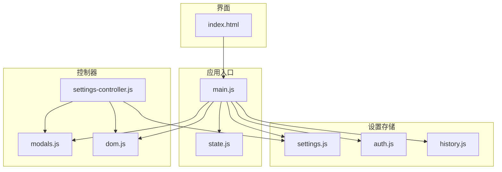
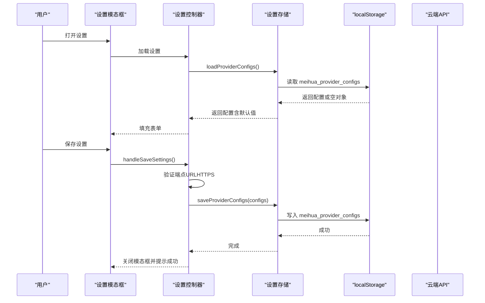
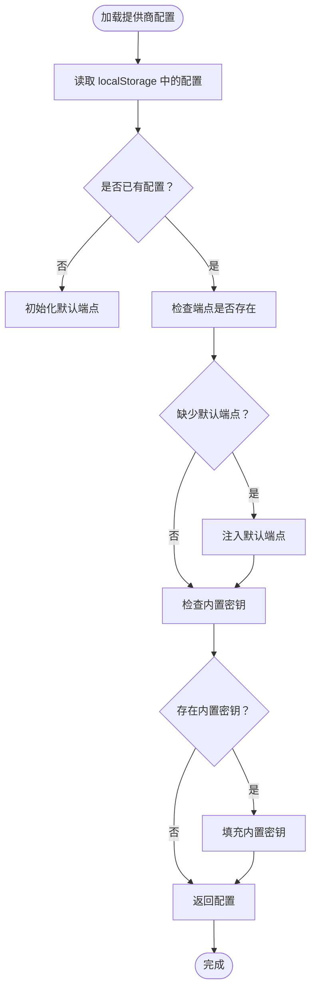
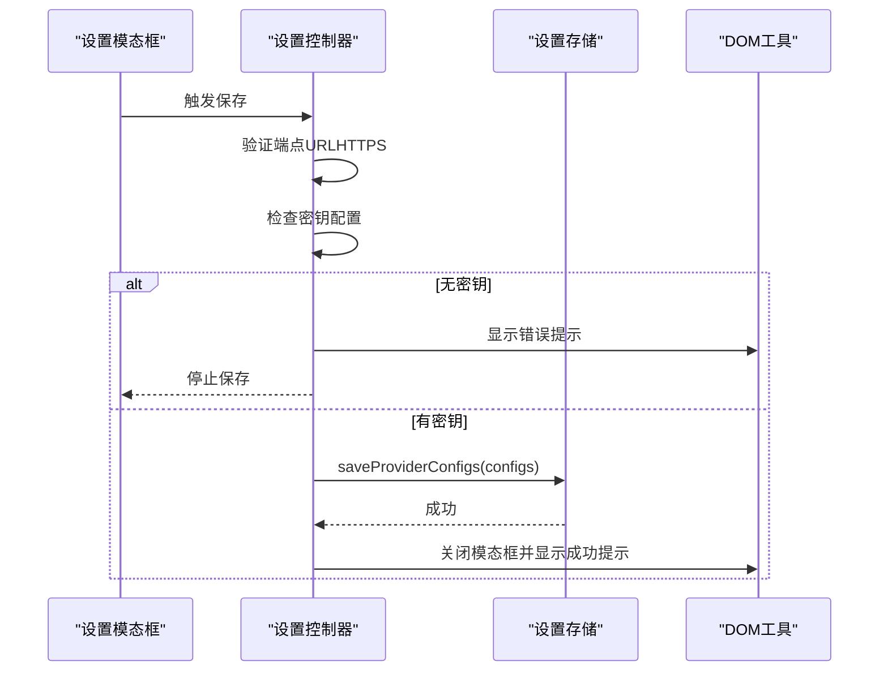
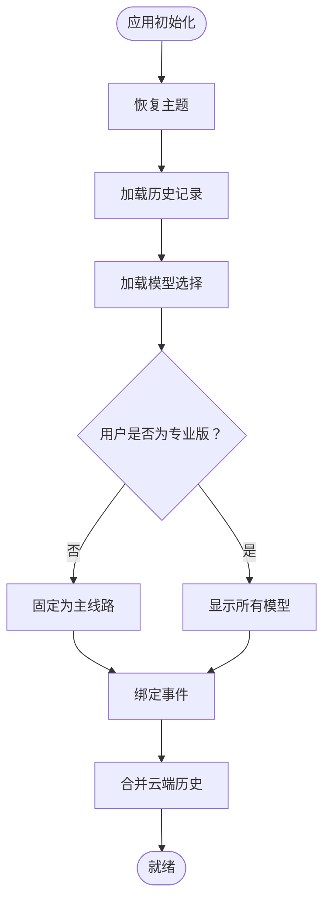
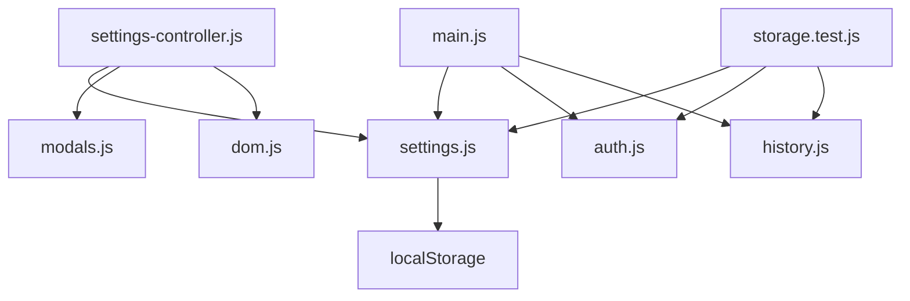

# 系统设置存储

<cite>
**本文档引用的文件**
- [settings.js](file://src/storage/settings.js)
- [settings-controller.js](file://src/controllers/settings-controller.js)
- [main.js](file://src/main.js)
- [modals.js](file://src/ui/modals.js)
- [dom.js](file://src/utils/dom.js)
- [state.js](file://src/controllers/state.js)
- [auth.js](file://src/storage/auth.js)
- [history.js](file://src/storage/history.js)
- [storage.test.js](file://__tests__/storage.test.js)
- [index.html](file://index.html)
- [package.json](file://package.json)
</cite>

## 目录
1. [简介](#简介)
2. [项目结构](#项目结构)
3. [核心组件](#核心组件)
4. [架构概览](#架构概览)
5. [详细组件分析](#详细组件分析)
6. [依赖关系分析](#依赖关系分析)
7. [性能考量](#性能考量)
8. [故障排除指南](#故障排除指南)
9. [结论](#结论)
10. [附录](#附录)

## 简介
本文档详细阐述了梅花义理系统的设置存储机制，重点涵盖用户偏好设置的存储架构、主题选择、语言配置、界面定制选项以及设置数据的结构设计。系统采用本地存储与云端同步相结合的方式，确保设置在多设备间的持久性和一致性。同时，文档还解释了设置项的分类管理、版本控制与兼容性处理、同步机制、重置与恢复出厂设置、安全存储与隐私保护，以及设置API的使用方法和配置管理最佳实践。

## 项目结构
系统设置存储主要分布在以下模块：
- 存储层：提供设置数据的读写、默认值管理、版本兼容与云端同步
- 控制器层：负责设置UI交互逻辑、表单验证与保存流程
- 应用入口：初始化设置、主题切换、模型选择与全局状态管理
- UI层：模态框管理、提示信息展示与用户交互
- 测试层：验证设置存储的正确性与边界条件

**图表来源**
- [main.js:167-250](file://src/main.js#L167-L250)
- [settings.js:1-86](file://src/storage/settings.js#L1-L86)
- [settings-controller.js:1-71](file://src/controllers/settings-controller.js#L1-L71)
- [modals.js:1-57](file://src/ui/modals.js#L1-L57)
- [dom.js:1-41](file://src/utils/dom.js#L1-L41)
- [index.html:795-842](file://index.html#L795-L842)

**章节来源**
- [main.js:167-250](file://src/main.js#L167-L250)
- [settings.js:1-86](file://src/storage/settings.js#L1-L86)
- [settings-controller.js:1-71](file://src/controllers/settings-controller.js#L1-L71)
- [modals.js:1-57](file://src/ui/modals.js#L1-L57)
- [dom.js:1-41](file://src/utils/dom.js#L1-L41)
- [index.html:795-842](file://index.html#L795-L842)

## 核心组件
- 设置存储模块：提供提供商配置、模型选择、默认值管理与API密钥验证
- 设置控制器：处理设置模态框的加载、保存、验证与错误提示
- 应用入口：初始化主题、模型选择、用户状态与云端历史同步
- UI与DOM工具：模态框管理、Toast提示与表单元素访问
- 认证与历史：用户认证状态、配额管理与云端历史同步

**章节来源**
- [settings.js:38-86](file://src/storage/settings.js#L38-L86)
- [settings-controller.js:12-71](file://src/controllers/settings-controller.js#L12-L71)
- [main.js:85-249](file://src/main.js#L85-L249)
- [dom.js:17-41](file://src/utils/dom.js#L17-L41)
- [auth.js:46-225](file://src/storage/auth.js#L46-L225)
- [history.js:15-102](file://src/storage/history.js#L15-L102)

## 架构概览
系统设置存储采用分层架构：
- 数据持久化：localStorage用于本地持久化，支持主题、模型选择与提供商配置
- 云端同步：历史记录与用户状态通过API进行云端同步，确保跨设备一致性
- 安全策略：API密钥仅在本地存储，不上传至服务器；URL验证防止SSRF攻击
- 版本兼容：默认值注入与错误容错确保旧版本数据的兼容性

**图表来源**
- [settings-controller.js:12-54](file://src/controllers/settings-controller.js#L12-L54)
- [settings.js:38-73](file://src/storage/settings.js#L38-L73)
- [index.html:795-842](file://index.html#L795-L842)

**章节来源**
- [settings-controller.js:12-54](file://src/controllers/settings-controller.js#L12-L54)
- [settings.js:38-73](file://src/storage/settings.js#L38-L73)
- [index.html:795-842](file://index.html#L795-L842)

## 详细组件分析

### 设置存储模块（settings.js）
- 提供商配置管理
  - 默认端点：为DeepSeek、Kimi、Qwen、Gemini、SiliconFlow提供默认端点
  - 配置加载：从localStorage读取配置，若缺失则注入默认端点
  - 内置密钥：当存在内置运营密钥时，自动填充SiliconFlow密钥以提升可用性
- 模型注册与选择
  - 模型注册表：定义可用模型及其提供商映射
  - 模型选择：从localStorage读取选中的模型，默认为主线路
- API密钥验证
  - 任意密钥检测：判断是否存在有效API密钥（内置密钥视为有效）

**图表来源**
- [settings.js:38-60](file://src/storage/settings.js#L38-L60)

**章节来源**
- [settings.js:9-86](file://src/storage/settings.js#L9-L86)

### 设置控制器（settings-controller.js）
- 表单加载与填充
  - 从设置存储加载配置，填充DeepSeek与SiliconFlow的密钥与端点
  - 若端点为空，使用默认端点
- 保存逻辑
  - URL验证：确保端点为HTTPS协议，防止SSRF攻击
  - 更新配置：根据用户输入更新对应提供商的密钥与端点
  - 密钥检查：若未配置任何密钥，显示警告并阻止保存
  - 保存到存储：调用设置存储的保存函数
  - UI反馈：关闭模态框并显示成功提示

**图表来源**
- [settings-controller.js:12-54](file://src/controllers/settings-controller.js#L12-L54)
- [dom.js:17-41](file://src/utils/dom.js#L17-L41)

**章节来源**
- [settings-controller.js:12-71](file://src/controllers/settings-controller.js#L12-L71)
- [dom.js:17-41](file://src/utils/dom.js#L17-L41)

### 应用入口与主题管理（main.js）
- 主题恢复与切换
  - 启动时从localStorage恢复主题状态
  - 切换主题时更新DOM属性并保存到localStorage
- 模型选择与权限控制
  - 初始化模型选择器，根据用户权限显示不同模型
  - 普通用户固定为主线路，避免历史缓存导致的线路不稳定
- 云端历史同步
  - 用户登录后从云端拉取历史并与本地合并，确保数据一致性

**图表来源**
- [main.js:167-249](file://src/main.js#L167-L249)

**章节来源**
- [main.js:85-249](file://src/main.js#L85-L249)

### UI与模态框管理（modals.js, dom.js, index.html）
- 模态框管理
  - 打开/关闭模态框，支持Esc键关闭与遮罩点击关闭
  - iOS微信环境下的特殊样式适配
- Toast提示
  - 统一的消息提示组件，支持不同类型（成功/错误/信息）
- 设置模态框结构
  - 包含主线路与备用线路的密钥与端点输入框
  - 保存按钮与警告提示区域

**章节来源**
- [modals.js:11-56](file://src/ui/modals.js#L11-L56)
- [dom.js:17-41](file://src/utils/dom.js#L17-L41)
- [index.html:795-842](file://index.html#L795-L842)

### 认证与历史存储（auth.js, history.js）
- 认证存储
  - 优先使用服务器存储，localStorage作为本地缓存
  - 用户注册、登录、会话恢复与登出流程
  - 配额管理：游客配额与VIP用户配额
- 历史存储
  - 本地localStorage存储用户历史记录
  - 云端同步：异步上传与合并，确保数据一致性
  - 反馈存储：用户反馈记录的本地存储与容量限制

**章节来源**
- [auth.js:46-225](file://src/storage/auth.js#L46-L225)
- [history.js:15-102](file://src/storage/history.js#L15-L102)

## 依赖关系分析
- 设置存储依赖localStorage进行数据持久化
- 设置控制器依赖设置存储与UI工具进行表单交互
- 应用入口依赖设置存储与认证存储进行初始化
- 测试模块验证设置存储的正确性与边界条件

**图表来源**
- [settings.js:38-86](file://src/storage/settings.js#L38-L86)
- [settings-controller.js:1-10](file://src/controllers/settings-controller.js#L1-L10)
- [main.js:8-45](file://src/main.js#L8-L45)
- [storage.test.js:1-23](file://__tests__/storage.test.js#L1-L23)

**章节来源**
- [settings.js:38-86](file://src/storage/settings.js#L38-L86)
- [settings-controller.js:1-10](file://src/controllers/settings-controller.js#L1-L10)
- [main.js:8-45](file://src/main.js#L8-L45)
- [storage.test.js:1-23](file://__tests__/storage.test.js#L1-L23)

## 性能考量
- 存储优化
  - localStorage读写为同步操作，应避免频繁写入
  - 历史记录与反馈存储具备容量限制与自动裁剪机制
- 网络同步
  - 云端历史同步采用异步方式，不阻塞本地操作
  - URL验证在客户端进行，减少无效请求
- 用户体验
  - 主题切换即时生效，无需刷新页面
  - 设置保存后立即反馈，提升用户感知

## 故障排除指南
- 设置无法保存
  - 检查端点URL是否为HTTPS协议
  - 确认至少配置一个提供商的密钥
  - 查看localStorage是否可用
- 主题切换无效
  - 确认localStorage中存在主题键值
  - 检查CSS变量与DOM属性是否正确更新
- 云端历史不同步
  - 确认用户已登录且网络连接正常
  - 检查云端接口响应状态
  - 查看浏览器控制台是否有错误日志

**章节来源**
- [settings-controller.js:19-54](file://src/controllers/settings-controller.js#L19-L54)
- [main.js:85-112](file://src/main.js#L85-L112)
- [history.js:64-102](file://src/storage/history.js#L64-L102)

## 结论
梅花义理的系统设置存储通过分层架构实现了用户偏好的本地持久化与云端同步，确保了主题、模型选择与提供商配置的一致性与安全性。系统在默认值管理、URL验证、配额控制与错误容错方面表现出良好的健壮性。通过测试驱动开发与模块化设计，系统具备清晰的职责分离与可维护性，为用户提供稳定可靠的配置管理体验。

## 附录
- 设置API使用示例
  - 加载提供商配置：调用设置存储的加载函数
  - 保存提供商配置：调用设置存储的保存函数
  - 获取/设置模型选择：通过设置存储的读写函数
- 配置管理最佳实践
  - 优先使用默认端点，除非有特殊需求
  - 定期备份localStorage中的配置
  - 在生产环境中启用HTTPS端点
  - 使用内置密钥时注意API消费限额

**章节来源**
- [settings.js:38-86](file://src/storage/settings.js#L38-L86)
- [settings-controller.js:12-54](file://src/controllers/settings-controller.js#L12-L54)
- [main.js:167-249](file://src/main.js#L167-L249)