# Babel转译配置

<cite>
**本文档引用的文件**
- [babel.config.js](file://babel.config.js)
- [vite.config.js](file://vite.config.js)
- [package.json](file://package.json)
- [jest.config.js](file://jest.config.js)
- [.eslintrc.js](file://.eslintrc.js)
- [src/main.js](file://src/main.js)
- [src/utils/dom.js](file://src/utils/dom.js)
- [src/controllers/ai-controller.js](file://src/controllers/ai-controller.js)
- [src/utils/logger.js](file://src/utils/logger.js)
</cite>

## 目录
1. [简介](#简介)
2. [项目结构](#项目结构)
3. [核心组件](#核心组件)
4. [架构概览](#架构概览)
5. [详细组件分析](#详细组件分析)
6. [依赖分析](#依赖分析)
7. [性能考虑](#性能考虑)
8. [故障排除指南](#故障排除指南)
9. [结论](#结论)
10. [附录](#附录)

## 简介

本文档详细阐述了本项目中的Babel转译配置及其在构建流程中的作用。项目采用现代化的前端技术栈，使用Vite作为构建工具，配合Babel进行JavaScript代码的语法转换和polyfill处理。通过合理的转译配置，确保代码能够在目标环境中正确运行，同时保持良好的性能表现。

项目的主要特点包括：
- 使用Vite进行快速开发和生产构建
- 通过Babel进行语法转换和兼容性处理
- 集成Jest进行单元测试，使用babel-jest进行测试代码转译
- 配置了专门的构建优化策略，包括modulePreload polyfill禁用

## 项目结构

项目采用模块化的组织方式，主要目录结构如下：

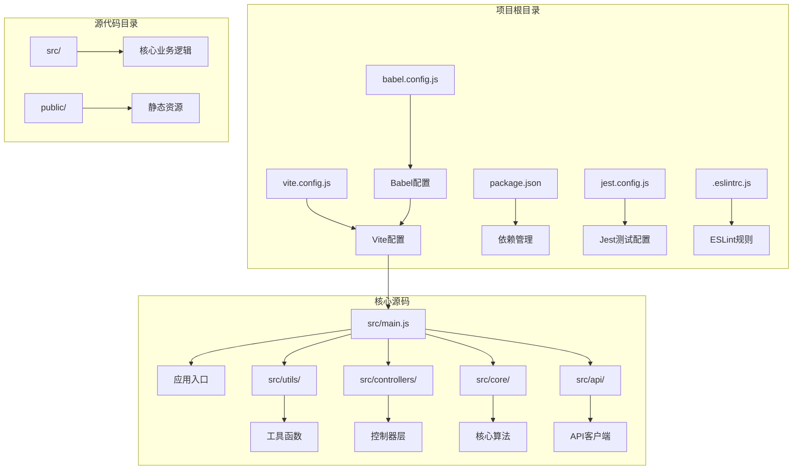

**图表来源**
- [babel.config.js:1-6](file://babel.config.js#L1-L6)
- [vite.config.js:1-20](file://vite.config.js#L1-L20)
- [package.json:1-32](file://package.json#L1-L32)

**章节来源**
- [babel.config.js:1-6](file://babel.config.js#L1-L6)
- [vite.config.js:1-20](file://vite.config.js#L1-L20)
- [package.json:1-32](file://package.json#L1-L32)

## 核心组件

### Babel配置组件

项目使用Babel进行JavaScript代码的转译处理，核心配置位于babel.config.js文件中：

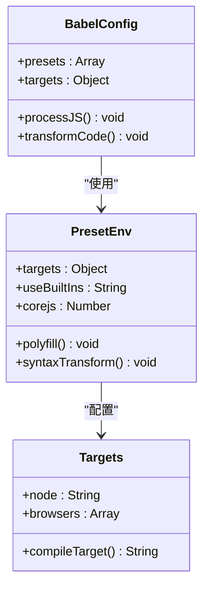

**图表来源**
- [babel.config.js:1-6](file://babel.config.js#L1-L6)

### Vite构建组件

Vite作为构建工具，提供了快速的开发服务器和高效的生产构建能力：

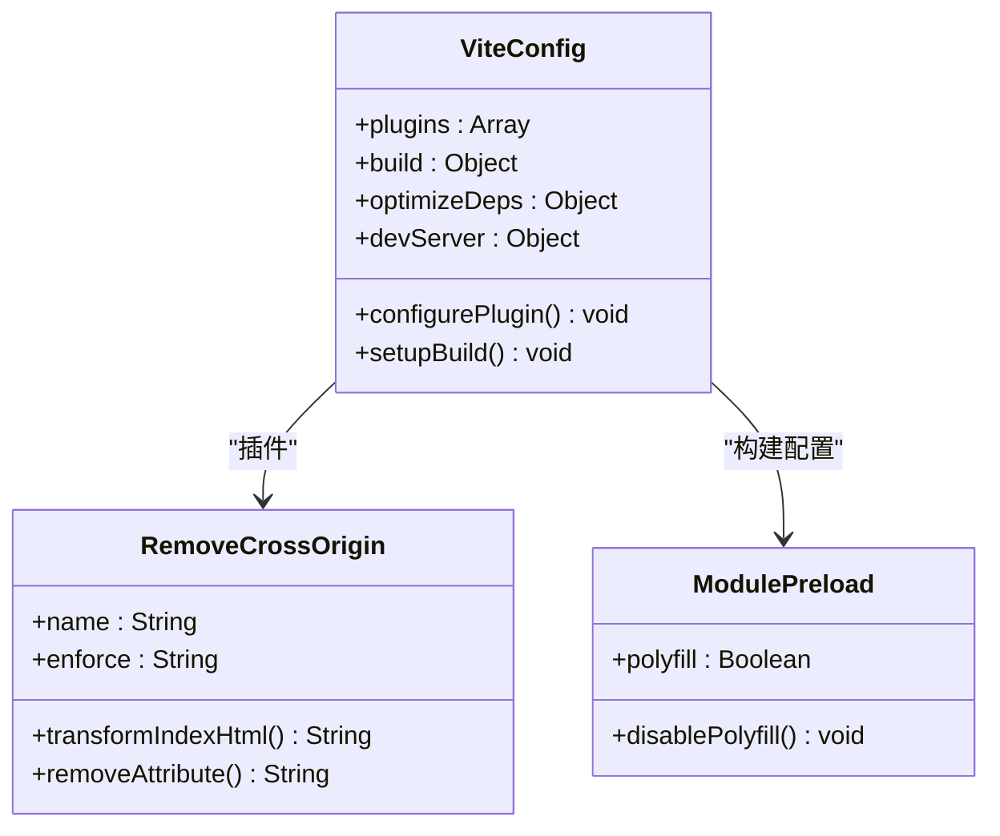

**图表来源**
- [vite.config.js:1-20](file://vite.config.js#L1-L20)

### 测试转译组件

项目使用Jest进行单元测试，通过babel-jest进行测试代码的转译：

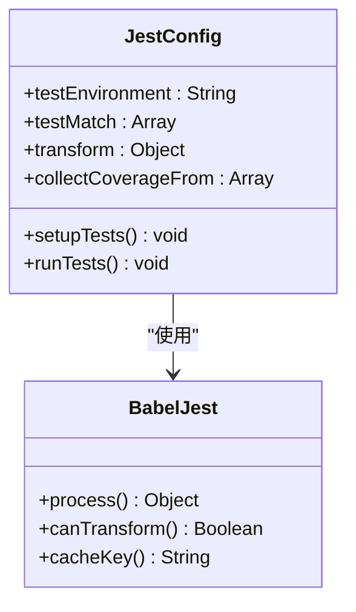

**图表来源**
- [jest.config.js:1-43](file://jest.config.js#L1-L43)

**章节来源**
- [babel.config.js:1-6](file://babel.config.js#L1-L6)
- [vite.config.js:1-20](file://vite.config.js#L1-L20)
- [jest.config.js:1-43](file://jest.config.js#L1-L43)

## 架构概览

项目采用前后端分离的架构设计，前端使用现代化的JavaScript技术栈：

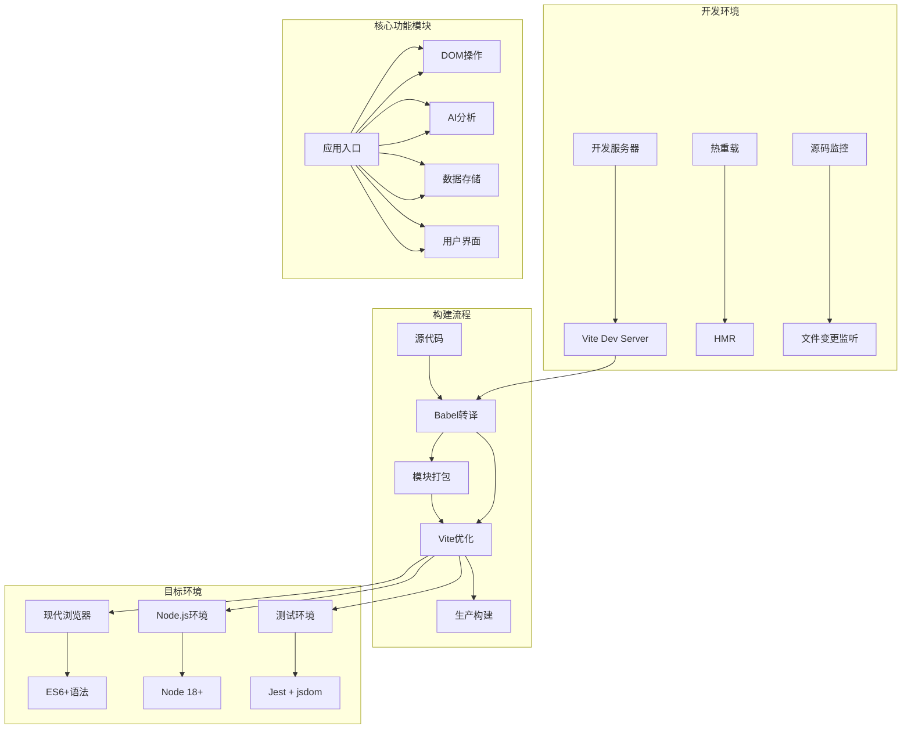

**图表来源**
- [src/main.js:1-800](file://src/main.js#L1-L800)
- [src/utils/dom.js:1-41](file://src/utils/dom.js#L1-L41)
- [src/controllers/ai-controller.js:1-733](file://src/controllers/ai-controller.js#L1-L733)

## 详细组件分析

### Babel转译规则分析

#### 目标环境配置

项目的目标环境配置相对简单，主要针对当前Node.js版本进行优化：

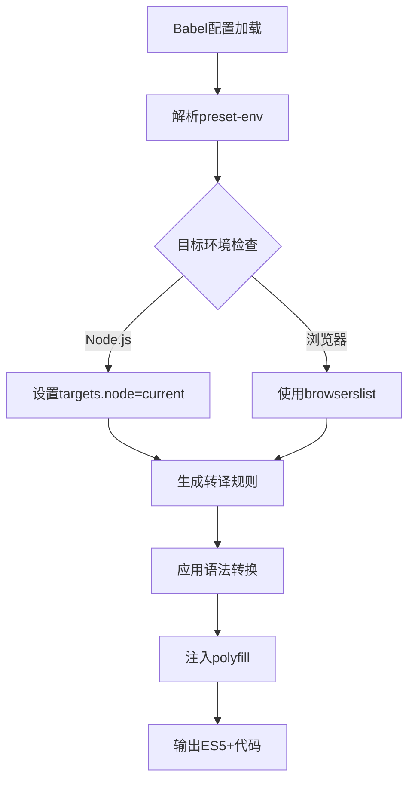

**图表来源**
- [babel.config.js:1-6](file://babel.config.js#L1-L6)

#### 语法转换流程

项目代码中使用了多种现代JavaScript特性，Babel通过preset-env自动进行转换：

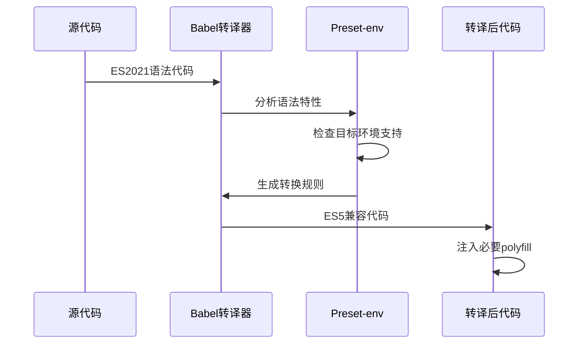

**图表来源**
- [src/main.js:1-800](file://src/main.js#L1-L800)
- [src/utils/dom.js:1-41](file://src/utils/dom.js#L1-L41)

#### Polyfill处理机制

项目通过Vite的modulePreload配置禁用了polyfill，以优化构建性能：

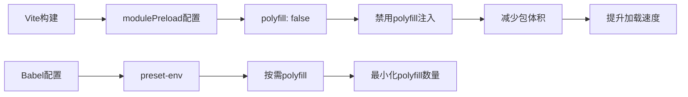

**图表来源**
- [vite.config.js:16-18](file://vite.config.js#L16-L18)
- [babel.config.js:1-6](file://babel.config.js#L1-L6)

**章节来源**
- [babel.config.js:1-6](file://babel.config.js#L1-L6)
- [vite.config.js:16-18](file://vite.config.js#L16-L18)

### Vite集成分析

#### 插件系统

项目使用了自定义的HTML处理插件来解决特定的浏览器兼容性问题：

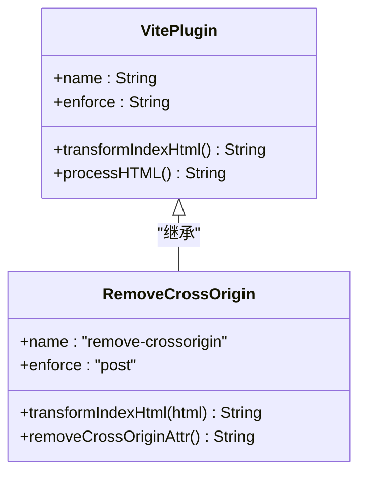

**图表来源**
- [vite.config.js:4-12](file://vite.config.js#L4-L12)

#### 构建优化策略

项目采用了多项优化策略来提升构建性能：

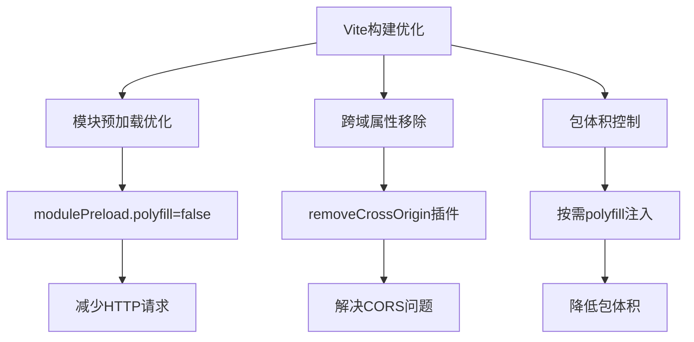

**图表来源**
- [vite.config.js:14-19](file://vite.config.js#L14-L19)

**章节来源**
- [vite.config.js:4-19](file://vite.config.js#L4-L19)

### 测试环境集成

#### Jest转译配置

项目使用babel-jest来处理测试代码的转译：

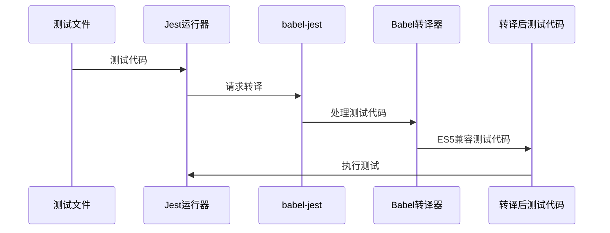

**图表来源**
- [jest.config.js:12-14](file://jest.config.js#L12-L14)

#### 测试覆盖率配置

项目配置了详细的测试覆盖率收集规则：

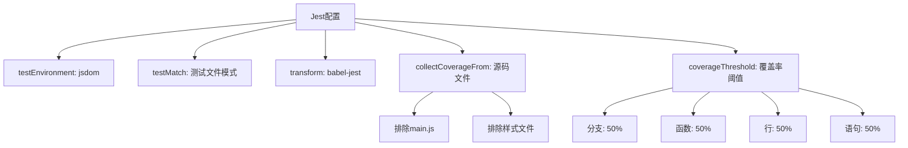

**图表来源**
- [jest.config.js:1-43](file://jest.config.js#L1-L43)

**章节来源**
- [jest.config.js:1-43](file://jest.config.js#L1-L43)

## 依赖分析

### 核心依赖关系

项目的关键依赖关系如下：

```mermaid
graph TB
subgraph "构建工具链"
A[Vite] --> B[@babel/core]
A --> C[@babel/preset-env]
D[Jest] --> E[babel-jest]
F[ESLint] --> G[eslint-config-recommended]
end
subgraph "运行时依赖"
H[应用代码] --> I[现代JavaScript特性]
I --> J[Promise]
I --> K[async/await]
I --> L[模板字符串]
I --> M[箭头函数]
end
subgraph "开发依赖"
N[开发服务器] --> O[热重载]
P[代码检查] --> Q[语法验证]
R[测试框架] --> S[单元测试]
end
B --> C
E --> B
G --> F
```

**图表来源**
- [package.json:24-31](file://package.json#L24-L31)
- [babel.config.js:1-6](file://babel.config.js#L1-L6)
- [jest.config.js:12-14](file://jest.config.js#L12-L14)

### 版本兼容性

项目使用的依赖版本具有良好的兼容性保证：

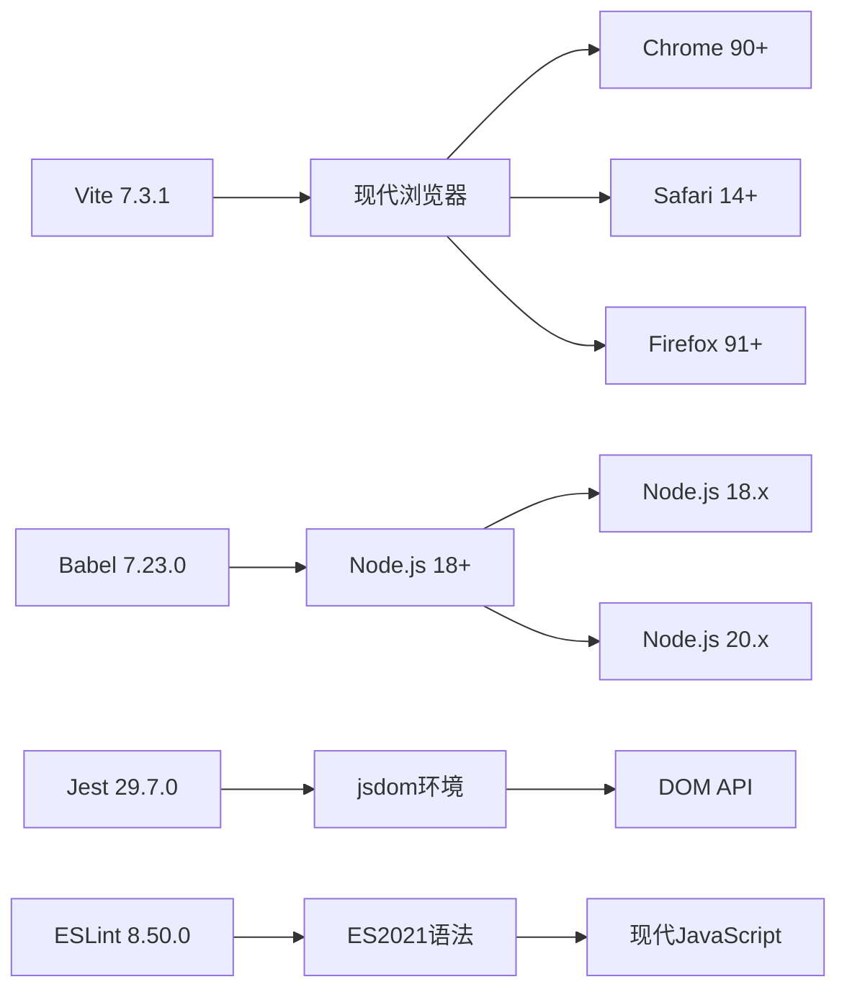

**图表来源**
- [package.json:24-31](file://package.json#L24-L31)

**章节来源**
- [package.json:24-31](file://package.json#L24-L31)

## 性能考虑

### 构建性能优化

项目在多个层面进行了性能优化：

#### 1. 模块预加载优化
- 禁用polyfill注入，减少不必要的代码
- 通过Vite的modulePreload配置优化模块加载

#### 2. 代码分割策略
- 按需加载模块，避免一次性加载所有功能
- 利用现代浏览器的原生模块支持

#### 3. 缓存策略
- Vite内置的开发服务器缓存
- 浏览器缓存友好的文件命名策略

### 运行时性能

#### 1. 语法转换优化
- 仅转换必要的语法特性
- 避免过度的polyfill注入

#### 2. 内存使用优化
- 按需加载功能模块
- 合理的垃圾回收策略

#### 3. 网络性能
- 减少HTTP请求次数
- 优化静态资源加载

## 故障排除指南

### 常见转译问题

#### 1. 语法转换失败
**问题症状**: 构建时报语法错误
**解决方案**:
- 检查Babel配置中的targets设置
- 确认使用的JavaScript特性在目标环境中支持
- 更新@babel/preset-env到最新版本

#### 2. Polyfill冲突
**问题症状**: 运行时出现兼容性问题
**解决方案**:
- 检查是否同时使用了多个polyfill库
- 确认modulePreload配置正确
- 验证目标浏览器的支持情况

#### 3. Vite插件冲突
**问题症状**: HTML处理异常
**解决方案**:
- 检查removeCrossOrigin插件的执行时机
- 确认插件顺序不影响其他构建步骤
- 验证HTML修改不会影响其他功能

### 调试技巧

#### 1. 开发环境调试
- 使用Vite的HMR功能进行快速迭代
- 利用浏览器开发者工具检查转译后的代码
- 通过console.log跟踪转译过程

#### 2. 生产环境调试
- 检查构建输出的文件大小
- 验证目标环境的兼容性
- 监控运行时性能指标

**章节来源**
- [babel.config.js:1-6](file://babel.config.js#L1-L6)
- [vite.config.js:4-19](file://vite.config.js#L4-L19)
- [jest.config.js:1-43](file://jest.config.js#L1-L43)

## 结论

本项目的Babel转译配置体现了现代前端开发的最佳实践。通过合理的配置策略，项目实现了：

1. **高效的构建流程**: 使用Vite提供快速的开发体验和优化的生产构建
2. **良好的兼容性**: 通过Babel确保代码在目标环境中正确运行
3. **性能优化**: 采用多种策略减少包体积和提升加载速度
4. **测试完整性**: 集成Jest进行全面的单元测试

配置的核心优势在于：
- 简洁的Babel配置，专注于必要的语法转换
- Vite的深度集成，充分利用现代构建工具的优势
- 合理的polyfill策略，在兼容性和性能之间取得平衡
- 完善的测试环境配置，确保代码质量

这种配置方式为类似的前端项目提供了优秀的参考模板，既保证了功能的完整性，又确保了良好的用户体验。

## 附录

### 配置文件摘要

#### Babel配置摘要
- 预设: @babel/preset-env
- 目标: Node.js当前版本
- 用途: 语法转换和polyfill处理

#### Vite配置摘要
- 插件: removeCrossOrigin
- 构建选项: modulePreload.polyfill=false
- 用途: HTML处理和性能优化

#### Jest配置摘要
- 环境: jsdom
- 转译: babel-jest
- 覆盖率: 50%阈值
- 用途: 单元测试和代码质量保证

### 推荐的转译配置示例

#### 针对现代浏览器的配置
```javascript
// targets: browserslist配置
targets: {
  browsers: ['> 1%', 'last 2 versions']
}
```

#### 针对Node.js服务端的配置
```javascript
// targets: Node.js版本
targets: {
  node: '18'
}
```

#### 针对混合环境的配置
```javascript
// targets: 多环境支持
targets: {
  browsers: ['> 1%', 'last 2 versions'],
  node: '18'
}
```