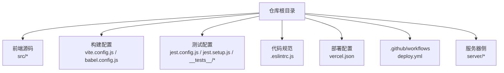
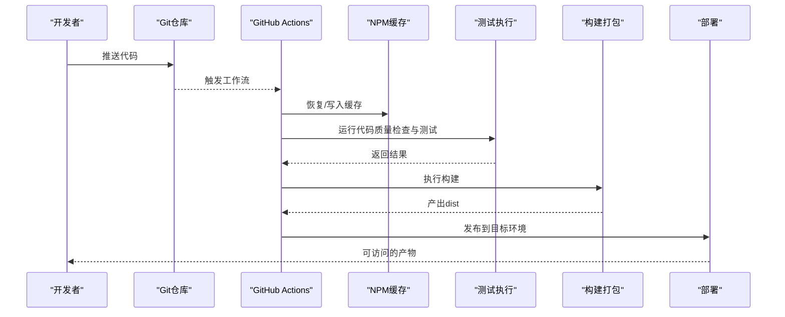
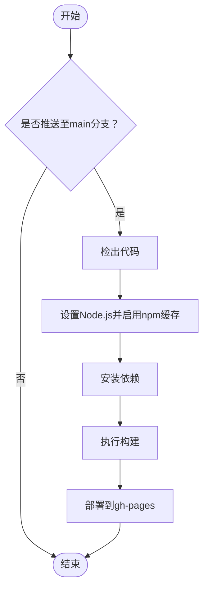
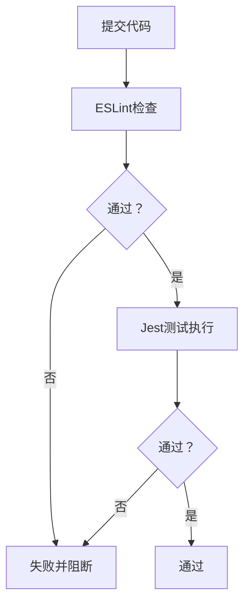
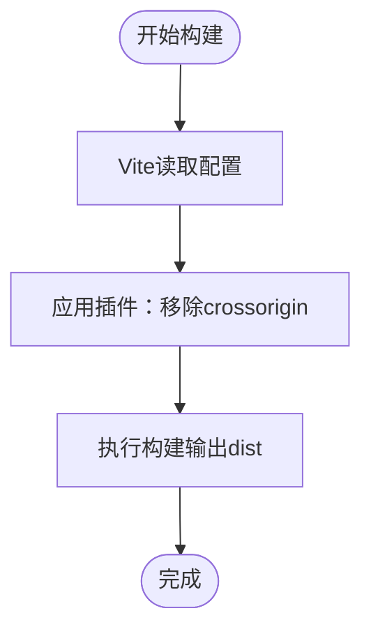
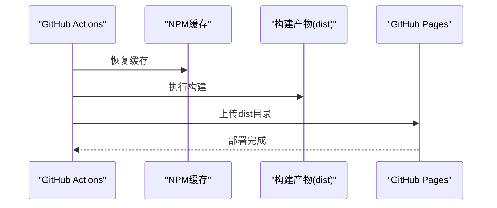
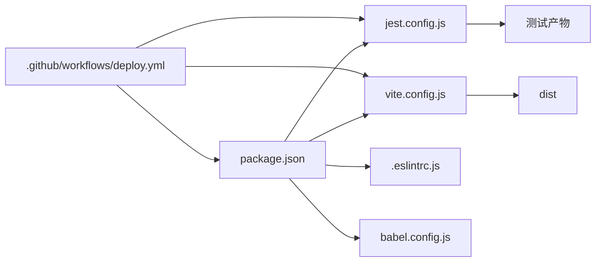

# CI/CD流水线

<cite>
**本文引用的文件**
- [.github/workflows/deploy.yml](file://.github/workflows/deploy.yml)
- [package.json](file://package.json)
- [jest.config.js](file://jest.config.js)
- [jest.setup.js](file://jest.setup.js)
- [.eslintrc.js](file://.eslintrc.js)
- [vite.config.js](file://vite.config.js)
- [babel.config.js](file://babel.config.js)
- [lint_checker.js](file://lint_checker.js)
- [vercel.json](file://vercel.json)
- [server/README.md](file://server/README.md)
- [server/package.json](file://server/package.json)
- [__tests__/divination.test.js](file://__tests__/divination.test.js)
- [__tests__/storage.test.js](file://__tests__/storage.test.js)
</cite>

## 目录
1. [简介](#简介)
2. [项目结构](#项目结构)
3. [核心组件](#核心组件)
4. [架构总览](#架构总览)
5. [详细组件分析](#详细组件分析)
6. [依赖关系分析](#依赖关系分析)
7. [性能与优化](#性能与优化)
8. [故障排查指南](#故障排查指南)
9. [结论](#结论)
10. [附录](#附录)

## 简介
本指南面向该AI项目的CI/CD流水线配置，目标是基于现有仓库能力，提供一套可落地的GitHub Actions工作流配置方案，覆盖代码质量检查、单元测试、构建打包、部署触发与发布策略，并扩展到多环境部署、分支策略、构建缓存优化、并行执行、回滚与版本管理、安全扫描与依赖更新等实践建议。当前仓库已具备基础的前端构建与测试配置，但缺少统一的CI工作流文件；本文将在此基础上补充完整的流水线设计。

## 项目结构
该项目采用前端单页应用与本地代理服务并存的结构：
- 前端工程位于根目录，使用Vite进行构建，Jest进行单元测试，ESLint进行代码规范检查。
- 服务器侧位于server目录，提供本地代理服务与外网访问配置说明。
- GitHub Actions工作流位于.github/workflows/deploy.yml，当前仅支持主分支到GitHub Pages的部署。

图表来源
- [package.json:1-32](file://package.json#L1-L32)
- [.github/workflows/deploy.yml:1-35](file://.github/workflows/deploy.yml#L1-L35)
- [vite.config.js:1-20](file://vite.config.js#L1-L20)
- [jest.config.js:1-43](file://jest.config.js#L1-L43)
- [.eslintrc.js:1-26](file://.eslintrc.js#L1-L26)
- [vercel.json:1-23](file://vercel.json#L1-L23)
- [server/README.md:1-101](file://server/README.md#L1-L101)

章节来源
- [package.json:1-32](file://package.json#L1-L32)
- [.github/workflows/deploy.yml:1-35](file://.github/workflows/deploy.yml#L1-L35)
- [vite.config.js:1-20](file://vite.config.js#L1-L20)
- [jest.config.js:1-43](file://jest.config.js#L1-L43)
- [.eslintrc.js:1-26](file://.eslintrc.js#L1-L26)
- [vercel.json:1-23](file://vercel.json#L1-L23)
- [server/README.md:1-101](file://server/README.md#L1-L101)

## 核心组件
- 构建与打包：Vite配置与插件、Babel转译、移除跨域属性的HTML处理插件。
- 测试体系：Jest配置、测试覆盖率阈值、测试环境设置、测试文件匹配规则。
- 代码规范：ESLint配置、全局变量声明、规则级别。
- 部署与缓存：GitHub Actions工作流（当前仅主分支到GitHub Pages）、构建缓存策略。
- 服务器侧：本地代理服务说明与外网访问配置。

章节来源
- [vite.config.js:1-20](file://vite.config.js#L1-L20)
- [babel.config.js:1-6](file://babel.config.js#L1-L6)
- [jest.config.js:1-43](file://jest.config.js#L1-L43)
- [jest.setup.js:1-9](file://jest.setup.js#L1-L9)
- [.eslintrc.js:1-26](file://.eslintrc.js#L1-L26)
- [.github/workflows/deploy.yml:1-35](file://.github/workflows/deploy.yml#L1-L35)

## 架构总览
下图展示了从代码提交到产物发布的典型流水线路径，包括质量门禁、测试、构建与部署环节。

图表来源
- [.github/workflows/deploy.yml:1-35](file://.github/workflows/deploy.yml#L1-L35)
- [jest.config.js:1-43](file://jest.config.js#L1-L43)
- [package.json:5-14](file://package.json#L5-L14)

## 详细组件分析

### GitHub Actions 工作流（当前实现）
- 触发条件：仅在main分支推送时触发。
- 步骤概览：检出代码、设置Node.js并启用npm缓存、安装依赖、构建、部署到gh-pages。
- 权限：对仓库内容具有写权限。

图表来源
- [.github/workflows/deploy.yml:1-35](file://.github/workflows/deploy.yml#L1-L35)

章节来源
- [.github/workflows/deploy.yml:1-35](file://.github/workflows/deploy.yml#L1-L35)

### 代码质量检查与测试
- Lint：通过ESLint对src目录进行静态检查，规则包含未使用变量警告与未定义变量错误。
- 测试：Jest配置启用jsdom环境、匹配测试文件、Babel转换、覆盖率阈值、测试超时、设置文件与缓存目录。
- 自定义语法检查：提供一个简单的语法检查脚本，用于检测legacy/app-core.js是否存在语法错误。

图表来源
- [.eslintrc.js:1-26](file://.eslintrc.js#L1-L26)
- [jest.config.js:1-43](file://jest.config.js#L1-L43)
- [lint_checker.js:1-20](file://lint_checker.js#L1-L20)

章节来源
- [.eslintrc.js:1-26](file://.eslintrc.js#L1-L26)
- [jest.config.js:1-43](file://jest.config.js#L1-L43)
- [jest.setup.js:1-9](file://jest.setup.js#L1-L9)
- [lint_checker.js:1-20](file://lint_checker.js#L1-L20)

### 构建与打包
- Vite配置：移除HTML中的crossorigin属性以规避微信浏览器CORS问题，关闭模块预加载polyfill。
- Babel配置：preset-env针对当前Node版本进行转译。
- 依赖脚本：dev、build、preview、test、lint等。

图表来源
- [vite.config.js:1-20](file://vite.config.js#L1-L20)
- [babel.config.js:1-6](file://babel.config.js#L1-L6)
- [package.json:5-14](file://package.json#L5-L14)

章节来源
- [vite.config.js:1-20](file://vite.config.js#L1-L20)
- [babel.config.js:1-6](file://babel.config.js#L1-L6)
- [package.json:5-14](file://package.json#L5-L14)

### 部署与缓存
- 当前部署：主分支推送触发，构建产物发布到GitHub Pages。
- 缓存策略：actions/setup-node中启用npm缓存，减少重复安装依赖的时间。
- 头部缓存控制：vercel.json对特定路径设置了Cache-Control头，避免陈旧资源被缓存。

图表来源
- [.github/workflows/deploy.yml:18-35](file://.github/workflows/deploy.yml#L18-L35)
- [vercel.json:1-23](file://vercel.json#L1-L23)

章节来源
- [.github/workflows/deploy.yml:18-35](file://.github/workflows/deploy.yml#L18-L35)
- [vercel.json:1-23](file://vercel.json#L1-L23)

### 多环境部署与分支策略（建议）
- 分支策略：
  - main：稳定发布分支，触发生产部署。
  - develop：集成分支，合并前需通过质量门禁与测试。
  - feature/*：功能开发分支，推送触发轻量级检查。
  - release/*：预发布分支，仅进行最终验证与打包。
- 多环境：
  - staging：集成测试环境，自动部署release/*或develop分支。
  - production：生产环境，仅允许main分支发布。
- 触发方式：
  - 使用GitHub Actions的pull_request与push事件组合，按分支与标签区分环境。

（本节为概念性设计，不直接对应具体文件）

### 并行执行与缓存优化（建议）
- 并行任务：
  - 将lint、test、build拆分为独立job，使用needs/outputs协调依赖。
  - 对不同平台（Linux/macOS/Windows）并行执行，提升吞吐。
- 缓存优化：
  - 除了npm缓存，增加Vite构建缓存目录缓存，减少二次构建时间。
  - 使用key+paths组合确保缓存命中与失效可控。

（本节为概念性设计，不直接对应具体文件）

### 回滚与版本管理（建议）
- 版本策略：语义化版本（SemVer），在main分支上打tag作为发布版本。
- 回滚策略：
  - 生产回滚：基于标签快速回滚到上一个稳定版本。
  - 数据库迁移：如涉及数据库变更，采用可逆迁移并在回滚时同步回退。
- 发布记录：在Release页面记录变更摘要与回滚指引。

（本节为概念性设计，不直接对应具体文件）

### 安全扫描与依赖更新（建议）
- 安全扫描：
  - 使用npm audit或类似工具在CI中执行依赖漏洞扫描。
  - 对高危漏洞阻断合并。
- 依赖更新：
  - 使用dependabot定期生成更新PR，配合测试与lint通过后自动合并。
  - 对重大版本升级进行人工审核与回归测试。

（本节为概念性设计，不直接对应具体文件）

## 依赖关系分析
- 脚本依赖：package.json中的scripts定义了dev/build/test/lint等命令，供Actions工作流调用。
- 测试依赖：jest.config.js与jest.setup.js共同定义测试环境与覆盖率策略。
- 构建依赖：vite.config.js与babel.config.js共同决定构建行为与兼容性。
- 规范依赖：.eslintrc.js定义了代码风格与规则。
- 部署依赖：vercel.json影响静态资源缓存策略，当前工作流部署至GitHub Pages。

图表来源
- [package.json:5-14](file://package.json#L5-L14)
- [jest.config.js:1-43](file://jest.config.js#L1-L43)
- [vite.config.js:1-20](file://vite.config.js#L1-L20)
- [.eslintrc.js:1-26](file://.eslintrc.js#L1-L26)
- [babel.config.js:1-6](file://babel.config.js#L1-L6)
- [.github/workflows/deploy.yml:18-35](file://.github/workflows/deploy.yml#L18-L35)

章节来源
- [package.json:5-14](file://package.json#L5-L14)
- [jest.config.js:1-43](file://jest.config.js#L1-L43)
- [vite.config.js:1-20](file://vite.config.js#L1-L20)
- [.eslintrc.js:1-26](file://.eslintrc.js#L1-L26)
- [babel.config.js:1-6](file://babel.config.js#L1-L6)
- [.github/workflows/deploy.yml:18-35](file://.github/workflows/deploy.yml#L18-L35)

## 性能与优化
- 构建缓存：启用npm与Vite缓存，减少重复安装与编译时间。
- 测试并行：将测试拆分为多个job并行执行，缩短整体耗时。
- 依赖锁定：使用package-lock.json确保依赖一致性，避免构建漂移。
- 资源缓存：vercel.json对关键路径设置缓存头，结合版本号或哈希命名减少缓存污染。

（本节为通用指导，不直接对应具体文件）

## 故障排查指南
- 构建失败：
  - 检查Node.js版本与npm缓存是否匹配。
  - 查看构建日志中的依赖安装与Vite构建错误。
- 测试失败：
  - 关注Jest超时、覆盖率阈值与测试文件匹配规则。
  - 确认jest.setup.js中的全局配置与测试环境一致。
- Lint失败：
  - 根据.eslintrc.js规则修正未使用变量与未定义变量问题。
- 部署异常：
  - 确认GitHub Pages启用与gh-pages动作配置正确。
  - 检查dist目录是否包含预期产物。

章节来源
- [.github/workflows/deploy.yml:18-35](file://.github/workflows/deploy.yml#L18-L35)
- [jest.config.js:1-43](file://jest.config.js#L1-L43)
- [.eslintrc.js:1-26](file://.eslintrc.js#L1-L26)
- [vercel.json:1-23](file://vercel.json#L1-L23)

## 结论
当前仓库已具备前端构建、测试与部署的基础能力，但缺少统一的CI工作流文件。建议在现有基础上补充完整的质量门禁、测试与部署流程，并引入多环境与分支策略、并行执行与缓存优化、安全扫描与依赖更新机制，形成闭环的CI/CD流水线，提升交付效率与稳定性。

## 附录
- 服务器侧部署参考：server/README.md提供了本地代理服务与外网访问（Cloudflare Tunnel）的完整步骤，可用于生产环境的代理部署与访问控制。

章节来源
- [server/README.md:1-101](file://server/README.md#L1-L101)
- [server/package.json:1-18](file://server/package.json#L1-L18)