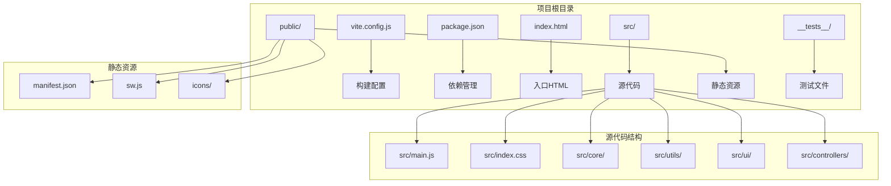
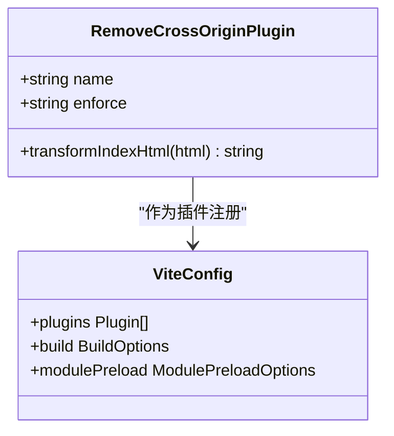
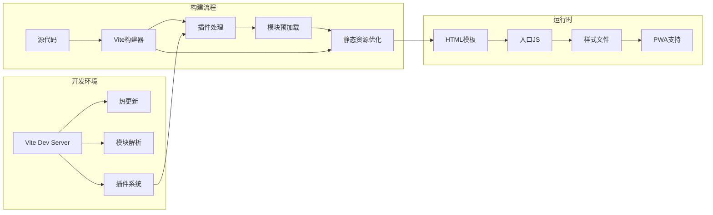
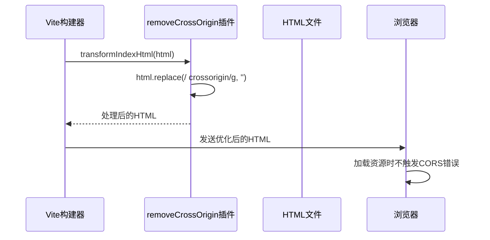
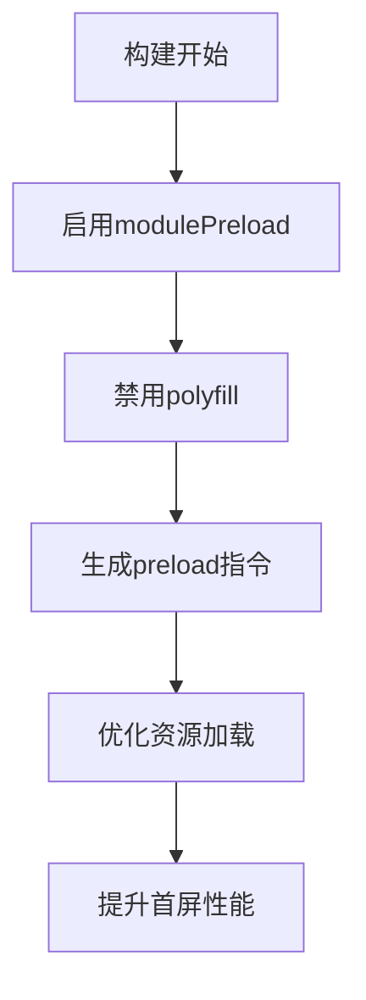
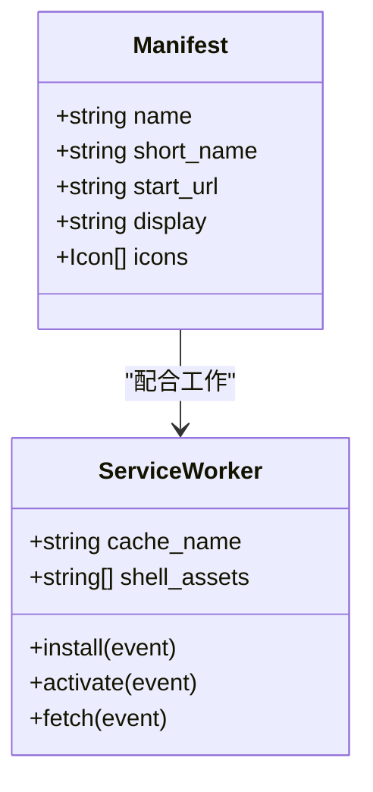
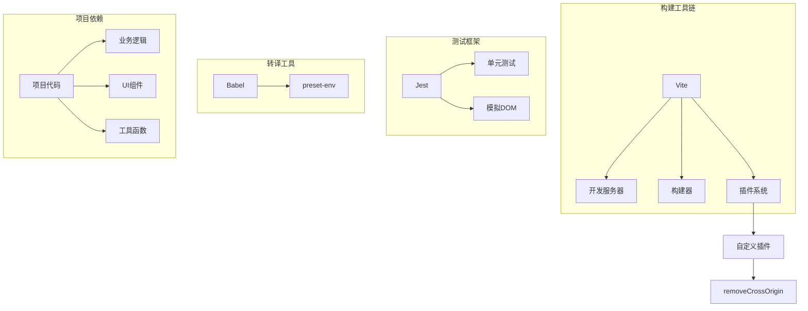

# Vite构建配置

<cite>
**本文档引用的文件**
- [vite.config.js](file://vite.config.js)
- [package.json](file://package.json)
- [src/main.js](file://src/main.js)
- [index.html](file://index.html)
- [public/sw.js](file://public/sw.js)
- [public/manifest.json](file://public/manifest.json)
- [src/index.css](file://src/index.css)
- [babel.config.js](file://babel.config.js)
- [jest.config.js](file://jest.config.js)
- [__tests__/divination.test.js](file://__tests__/divination.test.js)
- [src/core/divination-engine.js](file://src/core/divination-engine.js)
- [src/utils/dom.js](file://src/utils/dom.js)
</cite>

## 目录
1. [简介](#简介)
2. [项目结构](#项目结构)
3. [核心组件](#核心组件)
4. [架构概览](#架构概览)
5. [详细组件分析](#详细组件分析)
6. [依赖关系分析](#依赖关系分析)
7. [性能考量](#性能考量)
8. [故障排除指南](#故障排除指南)
9. [结论](#结论)

## 简介
本项目是一个基于Vite的渐进式Web应用，提供梅花易数AI断卦服务。项目采用现代化前端技术栈，包含完整的开发、构建和部署流程。本文档专注于Vite构建配置的详细说明，包括自定义插件实现、构建优化选项、开发服务器配置以及静态资源处理策略。

## 项目结构
该项目采用标准的Vite项目结构，主要目录和文件组织如下：

**图表来源**
- [vite.config.js:1-20](file://vite.config.js#L1-L20)
- [package.json:1-32](file://package.json#L1-L32)
- [index.html:1-50](file://index.html#L1-L50)

**章节来源**
- [vite.config.js:1-20](file://vite.config.js#L1-L20)
- [package.json:1-32](file://package.json#L1-L32)
- [index.html:1-100](file://index.html#L1-L100)

## 核心组件
本项目的核心构建组件包括：

### 自定义插件系统
项目实现了专门的Vite插件来解决微信浏览器的CORS问题：

**图表来源**
- [vite.config.js:3-12](file://vite.config.js#L3-L12)
- [vite.config.js:14-19](file://vite.config.js#L14-L19)

### 构建优化配置
项目启用了模块预加载优化：
- `modulePreload: { polyfill: false }` - 禁用polyfill以减少包体积
- 自定义HTML转换插件处理跨域属性

**章节来源**
- [vite.config.js:14-19](file://vite.config.js#L14-L19)

## 架构概览
项目的整体架构采用前后端分离设计，前端通过Vite进行开发和构建：

**图表来源**
- [vite.config.js:1-20](file://vite.config.js#L1-L20)
- [src/main.js:1-50](file://src/main.js#L1-L50)

## 详细组件分析

### 自定义插件：removeCrossOrigin
该插件专门解决微信浏览器的CORS问题，通过移除HTML中的crossorigin属性来避免跨域错误。

#### 插件实现细节

**图表来源**
- [vite.config.js:4-11](file://vite.config.js#L4-L11)

#### 插件特性
- **执行时机**: `enforce: 'post'` - 在其他插件之后执行
- **处理范围**: 全局替换HTML中的`crossorigin`属性
- **应用场景**: 解决微信内置浏览器的CORS限制

**章节来源**
- [vite.config.js:3-12](file://vite.config.js#L3-L12)

### 构建优化配置
项目采用了多项构建优化策略：

#### 模块预加载配置

**图表来源**
- [vite.config.js:16-18](file://vite.config.js#L16-L18)

#### 性能优化要点
- **polyfill禁用**: 减少不必要的兼容性代码
- **插件链优化**: 确保自定义插件在合适时机执行
- **资源压缩**: 利用Vite的内置压缩功能

**章节来源**
- [vite.config.js:14-19](file://vite.config.js#L14-L19)

### 开发服务器配置
虽然项目使用了默认的Vite开发服务器配置，但可以通过以下方式扩展：

#### 开发服务器特性
- **热更新**: 实时代码变更检测和页面刷新
- **模块解析**: 支持ES模块和CommonJS
- **插件集成**: 自动加载自定义插件
- **代理支持**: 可配置API代理规则

### 静态资源处理
项目采用多种静态资源处理策略：

#### PWA支持

**图表来源**
- [public/manifest.json:1-22](file://public/manifest.json#L1-L22)
- [public/sw.js:1-45](file://public/sw.js#L1-L45)

#### 资源优化策略
- **缓存策略**: Service Worker实现离线访问
- **图标管理**: 多尺寸图标支持
- **网络优先**: API请求绕过缓存

**章节来源**
- [public/manifest.json:1-22](file://public/manifest.json#L1-L22)
- [public/sw.js:1-45](file://public/sw.js#L1-L45)

### 样式处理
项目使用CSS模块化和主题系统：

#### 样式架构
- **CSS变量**: 支持深色/浅色主题切换
- **响应式设计**: 移动优先的布局策略
- **组件化样式**: 按功能模块组织CSS

**章节来源**
- [src/index.css:1-100](file://src/index.css#L1-L100)

## 依赖关系分析
项目的依赖关系相对简洁，主要依赖于Vite生态系统：

**图表来源**
- [package.json:24-31](file://package.json#L24-L31)
- [babel.config.js:1-6](file://babel.config.js#L1-L6)
- [jest.config.js:1-43](file://jest.config.js#L1-L43)

**章节来源**
- [package.json:1-32](file://package.json#L1-L32)
- [babel.config.js:1-6](file://babel.config.js#L1-L6)
- [jest.config.js:1-43](file://jest.config.js#L1-L43)

## 性能考量
基于项目现有的配置，以下是性能优化建议：

### 构建性能优化
1. **代码分割**: 利用Vite的动态导入实现按需加载
2. **资源压缩**: 启用更激进的压缩选项
3. **缓存策略**: 配置长期缓存的静态资源

### 运行时性能优化
1. **懒加载**: 对非关键路径的组件实现懒加载
2. **CDN加速**: 静态资源使用CDN分发
3. **HTTP/2**: 启用多路复用提升传输效率

### 开发体验优化
1. **增量编译**: 利用Vite的快速热更新
2. **并行构建**: 同时构建多个目标平台
3. **内存管理**: 合理配置开发服务器内存限制

## 故障排除指南

### 常见构建问题及解决方案

#### CORS相关问题
**问题症状**: 微信浏览器中出现跨域错误
**解决方案**: 
- 确认removeCrossOrigin插件已正确注册
- 检查HTML中是否仍有crossorigin属性
- 验证服务端CORS配置

#### 模块解析失败
**问题症状**: 导入模块时报错
**解决方案**:
- 检查模块路径是否正确
- 确认package.json中的exports字段
- 验证文件扩展名

#### 热更新不生效
**问题症状**: 修改代码后页面不刷新
**解决方案**:
- 检查Vite开发服务器状态
- 确认文件监听配置
- 清理浏览器缓存

### 调试方法
1. **启用详细日志**: 使用`vite --debug`查看详细构建信息
2. **检查插件链**: 验证插件执行顺序
3. **分析包大小**: 使用bundle分析工具识别大依赖
4. **性能监控**: 监控构建时间和内存使用

**章节来源**
- [vite.config.js:3-12](file://vite.config.js#L3-L12)
- [jest.config.js:1-43](file://jest.config.js#L1-L43)

## 结论
本项目的Vite配置展现了现代前端工程的最佳实践：

### 主要优势
- **针对性问题解决**: 自定义插件有效解决了微信浏览器CORS问题
- **性能导向**: 启用模块预加载优化，禁用不必要的polyfill
- **开发友好**: 简洁的配置结构，易于维护和扩展

### 改进建议
1. **增强类型安全**: 添加TypeScript支持
2. **优化测试配置**: 扩展测试覆盖率和测试环境
3. **生产优化**: 配置更严格的代码压缩和资源优化
4. **监控集成**: 添加构建性能监控和错误追踪

该配置为类似的应用提供了良好的起点，可以根据具体需求进一步定制和优化。