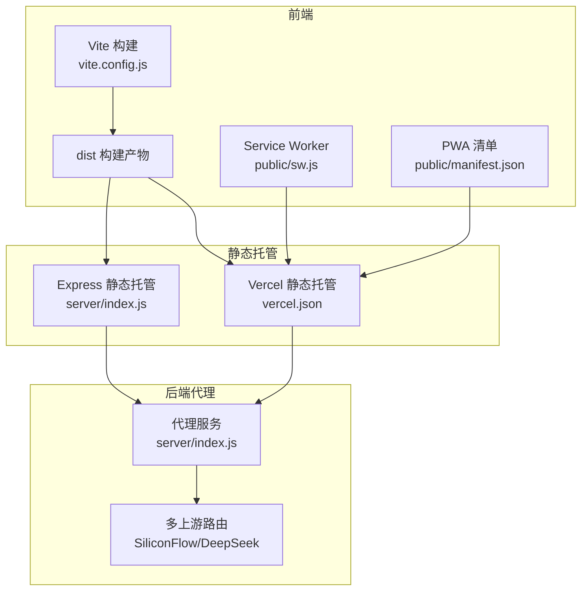
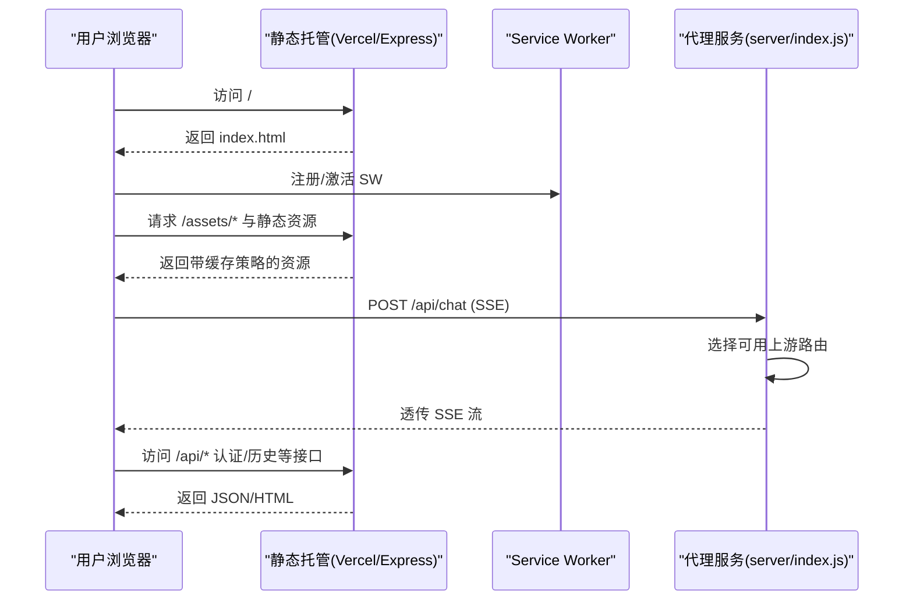
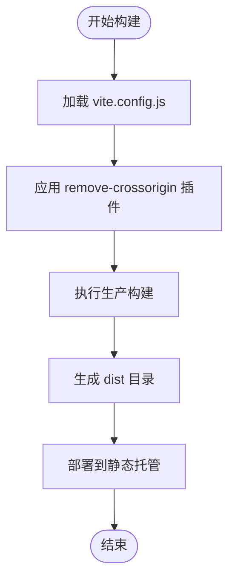
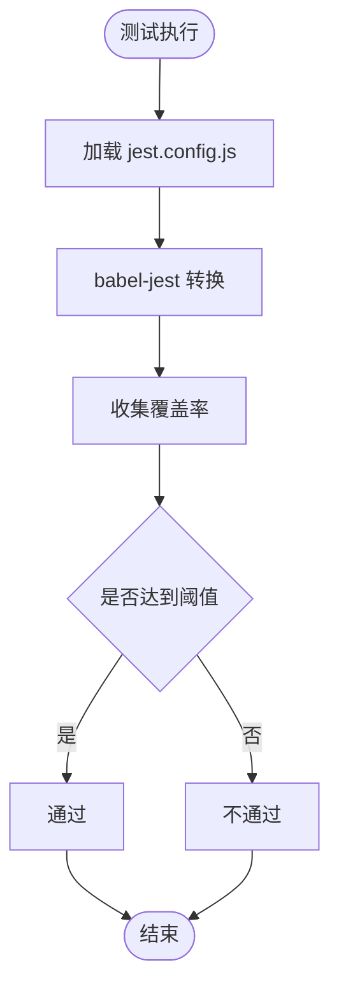
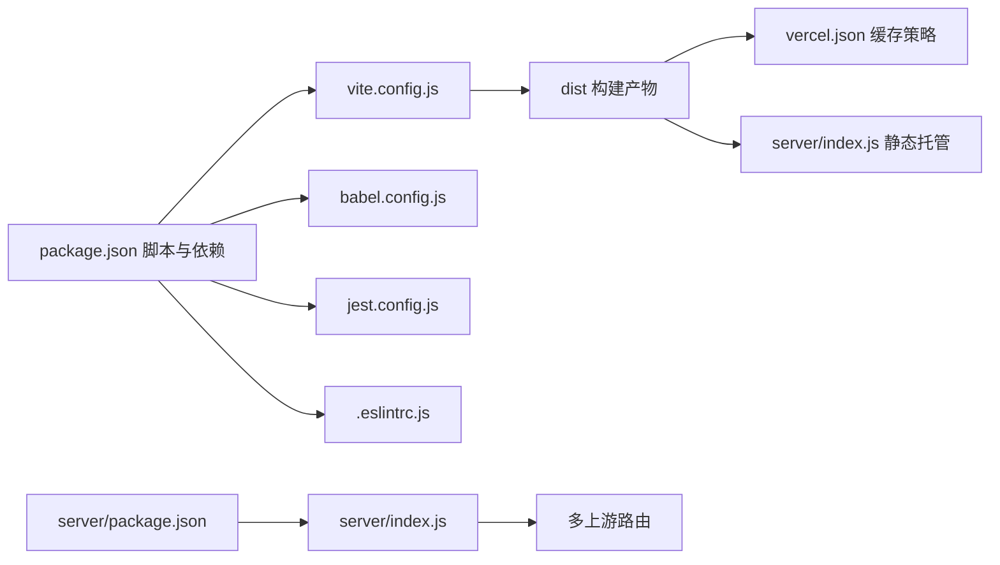

# 构建与部署

<cite>
**本文引用的文件**
- [vite.config.js](file://vite.config.js)
- [babel.config.js](file://babel.config.js)
- [package.json](file://package.json)
- [vercel.json](file://vercel.json)
- [server/index.js](file://server/index.js)
- [server/package.json](file://server/package.json)
- [public/manifest.json](file://public/manifest.json)
- [public/sw.js](file://public/sw.js)
- [.eslintrc.js](file://.eslintrc.js)
- [jest.config.js](file://jest.config.js)
- [src/main.js](file://src/main.js)
- [src/index.css](file://src/index.css)
</cite>

## 目录
1. [简介](#简介)
2. [项目结构](#项目结构)
3. [核心组件](#核心组件)
4. [架构总览](#架构总览)
5. [详细组件分析](#详细组件分析)
6. [依赖关系分析](#依赖关系分析)
7. [性能考量](#性能考量)
8. [故障排查指南](#故障排查指南)
9. [结论](#结论)
10. [附录](#附录)

## 简介
本指南面向“梅花义理”项目的构建与部署，围绕 Vite 构建工具、Babel 转译、构建产物与部署、Vercel 配置、CI/CD 自动化、静态资源优化与缓存、性能监控与错误追踪、域名与 HTTPS、版本发布与回滚、以及部署后的验证与测试等方面进行系统性说明。文档同时给出与实际源码映射的架构图与流程图，帮助读者快速落地。

## 项目结构
项目采用前端单页应用（SPA）与本地代理服务相结合的部署形态：
- 前端构建产物由 Vite 生成，托管于静态服务（如 Vercel 或自建 Nginx/Express）。
- 代理服务负责处理认证、会话、历史数据与 AI 推理代理等后端逻辑，支持多上游线路与健康检查。
- PWA 相关清单与 Service Worker 用于离线体验与缓存策略控制。

图表来源
- [vite.config.js:14-19](file://vite.config.js#L14-L19)
- [vercel.json:1-23](file://vercel.json#L1-L23)
- [server/index.js:82-90](file://server/index.js#L82-L90)
- [server/index.js:513-646](file://server/index.js#L513-L646)

章节来源
- [package.json:5-14](file://package.json#L5-L14)
- [vite.config.js:1-20](file://vite.config.js#L1-L20)
- [vercel.json:1-23](file://vercel.json#L1-L23)
- [server/index.js:82-90](file://server/index.js#L82-L90)

## 核心组件
- 构建工具与脚本
  - 使用 Vite 进行开发与生产构建，提供 dev、build、preview、测试、Lint 等脚本。
  - 构建插件移除 HTML 中的 crossorigin 属性以规避微信浏览器跨域问题；禁用 modulePreload polyfill 以减少冗余。
- 转译与测试
  - Babel 使用 preset-env 并针对当前 Node 版本目标进行转译，配合 Jest 与 babel-jest 进行测试转换。
  - ESLint 针对浏览器、Node、Jest 环境启用，定义全局只读变量与基础规则。
- 静态资源与 PWA
  - PWA 清单定义应用名称、图标与启动行为；Service Worker 实现壳资源缓存与网络优先策略，排除 API 路径。
- 代理服务
  - Express 提供认证、会话、历史数据、邮件验证码、AI 推理代理等能力；支持多上游线路与健康检查；静态资源按缓存策略分发。

章节来源
- [package.json:5-14](file://package.json#L5-L14)
- [vite.config.js:3-12](file://vite.config.js#L3-L12)
- [vite.config.js:14-19](file://vite.config.js#L14-L19)
- [babel.config.js:1-6](file://babel.config.js#L1-L6)
- [jest.config.js:11-14](file://jest.config.js#L11-L14)
- [.eslintrc.js:1-26](file://.eslintrc.js#L1-L26)
- [public/manifest.json:1-22](file://public/manifest.json#L1-L22)
- [public/sw.js:1-45](file://public/sw.js#L1-L45)
- [server/index.js:82-90](file://server/index.js#L82-L90)
- [server/index.js:513-646](file://server/index.js#L513-L646)

## 架构总览
下图展示从浏览器到代理服务的典型请求链路，以及静态资源与 PWA 的加载路径。

图表来源
- [vercel.json:1-23](file://vercel.json#L1-L23)
- [public/sw.js:23-44](file://public/sw.js#L23-L44)
- [server/index.js:513-646](file://server/index.js#L513-L646)

## 详细组件分析

### Vite 构建配置与优化
- 插件机制
  - 自定义插件在 HTML 转换阶段移除 crossorigin 属性，解决微信浏览器跨域限制。
- 构建参数
  - 关闭 modulePreload polyfill，降低产物体积与兼容成本。
- 开发与生产差异
  - 开发模式：Vite Dev Server 提供热更新与实时调试。
  - 生产模式：Vite 产出静态资源，建议结合 CDN 与缓存策略部署。

图表来源
- [vite.config.js:14-19](file://vite.config.js#L14-L19)

章节来源
- [vite.config.js:3-12](file://vite.config.js#L3-L12)
- [vite.config.js:14-19](file://vite.config.js#L14-L19)

### Babel 转译与测试配置
- Babel
  - preset-env 针对当前 Node 目标，保证构建时的语法兼容。
- Jest 测试
  - 使用 babel-jest 转换测试文件；覆盖率阈值与忽略文件明确；测试超时与缓存目录配置合理。
- ESLint
  - 针对浏览器、Node、Jest 环境启用，定义全局只读变量，避免误报未使用变量与未定义错误。

图表来源
- [jest.config.js:11-14](file://jest.config.js#L11-L14)
- [jest.config.js:16-30](file://jest.config.js#L16-L30)
- [babel.config.js:1-6](file://babel.config.js#L1-L6)

章节来源
- [babel.config.js:1-6](file://babel.config.js#L1-L6)
- [jest.config.js:1-43](file://jest.config.js#L1-L43)
- [.eslintrc.js:1-26](file://.eslintrc.js#L1-L26)

### 构建产物结构与部署要求
- 产物组成
  - dist 目录包含 HTML、JS、CSS、图片等静态资源；assets 子目录带有内容哈希，适合长期缓存。
- 部署要求
  - 静态托管需支持 SPA 回退：非 API 请求统一返回 index.html。
  - 静态资源按缓存策略分发：assets 长期缓存，其他资源不缓存或短缓存。
  - 代理服务需暴露健康检查端点与 API 接口，支持跨域白名单。

章节来源
- [server/index.js:82-90](file://server/index.js#L82-L90)
- [server/index.js:648-654](file://server/index.js#L648-L654)

### Vercel 部署配置与环境变量
- 缓存头配置
  - 对 /sw.js、/index.html、根路径设置 no-cache、must-revalidate，避免 PWA 更新延迟与首页缓存问题。
- 环境变量
  - 建议在 Vercel 控制台配置代理服务所需的密钥与上游地址（如 SF_API_KEY、DS_API_KEY、ALLOWED_ORIGINS 等）。
- 静态托管
  - 将 dist 目录作为静态资源根目录；通过 vercel.json 管理缓存头与路径规则。

章节来源
- [vercel.json:1-23](file://vercel.json#L1-L23)
- [server/index.js:38-62](file://server/index.js#L38-L62)

### CI/CD 流程与自动化部署
- 构建与测试
  - 在 CI 中执行安装依赖、构建、测试与覆盖率检查，失败即中断。
- 部署策略
  - 开发分支构建到预览环境；主分支构建到生产环境；标签发布触发镜像/静态资源部署。
- 自动化
  - 结合仓库触发器与部署平台的自动化工作流，实现一键部署与回滚。

[本节为通用实践说明，不直接分析具体文件，故无章节来源]

### 静态资源优化与缓存策略
- 资源分类
  - 带内容哈希的 assets：长期缓存（30 天），提升二次加载性能。
  - 非哈希资源：不缓存或短缓存，确保变更及时生效。
- PWA 缓存
  - Service Worker 缓存壳资源（/ 与 index.html），网络优先策略拉取最新内容，API 调用不缓存。
- 图片与字体
  - 建议使用现代格式（WebP/AVIF）与合适的尺寸裁切，配合懒加载与占位符优化首屏。

章节来源
- [server/index.js:86-89](file://server/index.js#L86-L89)
- [public/sw.js:1-45](file://public/sw.js#L1-L45)

### 性能监控与错误追踪集成
- 前端监控
  - 在入口初始化日志模块，记录关键事件与异常；结合浏览器性能 API 收集首屏与交互指标。
- 代理服务监控
  - 健康检查端点返回状态与配置线路列表；记录上游超时与失败原因，便于定位问题。
- 错误追踪
  - 建议接入轻量级错误上报（如前端埋点 SDK），后端捕获异常并输出结构化日志。

章节来源
- [src/main.js:46](file://src/main.js#L46)
- [server/index.js:93-100](file://server/index.js#L93-L100)
- [server/index.js:635-645](file://server/index.js#L635-L645)

### 域名配置与 HTTPS 证书
- 域名与证书
  - 使用受信 CA 证书，确保 HTTPS；在代理服务中配置 ALLOWED_ORIGINS 白名单，避免跨域问题。
- PWA 与安全
  - PWA 需在 HTTPS 下运行；Service Worker 注册与缓存策略仅在安全上下文中生效。

章节来源
- [server/index.js:58-62](file://server/index.js#L58-L62)

### 版本发布与回滚策略
- 版本号管理
  - 使用语义化版本（如 package.json 中的 version 字段），在发布标签上标记版本。
- 回滚方案
  - 静态资源回滚：保留历史版本 dist 目录，切换 CDN/托管指向。
  - 代理服务回滚：保留上一个镜像版本，快速切换；数据库/配置回滚需同步进行。

章节来源
- [package.json:3](file://package.json#L3)

### 部署后验证与测试
- 功能验证
  - 登录/登出、历史读写、AI 推理流式响应、主题切换、移动端交互等关键路径。
- 性能验证
  - 首屏时间、TTFB、资源加载时间、PWA 缓存命中率。
- 兼容性验证
  - 微信浏览器、Safari、Chrome 等主流浏览器的样式与功能一致性。

[本节为通用实践说明，不直接分析具体文件，故无章节来源]

## 依赖关系分析
- 前端依赖
  - Vite 提供开发与构建能力；Babel 与 ESLint/Jest 保障转译与质量。
- 后端依赖
  - Express 提供 Web 服务；CORS、Nodemailer、dotenv 等辅助模块。
- 部署依赖
  - vercel.json 定义缓存头；server/index.js 提供静态托管与代理能力。

图表来源
- [package.json:5-14](file://package.json#L5-L14)
- [vite.config.js:14-19](file://vite.config.js#L14-L19)
- [babel.config.js:1-6](file://babel.config.js#L1-L6)
- [jest.config.js:1-43](file://jest.config.js#L1-L43)
- [.eslintrc.js:1-26](file://.eslintrc.js#L1-L26)
- [vercel.json:1-23](file://vercel.json#L1-L23)
- [server/package.json:1-18](file://server/package.json#L1-L18)
- [server/index.js:82-90](file://server/index.js#L82-L90)

章节来源
- [package.json:24-31](file://package.json#L24-L31)
- [server/package.json:11-16](file://server/package.json#L11-L16)

## 性能考量
- 构建优化
  - 移除不必要的 polyfill 与属性，减少产物体积；合理拆分与懒加载模块。
- 资源优化
  - 长期缓存静态资源，短缓存动态资源；PWA 缓存壳资源，网络优先策略。
- 网络优化
  - 代理服务强制 SSE 立即透传，避免中间层缓冲；多上游线路自动降级，提升可用性。

章节来源
- [vite.config.js:14-19](file://vite.config.js#L14-L19)
- [server/index.js:527-533](file://server/index.js#L527-L533)
- [server/index.js:587-631](file://server/index.js#L587-L631)

## 故障排查指南
- CORS 与跨域
  - 确认 remove-crossorigin 插件生效；代理服务 CORS 白名单包含允许来源。
- 缓存问题
  - 检查 vercel.json 缓存头与 server/index.js 静态托管缓存策略；SW 是否缓存了旧版本。
- 代理超时与失败
  - 查看健康检查端点与上游线路状态；关注超时阈值与降级逻辑。
- PWA 更新
  - 确认 Service Worker 激活与缓存清理逻辑；避免 /sw.js 与 /index.html 被缓存。

章节来源
- [vite.config.js:3-12](file://vite.config.js#L3-L12)
- [server/index.js:66-78](file://server/index.js#L66-L78)
- [vercel.json:1-23](file://vercel.json#L1-L23)
- [public/sw.js:15-21](file://public/sw.js#L15-L21)

## 结论
本指南基于项目现有配置，给出了从构建、测试、静态资源优化、代理服务到部署与监控的完整路径。建议在实际落地时结合团队规范补充 CI/CD 工作流、监控与告警体系，并持续优化构建产物与缓存策略以获得最佳用户体验。

## 附录
- 关键入口与样式
  - 应用入口与初始化逻辑集中在 main.js；主题与布局样式集中在 index.css。
- PWA 与清单
  - PWA 清单与 Service Worker 位于 public 目录，分别控制应用元信息与缓存策略。

章节来源
- [src/main.js:167-249](file://src/main.js#L167-L249)
- [src/index.css:1-800](file://src/index.css#L1-L800)
- [public/manifest.json:1-22](file://public/manifest.json#L1-L22)
- [public/sw.js:1-45](file://public/sw.js#L1-L45)