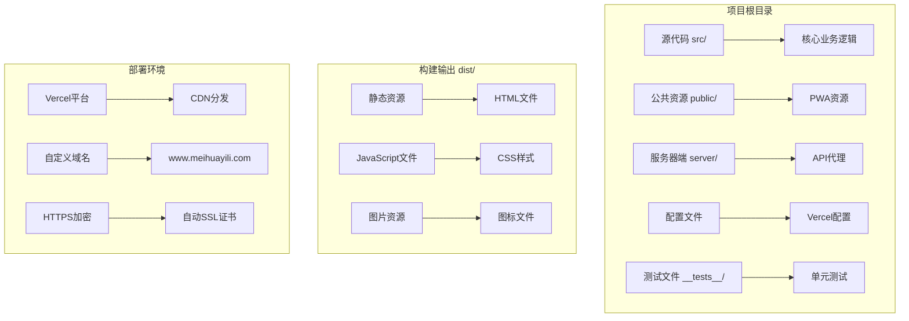
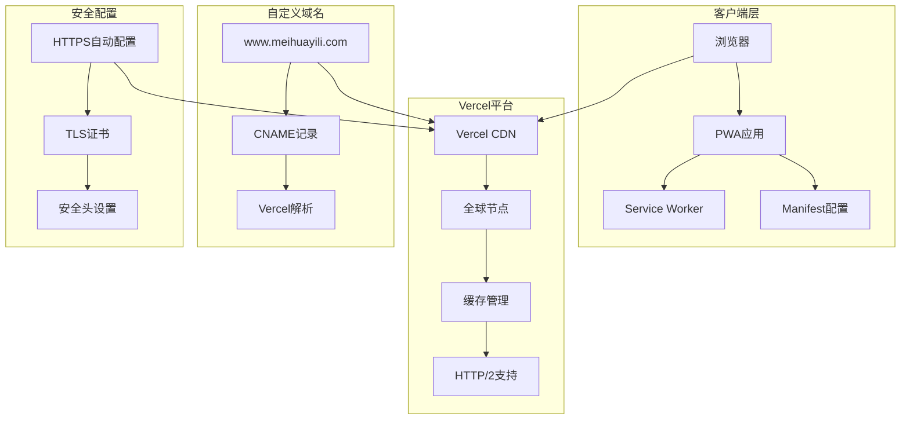
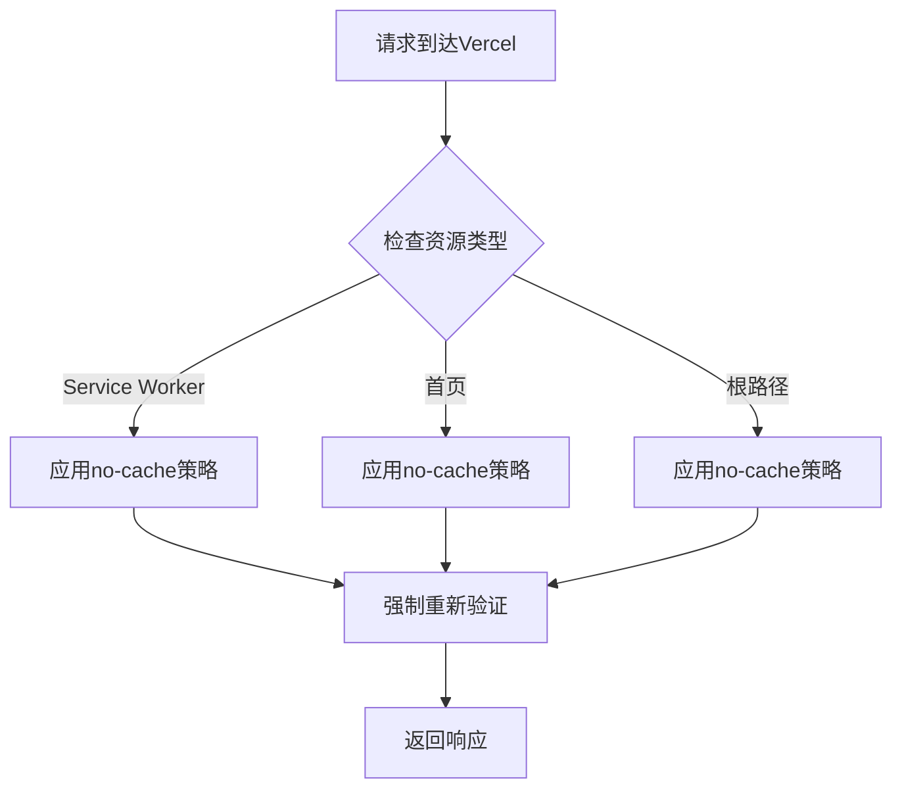
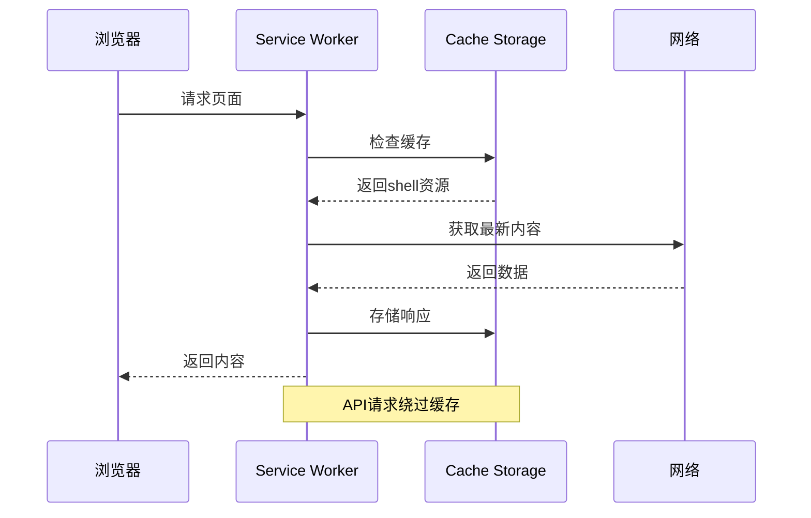
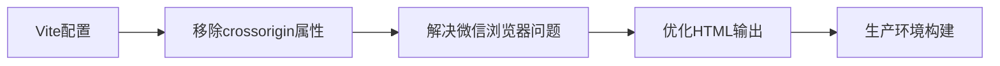
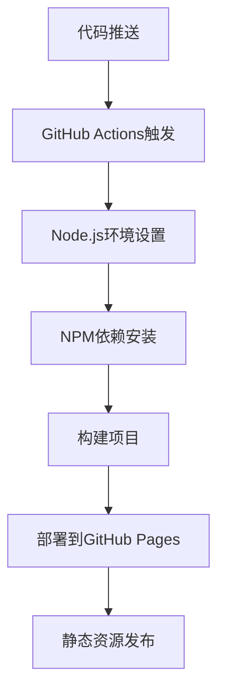
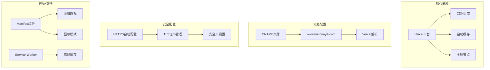

# Vercel静态部署

<cite>
**本文档引用的文件**
- [vercel.json](file://vercel.json)
- [package.json](file://package.json)
- [vite.config.js](file://vite.config.js)
- [manifest.json](file://public/manifest.json)
- [sw.js](file://public/sw.js)
- [index.html](file://index.html)
- [CNAME](file://CNAME)
- [.github/workflows/deploy.yml](file://.github/workflows/deploy.yml)
- [server/package.json](file://server/package.json)
</cite>

## 目录
1. [项目概述](#项目概述)
2. [项目结构](#项目结构)
3. [核心组件](#核心组件)
4. [架构概览](#架构概览)
5. [详细组件分析](#详细组件分析)
6. [依赖关系分析](#依赖关系分析)
7. [性能考虑](#性能考虑)
8. [故障排除指南](#故障排除指南)
9. [结论](#结论)

## 项目概述

"梅花义理"是一个基于Web技术的数智决策系统，采用PWA（渐进式Web应用）架构，结合传统易学文化和现代AI技术，为用户提供专业的梅花易数推演服务。该项目采用Vercel进行静态部署，实现了快速、稳定的全球分发。

## 项目结构

该项目采用现代化的前端工程化架构，主要包含以下核心目录：

**图表来源**
- [package.json:1-32](file://package.json#L1-L32)
- [vercel.json:1-23](file://vercel.json#L1-L23)

**章节来源**
- [package.json:1-32](file://package.json#L1-L32)
- [vercel.json:1-23](file://vercel.json#L1-L23)

## 核心组件

### 缓存控制头配置

项目通过Vercel的headers配置实现了精细化的缓存控制策略：

| 资源路径 | 缓存策略 | 说明 |
|---------|---------|------|
| `/sw.js` | `no-cache, no-store, must-revalidate` | Service Worker强制重新验证 |
| `/index.html` | `no-cache, must-revalidate` | 首页内容实时更新 |
| `/` | `no-cache, must-revalidate` | 根路径内容强制刷新 |

### PWA应用配置

项目完整实现了PWA标准，包含以下关键组件：

**Manifest配置**：
- 应用名称：梅花义理
- 显示模式：standalone
- 主题颜色：#5d2b5d
- 图标支持：192x192和512x512像素

**Service Worker策略**：
- 缓存策略：Shell模式缓存核心资源
- 更新机制：安装时清理旧缓存
- 网络优先：API请求绕过缓存

**章节来源**
- [vercel.json:2-21](file://vercel.json#L2-L21)
- [public/manifest.json:1-22](file://public/manifest.json#L1-L22)
- [public/sw.js:1-45](file://public/sw.js#L1-L45)

## 架构概览

**图表来源**
- [index.html:23](file://index.html#L23)
- [CNAME:1-2](file://CNAME#L1-L2)

## 详细组件分析

### Vercel配置组件

#### 缓存控制头配置详解

**图表来源**
- [vercel.json:4-20](file://vercel.json#L4-L20)

#### PWA缓存策略实现

**图表来源**
- [public/sw.js:23-44](file://public/sw.js#L23-L44)

**章节来源**
- [vercel.json:1-23](file://vercel.json#L1-L23)
- [public/sw.js:1-45](file://public/sw.js#L1-L45)

### 构建配置组件

#### Vite构建优化

项目使用Vite作为构建工具，配置了专门的跨域处理插件：

**图表来源**
- [vite.config.js:4-12](file://vite.config.js#L4-L12)

**章节来源**
- [vite.config.js:1-20](file://vite.config.js#L1-L20)

### 部署自动化组件

#### GitHub Actions自动化部署

**图表来源**
- [.github/workflows/deploy.yml:12-34](file://.github/workflows/deploy.yml#L12-L34)

**章节来源**
- [.github/workflows/deploy.yml:1-35](file://.github/workflows/deploy.yml#L1-L35)

## 依赖关系分析

### 外部依赖关系

**图表来源**
- [CNAME:1-2](file://CNAME#L1-L2)
- [index.html:23](file://index.html#L23)

### 内部模块依赖

项目内部模块之间的依赖关系清晰，遵循单一职责原则：

**构建工具链依赖**：
- Vite → 构建工具
- Babel → JavaScript转换
- Jest → 单元测试

**运行时依赖**：
- Express → 服务器代理
- CORS → 跨域处理
- Dotenv → 环境变量管理

**章节来源**
- [package.json:24-31](file://package.json#L24-L31)
- [server/package.json:11-16](file://server/package.json#L11-L16)

## 性能考虑

### 缓存策略优化

项目采用了多层缓存策略来优化性能：

1. **Service Worker缓存**：缓存核心shell资源
2. **Vercel CDN缓存**：全球节点分发静态资源
3. **浏览器缓存**：合理设置缓存头

### 构建优化策略

- **代码分割**：按需加载非关键资源
- **压缩优化**：生产环境自动压缩
- **资源预加载**：关键资源优先加载

## 故障排除指南

### 常见部署问题

#### 缓存相关问题
- **问题**：页面内容不更新
- **解决方案**：检查Vercel缓存头配置，确认no-cache策略生效

#### PWA功能异常
- **问题**：Service Worker无法正常工作
- **解决方案**：验证manifest.json配置，检查Service Worker注册状态

#### 域名访问问题
- **问题**：自定义域名无法访问
- **解决方案**：确认CNAME记录正确配置，等待DNS传播

### 调试技巧

1. **开发者工具**：使用浏览器开发者工具检查网络请求和缓存状态
2. **Vercel控制台**：查看部署日志和错误信息
3. **在线检测工具**：使用SSL检测和性能分析工具

**章节来源**
- [vercel.json:2-21](file://vercel.json#L2-L21)
- [public/sw.js:1-45](file://public/sw.js#L1-L45)

## 结论

"梅花义理"项目通过Vercel实现了高效的静态部署，结合PWA技术和现代化的前端架构，为用户提供了优秀的用户体验。项目的关键优势包括：

1. **高性能部署**：利用Vercel的全球CDN和智能缓存
2. **PWA支持**：完整的离线功能和应用体验
3. **自动化流程**：GitHub Actions实现持续集成和部署
4. **域名管理**：简洁的CNAME配置和自动SSL证书

通过合理的配置和优化，该项目能够在保证性能的同时，为用户提供稳定可靠的服务。