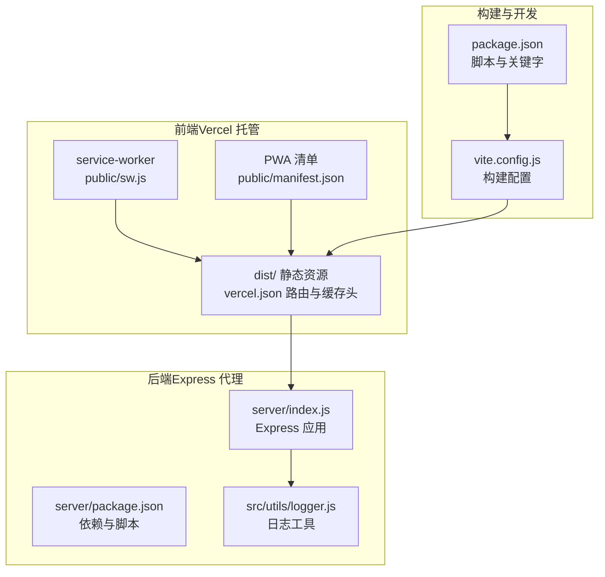
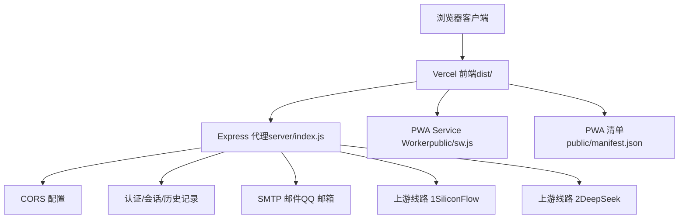
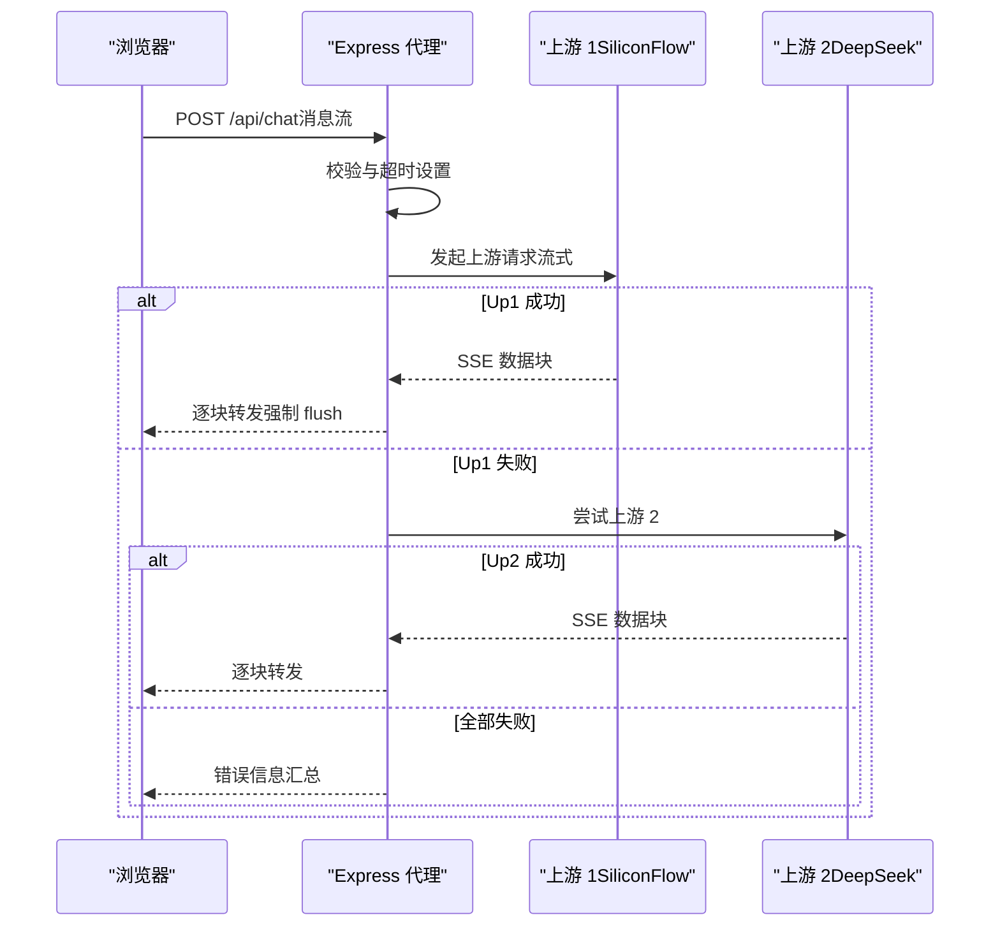
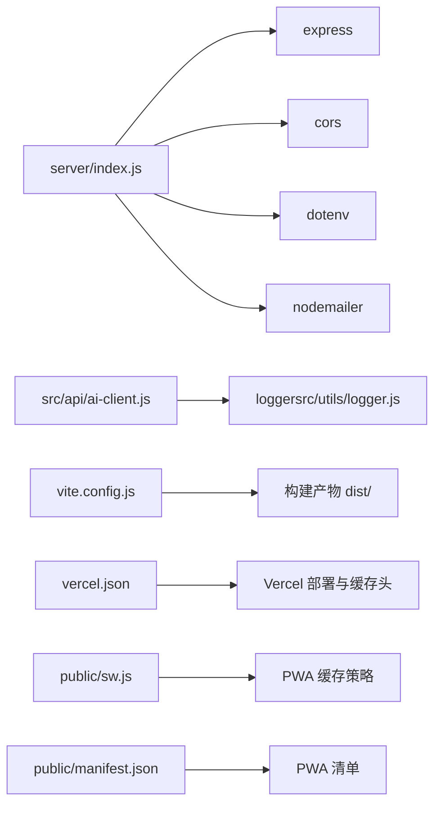

# 代理服务器部署

<cite>
**本文档引用的文件**
- [server/index.js](file://server/index.js)
- [server/package.json](file://server/package.json)
- [server/README.md](file://server/README.md)
- [package.json](file://package.json)
- [vercel.json](file://vercel.json)
- [vite.config.js](file://vite.config.js)
- [src/api/ai-client.js](file://src/api/ai-client.js)
- [src/utils/logger.js](file://src/utils/logger.js)
- [public/sw.js](file://public/sw.js)
- [public/manifest.json](file://public/manifest.json)
- [.gitignore](file://.gitignore)
</cite>

## 目录
1. [简介](#简介)
2. [项目结构](#项目结构)
3. [核心组件](#核心组件)
4. [架构总览](#架构总览)
5. [详细组件分析](#详细组件分析)
6. [依赖关系分析](#依赖关系分析)
7. [性能考虑](#性能考虑)
8. [故障排查指南](#故障排查指南)
9. [结论](#结论)
10. [附录](#附录)

## 简介
本指南面向代理服务器的部署与运维，覆盖 Express 服务器的部署配置、Node.js 环境与依赖安装、API 密钥与安全配置、CORS 跨域与请求转发、PM2 进程管理、Docker 容器化与 Kubernetes 编排、环境变量与日志监控、高可用与负载均衡策略，以及 SSL 证书与 HTTPS 设置。文档基于仓库现有实现进行总结与扩展，帮助您安全、稳定地将服务上线。

## 项目结构
该项目采用前后端分离架构：
- 前端部分位于根目录，使用 Vite 构建，产物输出至 dist/ 并托管于 Vercel。
- 后端代理服务位于 server/ 目录，基于 Express 提供认证、会话、历史记录与 AI 代理接口。
- PWA 相关资源位于 public/，包含 service worker 与 manifest。

图表来源
- [server/index.js:1-668](file://server/index.js#L1-L668)
- [server/package.json:1-18](file://server/package.json#L1-L18)
- [vercel.json:1-23](file://vercel.json#L1-L23)
- [vite.config.js:1-19](file://vite.config.js#L1-L19)
- [src/utils/logger.js:1-34](file://src/utils/logger.js#L1-L34)

章节来源
- [server/index.js:1-668](file://server/index.js#L1-L668)
- [server/package.json:1-18](file://server/package.json#L1-L18)
- [vercel.json:1-23](file://vercel.json#L1-L23)
- [vite.config.js:1-19](file://vite.config.js#L1-L19)
- [package.json:1-32](file://package.json#L1-L32)

## 核心组件
- Express 代理服务：提供健康检查、静态资源托管、CORS、会话与认证、历史记录、邮件验证码、以及核心的 AI 代理接口。
- 前端构建与 PWA：Vite 构建、去 crossOrigin 配置、service worker 网络优先策略与 PWA 清单。
- 环境变量与密钥：通过 .env 文件注入，支持 SMTP 邮件配置与多条上游线路密钥。
- 日志工具：轻量级分级日志，生产环境默认仅输出 warn 及以上级别。

章节来源
- [server/index.js:37-100](file://server/index.js#L37-L100)
- [server/index.js:102-242](file://server/index.js#L102-L242)
- [src/api/ai-client.js:12-25](file://src/api/ai-client.js#L12-L25)
- [src/utils/logger.js:8-31](file://src/utils/logger.js#L8-L31)

## 架构总览
后端代理服务作为统一入口，接收前端请求，根据配置选择上游模型服务，透传流式响应；同时提供认证、会话与历史记录能力。前端通过 Vercel 托管，PWA 提升离线体验与加载性能。

图表来源
- [server/index.js:66-78](file://server/index.js#L66-L78)
- [server/index.js:115-123](file://server/index.js#L115-L123)
- [server/index.js:43-56](file://server/index.js#L43-L56)
- [public/sw.js:1-45](file://public/sw.js#L1-L45)
- [public/manifest.json:1-22](file://public/manifest.json#L1-L22)

## 详细组件分析

### Express 服务器部署配置
- Node.js 环境与依赖
  - 使用模块化导入（ESM），需确保 Node.js 版本支持 import/export。
  - 依赖包括 express、cors、dotenv、nodemailer。
  - 启动脚本：npm start（生产）、npm run dev（开发监听）。
- 环境变量与密钥
  - .env 文件用于注入 API 密钥与 SMTP 配置；若不存在则直接使用系统环境变量。
  - 支持多条上游线路密钥（SiliconFlow、DeepSeek）。
- CORS 配置
  - 白名单允许无 origin 或指定域名（含子域名匹配）。
  - 支持凭据、指定方法与头部。
- 静态资源与 SPA 回退
  - 若存在 dist/，则托管静态资源并回退到 index.html。
- 健康检查
  - GET /health 返回状态与已配置线路列表。
- 会话与认证
  - 基于 Cookie 的会话，httpOnly + secure + sameSite lax，TTL 180 天。
  - 提供注册、登录、登出、当前会话查询、管理员统计、绑定邮箱、改密、验证码等接口。
- 邮件服务
  - 使用 QQ SMTP（host、port、secure、auth.user/pass）。
- 代理接口
  - POST /api/chat 透传上游 SSE，支持多线路自动降级与超时控制。

章节来源
- [server/index.js:20-35](file://server/index.js#L20-L35)
- [server/index.js:37-62](file://server/index.js#L37-L62)
- [server/index.js:66-78](file://server/index.js#L66-L78)
- [server/index.js:82-90](file://server/index.js#L82-L90)
- [server/index.js:92-100](file://server/index.js#L92-L100)
- [server/index.js:102-242](file://server/index.js#L102-L242)
- [server/index.js:115-123](file://server/index.js#L115-L123)
- [server/index.js:514-646](file://server/index.js#L514-L646)

### API 密钥管理与安全配置
- 密钥注入
  - 通过 .env 文件注入 SF_API_KEY、DS_API_KEY、ALLOWED_ORIGINS、SMTP_USER、SMTP_PASS 等。
  - .gitignore 排除 .env，避免泄露。
- 安全实践
  - 会话 Cookie 启用 httpOnly、secure、sameSite lax。
  - 允许来源白名单，支持子域名通配。
  - 用户名规范化与安全文件名校验，防止路径穿越。
  - 验证码防刷与尝试次数限制，SMTP 发送失败有错误处理。
- 建议
  - 生产环境务必使用 HTTPS 与安全 Cookie。
  - 密钥应通过环境变量注入，不在前端暴露。

章节来源
- [.gitignore:9-12](file://.gitignore#L9-L12)
- [server/index.js:20-35](file://server/index.js#L20-L35)
- [server/index.js:58-62](file://server/index.js#L58-L62)
- [server/index.js:225-242](file://server/index.js#L225-L242)
- [server/index.js:266-276](file://server/index.js#L266-L276)
- [server/index.js:422-451](file://server/index.js#L422-L451)

### CORS 跨域与请求转发机制
- CORS
  - origin 校验：允许无 origin 或白名单域名；支持子域名匹配。
  - credentials: true，允许携带 Cookie。
  - 允许方法与头部限定。
- 请求转发
  - /api/chat 采用流式 SSE，逐块转发上游响应。
  - 自动降级：多线路依次尝试，失败时继续下一个，最后汇总错误。
  - 超时控制：可配置上游超时时间，避免长时间占用连接。
  - 中断处理：客户端断开时中止上游请求。

图表来源
- [server/index.js:514-646](file://server/index.js#L514-L646)

章节来源
- [server/index.js:66-78](file://server/index.js#L66-L78)
- [server/index.js:514-646](file://server/index.js#L514-L646)

### PM2 进程管理与部署脚本
- 启动与守护
  - 使用 npm start 启动；建议结合 PM2 进行进程守护与自动重启。
  - 可配置日志输出路径与工作目录。
- 自动启动（macOS）
  - 提供 launchd plist 示例，设置 StandardOut/StandardError 路径。
- 建议
  - PM2 配置文件中设置 node 参数（如 --watch 仅开发使用）、日志轮转、异常重启策略。
  - 结合 systemd（Linux）或 Windows 服务（Windows）实现跨平台守护。

章节来源
- [server/README.md:44-75](file://server/README.md#L44-L75)
- [server/package.json:7-10](file://server/package.json#L7-L10)

### Docker 容器化部署方案
- 镜像构建
  - 基础镜像：官方 Node.js LTS（如 20-alpine）。
  - 工作目录：/app，复制 package*.json，执行 npm ci --only=production。
  - 复制 server/ 与 dist/（如已构建），设置启动命令 npm start。
  - 暴露端口：3210（可通过环境变量 PORT 覆盖）。
- 环境变量
  - 必填：SF_API_KEY、DS_API_KEY、ALLOWED_ORIGINS。
  - 可选：PORT、UPSTREAM_TIMEOUT_MS、SMTP_USER、SMTP_PASS。
- 健康检查
  - 使用 HTTP GET /health。
- 建议
  - 使用只读文件系统与最小权限。
  - 使用 docker-compose 管理服务与卷挂载（如日志目录）。

### Kubernetes 编排配置
- Deployment
  - replicas：至少 2（高可用）。
  - readinessProbe：HTTP GET /health。
  - livenessProbe：同上。
  - resources：设置 requests/limits。
- Service
  - ClusterIP 或 LoadBalancer（按集群类型）。
- ConfigMap/Secret
  - 密钥与敏感配置放入 Secret，其他配置放入 ConfigMap。
- Ingress
  - 配置 TLS 与域名路由（api.meihuayili.com）。
- HPA
  - CPU/自定义指标触发扩缩容。

### 环境变量管理、日志与监控
- 环境变量
  - .env 示例：SF_API_KEY、DS_API_KEY、ALLOWED_ORIGINS、PORT、UPSTREAM_TIMEOUT_MS、SMTP_USER、SMTP_PASS。
  - 前端代理开关：PROXY_BASE_URL 控制是否启用代理模式。
- 日志
  - src/utils/logger.js 提供 debug/info/warn/error 级别，生产默认仅 warn+。
  - 建议接入集中式日志（如 ELK、Loki）与结构化 JSON 输出。
- 监控
  - 指标：请求量、延迟、错误率、上游成功率。
  - 告警：超时率、错误率阈值、健康检查失败。
  - APM：可集成 OpenTelemetry 或第三方 APM。

章节来源
- [server/index.js:20-35](file://server/index.js#L20-L35)
- [src/api/ai-client.js:12-20](file://src/api/ai-client.js#L12-L20)
- [src/utils/logger.js:8-31](file://src/utils/logger.js#L8-L31)

### 负载均衡与高可用部署策略
- 多实例
  - 启动多个进程/容器实例，配合反向代理（Nginx、HAProxy、Cloudflare Tunnel）分发。
- 会话一致性
  - 使用共享存储（Redis/Memcached）或无状态设计（推荐）。
- 健康检查
  - 定期探测 /health，剔除不健康节点。
- 灰度发布
  - 逐步切流，观察指标与错误率。

### SSL 证书与 HTTPS 设置
- 本地开发
  - 使用自签名证书或 mkcert。
- 生产
  - 通过 Nginx/HAProxy/TLS 终止，或使用 Ingress TLS。
  - Cloudflare 作为反向代理时，可启用 SSL/TLS 与 HTTP/2/3。
- Cookie 安全
  - 确保 secure=true，SameSite 严格策略，HSTS 头部（如启用）。

## 依赖关系分析

图表来源
- [server/index.js:12-19](file://server/index.js#L12-L19)
- [server/package.json:11-16](file://server/package.json#L11-L16)
- [src/api/ai-client.js:8](file://src/api/ai-client.js#L8)
- [src/utils/logger.js:14-31](file://src/utils/logger.js#L14-L31)
- [vite.config.js:14-19](file://vite.config.js#L14-L19)
- [vercel.json:1-23](file://vercel.json#L1-L23)
- [public/sw.js:1-45](file://public/sw.js#L1-L45)
- [public/manifest.json:1-22](file://public/manifest.json#L1-L22)

章节来源
- [server/package.json:11-16](file://server/package.json#L11-L16)
- [src/api/ai-client.js:8](file://src/api/ai-client.js#L8)
- [src/utils/logger.js:14-31](file://src/utils/logger.js#L14-L31)
- [vite.config.js:14-19](file://vite.config.js#L14-L19)
- [vercel.json:1-23](file://vercel.json#L1-L23)
- [public/sw.js:1-45](file://public/sw.js#L1-L45)
- [public/manifest.json:1-22](file://public/manifest.json#L1-L22)

## 性能考虑
- 流式传输
  - 代理接口强制 flush，避免中间层缓存导致延迟。
- 超时与降级
  - 可配置上游超时，多线路自动降级提升可用性。
- 静态资源
  - dist/ 下静态资源开启长缓存（assets 30 天），HTML 等不缓存。
- PWA
  - service worker 网络优先策略减少重复下载，提升加载速度。
- 构建优化
  - 去除 crossorigin 避免微信浏览器跨域问题，模块预加载优化。

章节来源
- [server/index.js:527-533](file://server/index.js#L527-L533)
- [server/index.js:39](file://server/index.js#L39)
- [server/index.js:86-89](file://server/index.js#L86-L89)
- [public/sw.js:23-44](file://public/sw.js#L23-L44)
- [vite.config.js:4-12](file://vite.config.js#L4-L12)

## 故障排查指南
- 健康检查失败
  - 检查 /health 是否返回已配置线路列表；若为空，确认 .env 中密钥是否正确。
- CORS 报错
  - 确认 ALLOWED_ORIGINS 包含调用域名；浏览器无 origin 的场景可临时允许。
- 代理超时
  - 调整 UPSTREAM_TIMEOUT_MS；检查上游服务状态与网络连通性。
- 会话问题
  - 确认 Cookie 安全标志（secure、sameSite）与 HTTPS 环境；查看日志定位错误。
- 邮件发送失败
  - 检查 SMTP_USER/SMTP_PASS；确认 QQ 邮箱授权与安全设置。
- 前端代理模式
  - 确认 PROXY_BASE_URL 指向正确的 API 域名（如 api.meihuayili.com）。

章节来源
- [server/index.js:92-100](file://server/index.js#L92-L100)
- [server/index.js:58-62](file://server/index.js#L58-L62)
- [server/index.js:39](file://server/index.js#L39)
- [server/index.js:225-242](file://server/index.js#L225-L242)
- [server/index.js:115-123](file://server/index.js#L115-L123)
- [src/api/ai-client.js:12-20](file://src/api/ai-client.js#L12-L20)

## 结论
本指南基于现有代码实现了从环境准备、密钥与安全配置、CORS 与代理转发、进程管理与容器化/K8s 编排，到日志监控与高可用策略的完整部署路径。建议在生产环境中启用 HTTPS、严格的 CORS 与 Cookie 安全策略，并结合监控与告警体系保障服务稳定性与安全性。

## 附录
- 前端构建与部署
  - 使用 npm run build 生成 dist/，交由 Vercel 托管；vercel.json 设置缓存头。
- PWA 配置
  - public/sw.js 与 public/manifest.json 提供离线与安装体验。
- 开发与测试
  - 使用 npm run dev 进行本地开发，npm test 运行单元测试。

章节来源
- [package.json:5-14](file://package.json#L5-L14)
- [vercel.json:1-23](file://vercel.json#L1-L23)
- [public/sw.js:1-45](file://public/sw.js#L1-L45)
- [public/manifest.json:1-22](file://public/manifest.json#L1-L22)