# 环境配置管理

<cite>
**本文档引用的文件**
- [server/index.js](file://server/index.js)
- [server/package.json](file://server/package.json)
- [.gitignore](file://.gitignore)
- [vercel.json](file://vercel.json)
- [src/utils/logger.js](file://src/utils/logger.js)
- [jest.setup.js](file://jest.setup.js)
- [package.json](file://package.json)
- [vite.config.js](file://vite.config.js)
</cite>

## 目录
1. [项目概述](#项目概述)
2. [项目结构](#项目结构)
3. [核心组件](#核心组件)
4. [架构概览](#架构概览)
5. [详细组件分析](#详细组件分析)
6. [依赖关系分析](#依赖关系分析)
7. [性能考虑](#性能考虑)
8. [故障排除指南](#故障排除指南)
9. [结论](#结论)

## 项目概述

这是一个基于 Node.js 和前端技术栈的智能决策系统项目，主要包含一个代理服务器和前端应用。项目采用模块化设计，支持多环境配置管理。

## 项目结构

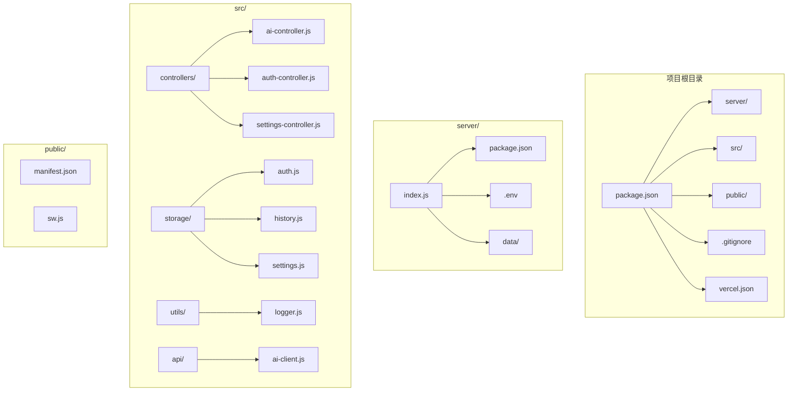

**图表来源**
- [server/index.js:1-668](file://server/index.js#L1-L668)
- [server/package.json:1-18](file://server/package.json#L1-L18)
- [.gitignore:1-14](file://.gitignore#L1-L14)
- [vercel.json:1-23](file://vercel.json#L1-L23)

**章节来源**
- [server/index.js:1-668](file://server/index.js#L1-L668)
- [server/package.json:1-18](file://server/package.json#L1-L18)
- [.gitignore:1-14](file://.gitignore#L1-L14)
- [vercel.json:1-23](file://vercel.json#L1-L23)

## 核心组件

### 代理服务器配置

项目的核心是位于 `server/` 目录下的 Node.js 代理服务器，它负责：

- **环境变量加载**：自动从 `.env` 文件加载配置
- **API 密钥管理**：安全地处理多个上游服务密钥
- **跨域配置**：灵活的 CORS 设置
- **健康检查**：提供 `/health` 端点监控服务状态

### 前端应用配置

前端应用通过 Vite 构建，支持：
- **开发环境**：热重载和调试功能
- **生产构建**：优化的打包和部署
- **环境变量**：通过 `import.meta.env` 访问

### 配置文件管理

项目采用多层次的配置管理策略：

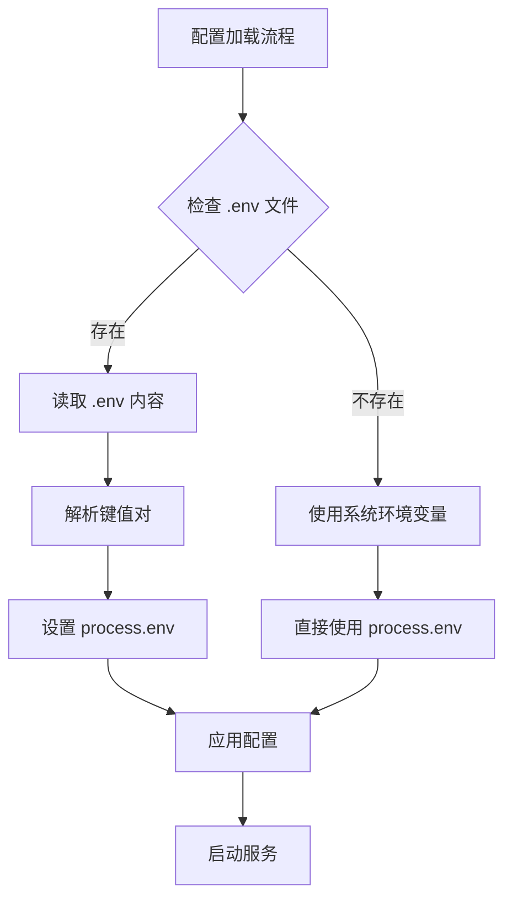

**图表来源**
- [server/index.js:20-35](file://server/index.js#L20-L35)

**章节来源**
- [server/index.js:20-35](file://server/index.js#L20-L35)
- [server/index.js:37-62](file://server/index.js#L37-L62)

## 架构概览

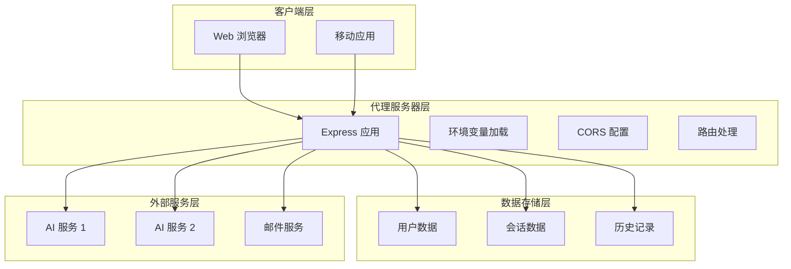

**图表来源**
- [server/index.js:64-668](file://server/index.js#L64-L668)

## 详细组件分析

### 环境变量管理系统

#### .env 文件结构

代理服务器实现了自定义的 `.env` 文件解析机制：

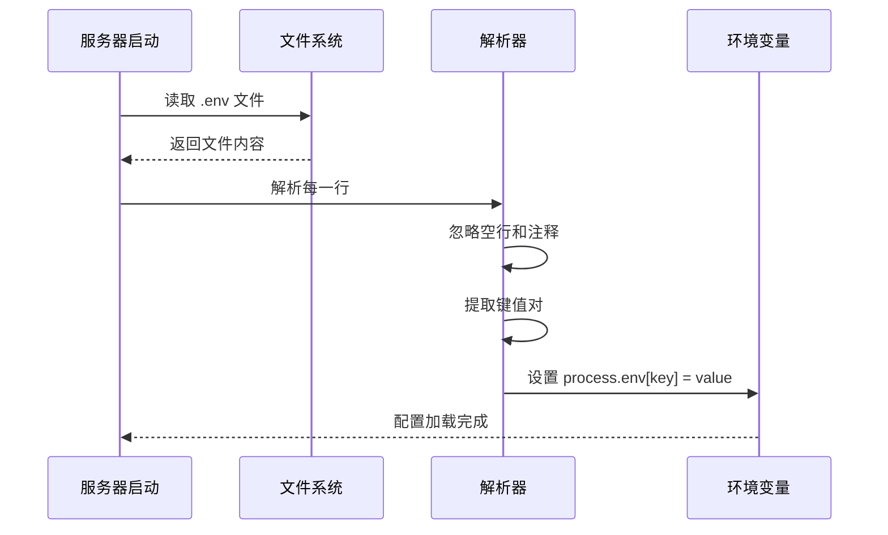

**图表来源**
- [server/index.js:20-35](file://server/index.js#L20-L35)

#### 支持的环境变量

| 变量名 | 类型 | 默认值 | 描述 |
|--------|------|--------|------|
| `PORT` | 数字 | 3210 | 服务器监听端口 |
| `UPSTREAM_TIMEOUT_MS` | 数字 | 120000 | 上游请求超时时间（毫秒） |
| `ALLOWED_ORIGINS` | 字符串 | `https://meihuayili.com,http://localhost:5173` | 允许访问的域名列表 |

#### 敏感信息保护机制

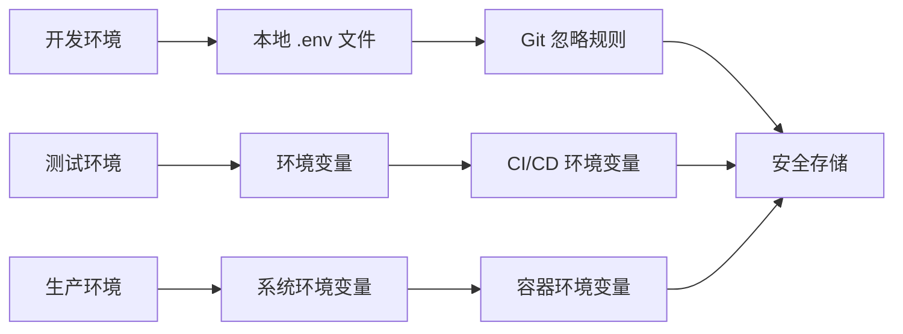

**图表来源**
- [.gitignore:9-14](file://.gitignore#L9-L14)

**章节来源**
- [server/index.js:20-35](file://server/index.js#L20-L35)
- [.gitignore:9-14](file://.gitignore#L9-L14)

### 配置验证和加载机制

#### 配置优先级

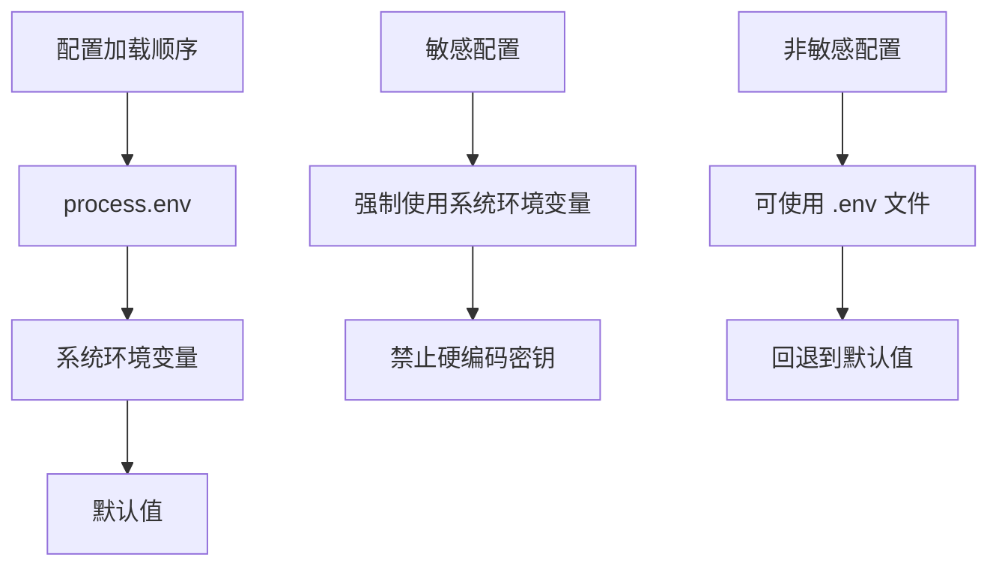

#### 错误处理

服务器实现了完善的错误处理机制：

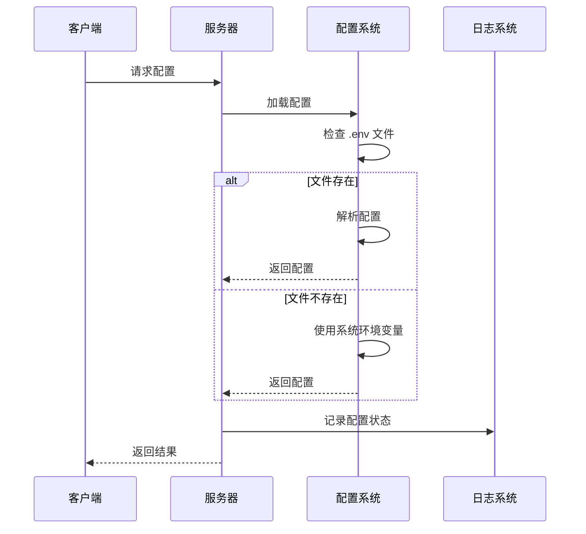

**图表来源**
- [server/index.js:20-35](file://server/index.js#L20-L35)

**章节来源**
- [server/index.js:20-35](file://server/index.js#L20-L35)

### 跨域配置管理

#### CORS 配置策略

服务器实现了灵活的跨域配置：

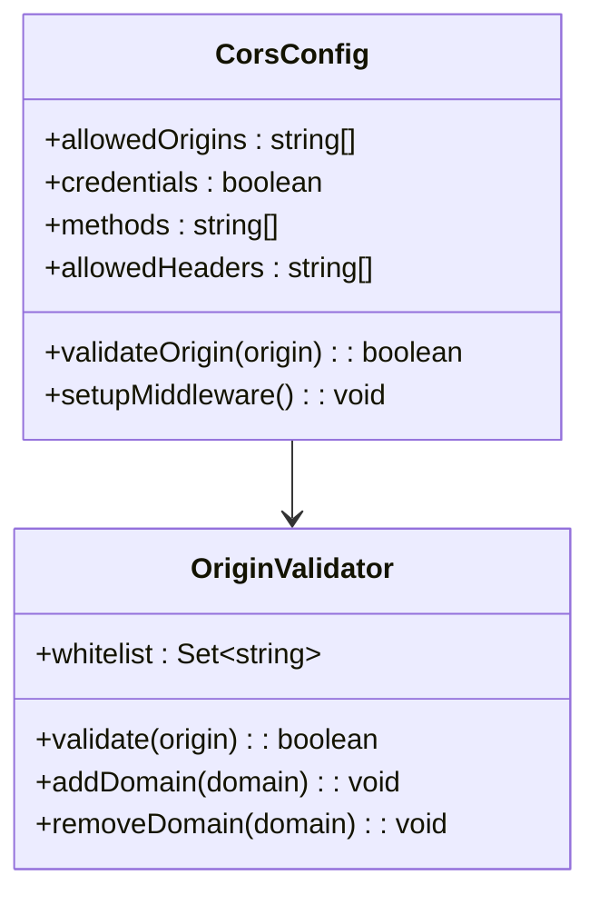

**图表来源**
- [server/index.js:66-78](file://server/index.js#L66-L78)

**章节来源**
- [server/index.js:66-78](file://server/index.js#L66-L78)

### 部署配置

#### Vercel 配置

项目使用 Vercel 进行部署，配置了缓存控制策略：

| 路径模式 | 缓存策略 | 目的 |
|----------|----------|------|
| `/sw.js` | `no-cache, no-store, must-revalidate` | 禁用 Service Worker 缓存 |
| `/index.html` | `no-cache, must-revalidate` | 禁用首页缓存 |
| `/` | `no-cache, must-revalidate` | 禁用根路径缓存 |

**章节来源**
- [vercel.json:1-23](file://vercel.json#L1-L23)

## 依赖关系分析

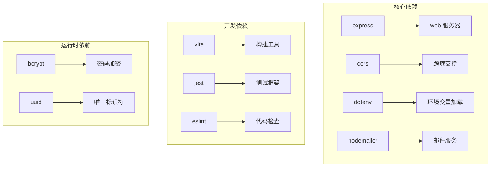

**图表来源**
- [server/package.json:11-16](file://server/package.json#L11-L16)
- [package.json:24-31](file://package.json#L24-L31)

**章节来源**
- [server/package.json:1-18](file://server/package.json#L1-L18)
- [package.json:1-32](file://package.json#L1-L32)

## 性能考虑

### 缓存策略

项目采用了多层缓存策略：

1. **静态资源缓存**：前端构建产物使用长期缓存策略
2. **API 响应缓存**：根据内容类型和变化频率进行缓存
3. **会话缓存**：用户会话数据的内存缓存

### 连接池管理

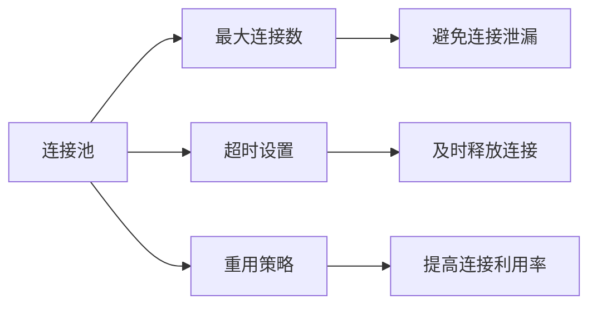

## 故障排除指南

### 常见配置问题

#### 环境变量加载失败

**症状**：服务器启动时报错，提示找不到必要的配置项

**解决方案**：
1. 检查 `.env` 文件是否存在且格式正确
2. 验证环境变量名称是否匹配
3. 确认系统环境变量已正确设置

#### CORS 配置错误

**症状**：前端请求被阻止，出现跨域错误

**解决方案**：
1. 检查 `ALLOWED_ORIGINS` 配置
2. 确认请求的域名在白名单中
3. 验证 CORS 中间件的配置

#### API 密钥配置问题

**症状**：代理请求失败，返回上游服务错误

**解决方案**：
1. 检查 AI 服务密钥是否正确配置
2. 验证密钥的有效性和权限
3. 确认网络连接正常

### 日志和监控

项目实现了分层的日志系统：

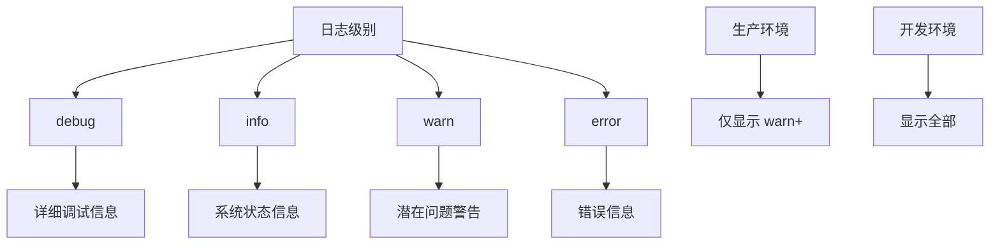

**图表来源**
- [src/utils/logger.js:1-33](file://src/utils/logger.js#L1-L33)

**章节来源**
- [src/utils/logger.js:1-33](file://src/utils/logger.js#L1-L33)

## 结论

本项目建立了完整的环境配置管理体系，通过以下关键特性确保配置的安全性和可靠性：

1. **多层配置加载**：支持从多种来源加载配置，包括文件、环境变量和系统配置
2. **安全的密钥管理**：通过 Git 忽略规则和系统环境变量保护敏感信息
3. **灵活的部署配置**：支持不同的部署环境和配置需求
4. **完善的错误处理**：提供详细的错误信息和故障排除指导
5. **性能优化**：采用合理的缓存策略和连接池管理

这套配置管理方案为项目的稳定运行和扩展提供了坚实的基础。