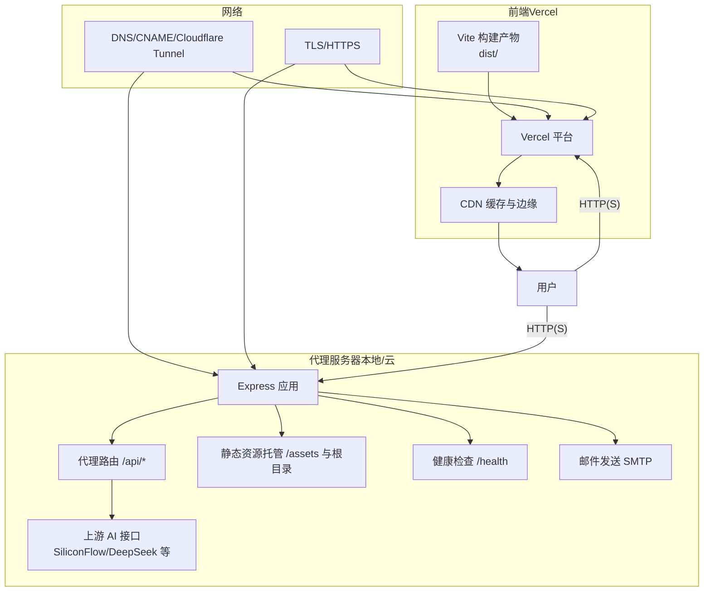
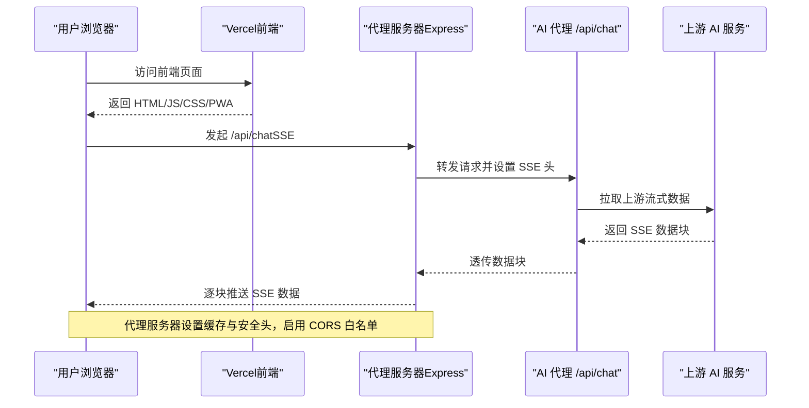
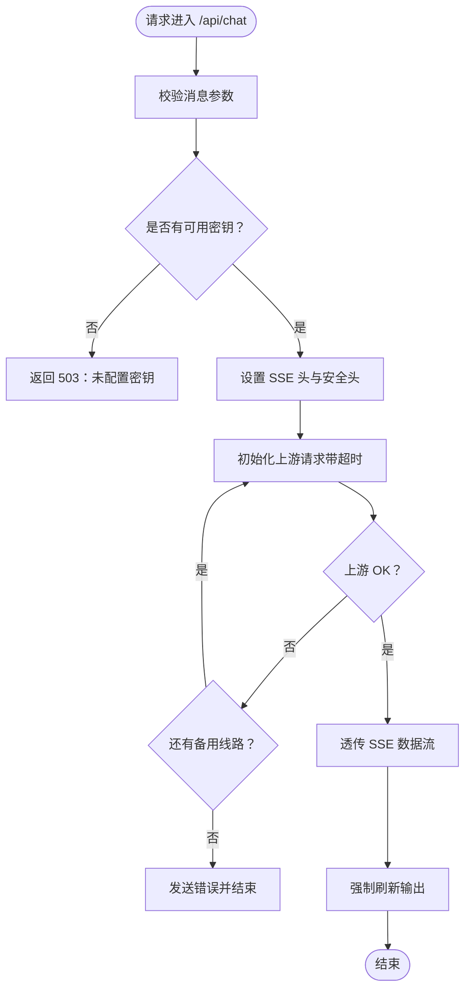
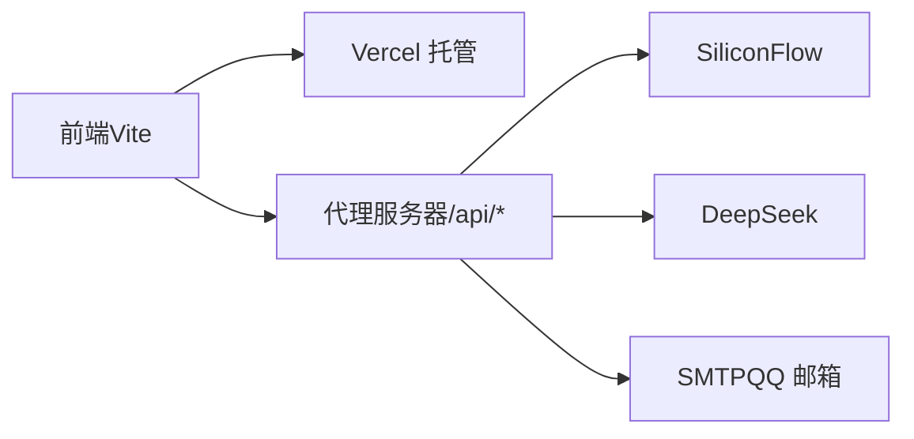

# 部署平台配置

<cite>
**本文引用的文件**
- [vercel.json](file://vercel.json)
- [package.json](file://package.json)
- [vite.config.js](file://vite.config.js)
- [server/index.js](file://server/index.js)
- [server/README.md](file://server/README.md)
- [public/manifest.json](file://public/manifest.json)
- [public/sw.js](file://public/sw.js)
- [src/storage/settings.js](file://src/storage/settings.js)
- [src/controllers/ai-controller.js](file://src/controllers/ai-controller.js)
</cite>

## 目录
1. [简介](#简介)
2. [项目结构](#项目结构)
3. [核心组件](#核心组件)
4. [架构总览](#架构总览)
5. [详细组件分析](#详细组件分析)
6. [依赖分析](#依赖分析)
7. [性能考虑](#性能考虑)
8. [故障排查指南](#故障排查指南)
9. [结论](#结论)
10. [附录](#附录)

## 简介
本指南面向部署平台配置，围绕 Vercel 静态站点部署、代理服务器部署、域名与 SSL、CDN 加速、环境变量与安全、以及部署后的监控与维护进行系统化说明。文档同时结合仓库现有配置文件与源码，给出可操作的步骤与最佳实践。

## 项目结构
该项目由前端静态资源与 PWA、代理服务器两部分组成：
- 前端静态站点与 PWA：通过 Vite 构建产物托管于 Vercel，包含 PWA 清单与 Service Worker。
- 代理服务器：Express 应用，负责托管前端静态资源、健康检查、会话与邮件、以及对接上游 AI 接口的代理能力，并通过 Cloudflare Tunnel 对外暴露。

图表来源
- [vercel.json:1-23](file://vercel.json#L1-L23)
- [server/index.js:82-90](file://server/index.js#L82-L90)
- [server/index.js:513-646](file://server/index.js#L513-L646)
- [server/README.md:79-98](file://server/README.md#L79-L98)

章节来源
- [vercel.json:1-23](file://vercel.json#L1-L23)
- [package.json:1-32](file://package.json#L1-L32)
- [vite.config.js:1-20](file://vite.config.js#L1-L20)
- [server/index.js:82-90](file://server/index.js#L82-L90)
- [server/index.js:513-646](file://server/index.js#L513-L646)
- [server/README.md:79-98](file://server/README.md#L79-L98)

## 核心组件
- Vercel 静态托管与缓存控制：通过 vercel.json 配置静态资源缓存策略与安全头。
- 前端构建与跨域处理：Vite 插件移除 crossorigin 属性，避免微信浏览器 CORS 问题。
- 代理服务器：Express 应用，提供健康检查、静态资源托管、CORS 白名单、会话 Cookie 安全策略、邮件发送、以及 AI 代理流式响应。
- PWA：manifest.json 与 sw.js 提供安装与离线缓存策略。
- 前端模型与密钥配置：前端 settings.js 提供模型注册与内置密钥占位，用于演示与临时方案。

章节来源
- [vercel.json:1-23](file://vercel.json#L1-L23)
- [vite.config.js:1-20](file://vite.config.js#L1-L20)
- [server/index.js:64-78](file://server/index.js#L64-L78)
- [server/index.js:82-90](file://server/index.js#L82-L90)
- [server/index.js:225-242](file://server/index.js#L225-L242)
- [public/manifest.json:1-22](file://public/manifest.json#L1-L22)
- [public/sw.js:1-45](file://public/sw.js#L1-L45)
- [src/storage/settings.js:1-86](file://src/storage/settings.js#L1-L86)

## 架构总览
下图展示了从用户访问到代理服务器再到上游 AI 的完整链路，以及 Vercel 托管的前端与代理服务器之间的协作关系。

图表来源
- [server/index.js:513-646](file://server/index.js#L513-L646)
- [server/index.js:66-78](file://server/index.js#L66-L78)
- [vercel.json:1-23](file://vercel.json#L1-L23)

章节来源
- [server/index.js:513-646](file://server/index.js#L513-L646)
- [server/index.js:66-78](file://server/index.js#L66-L78)
- [vercel.json:1-23](file://vercel.json#L1-L23)

## 详细组件分析

### Vercel 部署配置（vercel.json）
- 缓存控制：对 sw.js、index.html 与根路径设置 no-cache/no-store/must-revalidate，确保 PWA 更新与首页内容即时生效。
- 头部安全：通过 headers 数组为特定路径添加 Cache-Control，降低陈旧内容风险。
- 建议：如需 CDN 加速，可在 Vercel 控制台开启压缩与缓存策略；对于静态资源，建议配合指纹命名与长期缓存策略（由构建工具负责）。

章节来源
- [vercel.json:1-23](file://vercel.json#L1-L23)

### 前端构建与跨域处理（Vite）
- 插件移除 crossorigin：在构建阶段移除 HTML 中的 crossorigin 属性，避免微信浏览器的跨域限制引发的问题。
- 模块预加载：关闭 polyfill，减小体积并提升兼容性。

章节来源
- [vite.config.js:1-20](file://vite.config.js#L1-L20)

### 代理服务器（Express）
- CORS 白名单：仅允许指定域名访问，支持子域名匹配，保障跨域安全。
- 静态资源托管：assets 子目录长期缓存（30 天），其他静态文件不缓存，保证更新及时。
- 会话与 Cookie：httpOnly、secure、sameSite lax、180 天有效期，提升安全性。
- 健康检查：/health 返回服务状态与已配置上游线路列表。
- 邮件发送：使用 SMTP（QQ 邮箱）发送验证码邮件。
- AI 代理：SSE 流式响应，支持多线路自动降级与超时控制，强制 flush 避免中间层缓冲。
- SPA 回退：非 API 请求回退到 index.html，适配前端路由。

图表来源
- [server/index.js:513-646](file://server/index.js#L513-L646)

章节来源
- [server/index.js:66-78](file://server/index.js#L66-L78)
- [server/index.js:82-90](file://server/index.js#L82-L90)
- [server/index.js:225-242](file://server/index.js#L225-L242)
- [server/index.js:513-646](file://server/index.js#L513-L646)

### PWA 配置与 Service Worker
- 清单：定义应用名称、图标、启动路径与主题色。
- SW：对 shell 资源（/、/index.html）进行缓存；对 /api/ 与 /v1/ 请求不缓存；采用 network-first 策略，保证实时性。

章节来源
- [public/manifest.json:1-22](file://public/manifest.json#L1-L22)
- [public/sw.js:1-45](file://public/sw.js#L1-L45)

### 前端模型与密钥配置
- 模型注册：提供多模型与提供商映射，支持专业版与简化版模式切换。
- 内置密钥：settings.js 中提供内置密钥占位，便于演示；生产环境建议通过后端代理或环境变量管理。

章节来源
- [src/storage/settings.js:17-36](file://src/storage/settings.js#L17-L36)
- [src/storage/settings.js:5-7](file://src/storage/settings.js#L5-L7)

### 代理服务器部署与外网访问（Cloudflare Tunnel）
- 本地启动：安装依赖、配置 .env（含 API 密钥与白名单域名），启动后访问 /health 检查。
- 外网访问：通过 Cloudflare Tunnel 将 api.meihuayili.com 指向本地 3210 端口，实现安全穿透。
- 自动启动：可配置 launchd 使服务开机自启。

章节来源
- [server/README.md:7-38](file://server/README.md#L7-L38)
- [server/README.md:79-98](file://server/README.md#L79-L98)

## 依赖分析
- 前端构建依赖：Vite、Babel、ESLint、Jest 等，用于开发、构建、测试与质量保障。
- 代理服务器依赖：Express、CORS、dotenv、nodemailer，提供 Web 服务、跨域、环境变量与邮件功能。
- 代理服务器与上游接口：支持 SiliconFlow 与 DeepSeek 等多家上游，具备自动降级与超时控制。

图表来源
- [package.json:24-31](file://package.json#L24-L31)
- [server/package.json:11-16](file://server/package.json#L11-L16)
- [server/index.js:43-56](file://server/index.js#L43-L56)
- [server/index.js:115-123](file://server/index.js#L115-L123)

章节来源
- [package.json:24-31](file://package.json#L24-L31)
- [server/package.json:11-16](file://server/package.json#L11-L16)
- [server/index.js:43-56](file://server/index.js#L43-L56)
- [server/index.js:115-123](file://server/index.js#L115-L123)

## 性能考虑
- 静态资源缓存：assets 子目录长期缓存（30 天），其他文件不缓存，确保更新及时；Vercel 默认可进一步开启压缩与缓存策略。
- 构建体积：移除 crossorigin 属性减少冗余；模块预加载 polyfill 关闭，降低首包体积。
- 流式传输：代理服务器设置 X-Accel-Buffering=no、flush 输出，避免中间层缓冲导致延迟。
- PWA：SW 采用 network-first，关键资源（shell）离线可用，提升首屏与离线体验。

章节来源
- [server/index.js:87-89](file://server/index.js#L87-L89)
- [vite.config.js:14-19](file://vite.config.js#L14-L19)
- [server/index.js:528-533](file://server/index.js#L528-L533)
- [public/sw.js:31-43](file://public/sw.js#L31-L43)

## 故障排查指南
- 健康检查：访问 /health 确认服务状态与已配置线路。
- CORS 错误：检查 ALLOWED_ORIGINS 是否包含当前域名；代理服务器对无 Origin 或白名单域名放行。
- 代理超时：UPSTREAM_TIMEOUT_MS 默认 120000ms，可根据网络状况调整；多线路自动降级。
- 邮件发送失败：检查 SMTP_USER/SMTP_PASS 与 QQ 邮箱授权设置。
- PWA 缓存问题：sw.js 对 /api/ 与 /v1/ 不缓存，确保实时性；shell 资源缓存可更新版本号。
- Vercel 缓存：vercel.json 对 sw.js 与 index.html 设置 no-cache，确保更新生效。

章节来源
- [server/index.js:93-100](file://server/index.js#L93-L100)
- [server/index.js:59-61](file://server/index.js#L59-L61)
- [server/index.js:39-40](file://server/index.js#L39-L40)
- [server/index.js:115-123](file://server/index.js#L115-L123)
- [public/sw.js:26-29](file://public/sw.js#L26-L29)
- [vercel.json:4-20](file://vercel.json#L4-L20)

## 结论
本项目采用“前端静态 + 代理服务器”的混合部署架构：前端通过 Vercel 快速分发与缓存，代理服务器负责安全、会话、邮件与 AI 代理能力，并通过 Cloudflare Tunnel 实现安全外网访问。结合合理的缓存策略、SSE 流式传输与 PWA，可在保证安全性的同时获得良好的用户体验。建议在生产环境中强化环境变量管理、域名与 SSL 配置，并建立持续监控与日志审计机制。

## 附录

### Vercel 部署步骤与最佳实践
- 构建与预览：使用 npm run build 生成 dist/，本地预览 npm run preview。
- vercel.json：确保 headers 与缓存策略符合业务需求。
- 环境变量：在 Vercel 控制台设置环境变量（如前端模型密钥占位），避免硬编码。
- 域名与 CNAME：在 DNS 中为 www.meihuayili.com 配置 CNAME 指向 Vercel。
- CDN 与压缩：在 Vercel 控制台开启压缩与缓存策略，提升加载速度。

章节来源
- [package.json:5-13](file://package.json#L5-L13)
- [vercel.json:1-23](file://vercel.json#L1-L23)

### 代理服务器部署与配置要点
- 本地启动：安装依赖、复制 .env.example 为 .env、填写密钥与白名单域名，启动后访问 /health。
- 外网访问：使用 Cloudflare Tunnel 将 api.meihuayili.com 指向本地 3210 端口。
- 自动启动：配置 launchd 使服务开机自启。
- 安全：CORS 白名单、Cookie 安全标志、会话有效期与邮件 SMTP 配置。

章节来源
- [server/README.md:7-38](file://server/README.md#L7-L38)
- [server/README.md:79-98](file://server/README.md#L79-L98)
- [server/index.js:59-61](file://server/index.js#L59-L61)
- [server/index.js:225-242](file://server/index.js#L225-L242)
- [server/index.js:115-123](file://server/index.js#L115-L123)

### 域名绑定、SSL 与 CDN 加速
- 域名绑定：Vercel 与代理服务器分别配置域名与 DNS 记录；代理服务器通过 Cloudflare Tunnel 对外暴露。
- SSL 证书：Vercel 与 Cloudflare 均提供自动证书与 HTTPS；确保全站 HTTPS。
- CDN 加速：Vercel 边缘节点与浏览器缓存策略配合使用，assets 长缓存、其他资源短缓存或不缓存。

章节来源
- [vercel.json:1-23](file://vercel.json#L1-L23)
- [server/README.md:79-98](file://server/README.md#L79-L98)

### 环境变量管理与安全配置
- 前端：settings.js 中的内置密钥仅用于演示，生产环境建议通过后端代理或 Vercel 环境变量管理。
- 代理服务器：通过 dotenv 与系统环境变量加载密钥与白名单；敏感信息不暴露在客户端。
- Cookie：httpOnly、secure、sameSite lax、180 天有效期，降低 XSS 与 CSRF 风险。

章节来源
- [src/storage/settings.js:5-7](file://src/storage/settings.js#L5-L7)
- [server/index.js:21-35](file://server/index.js#L21-L35)
- [server/index.js:225-242](file://server/index.js#L225-L242)

### 部署后的监控与维护
- 健康检查：定期访问 /health，观察服务状态与已配置线路。
- 日志：代理服务器输出关键事件日志，结合 launchd 标准输出/错误日志定位问题。
- 性能：关注构建体积、CDN 缓存命中率与 SSE 响应延迟；必要时调整缓存策略与上游线路。

章节来源
- [server/index.js:93-100](file://server/index.js#L93-L100)
- [server/README.md:44-75](file://server/README.md#L44-L75)