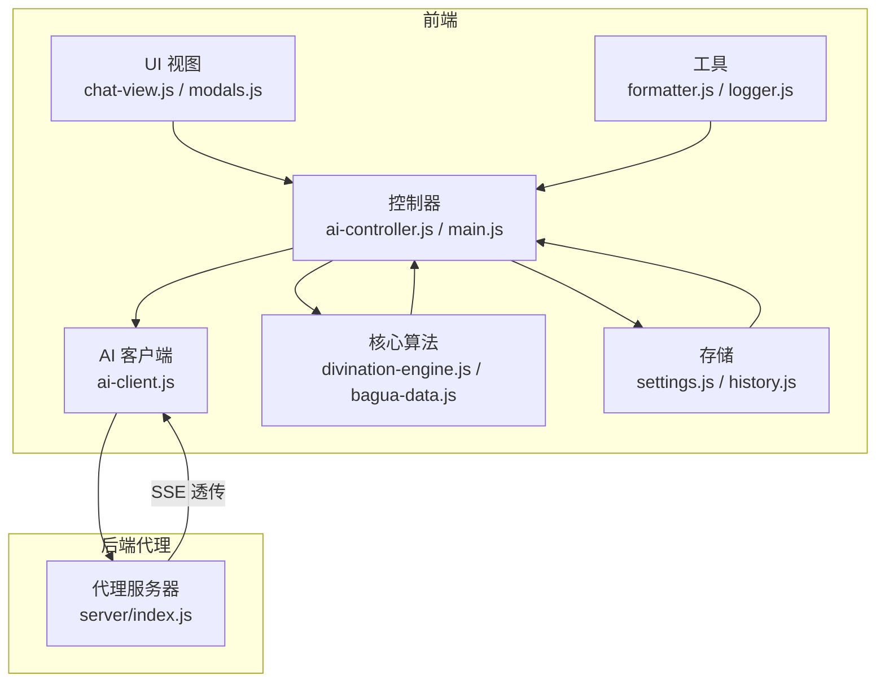
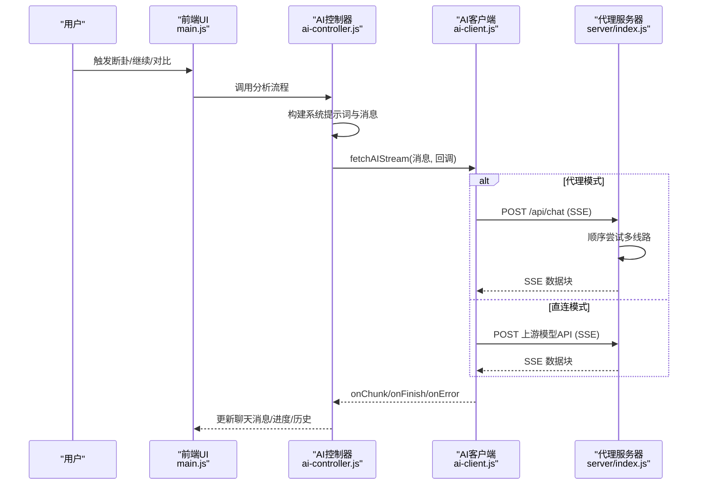
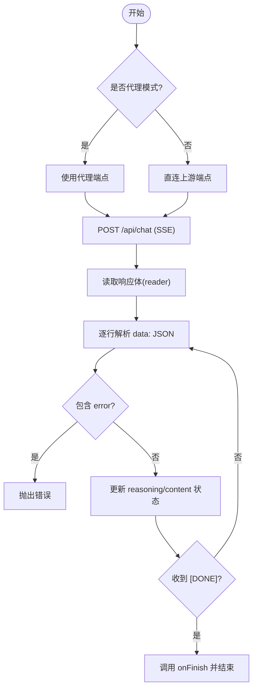
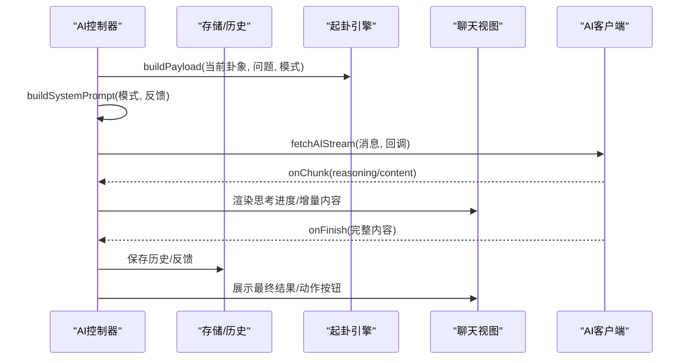
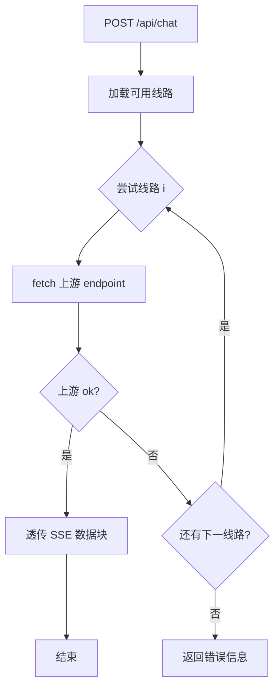
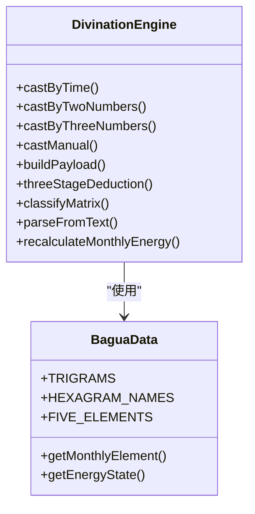
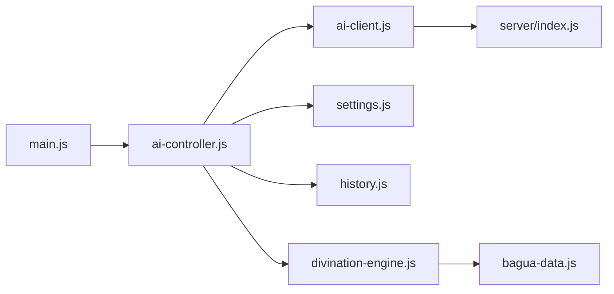

# AI分析系统

<cite>
**本文档引用的文件**
- [src/api/ai-client.js](file://src/api/ai-client.js)
- [src/controllers/ai-controller.js](file://src/controllers/ai-controller.js)
- [server/index.js](file://server/index.js)
- [src/storage/settings.js](file://src/storage/settings.js)
- [src/core/divination-engine.js](file://src/core/divination-engine.js)
- [src/ui/chat-view.js](file://src/ui/chat-view.js)
- [src/main.js](file://src/main.js)
- [src/controllers/state.js](file://src/controllers/state.js)
- [src/utils/logger.js](file://src/utils/logger.js)
- [src/utils/formatter.js](file://src/utils/formatter.js)
- [src/storage/history.js](file://src/storage/history.js)
- [src/ui/modals.js](file://src/ui/modals.js)
- [src/core/bagua-data.js](file://src/core/bagua-data.js)
- [package.json](file://package.json)
- [index.html](file://index.html)
</cite>

## 目录
1. [简介](#简介)
2. [项目结构](#项目结构)
3. [核心组件](#核心组件)
4. [架构总览](#架构总览)
5. [详细组件分析](#详细组件分析)
6. [依赖关系分析](#依赖关系分析)
7. [性能考量](#性能考量)
8. [故障排查指南](#故障排查指南)
9. [结论](#结论)
10. [附录](#附录)

## 简介
本项目是一个融合古典《周易》与现代AI的智能断卦系统，提供从起卦、卦象分析到AI推理输出的完整链路。系统采用前后端分离架构：前端负责交互与流式渲染，后端提供代理与多模型路由能力，并内置起卦引擎与提示词系统，支持简化版与专业版两种分析模式，以及模型切换、对比分析、历史记录与反馈学习等功能。

## 项目结构
项目采用模块化组织，核心目录与职责如下：
- server：代理服务器，负责API密钥托管、多线路路由与SSE透传
- src/api：AI客户端封装，提供流式SSE解析、重试与超时控制
- src/controllers：业务控制器，协调AI分析、上下文管理、历史与反馈
- src/core：核心算法与数据，包括起卦引擎、干支历、五行能量
- src/storage：配置与历史存储，含设置、历史、反馈与云端同步
- src/ui：视图与交互，聊天消息、双列对比布局、模态框
- src/utils：工具库，日志、格式化、DOM辅助
- public：静态资源与PWA清单
- 根目录：构建配置、脚本与入口页面

图表来源
- [src/main.js:167-249](file://src/main.js#L167-L249)
- [src/controllers/ai-controller.js:24-112](file://src/controllers/ai-controller.js#L24-L112)
- [src/api/ai-client.js:31-76](file://src/api/ai-client.js#L31-L76)
- [server/index.js:513-646](file://server/index.js#L513-L646)

章节来源
- [package.json:1-32](file://package.json#L1-L32)
- [index.html:1-800](file://index.html#L1-L800)

## 核心组件
- AI客户端与流式SSE解析：封装fetch、超时控制、自动重试、分块解析与错误处理，支持代理模式与直连模式
- AI控制器：统一调度分析流程，管理上下文、权限与配额、模型选择与对比、历史与反馈学习注入
- 代理服务器：多线路路由、SSE透传、健康检查、CORS与会话管理
- 起卦引擎：时间/报数/手动起卦，三卦联动与体用判定，月令能量校准
- 存储与历史：本地localStorage与云端同步，反馈学习与配额控制
- UI与交互：聊天消息、双列对比、模态框、导出与主题切换

章节来源
- [src/api/ai-client.js:31-185](file://src/api/ai-client.js#L31-L185)
- [src/controllers/ai-controller.js:24-733](file://src/controllers/ai-controller.js#L24-L733)
- [server/index.js:513-646](file://server/index.js#L513-L646)
- [src/core/divination-engine.js:297-433](file://src/core/divination-engine.js#L297-L433)
- [src/storage/history.js:15-143](file://src/storage/history.js#L15-L143)

## 架构总览
系统采用“前端流式渲染 + 后端代理”的架构。前端通过AI客户端发起SSE请求，后端代理按顺序尝试多条上游线路，将远端SSE流式透传给前端。AI控制器负责构建系统提示词、上下文与消息序列，并在流式接收过程中实时渲染。

图表来源
- [src/main.js:526-542](file://src/main.js#L526-L542)
- [src/controllers/ai-controller.js:203-524](file://src/controllers/ai-controller.js#L203-L524)
- [src/api/ai-client.js:31-185](file://src/api/ai-client.js#L31-L185)
- [server/index.js:513-646](file://server/index.js#L513-L646)

## 详细组件分析

### AI客户端与流式SSE解析
- 功能要点
  - 代理模式开关：通过配置决定走代理还是直连上游
  - 超时控制：基于AbortController与信号合并，支持用户取消
  - 自动重试：指数退避与最大重试次数，区分超时与认证错误
  - SSE解析：逐行解析data: JSON块，兼容非流式返回场景
  - 分块回调：分别处理推理内容(reasoning)与最终回复(content)，并合并prefix
- 错误处理
  - 超时：抛出特定提示，便于UI引导“继续”接续
  - 认证错误：不重试，直接上报
  - 网络抖动：在控制器侧自动续传
- 性能特性
  - 流式解码，边到边显
  - 严格超时与信号合并，避免悬挂请求

图表来源
- [src/api/ai-client.js:78-184](file://src/api/ai-client.js#L78-L184)

章节来源
- [src/api/ai-client.js:31-185](file://src/api/ai-client.js#L31-L185)

### AI控制器：业务逻辑与上下文管理
- 分析流程
  - 权限与配额：区分游客/普通/付费用户，付费用户可切换模型
  - 模型选择：根据权限与历史状态选择主线/备线/增强模型
  - 系统提示词：构建核心逻辑、反馈学习注入与输出格式约束
  - 消息构建：system + user(JSON载荷) + assistant(流式增量)
  - 流式渲染：思考进度条、思维阶段与最终内容渲染
  - 历史与反馈：自动保存、云端合并、反馈学习
- 对比分析
  - 模型切换时，将上次分析结果包装为双列布局，左右分别为新旧模型输出
- 继续分析
  - 保存中断上下文，支持“继续”接续，自动追加续传指令

图表来源
- [src/controllers/ai-controller.js:24-112](file://src/controllers/ai-controller.js#L24-L112)
- [src/controllers/ai-controller.js:203-524](file://src/controllers/ai-controller.js#L203-L524)
- [src/core/divination-engine.js:297-346](file://src/core/divination-engine.js#L297-L346)

章节来源
- [src/controllers/ai-controller.js:24-733](file://src/controllers/ai-controller.js#L24-L733)
- [src/ui/chat-view.js:44-75](file://src/ui/chat-view.js#L44-L75)

### 代理服务器：多模型路由与SSE透传
- 多线路配置：主线(SiliconFlow DeepSeek R1)、备线(DeepSeek官方)
- 路由策略：顺序尝试，遇错自动降级，最终返回错误信息
- SSE透传：设置标准SSE响应头，逐块转发，强制flush避免中间层缓存
- CORS与会话：白名单来源、Cookie会话、健康检查
- 安全与运维：.env加载密钥、限制缓存、X-Accel-Buffering关闭缓冲

图表来源
- [server/index.js:513-646](file://server/index.js#L513-L646)

章节来源
- [server/index.js:37-62](file://server/index.js#L37-L62)
- [server/index.js:513-646](file://server/index.js#L513-L646)

### 起卦引擎与提示词设计
- 起卦模式：时间/报数/手动，统一生成本卦、变卦、对卦与体用关系
- 月令能量：基于干支历节气，对体用关系进行旺衰修正
- 提示词设计
  - 共享内核：简化版与专业版共享断卦逻辑，结论一致性约束
  - 术语禁用：简化版禁止术语，必须翻译为白话
  - 输出格式：简化版与专业版分别定义Markdown结构
  - 反馈学习：注入历史案例与用户纠偏，持续迭代

图表来源
- [src/core/divination-engine.js:23-433](file://src/core/divination-engine.js#L23-L433)
- [src/core/bagua-data.js:8-136](file://src/core/bagua-data.js#L8-L136)

章节来源
- [src/core/divination-engine.js:297-433](file://src/core/divination-engine.js#L297-L433)
- [src/controllers/ai-controller.js:526-733](file://src/controllers/ai-controller.js#L526-L733)

### 存储与历史：本地+云端同步
- 本地存储：历史记录与反馈，容量不足时自动裁剪
- 云端同步：登录后异步合并云端历史，去重并按时间排序
- 历史上限：本地最多保留固定数量，避免溢出

章节来源
- [src/storage/history.js:15-143](file://src/storage/history.js#L15-L143)

### UI与交互：聊天视图与双列对比
- 聊天消息：支持Markdown渲染、动作按钮、导出与新起一卦
- 双列对比：将上次分析与当前分析并排展示，便于模型对比
- 模态框：登录/设置/日期澄清等弹窗管理

章节来源
- [src/ui/chat-view.js:7-114](file://src/ui/chat-view.js#L7-L114)
- [src/ui/modals.js:11-57](file://src/ui/modals.js#L11-L57)

## 依赖关系分析
- 前端依赖
  - 控制器依赖：状态(state)、设置(settings)、历史(history)、格式化(formatter)、日志(logger)
  - 核心依赖：起卦引擎、UI视图
- 后端依赖
  - Express、CORS、Nodemailer、Crypto、FS、Path
  - .env密钥加载、会话管理、历史同步API

图表来源
- [src/main.js:23-46](file://src/main.js#L23-L46)
- [src/controllers/ai-controller.js:5-16](file://src/controllers/ai-controller.js#L5-L16)
- [src/api/ai-client.js:8](file://src/api/ai-client.js#L8)
- [server/index.js:12-35](file://server/index.js#L12-L35)

章节来源
- [src/main.js:167-249](file://src/main.js#L167-L249)
- [server/index.js:12-35](file://server/index.js#L12-L35)

## 性能考量
- 流式渲染：前端即时显示，降低感知延迟
- 代理透传：后端逐块转发，避免中间层缓存导致的延迟
- 超时与重试：合理设置超时与退避，提升网络抖动下的稳定性
- 存储裁剪：历史与反馈自动裁剪，避免存储溢出
- 主题与图标：懒加载与一次性初始化，减少首屏负担

## 故障排查指南
- 代理模式错误
  - 症状：提示“解析服务器繁忙/接口调用异常”，建议“当前为代理模式，请稍后重试”
  - 处理：检查代理健康状态与上游密钥配置
- 直连模式错误
  - 症状：提示“请在设置中配置 API Key”
  - 处理：在设置中填写对应提供商的密钥
- 网络抖动自动续传
  - 症状：网络波动后自动“继续”接续
  - 处理：无需人工干预，系统已记录中断上下文
- 存储空间不足
  - 症状：保存失败或提示“存储空间不足”
  - 处理：清理旧卦例后重试

章节来源
- [src/controllers/ai-controller.js:478-522](file://src/controllers/ai-controller.js#L478-L522)
- [src/storage/history.js:32-44](file://src/storage/history.js#L32-L44)

## 结论
本系统通过“前端流式渲染 + 后端代理”的架构，实现了稳定、可扩展的AI断卦体验。其核心优势在于：
- 严谨的提示词设计与反馈学习机制，保证结论一致性与持续优化
- 多模型与多线路路由，兼顾性能与可靠性
- 完整的上下文管理与历史/反馈闭环，支持模型对比与用户迭代
- 良好的错误处理与自动续传，提升用户体验

## 附录

### API接口文档（代理服务器）
- 健康检查
  - 方法：GET
  - 路径：/health
  - 成功响应：包含状态与已配置线路列表
- 主代理接口（SSE）
  - 方法：POST
  - 路径：/api/chat
  - 请求体字段：
    - messages: 数组，系统与用户消息
    - model: 字符串，模型标识（由代理内部配置决定）
  - 响应：text/event-stream，逐块返回choices.delta或错误对象
  - 错误码：503（未配置密钥）、上游HTTP错误、超时
- 历史接口（云端同步）
  - 保存：POST /api/history/save
  - 读取：GET /api/history/load?username={name}

章节来源
- [server/index.js:92-100](file://server/index.js#L92-L100)
- [server/index.js:513-646](file://server/index.js#L513-L646)
- [src/storage/history.js:64-102](file://src/storage/history.js#L64-L102)

### 使用示例与最佳实践
- 配置代理与密钥
  - 在代理服务器中设置.env，配置多线路密钥
  - 前端通过PROXY_ENDPOINT启用代理模式
- 起卦与断卦
  - 输入问题后触发断卦，系统自动构建payload与提示词
  - 付费用户可切换模型，普通用户固定主线
- 模型对比
  - 切换模型后自动触发对比分析，双列展示结果
- 继续分析
  - 遇到超时或网络波动时，点击“继续”自动接续
- 导出与分享
  - 支持导出断卦纪要，自动规范化标题与列表格式

章节来源
- [src/main.js:526-542](file://src/main.js#L526-L542)
- [src/main.js:427-498](file://src/main.js#L427-L498)
- [src/controllers/ai-controller.js:114-161](file://src/controllers/ai-controller.js#L114-L161)