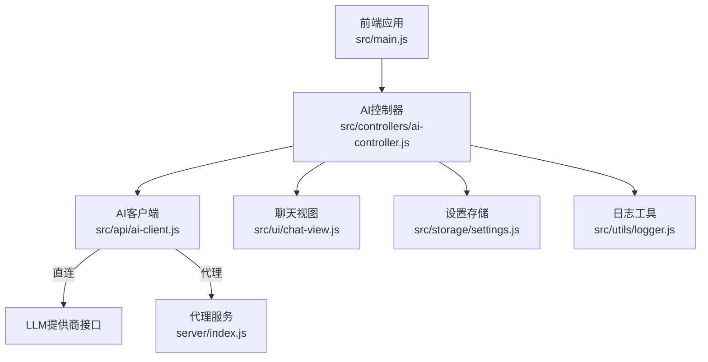
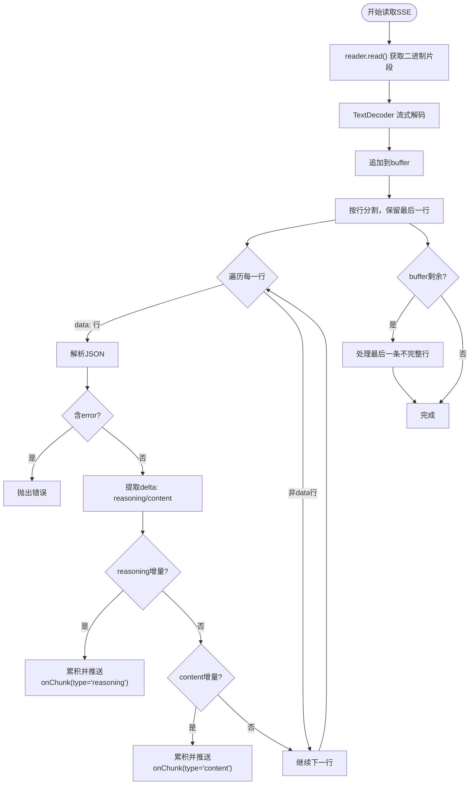
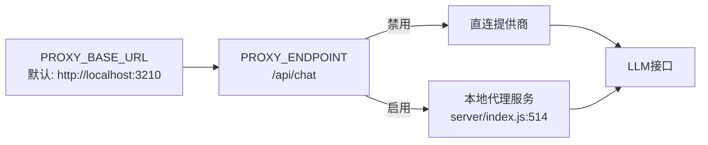
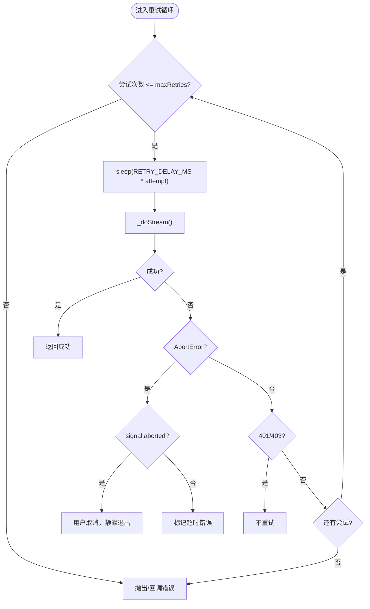
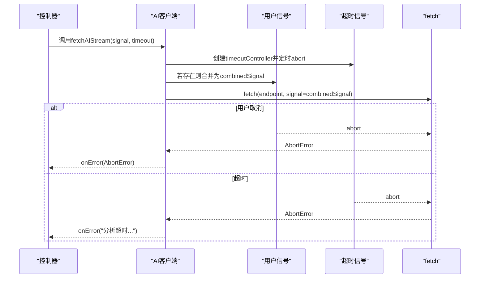
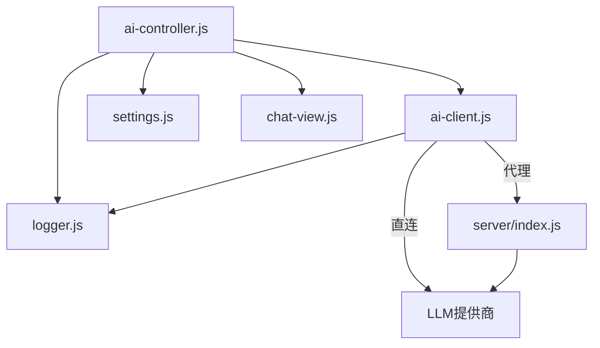

# AI客户端

<cite>
**本文引用的文件列表**
- [ai-client.js](file://src/api/ai-client.js)
- [ai-controller.js](file://src/controllers/ai-controller.js)
- [settings.js](file://src/storage/settings.js)
- [chat-view.js](file://src/ui/chat-view.js)
- [logger.js](file://src/utils/logger.js)
- [main.js](file://src/main.js)
- [index.js](file://server/index.js)
- [README.md](file://server/README.md)
- [package.json](file://package.json)
</cite>

## 更新摘要
**变更内容**
- 更新了代理服务器配置部分，反映PROXY_BASE_URL现在默认指向localhost:3210
- 新增了本地开发环境代理服务器配置说明
- 移除了云部署配置的相关描述
- 更新了代理模式与直连模式的配置指南

## 目录
1. [简介](#简介)
2. [项目结构](#项目结构)
3. [核心组件](#核心组件)
4. [架构总览](#架构总览)
5. [详细组件分析](#详细组件分析)
6. [依赖关系分析](#依赖关系分析)
7. [性能考量](#性能考量)
8. [故障排查指南](#故障排查指南)
9. [结论](#结论)
10. [附录](#附录)

## 简介
本文件面向开发者，系统性梳理AI客户端模块的设计与实现，重点覆盖以下方面：
- 流式响应处理机制：SSE数据解析、增量内容接收、缓冲区管理
- 代理模式与直连模式：PROXY_BASE_URL配置、密钥安全传输、网络路由策略
- 重试机制：自动重试逻辑、延迟策略、错误分类处理
- 超时控制：AbortController集成、信号合并、用户中断检测
- API接口规范：fetchAIStream参数、回调、错误处理
- 实际使用示例与最佳实践

## 项目结构
AI客户端位于前端src/api目录，控制器位于src/controllers，代理服务位于server目录。整体采用"前端流式消费 + 控制器编排 + 代理服务转发"的三层协作模式。

**图表来源**
- [main.js:526-536](file://src/main.js#L526-L536)
- [ai-controller.js:203-524](file://src/controllers/ai-controller.js#L203-L524)
- [ai-client.js:31-76](file://src/api/ai-client.js#L31-L76)
- [index.js:514-646](file://server/index.js#L514-L646)

**章节来源**
- [package.json:1-32](file://package.json#L1-L32)
- [main.js:526-536](file://src/main.js#L526-L536)

## 核心组件
- 流式客户端：负责构建请求、处理SSE、解析增量内容、管理超时与重试
- 控制器：编排对话、渲染UI、处理中断与续传、持久化历史
- 代理服务：统一转发SSE、多路备用、超时控制、防中间层缓存
- 设置与视图：模型配置、消息渲染、滚动与布局

**章节来源**
- [ai-client.js:31-184](file://src/api/ai-client.js#L31-L184)
- [ai-controller.js:203-524](file://src/controllers/ai-controller.js#L203-L524)
- [index.js:514-646](file://server/index.js#L514-L646)
- [settings.js:17-86](file://src/storage/settings.js#L17-L86)
- [chat-view.js:7-114](file://src/ui/chat-view.js#L7-L114)

## 架构总览
前端通过控制器调用AI客户端发起流式请求。若启用代理模式，则请求转发至代理服务；否则直接调用LLM提供商接口。代理服务按顺序尝试多条上游线路，实时透传SSE数据，同时强制flush避免中间层缓存。

```mermaid
sequenceDiagram
participant U as "用户"
participant C as "AI控制器"
participant A as "AI客户端"
participant P as "代理服务"
participant L as "LLM提供商"
U->>C : 触发分析
C->>A : fetchAIStream(params, callbacks)
alt 代理模式
A->>P : POST /api/chat (SSE)
P->>L : 转发请求逐路尝试
L-->>P : SSE数据块
P-->>A : SSE数据块逐块透传
else 直连模式
A->>L : POST /chat/completions (SSE)
L-->>A : SSE数据块
end
A-->>C : onChunk(增量内容)
A-->>C : onFinish(完整内容)
C-->>U : 渲染结果/历史保存
```

**图表来源**
- [ai-client.js:78-184](file://src/api/ai-client.js#L78-L184)
- [ai-controller.js:283-524](file://src/controllers/ai-controller.js#L283-L524)
- [index.js:514-646](file://server/index.js#L514-L646)

## 详细组件分析

### 流式响应处理机制（SSE解析、增量接收、缓冲区管理）
- SSE解析：逐行解析data:开头的数据行，跳过非data行与[DONE]标记，解析JSON并提取choices.delta中的reasoning_content/reasoning与content增量
- 增量接收：分别维护assistantContent与reasoningContent，按增量推送onChunk回调，支持reasoning阶段与content阶段的差异化渲染
- 缓冲区管理：使用TextDecoder流式解码reader.read()的二进制片段，拼接buffer并按行分割，确保跨块完整性；最后处理未换行的尾行
- 兼容性：当网关返回非流式JSON但仍走stream通道时，兼容读取choice.message.content作为一次性内容

**图表来源**
- [ai-client.js:115-184](file://src/api/ai-client.js#L115-L184)

**章节来源**
- [ai-client.js:115-184](file://src/api/ai-client.js#L115-L184)

### 代理模式与直连模式
- 代理模式：通过PROXY_BASE_URL配置代理地址，默认指向localhost:3210，PROXY_ENDPOINT指向代理服务的/api/chat端点；前端不携带Authorization，由代理服务在服务端注入密钥
- 直连模式：前端直接调用LLM提供商接口，携带Authorization头
- 路由策略：控制器根据isProxyMode动态选择endpoint与key；若无可用密钥且非代理模式，提示用户配置

**更新** 代理服务器现在默认配置为本地开发环境，使用localhost:3210端口，移除了云部署配置

**图表来源**
- [ai-client.js:16-20](file://src/api/ai-client.js#L16-L20)
- [ai-client.js:280-281](file://src/api/ai-client.js#L280-L281)
- [index.js:43-56](file://server/index.js#L43-L56)

**章节来源**
- [ai-client.js:16-20](file://src/api/ai-client.js#L16-L20)
- [ai-client.js:280-281](file://src/api/ai-client.js#L280-L281)
- [ai-controller.js:279-282](file://src/controllers/ai-controller.js#L279-L282)
- [settings.js:38-69](file://src/storage/settings.js#L38-L69)

### 重试机制实现
- 自动重试：最多MAX_RETRIES次，每次按RETRY_DELAY_MS乘以尝试序号递增等待；首次重试前推送状态onChunk
- 错误分类：AbortError视为超时；401/403不重试；达到最大次数或用户主动取消时不重试
- 失败兜底：onError回调或抛出lastError

**图表来源**
- [ai-client.js:45-76](file://src/api/ai-client.js#L45-L76)

**章节来源**
- [ai-client.js:22-25](file://src/api/ai-client.js#L22-L25)
- [ai-client.js:45-76](file://src/api/ai-client.js#L45-L76)

### 超时控制机制
- 超时AbortController：独立创建timeoutController并在timeout毫秒后abort
- 信号合并：使用AbortSignal.any将用户signal与timeout合并，任一触发即中止
- 用户中断检测：在onError中区分用户主动取消与超时，前者静默退出，后者提示"继续"接续

**图表来源**
- [ai-client.js:78-86](file://src/api/ai-client.js#L78-L86)
- [ai-client.js:56-64](file://src/api/ai-client.js#L56-L64)

**章节来源**
- [ai-client.js:78-86](file://src/api/ai-client.js#L78-L86)
- [ai-client.js:56-64](file://src/api/ai-client.js#L56-L64)
- [ai-controller.js:527-522](file://src/controllers/ai-controller.js#L527-L522)

### API接口规范：fetchAIStream
- 函数：fetchAIStream(params, callbacks, signal, timeout, maxRetries)
- 参数
  - endpoint：目标接口地址（代理或直连）
  - key：直连模式下的Authorization密钥（代理模式留空）
  - model：模型标识
  - messages：对话消息数组
  - onChunk：增量回调，类型包含reasoning/content/status
  - onFinish：完成回调，返回content与reasoning
  - onError：错误回调
  - signal：用户中断信号
  - timeout：超时毫秒数，默认180秒
  - maxRetries：最大重试次数，默认2次
- 返回：Promise<void>，成功或失败通过回调/抛错通知
- 错误处理：AbortError区分用户取消与超时；认证错误不重试；网络类错误可自动续传

**章节来源**
- [ai-client.js:31-76](file://src/api/ai-client.js#L31-L76)
- [ai-client.js:78-184](file://src/api/ai-client.js#L78-L184)

### 实际使用示例与最佳实践
- 基本调用
  - 在控制器中构造messages与model配置，调用fetchAIStream并处理onChunk/onFinish/onError
  - 使用AbortController配合"停止生成"按钮，支持用户中断
- 代理模式部署
  - 在前端设置PROXY_BASE_URL为代理服务地址，默认localhost:3210，后端在.env中配置密钥
  - 代理服务按顺序尝试多条线路，透传SSE并强制flush
- 续传与对比
  - 支持中断后"继续"：控制器保存interruptedCtx，再次调用时追加assistant与用户续传指令
  - 支持模型切换后的对比分析：wrapDualLayout并并列渲染两路结果
- UI与交互
  - 思考进度模拟：在收到首个增量前显示进度条与加载动画
  - 错误提示：根据代理/直连模式给出不同建议

**章节来源**
- [ai-controller.js:203-524](file://src/controllers/ai-controller.js#L203-L524)
- [ai-client.js:283-523](file://src/api/ai-client.js#L283-L523)
- [index.js:514-646](file://server/index.js#L514-L646)

## 依赖关系分析
- 模块耦合
  - 控制器依赖AI客户端与设置存储，负责编排与UI渲染
  - AI客户端依赖日志工具与AbortController，负责网络与流式解析
  - 代理服务依赖多条上游线路配置，负责SSE透传与超时控制
- 外部依赖
  - 浏览器fetch与ReadableStream API用于SSE消费
  - Express用于代理服务的HTTP与SSE响应

**图表来源**
- [ai-controller.js:1-18](file://src/controllers/ai-controller.js#L1-L18)
- [ai-client.js:8-10](file://src/api/ai-client.js#L8-L10)
- [index.js:12-20](file://server/index.js#L12-L20)

**章节来源**
- [ai-controller.js:1-18](file://src/controllers/ai-controller.js#L1-L18)
- [ai-client.js:8-10](file://src/api/ai-client.js#L8-L10)
- [index.js:12-20](file://server/index.js#L12-L20)

## 性能考量
- 流式解码与缓冲：使用TextDecoder流式解码与行分割，降低内存峰值
- 代理flush：强制res.flush/uncork/cork避免CDN/反向代理缓存，提升首包到达速度
- 超时与重试：合理设置timeout与递增delay，避免长时间占用连接
- UI渲染：在收到首个增量前显示进度，避免空白等待

## 故障排查指南
- 代理模式无法访问
  - 检查PROXY_BASE_URL与代理服务健康状态
  - 确认代理服务已配置至少一条可用密钥
- 直连模式报401/403
  - 检查设置中对应提供商的API Key是否正确
- 超时或网络抖动
  - 增大timeout或自动续传；观察代理服务日志定位上游超时
- 内容为空或[DONE]提前
  - 检查网关兼容性，必要时启用兼容分支
- 存储空间不足
  - 控制器在保存历史时会捕获QuotaExceededError并提示清理

**章节来源**
- [ai-client.js:56-75](file://src/api/ai-client.js#L56-L75)
- [ai-controller.js:478-522](file://src/controllers/ai-controller.js#L478-L522)
- [index.js:580-635](file://server/index.js#L580-L635)

## 结论
该AI客户端模块以清晰的职责分离实现了可靠的流式对话体验：前端负责交互与编排，代理服务负责安全与稳定性，控制器负责业务流程与持久化。通过SSE解析、超时与重试、代理/直连双模式，系统在复杂网络环境下仍能提供稳定、可控、可扩展的AI分析能力。

## 附录
- 关键常量与默认值
  - 默认超时：180秒
  - 最大重试：2次
  - 重试延迟：1.5秒×尝试序号
  - 温度：0.35
- 代理服务配置要点
  - 多线路顺序尝试
  - SSE头设置与flush
  - 超时控制与错误聚合

**章节来源**
- [ai-client.js:22-25](file://src/api/ai-client.js#L22-L25)
- [index.js:37-62](file://server/index.js#L37-L62)
- [index.js:527-533](file://server/index.js#L527-L533)

### 本地开发环境配置指南

**更新** 新增本地开发环境代理服务器配置说明

#### 本地代理服务器设置
默认情况下，PROXY_BASE_URL已配置为本地开发环境：
- 默认地址：`http://localhost:3210`
- 本地开发时无需额外配置，直接使用即可

#### 代理服务器启动步骤
1. **安装依赖**：在server目录执行`npm install`
2. **配置密钥**：复制`.env.example`为`.env`，填入API密钥
3. **启动服务**：执行`npm start`，服务将在本地3210端口运行
4. **健康检查**：访问`http://localhost:3210/health`验证服务状态

#### 云部署配置（可选）
如需部署到云端，可按以下步骤配置：
1. **安装Cloudflare Tunnel**：`brew install cloudflare/cloudflare/cloudflared`
2. **登录Cloudflare账户**：`cloudflared tunnel login`
3. **创建隧道**：`cloudflared tunnel create meihua-proxy`
4. **配置DNS路由**：将`api.meihuayili.com`指向本地3210端口
5. **启动隧道**：`cloudflared tunnel --url http://localhost:3210 run meihua-proxy`
6. **前端配置**：将PROXY_BASE_URL改为`https://api.meihuayili.com`

**章节来源**
- [ai-client.js:16-18](file://src/api/ai-client.js#L16-L18)
- [README.md:79-100](file://server/README.md#L79-L100)
- [index.js:38-56](file://server/index.js#L38-L56)