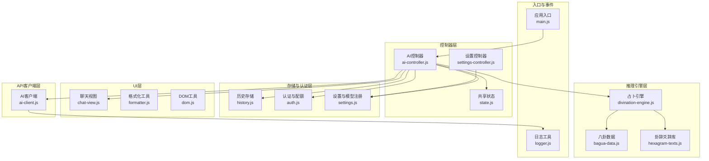
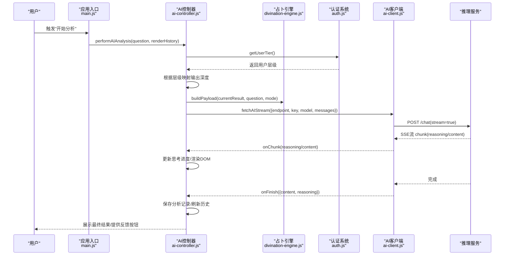
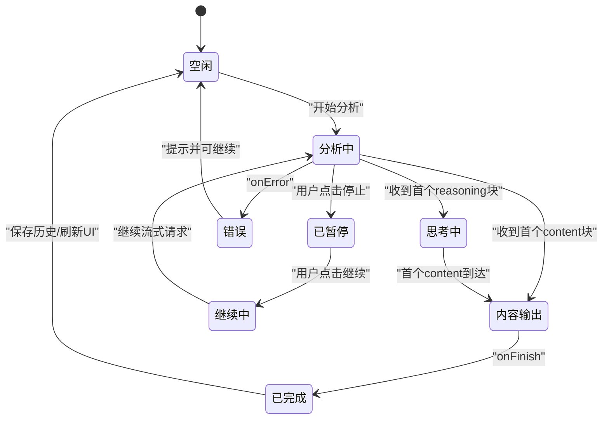
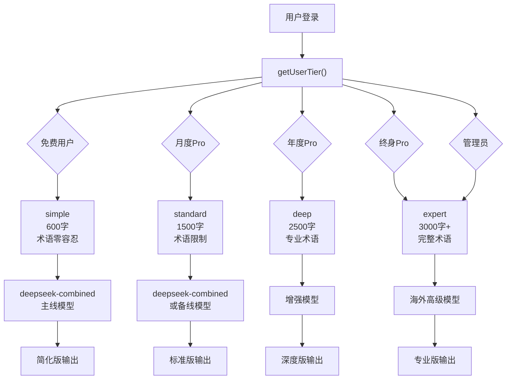
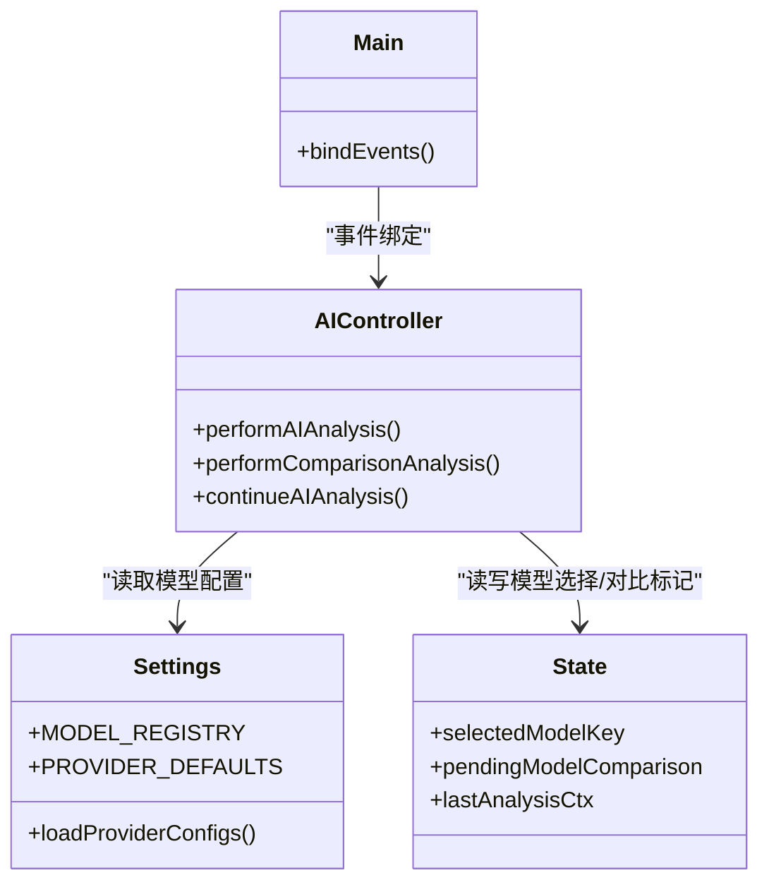
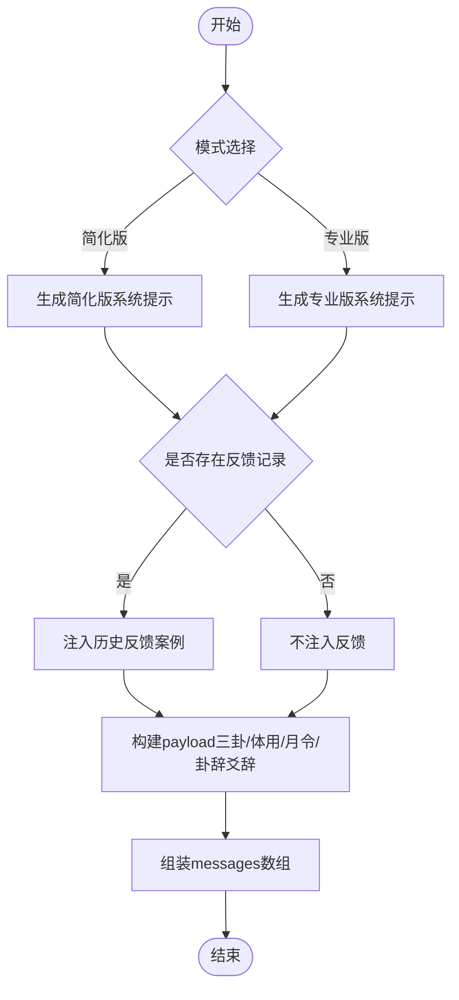
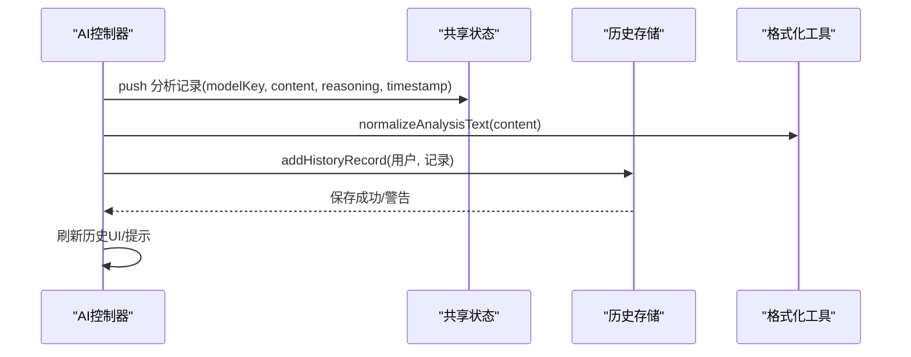
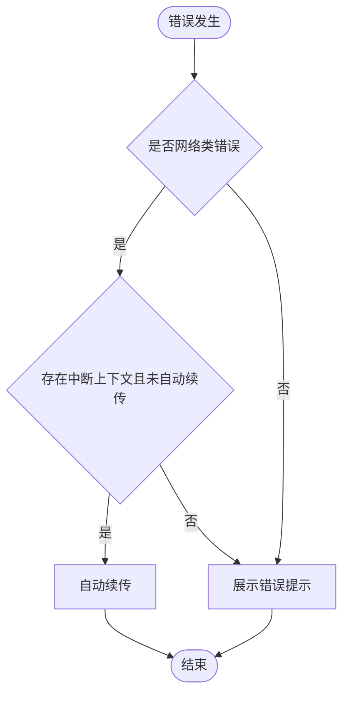
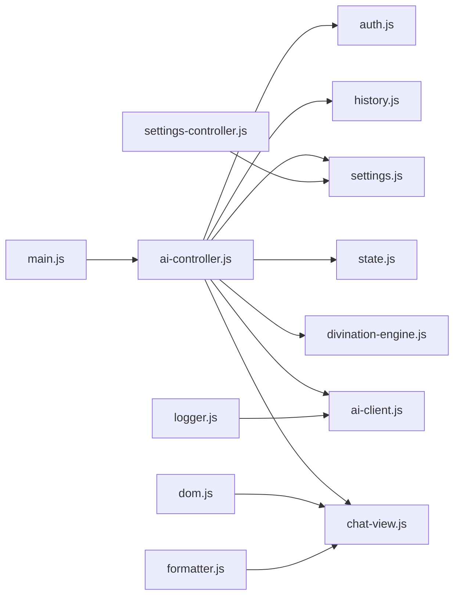

# AI控制器

<cite>
**本文引用的文件**
- [ai-controller.js](file://src/controllers/ai-controller.js)
- [ai-client.js](file://src/api/ai-client.js)
- [divination-engine.js](file://src/core/divination-engine.js)
- [history.js](file://src/storage/history.js)
- [logger.js](file://src/utils/logger.js)
- [state.js](file://src/controllers/state.js)
- [settings.js](file://src/storage/settings.js)
- [chat-view.js](file://src/ui/chat-view.js)
- [formatter.js](file://src/utils/formatter.js)
- [dom.js](file://src/utils/dom.js)
- [auth.js](file://src/storage/auth.js)
- [settings-controller.js](file://src/controllers/settings-controller.js)
- [main.js](file://src/main.js)
- [bagua-data.js](file://src/core/bagua-data.js)
- [hexagram-texts.js](file://src/core/hexagram-texts.js)
</cite>

## 更新摘要
**变更内容**
- 新增四层输出深度控制系统，支持免费版简单模式、月度Pro标准模式、年度Pro深度模式、终身Pro专家模式和管理员专家模式
- 实现自动AI分析复杂度调整和提示工程
- 增强用户权限分级与输出深度匹配机制
- 完善多层级用户权限管理（free/monthly/yearly/lifetime/admin）

## 目录
1. [简介](#简介)
2. [项目结构](#项目结构)
3. [核心组件](#核心组件)
4. [架构总览](#架构总览)
5. [详细组件分析](#详细组件分析)
6. [依赖分析](#依赖分析)
7. [性能考虑](#性能考虑)
8. [故障排查指南](#故障排查指南)
9. [结论](#结论)
10. [附录](#附录)

## 简介
本文件为"AI控制器"模块的综合技术文档，聚焦于推理流程控制逻辑、请求调度、上下文管理、状态机实现、多模型支持机制、上下文消息构建、结果聚合与质量评估、以及错误处理与异常恢复策略。文档通过代码级可视化图表与分层讲解，帮助开发者快速理解并高效扩展AI控制器的工作原理。

**更新** 新增四层输出深度控制系统，实现基于用户权限级别的智能分析复杂度匹配，包括免费版简单模式、月度Pro标准模式、年度Pro深度模式、终身Pro专家模式和管理员专家模式。

## 项目结构
AI控制器位于前端应用的控制器层，围绕"占卜引擎 + AI推理 + 流式输出 + 上下文持久化"的闭环设计组织。主要模块职责如下：
- 控制器层：AI控制器负责调度推理、管理流式渲染、处理用户交互与模型切换。
- 推理引擎层：占卜引擎负责生成三卦（本卦/变卦/对卦）与能量分析，构建AI推理payload。
- API客户端层：封装流式SSE调用、重试与超时控制、代理模式切换。
- 存储与认证层：历史记录、配额与权限、设置与模型注册表。
- UI层：消息渲染、双列对比布局、提示与反馈。

**图表来源**
- [ai-controller.js:1-805](file://src/controllers/ai-controller.js#L1-L805)
- [ai-client.js:1-185](file://src/api/ai-client.js#L1-L185)
- [divination-engine.js:1-433](file://src/core/divination-engine.js#L1-L433)
- [history.js:1-143](file://src/storage/history.js#L1-L143)
- [auth.js:1-495](file://src/storage/auth.js#L1-L495)
- [settings.js:1-123](file://src/storage/settings.js#L1-L123)
- [chat-view.js:1-138](file://src/ui/chat-view.js#L1-L138)
- [formatter.js:1-92](file://src/utils/formatter.js#L1-L92)
- [dom.js:1-41](file://src/utils/dom.js#L1-L41)
- [main.js:1-800](file://src/main.js#L1-L800)
- [bagua-data.js:1-136](file://src/core/bagua-data.js#L1-L136)
- [hexagram-texts.js:1-800](file://src/core/hexagram-texts.js#L1-L800)

**章节来源**
- [ai-controller.js:1-805](file://src/controllers/ai-controller.js#L1-L805)
- [main.js:1-800](file://src/main.js#L1-L800)

## 核心组件
- AI控制器：负责分析请求的发起、流式渲染、中断与续传、模型切换对比、结果聚合与持久化。
- 占卜引擎：生成三卦与能量分析，构建AI推理payload。
- AI客户端：封装流式SSE调用、重试、超时、代理模式。
- 共享状态：集中管理当前用户、历史、当前结果、模型选择、中断上下文等。
- 设置与模型注册：提供多模型注册表、默认端点、密钥加载与保存。
- 历史与反馈：本地历史记录、云端合并、反馈学习注入。
- 认证与配额：用户登录、会话恢复、额度控制、VIP码兑换。
- UI渲染：消息添加、双列对比布局、滚动与动作按钮。

**更新** 新增输出深度控制系统，根据用户权限级别自动匹配相应的分析复杂度和输出格式。

**章节来源**
- [ai-controller.js:24-805](file://src/controllers/ai-controller.js#L24-L805)
- [divination-engine.js:297-346](file://src/core/divination-engine.js#L297-L346)
- [ai-client.js:31-76](file://src/api/ai-client.js#L31-L76)
- [state.js:5-24](file://src/controllers/state.js#L5-L24)
- [settings.js:17-123](file://src/storage/settings.js#L17-L123)
- [history.js:15-143](file://src/storage/history.js#L15-L143)
- [auth.js:430-495](file://src/storage/auth.js#L430-L495)
- [chat-view.js:7-138](file://src/ui/chat-view.js#L7-L138)
- [formatter.js:61-92](file://src/utils/formatter.js#L61-L92)

## 架构总览
AI控制器采用"事件驱动 + 状态机 + 流式渲染"的架构模式：
- 事件驱动：入口绑定用户交互事件（开始分析、停止、继续、模型切换）。
- 状态机：共享状态维护当前分析生命周期（中断上下文、最后分析上下文、模型比较标记）。
- 流式渲染：SSE流式增量渲染，思考进度条与"思考中"状态提示，内容到达后完成渲染与动作按钮恢复。

**更新** 新增用户权限分级机制，自动匹配输出深度控制策略。

**图表来源**
- [main.js:526-542](file://src/main.js#L526-L542)
- [ai-controller.js:24-112](file://src/controllers/ai-controller.js#L24-L112)
- [auth.js:470-478](file://src/storage/auth.js#L470-L478)
- [divination-engine.js:297-346](file://src/core/divination-engine.js#L297-L346)
- [ai-client.js:31-76](file://src/api/ai-client.js#L31-L76)

## 详细组件分析

### 推理流程控制与状态机
- 请求调度：performAIAnalysis根据用户权限与配额决定模式（简化/专业），构建系统提示与payload，调用流式API。
- 中断与续传：interruptedCtx保存messages、partialContent、partialReasoning与渲染目标，支持"继续"接续。
- 模型切换对比：pendingModelComparison与lastAnalysisCtx配合，模型切换后自动触发对比分析。
- 思考进度与状态：渲染"思考中"UI，模拟进度曲线，首包延迟时提示重试通道。

**图表来源**
- [ai-controller.js:203-805](file://src/controllers/ai-controller.js#L203-L805)
- [state.js:16-21](file://src/controllers/state.js#L16-L21)

**章节来源**
- [ai-controller.js:24-112](file://src/controllers/ai-controller.js#L24-L112)
- [ai-controller.js:203-805](file://src/controllers/ai-controller.js#L203-L805)
- [state.js:5-24](file://src/controllers/state.js#L5-L24)

### 四层输出深度控制系统

**更新** 新增完整的四层输出深度控制系统，实现基于用户权限级别的智能分析复杂度匹配。

- **免费版简单模式** (`simple`)
  - 字数限制：1500字
  - 术语限制：术语零容忍，禁止使用"体、用、体卦、用卦"等专业术语
  - 输出格式：简化版直读指南，适合非专业用户
  - 模型选择：固定使用主线模型（成本控制）

- **月度Pro标准模式** (`standard`)
  - 字数限制：2500字
  - 术语限制：尽量避免专业术语，必要时需解释
  - 输出格式：深度客户指南，包含现状分析、过程演变、终局判断
  - 模型选择：可选择主线或备线模型

- **年度Pro深度模式** (`deep`)
  - 字数限制：3500字
  - 术语限制：可使用专业术语，首次出现需简要说明
  - 输出格式：详细推演报告，包含核心战略决断、三段式推演
  - 模型选择：可选择增强模型

- **终身Pro专家模式** (`expert`)
  - 字数限制：4500字
  - 术语限制：使用完整专业术语体系
  - 输出格式：易学从业者报告，包含三联卦象深度解析
  - 模型选择：可选择海外高级模型

- **管理员专家模式** (`expert`)
  - 字数限制：4500字
  - 特权：管理员专用，享受最高级分析能力
  - 输出格式：与终身Pro相同，但具有特殊权限

**图表来源**
- [ai-controller.js:48-63](file://src/controllers/ai-controller.js#L48-L63)
- [auth.js:470-478](file://src/storage/auth.js#L470-L478)

**章节来源**
- [ai-controller.js:48-63](file://src/controllers/ai-controller.js#L48-L63)
- [ai-controller.js:677-805](file://src/controllers/ai-controller.js#L677-L805)
- [auth.js:470-478](file://src/storage/auth.js#L470-L478)

### 多模型支持机制
- 模型注册与选择：MODEL_REGISTRY定义多模型（主线/备线/增强），settings.js提供默认端点与密钥加载。
- 权限与可见性：hasProAccess控制模型选择器显示；普通用户固定主线模型。
- 代理模式：isProxyMode自动切换endpoint，密钥不暴露于前端。
- 切换与对比：模型切换时若存在上次分析，自动触发双列对比布局。

**图表来源**
- [settings.js:17-123](file://src/storage/settings.js#L17-L123)
- [state.js:10-21](file://src/controllers/state.js#L10-L21)
- [ai-controller.js:114-161](file://src/controllers/ai-controller.js#L114-L161)
- [main.js:391-405](file://src/main.js#L391-L405)

**章节来源**
- [settings.js:17-123](file://src/storage/settings.js#L17-L123)
- [ai-controller.js:114-161](file://src/controllers/ai-controller.js#L114-L161)
- [main.js:391-405](file://src/main.js#L391-L405)

### 上下文消息构建与提示词模板
- 系统提示：buildSystemPrompt根据模式（简化/专业）与历史反馈生成核心提示词模板，包含身份约束、语言风格、建议尺度、展开边界、结论一致性等铁律。
- 用户payload：divination-engine.buildPayload将三卦、体用关系、月令状态、卦辞爻辞等结构化为AI输入。
- 历史反馈注入：加载用户反馈记录，将"偏离现实/部分准确/纠正"等案例注入系统提示，形成"反馈学习"机制。

**图表来源**
- [ai-controller.js:526-805](file://src/controllers/ai-controller.js#L526-L805)
- [divination-engine.js:297-346](file://src/core/divination-engine.js#L297-L346)
- [history.js:110-143](file://src/storage/history.js#L110-L143)

**章节来源**
- [ai-controller.js:526-805](file://src/controllers/ai-controller.js#L526-L805)
- [divination-engine.js:297-346](file://src/core/divination-engine.js#L297-L346)
- [history.js:110-143](file://src/storage/history.js#L110-L143)

### 结果聚合与质量评估
- 多轮整合：state.modelAnalyses累积每次分析的模型、内容、推理与时间戳，便于导出与对比。
- 最终生成：onFinish汇总content与reasoning，渲染Markdown，恢复动作按钮，自动保存历史。
- 质量评估：通过历史反馈（评分/纠正）注入系统提示，形成"自我迭代学习"，提升一致性与准确性。
- 导出与分享：normalizeAnalysisText与formatAnalysisForExport统一标题与格式，支持系统分享或复制。

**图表来源**
- [ai-controller.js:394-469](file://src/controllers/ai-controller.js#L394-L469)
- [formatter.js:24-92](file://src/utils/formatter.js#L24-L92)
- [history.js:47-60](file://src/storage/history.js#L47-L60)

**章节来源**
- [ai-controller.js:394-469](file://src/controllers/ai-controller.js#L394-L469)
- [formatter.js:24-92](file://src/utils/formatter.js#L24-L92)
- [history.js:47-60](file://src/storage/history.js#L47-L60)

### 错误处理与异常恢复
- 超时与重试：AI客户端在fetchAIStream中实现最大重试次数与延迟，区分用户取消与超时。
- 网络波动自动续传：onError检测网络类错误且存在中断上下文时，自动触发一次续传。
- UI提示与建议：根据代理模式与错误类型生成友好提示，引导检查API Key或更换模型。
- 存储异常处理：历史保存失败时捕获配额错误并提示清理旧记录。

**图表来源**
- [ai-client.js:31-76](file://src/api/ai-client.js#L31-L76)
- [ai-controller.js:478-523](file://src/controllers/ai-controller.js#L478-L523)
- [history.js:26-45](file://src/storage/history.js#L26-L45)

**章节来源**
- [ai-client.js:31-76](file://src/api/ai-client.js#L31-L76)
- [ai-controller.js:478-523](file://src/controllers/ai-controller.js#L478-L523)
- [history.js:26-45](file://src/storage/history.js#L26-L45)

## 依赖分析
- 控制器依赖：AI控制器依赖占卜引擎生成payload、依赖AI客户端进行流式调用、依赖共享状态管理生命周期、依赖UI层进行消息渲染与动作按钮插入。
- 配置依赖：设置控制器负责加载/保存provider配置，AI控制器在运行时读取配置并根据代理模式切换endpoint。
- 认证与配额：认证模块提供hasProAccess与配额控制，影响模型选择器显示与分析计费。
- 日志与工具：logger用于错误与警告记录，dom与formatter提供DOM操作与Markdown渲染。

**图表来源**
- [ai-controller.js:1-18](file://src/controllers/ai-controller.js#L1-L18)
- [ai-client.js:8-11](file://src/api/ai-client.js#L8-L11)
- [settings-controller.js:4-11](file://src/controllers/settings-controller.js#L4-L11)
- [main.js:45-46](file://src/main.js#L45-L46)

**章节来源**
- [ai-controller.js:1-18](file://src/controllers/ai-controller.js#L1-L18)
- [ai-client.js:8-11](file://src/api/ai-client.js#L8-L11)
- [settings-controller.js:4-11](file://src/controllers/settings-controller.js#L4-L11)
- [main.js:45-46](file://src/main.js#L45-L46)

## 性能考虑
- 流式渲染优化：通过"思考进度条 + 首包延迟提示"改善感知性能，避免空白等待。
- 重试与超时：合理设置超时与重试间隔，降低长时间无响应对用户体验的影响。
- 存储容量控制：历史记录与反馈列表在配额不足时自动裁剪，避免内存与存储溢出。
- 模型选择：普通用户固定主线模型，减少备线切换带来的不确定性与资源浪费。
- 输出深度优化：根据用户权限级别自动匹配合适的分析复杂度，避免不必要的计算开销。

**更新** 新增输出深度优化策略，根据用户层级智能匹配分析复杂度，提升系统整体性能。

## 故障排查指南
- API Key缺失：检查设置面板中的provider配置，确保至少配置一个有效Key。
- 代理模式问题：确认PROXY_ENDPOINT已正确配置，或切换为直连模式。
- 网络波动：查看"服务器响应较慢，正在重试通道"提示，系统会自动续传一次。
- 存储配额：当出现"存储空间不足"提示时，清理旧卦例后重试。
- 权限限制：管理员/付费用户可切换专业版与多模型，普通用户仅能使用主线模型。
- 输出深度问题：检查用户层级是否正确，确认对应的输出深度模式是否启用。

**更新** 新增输出深度相关故障排查指南。

**章节来源**
- [settings-controller.js:12-54](file://src/controllers/settings-controller.js#L12-L54)
- [ai-client.js:12-25](file://src/api/ai-client.js#L12-L25)
- [ai-controller.js:478-523](file://src/controllers/ai-controller.js#L478-L523)
- [history.js:32-45](file://src/storage/history.js#L32-L45)
- [auth.js:430-495](file://src/storage/auth.js#L430-L495)

## 结论
AI控制器通过清晰的状态机、完善的流式渲染与错误恢复机制，实现了从"占卜引擎输入 -> AI推理输出 -> 结果聚合与持久化"的闭环。多模型支持与代理模式增强了系统的可扩展性与稳定性；反馈学习机制提升了长期一致性与准确性。**更新** 新增的四层输出深度控制系统实现了基于用户权限级别的智能分析复杂度匹配，通过免费版简单模式、月度Pro标准模式、年度Pro深度模式、终身Pro专家模式和管理员专家模式的差异化输出策略，为不同用户群体提供了最适合的分析体验。建议在生产环境中进一步完善性能监控与告警，持续优化流式渲染与重试策略。

## 附录
- 关键流程路径参考
  - [开始分析:24-112](file://src/controllers/ai-controller.js#L24-L112)
  - [流式渲染与思考进度:203-377](file://src/controllers/ai-controller.js#L203-L377)
  - [模型切换与对比:114-161](file://src/controllers/ai-controller.js#L114-L161)
  - [系统提示模板:526-805](file://src/controllers/ai-controller.js#L526-L805)
  - [占卜payload构建:297-346](file://src/core/divination-engine.js#L297-L346)
  - [流式SSE调用:31-76](file://src/api/ai-client.js#L31-L76)
  - [共享状态管理:5-24](file://src/controllers/state.js#L5-L24)
  - [设置与模型注册:17-123](file://src/storage/settings.js#L17-L123)
  - [历史与反馈存储:15-143](file://src/storage/history.js#L15-L143)
  - [认证与配额:430-495](file://src/storage/auth.js#L430-L495)
  - [UI渲染与动作按钮:7-138](file://src/ui/chat-view.js#L7-L138)
  - [Markdown格式化:61-92](file://src/utils/formatter.js#L61-L92)
  - [DOM与Toast:17-41](file://src/utils/dom.js#L17-L41)
  - [应用入口与事件绑定:296-554](file://src/main.js#L296-L554)
  - [八卦与月令数据:80-92](file://src/core/bagua-data.js#L80-L92)
  - [卦辞爻辞库:6-392](file://src/core/hexagram-texts.js#L6-L392)

**更新** 新增输出深度控制相关路径参考
  - [用户层级检测:470-478](file://src/storage/auth.js#L470-L478)
  - [输出深度映射:48-63](file://src/controllers/ai-controller.js#L48-L63)
  - [输出格式配置:677-805](file://src/controllers/ai-controller.js#L677-L805)