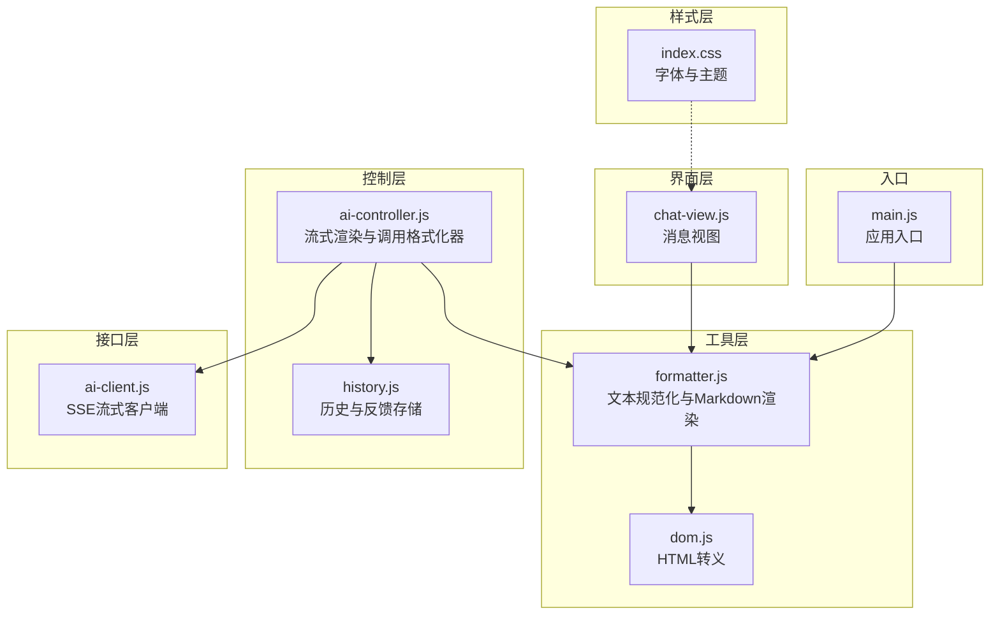
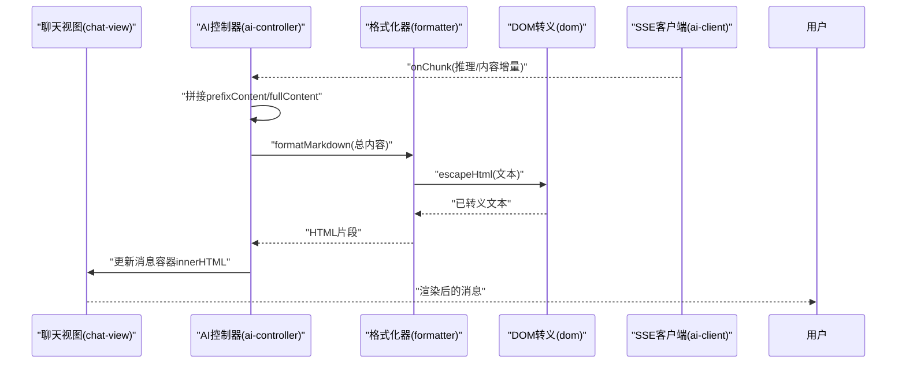
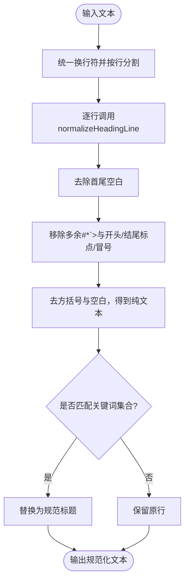
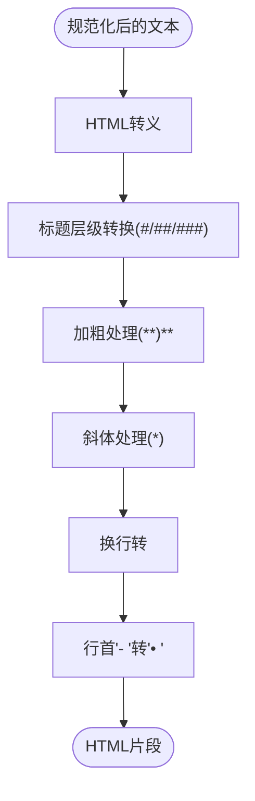
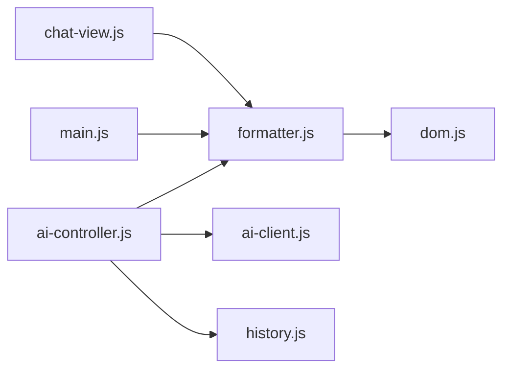

# 格式化器

<cite>
**本文引用的文件**
- [formatter.js](file://src/utils/formatter.js)
- [dom.js](file://src/utils/dom.js)
- [chat-view.js](file://src/ui/chat-view.js)
- [ai-controller.js](file://src/controllers/ai-controller.js)
- [ai-client.js](file://src/api/ai-client.js)
- [history.js](file://src/storage/history.js)
- [utils.test.js](file://__tests__/utils.test.js)
- [index.css](file://src/index.css)
- [main.js](file://src/main.js)
</cite>

## 目录
1. [简介](#简介)
2. [项目结构](#项目结构)
3. [核心组件](#核心组件)
4. [架构总览](#架构总览)
5. [详细组件分析](#详细组件分析)
6. [依赖分析](#依赖分析)
7. [性能考虑](#性能考虑)
8. [故障排查指南](#故障排查指南)
9. [结论](#结论)
10. [附录](#附录)

## 简介
本文件面向“格式化器模块”，系统性梳理文本格式化处理逻辑，覆盖 Markdown 渲染、HTML 转义、特殊字符处理、输出格式化规则（段落、列表、代码块）、内容过滤与清理机制（敏感信息过滤、格式标准化、兼容性处理）、多语言支持（Unicode 处理、字符编码转换、本地化格式化），并提供完整的格式化规则清单与示例、性能优化建议与最佳实践，帮助开发者在保证格式正确性的同时提升处理效率。

## 项目结构
格式化器位于工具层，主要文件与职责如下：
- src/utils/formatter.js：提供文本规范化与 Markdown 渲染能力，含标题标准化、显示映射、HTML 转义与基础 Markdown 转换。
- src/utils/dom.js：提供通用 DOM 辅助函数，其中 escapeHtml 用于安全输出。
- src/ui/chat-view.js：聊天消息视图，调用格式化器渲染助手消息内容。
- src/controllers/ai-controller.js：AI 分析控制器，负责流式接收与渲染，调用格式化器进行最终 HTML 输出。
- src/api/ai-client.js：流式 SSE 接口客户端，负责与后端通信与错误处理。
- src/storage/history.js：历史记录与反馈存储，间接影响格式化器的系统提示与输出风格。
- __tests__/utils.test.js：格式化器单元测试，验证转义与基础 Markdown 转换行为。
- src/index.css：全局样式，定义字体族（Noto Sans SC、Noto Serif SC），支撑多语言排版。
- src/main.js：应用入口，导入并使用格式化器进行文本规范化。

图表来源
- [formatter.js:1-92](file://src/utils/formatter.js#L1-L92)
- [dom.js:1-41](file://src/utils/dom.js#L1-L41)
- [chat-view.js:1-114](file://src/ui/chat-view.js#L1-L114)
- [ai-controller.js:1-733](file://src/controllers/ai-controller.js#L1-L733)
- [ai-client.js:1-185](file://src/api/ai-client.js#L1-L185)
- [history.js:1-143](file://src/storage/history.js#L1-L143)
- [index.css:1-34](file://src/index.css#L1-L34)
- [main.js:21](file://src/main.js#L21)

章节来源
- [formatter.js:1-92](file://src/utils/formatter.js#L1-L92)
- [dom.js:1-41](file://src/utils/dom.js#L1-L41)
- [chat-view.js:1-114](file://src/ui/chat-view.js#L1-L114)
- [ai-controller.js:1-733](file://src/controllers/ai-controller.js#L1-L733)
- [ai-client.js:1-185](file://src/api/ai-client.js#L1-L185)
- [history.js:1-143](file://src/storage/history.js#L1-L143)
- [index.css:1-34](file://src/index.css#L1-L34)
- [main.js:21](file://src/main.js#L21)

## 核心组件
- 文本规范化与标题标准化
  - normalizeAnalysisText：统一换行符、规范化标题行、统一“高维生存锦囊/高位生存锦囊”为“行动建议”。
  - normalizeHeadingLine：去除多余标记、清洗标点与空白、标准化中文标题关键词，映射为规范标题。
  - DISPLAY_HEADING_MAP：将规范标题映射为显示标题，用于最终渲染。
- Markdown 渲染管线
  - formatMarkdown：调用 escapeHtml，处理加粗/斜体、换行、列表、标题层级转换，并对头部加粗标记进行流式平滑处理。
- HTML 转义
  - escapeHtml：对危险字符进行实体编码，防止 XSS。
- 流式渲染集成
  - ai-controller 在流式回调中拼接增量内容，调用 formatMarkdown 渲染，确保加粗未闭合时自动补全，避免闪烁。

章节来源
- [formatter.js:24-91](file://src/utils/formatter.js#L24-L91)
- [dom.js:7-15](file://src/utils/dom.js#L7-L15)
- [ai-controller.js:203-477](file://src/controllers/ai-controller.js#L203-L477)

## 架构总览
格式化器在“控制层”与“界面层”之间扮演桥梁角色，控制层负责接收流式数据并触发渲染，界面层负责最终展示。其核心流程如下：

图表来源
- [ai-controller.js:289-344](file://src/controllers/ai-controller.js#L289-L344)
- [formatter.js:61-91](file://src/utils/formatter.js#L61-L91)
- [dom.js:7-15](file://src/utils/dom.js#L7-L15)
- [ai-client.js:121-176](file://src/api/ai-client.js#L121-L176)

## 详细组件分析

### 文本规范化与标题标准化
- 规范化策略
  - 统一换行符为 LF，按行处理，逐行调用 normalizeHeadingLine。
  - 标题行清洗：移除多余 #、*、`>，去除开头/结尾标点与冒号，保留中文、英文字母、数字与中/英文方括号内的关键词，再进行“纯文本”标准化（去方括号、去空白）。
  - 关键词匹配：对 CANONICAL_HEADINGS 中的关键词集合进行包含匹配，命中则替换为规范标题。
  - 显示映射：DISPLAY_HEADING_MAP 将规范标题映射为更简洁的显示标题。
  - 特殊标题统一：将“高维生存锦囊/高位生存锦囊”统一为“行动建议”。

图表来源
- [formatter.js:24-59](file://src/utils/formatter.js#L24-L59)

章节来源
- [formatter.js:6-33](file://src/utils/formatter.js#L6-L33)
- [formatter.js:35-59](file://src/utils/formatter.js#L35-L59)

### Markdown 渲染与流式平滑处理
- 渲染步骤
  - normalizeAnalysisText → escapeHtml → 标题层级转换 → 加粗/斜体 → 换行 → 列表符号转换。
  - 流式平滑：统计加粗标记数量，若为奇数则自动补全，避免未闭合加粗导致的闪烁与跳动。
- 标题层级映射
  - ### → <h4>，## → <h3>，# → <h2>。
- 列表处理
  - 将行首 “- ” 替换为 “• ”，便于统一显示。
- 斜体与加粗
  - 支持跨行加粗，斜体使用单星号。

图表来源
- [formatter.js:61-91](file://src/utils/formatter.js#L61-L91)

章节来源
- [formatter.js:61-91](file://src/utils/formatter.js#L61-L91)

### HTML 转义与安全
- escapeHtml 实现对 &, <, >, ", ' 的实体编码，防止 XSS 注入。
- 控制层在错误提示与系统消息中也使用 escapeHtml，确保安全输出。

章节来源
- [dom.js:7-15](file://src/utils/dom.js#L7-L15)
- [ai-controller.js:488-521](file://src/controllers/ai-controller.js#L488-L521)
- [chat-view.js:77-81](file://src/ui/chat-view.js#L77-L81)

### 流式渲染与加粗平滑
- 控制层在每次 onChunk 回调中，将 prefixContent 与增量 fullContent 拼接后调用 formatMarkdown，确保加粗未闭合时自动补全，避免闪烁。
- 思考阶段与内容阶段分别渲染进度条与最终 HTML，保证用户体验稳定。

章节来源
- [ai-controller.js:289-344](file://src/controllers/ai-controller.js#L289-L344)
- [formatter.js:65-69](file://src/utils/formatter.js#L65-L69)

### 输出格式化规则清单
- 标题
  - 输入：支持 #、##、### 三级标题；行首可带空格。
  - 规范化：统一为规范标题，再映射为显示标题。
  - 渲染：### → <h4>，## → <h3>，# → <h2>。
- 加粗
  - 输入：**文本**。
  - 渲染：<strong>文本</strong>；流式时若标记不成对，自动补全。
- 斜体
  - 输入：*文本*。
  - 渲染：<em>文本</em>。
- 换行
  - 输入：\n。
  - 渲染： 。
- 列表
  - 输入：每行以 “- ” 开头。
  - 渲染：统一为 “• ” 符号。
- 特殊字符
  - 所有输入先经 escapeHtml，再进行 Markdown 转换，确保安全。

章节来源
- [formatter.js:61-91](file://src/utils/formatter.js#L61-L91)
- [dom.js:7-15](file://src/utils/dom.js#L7-L15)

### 内容过滤与清理机制
- 敏感信息过滤
  - 通过 escapeHtml 对所有用户输入进行实体编码，防止脚本注入与跨站攻击。
- 格式标准化
  - 统一换行符、标题关键词标准化、显示标题映射、统一“行动建议”标题。
- 兼容性处理
  - 流式渲染时自动闭合加粗标记，避免未闭合导致的视觉闪烁。
  - 对“高维生存锦囊/高位生存锦囊”进行统一，提升一致性。

章节来源
- [formatter.js:24-33](file://src/utils/formatter.js#L24-L33)
- [formatter.js:65-69](file://src/utils/formatter.js#L65-L69)
- [formatter.js:61-91](file://src/utils/formatter.js#L61-L91)

### 多语言支持机制
- 字体与排版
  - 使用 Noto Sans SC 与 Noto Serif SC 字体族，覆盖中日韩等东亚语言字符集，保障多语言显示质量。
- Unicode 处理
  - 标题关键词匹配使用 Unicode 范围 [\u4e00-\u9fa5]，确保中文标题识别准确。
- 本地化格式化
  - 标题关键词映射与显示标题映射，体现中文本地化风格。

章节来源
- [index.css:22-23](file://src/index.css#L22-L23)
- [formatter.js:40-50](file://src/utils/formatter.js#L40-L50)

## 依赖分析
- 组件耦合
  - formatter.js 依赖 dom.js 的 escapeHtml。
  - chat-view.js 与 ai-controller.js 依赖 formatter.js 进行内容渲染。
  - ai-controller.js 依赖 ai-client.js 进行流式数据接收。
  - main.js 导入 formatter.js 以进行文本规范化。
- 外部依赖
  - 浏览器内置 TextDecoder/ReadableStream API 用于 SSE 流式解析。
  - localStorage 与 fetch 用于历史与反馈存储。

图表来源
- [formatter.js:4](file://src/utils/formatter.js#L4)
- [chat-view.js:4-5](file://src/ui/chat-view.js#L4-L5)
- [ai-controller.js:7-9](file://src/controllers/ai-controller.js#L7-L9)
- [ai-client.js:8-10](file://src/api/ai-client.js#L8-L10)
- [main.js:21](file://src/main.js#L21)

章节来源
- [formatter.js:4](file://src/utils/formatter.js#L4)
- [chat-view.js:4-5](file://src/ui/chat-view.js#L4-L5)
- [ai-controller.js:7-9](file://src/controllers/ai-controller.js#L7-L9)
- [ai-client.js:8-10](file://src/api/ai-client.js#L8-L10)
- [main.js:21](file://src/main.js#L21)

## 性能考虑
- 正则匹配与字符串处理
  - normalizeHeadingLine 使用多步正则清洗，建议在高频场景下：
    - 缓存 DISPLAY_HEADING_MAP 查询结果（当前已使用 Map，查询 O(1)）。
    - 对 CANONICAL_HEADINGS 的匹配可考虑预构建索引（如按关键词长度分桶）以降低查找成本。
- 流式渲染
  - 控制层在每次 onChunk 拼接 prefixContent 与增量内容，建议：
    - 使用模板字符串拼接时避免频繁 DOM 更新，可累积到一定阈值再一次性更新 innerHTML。
    - 对于长文本，可采用虚拟滚动或分页渲染策略（视 UI 需求）。
- HTML 转义
  - escapeHtml 为线性复杂度，建议：
    - 对于超长文本，可考虑分块处理或使用浏览器内置的 DOM API（如创建临时元素）以减少正则替换次数。
- 字体与渲染
  - 使用高性能字体（Noto 系列）与合理的字体回退策略，避免字体加载阻塞。
- 存储与历史
  - 历史记录与反馈存储使用 localStorage，注意容量限制与自动裁剪策略，避免频繁 IO 影响渲染性能。

[本节为通用性能建议，不直接分析具体文件，无需章节来源]

## 故障排查指南
- 渲染闪烁或加粗跳动
  - 现象：流式输出中加粗标记未闭合导致闪烁。
  - 处理：确认 formatMarkdown 已自动补全加粗标记；检查控制层是否正确拼接 prefixContent 与增量内容。
  - 参考
    - [formatter.js:65-69](file://src/utils/formatter.js#L65-L69)
    - [ai-controller.js:289-344](file://src/controllers/ai-controller.js#L289-L344)
- 标题未正确渲染
  - 现象：标题层级不正确或显示不一致。
  - 处理：确认 normalizeAnalysisText 已执行；检查 DISPLAY_HEADING_MAP 是否命中；确保标题行符合规范。
  - 参考
    - [formatter.js:24-33](file://src/utils/formatter.js#L24-L33)
    - [formatter.js:71-74](file://src/utils/formatter.js#L71-L74)
- XSS 或脚本注入
  - 现象：用户输入的 HTML 被直接渲染。
  - 处理：确保所有用户输入均经 escapeHtml；检查是否绕过转义。
  - 参考
    - [dom.js:7-15](file://src/utils/dom.js#L7-L15)
    - [ai-controller.js:506](file://src/controllers/ai-controller.js#L506)
- 列表符号不统一
  - 现象：列表项未显示为统一符号。
  - 处理：确认 formatMarkdown 已将 “- ” 替换为 “• ”。
  - 参考
    - [formatter.js:88-89](file://src/utils/formatter.js#L88-L89)
- 单元测试验证
  - 使用测试用例验证转义与基础 Markdown 行为，确保回归稳定。
  - 参考
    - [utils.test.js:22-75](file://__tests__/utils.test.js#L22-L75)

章节来源
- [formatter.js:65-69](file://src/utils/formatter.js#L65-L69)
- [formatter.js:71-74](file://src/utils/formatter.js#L71-L74)
- [formatter.js:88-89](file://src/utils/formatter.js#L88-L89)
- [dom.js:7-15](file://src/utils/dom.js#L7-L15)
- [ai-controller.js:289-344](file://src/controllers/ai-controller.js#L289-L344)
- [utils.test.js:22-75](file://__tests__/utils.test.js#L22-L75)

## 结论
格式化器模块通过“文本规范化 + HTML 转义 + 基础 Markdown 渲染”的组合，在保证安全性与一致性的前提下，实现了易理分析文本的高质量展示。其流式平滑处理与标题映射机制有效提升了用户体验。建议在高频场景下进一步优化正则匹配与 DOM 更新策略，并持续通过单元测试保障稳定性。

[本节为总结性内容，无需章节来源]

## 附录

### 格式化规则清单与示例
- 标题
  - 输入：# 一级标题、## 二级标题、### 三级标题
  - 规范化：统一为规范标题，再映射为显示标题
  - 输出：<h2>、<h3>、<h4>
- 加粗
  - 输入：**加粗文本**
  - 输出：<strong>加粗文本</strong>
  - 流式：若未闭合，自动补全
- 斜体
  - 输入：*斜体文本*
  - 输出：<em>斜体文本</em>
- 换行
  - 输入：\n
  - 输出： 
- 列表
  - 输入：每行以 “- ” 开头
  - 输出：统一为 “• ” 符号
- 特殊字符
  - 输入：包含 <script> 等危险字符
  - 输出：经 escapeHtml 实体编码后渲染

章节来源
- [formatter.js:61-91](file://src/utils/formatter.js#L61-L91)
- [dom.js:7-15](file://src/utils/dom.js#L7-L15)