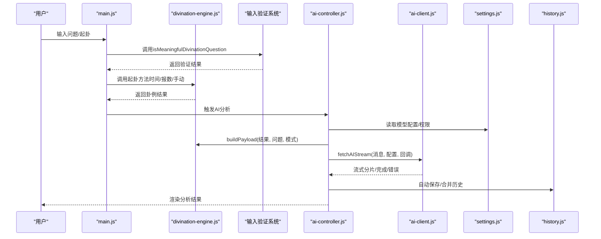
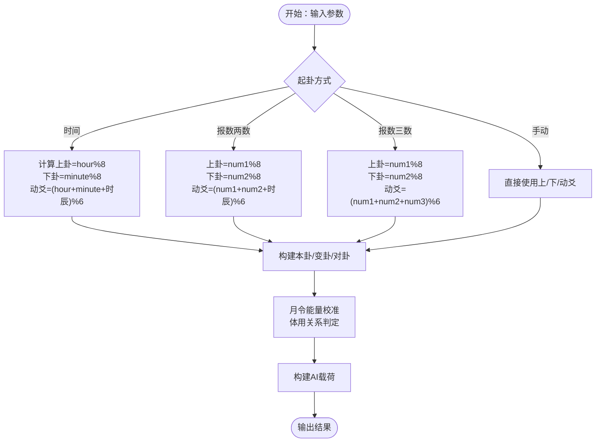
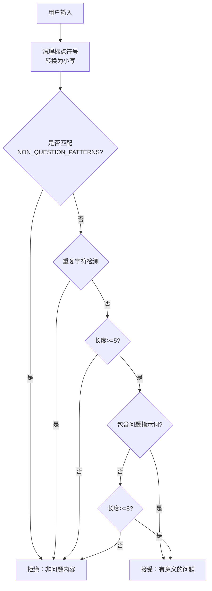
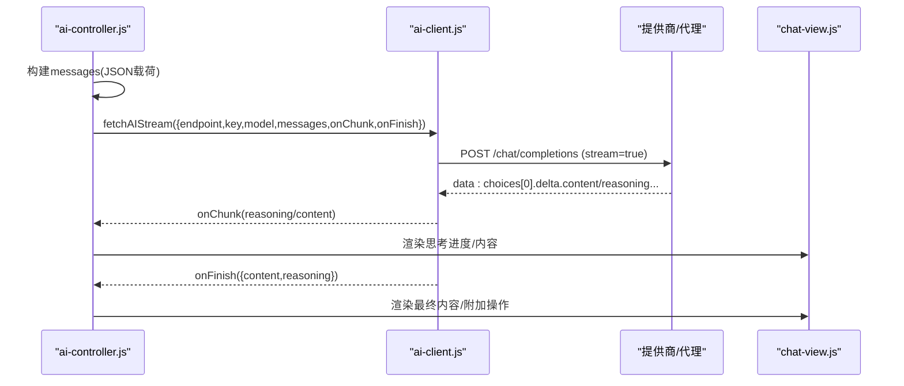
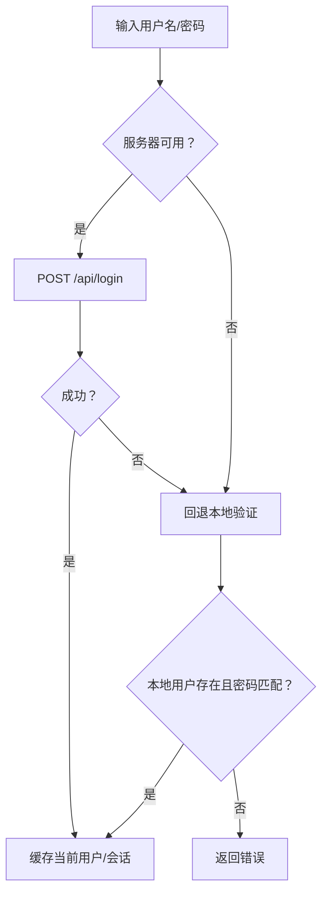
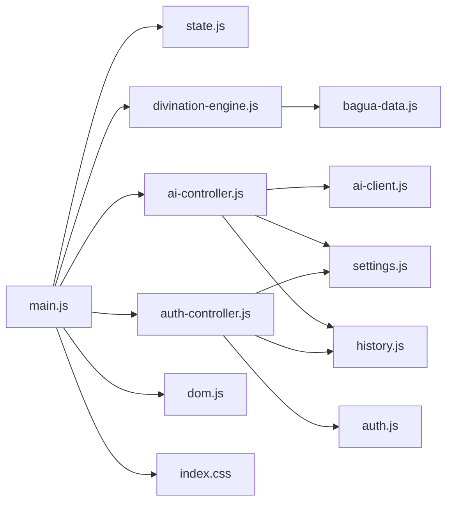

# 核心模块

<cite>
**本文引用的文件**
- [divination-engine.js](file://src/core/divination-engine.js)
- [bagua-data.js](file://src/core/bagua-data.js)
- [ai-controller.js](file://src/controllers/ai-controller.js)
- [ai-client.js](file://src/api/ai-client.js)
- [auth-controller.js](file://src/controllers/auth-controller.js)
- [auth.js](file://src/storage/auth.js)
- [settings.js](file://src/storage/settings.js)
- [state.js](file://src/controllers/state.js)
- [main.js](file://src/main.js)
- [chat-view.js](file://src/ui/chat-view.js)
- [hex-view.js](file://src/ui/hex-view.js)
- [history.js](file://src/storage/history.js)
- [dom.js](file://src/utils/dom.js)
- [index.css](file://src/index.css)
- [package.json](file://package.json)
</cite>

## 更新摘要
**变更内容**
- 增强了输入验证系统，新增重复字符检测机制
- 扩展了非问题内容的模式识别范围
- 改进了警告显示策略，实现智能的用户引导
- 优化了用户体验，通过视觉反馈提升交互质量

## 目录
1. [简介](#简介)
2. [项目结构](#项目结构)
3. [核心组件](#核心组件)
4. [架构总览](#架构总览)
5. [详细组件分析](#详细组件分析)
6. [依赖分析](#依赖分析)
7. [性能考量](#性能考量)
8. [故障排查指南](#故障排查指南)
9. [结论](#结论)
10. [附录](#附录)

## 简介
本文件面向"梅花义理"的核心模块，系统梳理起卦引擎、AI分析系统、认证系统与状态管理等关键子系统的设计理念、实现原理与交互关系。文档同时解释三种起卦方式（时间起卦、报数起卦、手动起卦）的数学与逻辑差异，并阐述AI客户端与多模型推理系统的集成机制、认证流程的安全考虑与最佳实践，最后提供模块间接口规范、调用关系图与使用模式，帮助开发者快速理解并正确使用各模块。

**更新** 本版本重点介绍了增强的输入验证系统，包括重复字符检测机制、非问题内容模式识别和智能警告显示策略。

## 项目结构
项目采用前端单页应用架构，核心模块分布于 src 目录：
- core：易学核心算法与数据（起卦引擎、八卦/六十四卦数据、干支历）
- controllers：业务控制器（AI 控制器、认证控制器、状态管理）
- api：AI 推理客户端（含流式传输、代理模式）
- storage：持久化与配额/额度、历史与反馈、设置与模型注册
- ui：视图渲染（聊天、六爻卡牌、历史列表）
- utils：DOM、格式化、日志、哈希等工具

```mermaid
graph TB
subgraph "入口与控制器"
MAIN["main.js<br/>应用入口/事件绑定"]
STATE["state.js<br/>全局状态"]
END
subgraph "核心算法"
DE["divination-engine.js<br/>起卦引擎"]
BD["bagua-data.js<br/>八卦/六十四卦/月令"]
END
subgraph "AI 推理"
AC["ai-controller.js<br/>AI 控制器"]
AIC["ai-client.js<br/>AI 客户端/流式"]
END
subgraph "认证与配额"
AUTHC["auth-controller.js<br/>认证 UI/流程"]
AUTHS["auth.js<br/>用户/配额/会话"]
SET["settings.js<br/>模型注册/提供商配置"]
END
subgraph "视图与存储"
CHAT["chat-view.js<br/>消息渲染"]
HEX["hex-view.js<br/>六爻卡牌渲染"]
HIST["history.js<br/>历史/反馈/云端同步"]
DOM["dom.js<br/>DOM工具/Toast提示"]
CSS["index.css<br/>样式/警告显示"]
END
MAIN --> DE
MAIN --> AC
MAIN --> AUTHC
MAIN --> STATE
AC --> DE
AC --> AIC
AC --> SET
AC --> HIST
AIC --> SET
AUTHC --> AUTHS
AUTHC --> SET
AUTHC --> HIST
DE --> BD
MAIN --> CHAT
MAIN --> HEX
MAIN --> HIST
MAIN --> DOM
MAIN --> CSS
```

**图表来源**
- [main.js:167-249](file://src/main.js#L167-L249)
- [divination-engine.js:23-433](file://src/core/divination-engine.js#L23-L433)
- [bagua-data.js:8-136](file://src/core/bagua-data.js#L8-L136)
- [ai-controller.js:24-112](file://src/controllers/ai-controller.js#L24-L112)
- [ai-client.js:31-76](file://src/api/ai-client.js#L31-L76)
- [auth-controller.js:251-310](file://src/controllers/auth-controller.js#L251-L310)
- [auth.js:46-125](file://src/storage/auth.js#L46-L125)
- [settings.js:17-86](file://src/storage/settings.js#L17-L86)
- [state.js:5-24](file://src/controllers/state.js#L5-L24)
- [chat-view.js:7-42](file://src/ui/chat-view.js#L7-L42)
- [hex-view.js:8-29](file://src/ui/hex-view.js#L8-L29)
- [history.js:15-62](file://src/storage/history.js#L15-L62)
- [dom.js:1-41](file://src/utils/dom.js#L1-L41)
- [index.css:695-764](file://src/index.css#L695-L764)

**章节来源**
- [main.js:167-249](file://src/main.js#L167-L249)
- [package.json:1-32](file://package.json#L1-L32)

## 核心组件
- 起卦引擎：实现三种起卦方式、三卦联动（本卦/变卦/对卦）、体用判定、能量场分析与月令校准、文本解析与日期解析、构建AI分析载荷等。
- AI 分析系统：封装流式推理、模型切换对比、中断续传、错误处理与自动重试、系统提示词构建与反馈学习注入。
- 认证系统：登录/注册/登出、会话恢复、权限与额度控制、忘记密码与邮箱绑定、管理员功能。
- 状态管理：集中管理用户、历史、当前卦例、模型选择、中断上下文、比较标记等。
- 存储与设置：本地历史/反馈与云端同步、提供商配置与模型注册、额度与配额策略。
- **输入验证系统**：增强的输入验证、重复字符检测、非问题内容识别、智能警告显示策略。

**更新** 新增了输入验证系统的详细说明，包括重复字符检测和智能警告显示功能。

**章节来源**
- [divination-engine.js:23-433](file://src/core/divination-engine.js#L23-L433)
- [ai-controller.js:24-112](file://src/controllers/ai-controller.js#L24-L112)
- [auth-controller.js:251-310](file://src/controllers/auth-controller.js#L251-L310)
- [auth.js:249-289](file://src/storage/auth.js#L249-L289)
- [state.js:5-24](file://src/controllers/state.js#L5-L24)
- [settings.js:17-86](file://src/storage/settings.js#L17-L86)
- [history.js:15-62](file://src/storage/history.js#L15-L62)
- [main.js:49-130](file://src/main.js#L49-L130)

## 架构总览
系统以 main.js 为入口，通过控制器协调核心算法与外部服务。AI 分析流程依赖起卦引擎构建载荷，AI 客户端负责流式请求与错误处理，认证与配额模块保障访问控制与资源限制，状态模块贯穿所有交互。



**图表来源**
- [main.js:606-786](file://src/main.js#L606-L786)
- [main.js:672-740](file://src/main.js#L672-L740)
- [divination-engine.js:297-346](file://src/core/divination-engine.js#L297-L346)
- [ai-controller.js:24-112](file://src/controllers/ai-controller.js#L24-L112)
- [ai-client.js:31-76](file://src/api/ai-client.js#L31-L76)
- [settings.js:38-69](file://src/storage/settings.js#L38-L69)
- [history.js:47-62](file://src/storage/history.js#L47-L62)

## 详细组件分析

### 起卦引擎（divination-engine.js）
- 设计理念
  - 三卦联动：本卦（缘起）、变卦（过程）、对卦（终局/对冲）；体用判定以动爻为体，静爻为用；月令能量校准贯穿始终。
  - 体用生克与能量场：结合五行生克、月令旺衰，形成"现实成败"与"义理方向"的双轨矩阵。
  - 文本解析与日期解析：支持从自然语言中解析卦名与动爻，支持指定日期/月份以重算月令。
- 实现要点
  - 三种起卦方式
    - 时间起卦：以小时/分钟与时辰数计算上卦、下卦、动爻，强调"当下"能量。
    - 报数起卦：两数法/三数法，结合时辰数，强调"意图"与"随机性"。
    - 手动起卦：直接指定上卦、下卦、动爻，强调"主观选择"。
  - 三卦生成与对卦算法：变卦为动爻翻转，对卦为逐爻反转（传统错卦）。
  - 体用关系与能量场：比较体用元素与月令关系，给出"旺/相/休/囚/死"状态，修正吉凶烈度。
  - 载荷构建与三阶段推演：构建供AI使用的JSON载荷，包含体用位置、三卦、月令、卦辞/爻辞等；三阶段推演用于简化版输出。
  - 文本解析与日期解析：从问题中抽取"某月/某日"等日期信息，必要时弹窗澄清"节"前后归属。
- 关键接口路径
  - 起卦入口：[castByTime/castByTwoNumbers/castByThreeNumbers/castManual:35-99](file://src/core/divination-engine.js#L35-L99)
  - 三卦生成与对卦：[buildResult:104-201](file://src/core/divination-engine.js#L104-L201)
  - 体用关系与能量场：[getEnergyState:85-92](file://src/core/bagua-data.js#L85-L92)
  - 载荷构建：[buildPayload:297-346](file://src/core/divination-engine.js#L297-L346)
  - 三阶段推演：[threeStageDeduction:348-360](file://src/core/divination-engine.js#L348-L360)
  - 文本解析与日期解析：[parseFromText/parseDateFromQuestion/recalculateMonthlyEnergy:212-429](file://src/core/divination-engine.js#L212-L429)



**图表来源**
- [divination-engine.js:35-99](file://src/core/divination-engine.js#L35-L99)
- [divination-engine.js:104-201](file://src/core/divination-engine.js#L104-L201)
- [bagua-data.js:80-92](file://src/core/bagua-data.js#L80-L92)

**章节来源**
- [divination-engine.js:23-433](file://src/core/divination-engine.js#L23-L433)
- [bagua-data.js:8-136](file://src/core/bagua-data.js#L8-L136)

### 输入验证系统（main.js）
- 设计理念
  - **智能输入验证**：通过`isMeaningfulDivinationQuestion`函数实现多层次的输入验证，确保用户输入的是有意义的占卦问题。
  - **重复字符检测**：新增`isRepeatedChars`函数，能够检测重复字符模式（如"对对对"、"哈哈哈"、"111"），防止无意义输入。
  - **非问题内容识别**：通过`NON_QUESTION_PATTERNS`数组识别常见的非问题内容，如问候语、测试语句等。
  - **智能警告显示**：通过`divination-warning`元素实现智能的警告显示策略，根据用户行为和引导状态动态显示或隐藏。
- 实现要点
  - **多层次验证**：包括空值检查、标点符号清理、模式匹配、重复字符检测、纯数字/纯符号检测、长度验证等。
  - **智能警告策略**：根据用户是否看过引导、输入内容的性质、是否已解析到卦象等因素，智能决定警告的显示时机和方式。
  - **用户体验优化**：通过半透明提示、渐隐渐显动画等方式，既提醒用户又不干扰正常操作。
- 关键接口路径
  - 输入验证入口：[isMeaningfulDivinationQuestion:66-102](file://src/main.js#L66-L102)
  - 重复字符检测：[isRepeatedChars:107-130](file://src/main.js#L107-L130)
  - 非问题内容模式：[NON_QUESTION_PATTERNS:49-56](file://src/main.js#L49-L56)
  - 警告显示策略：[handleTextInputChange:672-740](file://src/main.js#L672-L740)
  - 警告样式定义：[divination-warning样式:695-764](file://src/index.css#L695-L764)



**图表来源**
- [main.js:66-130](file://src/main.js#L66-L130)
- [main.js:49-56](file://src/main.js#L49-L56)
- [index.css:695-764](file://src/index.css#L695-L764)

**章节来源**
- [main.js:49-130](file://src/main.js#L49-L130)
- [main.js:672-740](file://src/main.js#L672-L740)
- [index.css:695-764](file://src/index.css#L695-L764)

### AI 分析系统（ai-controller.js + ai-client.js）
- 设计理念
  - 流式推理：支持 reasoning/content 双通道，前端即时渲染"思考进度"，提升用户体验。
  - 多模型集成：统一模型注册与提供商配置，支持主线/备线/增强模型切换与对比。
  - 错误处理与续传：超时/网络错误自动续传，中断后可继续；支持代理模式隐藏密钥。
  - 反馈学习：将用户对历史案例的评价注入系统提示词，持续优化推演质量。
- 实现要点
  - AI 控制器
    - 权限与配额：区分管理员/付费用户与普通用户，普通用户固定主线模型；每次新断卦才扣减额度。
    - 模型选择与对比：支持模型切换后自动触发对比分析；支持继续上次分析。
    - 流式渲染：维护 interruptedCtx/lastAnalysisCtx，渲染思考进度与最终内容。
    - 历史保存：分析完成后自动保存到本地与云端，支持合并与去重。
  - AI 客户端
    - 代理模式：PROXY_ENDPOINT 为代理地址时，不携带密钥，由代理转发。
    - 超时与重试：默认超时 180s，最大重试 2 次；区分用户取消与超时。
    - 流式解析：SSE 风格解析 data: JSON，兼容非流式返回；分别回调 reasoning/content。
- 关键接口路径
  - AI 分析入口：[performAIAnalysis:24-112](file://src/controllers/ai-controller.js#L24-L112)
  - 继续分析：[continueAIAnalysis:163-201](file://src/controllers/ai-controller.js#L163-L201)
  - 模型对比：[performComparisonAnalysis:114-161](file://src/controllers/ai-controller.js#L114-L161)
  - 流式执行：[_runStream:203-524](file://src/controllers/ai-controller.js#L203-L524)
  - 流式请求：[fetchAIStream:31-76](file://src/api/ai-client.js#L31-L76)
  - 系统提示词：[buildSystemPrompt:526-732](file://src/controllers/ai-controller.js#L526-L732)



**图表来源**
- [ai-controller.js:203-524](file://src/controllers/ai-controller.js#L203-L524)
- [ai-client.js:78-184](file://src/api/ai-client.js#L78-L184)
- [chat-view.js:7-42](file://src/ui/chat-view.js#L7-L42)

**章节来源**
- [ai-controller.js:24-732](file://src/controllers/ai-controller.js#L24-L732)
- [ai-client.js:1-185](file://src/api/ai-client.js#L1-L185)
- [chat-view.js:1-114](file://src/ui/chat-view.js#L1-L114)

### 认证系统（auth-controller.js + auth.js）
- 设计理念
  - 双层验证：优先服务器验证，失败时回退本地存储；支持会话恢复与登出清理。
  - 权限与额度：管理员/付费用户享有专业版与模型选择权；普通用户额度限制与游客配额。
  - 安全与隐私：密码哈希存储；代理模式下密钥不暴露于前端；忘记密码通过邮箱验证码。
- 实现要点
  - 登录/注册/登出：支持用户名/密码、邮箱绑定、管理员重置密码、修改密码。
  - 会话恢复：hydrateRememberedUser 优先服务器会话，失败回退本地缓存。
  - 额度与配额：每日重置、VIP 加量、游客配额；普通用户每次新断卦才扣减。
  - 忘记密码：发送验证码到邮箱，校验后重置密码。
- 关键接口路径
  - 登录/注册：[loginUser/registerUser:46-125](file://src/storage/auth.js#L46-L125)
  - 会话恢复：[hydrateRememberedUser:194-217](file://src/storage/auth.js#L194-L217)
  - 权限与额度：[hasProAccess/getUserQuota/decreaseUserQuota:232-289](file://src/storage/auth.js#L232-L289)
  - 忘记密码：[sendResetCode/resetPassword:127-146](file://src/storage/auth.js#L127-L146)
  - 认证控制器：[handleAuthSubmit/handleLogout:251-320](file://src/controllers/auth-controller.js#L251-L320)



**图表来源**
- [auth.js:46-125](file://src/storage/auth.js#L46-L125)
- [auth.js:194-217](file://src/storage/auth.js#L194-L217)

**章节来源**
- [auth-controller.js:251-592](file://src/controllers/auth-controller.js#L251-L592)
- [auth.js:1-350](file://src/storage/auth.js#L1-L350)

### 状态管理（state.js）
- 全局状态对象集中管理用户、历史、当前卦例、模型选择、中断上下文、比较标记等，供所有控制器共享。
- 关键字段
  - currentUser、history、currentResult、lastRecordId
  - selectedModelKey、selectedMode、modelAnalyses
  - currentAbortController、isPaused、stopCurrentThinkingProgress
  - interruptedCtx、lastAnalysisCtx、pendingModelComparison

**章节来源**
- [state.js:1-24](file://src/controllers/state.js#L1-L24)

### 存储与设置（settings.js + history.js）
- 设置与模型注册
  - PROVIDER_DEFAULTS：默认提供商端点
  - MODEL_REGISTRY：模型键值与标签、推理能力标识
  - loadProviderConfigs/saveProviderConfigs：持久化提供商配置，内置密钥回退
- 历史与反馈
  - 本地历史与云端同步：去重合并、上限控制、异步同步
  - 反馈学习：记录用户评价与偏差，注入系统提示词

**章节来源**
- [settings.js:17-86](file://src/storage/settings.js#L17-L86)
- [history.js:15-143](file://src/storage/history.js#L15-L143)

### 视图渲染（chat-view.js + hex-view.js + dom.js）
- 聊天视图：消息添加、思考进度渲染、双列对比布局、滚动与动作行附加。
- 六爻卡牌：渲染本卦/变卦/对卦，标注体用、动爻、能量状态与月令信息。
- DOM 工具：Toast 提示、HTML 转义、DOM 查询等基础工具。

**章节来源**
- [chat-view.js:1-114](file://src/ui/chat-view.js#L1-L114)
- [hex-view.js:1-101](file://src/ui/hex-view.js#L1-L101)
- [dom.js:1-41](file://src/utils/dom.js#L1-L41)

## 依赖分析
- 模块耦合
  - main.js 作为中枢，依赖 controllers/state/divination-engine/ai-controller/auth-controller/settings/history/dom。
  - ai-controller 依赖 divination-engine/settings/history，间接依赖 state。
  - ai-client 依赖 settings，受代理模式影响。
  - auth-controller 依赖 auth/settings/history，间接依赖 state。
  - **输入验证系统**：main.js 依赖自身实现的验证函数和样式文件。
- 外部依赖
  - 提供商端点与模型名称来自 settings.js；代理端点来自 ai-client.js。
  - 本地存储与云端同步来自 history.js；用户与配额来自 auth.js。
  - Toast 提示来自 dom.js；警告样式来自 index.css。



**图表来源**
- [main.js:16-46](file://src/main.js#L16-L46)
- [ai-controller.js:5-16](file://src/controllers/ai-controller.js#L5-L16)
- [auth-controller.js:4-9](file://src/controllers/auth-controller.js#L4-L9)
- [settings.js:17-86](file://src/storage/settings.js#L17-L86)
- [history.js:15-62](file://src/storage/history.js#L15-L62)
- [auth.js:46-125](file://src/storage/auth.js#L46-L125)
- [divination-engine.js:6-21](file://src/core/divination-engine.js#L6-L21)
- [bagua-data.js:6-136](file://src/core/bagua-data.js#L6-L136)
- [dom.js:1-41](file://src/utils/dom.js#L1-L41)

**章节来源**
- [main.js:16-46](file://src/main.js#L16-L46)
- [settings.js:17-86](file://src/storage/settings.js#L17-L86)
- [history.js:15-62](file://src/storage/history.js#L15-L62)
- [auth.js:46-125](file://src/storage/auth.js#L46-L125)
- [divination-engine.js:6-21](file://src/core/divination-engine.js#L6-L21)

## 性能考量
- 流式渲染与进度条：前端在首包到达前即渲染"思考进度"，降低感知延迟。
- 超时与重试：默认 180s 超时与最多 2 次重试，避免长时间挂起。
- 存储上限与裁剪：历史与反馈达到上限时自动裁剪，保证稳定性。
- 代理模式：隐藏密钥，减少前端泄露风险，同时可由代理侧做限流与缓存。
- **输入验证性能**：验证函数采用高效的字符串处理和正则表达式，避免不必要的计算开销。

**更新** 新增了输入验证系统的性能考量。

## 故障排查指南
- AI 分析中断
  - 现象：返回为空或网络错误
  - 处理：点击"继续"自动续传；检查 API Key/代理配置；查看错误提示中的建议
  - 参考：[onError 分支与自动续传:478-522](file://src/controllers/ai-controller.js#L478-L522)
- 起卦日期模糊
  - 现象：仅指定"某月"导致节气前后归属不确定
  - 处理：弹窗选择"节前/节后"，系统据此重算月令
  - 参考：[showDateClarificationModal/completeDateClarification:715-760](file://src/main.js#L715-L760)
- 额度用尽
  - 现象：普通用户当日额度用尽
  - 处理：登录/注册后重置；VIP 用户可享更高额度
  - 参考：[getUserQuota/decreaseUserQuota:249-289](file://src/storage/auth.js#L249-L289)
- 认证失败
  - 现象：用户名/密码错误或服务器不可用
  - 处理：检查网络与服务器状态；回退本地验证；确认邮箱绑定
  - 参考：[loginUser/registerUser:46-125](file://src/storage/auth.js#L46-L125)
- **输入验证问题**
  - 现象：有意义的问题仍被拒绝或重复字符被误判
  - 处理：检查输入内容是否符合要求；适当延长输入长度；避免使用重复字符
  - 参考：[isMeaningfulDivinationQuestion/isRepeatedChars:66-130](file://src/main.js#L66-L130)

**更新** 新增了输入验证问题的故障排查指南。

**章节来源**
- [ai-controller.js:478-522](file://src/controllers/ai-controller.js#L478-L522)
- [main.js:715-760](file://src/main.js#L715-L760)
- [auth.js:249-289](file://src/storage/auth.js#L249-L289)
- [auth.js:46-125](file://src/storage/auth.js#L46-L125)
- [main.js:66-130](file://src/main.js#L66-L130)

## 结论
本系统以"易学算法 + 流式推理 + 权限与配额 + 代理安全 + 智能输入验证"为核心，实现了从起卦到分析再到反馈学习的完整闭环。起卦引擎提供严谨的三卦联动与能量场分析，AI 分析系统通过流式渲染与多模型对比提升体验，认证与配额保障公平与安全，状态与存储模块确保一致性与可追溯性。**新增的输入验证系统进一步提升了用户体验，通过智能的警告显示策略和重复字符检测机制，确保用户输入的质量和系统的稳定性。**

建议在生产环境中：
- 严格管理提供商密钥与代理通道
- 优化流式渲染与错误提示
- 持续收集用户反馈以改进系统提示词
- 定期审查额度策略与权限模型
- **监控输入验证效果，根据用户行为调整验证策略**

**更新** 在结论中强调了新增输入验证系统的重要性和建议。

## 附录
- 使用模式
  - 起卦：时间/报数/手动三种方式任选，系统自动计算三卦与能量场
  - 分析：输入问题后触发 AI 分析，支持继续/对比/导出
  - 认证：登录/注册/忘记密码，管理员可重置密码与查看统计
  - **输入验证**：系统自动检测输入质量，智能显示警告提示
- 接口规范
  - 起卦引擎
    - 方法：castByTime/hour, minute | castByTwoNumbers/n1, n2 | castByThreeNumbers/n1, n2, n3 | castManual/uIdx, lIdx, yao
    - 输出：包含 original/changed/opposite 与 tiYong/energy/meta 的完整结果
  - AI 客户端
    - 方法：fetchAIStream({ endpoint, key, model, messages, onChunk, onFinish, onError, signal, timeout, maxRetries })
    - 特性：代理模式、超时与重试、SSE 流式解析
  - 认证
    - 方法：loginUser/registerUser/sendResetCode/resetPassword/bindEmail/hydrateRememberedUser/logoutUser
    - 权限：hasProAccess/getUserQuota/decreaseUserQuota
  - **输入验证**
    - 方法：isMeaningfulDivinationQuestion(rawQuestion, hasParsedHex) | isRepeatedChars(str)
    - 特性：多层次验证、重复字符检测、智能警告显示

**更新** 新增了输入验证系统的接口规范。

**章节来源**
- [divination-engine.js:35-99](file://src/core/divination-engine.js#L35-L99)
- [ai-client.js:31-76](file://src/api/ai-client.js#L31-L76)
- [auth.js:46-181](file://src/storage/auth.js#L46-L181)
- [main.js:66-130](file://src/main.js#L66-L130)