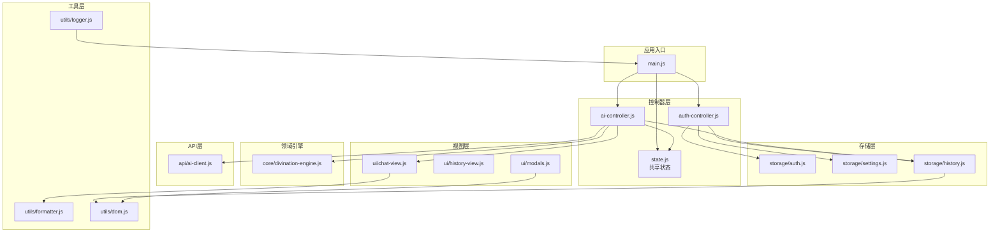
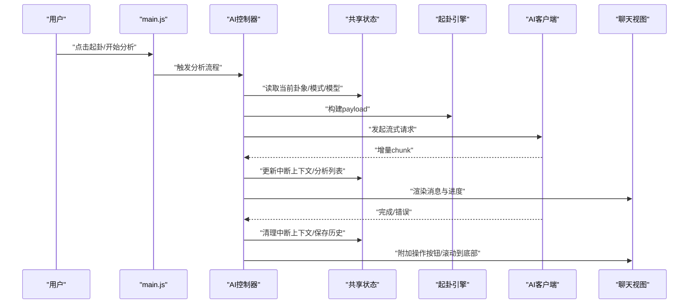
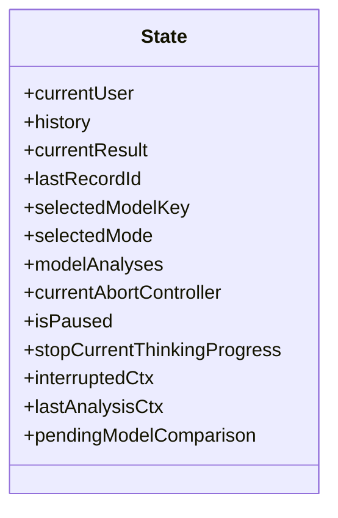
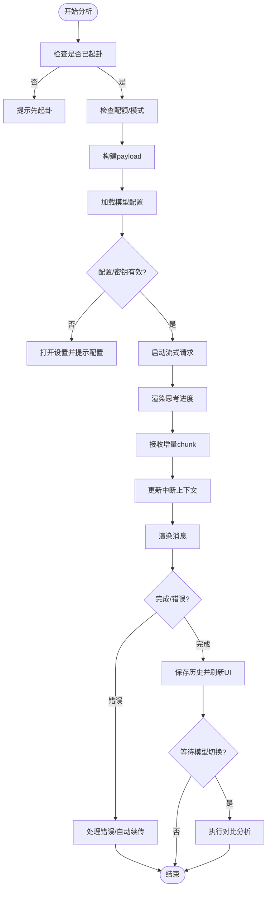
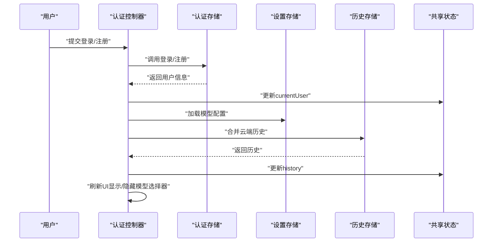
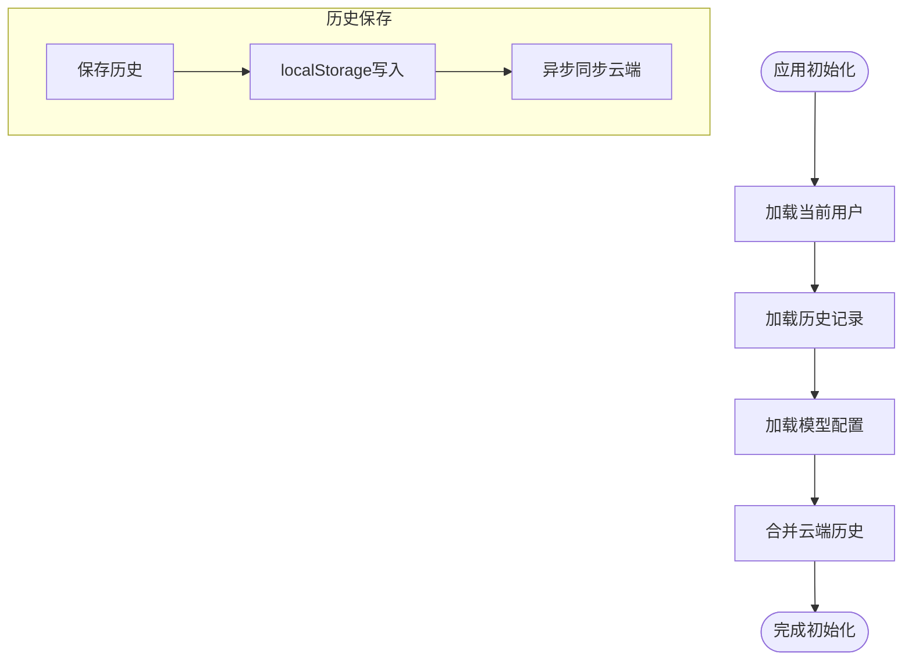
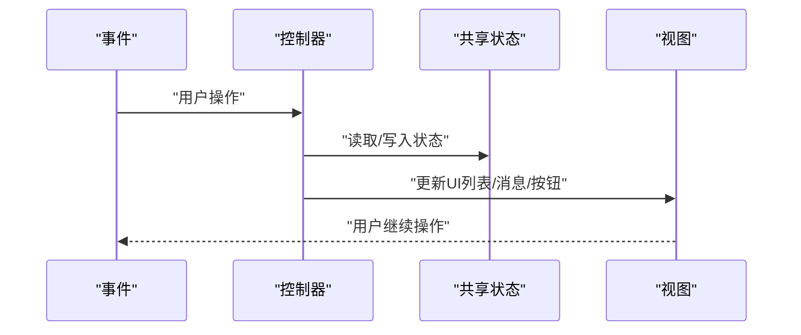
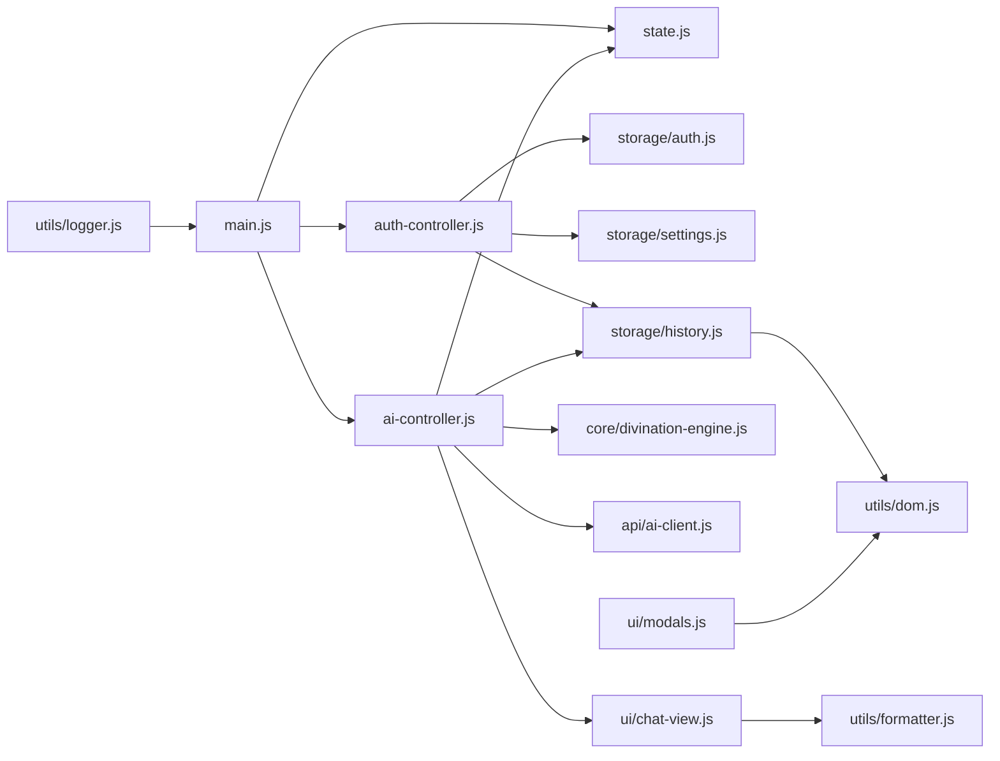

# 状态管理系统

<cite>
**本文档引用的文件**
- [src/controllers/state.js](file://src/controllers/state.js)
- [src/main.js](file://src/main.js)
- [src/controllers/ai-controller.js](file://src/controllers/ai-controller.js)
- [src/controllers/auth-controller.js](file://src/controllers/auth-controller.js)
- [src/storage/auth.js](file://src/storage/auth.js)
- [src/storage/settings.js](file://src/storage/settings.js)
- [src/storage/history.js](file://src/storage/history.js)
- [src/api/ai-client.js](file://src/api/ai-client.js)
- [src/utils/logger.js](file://src/utils/logger.js)
- [src/utils/formatter.js](file://src/utils/formatter.js)
- [src/core/divination-engine.js](file://src/core/divination-engine.js)
- [src/ui/chat-view.js](file://src/ui/chat-view.js)
- [src/ui/history-view.js](file://src/ui/history-view.js)
- [src/ui/modals.js](file://src/ui/modals.js)
- [src/utils/dom.js](file://src/utils/dom.js)
</cite>

## 目录
1. [简介](#简介)
2. [项目结构](#项目结构)
3. [核心组件](#核心组件)
4. [架构总览](#架构总览)
5. [详细组件分析](#详细组件分析)
6. [依赖关系分析](#依赖关系分析)
7. [性能考虑](#性能考虑)
8. [故障排查指南](#故障排查指南)
9. [结论](#结论)
10. [附录](#附录)

## 简介
本项目采用“共享状态对象 + 控制器驱动”的轻量级状态管理模式。全局状态集中于单一共享对象，控制器通过直接读写该状态协调业务流程，UI 层通过事件回调与控制器交互，形成清晰的单向数据流。状态持久化采用本地存储与云端同步相结合的策略，确保用户在不同设备与会话间保持一致体验。

## 项目结构
项目采用按职责分层的组织方式：
- controllers：业务控制器，负责协调状态与UI交互
- storage：数据持久化与云端同步
- api：外部服务客户端（AI流式接口）
- core：领域引擎（起卦与推演）
- ui：视图与交互
- utils：通用工具与DOM助手
- main.js：应用入口与初始化

**图表来源**
- [src/main.js:167-249](file://src/main.js#L167-L249)
- [src/controllers/state.js:5-21](file://src/controllers/state.js#L5-L21)
- [src/controllers/ai-controller.js:24-112](file://src/controllers/ai-controller.js#L24-L112)
- [src/controllers/auth-controller.js:171-245](file://src/controllers/auth-controller.js#L171-L245)
- [src/storage/auth.js:183-217](file://src/storage/auth.js#L183-L217)
- [src/storage/settings.js:75-85](file://src/storage/settings.js#L75-L85)
- [src/storage/history.js:15-45](file://src/storage/history.js#L15-L45)
- [src/api/ai-client.js:31-76](file://src/api/ai-client.js#L31-L76)
- [src/core/divination-engine.js:23-201](file://src/core/divination-engine.js#L23-L201)
- [src/ui/chat-view.js:7-42](file://src/ui/chat-view.js#L7-L42)
- [src/ui/history-view.js:7-33](file://src/ui/history-view.js#L7-L33)
- [src/ui/modals.js:11-32](file://src/ui/modals.js#L11-L32)
- [src/utils/formatter.js:61-91](file://src/utils/formatter.js#L61-L91)
- [src/utils/dom.js:17-40](file://src/utils/dom.js#L17-L40)
- [src/utils/logger.js:14-31](file://src/utils/logger.js#L14-L31)

**章节来源**
- [src/main.js:167-249](file://src/main.js#L167-L249)
- [src/controllers/state.js:5-21](file://src/controllers/state.js#L5-L21)

## 核心组件
- 共享状态对象：集中存放用户、历史、当前分析结果、模型选择、运行控制等全局状态
- 控制器层：AI控制器与认证控制器分别处理AI分析与用户认证流程
- 存储层：用户认证、模型配置、历史记录与云端同步
- 领域引擎：起卦与推演逻辑，构建分析payload
- 视图层：聊天消息、历史列表、模态框等UI组件
- 工具层：DOM助手、格式化、日志

**章节来源**
- [src/controllers/state.js:5-21](file://src/controllers/state.js#L5-L21)
- [src/controllers/ai-controller.js:24-112](file://src/controllers/ai-controller.js#L24-L112)
- [src/controllers/auth-controller.js:171-245](file://src/controllers/auth-controller.js#L171-L245)
- [src/storage/auth.js:183-217](file://src/storage/auth.js#L183-L217)
- [src/storage/settings.js:75-85](file://src/storage/settings.js#L75-L85)
- [src/storage/history.js:15-45](file://src/storage/history.js#L15-L45)
- [src/api/ai-client.js:31-76](file://src/api/ai-client.js#L31-L76)
- [src/core/divination-engine.js:297-346](file://src/core/divination-engine.js#L297-L346)
- [src/ui/chat-view.js:7-42](file://src/ui/chat-view.js#L7-L42)
- [src/ui/history-view.js:7-33](file://src/ui/history-view.js#L7-L33)
- [src/ui/modals.js:11-32](file://src/ui/modals.js#L11-L32)
- [src/utils/formatter.js:61-91](file://src/utils/formatter.js#L61-L91)
- [src/utils/dom.js:17-40](file://src/utils/dom.js#L17-L40)
- [src/utils/logger.js:14-31](file://src/utils/logger.js#L14-L31)

## 架构总览
系统采用“入口初始化 + 控制器驱动 + 视图渲染”的单向数据流：
- 入口负责初始化UI、加载持久化数据、绑定事件
- 控制器读取/写入共享状态，协调引擎与API
- 视图层通过事件回调触发控制器，控制器更新状态并驱动UI刷新
- 存储层负责本地与云端的数据持久化与同步

**图表来源**
- [src/main.js:296-554](file://src/main.js#L296-L554)
- [src/controllers/ai-controller.js:24-112](file://src/controllers/ai-controller.js#L24-L112)
- [src/controllers/state.js:5-21](file://src/controllers/state.js#L5-L21)
- [src/core/divination-engine.js:297-346](file://src/core/divination-engine.js#L297-L346)
- [src/api/ai-client.js:31-76](file://src/api/ai-client.js#L31-L76)
- [src/ui/chat-view.js:7-42](file://src/ui/chat-view.js#L7-L42)

## 详细组件分析

### 共享状态对象
- 职责：集中存放应用全局状态，供所有控制器访问
- 关键字段：当前用户、历史记录、当前分析结果、模型选择、运行控制（暂停/中断/继续）、比较标记等
- 访问方式：直接导入共享对象，控制器通过读写字段驱动流程

**图表来源**
- [src/controllers/state.js:5-21](file://src/controllers/state.js#L5-L21)

**章节来源**
- [src/controllers/state.js:5-21](file://src/controllers/state.js#L5-L21)

### AI控制器（状态驱动的分析流程）
- 职责：协调模型选择、权限检查、配额控制、流式请求、中断/继续、历史保存与UI更新
- 关键流程：
  - 权限与模式：根据用户权限设置分析模式，并限制普通用户的模型选择
  - 配额控制：新起卦扣减额度，追问不扣
  - 流式处理：启动思考进度、接收增量chunk、渲染消息、保存分析记录
  - 中断/继续：保存部分结果，支持继续分析与自动续传
  - 历史保存：本地持久化与云端同步
  - 模型对比：在分析完成后触发对比分析

**图表来源**
- [src/controllers/ai-controller.js:24-112](file://src/controllers/ai-controller.js#L24-L112)
- [src/controllers/ai-controller.js:203-524](file://src/controllers/ai-controller.js#L203-L524)
- [src/controllers/state.js:5-21](file://src/controllers/state.js#L5-L21)
- [src/storage/history.js:26-45](file://src/storage/history.js#L26-L45)

**章节来源**
- [src/controllers/ai-controller.js:24-112](file://src/controllers/ai-controller.js#L24-L112)
- [src/controllers/ai-controller.js:203-524](file://src/controllers/ai-controller.js#L203-L524)

### 认证控制器（用户态与权限）
- 职责：处理登录/注册/登出、权限检测、额度查询、VIP兑换、重置密码、个人面板
- 关键点：根据权限动态显示/隐藏模型选择器；登录后合并云端历史；登出时清理状态

**图表来源**
- [src/controllers/auth-controller.js:251-310](file://src/controllers/auth-controller.js#L251-L310)
- [src/controllers/auth-controller.js:171-245](file://src/controllers/auth-controller.js#L171-L245)
- [src/storage/auth.js:183-217](file://src/storage/auth.js#L183-L217)
- [src/storage/settings.js:75-85](file://src/storage/settings.js#L75-L85)
- [src/storage/history.js:75-102](file://src/storage/history.js#L75-L102)
- [src/controllers/state.js:5-21](file://src/controllers/state.js#L5-L21)

**章节来源**
- [src/controllers/auth-controller.js:251-310](file://src/controllers/auth-controller.js#L251-L310)
- [src/controllers/auth-controller.js:171-245](file://src/controllers/auth-controller.js#L171-L245)

### 数据持久化与恢复
- 用户认证：本地缓存当前用户，同时支持服务器会话恢复
- 模型配置：本地存储API密钥与端点，支持内置密钥兜底
- 历史记录：本地localStorage存储，上限50条；超出时自动裁剪；异步同步云端
- 云端合并：登录后从服务器拉取历史，去重合并，保持本地与云端一致

**图表来源**
- [src/main.js:167-249](file://src/main.js#L167-L249)
- [src/storage/auth.js:183-217](file://src/storage/auth.js#L183-L217)
- [src/storage/history.js:15-45](file://src/storage/history.js#L15-L45)
- [src/storage/history.js:75-102](file://src/storage/history.js#L75-L102)
- [src/storage/settings.js:38-85](file://src/storage/settings.js#L38-L85)

**章节来源**
- [src/main.js:167-249](file://src/main.js#L167-L249)
- [src/storage/auth.js:183-217](file://src/storage/auth.js#L183-L217)
- [src/storage/history.js:15-45](file://src/storage/history.js#L15-L45)
- [src/storage/history.js:75-102](file://src/storage/history.js#L75-L102)
- [src/storage/settings.js:38-85](file://src/storage/settings.js#L38-L85)

### 响应式更新与UI联动
- 事件驱动：入口绑定各类事件，触发控制器处理
- 状态驱动：控制器更新共享状态，驱动UI刷新（历史列表、聊天消息、模型选择器等）
- 流式渲染：AI流式响应期间持续更新消息与进度，结束时附加操作按钮并滚动到底部

**图表来源**
- [src/main.js:296-554](file://src/main.js#L296-L554)
- [src/ui/chat-view.js:7-42](file://src/ui/chat-view.js#L7-L42)
- [src/ui/history-view.js:7-33](file://src/ui/history-view.js#L7-L33)

**章节来源**
- [src/main.js:296-554](file://src/main.js#L296-L554)
- [src/ui/chat-view.js:7-42](file://src/ui/chat-view.js#L7-L42)
- [src/ui/history-view.js:7-33](file://src/ui/history-view.js#L7-L33)

### 模块化与命名空间
- 模块边界：控制器、存储、引擎、视图、工具各自职责清晰，通过共享状态耦合
- 命名空间：控制器与存储文件名明确表达职责；视图与工具提供统一接口
- 跨模块通信：控制器作为中介，通过共享状态与存储/引擎/视图交互

**章节来源**
- [src/controllers/ai-controller.js:24-112](file://src/controllers/ai-controller.js#L24-L112)
- [src/controllers/auth-controller.js:171-245](file://src/controllers/auth-controller.js#L171-L245)
- [src/storage/auth.js:183-217](file://src/storage/auth.js#L183-L217)
- [src/storage/history.js:15-45](file://src/storage/history.js#L15-L45)
- [src/core/divination-engine.js:297-346](file://src/core/divination-engine.js#L297-L346)

## 依赖关系分析

**图表来源**
- [src/main.js:24-46](file://src/main.js#L24-L46)
- [src/controllers/ai-controller.js:1-17](file://src/controllers/ai-controller.js#L1-L17)
- [src/controllers/auth-controller.js:1-9](file://src/controllers/auth-controller.js#L1-L9)
- [src/storage/auth.js:1-8](file://src/storage/auth.js#L1-L8)
- [src/storage/settings.js:1-86](file://src/storage/settings.js#L1-L86)
- [src/storage/history.js:1-143](file://src/storage/history.js#L1-L143)
- [src/api/ai-client.js:1-185](file://src/api/ai-client.js#L1-L185)
- [src/core/divination-engine.js:1-433](file://src/core/divination-engine.js#L1-L433)
- [src/ui/chat-view.js:1-114](file://src/ui/chat-view.js#L1-L114)
- [src/ui/history-view.js:1-168](file://src/ui/history-view.js#L1-L168)
- [src/ui/modals.js:1-57](file://src/ui/modals.js#L1-L57)
- [src/utils/formatter.js:1-92](file://src/utils/formatter.js#L1-L92)
- [src/utils/dom.js:1-41](file://src/utils/dom.js#L1-L41)
- [src/utils/logger.js:1-34](file://src/utils/logger.js#L1-L34)

**章节来源**
- [src/main.js:24-46](file://src/main.js#L24-L46)
- [src/controllers/ai-controller.js:1-17](file://src/controllers/ai-controller.js#L1-L17)
- [src/controllers/auth-controller.js:1-9](file://src/controllers/auth-controller.js#L1-L9)

## 性能考虑
- 流式渲染：AI响应采用流式增量渲染，避免一次性渲染大量内容，提升首帧与交互流畅度
- 进度模拟：思考进度条与百分比模拟，改善长尾等待体验
- 存储裁剪：历史记录与反馈存储在容量接近阈值时自动裁剪，降低失败概率
- 事件节流/防抖：滚动与窗口尺寸变化采用节流/防抖，减少不必要的重排与重绘
- 代理模式：支持代理模式，避免前端暴露密钥，提升安全性与稳定性

**章节来源**
- [src/api/ai-client.js:22-25](file://src/api/ai-client.js#L22-L25)
- [src/controllers/ai-controller.js:242-277](file://src/controllers/ai-controller.js#L242-L277)
- [src/storage/history.js:33-42](file://src/storage/history.js#L33-L42)
- [src/main.js:357-371](file://src/main.js#L357-L371)

## 故障排查指南
- 流式错误与自动续传：网络波动时自动续传一次，减少用户手动点击“继续”
- 错误提示与建议：根据代理/直连模式给出针对性建议
- 存储异常：容量不足时自动裁剪旧记录；失败时提示清理或重试
- 日志分级：生产环境仅输出warn及以上级别日志，便于定位问题

**章节来源**
- [src/controllers/ai-controller.js:478-522](file://src/controllers/ai-controller.js#L478-L522)
- [src/storage/history.js:33-42](file://src/storage/history.js#L33-L42)
- [src/utils/logger.js:14-31](file://src/utils/logger.js#L14-L31)

## 结论
本状态管理系统以共享状态为核心，通过控制器解耦业务逻辑与UI交互，配合本地与云端持久化策略，实现了稳定、可维护的状态管理。流式渲染与进度模拟提升了用户体验，权限与配额控制保障了资源合理使用。建议在后续迭代中引入更细粒度的状态订阅与调试工具，进一步增强可观测性与可维护性。

## 附录

### 状态操作API（使用规范）
- 读取状态
  - 读取当前用户：从共享状态读取当前用户信息
  - 读取历史记录：从共享状态读取历史数组
  - 读取当前分析结果：从共享状态读取当前卦象结果
  - 读取模型选择：从共享状态读取当前模型键
  - 读取分析模式：从共享状态读取当前模式（简化/专业）
- 写入状态
  - 设置当前用户：登录/登出时更新当前用户
  - 更新历史记录：新增/删除记录后更新历史数组
  - 更新当前分析结果：起卦或分析完成后更新结果
  - 切换模型：用户选择模型时更新模型键
  - 更新分析模式：根据权限与场景更新模式
  - 中断/继续上下文：流式过程中更新中断上下文
- 监听与清理
  - 监听模型切换：切换模型时触发对比分析
  - 清理中断上下文：分析完成后清理中断上下文
  - 清理定时器：停止思考进度定时器
- 与存储交互
  - 读取/保存用户：从本地存储读取当前用户，登录后缓存
  - 读取/保存模型配置：从本地存储读取/保存模型配置
  - 读取/保存历史：从本地存储读取/保存历史，异步同步云端
  - 合并云端历史：登录后从服务器拉取历史并去重合并

**章节来源**
- [src/controllers/state.js:5-21](file://src/controllers/state.js#L5-L21)
- [src/controllers/ai-controller.js:24-112](file://src/controllers/ai-controller.js#L24-L112)
- [src/controllers/auth-controller.js:171-245](file://src/controllers/auth-controller.js#L171-L245)
- [src/storage/auth.js:183-217](file://src/storage/auth.js#L183-L217)
- [src/storage/settings.js:75-85](file://src/storage/settings.js#L75-L85)
- [src/storage/history.js:15-45](file://src/storage/history.js#L15-L45)
- [src/storage/history.js:75-102](file://src/storage/history.js#L75-L102)