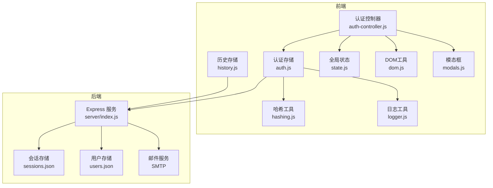
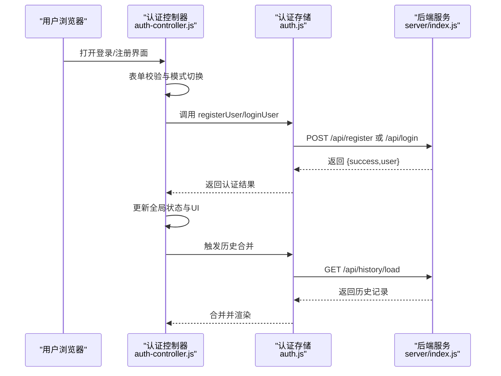
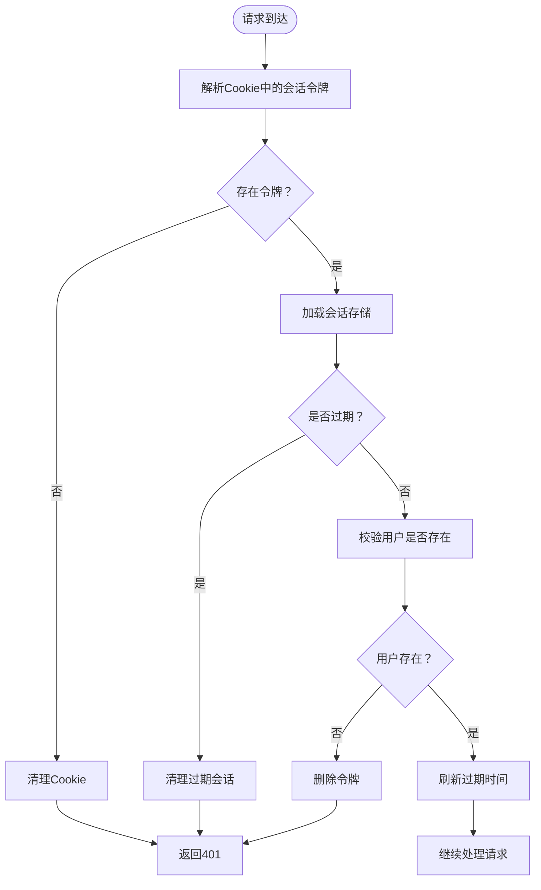
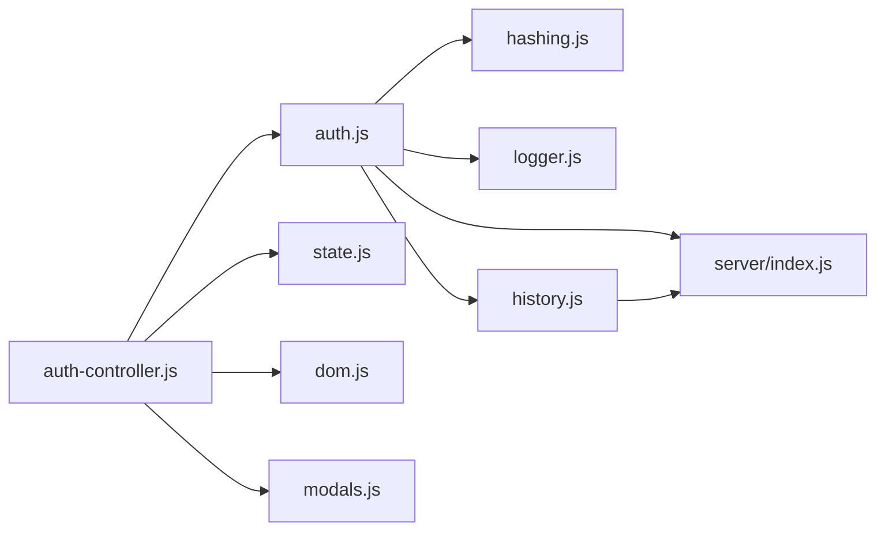

# 认证系统

<cite>
**本文引用的文件**
- [auth-controller.js](file://src/controllers/auth-controller.js)
- [auth.js](file://src/storage/auth.js)
- [hashing.js](file://src/utils/hashing.js)
- [logger.js](file://src/utils/logger.js)
- [index.js](file://server/index.js)
- [state.js](file://src/controllers/state.js)
- [modals.js](file://src/ui/modals.js)
- [dom.js](file://src/utils/dom.js)
- [history.js](file://src/storage/history.js)
- [storage.test.js](file://__tests__/storage.test.js)
</cite>

## 目录
1. [简介](#简介)
2. [项目结构](#项目结构)
3. [核心组件](#核心组件)
4. [架构总览](#架构总览)
5. [详细组件分析](#详细组件分析)
6. [依赖关系分析](#依赖关系分析)
7. [性能考量](#性能考量)
8. [故障排查指南](#故障排查指南)
9. [结论](#结论)
10. [附录](#附录)

## 简介
本文件面向“认证系统”的安全技术文档，聚焦用户注册、登录、会话管理、密码哈希与令牌机制、权限控制与状态管理、用户数据保护策略，以及完整的API接口定义与安全最佳实践。系统采用前后端分离设计：前端负责UI交互与本地状态管理，后端提供REST API与会话持久化，密码采用本地哈希策略，会话通过HTTP Cookie实现。

## 项目结构
- 前端控制器与状态
  - 认证控制器：处理登录/注册/登出、密码找回、个人面板等交互逻辑
  - 存储模块：封装用户认证、历史记录、设置等数据访问
  - 工具模块：密码哈希、日志、DOM辅助
  - UI模块：模态框、提示等
- 后端服务
  - Express 服务：提供认证、会话、历史、代理等API
  - 会话存储：基于文件的JSON会话表，配合HTTP Cookie
  - 邮件服务：用于验证码发送

图表来源
- [auth-controller.js:1-592](file://src/controllers/auth-controller.js#L1-L592)
- [auth.js:1-350](file://src/storage/auth.js#L1-L350)
- [hashing.js:1-20](file://src/utils/hashing.js#L1-L20)
- [logger.js:1-34](file://src/utils/logger.js#L1-L34)
- [index.js:1-668](file://server/index.js#L1-L668)
- [history.js:1-143](file://src/storage/history.js#L1-L143)
- [state.js:1-24](file://src/controllers/state.js#L1-L24)
- [modals.js:1-57](file://src/ui/modals.js#L1-L57)
- [dom.js:1-41](file://src/utils/dom.js#L1-L41)

章节来源
- [auth-controller.js:1-592](file://src/controllers/auth-controller.js#L1-L592)
- [auth.js:1-350](file://src/storage/auth.js#L1-L350)
- [index.js:1-668](file://server/index.js#L1-L668)

## 核心组件
- 认证控制器（前端）
  - 负责表单切换、输入校验、提交处理、登出、密码找回、个人面板等
  - 与全局状态对象协作，驱动UI更新与历史加载
- 认证存储（前端）
  - 封装登录/注册/登出/找回密码等API调用
  - 本地缓存已注册用户与当前用户，支持服务器不可用时的回退
  - 使用密码哈希工具进行本地哈希
- 会话与权限（后端）
  - 基于随机令牌的会话机制，存储在文件中
  - 提供会话校验、注销、管理员统计、历史读写等接口
  - 会话Cookie采用HttpOnly/Secure/SameSite/Lax，提升安全性
- 密码哈希与日志
  - 前端使用自定义哈希函数，后端存储哈希值
  - 日志工具按级别输出，生产环境默认仅输出警告及以上

章节来源
- [auth-controller.js:251-310](file://src/controllers/auth-controller.js#L251-L310)
- [auth.js:46-125](file://src/storage/auth.js#L46-L125)
- [index.js:177-242](file://server/index.js#L177-L242)
- [hashing.js:4-19](file://src/utils/hashing.js#L4-L19)
- [logger.js:14-31](file://src/utils/logger.js#L14-L31)

## 架构总览
系统采用“前端SPA + 后端REST API + 文件会话存储”的架构。前端通过fetch与后端交互，携带Cookie进行会话认证；后端对用户凭据进行校验，签发会话令牌并持久化；历史与反馈数据同时支持本地与云端同步。

图表来源
- [auth-controller.js:251-310](file://src/controllers/auth-controller.js#L251-L310)
- [auth.js:89-125](file://src/storage/auth.js#L89-L125)
- [index.js:279-338](file://server/index.js#L279-L338)

## 详细组件分析

### 认证控制器（业务逻辑与UI）
- 功能要点
  - 登录/注册模式切换、输入校验（用户名长度/字符集、密码长度）、二次确认
  - 自动注册：登录时若用户不存在，自动切换到注册模式并提示确认密码
  - 登出：清除本地状态与持久化，触发UI更新与历史重置
  - 密码找回：发送验证码（邮箱脱敏显示）、重置密码
  - 个人面板：绑定邮箱、管理员统计、重置他人密码、修改密码
- 安全注意
  - 输入校验在前端执行，后端同样进行严格校验与错误码返回
  - 邮箱绑定与验证码发送均进行格式校验与频率限制
  - 登录成功后设置会话Cookie，登出时清理

章节来源
- [auth-controller.js:141-169](file://src/controllers/auth-controller.js#L141-L169)
- [auth-controller.js:251-310](file://src/controllers/auth-controller.js#L251-L310)
- [auth-controller.js:337-428](file://src/controllers/auth-controller.js#L337-L428)
- [auth-controller.js:430-591](file://src/controllers/auth-controller.js#L430-L591)

### 认证存储（前端API封装）
- 功能要点
  - 登录/注册：优先调用后端，失败时回退到本地localStorage缓存
  - 会话恢复：启动时尝试恢复服务器会话，否则使用本地缓存
  - 密码找回：发送验证码、重置密码、绑定邮箱
  - 权限与额度：管理员白名单、VIP兑换、每日额度计算
- 错误处理
  - 网络异常时记录警告日志，保证基本可用性
  - 返回统一的错误码与消息，便于前端展示

章节来源
- [auth.js:46-125](file://src/storage/auth.js#L46-L125)
- [auth.js:127-181](file://src/storage/auth.js#L127-L181)
- [auth.js:194-225](file://src/storage/auth.js#L194-L225)
- [auth.js:232-350](file://src/storage/auth.js#L232-L350)

### 会话管理（后端）
- 会话令牌
  - 使用随机字节生成令牌，存储在sessions.json中，包含创建时间与过期时间
  - 会话Cookie采用HttpOnly/Secure/SameSite/Lax，maxAge为180天
- 会话校验
  - 解析Cookie中的令牌，校验是否存在且未过期
  - 访问受保护资源时，要求会话用户与资源所属用户一致
- 注销
  - 删除对应令牌并清理Cookie

图表来源
- [index.js:177-242](file://server/index.js#L177-L242)
- [index.js:244-264](file://server/index.js#L244-L264)

章节来源
- [index.js:108-242](file://server/index.js#L108-L242)
- [index.js:244-264](file://server/index.js#L244-L264)

### 密码哈希与令牌生成
- 密码哈希
  - 前端使用自定义哈希函数，对原始密码加固定盐后进行循环计算，输出字符串
  - 后端存储哈希值，登录时比较哈希
- 令牌生成
  - 会话令牌使用随机字节生成，确保唯一性与不可预测性
- 安全建议
  - 当前哈希算法为快速哈希，建议升级为现代密码学哈希（如bcrypt/scrypt/argon2）以抵御彩虹表与暴力破解
  - 令牌长度与熵足够，建议定期轮换会话令牌

章节来源
- [hashing.js:4-19](file://src/utils/hashing.js#L4-L19)
- [index.js:177-188](file://server/index.js#L177-L188)

### 权限控制与状态管理
- 权限
  - 管理员白名单（当前阶段）决定是否显示高级功能
  - 后续可扩展为订阅状态校验
- 状态
  - 全局状态对象维护当前用户、历史、模型选择等
  - 认证控制器根据状态更新UI与功能可见性

章节来源
- [auth.js:232-247](file://src/storage/auth.js#L232-L247)
- [state.js:5-21](file://src/controllers/state.js#L5-L21)
- [auth-controller.js:171-245](file://src/controllers/auth-controller.js#L171-L245)

### 用户数据保护策略
- 敏感信息
  - 密码仅以哈希形式存储；邮箱在验证码发送时进行脱敏显示
- 访问日志
  - 服务器对关键操作（注册、登录、密码重置、绑定邮箱）输出日志
- 审计功能
  - 历史与反馈数据本地存储，支持云端同步与去重合并
- 防重放与风控
  - 验证码发送频率限制（同一邮箱60秒内仅一次）
  - 验证码错误最多尝试5次，超过则清空并禁止继续

章节来源
- [index.js:423-451](file://server/index.js#L423-L451)
- [index.js:454-487](file://server/index.js#L454-L487)
- [history.js:64-102](file://src/storage/history.js#L64-L102)

### API 接口文档

- 通用约定
  - 基础URL：https://api.meihuayili.com
  - Content-Type：application/json
  - 会话：使用Cookie（meihua_session），携带credentials: include
  - 成功响应：{ success: true, ... }
  - 失败响应：{ error: string, code?: string }

- 注册
  - 方法：POST /api/register
  - 请求体
    - name: string（已标准化为小写）
    - passwordHash: string（前端哈希后的密码）
    - email?: string（可选）
  - 响应
    - 成功：{ success: true, user: { name } }
    - 失败：{ error: string, code?: "USER_EXISTS" }

- 登录
  - 方法：POST /api/login
  - 请求体
    - name: string（已标准化为小写）
    - passwordHash: string（前端哈希后的密码）
  - 响应
    - 成功：{ success: true, user: { name, hasEmail } }
    - 失败：{ error: string, code: "USER_NOT_FOUND"|"WRONG_PASSWORD" }

- 会话状态
  - 方法：GET /api/session/current
  - 响应
    - 成功：{ success: true, user: { name, hasEmail } }
    - 失败：{ success: false }

- 登出
  - 方法：POST /api/logout
  - 响应：{ success: true }

- 绑定邮箱
  - 方法：POST /api/bind-email
  - 请求体
    - name: string（已标准化为小写）
    - email: string（邮箱格式校验）
  - 响应：{ success: true }

- 修改密码
  - 方法：POST /api/change-password
  - 请求体
    - name: string（已标准化为小写）
    - oldPasswordHash: string
    - newPasswordHash: string
  - 响应：{ success: true }

- 管理员重置密码
  - 方法：POST /api/admin/reset-password
  - 请求体
    - admin: string（管理员白名单校验）
    - targetUser: string（已标准化为小写）
    - newPasswordHash: string
  - 响应：{ success: true }

- 发送验证码（忘记密码）
  - 方法：POST /api/send-code
  - 请求体
    - name: string（已标准化为小写）
  - 响应
    - 成功：{ success: true, maskedEmail: string }
    - 失败：{ error: string }

- 验证码重置密码
  - 方法：POST /api/reset-password
  - 请求体
    - name: string（已标准化为小写）
    - code: string
    - newPasswordHash: string
  - 响应：{ success: true }

- 历史记录
  - 保存
    - 方法：POST /api/history/save
    - 请求体：{ username: string, records: any[] }
    - 响应：{ success: true }
  - 读取
    - 方法：GET /api/history/load?username={name}
    - 响应：{ success: true, records: any[] }

章节来源
- [auth.js:89-181](file://src/storage/auth.js#L89-L181)
- [index.js:279-487](file://server/index.js#L279-L487)
- [history.js:64-102](file://src/storage/history.js#L64-L102)

## 依赖关系分析

图表来源
- [auth-controller.js:1-10](file://src/controllers/auth-controller.js#L1-L10)
- [auth.js:1-10](file://src/storage/auth.js#L1-L10)
- [hashing.js:1-20](file://src/utils/hashing.js#L1-L20)
- [logger.js:1-34](file://src/utils/logger.js#L1-L34)
- [history.js:1-10](file://src/storage/history.js#L1-L10)
- [index.js:1-668](file://server/index.js#L1-L668)

章节来源
- [auth-controller.js:1-10](file://src/controllers/auth-controller.js#L1-L10)
- [auth.js:1-10](file://src/storage/auth.js#L1-L10)

## 性能考量
- 会话存储
  - 会话与用户数据均以JSON文件存储，I/O开销可控；建议在高并发场景引入Redis等内存数据库
- 历史与反馈
  - 本地存储上限控制（历史50条、反馈30条），超出时自动裁剪，避免内存膨胀
- 网络回退
  - 前端在后端不可用时回退到本地缓存，保障基本可用性

## 故障排查指南
- 登录失败
  - 检查用户名/密码是否为空，是否符合长度与字符规则
  - 查看后端返回的错误码（USER_NOT_FOUND/WRONG_PASSWORD）
- 验证码问题
  - 验证码发送频率限制（60秒内仅一次）
  - 验证码错误最多尝试5次，超过则需重新发送
- 会话异常
  - 检查Cookie是否被清理，或会话是否过期
  - 服务器会话恢复失败时，前端会回退到本地缓存
- 日志定位
  - 生产环境默认仅输出警告及以上级别日志，可通过调整日志级别辅助排查

章节来源
- [auth-controller.js:251-310](file://src/controllers/auth-controller.js#L251-L310)
- [index.js:423-451](file://server/index.js#L423-L451)
- [index.js:321-338](file://server/index.js#L321-L338)
- [logger.js:14-31](file://src/utils/logger.js#L14-L31)

## 结论
该认证系统在前端与后端之间建立了清晰的职责边界：前端负责用户体验与本地状态，后端负责会话与数据安全。当前实现具备基础的会话管理、密码哈希与邮箱验证能力；建议在后续版本中引入更强的密码哈希算法、会话轮换与更完善的审计日志，以进一步提升安全性与可运维性。

## 附录

### 安全最佳实践清单
- 密码安全
  - 升级密码哈希算法至 bcrypt/scrypt/argon2
  - 引入密码强度策略与历史密码检查
- 会话安全
  - 启用HTTPS，强制使用Secure Cookie
  - 实施会话超时与主动轮换机制
  - 添加CSRF防护与SameSite严格策略
- 输入与传输
  - 严格校验与过滤所有输入，启用CSP与XSS防护
  - 对敏感字段（验证码、令牌）进行最小暴露原则
- 审计与监控
  - 记录关键操作日志，保留保留期限与合规性
  - 建立异常告警与访问追踪机制

### 常见威胁与缓解
- 穷举与暴力破解
  - 限制登录尝试次数，引入验证码与速率限制
- 会话劫持
  - 使用HttpOnly/Secure/SameSite Cookie，定期轮换令牌
- XSS与CSRF
  - 内容安全策略、同源策略、CSRF Token与SameSite严格模式
- 数据泄露
  - 最小化敏感数据存储，对邮箱等进行脱敏显示与传输