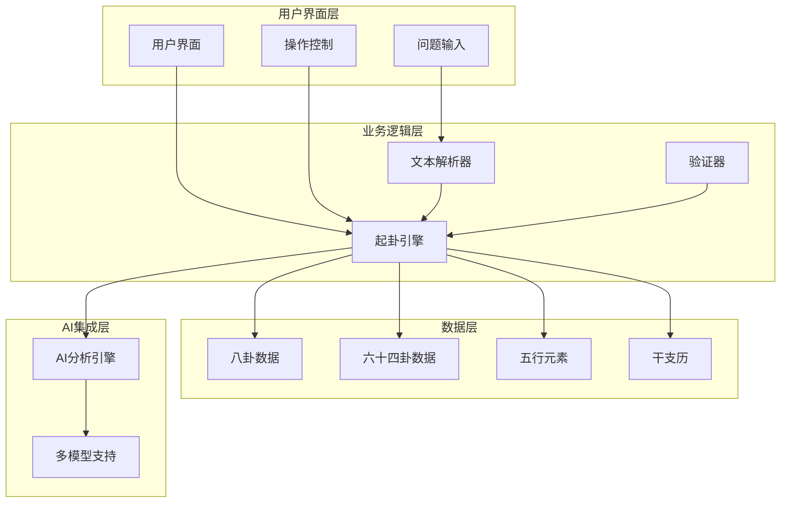
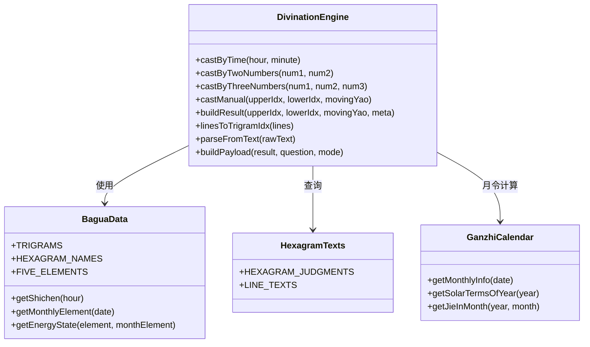
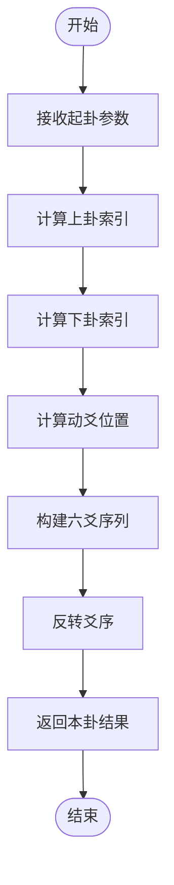
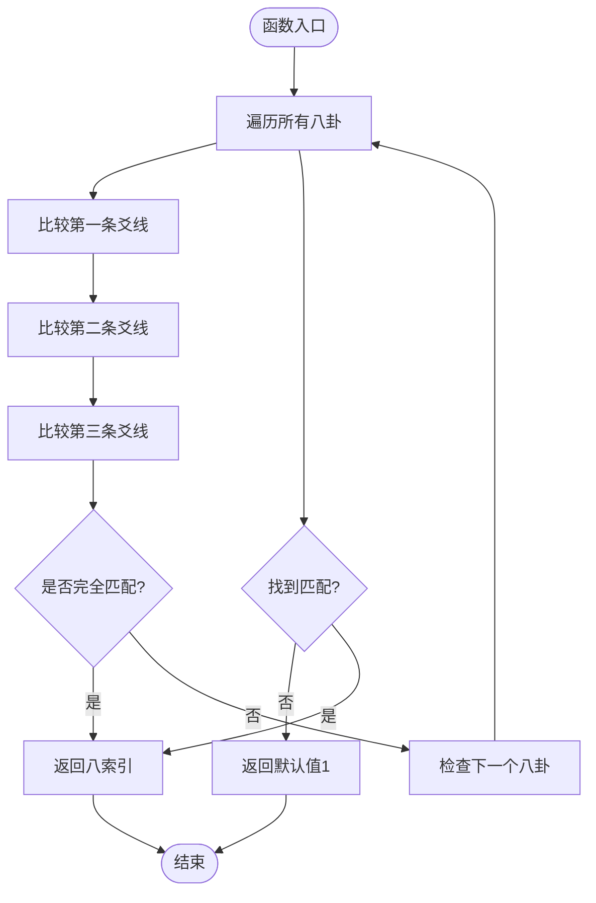
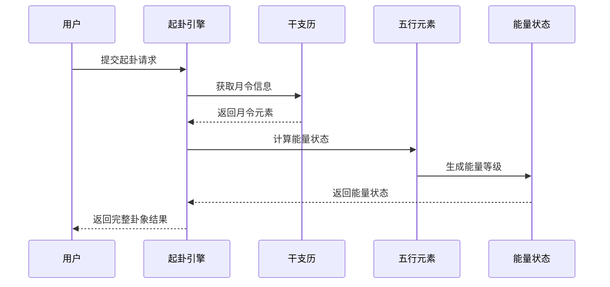
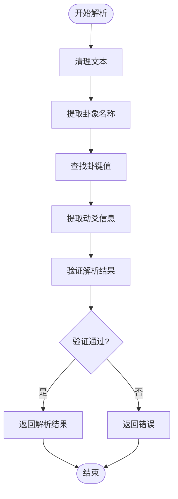
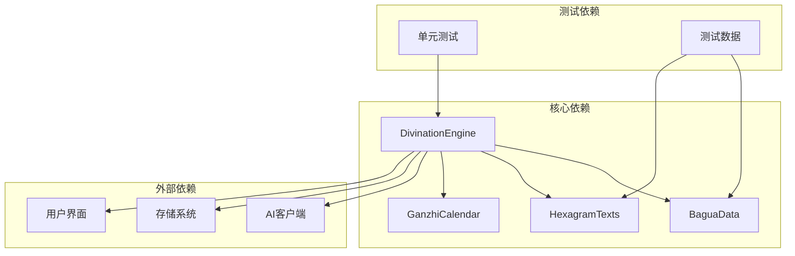

# 三卦联动计算

<cite>
**本文档引用的文件**
- [divination-engine.js](file://src/core/divination-engine.js)
- [bagua-data.js](file://src/core/bagua-data.js)
- [hexagram-texts.js](file://src/core/hexagram-texts.js)
- [ganzhi-calendar.js](file://src/core/ganzhi-calendar.js)
- [divination.test.js](file://__tests__/divination.test.js)
- [main.js](file://src/main.js)
- [index.html](file://index.html)
</cite>

## 目录
1. [项目概述](#项目概述)
2. [系统架构](#系统架构)
3. [核心组件](#核心组件)
4. [架构总览](#架构总览)
5. [详细组件分析](#详细组件分析)
6. [依赖关系分析](#依赖关系分析)
7. [性能考量](#性能考量)
8. [故障排除指南](#故障排除指南)
9. [结论](#结论)

## 项目概述

本项目是一个基于《周易》的三卦联动计算系统，实现了"本卦-变卦-对卦"的完整计算流程。系统支持多种起卦方式（时间起卦、报数起卦、手动选卦），并通过AI引擎提供深度义理解析。

系统的核心特色在于：
- **三卦联动算法**：同时计算本卦、变卦、对卦三个卦象
- **体用判定体系**：基于五行生克关系的体用关系分析
- **能量场分析**：结合月令状态的动态能量评估
- **智能文本解析**：支持从自然语言中提取卦象信息

## 系统架构



**图表来源**
- [divination-engine.js:1-433](file://src/core/divination-engine.js#L1-L433)
- [bagua-data.js:1-136](file://src/core/bagua-data.js#L1-L136)

## 核心组件

### 起卦引擎 (DivinationEngine)

起卦引擎是整个系统的核心，负责：
- 实现三种起卦模式的时间起卦、报数起卦、手动选卦
- 执行三卦联动计算：本卦、变卦、对卦
- 计算体用关系和能量状态
- 提供AI分析集成接口

### 八卦数据系统 (BaguaData)

管理八卦和六十四卦的基础数据：
- 八卦的基本属性（名称、性质、符号、五行属性、爻线序列）
- 六十四卦的名称映射
- 五行生克关系
- 月令计算功能

### 文本解析系统 (TextParser)

智能解析用户输入的自然语言：
- 从文本中提取卦象名称
- 解析动爻信息
- 支持多种命名方式（全名、简称、拼音首字母）

**章节来源**
- [divination-engine.js:23-433](file://src/core/divination-engine.js#L23-L433)
- [bagua-data.js:10-136](file://src/core/bagua-data.js#L10-L136)

## 架构总览

系统采用模块化设计，各组件职责清晰：



**图表来源**
- [divination-engine.js:23-433](file://src/core/divination-engine.js#L23-L433)
- [bagua-data.js:124-136](file://src/core/bagua-data.js#L124-L136)

## 详细组件分析

### 三卦联动计算算法

三卦联动计算是系统的核心算法，包含以下步骤：

#### 1. 本卦生成算法



**图表来源**
- [divination-engine.js:35-47](file://src/core/divination-engine.js#L35-L47)
- [divination-engine.js:104-109](file://src/core/divination-engine.js#L104-L109)

#### 2. 变卦生成算法

变卦是通过改变本卦的动爻来生成：
- 将本卦的动爻从阳爻变为阴爻，或从阴爻变为阳爻
- 保持其他五爻不变
- 重新计算上卦和下卦的组成

#### 3. 对卦生成算法

对卦（错卦）是通过将变卦的所有爻全部取反来生成：
- 阳爻变阴爻，阴爻变阳爻
- 保持其他五爻不变
- 重新计算上卦和下卦的组成

**章节来源**
- [divination-engine.js:104-118](file://src/core/divination-engine.js#L104-L118)

### linesToTrigramIdx 函数详解

`linesToTrigramIdx` 函数是三爻组合匹配的核心算法：



**算法特点**：
- **线性搜索**：对所有8个八卦进行逐一比较
- **精确匹配**：要求三条爻线完全相同
- **默认回退**：未找到匹配时返回1（乾卦）
- **时间复杂度**：O(1)，因为只有8个固定的八卦

**图表来源**
- [divination-engine.js:203-210](file://src/core/divination-engine.js#L203-L210)

**章节来源**
- [divination-engine.js:203-210](file://src/core/divination-engine.js#L203-L210)

### 体用关系计算

系统采用五行生克理论计算体用关系：

```mermaid
graph LR
subgraph "五行生克"
Metal[金] --> Water[水]
Wood[木] --> Fire[火]
Water[水] --> Earth[土]
Fire[火] --> Metal[金]
Earth[土] --> Wood[木]
Metal <- --> Metal[金]
Wood <- --> Wood[木]
Water <- --> Water[水]
Fire <- --> Fire[火]
Earth <- --> Earth[土]
end
subgraph "关系类型"
Metal --> Water[用生体]
Water --> Fire[体生用]
Wood --> Fire[体克用]
Fire --> Metal[用克体]
Earth --> Wood[平]
end
```

**关系判定逻辑**：
- **体用比和**：当体卦元素与用卦元素相同时
- **用生体**：当用卦元素能生助体卦元素时
- **体生用**：当体卦元素能生助用卦元素时
- **体克用**：当体卦元素能克制用卦元素时
- **用克体**：当用卦元素能克制体卦元素时
- **平**：其他情况

**章节来源**
- [divination-engine.js:153-160](file://src/core/divination-engine.js#L153-L160)
- [bagua-data.js:72-78](file://src/core/bagua-data.js#L72-L78)

### 能量场分析

系统结合月令状态进行动态能量评估：



**能量状态分类**：
- **旺**：元素与月令相同
- **相**：月令元素生助该元素
- **休**：该元素生助月令元素
- **囚**：该元素克制月令元素
- **死**：月令元素克制该元素

**图表来源**
- [divination-engine.js:137-148](file://src/core/divination-engine.js#L137-L148)
- [bagua-data.js:85-92](file://src/core/bagua-data.js#L85-L92)

**章节来源**
- [divination-engine.js:137-148](file://src/core/divination-engine.js#L137-L148)
- [bagua-data.js:85-92](file://src/core/bagua-data.js#L85-L92)

### 文本解析算法

系统支持从自然语言中智能解析卦象信息：



**解析策略**：
- **优先匹配**：使用全名映射表进行精确匹配
- **备用方案**：当全名匹配失败时，尝试双字符组合匹配
- **动爻解析**：支持中文数字和阿拉伯数字的动爻识别

**章节来源**
- [divination-engine.js:212-273](file://src/core/divination-engine.js#L212-L273)

## 依赖关系分析

系统采用松耦合的设计模式，主要依赖关系如下：



**依赖特点**：
- **单向依赖**：引擎依赖数据层，但数据层不依赖引擎
- **接口隔离**：通过明确的接口定义降低耦合度
- **可测试性**：良好的模块分离便于单元测试

**图表来源**
- [divination-engine.js:6-21](file://src/core/divination-engine.js#L6-L21)
- [divination.test.js:1-174](file://__tests__/divination.test.js#L1-L174)

**章节来源**
- [divination-engine.js:6-21](file://src/core/divination-engine.js#L6-L21)
- [divination.test.js:1-174](file://__tests__/divination.test.js#L1-L174)

## 性能考量

### 时间复杂度分析

- **linesToTrigramIdx**：O(1) - 固定8个八卦的线性搜索
- **buildResult**：O(1) - 固定的六爻操作和常数次计算
- **文本解析**：O(n) - n为文本长度，但通常很短
- **整体性能**：所有操作均为常数时间复杂度

### 空间复杂度分析

- **内存占用**：主要来自数据结构存储，O(1)额外空间
- **数据缓存**：干支历计算结果使用缓存机制
- **优化策略**：使用对象枚举和数组操作，避免不必要的内存分配

### 性能优化措施

1. **缓存机制**：干支历计算结果缓存在内存中
2. **早期返回**：文本解析遇到匹配立即返回
3. **就地修改**：使用数组就地修改减少内存分配
4. **常量优化**：将固定数据定义为常量避免重复计算

## 故障排除指南

### 常见问题及解决方案

#### 1. 起卦结果异常

**症状**：起卦结果不符合预期
**可能原因**：
- 输入参数超出范围
- 时区或日期计算错误
- 月令计算偏差

**解决方法**：
- 检查输入的时间参数
- 验证日期格式和有效性
- 确认系统时区设置

#### 2. 三卦联动计算错误

**症状**：变卦或对卦计算结果错误
**可能原因**：
- 动爻索引计算错误
- 爻线反转逻辑问题
- 八卦匹配算法异常

**解决方法**：
- 验证动爻位置的有效性（1-6）
- 检查爻线反转的边界条件
- 确认linesToTrigramIdx函数的匹配逻辑

#### 3. 文本解析失败

**症状**：无法从文本中解析卦象信息
**可能原因**：
- 卦象名称不匹配
- 动爻表达方式不规范
- 文本格式不符合预期

**解决方法**：
- 检查卦象名称的拼写
- 验证动爻表达的完整性
- 确认文本编码和格式

### 调试工具和技巧

#### 1. 日志记录

系统提供了完善的日志记录机制：
- 关键操作的详细日志
- 错误信息的堆栈跟踪
- 性能指标的监控

#### 2. 单元测试

完整的测试覆盖：
- 核心算法的功能测试
- 边界条件的异常测试
- 性能基准测试

**章节来源**
- [divination.test.js:5-174](file://__tests__/divination.test.js#L5-L174)

## 结论

三卦联动计算系统通过精心设计的算法和模块化架构，实现了高效准确的易学计算。系统的主要优势包括：

1. **算法严谨性**：基于传统易学理论的精确计算
2. **用户体验**：支持多种输入方式和智能解析
3. **扩展性**：模块化设计便于功能扩展
4. **可靠性**：完善的测试和错误处理机制

系统为现代用户提供了一个既保持传统智慧又具备现代技术特色的易学计算平台。通过持续的优化和改进，该系统能够为用户提供更加精准和深入的易学分析服务。