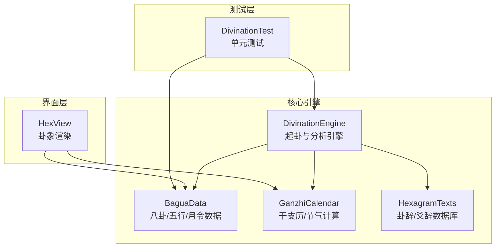
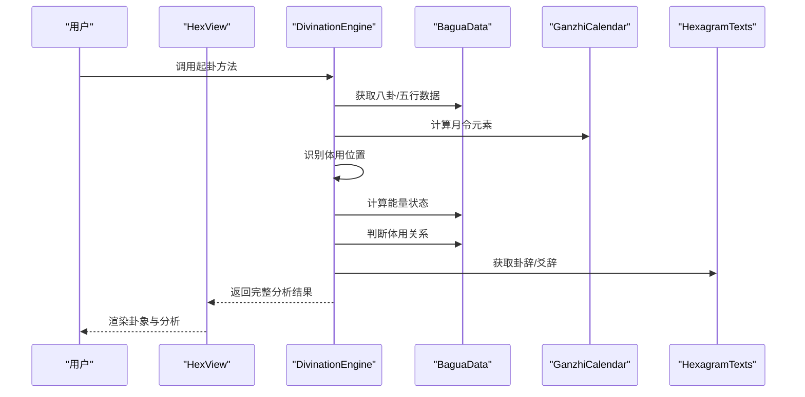
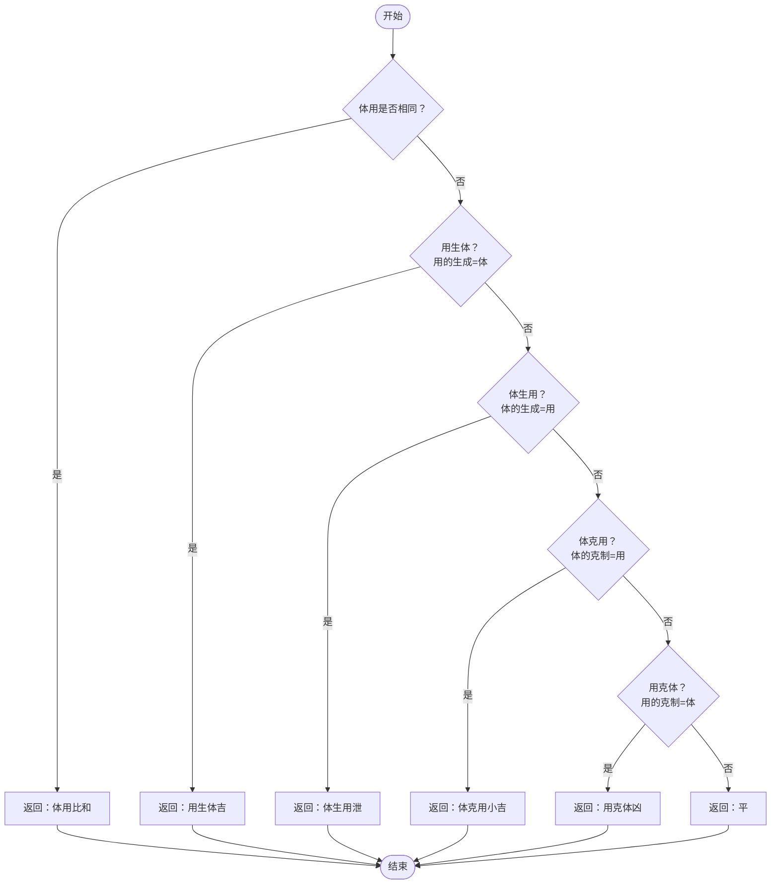
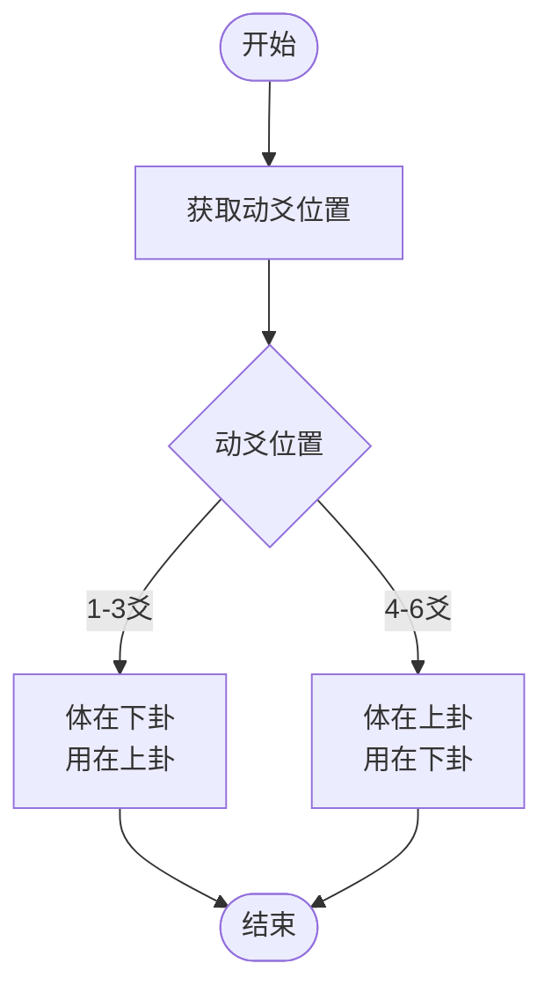
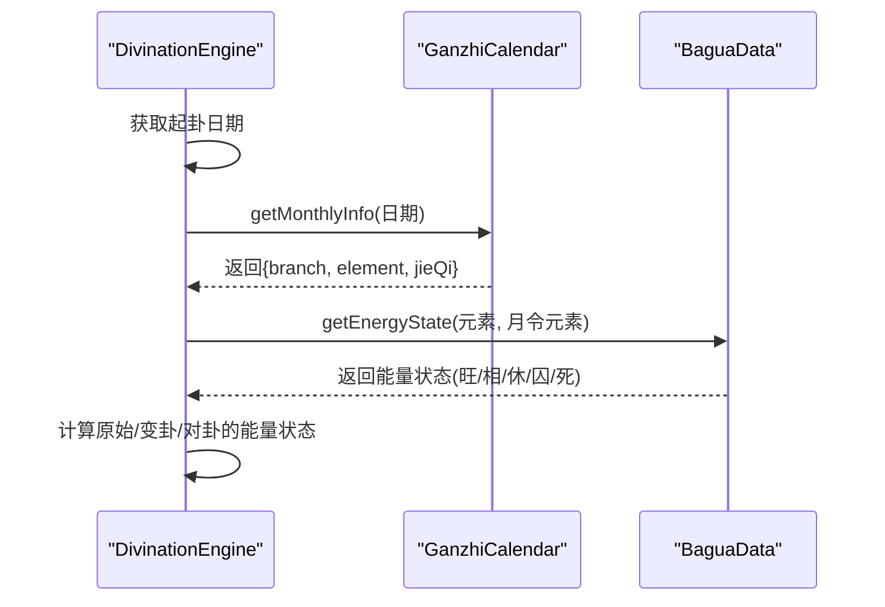
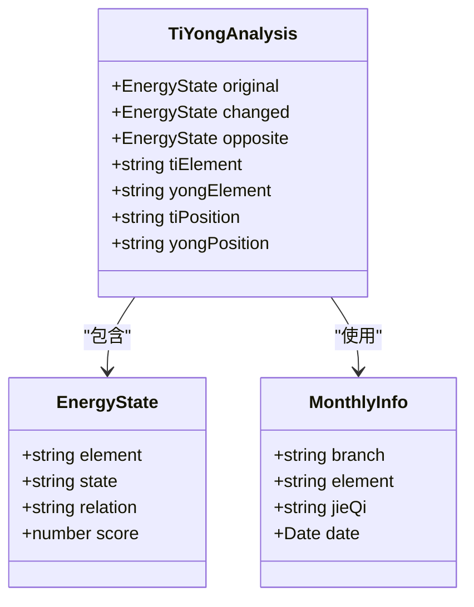
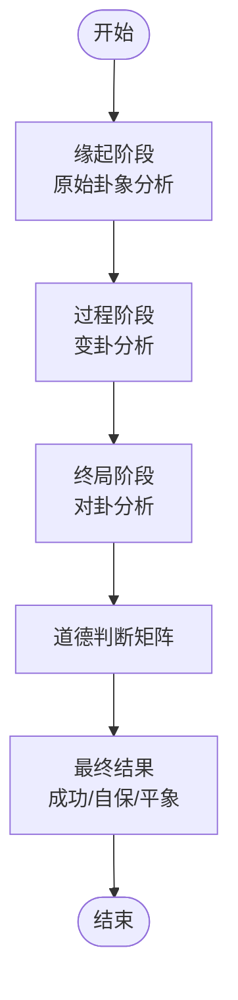
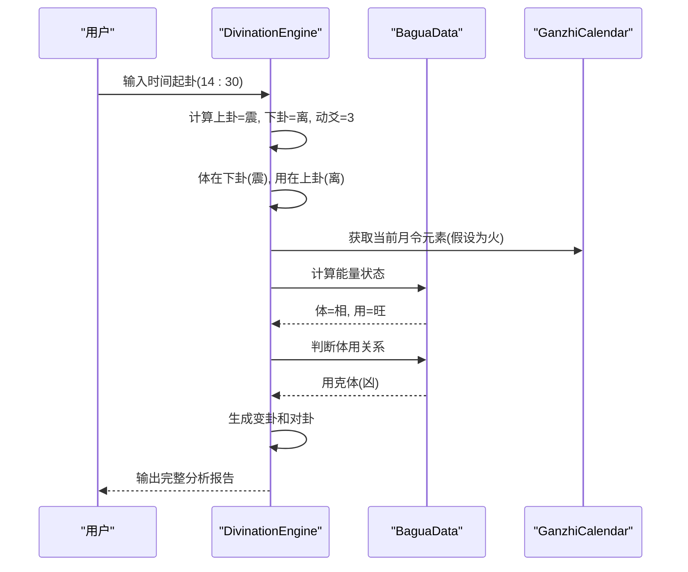
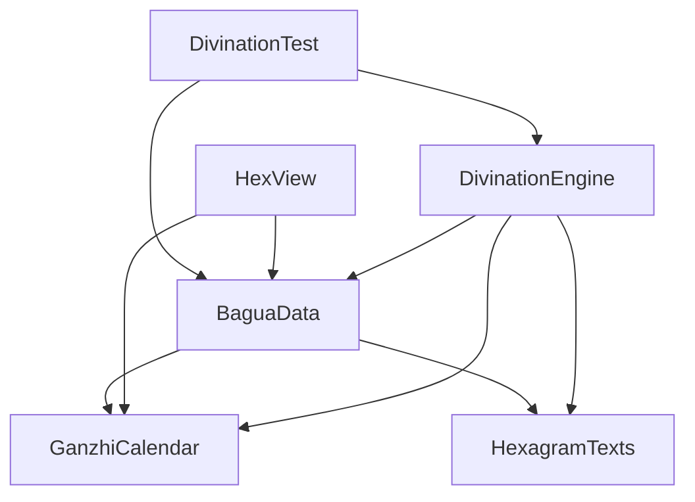

# 体用分析系统

<cite>
**本文档引用的文件**
- [divination-engine.js](file://src/core/divination-engine.js)
- [bagua-data.js](file://src/core/bagua-data.js)
- [ganzhi-calendar.js](file://src/core/ganzhi-calendar.js)
- [hexagram-texts.js](file://src/core/hexagram-texts.js)
- [hex-view.js](file://src/ui/hex-view.js)
- [divination.test.js](file://__tests__/divination.test.js)
</cite>

## 目录
1. [简介](#简介)
2. [项目结构](#项目结构)
3. [核心组件](#核心组件)
4. [架构总览](#架构总览)
5. [详细组件分析](#详细组件分析)
6. [依赖关系分析](#依赖关系分析)
7. [性能考虑](#性能考虑)
8. [故障排除指南](#故障排除指南)
9. [结论](#结论)
10. [附录](#附录)

## 简介
本系统基于梅花易数原理，提供完整的体用分析能力。系统通过时间起卦、两数法、三数法和手动选卦四种方式生成本卦、变卦和对卦，自动识别体用位置（上卦/下卦），计算体用元素的五行生克关系，并结合月令旺衰进行能量状态校准，最终输出三阶段（缘起-过程-终局）的综合判断。

## 项目结构
系统采用模块化设计，核心逻辑集中在引擎模块，数据层提供八卦、六十四卦、五行、干支历等基础数据，UI层负责渲染展示。

**图表来源**
- [divination-engine.js:1-433](file://src/core/divination-engine.js#L1-L433)
- [bagua-data.js:1-136](file://src/core/bagua-data.js#L1-L136)
- [ganzhi-calendar.js:1-236](file://src/core/ganzhi-calendar.js#L1-L236)
- [hexagram-texts.js:1-922](file://src/core/hexagram-texts.js#L1-L922)
- [hex-view.js:1-101](file://src/ui/hex-view.js#L1-L101)
- [divination.test.js:1-174](file://__tests__/divination.test.js#L1-L174)

**章节来源**
- [divination-engine.js:1-433](file://src/core/divination-engine.js#L1-L433)
- [bagua-data.js:1-136](file://src/core/bagua-data.js#L1-L136)
- [ganzhi-calendar.js:1-236](file://src/core/ganzhi-calendar.js#L1-L236)

## 核心组件
系统的核心由以下组件构成：
- 起卦引擎：支持四种起卦模式，构建完整卦象结果
- 体用识别：自动确定体用位置（上卦/下卦）
- 五行生克：计算体用关系的五种类型
- 月令校准：基于干支历的月令旺衰计算
- 能量状态：体用元素在当前月令下的能量等级
- 综合判断：三阶段推理与道德判断矩阵

**章节来源**
- [divination-engine.js:23-433](file://src/core/divination-engine.js#L23-L433)
- [bagua-data.js:10-136](file://src/core/bagua-data.js#L10-L136)

## 架构总览
系统采用分层架构，核心引擎负责业务逻辑，数据层提供静态数据，UI层负责可视化展示。

**图表来源**
- [divination-engine.js:35-201](file://src/core/divination-engine.js#L35-L201)
- [bagua-data.js:80-92](file://src/core/bagua-data.js#L80-L92)
- [ganzhi-calendar.js:138-192](file://src/core/ganzhi-calendar.js#L138-L192)
- [hexagram-texts.js:6-392](file://src/core/hexagram-texts.js#L6-L392)

## 详细组件分析

### 体用关系判断算法
体用关系判断是系统的核心算法，通过比较体卦和用卦的五行属性来确定关系类型。

**图表来源**
- [divination-engine.js:153-160](file://src/core/divination-engine.js#L153-L160)
- [bagua-data.js:72-78](file://src/core/bagua-data.js#L72-L78)

体用关系的五种类型及其判定标准：
1. **体用比和**：当体卦元素与用卦元素完全相同时
2. **用生体（吉）**：用卦元素的"生成"属性等于体卦元素
3. **体生用（泄）**：体卦元素的"生成"属性等于用卦元素  
4. **体克用（小吉）**：体卦元素的"克制"属性等于用卦元素
5. **用克体（凶）**：用卦元素的"克制"属性等于体卦元素

**章节来源**
- [divination-engine.js:153-160](file://src/core/divination-engine.js#L153-L160)
- [bagua-data.js:72-78](file://src/core/bagua-data.js#L72-L78)

### 体用位置确定机制
系统根据动爻位置自动确定体用位置，遵循"动爻在下则体在下，动爻在上则体在上"的原则。

**图表来源**
- [divination-engine.js:120-131](file://src/core/divination-engine.js#L120-L131)

**章节来源**
- [divination-engine.js:120-131](file://src/core/divination-engine.js#L120-L131)

### 月令旺衰校准机制
月令旺衰校准通过干支历计算当前节气对应的地支和五行元素，然后使用能量状态函数进行校准。

**图表来源**
- [divination-engine.js:133-148](file://src/core/divination-engine.js#L133-L148)
- [ganzhi-calendar.js:138-192](file://src/core/ganzhi-calendar.js#L138-L192)
- [bagua-data.js:80-92](file://src/core/bagua-data.js#L80-L92)

月令元素对能量状态的影响：
- **相生关系**：月令元素生成该元素时，状态为"相"
- **被生关系**：该元素生成月令元素时，状态为"休"  
- **克制关系**：该元素克制月令元素时，状态为"囚"
- **被克关系**：月令元素克制该元素时，状态为"死"
- **同元素**：状态为"旺"

**章节来源**
- [ganzhi-calendar.js:138-192](file://src/core/ganzhi-calendar.js#L138-L192)
- [bagua-data.js:80-92](file://src/core/bagua-data.js#L80-L92)

### 能量状态计算与关系评分
系统为每个卦象计算体用双方的能量状态，并据此进行关系评分。

**图表来源**
- [divination-engine.js:193-198](file://src/core/divination-engine.js#L193-L198)
- [ganzhi-calendar.js:170-191](file://src/core/ganzhi-calendar.js#L170-L191)

**章节来源**
- [divination-engine.js:193-198](file://src/core/divination-engine.js#L193-L198)

### 三阶段推理矩阵
系统提供三阶段推理框架，分别对应缘起、过程和终局三个阶段。

**图表来源**
- [divination-engine.js:348-377](file://src/core/divination-engine.js#L348-L377)

道德判断矩阵的四个象限：
- **第一象限**：现实成功 + 道德成功 = 大胜之象
- **第二象限**：现实失败 + 道德失败 = 大败之象  
- **第三象限**：现实成功 + 道德失败 = 假胜之象
- **第四象限**：现实失败 + 道德成功 = 挡灾之象

**章节来源**
- [divination-engine.js:348-377](file://src/core/divination-engine.js#L348-L377)

### 实际案例分析流程
以下是一个完整的体用分析案例流程：

**图表来源**
- [divination-engine.js:35-47](file://src/core/divination-engine.js#L35-L47)
- [divination-engine.js:120-164](file://src/core/divination-engine.js#L120-L164)

**章节来源**
- [divination-engine.js:35-47](file://src/core/divination-engine.js#L35-L47)
- [divination-engine.js:120-164](file://src/core/divination-engine.js#L120-L164)

## 依赖关系分析

**图表来源**
- [divination-engine.js:6-21](file://src/core/divination-engine.js#L6-L21)
- [bagua-data.js:6](file://src/core/bagua-data.js#L6)
- [hexagram-texts.js:1-4](file://src/core/hexagram-texts.js#L1-L4)

系统的主要依赖关系：
- DivinationEngine 依赖 BaguaData 提供八卦、五行、月令数据
- DivinationEngine 依赖 GanzhiCalendar 进行干支历计算
- DivinationEngine 依赖 HexagramTexts 提供卦辞和爻辞
- HexView 依赖 BaguaData 和 GanzhiCalendar 进行渲染
- DivinationTest 作为测试模块依赖核心引擎和数据模块

**章节来源**
- [divination-engine.js:6-21](file://src/core/divination-engine.js#L6-L21)
- [bagua-data.js:6](file://src/core/bagua-data.js#L6)

## 性能考虑
系统在性能方面的优化策略：
- 使用取余运算符避免复杂的条件判断
- 缓存干支历计算结果，避免重复计算
- 函数式编程风格，减少状态变更
- 模块化设计，便于测试和维护

## 故障排除指南
常见问题及解决方案：

### 体用位置错误
**问题描述**：体用位置与预期不符
**排查步骤**：
1. 检查动爻位置是否正确
2. 验证体用位置计算逻辑
3. 确认卦象构建是否正确

**章节来源**
- [divination-engine.js:120-131](file://src/core/divination-engine.js#L120-L131)

### 月令计算异常
**问题描述**：月令元素计算错误
**排查步骤**：
1. 验证日期输入格式
2. 检查干支历计算逻辑
3. 确认节气边界处理

**章节来源**
- [ganzhi-calendar.js:138-192](file://src/core/ganzhi-calendar.js#L138-L192)

### 五行生克判断错误
**问题描述**：体用关系判断不符合预期
**排查步骤**：
1. 检查五行表定义
2. 验证关系判断逻辑
3. 确认元素映射正确性

**章节来源**
- [bagua-data.js:72-78](file://src/core/bagua-data.js#L72-L78)
- [divination-engine.js:153-160](file://src/core/divination-engine.js#L153-L160)

## 结论
体用分析系统通过严谨的算法设计和模块化架构，实现了对梅花易数体用关系的精确分析。系统不仅提供了完整的理论实现，还具备良好的扩展性和维护性。通过月令旺衰校准和三阶段推理矩阵，系统能够为用户提供全面的决策参考。

## 附录

### 关键算法实现要点
- **取余函数**：确保余数为0时返回除数本身
- **体用识别**：基于动爻位置的智能定位
- **关系判断**：严格的五种关系分类
- **能量计算**：基于月令的动态校准

### 测试覆盖范围
- 起卦方法的正确性验证
- 体用位置识别的准确性
- 月令计算的时效性
- 能量状态计算的正确性
- 三阶段推理的完整性

**章节来源**
- [divination.test.js:1-174](file://__tests__/divination.test.js#L1-L174)