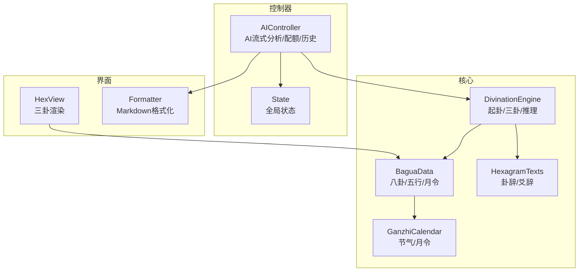
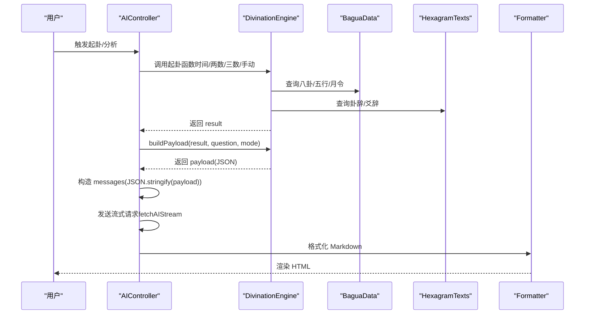
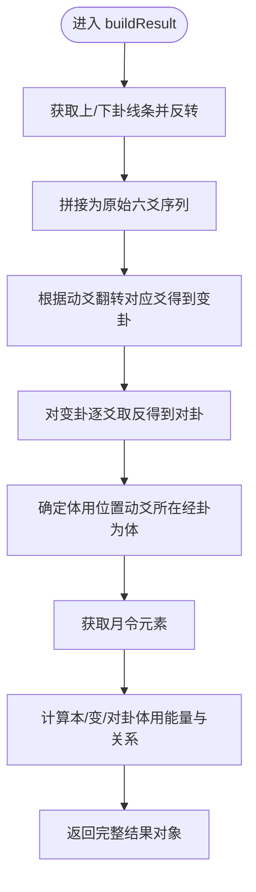
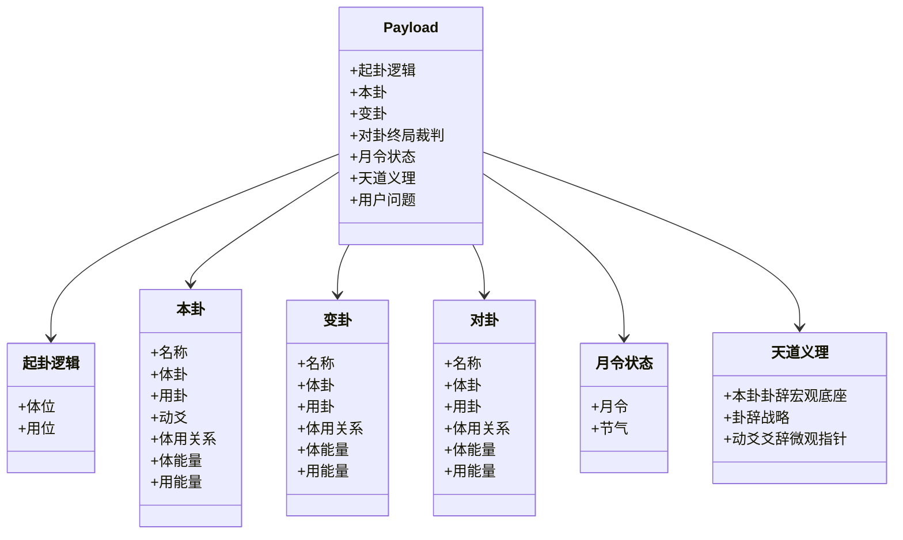
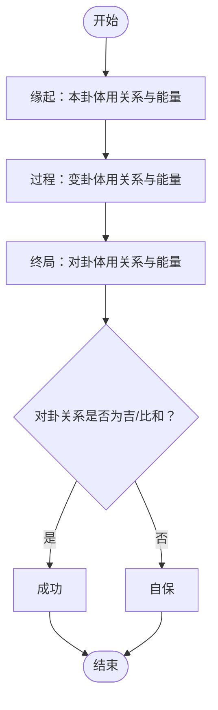
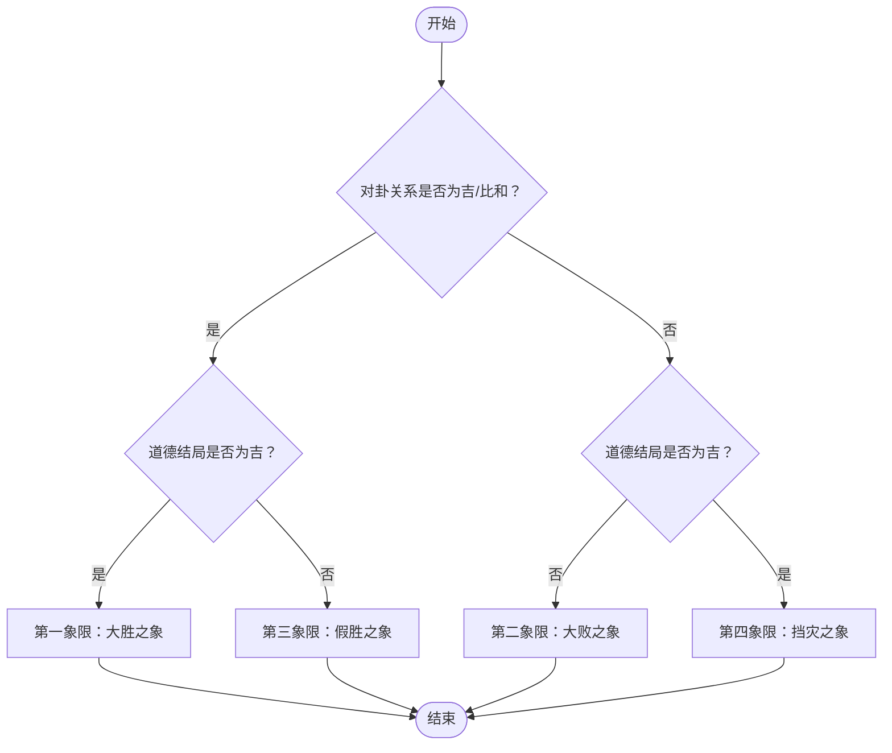
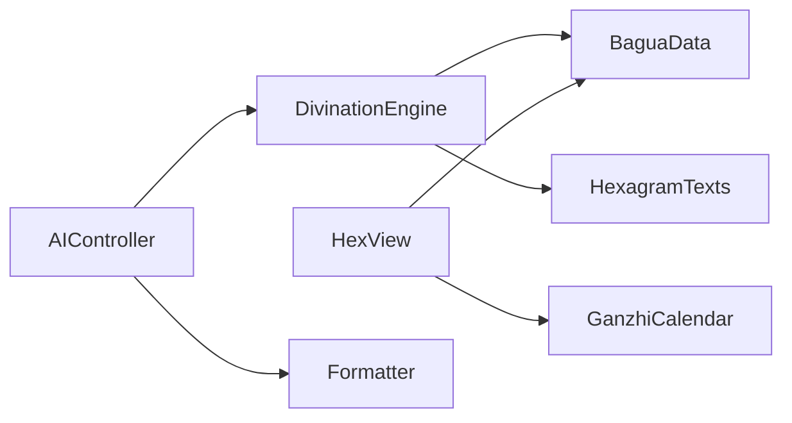

# 结果处理与输出

<cite>
**本文引用的文件**
- [divination-engine.js](file://src/core/divination-engine.js)
- [bagua-data.js](file://src/core/bagua-data.js)
- [hexagram-texts.js](file://src/core/hexagram-texts.js)
- [ganzhi-calendar.js](file://src/core/ganzhi-calendar.js)
- [formatter.js](file://src/utils/formatter.js)
- [hex-view.js](file://src/ui/hex-view.js)
- [ai-controller.js](file://src/controllers/ai-controller.js)
- [state.js](file://src/controllers/state.js)
</cite>

## 目录
1. [简介](#简介)
2. [项目结构](#项目结构)
3. [核心组件](#核心组件)
4. [架构总览](#架构总览)
5. [详细组件分析](#详细组件分析)
6. [依赖关系分析](#依赖关系分析)
7. [性能考量](#性能考量)
8. [故障排查指南](#故障排查指南)
9. [结论](#结论)
10. [附录](#附录)

## 简介
本文件聚焦“结果处理与输出系统”，围绕以下目标展开：
- 深入解释 buildResult 函数的完整结果构建过程，包括三卦数据结构、元信息管理、状态数据组织。
- 详细说明 buildPayload 函数的 payload 构建逻辑，包括起卦逻辑描述、本卦/变卦/对卦的详细信息、月令状态显示。
- 阐述 threeStageDeduction 和 classifyMatrix 函数的推理分析算法，包括三阶段推理、矩阵分类系统的实现。
- 提供完整的数据结构定义和输出格式说明，包括 JSON 结构、字段含义、数据类型。
- 包含实际的调用示例和结果解析方法。

## 项目结构
系统采用“核心引擎 + 控制器 + UI + 工具”的分层设计：
- 核心引擎：负责起卦、三卦推演、能量校准、推理分析与输出格式化。
- 控制器：协调前端交互、AI 推理、历史记录与配额控制。
- UI：渲染三卦卡片、爻线、月令信息。
- 工具：文本格式化、HTML 转换、DOM 辅助。

图表来源
- [divination-engine.js:23-433](file://src/core/divination-engine.js#L23-L433)
- [bagua-data.js:1-136](file://src/core/bagua-data.js#L1-L136)
- [hexagram-texts.js:1-392](file://src/core/hexagram-texts.js#L1-L392)
- [ganzhi-calendar.js:138-192](file://src/core/ganzhi-calendar.js#L138-L192)
- [ai-controller.js:1-733](file://src/controllers/ai-controller.js#L1-L733)
- [state.js:1-24](file://src/controllers/state.js#L1-L24)
- [formatter.js:1-92](file://src/utils/formatter.js#L1-L92)
- [hex-view.js:1-101](file://src/ui/hex-view.js#L1-L101)

章节来源
- [divination-engine.js:23-433](file://src/core/divination-engine.js#L23-L433)
- [bagua-data.js:1-136](file://src/core/bagua-data.js#L1-L136)
- [hexagram-texts.js:1-392](file://src/core/hexagram-texts.js#L1-L392)
- [ganzhi-calendar.js:138-192](file://src/core/ganzhi-calendar.js#L138-L192)
- [ai-controller.js:1-733](file://src/controllers/ai-controller.js#L1-L733)
- [state.js:1-24](file://src/controllers/state.js#L1-L24)
- [formatter.js:1-92](file://src/utils/formatter.js#L1-L92)
- [hex-view.js:1-101](file://src/ui/hex-view.js#L1-L101)

## 核心组件
- DivinationEngine：起卦引擎，负责三卦构建、体用关系、能量校准、推理分析与 payload 输出。
- BaguaData：提供八卦、六十四卦名称映射、五行生克、月令与能量状态查询。
- HexagramTexts：提供六十四卦卦辞与爻辞数据库。
- GanzhiCalendar：提供节气与月令计算。
- AIController：负责将结果打包为 payload，调用 AI 流式分析，管理配额与历史。
- HexView：渲染三卦卡片与爻线。
- Formatter：将 Markdown 文本转换为 HTML，规范化标题与加粗标记。

章节来源
- [divination-engine.js:23-433](file://src/core/divination-engine.js#L23-L433)
- [bagua-data.js:1-136](file://src/core/bagua-data.js#L1-L136)
- [hexagram-texts.js:1-392](file://src/core/hexagram-texts.js#L1-L392)
- [ganzhi-calendar.js:138-192](file://src/core/ganzhi-calendar.js#L138-L192)
- [ai-controller.js:1-733](file://src/controllers/ai-controller.js#L1-L733)
- [hex-view.js:1-101](file://src/ui/hex-view.js#L1-L101)
- [formatter.js:1-92](file://src/utils/formatter.js#L1-L92)

## 架构总览
从输入到输出的关键流程：
- 输入：时间/两数/三数/手动选卦，生成三卦（本卦、变卦、对卦）。
- 计算：体用定位、月令能量校准、生克关系判定。
- 输出：构建 payload，交由 AI 推理，再由 Formatter 渲染为 HTML。

图表来源
- [ai-controller.js:24-112](file://src/controllers/ai-controller.js#L24-L112)
- [divination-engine.js:32-100](file://src/core/divination-engine.js#L32-L100)
- [divination-engine.js:297-346](file://src/core/divination-engine.js#L297-L346)
- [formatter.js:61-91](file://src/utils/formatter.js#L61-L91)

## 详细组件分析

### 1) buildResult：三卦结果构建与状态组织
- 输入：上卦索引、下卦索引、动爻位置、元信息对象。
- 输出：包含本卦、变卦、对卦、体用关系、能量状态、月令信息与元信息的完整结果对象。
- 关键步骤：
  - 将上/下卦线条反转拼接为原始六爻序列。
  - 根据动爻位置翻转对应爻，得到变卦线条；对所有爻取反得到对卦线条。
  - 计算体用位置（动爻所在经卦为体，另一经卦为用）。
  - 获取月令元素，计算本卦/变卦/对卦的体用能量状态与关系。
  - 返回包含 original/changed/opposite 三组数据、tiYong、energy、meta 的结构化结果。

图表来源
- [divination-engine.js:104-201](file://src/core/divination-engine.js#L104-L201)

章节来源
- [divination-engine.js:104-201](file://src/core/divination-engine.js#L104-L201)

### 2) buildPayload：payload 构建逻辑
- 输入：result、用户问题、模式（simple/pro）。
- 输出：结构化 JSON，用于发送给 AI 推理。
- 字段说明（节选）：
  - 起卦逻辑：体位、用位（上卦/下卦）。
  - 本卦：名称、体卦、用卦、动爻、体用关系、体能量、用能量。
  - 变卦：名称、体卦、用卦、体用关系、体能量、用能量。
  - 对卦（终局裁判）：名称、体卦、用卦、体用关系、体能量、用能量。
  - 月令状态：月令、节气。
  - 天道义理：本卦卦辞（宏观底座）、卦辞战略、动爻爻辞（微观指针）。
  - 用户问题：字符串或占位符。

图表来源
- [divination-engine.js:297-346](file://src/core/divination-engine.js#L297-L346)

章节来源
- [divination-engine.js:297-346](file://src/core/divination-engine.js#L297-L346)

### 3) threeStageDeduction：三阶段推理
- 输入：result。
- 输出：包含缘起、过程、终局三个阶段的分析摘要，以及终局结果（成功/自保）与置信度。
- 推理要点：
  - 缘起：本卦体用关系与能量状态。
  - 过程：变卦体用关系与能量状态。
  - 终局：对卦体用关系与能量状态。
  - 最终结论：对卦关系是否为“吉”或“比和”决定“成功”，否则为“自保”。

图表来源
- [divination-engine.js:348-360](file://src/core/divination-engine.js#L348-L360)

章节来源
- [divination-engine.js:348-360](file://src/core/divination-engine.js#L348-L360)

### 4) classifyMatrix：双轨矩阵分类
- 输入：对卦能量状态、道德结局（吉/凶）。
- 输出：象限、描述、建议与总结。
- 分类规则：
  - 第一象限：现实可成 + 天道顺（大胜之象）。
  - 第二象限：现实难成 + 天道逆（大败之象）。
  - 第三象限：现实可成 + 天道逆（假胜之象）。
  - 第四象限：现实难成 + 天道顺（挡灾之象）。
  - 其他：平象（吉凶参半）。

图表来源
- [divination-engine.js:362-377](file://src/core/divination-engine.js#L362-L377)

章节来源
- [divination-engine.js:362-377](file://src/core/divination-engine.js#L362-L377)

### 5) 数据结构定义与输出格式
- result（完整结果对象）
  - original/changed/opposite：三卦数据
    - upperIdx/lowerIdx/lines/name/upperTrigram/lowerTrigram
  - movingYao：动爻位置（1-6）
  - tiYong：体用定位
    - ti：position（upper/lower）、idx、trigram
    - yong：position（upper/lower）、idx、trigram
  - energy：三卦能量与关系
    - monthInfo：branch、element、monthNum、jieQi、jieDate、nextJieQi、nextJieDate
    - original/changed/opposite：tiEnergy、yongEnergy、tiElement、yongElement、relation
  - meta：起卦元信息（method、detail、shichen、hour、minute、num1、num2、num3、date、upperIdx、lowerIdx、movingYao）

- payload（AI 推理输入）
  - 起卦逻辑：体位、用位
  - 本卦：名称、体卦、用卦、动爻、体用关系、体能量、用能量
  - 变卦：名称、体卦、用卦、体用关系、体能量、用能量
  - 对卦（终局裁判）：名称、体卦、用卦、体用关系、体能量、用能量
  - 月令状态：月令、节气
  - 天道义理：本卦卦辞、卦辞战略、动爻爻辞
  - 用户问题：字符串

- 输出格式（AI 推理）
  - 简化版：Markdown 标题与段落，术语禁用，输出“卦象速览”“一语定调”“现状与大势”“过程与结局”“行动建议”“慎行事项”。
  - 专业版：Markdown 标题与段落，输出“核心战略决断”“第一步：核心卦象与时空基座”“第二步：现实事相的时间线推演（轨一）”“第三步：长远方向与双轨矩阵（轨二）”“最终判断”。

章节来源
- [divination-engine.js:166-201](file://src/core/divination-engine.js#L166-L201)
- [divination-engine.js:297-346](file://src/core/divination-engine.js#L297-L346)
- [ai-controller.js:526-732](file://src/controllers/ai-controller.js#L526-L732)

### 6) 实际调用示例与结果解析
- 调用示例（简化版）：
  - 起卦：使用时间起卦或两数/三数/手动选卦生成 result。
  - 构建 payload：调用 buildPayload(result, question, 'simple')。
  - 发送消息：将 payload 序列化为 JSON 并作为用户消息发送。
  - 渲染：通过 Formatter 将 AI 输出转换为 HTML 并渲染到页面。
- 结果解析：
  - 三卦卡片：通过 HexView 渲染本卦/变卦/对卦，显示体用与能量状态。
  - 月令信息：在界面顶部显示当前月令与节气。
  - AI 结论：根据简化版/专业版输出，解析“一语定调”“现状与大势”“过程与结局”“行动建议”“慎行事项”。

章节来源
- [ai-controller.js:77-112](file://src/controllers/ai-controller.js#L77-L112)
- [ai-controller.js:526-732](file://src/controllers/ai-controller.js#L526-L732)
- [hex-view.js:8-29](file://src/ui/hex-view.js#L8-L29)

## 依赖关系分析
- DivinationEngine 依赖：
  - BaguaData：TRIGRAMS、HEXAGRAM_NAMES、FIVE_ELEMENTS、getMonthlyElement、getEnergyState、HEXAGRAM_NAME_LOOKUP、HEXAGRAM_SHORT_LOOKUP、NATURE_TO_TRIGRAM。
  - HexagramTexts：HEXAGRAM_JUDGMENTS、LINE_TEXTS。
- UI 依赖：
  - HexView 依赖 BaguaData 的 getEnergyState 与 GanzhiCalendar 的格式化工具。
- 控制器依赖：
  - AIController 依赖 DivinationEngine 的 buildPayload 与系统提示词构建。
  - Formatter 依赖 DOM 工具与正则处理。

图表来源
- [divination-engine.js:6-21](file://src/core/divination-engine.js#L6-L21)
- [bagua-data.js:1-136](file://src/core/bagua-data.js#L1-L136)
- [hexagram-texts.js:1-392](file://src/core/hexagram-texts.js#L1-L392)
- [hex-view.js:1-101](file://src/ui/hex-view.js#L1-L101)
- [ai-controller.js:1-18](file://src/controllers/ai-controller.js#L1-L18)
- [formatter.js:1-92](file://src/utils/formatter.js#L1-L92)

章节来源
- [divination-engine.js:6-21](file://src/core/divination-engine.js#L6-L21)
- [bagua-data.js:1-136](file://src/core/bagua-data.js#L1-L136)
- [hexagram-texts.js:1-392](file://src/core/hexagram-texts.js#L1-L392)
- [hex-view.js:1-101](file://src/ui/hex-view.js#L1-L101)
- [ai-controller.js:1-18](file://src/controllers/ai-controller.js#L1-L18)
- [formatter.js:1-92](file://src/utils/formatter.js#L1-L92)

## 性能考量
- 三卦构建与能量计算均为常数时间复杂度，整体 O(1)。
- 月令计算通过缓存节气列表避免重复计算。
- UI 渲染按需更新，避免全量重绘。
- AI 推理采用流式传输，前端即时渲染，提升交互体验。

## 故障排查指南
- 起卦失败：
  - 检查输入参数（时间/数字/索引）是否合法。
  - 确认 DivinationEngine 的 remainder 与 linesToTrigramIdx 正常工作。
- 月令错误：
  - 确认日期转换与节气边界计算正确。
  - 使用 recalculateMonthlyEnergy 在指定日期重新计算能量。
- AI 输出为空：
  - 检查 API Key、模型配置与代理设置。
  - 使用继续分析功能接续未完成内容。
- Markdown 渲染异常：
  - 确认标题标准化与加粗标记闭合。
  - 检查 HTML 转义与列表渲染。

章节来源
- [divination-engine.js:383-405](file://src/core/divination-engine.js#L383-L405)
- [divination-engine.js:410-429](file://src/core/divination-engine.js#L410-L429)
- [ai-controller.js:478-523](file://src/controllers/ai-controller.js#L478-L523)
- [formatter.js:61-91](file://src/utils/formatter.js#L61-L91)

## 结论
本系统通过 DivinationEngine 将起卦、三卦推演、能量校准与推理分析整合为统一的数据流，配合 AIController 的流式推理与 Formatter 的 Markdown 渲染，形成从“三卦结果”到“可读结论”的完整闭环。threeStageDeduction 与 classifyMatrix 提供了清晰的三阶段与双轨矩阵推理框架，确保结论既有现实依据又有义理支撑。

## 附录
- 术语对照（简化版禁用术语）：体、用、体卦、用卦、体克用、用克体、体生用、用生体、比和、旺、相、休、囚、死、月令、轨一、轨二、双轨矩阵、大胜、大败、假胜、挡灾、对卦、变卦体用、经卦。
- 月令计算：基于节气的“节”气转换，精确到当前节气与下个节气。