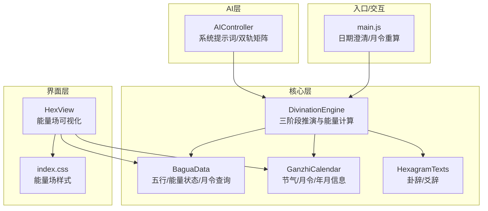
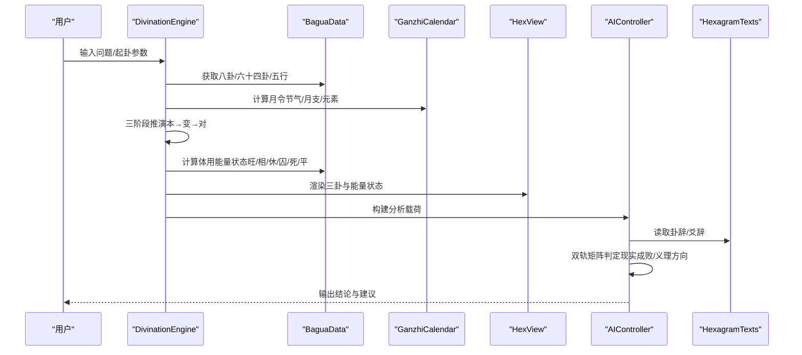
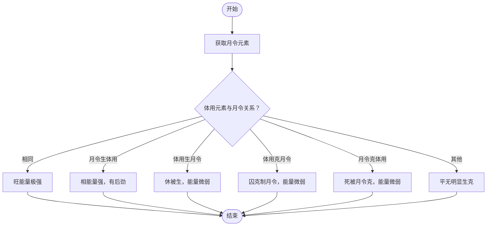
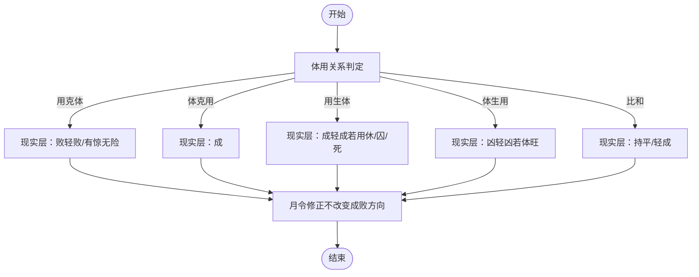
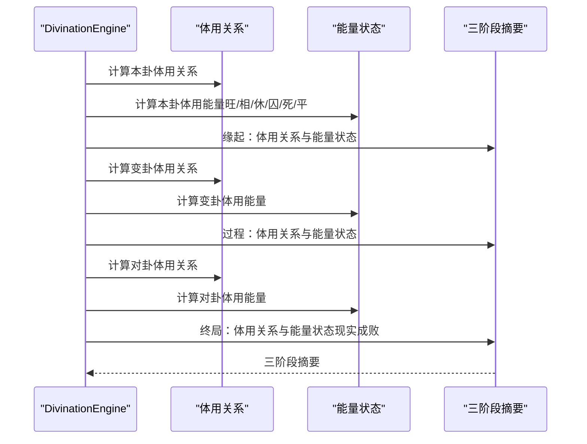
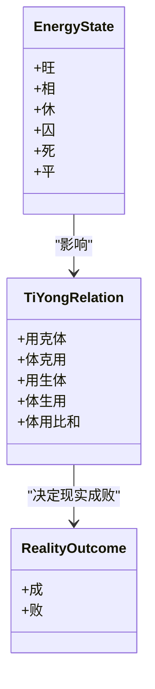
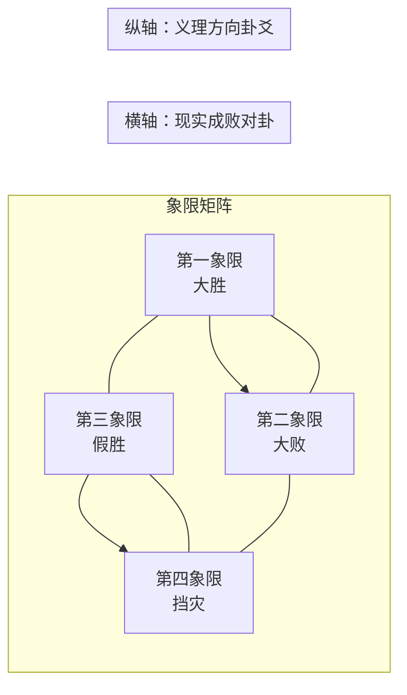
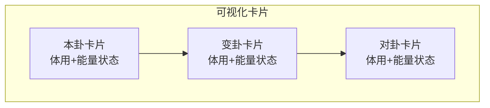
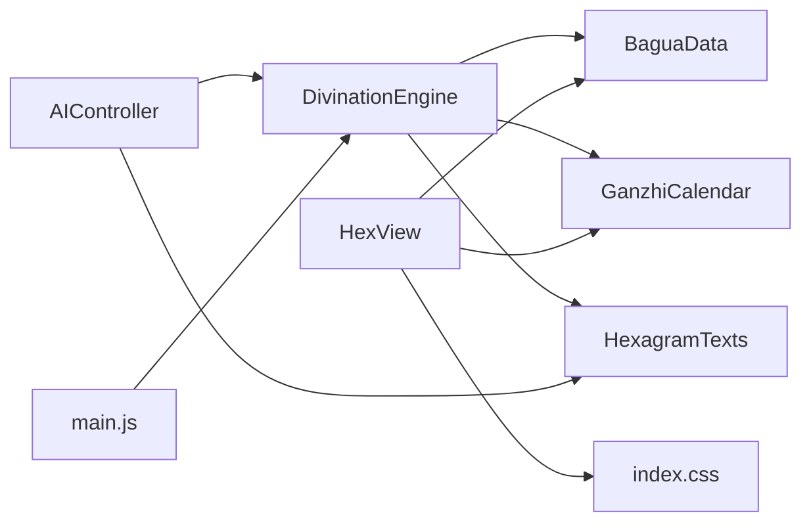

# 能量场分析

<cite>
**本文引用的文件**
- [divination-engine.js](file://src/core/divination-engine.js)
- [bagua-data.js](file://src/core/bagua-data.js)
- [ganzhi-calendar.js](file://src/core/ganzhi-calendar.js)
- [hex-view.js](file://src/ui/hex-view.js)
- [ai-controller.js](file://src/controllers/ai-controller.js)
- [hexagram-texts.js](file://src/core/hexagram-texts.js)
- [divination.test.js](file://__tests__/divination.test.js)
- [main.js](file://src/main.js)
- [index.css](file://src/index.css)
</cite>

## 目录
1. [简介](#简介)
2. [项目结构](#项目结构)
3. [核心组件](#核心组件)
4. [架构总览](#架构总览)
5. [详细组件分析](#详细组件分析)
6. [依赖关系分析](#依赖关系分析)
7. [性能考量](#性能考量)
8. [故障排查指南](#故障排查指南)
9. [结论](#结论)
10. [附录](#附录)

## 简介
本文件面向“能量场分析算法”的技术文档，聚焦于三卦联动（本卦→变卦→对卦）的能量状态计算与判定，详解以下要点：
- 体用定性与能量状态计算方法（getEnergyState）
- 月令元素对能量状态的影响与修正机制
- 能量等级划分标准（旺/相/休/囚/死/平）
- 三阶段能量变化分析（缘起→过程→终局）
- 能量场与体用关系的对应关系
- 通过能量状态评估卦象吉凶程度
- 能量场可视化与计算示例
- 实际占卜应用指导

## 项目结构
该项目采用模块化组织，核心逻辑集中在核心模块，界面渲染与交互在UI模块，AI分析在控制器模块。与能量场分析直接相关的模块包括：
- 起卦与三阶段推演：divination-engine.js
- 五行与能量状态：bagua-data.js
- 月令与节气：ganzhi-calendar.js
- 能量场可视化：hex-view.js、index.css
- AI系统提示词与双轨矩阵：ai-controller.js
- 六十四卦卦辞与爻辞：hexagram-texts.js
- 测试用例：divination.test.js
- 日期澄清与月令重算：main.js

**图表来源**
- [divination-engine.js:1-433](file://src/core/divination-engine.js#L1-L433)
- [bagua-data.js:1-136](file://src/core/bagua-data.js#L1-L136)
- [ganzhi-calendar.js:1-236](file://src/core/ganzhi-calendar.js#L1-L236)
- [hexagram-texts.js:1-922](file://src/core/hexagram-texts.js#L1-L922)
- [hex-view.js:1-101](file://src/ui/hex-view.js#L1-L101)
- [index.css:627-850](file://src/index.css#L627-L850)
- [ai-controller.js:526-733](file://src/controllers/ai-controller.js#L526-L733)
- [main.js:700-760](file://src/main.js#L700-L760)

**章节来源**
- [divination-engine.js:1-433](file://src/core/divination-engine.js#L1-L433)
- [bagua-data.js:1-136](file://src/core/bagua-data.js#L1-L136)
- [ganzhi-calendar.js:1-236](file://src/core/ganzhi-calendar.js#L1-L236)
- [hex-view.js:1-101](file://src/ui/hex-view.js#L1-L101)
- [ai-controller.js:526-733](file://src/controllers/ai-controller.js#L526-L733)
- [hexagram-texts.js:1-922](file://src/core/hexagram-texts.js#L1-L922)
- [divination.test.js:1-174](file://__tests__/divination.test.js#L1-L174)
- [main.js:700-760](file://src/main.js#L700-L760)
- [index.css:627-850](file://src/index.css#L627-L850)

## 核心组件
- DivinationEngine：负责起卦、三阶段推演、体用定性、能量状态计算、构建AI分析载荷、三阶段推理与双轨矩阵分类。
- BaguaData：提供八卦、六十四卦、五行生克、月令查询、能量状态计算。
- GanzhiCalendar：提供节气、月令、年月信息，用于确定月令元素。
- HexView：将三卦与能量状态渲染为可视化卡片，标注体用与动爻。
- AIController：定义系统提示词，执行双轨矩阵判定与象限分类，输出人类可读结论。
- HexagramTexts：提供卦辞与爻辞，作为义理层支撑。
- main.js：处理日期澄清与月令重算，确保能量状态与实际起卦时间匹配。

**章节来源**
- [divination-engine.js:23-201](file://src/core/divination-engine.js#L23-L201)
- [bagua-data.js:85-92](file://src/core/bagua-data.js#L85-L92)
- [ganzhi-calendar.js:138-192](file://src/core/ganzhi-calendar.js#L138-L192)
- [hex-view.js:8-29](file://src/ui/hex-view.js#L8-L29)
- [ai-controller.js:526-733](file://src/controllers/ai-controller.js#L526-L733)
- [hexagram-texts.js:6-392](file://src/core/hexagram-texts.js#L6-L392)
- [main.js:715-760](file://src/main.js#L715-L760)

## 架构总览
能量场分析贯穿“起卦→三阶段推演→月令校准→体用关系→能量状态→双轨矩阵→AI输出”的完整链路。

**图表来源**
- [divination-engine.js:104-201](file://src/core/divination-engine.js#L104-L201)
- [bagua-data.js:80-92](file://src/core/bagua-data.js#L80-L92)
- [ganzhi-calendar.js:138-192](file://src/core/ganzhi-calendar.js#L138-L192)
- [hex-view.js:8-29](file://src/ui/hex-view.js#L8-L29)
- [ai-controller.js:24-112](file://src/controllers/ai-controller.js#L24-L112)
- [hexagram-texts.js:6-392](file://src/core/hexagram-texts.js#L6-L392)

## 详细组件分析

### 体用定性与能量状态计算
- 体用定性：动爻所在经卦为“体”，静爻所在经卦为“用”。体用位置在三阶段中保持不变，贯穿本卦、变卦、对卦。
- 能量状态计算：getEnergyState(element, monthElement)依据月令元素与卦体用元素的关系，返回“旺/相/休/囚/死/平”。
- 月令影响：月令元素决定体用能量的强弱与吉凶质感，系统提供“修正铁律”以调整吉凶烈度但不改变成败方向。

**图表来源**
- [bagua-data.js:85-92](file://src/core/bagua-data.js#L85-L92)

**章节来源**
- [divination-engine.js:120-165](file://src/core/divination-engine.js#L120-L165)
- [bagua-data.js:85-92](file://src/core/bagua-data.js#L85-L92)

### 月令元素对能量状态的影响与修正
- 月令（节气月）是五行能量的最高仲裁者，必须强制引入。
- 修正铁律（仅改变吉凶的烈度与质感，不改变成败方向）：
  - 用生体（吉）但用休/囚/死：虚情假意，口头支票，吉→轻吉。
  - 体克用（吉）但体休/囚/死：有心无力，吉→轻吉或持平。
  - 体用比和（吉）但用休/囚/死：空有好心，自身虚弱帮不上，吉→轻吉。
  - 体生用（凶）但体旺：我有余力施舍，虽耗无妨，凶→轻凶。
  - 用克体（凶）但用休/囚/死或体旺：有惊无险，主体安全但目标仍难成。

**图表来源**
- [ai-controller.js:599-612](file://src/controllers/ai-controller.js#L599-L612)

**章节来源**
- [ai-controller.js:599-612](file://src/controllers/ai-controller.js#L599-L612)

### 三阶段能量变化分析
- 缘起（本卦）：评估初始基本盘与动机体检，体用能量决定启动条件。
- 过程（变卦）：评估推进阻力/助力，环境变化对体用能量的影响。
- 终局（对卦）：现实成败的唯一裁判，依据对卦体用关系与旺衰修正后判定。

**图表来源**
- [divination-engine.js:348-360](file://src/core/divination-engine.js#L348-L360)

**章节来源**
- [divination-engine.js:348-360](file://src/core/divination-engine.js#L348-L360)

### 能量场与体用关系的对应
- 体用关系与能量状态共同决定吉凶程度：
  - 用克体：现实层一律判“败”，体旺可“有惊无险”。
  - 体克用：现实层判“成”。
  - 用生体：现实层判“成”，但用休/囚/死时降为“轻成”。
  - 体生用：现实层判“凶”，体旺时降为“轻凶”。
  - 比和：现实层持平或“轻成”，视旺衰而定。

**图表来源**
- [bagua-data.js:72-78](file://src/core/bagua-data.js#L72-L78)
- [ai-controller.js:618-627](file://src/controllers/ai-controller.js#L618-L627)

**章节来源**
- [bagua-data.js:72-78](file://src/core/bagua-data.js#L72-L78)
- [ai-controller.js:618-627](file://src/controllers/ai-controller.js#L618-L627)

### 双轨矩阵与象限分类
- 横轴（现实成败）取自对卦推演；纵轴（方向吉凶）取自卦辞+爻辞综合义理。
- 四象限：
  - 第一象限（大胜）：现实成 + 天道顺 → 名正言顺，大胆推进。
  - 第二象限（大败）：现实败 + 天道逆 → 全盘皆输，立刻止损。
  - 第三象限（假胜）：现实成 + 天道逆 → 饮鸩止渴，必埋隐患。
  - 第四象限（挡灾）：现实败 + 天道顺 → 塞翁失马，用现实挫折挡住未来大祸。

**图表来源**
- [ai-controller.js:634-642](file://src/controllers/ai-controller.js#L634-L642)
- [divination-engine.js:362-377](file://src/core/divination-engine.js#L362-L377)

**章节来源**
- [ai-controller.js:634-642](file://src/controllers/ai-controller.js#L634-L642)
- [divination-engine.js:362-377](file://src/core/divination-engine.js#L362-L377)

### 能量场可视化与计算示例
- 可视化：HexView将三卦渲染为卡片，标注体用、能量状态与动爻，颜色区分“旺/相/休/囚/死/平”。
- 示例流程（以测试用例为依据）：
  1) 起卦：时间起卦（如14时30分），得到本卦、变卦、对卦与动爻。
  2) 月令：根据起卦日期计算当前节气与月令元素。
  3) 能量：分别计算本卦、变卦、对卦的体用能量状态。
  4) 关系：计算本卦、变卦、对卦的体用关系（用克体/体克用/用生体/体生用/比和）。
  5) 三阶段摘要：缘起→过程→终局。
  6) 双轨矩阵：象限分类与建议输出。

**图表来源**
- [hex-view.js:31-98](file://src/ui/hex-view.js#L31-L98)
- [index.css:763-786](file://src/index.css#L763-L786)

**章节来源**
- [hex-view.js:31-98](file://src/ui/hex-view.js#L31-L98)
- [index.css:763-786](file://src/index.css#L763-L786)
- [divination.test.js:7-51](file://__tests__/divination.test.js#L7-L51)

### 实际占卜应用指导
- 月令校准：若用户指定的起卦时间跨越节气，系统提供日期澄清弹窗，选择“节前/节后”以锁定正确月令。
- 月令重算：用户可在界面选择特定日期，重新计算月令与能量状态，确保分析与实际情境一致。
- AI输出：系统提示词强制执行“事理双轨并行制”，先判现实成败，再给义理方向，最后以双轨矩阵归类象限，输出可执行建议。

**章节来源**
- [main.js:715-760](file://src/main.js#L715-L760)
- [ai-controller.js:526-733](file://src/controllers/ai-controller.js#L526-L733)

## 依赖关系分析

**图表来源**
- [divination-engine.js:6-21](file://src/core/divination-engine.js#L6-L21)
- [bagua-data.js:6-16](file://src/core/bagua-data.js#L6-L16)
- [ganzhi-calendar.js:6-8](file://src/core/ganzhi-calendar.js#L6-L8)
- [hexagram-texts.js:1-4](file://src/core/hexagram-texts.js#L1-L4)
- [hex-view.js:4-6](file://src/ui/hex-view.js#L4-L6)
- [index.css:627-850](file://src/index.css#L627-L850)
- [ai-controller.js:1-16](file://src/controllers/ai-controller.js#L1-L16)
- [main.js:700-760](file://src/main.js#L700-L760)

**章节来源**
- [divination-engine.js:6-21](file://src/core/divination-engine.js#L6-L21)
- [bagua-data.js:6-16](file://src/core/bagua-data.js#L6-L16)
- [ganzhi-calendar.js:6-8](file://src/core/ganzhi-calendar.js#L6-L8)
- [hexagram-texts.js:1-4](file://src/core/hexagram-texts.js#L1-L4)
- [hex-view.js:4-6](file://src/ui/hex-view.js#L4-L6)
- [index.css:627-850](file://src/index.css#L627-L850)
- [ai-controller.js:1-16](file://src/controllers/ai-controller.js#L1-L16)
- [main.js:700-760](file://src/main.js#L700-L760)

## 性能考量
- 月令计算：节气查找与缓存（年份级缓存）降低重复计算成本。
- 能量状态计算：常数时间复杂度，仅依赖五行生克关系表。
- 可视化渲染：按需渲染三卦卡片，避免不必要的DOM更新。
- AI流式输出：前端模拟进度条与思考动画，提升用户体验。

[本节为通用性能讨论，无需特定文件来源]

## 故障排查指南
- 月令不匹配：若起卦时间跨越节气，系统会弹窗提示选择“节前/节后”。确认后重新计算月令与能量状态。
- 能量状态异常：检查起卦日期是否正确，必要时使用“月令重算”功能。
- AI输出为空：检查API Key配置与网络状态，系统支持自动续传与错误提示。
- 可视化异常：确认CSS样式是否加载，检查三卦卡片渲染逻辑。

**章节来源**
- [main.js:715-760](file://src/main.js#L715-L760)
- [ai-controller.js:478-523](file://src/controllers/ai-controller.js#L478-L523)
- [hex-view.js:8-29](file://src/ui/hex-view.js#L8-L29)

## 结论
本能量场分析算法以“月令为尊”的原则，结合体用关系与能量状态，形成“三阶段推演+双轨矩阵”的完整分析闭环。通过可视化呈现与AI系统提示词，既能满足专业用户的深度需求，又能为普通用户提供通俗易懂的决策参考。建议在实际占卜中：
- 精确起卦时间，必要时进行月令澄清与重算；
- 关注三阶段能量变化趋势，识别平衡与失衡点；
- 将现实成败与义理方向分离，避免单一维度误导；
- 依据象限分类采取差异化行动策略。

[本节为总结性内容，无需特定文件来源]

## 附录

### 能量等级划分标准
- 旺：与月令相同，能量极强，吉凶成倍。
- 相：月令生体用，能量强，有后劲。
- 休：体用生月令，能量微弱，有心无力。
- 囚：体用克月令，能量微弱，有心无力。
- 死：月令克体用，能量微弱，有惊无险。
- 平：无明显生克关系，能量一般。

**章节来源**
- [bagua-data.js:85-92](file://src/core/bagua-data.js#L85-L92)

### 三阶段摘要模板
- 缘起：本卦体用关系与能量状态。
- 过程：变卦体用关系与能量状态。
- 终局：对卦体用关系与能量状态（现实成败）。

**章节来源**
- [divination-engine.js:348-360](file://src/core/divination-engine.js#L348-L360)

### 双轨矩阵象限说明
- 第一象限（大胜）：现实成 + 天道顺 → 大胆推进。
- 第二象限（大败）：现实败 + 天道逆 → 立刻止损。
- 第三象限（假胜）：现实成 + 天道逆 → 饮鸩止渴，宜急流勇退。
- 第四象限（挡灾）：现实败 + 天道顺 → 用挫折挡未来大祸。

**章节来源**
- [ai-controller.js:634-642](file://src/controllers/ai-controller.js#L634-L642)
- [divination-engine.js:362-377](file://src/core/divination-engine.js#L362-L377)