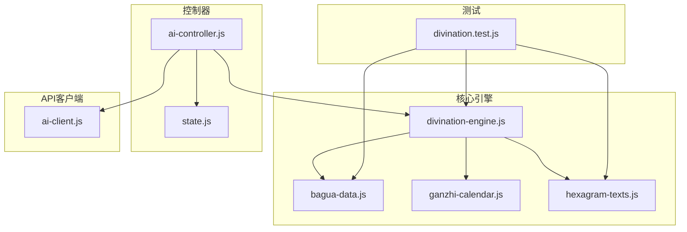
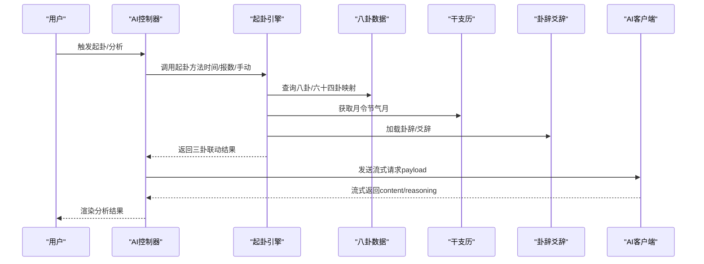
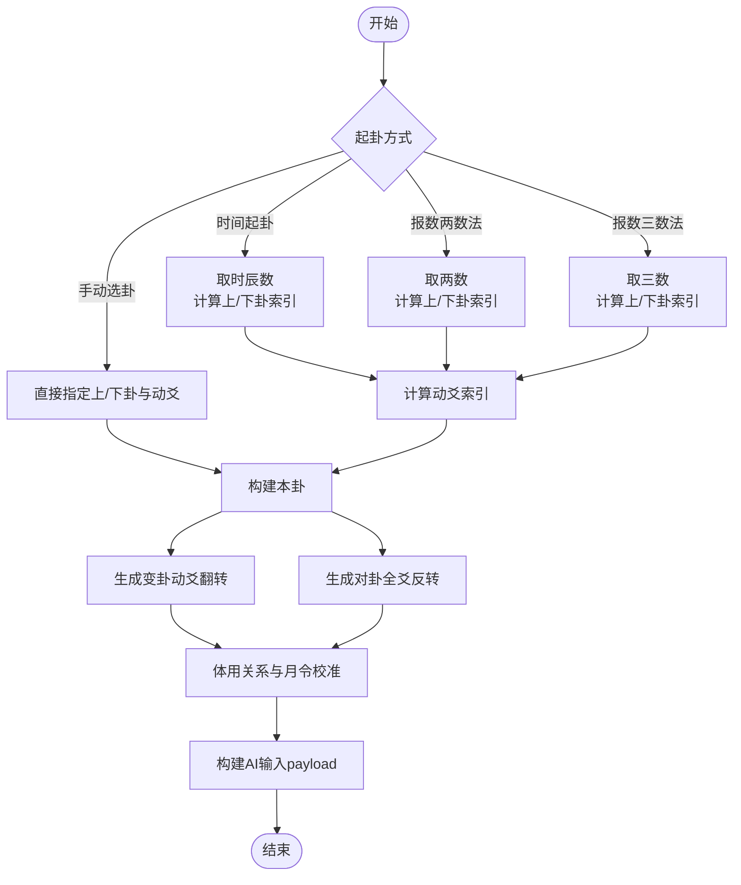
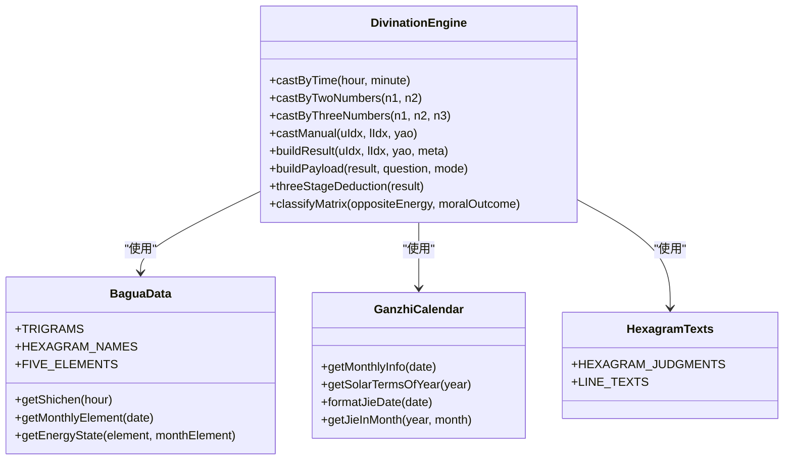
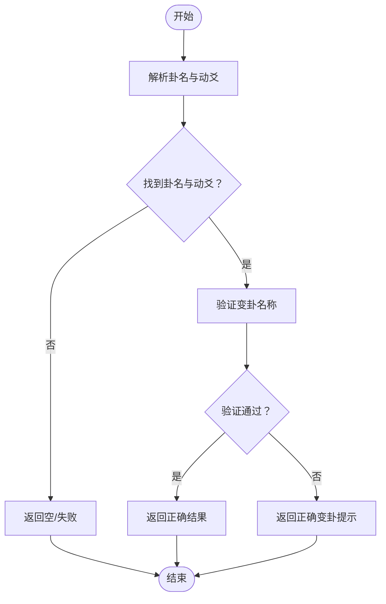
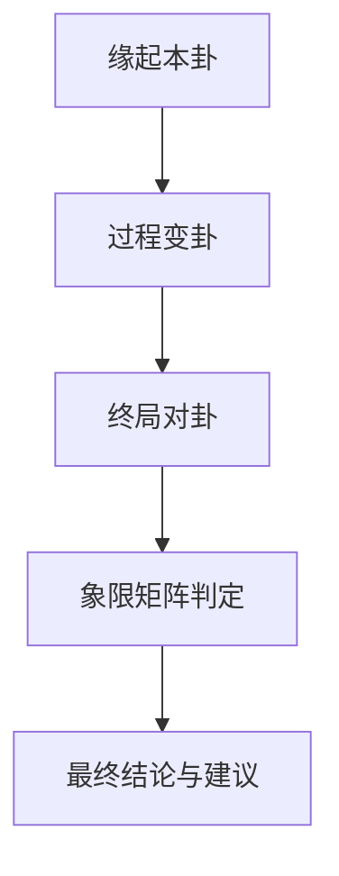
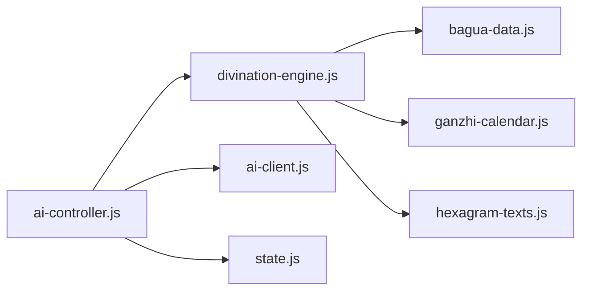

# 起卦引擎

<cite>
**本文引用的文件列表**
- [divination-engine.js](file://src/core/divination-engine.js)
- [bagua-data.js](file://src/core/bagua-data.js)
- [ganzhi-calendar.js](file://src/core/ganzhi-calendar.js)
- [hexagram-texts.js](file://src/core/hexagram-texts.js)
- [ai-controller.js](file://src/controllers/ai-controller.js)
- [ai-client.js](file://src/api/ai-client.js)
- [state.js](file://src/controllers/state.js)
- [divination.test.js](file://__tests__/divination.test.js)
- [README.md](file://server/README.md)
- [package.json](file://package.json)
</cite>

## 目录
1. [简介](#简介)
2. [项目结构](#项目结构)
3. [核心组件](#核心组件)
4. [架构总览](#架构总览)
5. [详细组件分析](#详细组件分析)
6. [依赖关系分析](#依赖关系分析)
7. [性能考量](#性能考量)
8. [故障排查指南](#故障排查指南)
9. [结论](#结论)
10. [附录](#附录)

## 简介
本文件面向“梅花易数起卦引擎”的技术文档，系统性阐述起卦算法的数学原理与实现细节，覆盖时间起卦、报数起卦（两数法与三数法）、手动选卦三种方式；详解三卦联动（本卦、变卦、对卦）的生成逻辑；解释体用分析系统（体用关系判断、五行生克、月令旺衰校准）与能量场分析（体能量与用能量）；并提供完整的API接口说明、错误处理机制、使用示例与最佳实践，帮助开发者快速集成与扩展。

## 项目结构
本项目采用“核心引擎 + 控制器 + API客户端 + 数据库 + 测试”的模块化组织方式，核心引擎位于 src/core，控制器位于 src/controllers，AI交互位于 src/api，单元测试位于 __tests__。

图表来源
- [divination-engine.js:1-433](file://src/core/divination-engine.js#L1-L433)
- [bagua-data.js:1-136](file://src/core/bagua-data.js#L1-L136)
- [ganzhi-calendar.js:1-236](file://src/core/ganzhi-calendar.js#L1-L236)
- [hexagram-texts.js:1-922](file://src/core/hexagram-texts.js#L1-L922)
- [ai-controller.js:1-733](file://src/controllers/ai-controller.js#L1-L733)
- [ai-client.js:1-185](file://src/api/ai-client.js#L1-L185)
- [state.js:1-24](file://src/controllers/state.js#L1-L24)
- [divination.test.js:1-174](file://__tests__/divination.test.js#L1-L174)

章节来源
- [divination-engine.js:1-433](file://src/core/divination-engine.js#L1-L433)
- [bagua-data.js:1-136](file://src/core/bagua-data.js#L1-L136)
- [ganzhi-calendar.js:1-236](file://src/core/ganzhi-calendar.js#L1-L236)
- [hexagram-texts.js:1-922](file://src/core/hexagram-texts.js#L1-L922)
- [ai-controller.js:1-733](file://src/controllers/ai-controller.js#L1-L733)
- [ai-client.js:1-185](file://src/api/ai-client.js#L1-L185)
- [state.js:1-24](file://src/controllers/state.js#L1-L24)
- [divination.test.js:1-174](file://__tests__/divination.test.js#L1-L174)

## 核心组件
- 起卦引擎（DivinationEngine）：提供三种起卦方式、三卦联动、体用分析、能量场分析、文本解析与构建AI输入等能力。
- 八卦与六十四卦数据（bagua-data.js）：定义八卦、六十四卦名称映射、五行生克、月令元素、能量状态等。
- 干支历与节气月令（ganzhi-calendar.js）：提供节气计算、月令归属、月令信息查询等。
- 卦辞与爻辞数据库（hexagram-texts.js）：提供六十四卦卦辞与爻辞，用于AI分析的义理支撑。
- AI控制器（ai-controller.js）：封装AI分析流程、流式输出、历史记录、模型切换与对比、错误处理等。
- AI客户端（ai-client.js）：封装流式SSE调用、超时与重试、代理模式、错误回调等。
- 应用状态（state.js）：集中管理当前用户、历史记录、当前卦例、模型选择、中断上下文等。

章节来源
- [divination-engine.js:23-433](file://src/core/divination-engine.js#L23-L433)
- [bagua-data.js:8-136](file://src/core/bagua-data.js#L8-L136)
- [ganzhi-calendar.js:6-236](file://src/core/ganzhi-calendar.js#L6-L236)
- [hexagram-texts.js:6-392](file://src/core/hexagram-texts.js#L6-L392)
- [ai-controller.js:1-733](file://src/controllers/ai-controller.js#L1-L733)
- [ai-client.js:1-185](file://src/api/ai-client.js#L1-L185)
- [state.js:5-24](file://src/controllers/state.js#L5-L24)

## 架构总览
起卦引擎作为核心，接收三种起卦输入，生成三卦联动结果，并通过构建payload供AI控制器调用。AI控制器负责模型选择、流式输出、历史记录与错误处理；AI客户端负责底层HTTP流式调用与代理模式。

图表来源
- [ai-controller.js:24-112](file://src/controllers/ai-controller.js#L24-L112)
- [divination-engine.js:35-201](file://src/core/divination-engine.js#L35-L201)
- [bagua-data.js:53-92](file://src/core/bagua-data.js#L53-L92)
- [ganzhi-calendar.js:138-192](file://src/core/ganzhi-calendar.js#L138-L192)
- [hexagram-texts.js:6-392](file://src/core/hexagram-texts.js#L6-L392)
- [ai-client.js:31-185](file://src/api/ai-client.js#L31-L185)

## 详细组件分析

### 起卦算法与三卦联动
- 时间起卦：基于小时与分钟，结合时辰数，计算上卦、下卦与动爻，形成三卦联动。
- 报数起卦（两数法/三数法）：以用户输入数字为索引，结合时辰或直接相加，生成三卦联动。
- 手动选卦：直接指定上卦、下卦与动爻，生成三卦联动。
- 三卦联动生成：
  - 本卦：由上卦与下卦组合。
  - 变卦：将动爻由阳转阴或由阴转阴，其余不变。
  - 对卦：将变卦的六个爻位全部反转（传统错卦）。
- 体用分析：
  - 动爻所在经卦为“体”，另一经卦为“用”。
  - 体用关系：比和、用生体（吉）、体生用（泄）、体克用（小吉）、用克体（凶）。
  - 月令旺衰校准：依据月令五行对体用能量进行“旺/相/休/囚/死/平”判定。
- 能量场分析：
  - 体能量与用能量分别基于体用五行与月令的关系计算状态。
  - 三阶段推演：缘起（本卦）、过程（变卦）、终局（对卦）。

图表来源
- [divination-engine.js:35-201](file://src/core/divination-engine.js#L35-L201)
- [bagua-data.js:72-92](file://src/core/bagua-data.js#L72-L92)
- [ganzhi-calendar.js:138-192](file://src/core/ganzhi-calendar.js#L138-L192)

章节来源
- [divination-engine.js:35-201](file://src/core/divination-engine.js#L35-L201)
- [bagua-data.js:72-92](file://src/core/bagua-data.js#L72-L92)
- [ganzhi-calendar.js:138-192](file://src/core/ganzhi-calendar.js#L138-L192)

### 体用分析系统与能量场
- 体用关系判断：基于五行生克与体用位置，判定“用生体（吉）”、“体克用（小吉）”、“体生用（泄）”、“用克体（凶）”、“体用比和（吉）”。
- 月令旺衰校准：依据“月令”与“体/用”五行关系，确定“旺/相/休/囚/死/平”。
- 能量场计算：分别计算本卦、变卦、对卦的体能量与用能量，并给出关系与状态摘要。

图表来源
- [divination-engine.js:23-433](file://src/core/divination-engine.js#L23-L433)
- [bagua-data.js:8-136](file://src/core/bagua-data.js#L8-L136)
- [ganzhi-calendar.js:227-236](file://src/core/ganzhi-calendar.js#L227-L236)
- [hexagram-texts.js:6-392](file://src/core/hexagram-texts.js#L6-L392)

章节来源
- [divination-engine.js:153-165](file://src/core/divination-engine.js#L153-L165)
- [bagua-data.js:72-92](file://src/core/bagua-data.js#L72-L92)

### 文本解析与验证
- 文本解析：从自然语言中抽取卦名与动爻，支持全名、简称与首字映射。
- 变卦验证：将用户输入的变卦名称标准化并与正确变卦比对，返回验证结果与提示信息。

图表来源
- [divination-engine.js:212-295](file://src/core/divination-engine.js#L212-L295)

章节来源
- [divination-engine.js:212-295](file://src/core/divination-engine.js#L212-L295)

### 三阶段推演与象限矩阵
- 三阶段推演：缘起（本卦）、过程（变卦）、终局（对卦），分别给出体用关系与能量状态摘要。
- 象限矩阵：以“现实成败（对卦）”为横轴，“义理吉凶（卦辞+爻辞）”为纵轴，划分四个象限，给出最终判断与建议。

图表来源
- [divination-engine.js:348-377](file://src/core/divination-engine.js#L348-L377)

章节来源
- [divination-engine.js:348-377](file://src/core/divination-engine.js#L348-L377)

### API接口说明
- 起卦接口
  - 时间起卦：参数为小时与分钟；返回三卦联动、体用关系、能量状态与元信息。
  - 报数两数法：参数为两个整数；返回三卦联动与元信息。
  - 报数三数法：参数为三个整数；返回三卦联动与元信息。
  - 手动选卦：参数为上卦索引、下卦索引与动爻；返回三卦联动与元信息。
- 结果字段
  - original/changed/opposite：包含上卦索引、下卦索引、六爻序列、卦名、经卦信息。
  - movingYao：动爻位置（1-6）。
  - tiYong：体用位置与经卦信息。
  - energy：包含月令信息与三卦的体用关系、体能量、用能量。
  - meta：起卦方式与附加信息。
- 构建AI输入
  - buildPayload：将结果转换为结构化payload，供AI控制器使用。
- 日期重算
  - recalculateMonthlyEnergy：按指定日期重新计算月令与能量状态，返回更新后的结果。

章节来源
- [divination-engine.js:35-201](file://src/core/divination-engine.js#L35-L201)
- [divination-engine.js:297-429](file://src/core/divination-engine.js#L297-L429)

### 错误处理与边界条件
- 取余函数：确保余数为1-8或1-6区间，避免0索引。
- 输入校验：两数法/三数法对输入取模，保证索引合法。
- 文本解析：对找不到卦名或动爻的情况返回空或失败。
- 变卦验证：对无法识别的变卦名称返回提示与正确名称。
- 日期解析：支持“年-月-日”与“年-月”两种格式，非法日期返回null。

章节来源
- [divination-engine.js:27-30](file://src/core/divination-engine.js#L27-L30)
- [divination-engine.js:52-84](file://src/core/divination-engine.js#L52-L84)
- [divination-engine.js:212-295](file://src/core/divination-engine.js#L212-L295)
- [divination-engine.js:383-405](file://src/core/divination-engine.js#L383-L405)

### 实际使用示例与代码片段路径
- 时间起卦示例：[divination-engine.js:35-47](file://src/core/divination-engine.js#L35-L47)
- 两数法示例：[divination-engine.js:52-66](file://src/core/divination-engine.js#L52-L66)
- 三数法示例：[divination-engine.js:71-84](file://src/core/divination-engine.js#L71-L84)
- 手动选卦示例：[divination-engine.js:89-99](file://src/core/divination-engine.js#L89-L99)
- 构建payload示例：[divination-engine.js:297-346](file://src/core/divination-engine.js#L297-L346)
- 三阶段推演示例：[divination-engine.js:348-360](file://src/core/divination-engine.js#L348-L360)
- 象限矩阵示例：[divination-engine.js:362-377](file://src/core/divination-engine.js#L362-L377)
- 日期解析示例：[divination-engine.js:383-405](file://src/core/divination-engine.js#L383-L405)
- 月令重算示例：[divination-engine.js:410-429](file://src/core/divination-engine.js#L410-L429)

## 依赖关系分析
- 起卦引擎依赖八卦与六十四卦映射、五行生克、月令计算与卦辞爻辞数据库。
- AI控制器依赖起卦引擎的结果与AI客户端，负责流式输出与历史记录。
- AI客户端依赖代理配置与超时重试策略。

图表来源
- [divination-engine.js:6-21](file://src/core/divination-engine.js#L6-L21)
- [ai-controller.js:1-16](file://src/controllers/ai-controller.js#L1-L16)
- [ai-client.js:1-25](file://src/api/ai-client.js#L1-L25)

章节来源
- [divination-engine.js:6-21](file://src/core/divination-engine.js#L6-L21)
- [ai-controller.js:1-16](file://src/controllers/ai-controller.js#L1-L16)
- [ai-client.js:1-25](file://src/api/ai-client.js#L1-L25)

## 性能考量
- 起卦计算为纯数学运算，时间复杂度近似O(1)，空间复杂度O(1)。
- 月令计算使用缓存（节气缓存），避免重复计算。
- 文本解析与变卦验证为字符串匹配与查找，复杂度与输入长度线性相关，但通常很快。
- 流式输出与超时控制在AI客户端中实现，避免长时间阻塞。

[本节为通用性能讨论，无需特定文件来源]

## 故障排查指南
- 起卦结果异常
  - 检查输入参数是否在有效范围内（小时0-23，分钟0-59；数字取模后应在1-8或1-6）。
  - 使用文本解析功能确认输入的卦名与动爻是否可识别。
- 月令与能量状态不符预期
  - 使用日期重算功能，按指定日期重新计算月令与能量状态。
- AI分析失败
  - 检查代理模式配置与API密钥；查看流式输出的错误提示与重试机制。
  - 若出现“返回为空”，可点击“继续”接续未完成内容。

章节来源
- [divination-engine.js:383-405](file://src/core/divination-engine.js#L383-L405)
- [divination-engine.js:410-429](file://src/core/divination-engine.js#L410-L429)
- [ai-client.js:45-76](file://src/api/ai-client.js#L45-L76)

## 结论
本起卦引擎以严谨的数学与易学理论为基础，实现了时间起卦、报数起卦与手动选卦三种方式，提供三卦联动、体用分析与能量场分析，并通过结构化payload与流式AI输出，为用户提供从“起卦—推演—决策”的完整体验。其模块化设计便于扩展与维护，适合作为易学数智化平台的核心引擎。

[本节为总结性内容，无需特定文件来源]

## 附录

### API参数与返回规范
- 时间起卦
  - 参数：hour（整数，0-23），minute（整数，0-59）
  - 返回：三卦联动、体用关系、能量状态、元信息
- 报数两数法
  - 参数：num1（整数），num2（整数）
  - 返回：三卦联动、体用关系、能量状态、元信息
- 报数三数法
  - 参数：num1（整数），num2（整数），num3（整数）
  - 返回：三卦联动、体用关系、能量状态、元信息
- 手动选卦
  - 参数：upperIdx（整数，1-8），lowerIdx（整数，1-8），movingYao（整数，1-6）
  - 返回：三卦联动、体用关系、能量状态、元信息
- 构建payload
  - 参数：result（起卦结果），question（问题文本，可选），mode（输出模式，simple/pro）
  - 返回：结构化payload对象
- 三阶段推演
  - 参数：result（起卦结果）
  - 返回：缘起、过程、终局的摘要与最终结论
- 象限矩阵
  - 参数：oppositeEnergy（对卦能量状态），moralOutcome（义理层结果）
  - 返回：象限、描述与建议
- 日期解析
  - 参数：text（问题文本）
  - 返回：{ type:'specific'|'month_only', date|year, month } 或 null
- 月令重算
  - 参数：result（起卦结果），date（指定日期）
  - 返回：更新后的结果（含新的月令与能量状态）

章节来源
- [divination-engine.js:35-201](file://src/core/divination-engine.js#L35-L201)
- [divination-engine.js:297-377](file://src/core/divination-engine.js#L297-L377)
- [divination-engine.js:383-429](file://src/core/divination-engine.js#L383-L429)

### 代理服务器部署（可选）
- 在本地Mac Mini上启动代理服务，将API密钥完全藏于本地，前端通过代理地址调用。
- 参考：[server/README.md:1-101](file://server/README.md#L1-L101)

章节来源
- [README.md:1-101](file://server/README.md#L1-L101)