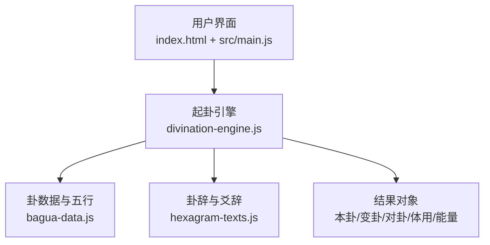
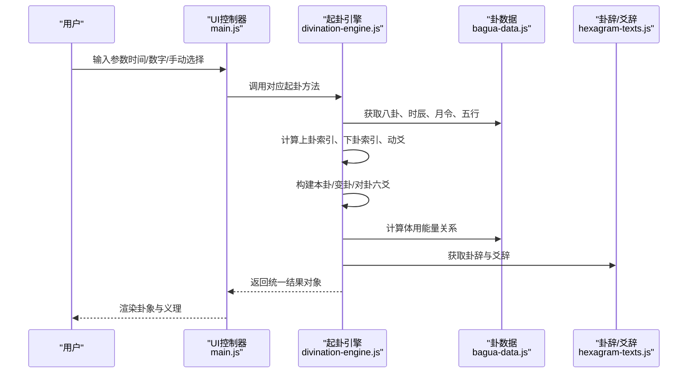
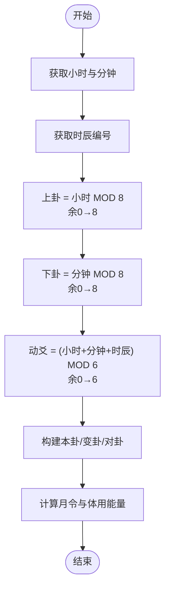
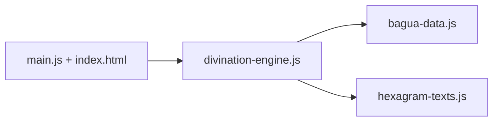

# 起卦方式

<cite>
**本文引用的文件**
- [divination-engine.js](file://src/core/divination-engine.js)
- [bagua-data.js](file://src/core/bagua-data.js)
- [hexagram-texts.js](file://src/core/hexagram-texts.js)
- [main.js](file://src/main.js)
- [index.html](file://index.html)
- [divination.test.js](file://__tests__/divination.test.js)
</cite>

## 目录
1. [简介](#简介)
2. [项目结构](#项目结构)
3. [核心组件](#核心组件)
4. [架构总览](#架构总览)
5. [详细组件分析](#详细组件分析)
6. [依赖分析](#依赖分析)
7. [性能考虑](#性能考虑)
8. [故障排查指南](#故障排查指南)
9. [结论](#结论)
10. [附录](#附录)

## 简介
本文面向三种起卦方式：时间起卦（castByTime）、两数法（castByTwoNumbers）、三数法（castByThreeNumbers）以及手动选卦（castManual），提供从算法原理到实现细节、API 接口规范、边界条件与错误处理、典型使用场景与示例的完整技术文档。读者无需深厚的易学背景，也能通过本文快速掌握系统如何根据输入生成本卦、变卦、对卦，并进行体用能量分析与义理解析。

## 项目结构
本项目采用前端单页应用架构，核心逻辑集中在“起卦引擎”模块，配合“卦数据”“卦辞与爻辞”“UI 控制器”等模块协同工作：
- 核心引擎：src/core/divination-engine.js
- 卦数据与五行：src/core/bagua-data.js
- 六十四卦卦辞与爻辞：src/core/hexagram-texts.js
- 用户界面与交互：src/main.js、index.html
- 测试：__tests__/divination.test.js

图表来源
- [divination-engine.js:1-433](file://src/core/divination-engine.js#L1-L433)
- [bagua-data.js:1-136](file://src/core/bagua-data.js#L1-L136)
- [hexagram-texts.js:1-800](file://src/core/hexagram-texts.js#L1-L800)
- [main.js:900-1099](file://src/main.js#L900-L1099)
- [index.html:515-578](file://index.html#L515-L578)

章节来源
- [divination-engine.js:1-433](file://src/core/divination-engine.js#L1-L433)
- [bagua-data.js:1-136](file://src/core/bagua-data.js#L1-L136)
- [hexagram-texts.js:1-800](file://src/core/hexagram-texts.js#L1-L800)
- [main.js:900-1099](file://src/main.js#L900-L1099)
- [index.html:515-578](file://index.html#L515-L578)

## 核心组件
- 起卦引擎（DivinationEngine）
  - 提供四种起卦模式：时间起卦、两数法、三数法、手动选卦
  - 统一封装构建结果、体用分析、能量关系、三阶段推理
- 卦数据（bagua-data.js）
  - 八卦、六十四卦名称映射、十二时辰、五行相生克、月令元素、体用能量状态
- 卦辞与爻辞（hexagram-texts.js）
  - 六十四卦卦辞与爻辞，用于义理解析
- UI 控制器（main.js + index.html）
  - 提供时间起卦、报数起卦、手动选卦的交互入口与参数校验
  - 触发引擎计算并渲染结果

章节来源
- [divination-engine.js:23-433](file://src/core/divination-engine.js#L23-L433)
- [bagua-data.js:8-136](file://src/core/bagua-data.js#L8-L136)
- [hexagram-texts.js:6-392](file://src/core/hexagram-texts.js#L6-L392)
- [main.js:914-959](file://src/main.js#L914-L959)
- [index.html:515-578](file://index.html#L515-L578)

## 架构总览
三种起卦方式共享同一套“构建结果”流程：根据上卦索引、下卦索引与动爻位置，生成本卦、变卦、对卦的六爻序列，再据此计算体用位置、体用能量关系与月令状态，最终输出统一的结果对象。

图表来源
- [main.js:914-959](file://src/main.js#L914-L959)
- [divination-engine.js:35-201](file://src/core/divination-engine.js#L35-L201)
- [bagua-data.js:37-92](file://src/core/bagua-data.js#L37-L92)
- [hexagram-texts.js:6-392](file://src/core/hexagram-texts.js#L6-L392)

## 详细组件分析

### 时间起卦（castByTime）
- 算法原理
  - 上卦索引：小时对 8 取余（余 0 当作 8）
  - 下卦索引：分钟对 8 取余（余 0 当作 8）
  - 动爻：(小时 + 分钟 + 时辰数) 对 6 取余（余 0 当作 6）
  - 通过上、下卦索引组合得到本卦，动爻翻转得到变卦，对卦为本卦上下卦互换
- 数学逻辑
  - 取余函数 remainder(value, divisor)：当被除尽时返回除数本身，确保索引落在 1..8（上/下卦）或 1..6（动爻）
  - 时辰映射：getShichen(hour) 将小时映射到十二时辰编号，用于动爻计算
- 结果字段
  - original/changed/opposite：包含上下卦索引、名称、六爻序列
  - movingYao：动爻位置（1..6）
  - tiYong：体用定位（上卦/下卦），依据动爻位置决定体用归属
  - energy：包含月令信息与体用能量关系（旺/相/休/囚/死）
- 适用场景
  - 快速起卦、随机起卦、强调“当下时空”的情境
  - 自动化最小化起卦（如页面加载后自动使用当前时间）

图表来源
- [divination-engine.js:35-47](file://src/core/divination-engine.js#L35-L47)
- [bagua-data.js:37-51](file://src/core/bagua-data.js#L37-L51)
- [divination-engine.js:27-30](file://src/core/divination-engine.js#L27-L30)

章节来源
- [divination-engine.js:35-47](file://src/core/divination-engine.js#L35-L47)
- [bagua-data.js:37-51](file://src/core/bagua-data.js#L37-L51)
- [divination-engine.js:27-30](file://src/core/divination-engine.js#L27-L30)
- [divination.test.js:6-51](file://__tests__/divination.test.js#L6-L51)

### 两数法（castByTwoNumbers）
- 算法原理
  - 上卦索引：第一个数对 8 取余（余 0 当作 8）
  - 下卦索引：第二个数对 8 取余（余 0 当作 8）
  - 动爻：(第一个数 + 第二个数 + 该时刻的时辰编号) 对 6 取余（余 0 当作 6）
- 与时间起卦的区别
  - 两数法引入“当前时刻”的时辰编号参与动爻计算，使结果与“当下”有一定关联
  - 两数法更适合“报数起卦”的场景，强调“意念投数”
- 边界与取余
  - 使用 remainder 函数保证索引合法范围
  - 大数自动取模，避免溢出与非法索引

章节来源
- [divination-engine.js:52-66](file://src/core/divination-engine.js#L52-L66)
- [bagua-data.js:37-51](file://src/core/bagua-data.js#L37-L51)
- [divination-engine.js:27-30](file://src/core/divination-engine.js#L27-L30)
- [divination.test.js:53-69](file://__tests__/divination.test.js#L53-L69)

### 三数法（castByThreeNumbers）
- 算法原理
  - 上卦索引：第一个数对 8 取余（余 0 当作 8）
  - 下卦索引：第二个数对 8 取余（余 0 当作 8）
  - 动爻：(第一个数 + 第二个数 + 第三个数) 对 6 取余（余 0 当作 6）
- 与两数法的区别
  - 三数法不引入“当前时刻”的时辰编号，完全由三个数字决定
  - 更强调“主观意念”与“三才”（天、地、人）的平衡
- 边界与取余
  - 同样使用 remainder 函数，支持大数取模

章节来源
- [divination-engine.js:71-84](file://src/core/divination-engine.js#L71-L84)
- [divination-engine.js:27-30](file://src/core/divination-engine.js#L27-L30)
- [divination.test.js:71-77](file://__tests__/divination.test.js#L71-L77)

### 手动选卦（castManual）
- 实现机制
  - 直接接收上卦索引、下卦索引、动爻位置，跳过计算步骤
  - 用于“已知卦象”的场景，或用于教学演示与对比分析
- 应用场景
  - 教学与研究：对比不同起卦方式的结果一致性
  - 特殊需求：用户已有特定卦象，希望进行后续分析
- 参数约束
  - 上/下卦索引应在 1..8，动爻应在 1..6

章节来源
- [divination-engine.js:89-99](file://src/core/divination-engine.js#L89-L99)
- [divination.test.js:79-87](file://__tests__/divination.test.js#L79-L87)

### 通用构建流程（buildResult）
- 八卦与六爻
  - 通过上/下卦索引获取原始六爻序列（下卦在下，上卦在上）
  - 变卦为动爻翻转后的结果；对卦为上下卦互换
- 体用定位（tiYong）
  - 若动爻 ≤ 3：体在下卦，用在上卦；否则体在上卦，用在下卦
- 能量分析（energy）
  - 月令元素来自月令计算
  - 体用能量状态基于“体卦元素”与“月令元素”的关系（旺/相/休/囚/死）
  - 体用关系分为“体用比和”“用生体（吉）”“体生用（泄）”“体克用（小吉）”“用克体（凶）”“平”
- 结果对象
  - original/changed/opposite：名称、上下卦索引、六爻序列、上下卦对象
  - movingYao：动爻位置
  - tiYong：体用定位与对应卦象
  - energy：月令、体用能量、体用关系
  - meta：起卦方式、参数详情、时间戳

章节来源
- [divination-engine.js:104-201](file://src/core/divination-engine.js#L104-L201)
- [bagua-data.js:72-92](file://src/core/bagua-data.js#L72-L92)

### API 接口说明（按模块）
- 起卦引擎（DivinationEngine）
  - castByTime(hour, minute)
    - 参数：hour ∈ [0,23]，minute ∈ [0,59]
    - 返回：统一结果对象（含 original/changed/opposite、movingYao、tiYong、energy、meta）
    - 错误：参数非法时应由调用方（UI层）拦截
  - castByTwoNumbers(num1, num2)
    - 参数：num1 ≥ 1，num2 ≥ 1，建议 ≤ 99999
    - 返回：统一结果对象（含 meta.method='报数起卦（两数法）'）
  - castByThreeNumbers(num1, num2, num3)
    - 参数：num1 ≥ 1，num2 ≥ 1，num3 ≥ 1，建议 ≤ 99999
    - 返回：统一结果对象（含 meta.method='报数起卦（三数法）'）
  - castManual(upperIdx, lowerIdx, movingYao)
    - 参数：upperIdx ∈ [1,8]，lowerIdx ∈ [1,8]，movingYao ∈ [1,6]
    - 返回：统一结果对象（含 meta.method='手动选卦'）
  - buildResult(upperIdx, lowerIdx, movingYao, meta)
    - 内部方法：构建完整结果对象
  - threeStageDeduction(result)
    - 输出三阶段推理摘要（缘起/过程/终局）与最终倾向判断
  - buildPayload(result, question, mode='simple')
    - 构造用于 AI 分析的结构化 payload
  - validateChangedHexagram(inputChangedName, result)
    - 校验用户输入的变卦名称是否正确
  - parseFromText(rawText)
    - 从文本解析卦象与动爻，便于后续分析
  - linesToTrigramIdx(lines)
    - 六爻序列到上/下卦索引的映射

章节来源
- [divination-engine.js:35-99](file://src/core/divination-engine.js#L35-L99)
- [divination-engine.js:104-201](file://src/core/divination-engine.js#L104-L201)
- [divination-engine.js:348-360](file://src/core/divination-engine.js#L348-L360)
- [divination-engine.js:297-346](file://src/core/divination-engine.js#L297-L346)
- [divination-engine.js:289-295](file://src/core/divination-engine.js#L289-L295)
- [divination-engine.js:212-266](file://src/core/divination-engine.js#L212-L266)
- [divination-engine.js:203-210](file://src/core/divination-engine.js#L203-L210)

### UI 与参数校验（main.js + index.html）
- 时间起卦
  - 输入：时间控件（时:分）
  - 校验：小时范围 0..23，分钟范围 0..59
  - 行为：调用 DivinationEngine.castByTime，渲染结果
- 报数起卦
  - 输入：两个必填数字（1..99999），第三个数字可选（1..99999）
  - 校验：NaN、越界、非正整数均拒绝
  - 行为：若第三个数存在则用三数法，否则两数法
- 手动选卦
  - 输入：上卦、下卦、动爻选择框
  - 校验：必须全部选择
  - 行为：调用 DivinationEngine.castManual，渲染结果

章节来源
- [main.js:914-959](file://src/main.js#L914-L959)
- [index.html:515-578](file://index.html#L515-L578)

### 实际使用示例与场景建议
- 时间起卦
  - 场景：清晨醒来，随机起卦了解当日运势
  - 步骤：打开时间起卦卡片，选择当前时间，点击“点击起卦”，随后进行断卦解析
- 两数法
  - 场景：心中默念两个数字，希望借助数字能量起卦
  - 步骤：在“报数起卦”卡片输入两个数字，点击“点击起卦”，随后进行断卦解析
- 三数法
  - 场景：希望引入第三个数字代表“天、地、人”三方平衡
  - 步骤：在“报数起卦”卡片输入三个数字，点击“点击起卦”，随后进行断卦解析
- 手动选卦
  - 场景：已有特定卦象，或用于教学演示
  - 步骤：在“手动选卦”卡片选择上卦、下卦与动爻，点击“确定卦象”

章节来源
- [main.js:914-959](file://src/main.js#L914-L959)
- [index.html:515-578](file://index.html#L515-L578)

## 依赖分析
- 引擎对数据层的依赖
  - 八卦与六十四卦名称映射：用于生成本卦/变卦/对卦名称
  - 十二时辰映射与月令元素：用于时间起卦与能量分析
  - 五行相生克关系：用于体用能量状态计算
- 引擎对文本层的依赖
  - 六十四卦卦辞与爻辞：用于义理解析与策略建议
- UI 对引擎的依赖
  - UI 层负责参数校验与触发，引擎层负责计算与结果封装

图表来源
- [divination-engine.js:6-21](file://src/core/divination-engine.js#L6-L21)
- [bagua-data.js:6-16](file://src/core/bagua-data.js#L6-L16)
- [hexagram-texts.js:1-4](file://src/core/hexagram-texts.js#L1-L4)
- [main.js:914-959](file://src/main.js#L914-L959)

章节来源
- [divination-engine.js:6-21](file://src/core/divination-engine.js#L6-L21)
- [bagua-data.js:6-16](file://src/core/bagua-data.js#L6-L16)
- [hexagram-texts.js:1-4](file://src/core/hexagram-texts.js#L1-L4)
- [main.js:914-959](file://src/main.js#L914-L959)

## 性能考虑
- 取余与索引映射均为 O(1)，整体复杂度低
- 六爻序列翻转与复制为 O(6)，可忽略
- 体用能量计算与关系判定为 O(1)
- 建议
  - 大数取模已在引擎内部处理，UI 层仍建议限制输入范围，避免不必要的计算
  - 对于批量分析，可合并调用并在 UI 层做节流

## 故障排查指南
- 常见错误与处理
  - 参数非法（时间/数字越界、非正整数、NaN）：UI 层已拦截并提示
  - 两数法/三数法第三个数为空：默认走两数法
  - 手动选卦未选择完整：UI 层提示“请选择上卦、下卦和动爻”
  - 变卦名称校验失败：引擎提供 validateChangedHexagram，返回正确名称与提示
- 调试建议
  - 使用测试用例验证边界行为（如取余为 0 的情况）
  - 比较不同起卦方式的动爻分布，核对体用定位是否符合预期

章节来源
- [main.js:914-959](file://src/main.js#L914-L959)
- [divination-engine.js:289-295](file://src/core/divination-engine.js#L289-L295)
- [divination.test.js:89-99](file://__tests__/divination.test.js#L89-L99)

## 结论
三种起卦方式在本系统中共享同一套“构建结果”与“体用能量分析”流程，差异主要体现在上/下卦索引与动爻的计算来源：
- 时间起卦：强调“当下时空”，动爻包含时辰编号
- 两数法：强调“意念投数”，动爻包含当前时辰编号
- 三数法：强调“三才平衡”，动爻仅由三数之和决定
- 手动选卦：强调“已知卦象”的教学与演示

通过统一的 API 与严谨的参数校验，系统能够在多种场景下稳定输出一致的卦象结果，并为进一步的义理解析提供基础。

## 附录
- 关键数据结构与映射
  - 八卦索引与六爻序列：TRIGRAMS
  - 六十四卦名称映射：HEXAGRAM_NAMES
  - 十二时辰编号：SHICHEN
  - 五行相生克：FIVE_ELEMENTS
  - 月令元素与体用能量状态：getMonthlyElement、getEnergyState
- 相关测试覆盖
  - 起卦结果完整性、动爻范围、体用定位、取余边界、payload 构造、三阶段推理

章节来源
- [bagua-data.js:10-92](file://src/core/bagua-data.js#L10-L92)
- [hexagram-texts.js:6-392](file://src/core/hexagram-texts.js#L6-L392)
- [divination.test.js:1-174](file://__tests__/divination.test.js#L1-L174)