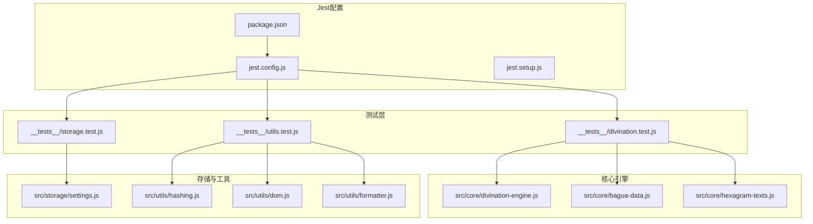
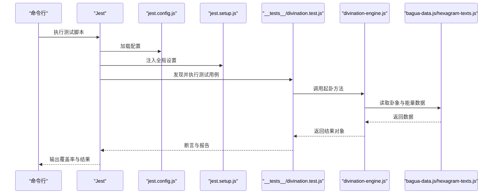
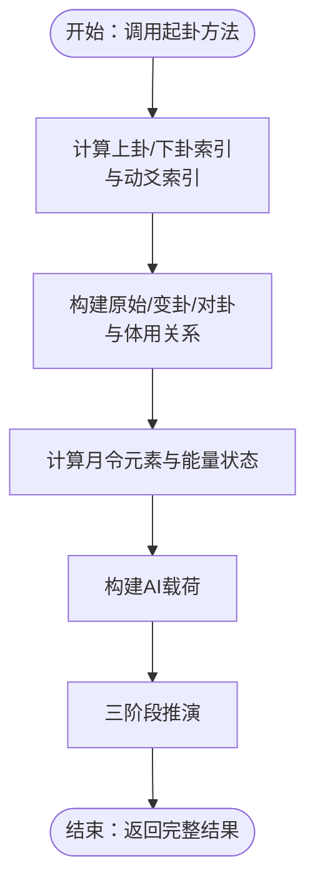
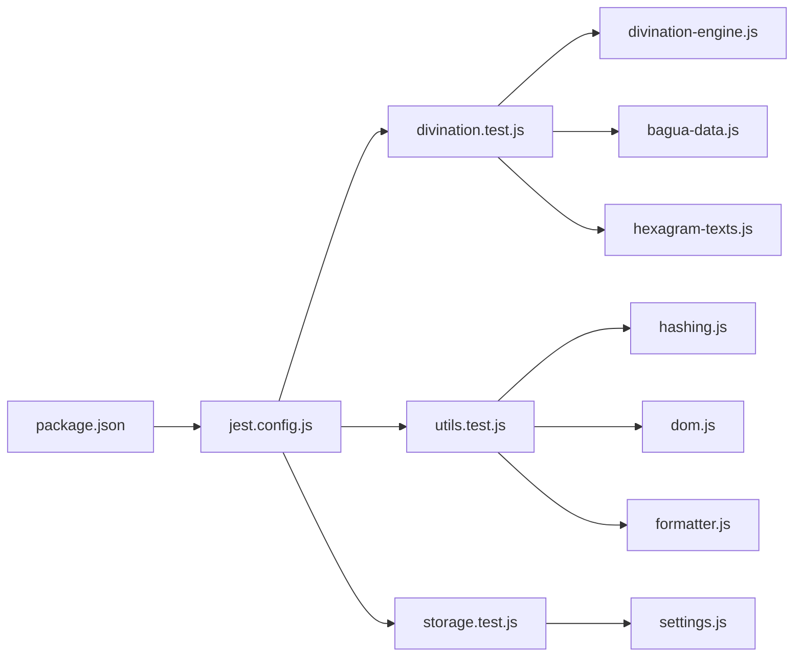

# 单元测试

<cite>
**本文引用的文件列表**
- [divination.test.js](file://__tests__/divination.test.js)
- [divination-engine.js](file://src/core/divination-engine.js)
- [bagua-data.js](file://src/core/bagua-data.js)
- [hexagram-texts.js](file://src/core/hexagram-texts.js)
- [jest.config.js](file://jest.config.js)
- [jest.setup.js](file://jest.setup.js)
- [package.json](file://package.json)
- [storage.test.js](file://__tests__/storage.test.js)
- [utils.test.js](file://__tests__/utils.test.js)
- [settings.js](file://src/storage/settings.js)
- [hashing.js](file://src/utils/hashing.js)
- [dom.js](file://src/utils/dom.js)
- [formatter.js](file://src/utils/formatter.js)
</cite>

## 目录
1. [简介](#简介)
2. [项目结构](#项目结构)
3. [核心组件](#核心组件)
4. [架构总览](#架构总览)
5. [详细组件分析](#详细组件分析)
6. [依赖分析](#依赖分析)
7. [性能考量](#性能考量)
8. [故障排查指南](#故障排查指南)
9. [结论](#结论)
10. [附录](#附录)

## 简介
本文件面向“梅花义理”项目的单元测试，聚焦于Jest测试框架在项目中的应用，特别是divination.test.js中对起卦引擎的测试用例设计与实现。文档将系统阐述时间起卦、两数起卦、三数起卦、手动起卦四种起卦方法的测试策略与断言方法，解释测试数据准备与验证逻辑（包括卦象结构、体用关系、能量状态等），并总结工具函数测试的最佳实践与测试用例编写规范。同时，文档涵盖测试覆盖率的计算与报告生成方法，Jest的mock与异步测试技巧，以及测试调试与问题定位的方法。

## 项目结构
项目采用模块化组织，测试文件位于__tests__目录，核心业务逻辑集中在src目录下的core、storage、ui、utils等子模块。Jest配置位于根目录，通过jest.config.js统一管理测试环境、转换规则、覆盖率阈值与脚本入口。

图表来源
- [divination.test.js:1-174](file://__tests__/divination.test.js#L1-L174)
- [divination-engine.js:1-433](file://src/core/divination-engine.js#L1-L433)
- [bagua-data.js:1-136](file://src/core/bagua-data.js#L1-L136)
- [hexagram-texts.js:1-922](file://src/core/hexagram-texts.js#L1-L922)
- [jest.config.js:1-43](file://jest.config.js#L1-L43)
- [jest.setup.js:1-9](file://jest.setup.js#L1-L9)
- [package.json:1-32](file://package.json#L1-L32)

章节来源
- [jest.config.js:1-43](file://jest.config.js#L1-L43)
- [jest.setup.js:1-9](file://jest.setup.js#L1-L9)
- [package.json:1-32](file://package.json#L1-L32)

## 核心组件
- 起卦引擎（DivinationEngine）：提供四种起卦方法（时间、两数、三数、手动），构建完整卦象结果，计算体用关系与能量状态，并支持AI推理载荷构建与三阶段推演。
- 八卦与六十四卦数据（bagua-data.js）：提供TRIGRAMS、HEXAGRAM_NAMES、SHICHEN、能量状态计算等基础数据与工具函数。
- 六十四卦卦辞与爻辞（hexagram-texts.js）：提供HEXAGRAM_JUDGMENTS与LINE_TEXTS，用于AI推理载荷与三阶段推演。
- 存储与工具：settings.js负责模型与提供商配置的本地持久化；hashing.js、dom.js、formatter.js提供安全与格式化能力。

章节来源
- [divination-engine.js:23-433](file://src/core/divination-engine.js#L23-L433)
- [bagua-data.js:8-136](file://src/core/bagua-data.js#L8-L136)
- [hexagram-texts.js:6-922](file://src/core/hexagram-texts.js#L6-L922)
- [settings.js:1-86](file://src/storage/settings.js#L1-L86)
- [hashing.js:1-20](file://src/utils/hashing.js#L1-L20)
- [dom.js:1-41](file://src/utils/dom.js#L1-L41)
- [formatter.js:1-92](file://src/utils/formatter.js#L1-L92)

## 架构总览
Jest作为测试运行器，通过babel-jest对ESM模块进行转换，使用jsdom作为DOM环境，配合setupFilesAfterEnv注入全局配置。测试覆盖src目录下除入口文件外的全部JS模块，覆盖率阈值为50%（分支、函数、行、语句）。测试脚本通过package.json统一调度。

图表来源
- [jest.config.js:1-43](file://jest.config.js#L1-L43)
- [jest.setup.js:1-9](file://jest.setup.js#L1-L9)
- [divination.test.js:1-174](file://__tests__/divination.test.js#L1-L174)
- [divination-engine.js:35-201](file://src/core/divination-engine.js#L35-L201)
- [bagua-data.js:37-92](file://src/core/bagua-data.js#L37-L92)
- [hexagram-texts.js:6-392](file://src/core/hexagram-texts.js#L6-L392)

## 详细组件分析

### 起卦引擎测试（divination.test.js）
该文件对DivinationEngine的四大起卦方法进行全面测试，覆盖结果结构、卦象完整性、体用位置、能量状态、AI载荷构建与三阶段推演等关键点。

- 时间起卦（castByTime）
  - 断言要点：结果对象包含original、changed、opposite、energy、movingYao等字段；每个卦象lines长度为6；tiYong根据movingYao位置在上卦/下卦间切换；卦名字符串有效；energy包含monthInfo与relation等。
  - 测试策略：固定小时与分钟输入，验证边界与常规场景；对tiYong位置进行条件断言，确保逻辑正确。
  - 关键路径参考：[divination.test.js:6-51](file://__tests__/divination.test.js#L6-L51)，[divination-engine.js:35-47](file://src/core/divination-engine.js#L35-L47)

- 两数起卦（castByTwoNumbers）
  - 断言要点：结果包含original与movingYao范围；meta.method为“报数起卦（两数法）”；大数通过取模映射到1-8区间。
  - 测试策略：使用较大数值验证取模逻辑；断言upper/lowerIdx落在有效范围。
  - 关键路径参考：[divination.test.js:53-69](file://__tests__/divination.test.js#L53-L69)，[divination-engine.js:52-66](file://src/core/divination-engine.js#L52-L66)

- 三数起卦（castByThreeNumbers）
  - 断言要点：结果包含original；meta.method为“报数起卦（三数法）”。
  - 测试策略：验证三数相加后取模确定动爻。
  - 关键路径参考：[divination.test.js:71-77](file://__tests__/divination.test.js#L71-L77)，[divination-engine.js:71-84](file://src/core/divination-engine.js#L71-L84)

- 手动起卦（castManual）
  - 断言要点：upperIdx、lowerIdx、movingYao直接来自输入；name与已知卦象匹配。
  - 测试策略：选择特定组合验证名称一致性。
  - 关键路径参考：[divination.test.js:79-87](file://__tests__/divination.test.js#L79-L87)，[divination-engine.js:89-99](file://src/core/divination-engine.js#L89-L99)

- 辅助函数与工具
  - remainder：验证整除时返回除数自身，非整除返回标准模运算。
  - buildPayload：验证AI载荷字段完整性，包括体用位置、卦名、动爻、体用关系与能量、月令状态、卦辞与爻辞等。
  - threeStageDeduction：验证origin/process/final三阶段关系与总结。
  - 关键路径参考：[divination.test.js:89-121](file://__tests__/divination.test.js#L89-L121)，[divination-engine.js:27-30](file://src/core/divination-engine.js#L27-L30)，[divination-engine.js:297-360](file://src/core/divination-engine.js#L297-L360)

- 八卦与六十四卦数据验证
  - TRIGRAMS与HEXAGRAM_NAMES数量断言；每个三爻卦lines长度为3；时辰映射正确；能量状态枚举合法。
  - 关键路径参考：[divination.test.js:123-153](file://__tests__/divination.test.js#L123-L153)，[bagua-data.js:10-19](file://src/core/bagua-data.js#L10-L19)，[bagua-data.js:53-70](file://src/core/bagua-data.js#L53-L70)，[bagua-data.js:37-51](file://src/core/bagua-data.js#L37-L51)，[bagua-data.js:85-92](file://src/core/bagua-data.js#L85-L92)

- 六十四卦文本验证
  - HEXAGRAM_JUDGMENTS数量断言；每条记录包含name、judgment、strategy；LINE_TEXTS每卦6条爻辞。
  - 关键路径参考：[divination.test.js:155-173](file://__tests__/divination.test.js#L155-L173)，[hexagram-texts.js:7-392](file://src/core/hexagram-texts.js#L7-L392)，[hexagram-texts.js:394-916](file://src/core/hexagram-texts.js#L394-L916)

图表来源
- [divination-engine.js:104-201](file://src/core/divination-engine.js#L104-L201)
- [divination-engine.js:297-360](file://src/core/divination-engine.js#L297-L360)

章节来源
- [divination.test.js:1-174](file://__tests__/divination.test.js#L1-L174)
- [divination-engine.js:23-433](file://src/core/divination-engine.js#L23-L433)
- [bagua-data.js:1-136](file://src/core/bagua-data.js#L1-L136)
- [hexagram-texts.js:1-922](file://src/core/hexagram-texts.js#L1-L922)

### 工具函数测试（utils.test.js）
- 哈希函数（hashPassword）
  - 断言要点：相同输入产生相同哈希；不同输入产生不同哈希；返回字符串且长度大于0。
  - 最佳实践：覆盖空输入、特殊字符、超长字符串等边界场景。
  - 关键路径参考：[utils.test.js:5-20](file://__tests__/utils.test.js#L5-L20)，[hashing.js:4-19](file://src/utils/hashing.js#L4-L19)

- DOM工具（escapeHtml）
  - 断言要点：转义HTML特殊字符；对空值返回空字符串。
  - 最佳实践：结合真实DOM环境测试（如jsdom）以验证渲染行为。
  - 关键路径参考：[utils.test.js:22-42](file://__tests__/utils.test.js#L22-L42)，[dom.js:7-15](file://src/utils/dom.js#L7-L15)

- 文本格式化（formatMarkdown）
  - 断言要点：标题层级转换、加粗与斜体、换行、列表、HTML转义；空输入返回空字符串；对未闭合加粗进行自动闭合。
  - 最佳实践：覆盖多种Markdown语法与混合内容，确保输出稳定。
  - 关键路径参考：[utils.test.js:44-75](file://__tests__/utils.test.js#L44-L75)，[formatter.js:61-91](file://src/utils/formatter.js#L61-L91)

章节来源
- [utils.test.js:1-76](file://__tests__/utils.test.js#L1-L76)
- [hashing.js:1-20](file://src/utils/hashing.js#L1-L20)
- [dom.js:1-41](file://src/utils/dom.js#L1-L41)
- [formatter.js:1-92](file://src/utils/formatter.js#L1-L92)

### 存储与设置测试（storage.test.js）
- 设置加载与保存：默认返回包含端点默认值的对象；保存后localStorage写入JSON；检测API Key存在性。
- 用户认证：注册新用户、重复用户名拒绝、登录凭据校验、当前用户状态、登出清理。
- 历史记录：用户历史键生成、添加记录前置、记录上限控制、删除指定记录。
- 异步与Mock：使用Promise.reject模拟网络失败；使用jest.spyOn监控console.warn与console.error；使用localStorageMock隔离外部依赖。
- 关键路径参考：[storage.test.js:24-51](file://__tests__/storage.test.js#L24-L51)，[settings.js:38-85](file://src/storage/settings.js#L38-L85)

章节来源
- [storage.test.js:1-198](file://__tests__/storage.test.js#L1-L198)
- [settings.js:1-86](file://src/storage/settings.js#L1-L86)

## 依赖分析
- 测试对被测模块的耦合
  - divination.test.js直接依赖divination-engine.js与bagua-data.js、hexagram-texts.js的数据与函数。
  - utils.test.js与storage.test.js分别依赖各自工具与存储模块。
- 外部依赖与集成点
  - Jest通过babel-jest转换ESM模块；jsdom提供DOM环境；setupFilesAfterEnv注入全局配置。
  - package.json定义测试脚本，统一执行jest、watch与覆盖率报告。
- 循环依赖与风险
  - 当前模块间为单向依赖，无明显循环；注意在测试中避免对全局状态的副作用。

图表来源
- [divination.test.js:1-174](file://__tests__/divination.test.js#L1-L174)
- [divination-engine.js:1-433](file://src/core/divination-engine.js#L1-L433)
- [bagua-data.js:1-136](file://src/core/bagua-data.js#L1-L136)
- [hexagram-texts.js:1-922](file://src/core/hexagram-texts.js#L1-L922)
- [utils.test.js:1-76](file://__tests__/utils.test.js#L1-L76)
- [hashing.js:1-20](file://src/utils/hashing.js#L1-L20)
- [dom.js:1-41](file://src/utils/dom.js#L1-L41)
- [formatter.js:1-92](file://src/utils/formatter.js#L1-L92)
- [storage.test.js:1-198](file://__tests__/storage.test.js#L1-L198)
- [settings.js:1-86](file://src/storage/settings.js#L1-L86)
- [jest.config.js:1-43](file://jest.config.js#L1-L43)
- [package.json:1-32](file://package.json#L1-L32)

章节来源
- [jest.config.js:1-43](file://jest.config.js#L1-L43)
- [package.json:5-13](file://package.json#L5-L13)

## 性能考量
- 测试执行速度
  - 使用testTimeout控制单个测试超时；合理拆分大型测试用例，避免不必要的计算。
- 覆盖率与质量
  - 全局覆盖率阈值为50%，建议逐步提升至更高水平；关注热点路径与边界条件。
- 异步与IO
  - 对异步操作使用Promise与async/await；对外部依赖（如fetch）进行Mock，减少真实网络请求。

## 故障排查指南
- 测试失败定位
  - 使用verbose输出与详细断言信息；结合Jest的watch模式快速迭代。
  - 对于DOM相关测试，确认jsdom环境配置与全局变量注入。
- Mock与异步
  - 使用jest.fn与jest.spyOn模拟外部依赖；对Promise.reject进行明确处理，避免未捕获异常。
  - 对localStorage进行Mock，确保测试隔离与可重复性。
- 覆盖率报告
  - 通过test:coverage脚本生成报告；关注未覆盖的分支与函数，补充针对性用例。

章节来源
- [jest.config.js:32-42](file://jest.config.js#L32-L42)
- [storage.test.js:24-51](file://__tests__/storage.test.js#L24-L51)

## 结论
本项目基于Jest建立了完善的单元测试体系，覆盖起卦引擎、工具函数与存储模块。通过对四种起卦方法的全面断言、对卦象结构与能量状态的验证、对AI载荷与推演流程的检查，确保了核心业务逻辑的正确性与稳定性。建议持续优化覆盖率阈值，完善边界与异常场景测试，并保持测试脚本与配置的简洁与可维护性。

## 附录
- 测试脚本与配置
  - 测试命令：test、test:watch、test:coverage
  - 覆盖率收集：src/**/*.js（排除入口与样式）
  - 超时与缓存：testTimeout、cacheDirectory
- 最佳实践清单
  - 明确断言目标与边界条件
  - 合理使用Mock与隔离外部依赖
  - 保持测试命名清晰、描述性强
  - 定期审查覆盖率并补齐薄弱环节

章节来源
- [package.json:5-13](file://package.json#L5-L13)
- [jest.config.js:16-42](file://jest.config.js#L16-L42)