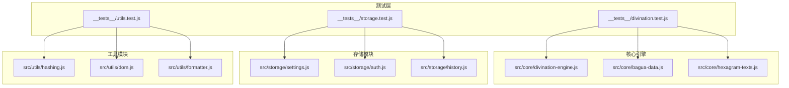
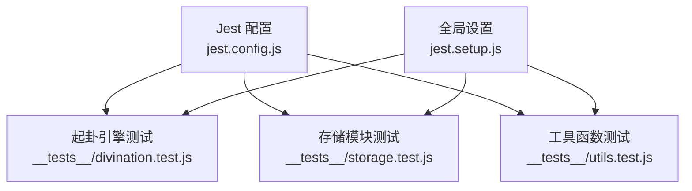
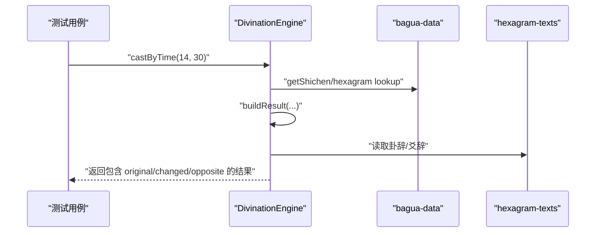
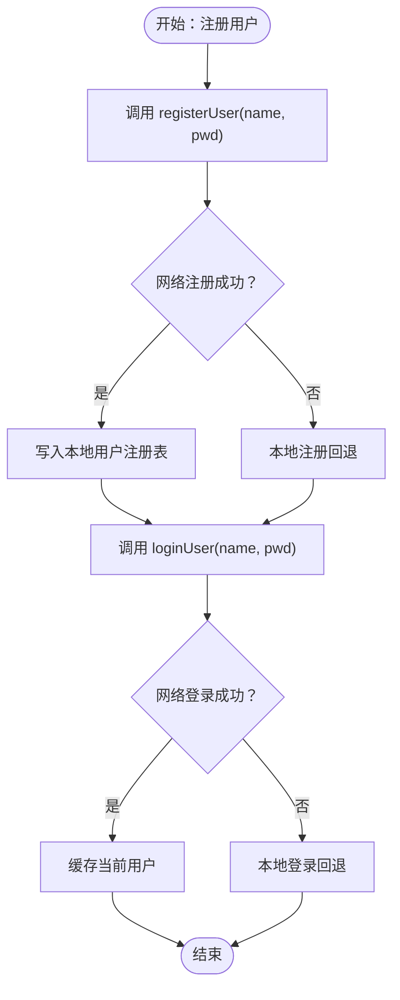
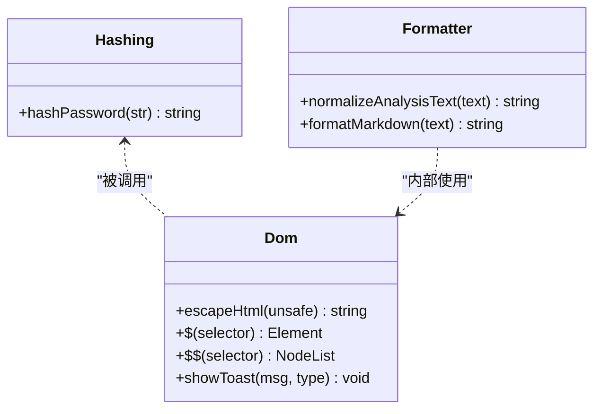
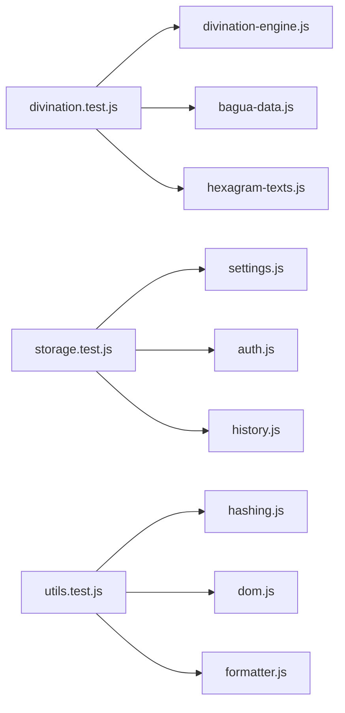

# 测试框架

<cite>
**本文引用的文件**
- [jest.config.js](file://jest.config.js)
- [jest.setup.js](file://jest.setup.js)
- [package.json](file://package.json)
- [__tests__/divination.test.js](file://__tests__/divination.test.js)
- [__tests__/storage.test.js](file://__tests__/storage.test.js)
- [__tests__/utils.test.js](file://__tests__/utils.test.js)
- [src/core/divination-engine.js](file://src/core/divination-engine.js)
- [src/storage/settings.js](file://src/storage/settings.js)
- [src/storage/auth.js](file://src/storage/auth.js)
- [src/storage/history.js](file://src/storage/history.js)
- [src/utils/hashing.js](file://src/utils/hashing.js)
- [src/utils/dom.js](file://src/utils/dom.js)
- [src/utils/formatter.js](file://src/utils/formatter.js)
</cite>

## 目录
1. [简介](#简介)
2. [项目结构](#项目结构)
3. [核心组件](#核心组件)
4. [架构总览](#架构总览)
5. [详细组件分析](#详细组件分析)
6. [依赖分析](#依赖分析)
7. [性能考虑](#性能考虑)
8. [故障排查指南](#故障排查指南)
9. [结论](#结论)
10. [附录](#附录)

## 简介
本文件面向“梅花义理”项目的测试框架，系统性阐述 Jest 的配置与使用、测试环境与全局配置、单元测试编写规范与最佳实践，并覆盖起卦引擎、存储模块、工具函数等核心模块的测试设计。同时给出覆盖率要求与报告生成方法、模拟对象与异步测试处理、测试数据准备与清理策略、持续集成中的测试执行配置、性能与集成测试实施方案，以及测试调试与问题定位方法。

## 项目结构
项目采用按功能分层与按模块划分相结合的组织方式，测试文件集中于 __tests__ 目录，分别覆盖核心引擎、存储与工具模块。Jest 配置位于根目录，脚本通过 npm scripts 统一管理。

图表来源
- [__tests__/divination.test.js:1-174](file://__tests__/divination.test.js#L1-L174)
- [__tests__/storage.test.js:1-198](file://__tests__/storage.test.js#L1-L198)
- [__tests__/utils.test.js:1-76](file://__tests__/utils.test.js#L1-L76)
- [src/core/divination-engine.js:1-433](file://src/core/divination-engine.js#L1-L433)
- [src/storage/settings.js:1-86](file://src/storage/settings.js#L1-L86)
- [src/storage/auth.js:1-350](file://src/storage/auth.js#L1-L350)
- [src/storage/history.js:1-143](file://src/storage/history.js#L1-L143)
- [src/utils/hashing.js:1-20](file://src/utils/hashing.js#L1-L20)
- [src/utils/dom.js:1-41](file://src/utils/dom.js#L1-L41)
- [src/utils/formatter.js:1-92](file://src/utils/formatter.js#L1-L92)

章节来源
- [jest.config.js:1-43](file://jest.config.js#L1-L43)
- [jest.setup.js:1-9](file://jest.setup.js#L1-L9)
- [package.json:1-32](file://package.json#L1-L32)

## 核心组件
- 测试运行器与环境
  - 使用 jsdom 作为测试环境，便于 DOM 相关工具函数与 UI 组件的测试。
  - 通过 babel-jest 对 ES 模块进行转换，确保现代语法兼容。
- 覆盖率与阈值
  - 收集范围覆盖 src 下的 JS 文件，排除入口样式与主入口脚本。
  - 全局阈值要求分支、函数、行、语句均达到 50%。
- 执行与缓存
  - 提供 test、test:watch、test:coverage 三种常用脚本。
  - 使用缓存目录加速重复执行。
- 全局配置
  - 通过 setupFilesAfterEnv 注入全局配置对象，便于统一控制测试行为。

章节来源
- [jest.config.js:1-43](file://jest.config.js#L1-L43)
- [jest.setup.js:1-9](file://jest.setup.js#L1-L9)
- [package.json:1-32](file://package.json#L1-L32)

## 架构总览
Jest 测试架构围绕三大模块展开：起卦引擎（核心业务）、存储模块（设置、认证、历史）、工具函数（加密、DOM、格式化）。测试文件以 describe/it 结构组织，断言覆盖数据结构完整性、边界条件、流程分支与异步交互。

图表来源
- [jest.config.js:1-43](file://jest.config.js#L1-L43)
- [jest.setup.js:1-9](file://jest.setup.js#L1-L9)
- [__tests__/divination.test.js:1-174](file://__tests__/divination.test.js#L1-L174)
- [__tests__/storage.test.js:1-198](file://__tests__/storage.test.js#L1-L198)
- [__tests__/utils.test.js:1-76](file://__tests__/utils.test.js#L1-L76)

## 详细组件分析

### 起卦引擎测试（DivinationEngine）
- 覆盖点
  - 时间起卦、两数法、三数法、手动选卦等多模式结果结构与数值范围。
  - 体用位置判定、卦名与爻位一致性、能量状态与五行关系。
  - 构建 AI 推理载荷与三阶段推理输出。
- 断言要点
  - 结构完整性：原卦/变卦/对卦均含上下卦索引、爻序列、名称等。
  - 边界与取余：动爻在 1..6，上/下卦索引在 1..8。
  - 关系与能量：体用关系枚举集合包含预期值；能量状态来自月令元素。
- 异步与模拟
  - 本模块为纯函数，无需 fetch 模拟；若后续扩展外部接口，需在 beforeEach 中注入 mock。

图表来源
- [__tests__/divination.test.js:1-174](file://__tests__/divination.test.js#L1-L174)
- [src/core/divination-engine.js:1-433](file://src/core/divination-engine.js#L1-L433)

章节来源
- [__tests__/divination.test.js:1-174](file://__tests__/divination.test.js#L1-L174)
- [src/core/divination-engine.js:1-433](file://src/core/divination-engine.js#L1-L433)

### 存储模块测试（Settings/Auth/History）
- Settings
  - 默认端点补齐、内置运营密钥回退、模型注册表与默认选择。
  - 断言默认配置、键值存在性与持久化行为。
- Auth
  - 注册/登录双栈（服务端优先，失败回退本地），会话恢复与登出。
  - 断言错误码、用户缓存与配额系统。
- History
  - 本地历史增删改查、上限限制、云端同步与合并。
  - 断言记录顺序、去重与容量裁剪。
- 模拟策略
  - 使用 localStorageMock 替代浏览器存储。
  - 使用 jest.spyOn 捕获 console.warn/error，避免污染测试输出。
  - 在 beforeEach 中清理状态与 mock，保证用例隔离。

图表来源
- [__tests__/storage.test.js:1-198](file://__tests__/storage.test.js#L1-L198)
- [src/storage/auth.js:1-350](file://src/storage/auth.js#L1-L350)
- [src/storage/settings.js:1-86](file://src/storage/settings.js#L1-L86)
- [src/storage/history.js:1-143](file://src/storage/history.js#L1-L143)

章节来源
- [__tests__/storage.test.js:1-198](file://__tests__/storage.test.js#L1-L198)
- [src/storage/settings.js:1-86](file://src/storage/settings.js#L1-L86)
- [src/storage/auth.js:1-350](file://src/storage/auth.js#L1-L350)
- [src/storage/history.js:1-143](file://src/storage/history.js#L1-L143)

### 工具函数测试（Hashing/DOM/Formatter）
- Hashing
  - 确保相同输入产生一致输出、不同输入输出不同、返回字符串类型且非空。
- DOM
  - HTML 转义覆盖常见字符场景，空值返回空串。
- Formatter
  - 标题规范化、Markdown 到 HTML 转换、加粗/斜体/换行/列表处理，以及输入转义。

图表来源
- [src/utils/hashing.js:1-20](file://src/utils/hashing.js#L1-L20)
- [src/utils/dom.js:1-41](file://src/utils/dom.js#L1-L41)
- [src/utils/formatter.js:1-92](file://src/utils/formatter.js#L1-L92)

章节来源
- [__tests__/utils.test.js:1-76](file://__tests__/utils.test.js#L1-L76)
- [src/utils/hashing.js:1-20](file://src/utils/hashing.js#L1-L20)
- [src/utils/dom.js:1-41](file://src/utils/dom.js#L1-L41)
- [src/utils/formatter.js:1-92](file://src/utils/formatter.js#L1-L92)

## 依赖分析
- 测试对源码的依赖
  - 起卦引擎测试依赖核心数据与文本映射，确保数据结构与算法一致性。
  - 存储模块测试依赖 settings/auth/history 的导出函数，覆盖本地与云端交互。
  - 工具函数测试独立性强，主要验证纯函数行为。
- 外部依赖
  - Jest 与 jsdom 环境、babel-jest 转换器。
  - 浏览器全局对象（如 localStorage、fetch）在测试中通过模拟替代。

图表来源
- [__tests__/divination.test.js:1-174](file://__tests__/divination.test.js#L1-L174)
- [__tests__/storage.test.js:1-198](file://__tests__/storage.test.js#L1-L198)
- [__tests__/utils.test.js:1-76](file://__tests__/utils.test.js#L1-L76)
- [src/core/divination-engine.js:1-433](file://src/core/divination-engine.js#L1-L433)
- [src/storage/settings.js:1-86](file://src/storage/settings.js#L1-L86)
- [src/storage/auth.js:1-350](file://src/storage/auth.js#L1-L350)
- [src/storage/history.js:1-143](file://src/storage/history.js#L1-L143)
- [src/utils/hashing.js:1-20](file://src/utils/hashing.js#L1-L20)
- [src/utils/dom.js:1-41](file://src/utils/dom.js#L1-L41)
- [src/utils/formatter.js:1-92](file://src/utils/formatter.js#L1-L92)

章节来源
- [__tests__/divination.test.js:1-174](file://__tests__/divination.test.js#L1-L174)
- [__tests__/storage.test.js:1-198](file://__tests__/storage.test.js#L1-L198)
- [__tests__/utils.test.js:1-76](file://__tests__/utils.test.js#L1-L76)

## 性能考虑
- 测试超时与并发
  - 单个测试超时设为 10 秒，避免长时间阻塞。
  - 使用 --watch 模式快速迭代，结合缓存目录减少重复构建。
- 覆盖率与性能平衡
  - 全局阈值 50%，建议逐步提升至更高水平，避免过度追求覆盖率而牺牲开发效率。
- 异步测试优化
  - 对 fetch 等网络请求使用 mock，减少真实网络开销。
  - 将昂贵的初始化逻辑放入全局 setup，避免每个用例重复构造。

[本节为通用指导，无需列出章节来源]

## 故障排查指南
- 常见问题
  - 覆盖率未达标：检查 collectCoverageFrom 是否覆盖目标文件，确认排除项合理。
  - DOM 相关测试失败：确认 jsdom 环境已启用，必要时在 setup 中注入 polyfill。
  - 异步断言失败：使用 async/await 或返回 Promise，确保在测试结束前完成。
  - 模拟失效：在 beforeEach 中重置 jest.clearAllMocks()，并在 afterEach 恢复 console 的 spy。
- 定位方法
  - 使用 --verbose 输出详细信息。
  - 通过 --testNamePattern 精确运行特定用例。
  - 使用 --coverage 生成报告，结合 CI 的覆盖率对比查看差异。

章节来源
- [jest.config.js:1-43](file://jest.config.js#L1-L43)
- [jest.setup.js:1-9](file://jest.setup.js#L1-L9)
- [__tests__/storage.test.js:1-198](file://__tests__/storage.test.js#L1-L198)

## 结论
本项目测试框架以 Jest 为核心，配合 jsdom 环境与 babel-jest 转换，覆盖起卦引擎、存储与工具模块的关键路径。通过合理的断言策略、模拟对象与异步处理，确保核心业务逻辑的稳定性与可维护性。建议在现有基础上逐步提升覆盖率阈值，完善性能与集成测试，持续优化测试执行效率与可读性。

[本节为总结性内容，无需列出章节来源]

## 附录

### 测试命令与脚本
- 基础执行
  - 运行全部测试：npm run test
  - 监听模式：npm run test:watch
  - 生成覆盖率：npm run test:coverage
- 配置说明
  - 测试环境：jsdom
  - 匹配模式：test-*.js 与 __tests__/**/*.js
  - 转换器：babel-jest
  - 超时：10 秒
  - 缓存目录：./.jest_cache

章节来源
- [package.json:1-32](file://package.json#L1-L32)
- [jest.config.js:1-43](file://jest.config.js#L1-L43)

### 覆盖率与报告
- 收集范围
  - 收集 src 下的 JS 文件，排除入口样式与主入口脚本。
- 阈值
  - 全局分支、函数、行、语句均不低于 50%。
- 报告生成
  - 使用 npm run test:coverage 生成报告，可在 CI 中与覆盖率阈值对比。

章节来源
- [jest.config.js:16-30](file://jest.config.js#L16-L30)

### 模拟对象与异步处理
- 模拟策略
  - localStorage：通过全局属性替换，注入 getItem/setItem/removeItem/clear。
  - fetch：在 beforeEach 中设置全局拒绝的 mock，用于验证错误分支。
  - console：使用 jest.spyOn 捕获警告与错误，避免影响测试输出。
- 异步测试
  - 使用 async/await 或返回 Promise。
  - 在 beforeEach 中清理 mock，在 afterEach 恢复。

章节来源
- [__tests__/storage.test.js:24-51](file://__tests__/storage.test.js#L24-L51)

### 测试数据准备与清理
- 准备
  - 在 describe 外部定义共享常量与辅助函数，避免重复计算。
  - 使用固定种子或确定性输入，确保可重复性。
- 清理
  - beforeEach 清空 localStorage、重置 fetch、清理所有 mock。
  - afterEach 恢复 console 的 spy。

章节来源
- [__tests__/storage.test.js:40-51](file://__tests__/storage.test.js#L40-L51)

### 持续集成中的测试执行
- 建议步骤
  - 安装依赖后执行 npm run test。
  - 在 CI 中开启覆盖率收集，对比阈值。
  - 将 --watch 与缓存目录用于本地开发，减少 CI 压力。
- 集成要点
  - 确保 jsdom 环境变量与 Node 版本兼容。
  - 如需网络测试，提供稳定的 mock 服务或离线模式。

章节来源
- [jest.config.js:32-42](file://jest.config.js#L32-L42)
- [package.json:5-13](file://package.json#L5-L13)

### 性能测试与集成测试实施方案
- 性能测试
  - 使用高负载输入（如大量历史记录、高频调用）评估吞吐与延迟。
  - 通过 --reporters 与缓存目录优化执行速度。
- 集成测试
  - 模拟服务端接口，验证注册/登录/历史同步的端到端流程。
  - 使用独立的测试数据库或内存存储，避免污染生产数据。

[本节为通用指导，无需列出章节来源]