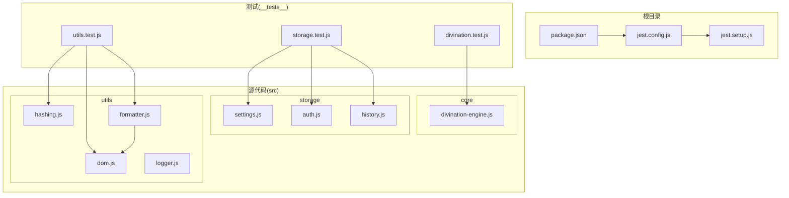
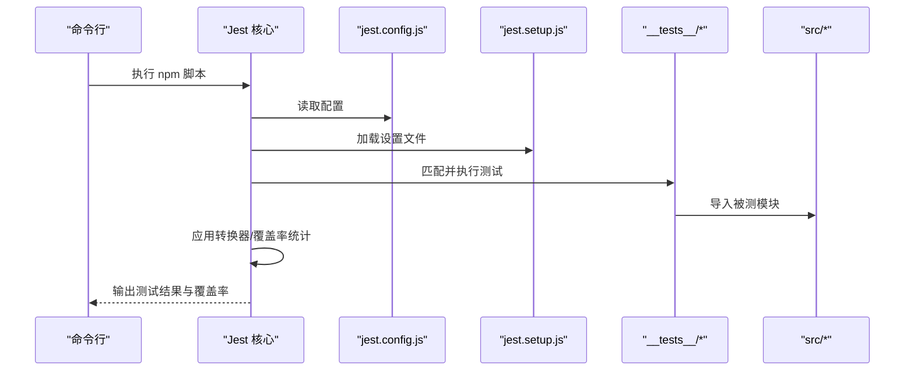
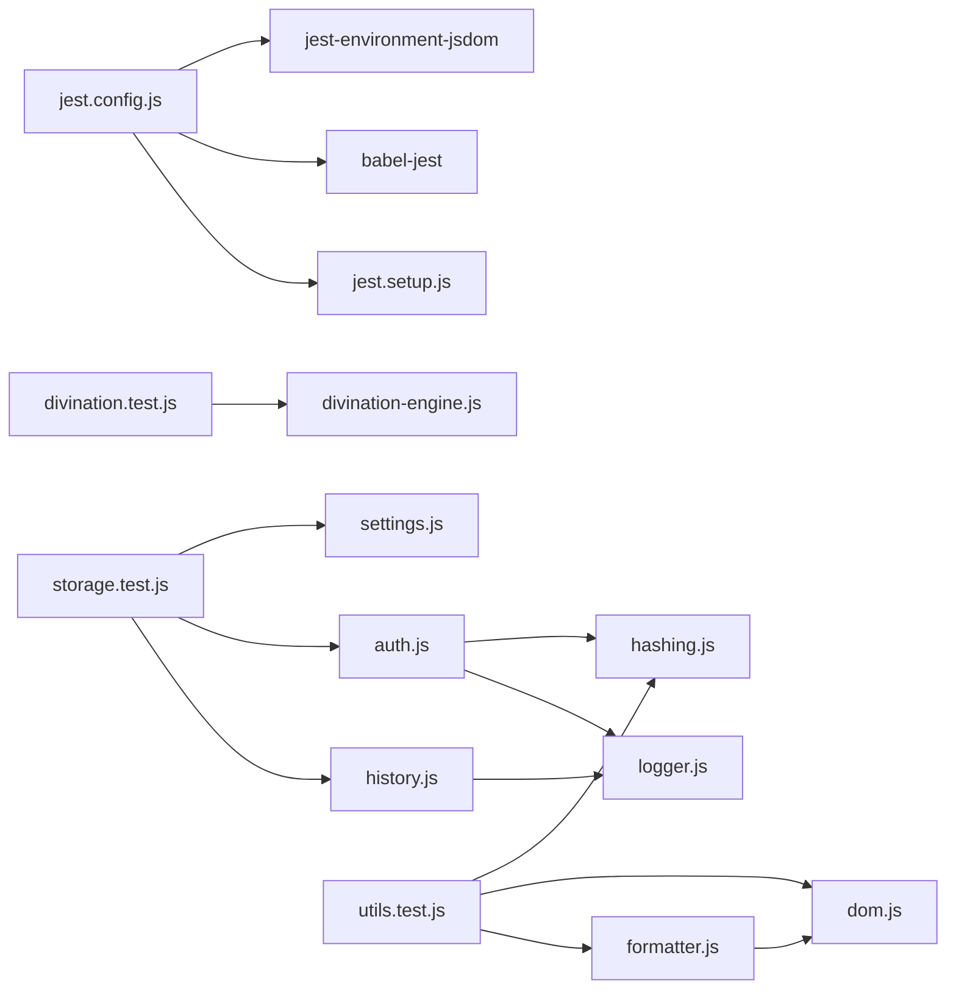

# 测试配置

<cite>
**本文引用的文件**
- [jest.config.js](file://jest.config.js)
- [jest.setup.js](file://jest.setup.js)
- [package.json](file://package.json)
- [__tests__/divination.test.js](file://__tests__/divination.test.js)
- [__tests__/storage.test.js](file://__tests__/storage.test.js)
- [__tests__/utils.test.js](file://__tests__/utils.test.js)
- [src/core/divination-engine.js](file://src/core/divination-engine.js)
- [src/storage/settings.js](file://src/storage/settings.js)
- [src/storage/auth.js](file://src/storage/auth.js)
- [src/storage/history.js](file://src/storage/history.js)
- [src/utils/hashing.js](file://src/utils/hashing.js)
- [src/utils/dom.js](file://src/utils/dom.js)
- [src/utils/formatter.js](file://src/utils/formatter.js)
- [src/utils/logger.js](file://src/utils/logger.js)
</cite>

## 目录
1. [简介](#简介)
2. [项目结构](#项目结构)
3. [核心组件](#核心组件)
4. [架构总览](#架构总览)
5. [详细组件分析](#详细组件分析)
6. [依赖分析](#依赖分析)
7. [性能考虑](#性能考虑)
8. [故障排查指南](#故障排查指南)
9. [结论](#结论)
10. [附录](#附录)

## 简介
本文件系统性梳理“梅花义理”项目的测试配置与实践，覆盖 Jest 配置项、测试环境初始化、模块解析与转换、覆盖率策略、测试脚本与 CI/CD 建议、模拟与第三方库 mock、环境变量与数据库连接注意事项、性能优化与常见问题排查。文档以仓库现有配置与测试文件为依据，帮助开发者快速理解并高效维护测试体系。

## 项目结构
项目采用按功能分层与按文件类型组织相结合的方式：
- 根目录包含测试配置文件、包管理与构建配置、入口页面与服务端示例。
- 测试文件集中于 __tests__ 目录，按功能模块划分（如 divination、storage、utils）。
- 源代码按领域拆分：core（算法引擎）、storage（设置/认证/历史）、ui（视图）、utils（工具）。

图表来源
- [jest.config.js:1-43](file://jest.config.js#L1-L43)
- [jest.setup.js:1-9](file://jest.setup.js#L1-L9)
- [package.json:1-32](file://package.json#L1-L32)
- [__tests__/divination.test.js:1-174](file://__tests__/divination.test.js#L1-L174)
- [__tests__/storage.test.js:1-198](file://__tests__/storage.test.js#L1-L198)
- [__tests__/utils.test.js:1-76](file://__tests__/utils.test.js#L1-L76)
- [src/core/divination-engine.js:1-433](file://src/core/divination-engine.js#L1-L433)
- [src/storage/settings.js:1-86](file://src/storage/settings.js#L1-L86)
- [src/storage/auth.js:1-350](file://src/storage/auth.js#L1-L350)
- [src/storage/history.js:1-143](file://src/storage/history.js#L1-L143)
- [src/utils/hashing.js:1-20](file://src/utils/hashing.js#L1-L20)
- [src/utils/dom.js:1-41](file://src/utils/dom.js#L1-L41)
- [src/utils/formatter.js:1-92](file://src/utils/formatter.js#L1-L92)
- [src/utils/logger.js:1-34](file://src/utils/logger.js#L1-L34)

章节来源
- [jest.config.js:1-43](file://jest.config.js#L1-L43)
- [jest.setup.js:1-9](file://jest.setup.js#L1-L9)
- [package.json:1-32](file://package.json#L1-L32)

## 核心组件
- Jest 配置文件：定义测试环境、匹配模式、转换器、覆盖率收集范围与阈值、超时、设置文件与缓存目录等。
- 测试设置文件：在每个测试运行后注入全局配置对象，便于统一控制测试行为。
- 包脚本：提供基础测试、监听模式、覆盖率报告等常用命令。
- 测试文件：覆盖核心算法、存储与认证、工具函数三大类，体现不同技术栈与交互场景。

章节来源
- [jest.config.js:1-43](file://jest.config.js#L1-L43)
- [jest.setup.js:1-9](file://jest.setup.js#L1-L9)
- [package.json:5-13](file://package.json#L5-L13)

## 架构总览
下图展示测试执行的关键流程：Jest 读取配置与设置文件，加载测试文件，按匹配规则执行，利用转换器处理源码，收集覆盖率并输出报告。

图表来源
- [jest.config.js:1-43](file://jest.config.js#L1-L43)
- [jest.setup.js:1-9](file://jest.setup.js#L1-L9)
- [package.json:5-13](file://package.json#L5-L13)

## 详细组件分析

### Jest 配置详解
- 测试环境
  - 使用 jsdom，使 DOM API 可用于前端逻辑测试。
- 测试文件匹配
  - 支持 test-*.js 与 __tests__/**/*.js 两种模式，便于灵活组织。
- 转换与编译
  - 使用 babel-jest 对 .js 文件进行转换，适配现代语法与导入。
- 覆盖率
  - 收集 src/**/*.js，排除入口与样式文件；设置全局分支/函数/行/语句阈值均为 50%。
- 运行参数
  - verbose 输出开启；单个测试超时 10 秒；设置文件路径通过 setupFilesAfterEnv 注入。
- 缓存
  - 使用 ./ .jest_cache 减少重复计算。

章节来源
- [jest.config.js:1-43](file://jest.config.js#L1-L43)

### 测试环境初始化与全局配置
- 初始化位置：setupFilesAfterEnv 指向 jest.setup.js。
- 全局配置：注入全局对象，包含 verbose 与 timeout 等键，便于测试侧统一行为控制。

章节来源
- [jest.config.js:38-39](file://jest.config.js#L38-L39)
- [jest.setup.js:4-8](file://jest.setup.js#L4-L8)

### 测试脚本与命令行参数
- 基础命令
  - test：运行全部测试
  - test:watch：监听模式运行
  - test:coverage：生成覆盖率报告
- 建议
  - 在 CI 中使用 test:coverage 并结合阈值，确保质量门槛。
  - 结合 --passWithNoTests、--silent 等参数优化 CI 行为（可在 package.json 中扩展）。

章节来源
- [package.json:9-11](file://package.json#L9-L11)

### 测试文件命名规范与组织结构
- 命名规范
  - 推荐 test-*.js 与 __tests__/**/*.test.js，保持一致可读性。
- 组织结构
  - 按功能模块划分：divination、storage、utils。
  - 每个模块的测试文件聚焦对应业务域，便于定位与维护。

章节来源
- [jest.config.js:6-9](file://jest.config.js#L6-L9)
- [__tests__/divination.test.js:1-174](file://__tests__/divination.test.js#L1-L174)
- [__tests__/storage.test.js:1-198](file://__tests__/storage.test.js#L1-L198)
- [__tests__/utils.test.js:1-76](file://__tests__/utils.test.js#L1-L76)

### 覆盖率配置与报告生成
- 收集范围
  - 收集 src 下所有 .js，排除入口与样式，避免非业务代码干扰。
- 阈值
  - 全局阈值 50%，可按需提升以保证关键路径覆盖。
- 报告生成
  - 使用 test:coverage 命令生成报告；可在 CI 中结合覆盖率检查工具。

章节来源
- [jest.config.js:16-30](file://jest.config.js#L16-L30)
- [package.json:11](file://package.json#L11)

### 测试数据模拟与第三方库 mock
- localStorage 模拟
  - 在 storage 测试中，通过自定义对象模拟 localStorage，确保持久化逻辑可测试。
- fetch 模拟
  - 在 storage 测试中，为全局 fetch 提供拒绝实现，验证网络失败回退逻辑。
- 控制台输出捕获
  - 使用 spy 记录 warn/error 输出，便于断言副作用。

章节来源
- [__tests__/storage.test.js:24-51](file://__tests__/storage.test.js#L24-L51)

### 测试环境变量与数据库连接
- 环境变量
  - logger 在生产模式下仅输出 warn 及以上级别；可通过 NODE_ENV 控制日志级别。
- 数据库/后端
  - 存储模块涉及远程 API（如登录、注册、历史同步），测试中通过 mock fetch 与本地存储实现隔离。
- 建议
  - 在 CI 中通过环境变量控制日志级别与网络行为，避免真实外部依赖影响稳定性。

章节来源
- [src/utils/logger.js:10-12](file://src/utils/logger.js#L10-L12)
- [src/storage/auth.js:50-87](file://src/storage/auth.js#L50-L87)
- [src/storage/history.js:65-72](file://src/storage/history.js#L65-L72)

### 测试性能优化与最佳实践
- 缓存目录
  - 使用 cacheDirectory 减少重复计算，提升启动速度。
- 超时与并发
  - 合理设置 testTimeout，避免长耗时测试阻塞流水线；必要时拆分大型测试。
- 覆盖率阈值
  - 初期 50% 易于维持，建议逐步提升至更严格的阈值。
- 选择性运行
  - 使用 --testPathPattern 或 --testNamePattern 精准定位问题。
- 监听模式
  - 在开发阶段使用 --watch，提高反馈效率。

章节来源
- [jest.config.js:41](file://jest.config.js#L41)
- [jest.config.js:35-36](file://jest.config.js#L35-L36)
- [package.json:10](file://package.json#L10)

### 关键测试用例与被测模块映射
- divination.test.js
  - 覆盖 DivinationEngine 的多种起卦方式、体用关系、payload 构造与三阶段推理。
- storage.test.js
  - 覆盖设置加载/保存、模型选择、认证注册/登录/登出、历史增删改查与云端同步。
- utils.test.js
  - 覆盖密码哈希、HTML 转义、Markdown 格式化等工具函数。

章节来源
- [__tests__/divination.test.js:1-174](file://__tests__/divination.test.js#L1-L174)
- [__tests__/storage.test.js:1-198](file://__tests__/storage.test.js#L1-L198)
- [__tests__/utils.test.js:1-76](file://__tests__/utils.test.js#L1-L76)

## 依赖分析
- 配置依赖
  - jest.config.js 依赖 jest-environment-jsdom 与 babel-jest。
  - jest.setup.js 作为设置文件被 jest.config.js 引入。
- 测试依赖
  - divination.test.js 依赖 divination-engine 与占卜数据常量。
  - storage.test.js 依赖 settings、auth、history 以及工具模块。
  - utils.test.js 依赖 hashing、dom、formatter。
- 工具链
  - logger 在 auth 与 history 中用于日志控制，受 NODE_ENV 影响。

图表来源
- [jest.config.js:1-43](file://jest.config.js#L1-L43)
- [jest.setup.js:1-9](file://jest.setup.js#L1-L9)
- [__tests__/divination.test.js:1-3](file://__tests__/divination.test.js#L1-L3)
- [__tests__/storage.test.js:1-22](file://__tests__/storage.test.js#L1-L22)
- [__tests__/utils.test.js:1-3](file://__tests__/utils.test.js#L1-L3)
- [src/core/divination-engine.js:6-21](file://src/core/divination-engine.js#L6-L21)
- [src/storage/settings.js:38-85](file://src/storage/settings.js#L38-L85)
- [src/storage/auth.js:5-8](file://src/storage/auth.js#L5-L8)
- [src/storage/history.js:5-7](file://src/storage/history.js#L5-L7)
- [src/utils/hashing.js:4-19](file://src/utils/hashing.js#L4-L19)
- [src/utils/dom.js:7-15](file://src/utils/dom.js#L7-L15)
- [src/utils/formatter.js:4-4](file://src/utils/formatter.js#L4-L4)
- [src/utils/logger.js:10-12](file://src/utils/logger.js#L10-L12)

章节来源
- [jest.config.js:28-30](file://jest.config.js#L28-L30)
- [package.json:24-31](file://package.json#L24-L31)

## 性能考虑
- 启用缓存目录，减少重复编译与初始化开销。
- 将长耗时测试拆分为独立文件，配合 --testPathPattern 快速定位。
- 在 CI 中使用并行与缓存策略，缩短流水线时间。
- 适度调整覆盖率阈值，避免过度追求覆盖率导致维护成本上升。

## 故障排查指南
- 测试超时
  - 现象：个别测试长时间卡住。
  - 排查：检查是否存在未 resolve 的异步操作、网络请求未 mock、或循环依赖。
  - 解决：为 fetch 提供明确的 mock 实现；拆分复杂测试；适当提高 testTimeout。
- 覆盖率不达标
  - 现象：CI 报告低于阈值。
  - 排查：确认 collectCoverageFrom 是否覆盖目标文件；检查是否排除了不应排除的文件。
  - 解决：调整阈值或补充测试用例。
- DOM API 未定义
  - 现象：测试中使用 document/querySelector 报错。
  - 排查：确认 testEnvironment 为 jsdom。
  - 解决：保持 jsdom 环境或在 setupFilesAfterEnv 中注入所需 polyfill。
- 日志级别差异
  - 现象：本地与 CI 日志输出不一致。
  - 排查：检查 NODE_ENV 是否为 production。
  - 解决：在 CI 中显式设置 NODE_ENV 或在脚本中传入。

章节来源
- [jest.config.js:3-3](file://jest.config.js#L3-L3)
- [jest.config.js:35-36](file://jest.config.js#L35-L36)
- [src/utils/logger.js:10-12](file://src/utils/logger.js#L10-L12)

## 结论
本项目测试配置简洁清晰，围绕 jsdom 环境、Babel 转换、覆盖率与超时控制形成闭环。通过合理的测试文件组织与 mock 策略，能够有效覆盖核心算法、存储与工具模块。建议在 CI 中启用覆盖率阈值与缓存，逐步提升测试质量与稳定性，并持续优化测试性能与可维护性。

## 附录
- 常用命令
  - 运行全部测试：npm run test
  - 监听模式：npm run test:watch
  - 生成覆盖率：npm run test:coverage
- CI/CD 建议
  - 在流水线中固定 Node 版本与依赖安装步骤，启用缓存目录与覆盖率阈值检查。
  - 对关键模块（如 divination-engine、auth、history）单独设置更高覆盖率阈值。