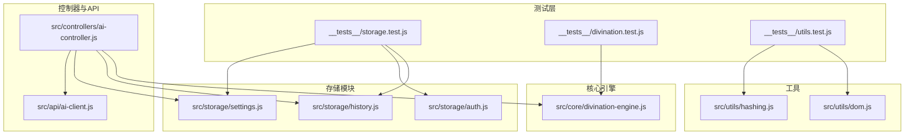
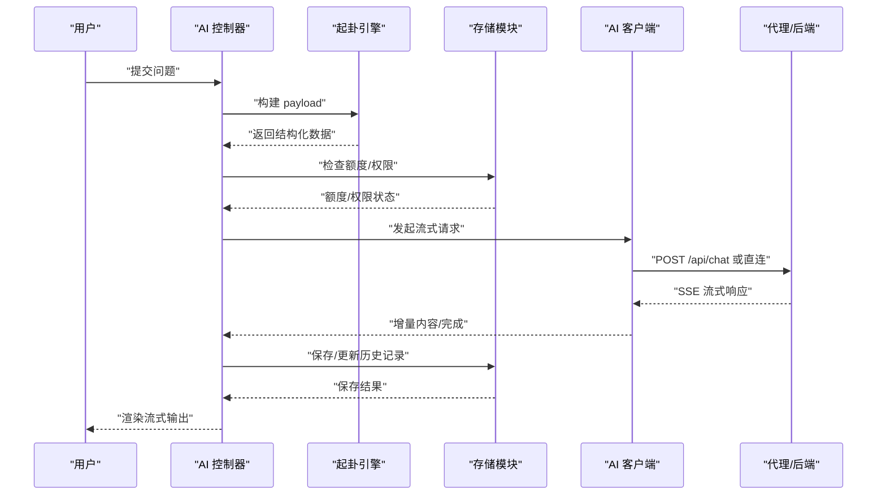
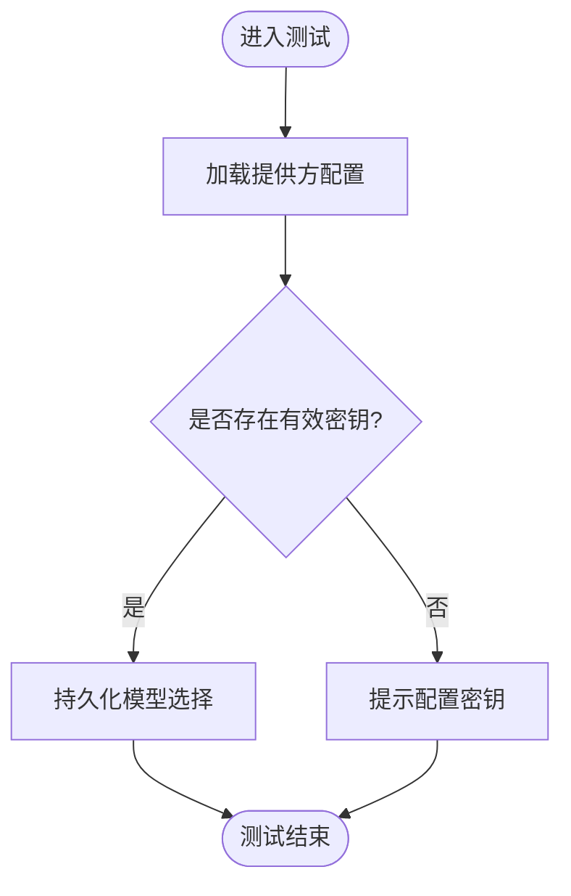
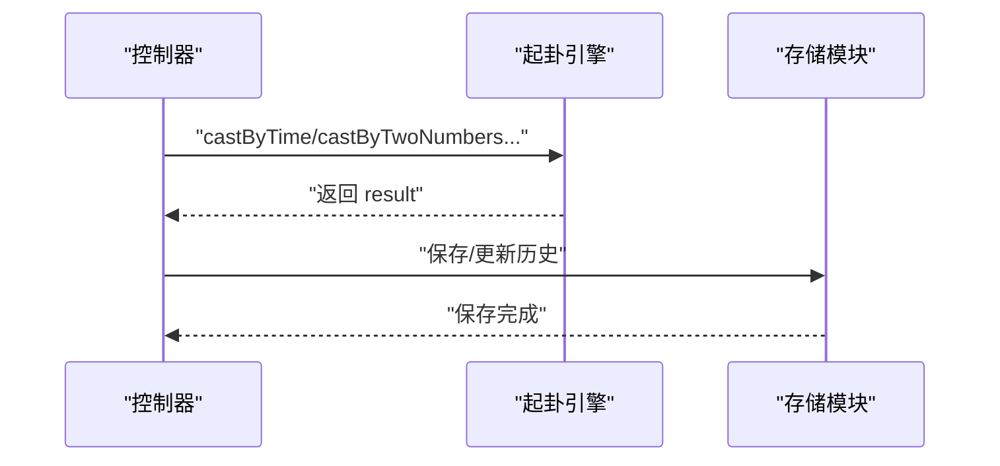
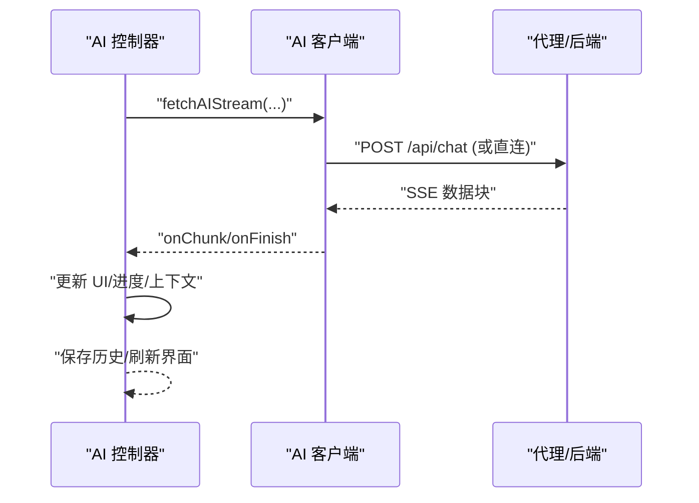
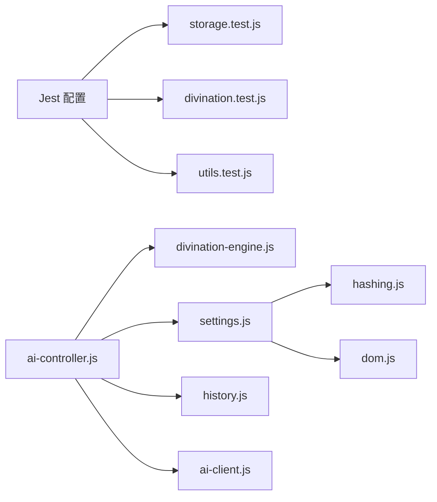

# 集成测试

<cite>
**本文引用的文件**   
- [jest.config.js](file://jest.config.js)
- [jest.setup.js](file://jest.setup.js)
- [storage.test.js](file://__tests__/storage.test.js)
- [divination.test.js](file://__tests__/divination.test.js)
- [utils.test.js](file://__tests__/utils.test.js)
- [settings.js](file://src/storage/settings.js)
- [auth.js](file://src/storage/auth.js)
- [history.js](file://src/storage/history.js)
- [ai-client.js](file://src/api/ai-client.js)
- [ai-controller.js](file://src/controllers/ai-controller.js)
- [divination-engine.js](file://src/core/divination-engine.js)
- [hashing.js](file://src/utils/hashing.js)
- [dom.js](file://src/utils/dom.js)
- [package.json](file://package.json)
</cite>

## 目录
1. [简介](#简介)
2. [项目结构](#项目结构)
3. [核心组件](#核心组件)
4. [架构总览](#架构总览)
5. [详细组件分析](#详细组件分析)
6. [依赖分析](#依赖分析)
7. [性能考虑](#性能考虑)
8. [故障排查指南](#故障排查指南)
9. [结论](#结论)
10. [附录](#附录)

## 简介
本文件面向“梅花义理”项目的集成测试，系统化阐述存储模块、起卦引擎与存储交互、API 与代理通信、端到端流程、数据库/持久化模拟与事务验证、测试环境与数据准备、性能与压力测试方案，以及测试失败的诊断与修复建议。文档兼顾工程实践与可读性，既可用于测试工程师，也可帮助产品与运维人员理解系统行为。

## 项目结构
项目采用前端单页应用结构，核心测试集中在 __tests__ 目录，覆盖存储、起卦引擎、工具模块；业务控制层位于 src/controllers，AI 推理通过 src/api/ai-client.js 与后端/代理通信；核心算法位于 src/core；通用工具位于 src/utils。

图表来源
- [storage.test.js:1-198](file://__tests__/storage.test.js#L1-L198)
- [divination.test.js:1-174](file://__tests__/divination.test.js#L1-L174)
- [utils.test.js:1-76](file://__tests__/utils.test.js#L1-L76)
- [settings.js:1-86](file://src/storage/settings.js#L1-L86)
- [auth.js:1-350](file://src/storage/auth.js#L1-L350)
- [history.js:1-143](file://src/storage/history.js#L1-L143)
- [ai-controller.js:1-733](file://src/controllers/ai-controller.js#L1-L733)
- [ai-client.js:1-185](file://src/api/ai-client.js#L1-L185)
- [divination-engine.js:1-433](file://src/core/divination-engine.js#L1-L433)
- [hashing.js:1-20](file://src/utils/hashing.js#L1-L20)
- [dom.js:1-41](file://src/utils/dom.js#L1-L41)

章节来源
- [jest.config.js:1-43](file://jest.config.js#L1-L43)
- [jest.setup.js:1-9](file://jest.setup.js#L1-L9)
- [package.json:1-32](file://package.json#L1-L32)

## 核心组件
- 存储模块：提供设置、认证、历史记录的本地与云端协同存储能力，并包含额度与访客配额管理。
- 起卦引擎：实现多种起卦方式，构建本/变/对三卦与能量分析，生成供 AI 使用的结构化 payload。
- 控制器与 API：封装 AI 推理流程、流式输出、停止/继续、历史记录持久化、额度与权限控制。
- 工具模块：密码哈希、DOM 辅助、HTML 转义与格式化等。

章节来源
- [settings.js:1-86](file://src/storage/settings.js#L1-L86)
- [auth.js:1-350](file://src/storage/auth.js#L1-L350)
- [history.js:1-143](file://src/storage/history.js#L1-L143)
- [divination-engine.js:1-433](file://src/core/divination-engine.js#L1-L433)
- [ai-controller.js:1-733](file://src/controllers/ai-controller.js#L1-L733)
- [ai-client.js:1-185](file://src/api/ai-client.js#L1-L185)
- [hashing.js:1-20](file://src/utils/hashing.js#L1-L20)
- [dom.js:1-41](file://src/utils/dom.js#L1-L41)

## 架构总览
下图展示了从用户发起问题到 AI 流式输出再到本地/云端历史持久化的端到端路径，以及与代理服务器的通信模式。

图表来源
- [ai-controller.js:24-524](file://src/controllers/ai-controller.js#L24-L524)
- [divination-engine.js:297-346](file://src/core/divination-engine.js#L297-L346)
- [ai-client.js:31-76](file://src/api/ai-client.js#L31-L76)
- [history.js:47-60](file://src/storage/history.js#L47-L60)

## 详细组件分析

### 存储模块集成测试策略
- 本地存储与默认值
  - 验证设置加载默认提供方端点与模型注册表存在性。
  - 验证未配置密钥时不会返回敏感信息。
  - 验证模型选择持久化与默认回退。
- 认证与会话
  - 注册/登录的正反用例与重复注册、错误密码、不存在用户等边界。
  - 本地回退与服务器失败时的行为。
  - 会话恢复与登出清理。
- 历史与反馈
  - 用户键生成、历史加载/添加/删除、上限截断与云端同步。
  - 反馈列表的本地持久化与容量限制。
- 并发与错误
  - localStorage 满额时的降级截断策略。
  - fetch 失败时的降级与告警。

图表来源
- [storage.test.js:53-100](file://__tests__/storage.test.js#L53-L100)
- [settings.js:38-85](file://src/storage/settings.js#L38-L85)

章节来源
- [storage.test.js:1-198](file://__tests__/storage.test.js#L1-L198)
- [settings.js:1-86](file://src/storage/settings.js#L1-L86)
- [auth.js:46-225](file://src/storage/auth.js#L46-L225)
- [history.js:15-102](file://src/storage/history.js#L15-L102)

### 起卦引擎与存储交互测试
- 多种起卦模式的正确性与边界（时间、两数、三数、手动）。
- 三阶段推演与矩阵分类的稳定性。
- 构建 payload 的完整性与字段覆盖。
- 与存储模块的协作：控制器在发起 AI 分析前必须存在当前结果，且历史记录保存在分析完成后进行。

图表来源
- [ai-controller.js:24-112](file://src/controllers/ai-controller.js#L24-L112)
- [divination-engine.js:35-99](file://src/core/divination-engine.js#L35-L99)
- [history.js:47-60](file://src/storage/history.js#L47-L60)

章节来源
- [divination.test.js:1-174](file://__tests__/divination.test.js#L1-L174)
- [divination-engine.js:1-433](file://src/core/divination-engine.js#L1-L433)
- [ai-controller.js:1-733](file://src/controllers/ai-controller.js#L1-L733)

### API 与代理通信集成测试
- 代理模式与直连模式切换、端点与鉴权头处理。
- 超时、重试、中途中止、错误分类与用户提示。
- 流式解析与内容/推理内容的拼接、完成回调与异常分支。
- 与控制器的对接：消息构造、中断续传、进度 UI、保存历史。

图表来源
- [ai-client.js:31-184](file://src/api/ai-client.js#L31-L184)
- [ai-controller.js:203-524](file://src/controllers/ai-controller.js#L203-L524)

章节来源
- [ai-client.js:1-185](file://src/api/ai-client.js#L1-L185)
- [ai-controller.js:1-733](file://src/controllers/ai-controller.js#L1-L733)

### 工具模块与 UI 集成测试
- 密码哈希的确定性与差异性。
- HTML 转义与 Markdown 格式化，确保 XSS 与渲染一致性。
- Toast 提示与 DOM 查询辅助。

章节来源
- [utils.test.js:1-76](file://__tests__/utils.test.js#L1-L76)
- [hashing.js:1-20](file://src/utils/hashing.js#L1-L20)
- [dom.js:1-41](file://src/utils/dom.js#L1-L41)

## 依赖分析
- 测试运行时
  - Jest + jsdom 环境，Babel 转换，覆盖率阈值与缓存目录配置。
  - 全局测试配置对象用于统一超时与输出级别。
- 模块耦合
  - 控制器依赖引擎、存储、API 客户端与 UI 工具。
  - 存储模块依赖工具日志与哈希。
  - API 客户端依赖日志与超时/重试策略。
- 外部依赖
  - fetch 用于与代理/后端通信。
  - localStorage 用于本地持久化。

图表来源
- [jest.config.js:1-43](file://jest.config.js#L1-L43)
- [jest.setup.js:1-9](file://jest.setup.js#L1-L9)
- [ai-controller.js:1-16](file://src/controllers/ai-controller.js#L1-L16)
- [divination-engine.js:1-22](file://src/core/divination-engine.js#L1-L22)
- [settings.js:1-8](file://src/storage/settings.js#L1-L8)
- [history.js:1-6](file://src/storage/history.js#L1-L6)
- [ai-client.js:1-9](file://src/api/ai-client.js#L1-L9)
- [hashing.js:1-20](file://src/utils/hashing.js#L1-L20)
- [dom.js:1-41](file://src/utils/dom.js#L1-L41)

章节来源
- [jest.config.js:1-43](file://jest.config.js#L1-L43)
- [jest.setup.js:1-9](file://jest.setup.js#L1-L9)
- [package.json:1-32](file://package.json#L1-L32)

## 性能考虑
- 流式处理与 UI 渲染
  - 控制器在收到首包前即渲染“思考进度”，提升感知性能；首包到达后进度直达 100%。
  - 避免在流式过程中频繁重排 DOM，减少主线程阻塞。
- 超时与重试
  - 合理设置超时与指数退避重试，避免雪崩；对 401/403 等鉴权错误不重试。
- 存储容量与截断
  - 历史与反馈列表在接近配额时主动截断，保证可用性。
- 并发与幂等
  - 历史保存采用异步云端同步，不阻塞本地渲染；合并云端历史时去重并排序。

章节来源
- [ai-controller.js:220-392](file://src/controllers/ai-controller.js#L220-L392)
- [history.js:26-45](file://src/storage/history.js#L26-L45)
- [ai-client.js:22-76](file://src/api/ai-client.js#L22-L76)

## 故障排查指南
- 网络/代理问题
  - 现象：解析中断、超时、接口异常。
  - 排查：确认代理端点与鉴权头；检查 401/403；观察自动重试与“继续”按钮。
  - 修复：修正密钥/端点；在网络抖动时使用“继续”接续。
- 额度与权限
  - 现象：游客/普通用户额度用尽；管理员/付费用户权限未生效。
  - 排查：检查用户会话与配额计算逻辑；VIP 码兑换状态。
  - 修复：登录后刷新额度；确认管理员白名单。
- 存储满额
  - 现象：保存失败、QuotaExceededError。
  - 排查：历史/反馈列表长度与容量限制。
  - 修复：清理旧记录；控制器已内置截断逻辑。
- 起卦结果异常
  - 现象：三阶段推演或矩阵分类不符合预期。
  - 排查：检查输入参数与月令计算；确认 payload 字段完整。
  - 修复：修正输入或日期；重新计算月令能量。

章节来源
- [ai-client.js:45-76](file://src/api/ai-client.js#L45-L76)
- [ai-controller.js:32-46](file://src/controllers/ai-controller.js#L32-L46)
- [auth.js:249-289](file://src/storage/auth.js#L249-L289)
- [history.js:32-42](file://src/storage/history.js#L32-L42)
- [divination-engine.js:348-377](file://src/core/divination-engine.js#L348-L377)

## 结论
本集成测试文档围绕存储、引擎、API 与控制器四个维度，给出了可落地的测试策略、流程图与排障建议。通过模拟 localStorage、拦截 fetch、构造合理输入与边界条件，可有效验证跨模块协作与端到端行为。建议在 CI 中开启覆盖率阈值与超时控制，持续保障系统稳定性与性能。

## 附录

### 测试环境搭建与数据准备
- 环境
  - 使用 jsdom 与 Jest 运行时，Babel 转换 JS 文件。
  - 全局测试配置对象统一超时与输出。
- 数据准备
  - 使用 localStorage Mock 与 fetch 拦截，构造用户、历史、配置等测试数据。
  - 使用真实起卦参数与问题文本，确保 payload 完整性。

章节来源
- [jest.config.js:1-43](file://jest.config.js#L1-L43)
- [jest.setup.js:1-9](file://jest.setup.js#L1-L9)
- [storage.test.js:24-51](file://__tests__/storage.test.js#L24-L51)

### 端到端测试场景设计
- 正常流程
  - 起卦 → 选择模型 → 发送问题 → 流式接收 → 保存历史 → 同步云端。
- 异常流程
  - 网络中断 → 自动重试/提示 → “继续”接续 → 成功后保存。
  - 额度用尽 → 引导登录/提示 → 登录后刷新。
  - 代理失败 → 回退直连/提示配置。

章节来源
- [ai-controller.js:163-201](file://src/controllers/ai-controller.js#L163-L201)
- [ai-client.js:31-76](file://src/api/ai-client.js#L31-L76)
- [auth.js:249-289](file://src/storage/auth.js#L249-L289)

### 数据库/事务模拟与验证
- 本地持久化
  - 使用 localStorage 模拟，覆盖新增、截断、删除、合并等场景。
- 云端同步
  - 模拟 fetch 成功/失败，验证异步同步与降级策略。
- 事务性验证
  - 将“保存历史”视为最终一致性：本地立即可见，云端异步同步；失败时保留上下文以便续传。

章节来源
- [history.js:47-102](file://src/storage/history.js#L47-L102)
- [ai-controller.js:404-476](file://src/controllers/ai-controller.js#L404-L476)

### 性能与压力测试实施方案
- 压测目标
  - 流式响应延迟、首包到达时间、最大并发、内存占用峰值。
- 方法
  - 使用 Jest 超时与并发参数；构造大量历史记录与反馈，验证截断与合并逻辑。
  - 模拟代理/后端慢响应，验证重试与“继续”机制。
- 指标
  - P95/P99 延迟、错误率、重试次数、UI 卡顿次数。

章节来源
- [jest.config.js:35-42](file://jest.config.js#L35-L42)
- [ai-client.js:22-25](file://src/api/ai-client.js#L22-L25)
- [ai-controller.js:220-392](file://src/controllers/ai-controller.js#L220-L392)