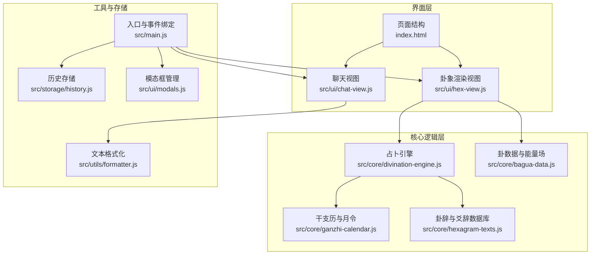
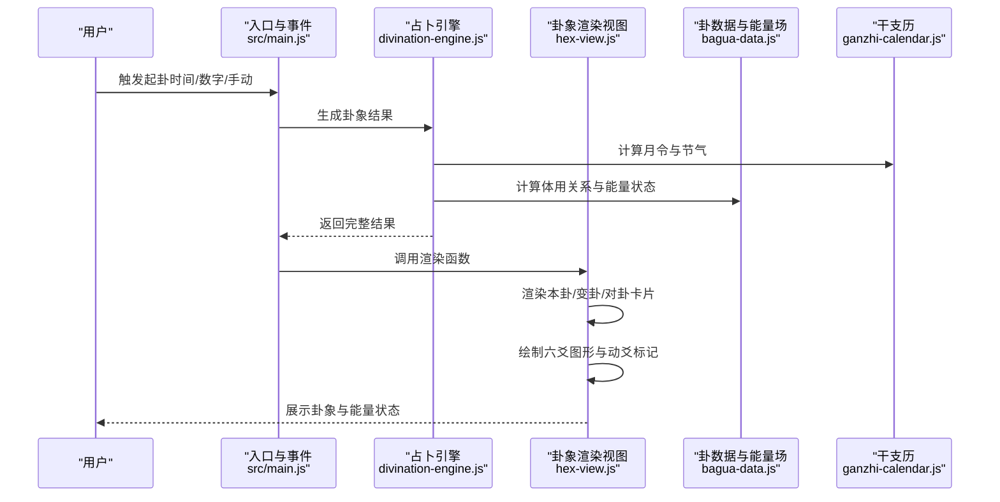
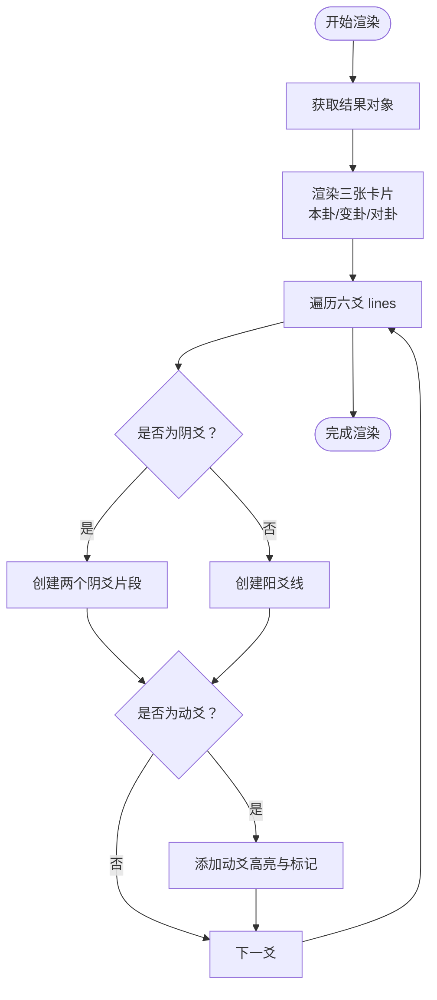
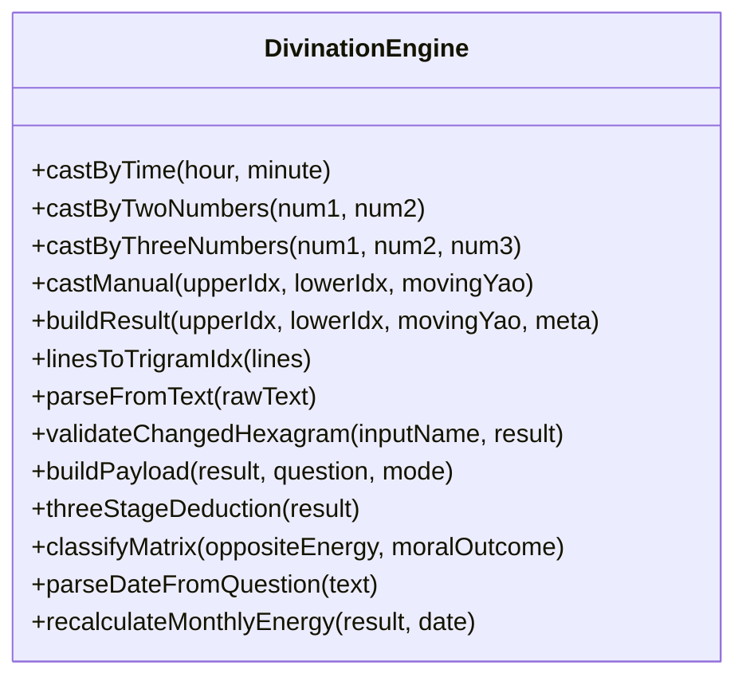
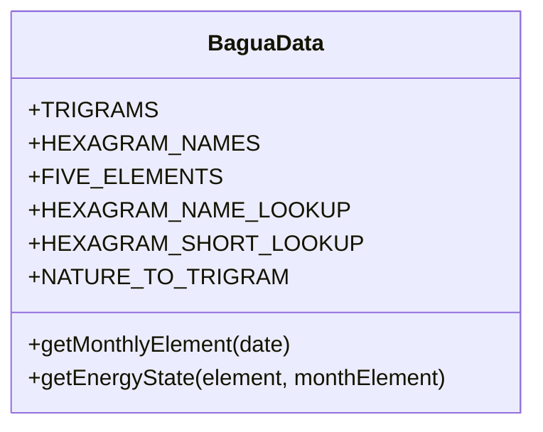
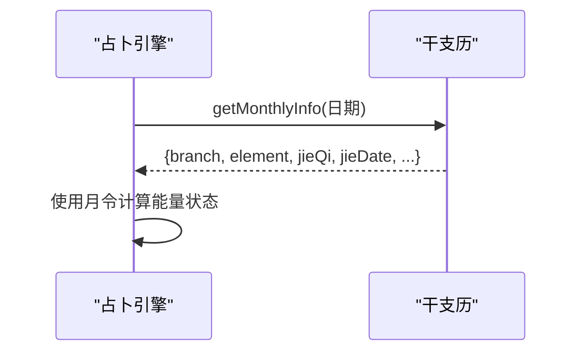
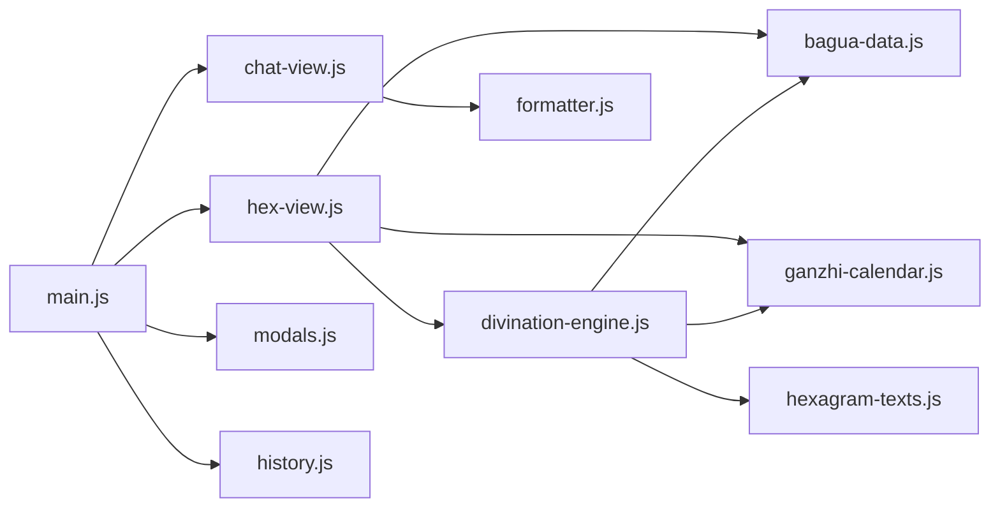

# 卦象显示界面

<cite>
**本文档引用的文件**
- [src/ui/hex-view.js](file://src/ui/hex-view.js)
- [src/core/bagua-data.js](file://src/core/bagua-data.js)
- [src/core/divination-engine.js](file://src/core/divination-engine.js)
- [src/index.css](file://src/index.css)
- [index.html](file://index.html)
- [src/core/ganzhi-calendar.js](file://src/core/ganzhi-calendar.js)
- [src/core/hexagram-texts.js](file://src/core/hexagram-texts.js)
- [src/utils/formatter.js](file://src/utils/formatter.js)
- [src/ui/chat-view.js](file://src/ui/chat-view.js)
- [src/main.js](file://src/main.js)
- [src/storage/history.js](file://src/storage/history.js)
- [src/ui/modals.js](file://src/ui/modals.js)
</cite>

## 更新摘要
**变更内容**
- 新增基于五行哲学的色彩体系重构
- 深色模式支持的完整实现
- 新的背景色、强调色和边框设计系统
- 响应式设计的优化和改进

## 目录
1. [简介](#简介)
2. [项目结构](#项目结构)
3. [核心组件](#核心组件)
4. [架构概览](#架构概览)
5. [详细组件分析](#详细组件分析)
6. [视觉样式系统](#视觉样式系统)
7. [依赖关系分析](#依赖关系分析)
8. [性能考量](#性能考量)
9. [故障排除指南](#故障排除指南)
10. [结论](#结论)
11. [附录](#附录)

## 简介
本文件聚焦于《梅花易数》项目中的卦象显示界面，深入解析六十四卦的可视化展示机制、卦爻变化的动态效果、卦象信息的结构化排版、用户交互功能以及响应式布局与无障碍访问的实现方案。通过分析核心数据模型、渲染流程与样式系统，帮助开发者与使用者全面理解卦象界面的设计理念与技术实现。

**更新** 本次更新重点关注视觉样式系统的重构，包括基于五行哲学的色彩体系、深色模式支持以及响应式设计的优化。

## 项目结构
该项目采用模块化前端架构，核心围绕「卦象渲染视图」、「占卜引擎」、「数据模型」与「样式系统」四大块协同工作。卦象显示界面位于 UI 层，负责将占卜结果以卡片形式呈现，支持本卦、变卦与对卦的三联展示，并通过 CSS 实现动爻高亮与响应式布局。

**图表来源**
- [src/ui/hex-view.js:1-101](file://src/ui/hex-view.js#L1-L101)
- [src/core/divination-engine.js:1-433](file://src/core/divination-engine.js#L1-L433)
- [src/core/bagua-data.js:1-136](file://src/core/bagua-data.js#L1-L136)
- [src/core/ganzhi-calendar.js:1-236](file://src/core/ganzhi-calendar.js#L1-L236)
- [src/core/hexagram-texts.js:1-922](file://src/core/hexagram-texts.js#L1-L922)
- [src/utils/formatter.js:1-92](file://src/utils/formatter.js#L1-L92)
- [src/ui/chat-view.js:1-114](file://src/ui/chat-view.js#L1-L114)
- [src/main.js:1-1199](file://src/main.js#L1-L1199)
- [src/storage/history.js:1-143](file://src/storage/history.js#L1-L143)
- [src/ui/modals.js:1-57](file://src/ui/modals.js#L1-L57)
- [index.html:1-920](file://index.html#L1-L920)

## 核心组件
- 卦象渲染视图（Hexagram Rendering View）
  - 负责渲染本卦、变卦与对卦三联卡片，生成六爻图形，标注动爻与体用标识。
  - 关键函数：renderResultView、renderHexCard。
- 占卜引擎（Divination Engine）
  - 计算三卦联动、动爻位置、体用关系与月令能量场，生成完整结果对象。
  - 关键函数：buildResult、castByTime/castByTwoNumbers/castByThreeNumbers/castManual。
- 卦数据与能量场（Bagua Data）
  - 八卦与六十四卦映射、五行生克关系、月令能量状态计算。
  - 关键函数：getEnergyState、getMonthlyElement。
- 干支历与月令（Ganzhi Calendar）
  - 节气月令计算、月支元素转换、节气时间格式化。
  - 关键函数：getMonthlyInfo、getJieInMonth、formatJieDate。
- 卦辞与爻辞数据库（Hexagram Texts）
  - 六十四卦卦辞与爻辞，用于义理解析与展示。
- 文本格式化（Formatter）
  - Markdown 渲染、标题规范化、导出文本格式化。
- 聊天视图（Chat View）
  - AI 分析消息渲染、动作按钮插入、滚动控制。
- 页面结构（index.html）
  - 卦象显示区域、三联卡片容器、月令能量标签等结构定义。

**章节来源**
- [src/ui/hex-view.js:8-98](file://src/ui/hex-view.js#L8-L98)
- [src/core/divination-engine.js:23-201](file://src/core/divination-engine.js#L23-L201)
- [src/core/bagua-data.js:85-92](file://src/core/bagua-data.js#L85-L92)
- [src/core/ganzhi-calendar.js:138-192](file://src/core/ganzhi-calendar.js#L138-L192)
- [src/core/hexagram-texts.js:6-392](file://src/core/hexagram-texts.js#L6-L392)
- [src/utils/formatter.js:61-91](file://src/utils/formatter.js#L61-L91)
- [src/ui/chat-view.js:7-42](file://src/ui/chat-view.js#L7-L42)
- [index.html:580-617](file://index.html#L580-L617)

## 架构概览
卦象显示界面的运行流程如下：用户输入问题或选择起卦方式后，占卜引擎根据时间/数字/手动输入生成卦象结果；随后渲染视图将结果拆分为本卦、变卦与对卦三部分，分别绘制六爻图形并标注动爻；同时根据月令能量场计算体用能量状态，配合 CSS 动画实现动爻高亮与阴影效果。

**图表来源**
- [src/main.js:606-786](file://src/main.js#L606-L786)
- [src/core/divination-engine.js:35-201](file://src/core/divination-engine.js#L35-L201)
- [src/ui/hex-view.js:8-98](file://src/ui/hex-view.js#L8-L98)
- [src/core/bagua-data.js:85-92](file://src/core/bagua-data.js#L85-L92)
- [src/core/ganzhi-calendar.js:138-192](file://src/core/ganzhi-calendar.js#L138-L192)

**章节来源**
- [src/main.js:606-786](file://src/main.js#L606-L786)
- [src/core/divination-engine.js:35-201](file://src/core/divination-engine.js#L35-L201)
- [src/ui/hex-view.js:8-98](file://src/ui/hex-view.js#L8-L98)

## 详细组件分析

### 卦象渲染视图（hex-view.js）
- 渲染入口
  - renderResultView：负责整体结果视图的显示与滚动定位，调用 renderHexCard 渲染三张卡片。
  - renderHexCard：渲染单张卡片，包含上卦/下卦名称与元素、能量状态、六爻图形与动爻标记。
- 六爻图形生成
  - 从卦数据 lines 数组逆序遍历，为每一爻创建 yao-line 元素；阴爻拆分为两个 yin-segment。
  - 若存在动爻，为对应爻添加 is-moving 类并插入 moving-marker。
- 体用标识
  - 根据动爻位置在上卦或下卦显示「体/用」徽章，便于快速识别主从关系。
- 月令能量场
  - 通过 getEnergyState 计算上卦/下卦元素与当月元素的关系，映射为旺/相/休/囚/死等状态并着色。

**图表来源**
- [src/ui/hex-view.js:31-98](file://src/ui/hex-view.js#L31-L98)
- [src/core/bagua-data.js:85-92](file://src/core/bagua-data.js#L85-L92)

**章节来源**
- [src/ui/hex-view.js:8-98](file://src/ui/hex-view.js#L8-L98)

### 占卜引擎（divination-engine.js）
- 结果构建
  - buildResult：将上卦、下卦、动爻组合为原始卦，计算变卦与对卦，生成体用关系与能量状态。
  - linesToTrigramIdx：根据爻线数组反查对应的八宫卦索引。
- 起卦方式
  - castByTime：基于小时、分钟与时区计算动爻。
  - castByTwoNumbers / castByThreeNumbers：基于报数法计算动爻。
  - castManual：手动选择上卦、下卦与动爻。
- 月令与能量
  - recalculateMonthlyEnergy：根据指定日期重新计算月令能量场，更新体用能量状态。

**图表来源**
- [src/core/divination-engine.js:23-433](file://src/core/divination-engine.js#L23-L433)

**章节来源**
- [src/core/divination-engine.js:23-201](file://src/core/divination-engine.js#L23-L201)

### 卦数据与能量场（bagua-data.js）
- 八卦与六十四卦映射
  - TRIGRAMS：包含名称、性质、符号、元素与爻线数组。
  - HEXAGRAM_NAMES：上卦索引-下卦索引到卦名的映射。
- 五行关系与能量状态
  - FIVE_ELEMENTS：金木水火土的相生相克关系。
  - getEnergyState：根据月令元素与卦元素判断能量状态（旺/相/休/囚/死）。
- 月令计算
  - getMonthlyElement：封装月令信息（月支、元素、节气等）。

**图表来源**
- [src/core/bagua-data.js:9-136](file://src/core/bagua-data.js#L9-L136)

**章节来源**
- [src/core/bagua-data.js:85-92](file://src/core/bagua-data.js#L85-L92)

### 干支历与月令（ganzhi-calendar.js）
- 节气计算
  - getSolarTermsOfYear：计算全年节气时间。
  - getMonthlyInfo：根据日期查找当前月令（月支、元素、节气名称与时间）。
- 月令展示
  - formatJieDate：格式化节气时间字符串。
  - getJieInMonth：查询某年某月的节气。

**图表来源**
- [src/core/ganzhi-calendar.js:138-192](file://src/core/ganzhi-calendar.js#L138-L192)
- [src/core/divination-engine.js:410-429](file://src/core/divination-engine.js#L410-L429)

**章节来源**
- [src/core/ganzhi-calendar.js:138-192](file://src/core/ganzhi-calendar.js#L138-L192)

### 卦辞与爻辞数据库（hexagram-texts.js）
- 六十四卦卦辞与爻辞
  - HEXAGRAM_JUDGMENTS：包含卦名、卦辞、取象与策略。
  - LINE_TEXTS：每个卦的六爻爻辞数组。
- 义理集成
  - 占卜引擎在构建 payload 时引用该数据库，形成完整的义理解析内容。

**章节来源**
- [src/core/hexagram-texts.js:6-392](file://src/core/hexagram-texts.js#L6-L392)

### 文本格式化与导出（formatter.js）
- Markdown 渲染
  - formatMarkdown：将文本转换为 HTML，支持标题、粗体、斜体、列表等。
- 导出格式
  - exportDivinationResult：整合卦象信息与分析文本，生成可分享的文本内容。

**章节来源**
- [src/utils/formatter.js:61-91](file://src/utils/formatter.js#L61-L91)
- [src/main.js:427-498](file://src/main.js#L427-L498)

### 聊天视图与交互（chat-view.js）
- 消息渲染
  - addMessage：插入 AI 分析消息，支持 Markdown 渲染。
  - appendAssistantMessageActions：为消息追加反馈、导出、新起一卦等操作按钮。
- 滚动控制
  - isNearBottom、scrollChat：智能滚动到底部，提升阅读体验。

**章节来源**
- [src/ui/chat-view.js:7-42](file://src/ui/chat-view.js#L7-L42)
- [src/ui/chat-view.js:83-114](file://src/ui/chat-view.js#L83-L114)

## 视觉样式系统

### 五行哲学色彩体系
项目采用了全新的基于五行哲学的色彩体系，体现了传统易学的美学理念：

- **背景色系（阴土）**：暖米色/阴土，营造田园之土的湿润包容感
  - 主背景：#F9F7F2（浅米黄）
  - 次背景：#F5F0E6（淡卡其）
  - 玻璃质感：rgba(249, 247, 242, 0.95)
  - 微妙背景：#EBE5D9（稍深米色）

- **强调色（古铜金）**：土金相生的稳重质感
  - 主强调：#b57a34（古铜金）
  - 暖金：#c9924a（渐变提亮）
  - 深赭石：#8c6028（土中带金）

- **文字色系（水属性）**：深炭灰/黛蓝，体现智慧深沉
  - 主文字：#2C3E50（黛蓝色）
  - 次文字：#546E7A（灰蓝色）
  - 第三级：#78909C（浅黛色）

- **边框色系**：哑光质感，土金相生
  - 标准边框：rgba(181, 122, 52, 0.18)
  - 悬停边框：rgba(193, 154, 107, 0.35)

### 深色模式支持
深色模式完全兼容五行色彩体系，保持设计的一致性和可用性：

- **深色背景**：#2C2824（深暖灰）
- **深色强调**：#c9924a（暖金色提亮）
- **深色文字**：#B0C4D4（浅黛蓝，智慧之光）
- **深色边框**：rgba(201, 146, 74, 0.25)

深色模式通过 CSS 变量系统实现，自动适配所有组件的颜色变化。

### 动态效果与交互
- **动爻高亮**：使用 `transform: scale(1.05)` 和 `box-shadow` 实现放大效果
- **渐变背景**：从浅到深的渐变，模拟光线的自然过渡
- **阴影系统**：多层级阴影（xs/sm/md/lg）提供深度感
- **过渡动画**：0.3秒的 cubic-bezier 缓动曲线，保证流畅的用户体验

### 响应式设计优化
针对不同设备进行了专门的优化：

- **桌面端**：完整的三联卡片布局，1400px最大宽度限制
- **平板端**：适中的卡片尺寸，保持可读性
- **移动端**：垂直堆叠布局，900px以下自动切换为紧凑模式

**章节来源**
- [src/index.css:1-85](file://src/index.css#L1-L85)
- [src/index.css:800-1050](file://src/index.css#L800-L1050)
- [src/index.css:1684-2231](file://src/index.css#L1684-L2231)
- [src/main.js:85-112](file://src/main.js#L85-L112)

## 依赖关系分析
- hex-view.js 依赖
  - divination-engine.js：获取完整卦象结果。
  - bagua-data.js：获取八宫卦信息与能量状态计算。
  - ganzhi-calendar.js：获取月令信息。
- divination-engine.js 依赖
  - bagua-data.js：八宫卦与六十四卦映射、五行关系。
  - ganzhi-calendar.js：月令计算。
  - hexagram-texts.js：卦辞与爻辞。
- chat-view.js 依赖
  - formatter.js：Markdown 渲染与标题规范化。
- main.js 作为入口，协调各模块事件绑定与渲染调用。

**图表来源**
- [src/ui/hex-view.js:1-10](file://src/ui/hex-view.js#L1-L10)
- [src/core/divination-engine.js:6-21](file://src/core/divination-engine.js#L6-L21)
- [src/core/bagua-data.js:1-16](file://src/core/bagua-data.js#L1-L16)
- [src/core/ganzhi-calendar.js:1-236](file://src/core/ganzhi-calendar.js#L1-L236)
- [src/core/hexagram-texts.js:1-922](file://src/core/hexagram-texts.js#L1-L922)
- [src/ui/chat-view.js:1-6](file://src/ui/chat-view.js#L1-L6)
- [src/utils/formatter.js:1-5](file://src/utils/formatter.js#L1-L5)
- [src/main.js:1-46](file://src/main.js#L1-L46)
- [src/ui/modals.js:1-10](file://src/ui/modals.js#L1-L10)
- [src/storage/history.js:1-13](file://src/storage/history.js#L1-L13)

**章节来源**
- [src/ui/hex-view.js:1-10](file://src/ui/hex-view.js#L1-L10)
- [src/core/divination-engine.js:6-21](file://src/core/divination-engine.js#L6-L21)
- [src/ui/chat-view.js:1-6](file://src/ui/chat-view.js#L1-L6)
- [src/main.js:1-46](file://src/main.js#L1-L46)

## 性能考量
- 渲染优化
  - 六爻绘制采用顺序遍历与 DOM 直接拼接，避免复杂模板引擎开销。
  - 动爻高亮通过 CSS 类切换与 transform/scale 实现，减少重绘。
- 计算优化
  - 月令计算使用缓存（_cache）避免重复计算节气时间。
  - 能量状态计算为 O(1) 查询，基于预定义的五行关系映射。
- 交互流畅性
  - 滚动控制与按钮可见性更新采用 requestAnimationFrame 与节流/防抖策略，降低主线程压力。
- 样式性能
  - CSS 变量系统减少重复颜色定义，提高维护效率。
  - 深色模式通过单一 data-theme 属性控制，避免复杂的条件判断。

## 故障排除指南
- 卦象不显示或空白
  - 检查渲染容器是否存在（#hexagram-display、#hex-original-card 等）。
  - 确认 renderResultView 是否被正确调用且传入有效结果对象。
- 动爻标记未出现
  - 确认 result.movingYao 存在且在 1-6 范围内。
  - 检查 yao-line.is-moving 与 moving-marker 的 CSS 是否生效。
- 月令能量状态异常
  - 核对 getMonthlyInfo 返回的元素与节气信息是否正确。
  - 确认 getEnergyState 的参数顺序与元素映射一致。
- 导出分享失败
  - 检查 navigator.share 是否可用，若不可用回退到剪贴板复制。
  - 确认 state.currentResult 与分析文本已准备完毕。
- 深色模式切换问题
  - 检查 data-theme="dark" 属性是否正确设置。
  - 确认 CSS 变量是否正确应用到所有组件。

**章节来源**
- [src/ui/hex-view.js:31-98](file://src/ui/hex-view.js#L31-L98)
- [src/core/ganzhi-calendar.js:138-192](file://src/core/ganzhi-calendar.js#L138-L192)
- [src/main.js:427-498](file://src/main.js#L427-L498)
- [src/main.js:85-112](file://src/main.js#L85-L112)

## 结论
卦象显示界面通过清晰的模块划分与高效的渲染策略，实现了六十四卦的直观可视化展示。动爻高亮、体用标识与月令能量场的结合，为用户提供了一套兼具美感与信息密度的卦象解读界面。新的基于五行哲学的色彩体系和深色模式支持，进一步提升了界面的美学价值和用户体验。配合响应式布局与无障碍访问设计，界面在桌面与移动端均具备良好的可用性。未来可在 SVG 渲染与动画性能方面进一步优化，以增强视觉表现力与交互流畅性。

## 附录

### 响应式布局与显示模式
- 桌面端
  - 三联卡片水平排列，六爻图形尺寸适中，能量状态标签突出。
  - 最大宽度 1400px，保持内容的专注性。
- 移动端
  - 三联卡片垂直堆叠，六爻图形缩小，动爻标记字体与间距调整，确保可读性。
  - 侧边抽屉式导航与模态框在移动端采用绝对定位与可滚动容器，提升交互体验。
  - 900px 以下自动切换为紧凑模式，优化小屏幕显示效果。

**章节来源**
- [src/index.css:1684-2231](file://src/index.css#L1684-L2231)
- [src/ui/modals.js:11-32](file://src/ui/modals.js#L11-L32)
- [src/main.js:115-165](file://src/main.js#L115-L165)

### 用户交互功能
- 卦象缩放
  - 通过 CSS transform/scale 实现动爻高亮放大，增强视觉焦点。
  - 使用 1.05 倍缩放比例，在保持视觉连贯性的同时突出动爻。
- 详情查看
  - 点击「新起一卦」按钮可重新开始占卜流程。
  - 移动端提供浮动按钮，方便触控操作。
- 分享功能
  - 通过 navigator.share 或剪贴板复制导出断卦结果，支持一键分享。
  - 深色模式下保持相同的分享体验。

**章节来源**
- [src/index.css:912-922](file://src/index.css#L912-L922)
- [src/main.js:427-498](file://src/main.js#L427-L498)
- [src/ui/chat-view.js:23-42](file://src/ui/chat-view.js#L23-L42)

### 数据模型与渲染流程
- 卦象数据模型
  - 包含原始卦、变卦、对卦、动爻、体用关系、月令能量状态等字段。
  - 能量状态通过五行相生相克关系计算得出。
- 渲染流程
  - 占卜引擎生成完整结果 → 渲染视图绘制三联卡片 → 六爻图形与动爻标记 → 能量状态着色 → 月令标签展示。
  - 深色模式自动适配所有组件的颜色变化。

**章节来源**
- [src/core/divination-engine.js:166-201](file://src/core/divination-engine.js#L166-L201)
- [src/ui/hex-view.js:31-98](file://src/ui/hex-view.js#L31-L98)
- [index.html:580-617](file://index.html#L580-L617)

### 深色模式实现细节
- **主题切换机制**：通过 data-theme 属性控制，支持 localStorage 持久化
- **颜色变量系统**：所有颜色通过 CSS 变量定义，自动适配深色模式
- **组件一致性**：侧边栏、卡片、按钮等组件在深色模式下保持统一的视觉风格
- **对比度优化**：深色模式下确保足够的文字对比度，提升可读性

**章节来源**
- [src/main.js:85-112](file://src/main.js#L85-L112)
- [src/index.css:60-85](file://src/index.css#L60-L85)
- [src/index.css:3932-3999](file://src/index.css#L3932-L3999)