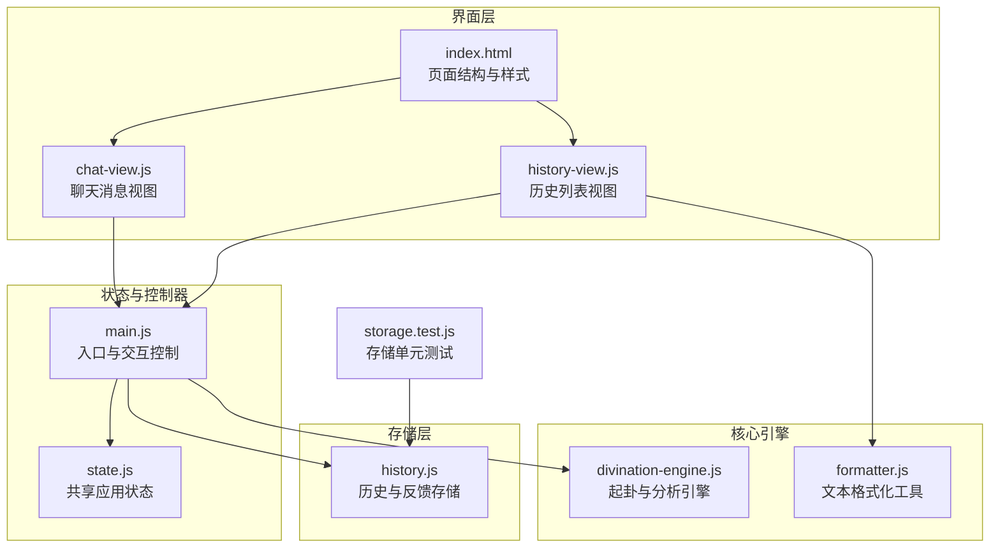
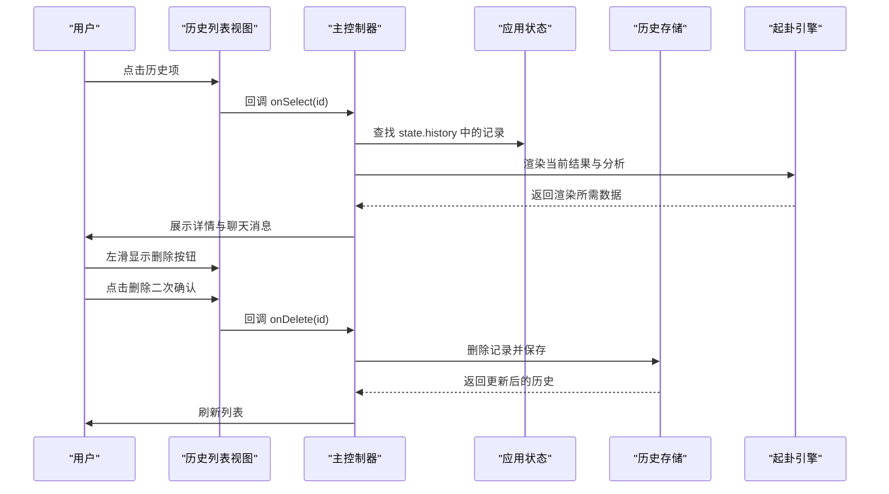
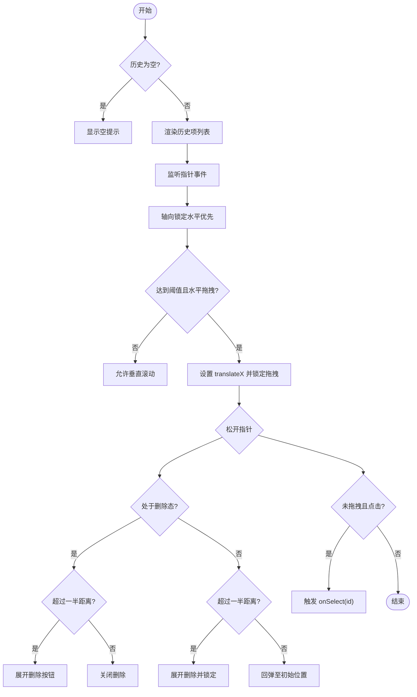
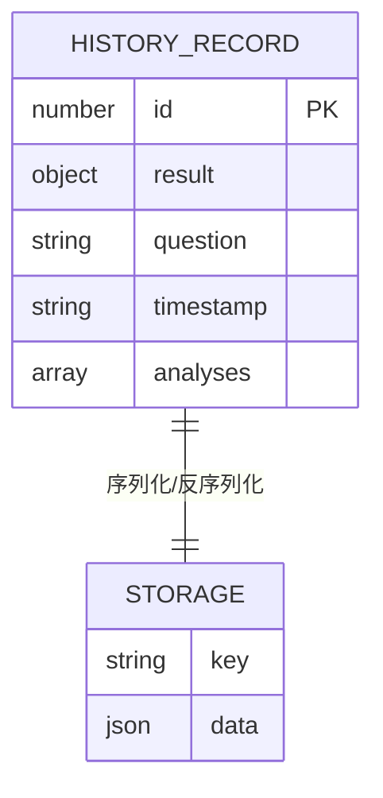
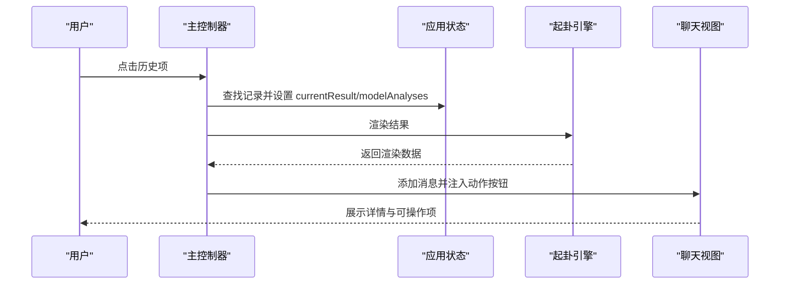
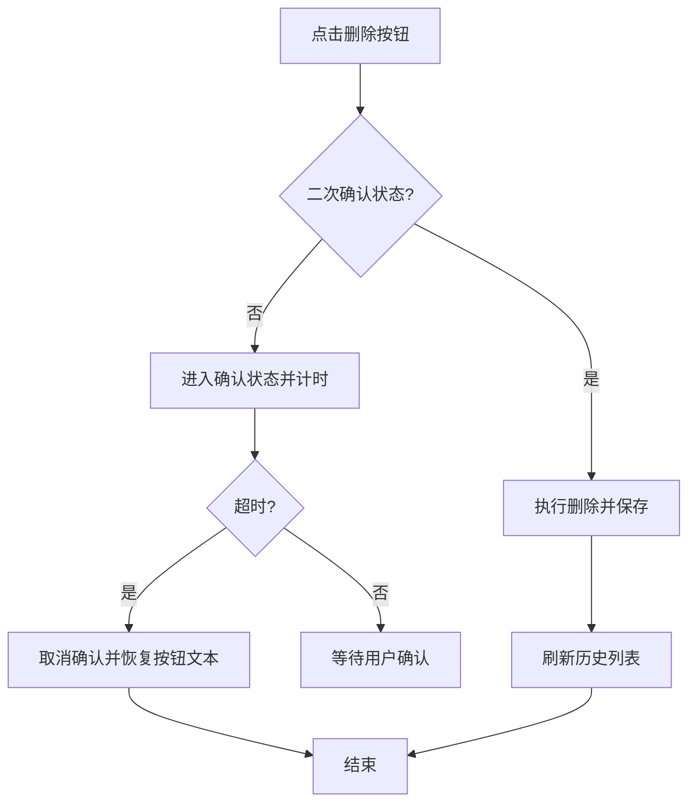
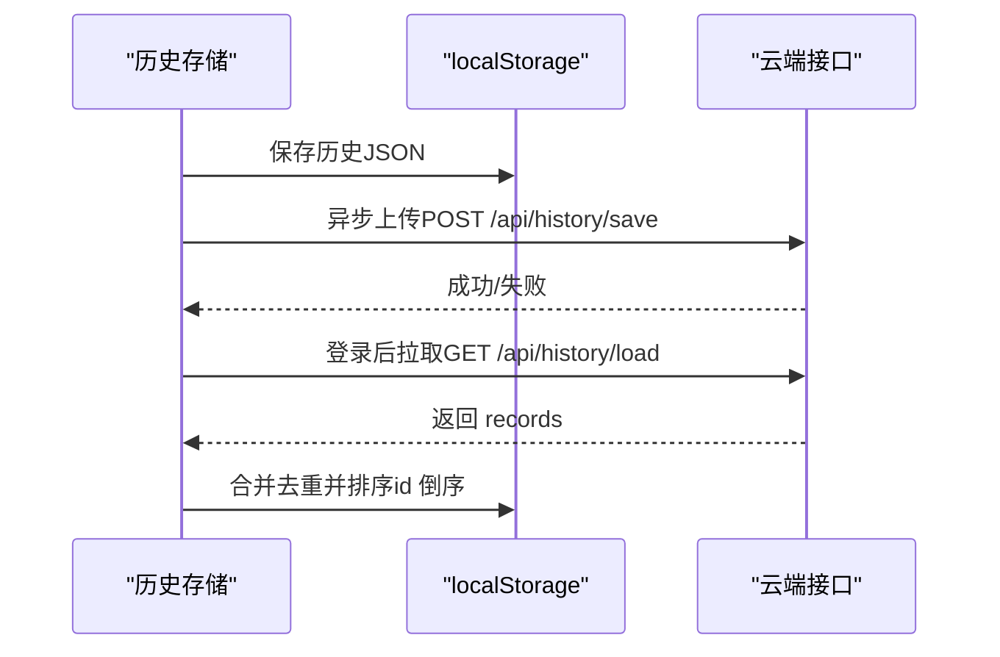
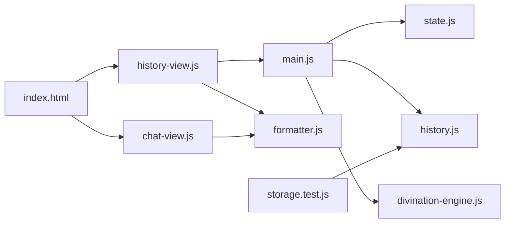

# 历史记录界面

<cite>
**本文档引用的文件**
- [src/ui/history-view.js](file://src/ui/history-view.js)
- [src/storage/history.js](file://src/storage/history.js)
- [src/main.js](file://src/main.js)
- [src/controllers/state.js](file://src/controllers/state.js)
- [src/core/divination-engine.js](file://src/core/divination-engine.js)
- [src/ui/chat-view.js](file://src/ui/chat-view.js)
- [src/utils/formatter.js](file://src/utils/formatter.js)
- [index.html](file://index.html)
- [__tests__/storage.test.js](file://__tests__/storage.test.js)
</cite>

## 目录
1. [简介](#简介)
2. [项目结构](#项目结构)
3. [核心组件](#核心组件)
4. [架构总览](#架构总览)
5. [详细组件分析](#详细组件分析)
6. [依赖关系分析](#依赖关系分析)
7. [性能考量](#性能考量)
8. [故障排除指南](#故障排除指南)
9. [结论](#结论)
10. [附录](#附录)

## 简介
本文件面向历史记录界面，系统性阐述以下内容：
- 历史记录的数据结构与存储格式（含卦例信息的序列化与反序列化）
- 历史列表的渲染机制（时间排序、分页加载、搜索过滤）
- 单条记录的详情展示（起卦信息、分析结果、用户反馈）
- 历史记录的操作功能（删除、导出、批量管理）
- 本地存储与云同步方案
- 历史数据的备份恢复与数据迁移策略
- 用户隐私保护与数据安全措施

## 项目结构
历史记录相关模块分布于 UI 渲染、状态管理、存储与引擎四个层面，配合工具函数与测试用例形成闭环。

**图表来源**
- [src/ui/history-view.js:1-168](file://src/ui/history-view.js#L1-L168)
- [src/ui/chat-view.js:1-114](file://src/ui/chat-view.js#L1-L114)
- [src/main.js:788-878](file://src/main.js#L788-L878)
- [src/storage/history.js:1-143](file://src/storage/history.js#L1-L143)
- [src/core/divination-engine.js:1-433](file://src/core/divination-engine.js#L1-L433)
- [src/utils/formatter.js:1-92](file://src/utils/formatter.js#L1-L92)
- [index.html:1-200](file://index.html#L1-L200)
- [__tests__/storage.test.js:154-197](file://__tests__/storage.test.js#L154-L197)

**章节来源**
- [src/ui/history-view.js:1-168](file://src/ui/history-view.js#L1-L168)
- [src/storage/history.js:1-143](file://src/storage/history.js#L1-L143)
- [src/main.js:788-878](file://src/main.js#L788-L878)
- [src/controllers/state.js:1-24](file://src/controllers/state.js#L1-L24)
- [src/core/divination-engine.js:1-433](file://src/core/divination-engine.js#L1-L433)
- [src/ui/chat-view.js:1-114](file://src/ui/chat-view.js#L1-L114)
- [src/utils/formatter.js:1-92](file://src/utils/formatter.js#L1-L92)
- [index.html:1-200](file://index.html#L1-L200)
- [__tests__/storage.test.js:154-197](file://__tests__/storage.test.js#L154-L197)

## 核心组件
- 历史列表视图：负责渲染历史项、手势滑动、点击选择与删除确认。
- 存储模块：负责本地 localStorage 的读写、配额超限时的裁剪策略、云端同步与合并。
- 应用状态：集中维护当前用户、历史列表、当前结果、最后记录 ID 等。
- 聊天视图：负责消息渲染、动作按钮（导出、新起一卦、反馈）注入。
- 文本格式化：负责分析文本的标题规范化与 Markdown 到 HTML 的转换。
- 起卦引擎：生成卦例数据结构，构建分析 payload，支持文本解析与日期重算。

**章节来源**
- [src/ui/history-view.js:7-168](file://src/ui/history-view.js#L7-L168)
- [src/storage/history.js:15-102](file://src/storage/history.js#L15-L102)
- [src/controllers/state.js:5-21](file://src/controllers/state.js#L5-L21)
- [src/ui/chat-view.js:7-42](file://src/ui/chat-view.js#L7-L42)
- [src/utils/formatter.js:24-91](file://src/utils/formatter.js#L24-L91)
- [src/core/divination-engine.js:297-346](file://src/core/divination-engine.js#L297-L346)

## 架构总览
历史记录界面采用“视图-状态-存储-引擎”分层架构，通过共享状态驱动 UI 更新，并以本地存储为核心，辅以云端同步与合并策略，确保数据一致性与可用性。

**图表来源**
- [src/ui/history-view.js:102-166](file://src/ui/history-view.js#L102-L166)
- [src/main.js:811-885](file://src/main.js#L811-L885)
- [src/storage/history.js:55-60](file://src/storage/history.js#L55-L60)
- [src/core/divination-engine.js:297-346](file://src/core/divination-engine.js#L297-L346)

## 详细组件分析

### 历史列表渲染与交互
- 渲染规则：当历史为空时显示提示；否则按时间降序展示名称与日期，支持点击进入详情与左滑显示删除按钮。
- 手势交互：支持水平拖拽与垂直滚动锁定，阈值触发滑动，松手决定是否展开删除或回弹。
- 删除流程：双击删除按钮进入二次确认状态，超时自动取消，确认后回调删除逻辑。

**图表来源**
- [src/ui/history-view.js:18-166](file://src/ui/history-view.js#L18-L166)

**章节来源**
- [src/ui/history-view.js:7-168](file://src/ui/history-view.js#L7-L168)

### 历史记录数据结构与序列化
- 记录字段：包含唯一 id、起卦结果 result、问题 question、时间戳 timestamp、分析记录 analyses 等。
- 序列化：使用 JSON.stringify 写入 localStorage；键名按用户名命名空间隔离。
- 反序列化：JSON.parse 读取，异常时返回空数组并记录日志。
- 配额处理：超出容量时从末尾裁剪旧记录，直至可写入或保留最小数量。

**图表来源**
- [src/storage/history.js:15-45](file://src/storage/history.js#L15-L45)
- [src/storage/history.js:30-42](file://src/storage/history.js#L30-L42)

**章节来源**
- [src/storage/history.js:15-60](file://src/storage/history.js#L15-L60)
- [__tests__/storage.test.js:168-188](file://__tests__/storage.test.js#L168-L188)

### 历史详情展示与分析渲染
- 加载流程：根据 id 在 state.history 中查找记录，设置当前结果与模型分析，隐藏起卦控制台，显示聊天区域。
- 权限控制：简化版用户隐藏排盘，PRO 用户可见。
- 消息渲染：将 analyses 或 legacy analysis 注入聊天消息，支持 Markdown 格式化与动作按钮（导出、新起一卦、反馈）。
- 自动滚动：保持消息在可视范围内。

**图表来源**
- [src/main.js:811-877](file://src/main.js#L811-L877)
- [src/ui/chat-view.js:7-42](file://src/ui/chat-view.js#L7-L42)
- [src/utils/formatter.js:61-91](file://src/utils/formatter.js#L61-L91)

**章节来源**
- [src/main.js:811-877](file://src/main.js#L811-L877)
- [src/ui/chat-view.js:7-42](file://src/ui/chat-view.js#L7-L42)
- [src/utils/formatter.js:24-91](file://src/utils/formatter.js#L24-L91)

### 历史记录操作功能
- 删除：支持单条删除，二次确认，超时自动取消；删除后刷新列表并提示。
- 导出：在聊天消息动作区提供导出按钮，便于用户保存分析结果。
- 批量管理：当前版本未实现批量勾选与批量删除，可通过扩展 UI 与存储接口实现。

**图表来源**
- [src/ui/history-view.js:147-166](file://src/ui/history-view.js#L147-L166)
- [src/main.js:880-885](file://src/main.js#L880-L885)
- [src/ui/chat-view.js:31-39](file://src/ui/chat-view.js#L31-L39)

**章节来源**
- [src/ui/history-view.js:147-166](file://src/ui/history-view.js#L147-L166)
- [src/main.js:880-885](file://src/main.js#L880-L885)
- [src/ui/chat-view.js:31-39](file://src/ui/chat-view.js#L31-L39)

### 本地存储与云同步
- 本地存储：按用户名命名空间存储历史与反馈，上限 50 条；超出容量自动裁剪。
- 云端同步：异步上传本地历史到服务端；登录后从服务端拉取并去重合并，按 id 倒序，限制长度。
- 容错处理：网络错误与解析异常均记录日志并回退到本地数据。

**图表来源**
- [src/storage/history.js:26-45](file://src/storage/history.js#L26-L45)
- [src/storage/history.js:65-102](file://src/storage/history.js#L65-L102)

**章节来源**
- [src/storage/history.js:26-102](file://src/storage/history.js#L26-L102)

### 备份恢复与数据迁移
- 备份：用户可导出聊天消息中的分析结果作为文本备份；也可通过浏览器开发者工具查看 localStorage 中的历史数据。
- 恢复：将备份文本导入后，可基于引擎解析能力重建记录（需保证字段兼容）。
- 迁移：跨版本迁移时，遵循“向前兼容”原则，新增字段默认值处理，缺失字段回退到默认值；对历史记录进行一次性的字段标准化与补全。

[本节为概念性说明，无需源码引用]

### 隐私保护与数据安全
- 本地优先：历史数据默认存储于本地，不强制上传；云端同步需登录并显式授权。
- 最小暴露：聊天消息与分析结果仅在详情模式下展示；历史列表仅显示必要摘要。
- 安全传输：云端通信使用 HTTPS；会话凭据通过 Cookie 传递，避免明文泄露。
- 用户控制：提供历史折叠显示，默认关闭，尊重用户隐私偏好。

[本节为概念性说明，无需源码引用]

## 依赖关系分析
历史记录界面的耦合度较低，主要依赖链路如下：

**图表来源**
- [src/ui/history-view.js:5](file://src/ui/history-view.js#L5)
- [src/main.js:788-878](file://src/main.js#L788-L878)
- [src/controllers/state.js:5-21](file://src/controllers/state.js#L5-L21)
- [src/storage/history.js:1-143](file://src/storage/history.js#L1-L143)
- [src/core/divination-engine.js:1-433](file://src/core/divination-engine.js#L1-L433)
- [src/utils/formatter.js:1-92](file://src/utils/formatter.js#L1-L92)
- [src/ui/chat-view.js:1-114](file://src/ui/chat-view.js#L1-L114)
- [index.html:1-200](file://index.html#L1-L200)
- [__tests__/storage.test.js:154-197](file://__tests__/storage.test.js#L154-L197)

**章节来源**
- [src/ui/history-view.js:5](file://src/ui/history-view.js#L5)
- [src/main.js:788-878](file://src/main.js#L788-L878)
- [src/controllers/state.js:5-21](file://src/controllers/state.js#L5-L21)
- [src/storage/history.js:1-143](file://src/storage/history.js#L1-L143)
- [src/core/divination-engine.js:1-433](file://src/core/divination-engine.js#L1-L433)
- [src/utils/formatter.js:1-92](file://src/utils/formatter.js#L1-L92)
- [src/ui/chat-view.js:1-114](file://src/ui/chat-view.js#L1-L114)
- [index.html:1-200](file://index.html#L1-L200)
- [__tests__/storage.test.js:154-197](file://__tests__/storage.test.js#L154-L197)

## 性能考量
- 列表渲染：使用一次性 innerHTML 拼接与 transform 控制滑动，避免频繁重排；删除确认超时自动清理状态，防止内存泄漏。
- 存储优化：本地历史上限 50 条，超出自动裁剪；反馈上限 30 条，降低存储压力。
- 云端同步：异步上传，不影响本地操作流畅度；合并时按 id 倒序，减少重复请求。
- 文本渲染：Markdown 转换在消息插入后进行，避免主线程阻塞；标题规范化减少不必要的 DOM 修改。

[本节为通用性能建议，无需源码引用]

## 故障排除指南
- 历史为空：检查当前用户是否登录；确认 localStorage 是否存在对应键；查看日志是否有解析错误。
- 删除无效：确认 id 类型一致（字符串比较）；检查二次确认状态是否被超时清除；查看存储是否成功写入。
- 云端不同步：检查网络连通性与会话 Cookie；查看日志中的“云端同步失败”警告；尝试手动触发合并。
- 文本渲染异常：检查 Markdown 标记是否闭合；确认标题映射是否命中；查看格式化工具的替换规则。

**章节来源**
- [src/storage/history.js:18-24](file://src/storage/history.js#L18-L24)
- [src/storage/history.js:55-60](file://src/storage/history.js#L55-L60)
- [src/storage/history.js:75-102](file://src/storage/history.js#L75-L102)
- [src/utils/formatter.js:61-91](file://src/utils/formatter.js#L61-L91)

## 结论
历史记录界面通过清晰的分层设计与稳健的存储策略，实现了高效、可靠的用户历史管理体验。结合云端同步与本地优先的原则，在保障隐私的同时提升了数据可用性。后续可在批量管理、搜索过滤与分页加载方面进一步增强，以满足更复杂的使用场景。

## 附录
- 测试覆盖：单元测试验证了键名生成、加载、添加与删除等关键行为，确保边界条件与容量限制下的稳定性。
- 页面结构：index.html 提供模态框与基础样式，为历史列表与详情展示提供容器与交互环境。

**章节来源**
- [__tests__/storage.test.js:154-197](file://__tests__/storage.test.js#L154-L197)
- [index.html:1-200](file://index.html#L1-L200)