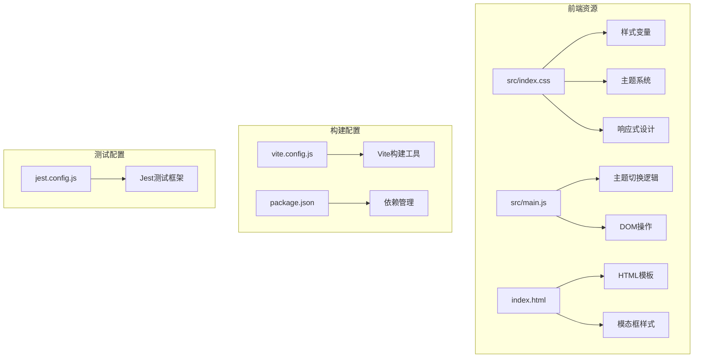
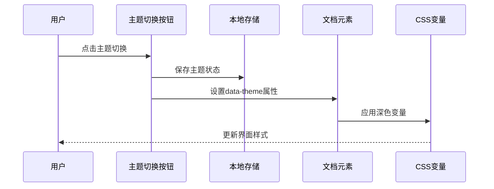
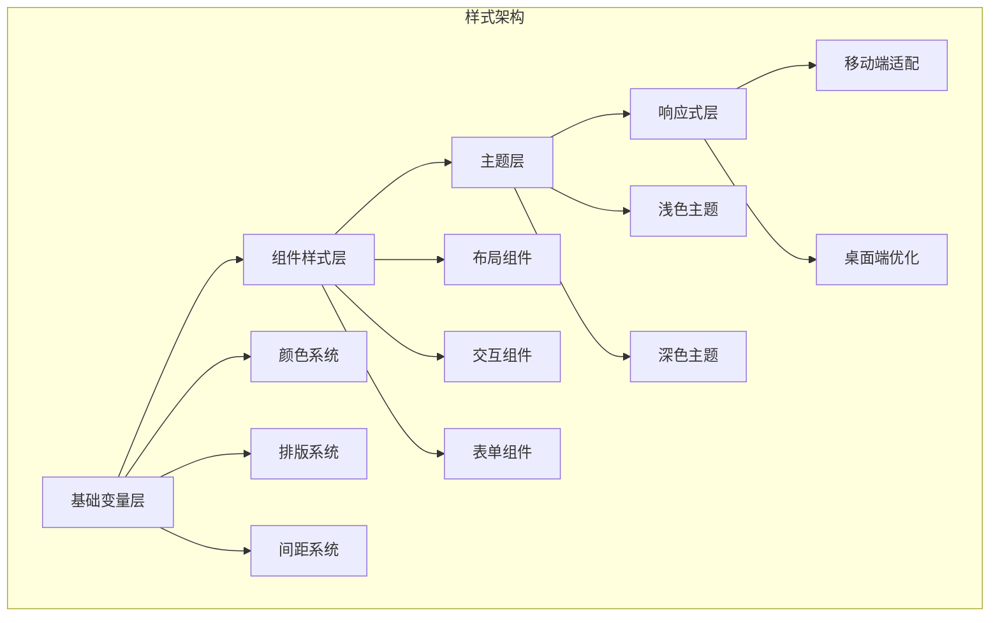
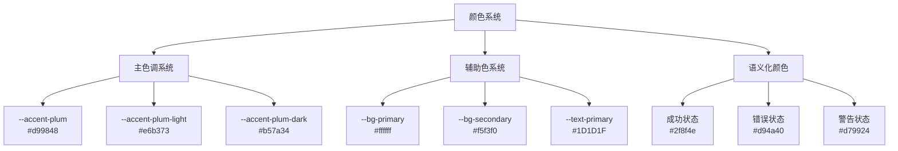
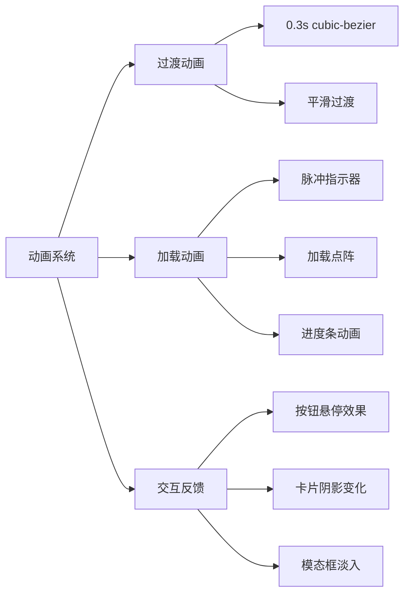
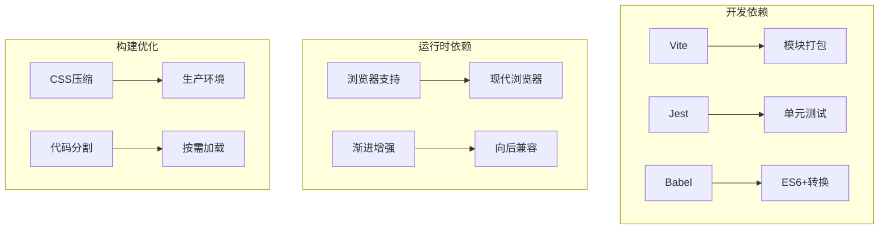

# 样式与主题

<cite>
**本文档引用的文件**
- [src/index.css](file://src/index.css)
- [src/main.js](file://src/main.js)
- [index.html](file://index.html)
- [vite.config.js](file://vite.config.js)
- [package.json](file://package.json)
- [jest.config.js](file://jest.config.js)
</cite>

## 更新摘要
**变更内容**
- 移除了landing页面特定的样式和行为
- 保留了通用的移动端优化功能
- 更新了主题切换和响应式设计的相关说明
- 调整了历史记录和滑动提示相关的样式说明

## 目录
1. [项目概述](#项目概述)
2. [项目结构](#项目结构)
3. [核心组件](#核心组件)
4. [架构概览](#架构概览)
5. [详细组件分析](#详细组件分析)
6. [依赖关系分析](#依赖关系分析)
7. [性能考虑](#性能考虑)
8. [故障排除指南](#故障排除指南)
9. [结论](#结论)

## 项目概述

这是一个基于传统易学文化与现代AI技术融合的梅花义理断卦系统。该项目采用现代化的前端技术栈，实现了完整的样式与主题系统，支持深色模式、响应式设计和渐进增强策略。系统现已移除landing页面特定功能，专注于核心应用界面的样式优化。

## 项目结构

项目采用模块化的前端架构，主要包含以下核心文件：

**图表来源**
- [src/index.css:1-50](file://src/index.css#L1-L50)
- [src/main.js:85-112](file://src/main.js#L85-L112)
- [index.html:1-50](file://index.html#L1-L50)

**章节来源**
- [src/index.css:1-50](file://src/index.css#L1-L50)
- [src/main.js:1-50](file://src/main.js#L1-L50)
- [index.html:1-50](file://index.html#L1-L50)

## 核心组件

### CSS变量系统

项目建立了完整的CSS自定义属性系统，定义了统一的颜色、排版和间距标准：

| 分类 | 变量名称 | 值 | 用途 |
|------|----------|-----|------|
| 主色调 | `--accent-plum` | `#b57a34` | 梅花主题色 |
| 背景色 | `--bg-primary` | `#ffffff` | 主背景色 |
| 文本色 | `--text-primary` | `#1D1D1F` | 主要文本色 |
| 边框色 | `--border-color` | `rgba(181, 122, 52, 0.14)` | 边框和分隔线 |
| 圆角 | `--radius-xl` | `20px` | 大圆角半径 |
| 阴影 | `--shadow-lg` | `0 8px 32px rgba(0, 0, 0, 0.08)` | 大阴影效果 |

**章节来源**
- [src/index.css:1-26](file://src/index.css#L1-L26)

### 主题系统实现

系统支持两种主题模式：浅色模式（默认）和深色模式，通过`:root`选择器和`[data-theme="dark"]`属性实现无缝切换。

**图表来源**
- [src/main.js:85-112](file://src/main.js#L85-L112)
- [src/index.css:48-65](file://src/index.css#L48-L65)

**章节来源**
- [src/main.js:85-112](file://src/main.js#L85-L112)
- [src/index.css:48-65](file://src/index.css#L48-L65)

### 响应式设计架构

采用移动优先的设计理念，通过媒体查询实现多设备适配：

| 断点 | 条件 | 用途 |
|------|------|------|
| 移动端 | `max-width: 900px` | 手机端优化 |
| 桌面端 | `min-width: 901px` | 桌面端布局 |
| 视口单位 | `100dvh` | 动态视口高度 |

**章节来源**
- [src/index.css:1577-2123](file://src/index.css#L1577-L2123)
- [src/index.css:2916-2971](file://src/index.css#L2916-L2971)

## 架构概览

系统采用模块化CSS架构，将样式分为多个功能域：

**图表来源**
- [src/index.css:1-50](file://src/index.css#L1-L50)
- [src/index.css:1600-2399](file://src/index.css#L1600-L2399)

## 详细组件分析

### 颜色系统设计

项目建立了完整的色彩体系，包括主色调、辅助色和语义化颜色：

**图表来源**
- [src/index.css:1-26](file://src/index.css#L1-L26)
- [src/index.css:3189-3193](file://src/index.css#L3189-L3193)

**章节来源**
- [src/index.css:1-26](file://src/index.css#L1-L26)
- [src/index.css:3189-3193](file://src/index.css#L3189-L3193)

### 组件样式架构

系统采用BEM风格的类名设计，确保样式模块化和可维护性：

| 组件类型 | 命名模式 | 示例 |
|----------|----------|------|
| 基础组件 | `.btn-*` | `.btn-primary` |
| 布局组件 | `.layout-*` | `.app-wrapper` |
| 模态组件 | `.modal-*` | `.modal-overlay` |
| 交互组件 | `*-action` | `.btn-cast-action` |

**章节来源**
- [src/index.css:161-205](file://src/index.css#L161-L205)
- [src/index.css:2896-2990](file://src/index.css#L2896-L2990)

### 动画与过渡系统

项目实现了丰富的动画效果，提升用户体验：

**图表来源**
- [src/index.css:24-25](file://src/index.css#L24-L25)
- [src/index.css:1425-1491](file://src/index.css#L1425-L1491)

**章节来源**
- [src/index.css:24-25](file://src/index.css#L24-L25)
- [src/index.css:1425-1491](file://src/index.css#L1425-L1491)

### 移动端优化特性

系统保留了重要的移动端优化功能，包括历史记录的锁保护提示和滑动操作指示器：

#### 锁保护历史提示隐藏
移动端环境下，历史记录项默认隐藏"🔒 点击上方展开查看历史卦例"提示，仅显示滑动操作指示器。

#### 滑动提示指示器
提供清晰的滑动操作指导，帮助用户理解历史记录的交互方式。

**章节来源**
- [src/index.css:4211-4214](file://src/index.css#L4211-L4214)
- [src/index.css:2820-2837](file://src/index.css#L2820-L2837)

## 依赖关系分析

系统依赖关系清晰，构建流程高效：

**图表来源**
- [package.json:24-31](file://package.json#L24-L31)
- [vite.config.js:14-19](file://vite.config.js#L14-L19)

**章节来源**
- [package.json:24-31](file://package.json#L24-L31)
- [vite.config.js:14-19](file://vite.config.js#L14-L19)

## 性能考虑

### CSS优化策略

1. **变量驱动的样式系统**：减少重复代码，提高维护效率
2. **条件样式加载**：仅在需要时应用复杂样式
3. **媒体查询优化**：避免过度使用昂贵的媒体查询

### 构建优化

- 使用Vite进行快速开发和生产构建
- 自动移除跨域属性以优化微信浏览器兼容性
- 模块预加载配置减少首屏加载时间

**章节来源**
- [vite.config.js:14-19](file://vite.config.js#L14-L19)
- [src/index.css:1577-2123](file://src/index.css#L1577-L2123)

## 故障排除指南

### 常见问题及解决方案

| 问题类型 | 症状 | 解决方案 |
|----------|------|----------|
| 主题切换失效 | 点击主题按钮无反应 | 检查localStorage权限和data-theme属性设置 |
| 响应式布局异常 | 移动端显示错乱 | 验证媒体查询断点和视口设置 |
| 动画性能问题 | 页面滚动卡顿 | 检查GPU加速和动画复杂度 |
| 字体加载问题 | 文字显示异常 | 确认字体文件路径和跨域设置 |
| 历史记录交互异常 | 滑动操作无效 | 检查移动端样式和触摸事件处理 |

**章节来源**
- [src/main.js:85-112](file://src/main.js#L85-L112)
- [index.html:1-50](file://index.html#L1-L50)

## 结论

该样式与主题系统展现了现代前端开发的最佳实践：

1. **模块化架构**：清晰的CSS变量系统和组件化设计
2. **用户体验**：流畅的主题切换和响应式适配
3. **性能优化**：高效的构建流程和资源管理
4. **可维护性**：标准化的命名约定和代码组织

系统成功地将传统文化元素与现代技术相结合，为用户提供优雅且功能完整的易学文化体验平台。通过移除landing页面特定功能，系统更加专注于核心应用界面的优化，同时保留了重要的移动端交互体验。