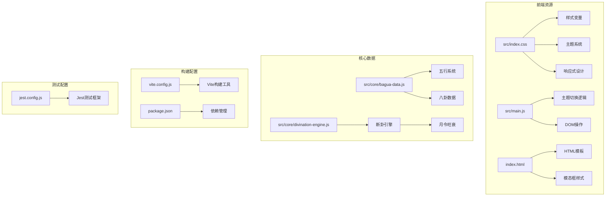
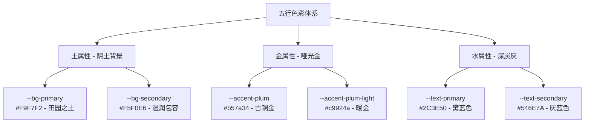
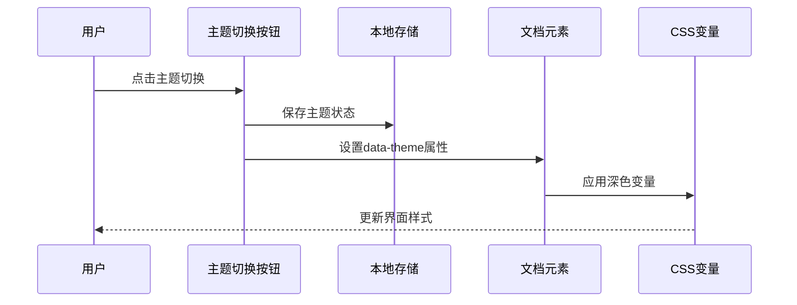
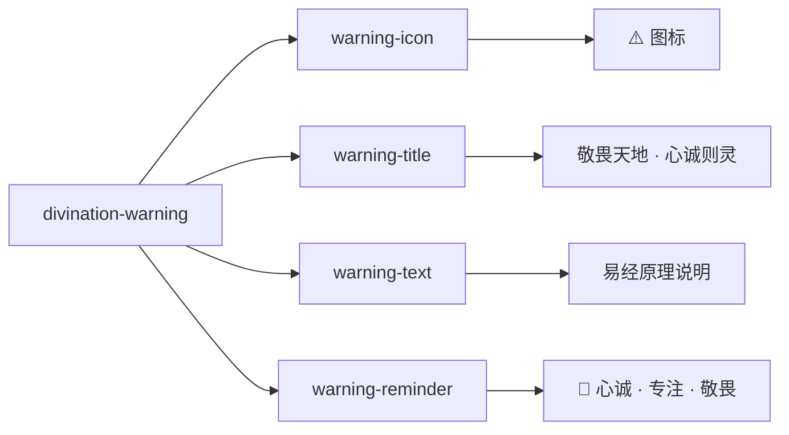
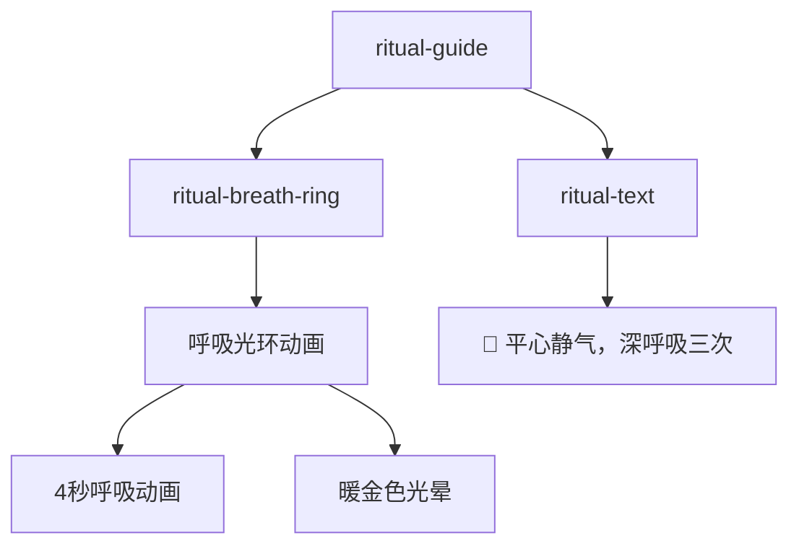
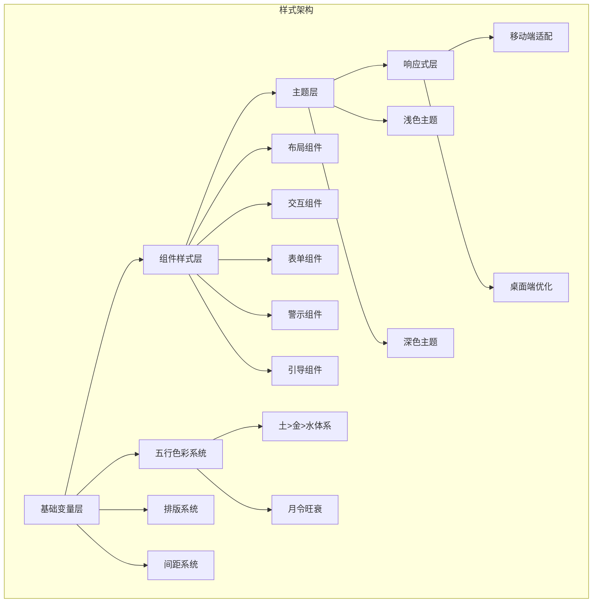
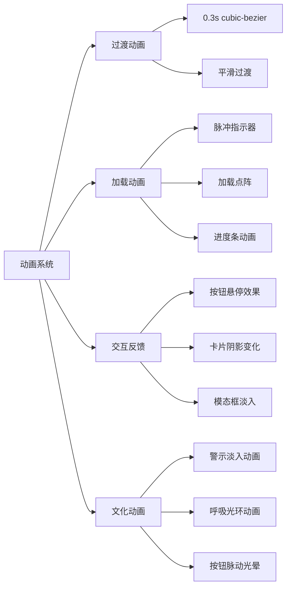
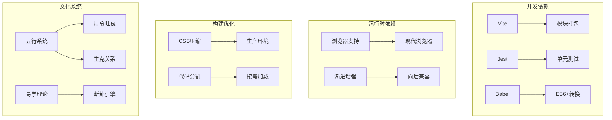

# 样式与主题

<cite>
**本文档引用的文件**
- [src/index.css](file://src/index.css)
- [src/main.js](file://src/main.js)
- [index.html](file://index.html)
- [src/core/bagua-data.js](file://src/core/bagua-data.js)
- [src/core/divination-engine.js](file://src/core/divination-engine.js)
- [vite.config.js](file://vite.config.js)
- [package.json](file://package.json)
- [jest.config.js](file://jest.config.js)
</cite>

## 更新摘要
**变更内容**
- 新增起卦警示功能（divination-warning组件）
- 新增仪式保持机制（ritual-guide组件）
- 基于五行哲学的视觉样式系统重构
- 全新的土>金>水色彩体系
- 新增getEnergyState函数用于月令旺衰判断
- 更新主题切换和响应式设计的相关说明
- 调整了历史记录和滑动提示相关的样式说明

## 目录
1. [项目概述](#项目概述)
2. [项目结构](#项目结构)
3. [核心组件](#核心组件)
4. [架构概览](#架构概览)
5. [详细组件分析](#详细组件分析)
6. [依赖关系分析](#依赖关系分析)
7. [性能考虑](#性能考虑)
8. [故障排除指南](#故障排除指南)
9. [结论](#结论)

## 项目概述

这是一个基于传统易学文化与现代AI技术融合的梅花义理断卦系统。该项目采用现代化的前端技术栈，实现了完整的样式与主题系统，支持深色模式、响应式设计和渐进增强策略。系统现已重构为基于五行哲学的视觉样式系统，采用土>金>水的色彩体系，新增起卦警示功能和仪式保持机制，为用户提供更加沉浸和神圣的易学文化体验。

## 项目结构

项目采用模块化的前端架构，主要包含以下核心文件：



**图表来源**
- [src/index.css:1-50](file://src/index.css#L1-L50)
- [src/main.js:85-112](file://src/main.js#L85-L112)
- [index.html:1-50](file://index.html#L1-L50)
- [src/core/bagua-data.js:72-92](file://src/core/bagua-data.js#L72-L92)
- [src/core/divination-engine.js:407-432](file://src/core/divination-engine.js#L407-L432)

**章节来源**
- [src/index.css:1-50](file://src/index.css#L1-L50)
- [src/main.js:1-50](file://src/main.js#L1-L50)
- [index.html:1-50](file://index.html#L1-L50)

## 核心组件

### CSS变量系统

项目建立了完整的CSS自定义属性系统，基于五行哲学设计，定义了统一的颜色、排版和间距标准：

| 分类 | 变量名称 | 值 | 用途 |
|------|----------|-----|------|
| 主色调 | `--accent-plum` | `#b57a34` | 古铜金 - 哑光质感 |
| 背景色 | `--bg-primary` | `#F9F7F2` | 主背景：浅米黄（田园之土） |
| 文本色 | `--text-primary` | `#2C3E50` | 主文字：黛蓝色（深邃智慧） |
| 边框色 | `--border-color` | `rgba(181, 122, 52, 0.18)` | 边框：淡古铜色 |
| 圆角 | `--radius-xl` | `20px` | 大圆角半径 |
| 阴影 | `--shadow-lg` | `0 8px 32px rgba(0, 0, 0, 0.08)` | 大阴影效果 |

**章节来源**
- [src/index.css:1-38](file://src/index.css#L1-L38)

### 五行色彩体系

系统采用全新的土>金>水色彩体系，基于传统易学理论设计：



**图表来源**
- [src/index.css:2-38](file://src/index.css#L2-L38)
- [src/index.css:61-85](file://src/index.css#L61-L85)

**章节来源**
- [src/index.css:2-38](file://src/index.css#L2-L38)
- [src/index.css:61-85](file://src/index.css#L61-L85)

### 主题系统实现

系统支持两种主题模式：浅色模式（默认）和深色模式，通过`:root`选择器和`[data-theme="dark"]`属性实现无缝切换。



**图表来源**
- [src/main.js:85-112](file://src/main.js#L85-L112)
- [src/index.css:60-85](file://src/index.css#L60-L85)

**章节来源**
- [src/main.js:85-112](file://src/main.js#L85-L112)
- [src/index.css:60-85](file://src/index.css#L60-L85)

### 起卦警示组件

新增的divination-warning组件提供神圣的起卦警示功能：



**图表来源**
- [index.html:466-477](file://index.html#L466-L477)
- [src/index.css:407-476](file://src/index.css#L407-L476)

**章节来源**
- [index.html:466-477](file://index.html#L466-L477)
- [src/index.css:407-476](file://src/index.css#L407-L476)

### 仪式保持机制

ritual-guide组件提供净化心灵的引导功能：



**图表来源**
- [index.html:480-483](file://index.html#L480-L483)
- [src/index.css:4296-4341](file://src/index.css#L4296-L4341)

**章节来源**
- [index.html:480-483](file://index.html#L480-L483)
- [src/index.css:4296-4341](file://src/index.css#L4296-L4341)

### 响应式设计架构

采用移动优先的设计理念，通过媒体查询实现多设备适配：

| 断点 | 条件 | 用途 |
|------|------|------|
| 移动端 | `max-width: 900px` | 手机端优化 |
| 桌面端 | `min-width: 901px` | 桌面端布局 |
| 视口单位 | `100dvh` | 动态视口高度 |

**章节来源**
- [src/index.css:1577-2123](file://src/index.css#L1577-L2123)
- [src/index.css:2916-2971](file://src/index.css#L2916-L2971)

## 架构概览

系统采用模块化CSS架构，将样式分为多个功能域，并融入五行哲学设计：



**图表来源**
- [src/index.css:1-50](file://src/index.css#L1-L50)
- [src/index.css:1600-2399](file://src/index.css#L1600-L2399)

## 详细组件分析

### 月令旺衰系统

基于bagua-data.js的getEnergyState函数实现月令旺衰判断：

```mermaid
flowchart TD
A[月令旺衰判断] --> B[元素比较]
A --> C[生克关系]
A --> D[能量状态]
B --> E[element === monthElement]
C --> F[FIVE_ELEMENTS[monthElement].generates === element]
C --> G[FIVE_ELEMENTS[element].generates === monthElement]
C --> H[FIVE_ELEMENTS[element].overcomes === monthElement]
C --> I[FIVE_ELEMENTS[monthElement].overcomes === element]
D --> J[旺/相/休/囚/死/平]
```

**图表来源**
- [src/core/bagua-data.js:85-92](file://src/core/bagua-data.js#L85-L92)
- [src/core/divination-engine.js:407-432](file://src/core/divination-engine.js#L407-L432)

**章节来源**
- [src/core/bagua-data.js:85-92](file://src/core/bagua-data.js#L85-L92)
- [src/core/divination-engine.js:407-432](file://src/core/divination-engine.js#L407-L432)

### 组件样式架构

系统采用BEM风格的类名设计，确保样式模块化和可维护性：

| 组件类型 | 命名模式 | 示例 |
|----------|----------|------|
| 基础组件 | `.btn-*` | `.btn-primary` |
| 布局组件 | `.layout-*` | `.app-wrapper` |
| 模态组件 | `.modal-*` | `.modal-overlay` |
| 交互组件 | `*-action` | `.btn-cast-action` |
| 文化组件 | `*-warning` | `.divination-warning` |
| 引导组件 | `*-guide` | `.ritual-guide` |

**章节来源**
- [src/index.css:161-205](file://src/index.css#L161-L205)
- [src/index.css:407-476](file://src/index.css#L407-L476)
- [src/index.css:4296-4341](file://src/index.css#L4296-L4341)

### 动画与过渡系统

项目实现了丰富的动画效果，提升用户体验：



**图表来源**
- [src/index.css:24-25](file://src/index.css#L24-L25)
- [src/index.css:420-423](file://src/index.css#L420-L423)
- [src/index.css:4314-4327](file://src/index.css#L4314-L4327)
- [src/index.css:4348-4360](file://src/index.css#L4348-L4360)

**章节来源**
- [src/index.css:24-25](file://src/index.css#L24-L25)
- [src/index.css:420-423](file://src/index.css#L420-L423)
- [src/index.css:4314-4327](file://src/index.css#L4314-L4327)
- [src/index.css:4348-4360](file://src/index.css#L4348-L4360)

### 移动端优化特性

系统保留了重要的移动端优化功能，包括历史记录的锁保护提示和滑动操作指示器：

#### 锁保护历史提示隐藏
移动端环境下，历史记录项默认隐藏"🔒 点击上方展开查看历史卦例"提示，仅显示滑动操作指示器。

#### 滑动提示指示器
提供清晰的滑动操作指导，帮助用户理解历史记录的交互方式。

**章节来源**
- [src/index.css:4211-4214](file://src/index.css#L4211-L4214)
- [src/index.css:2820-2837](file://src/index.css#L2820-L2837)

## 依赖关系分析

系统依赖关系清晰，构建流程高效：



**图表来源**
- [package.json:24-31](file://package.json#L24-L31)
- [vite.config.js:14-19](file://vite.config.js#L14-L19)
- [src/core/bagua-data.js:72-92](file://src/core/bagua-data.js#L72-L92)

**章节来源**
- [package.json:24-31](file://package.json#L24-L31)
- [vite.config.js:14-19](file://vite.config.js#L14-L19)

## 性能考虑

### CSS优化策略

1. **变量驱动的样式系统**：减少重复代码，提高维护效率
2. **条件样式加载**：仅在需要时应用复杂样式
3. **媒体查询优化**：避免过度使用昂贵的媒体查询
4. **动画性能优化**：使用transform和opacity属性

### 构建优化

- 使用Vite进行快速开发和生产构建
- 自动移除跨域属性以优化微信浏览器兼容性
- 模块预加载配置减少首屏加载时间

**章节来源**
- [vite.config.js:14-19](file://vite.config.js#L14-L19)
- [src/index.css:1577-2123](file://src/index.css#L1577-L2123)

## 故障排除指南

### 常见问题及解决方案

| 问题类型 | 症状 | 解决方案 |
|----------|------|----------|
| 主题切换失效 | 点击主题按钮无反应 | 检查localStorage权限和data-theme属性设置 |
| 响应式布局异常 | 移动端显示错乱 | 验证媒体查询断点和视口设置 |
| 动画性能问题 | 页面滚动卡顿 | 检查GPU加速和动画复杂度 |
| 字体加载问题 | 文字显示异常 | 确认字体文件路径和跨域设置 |
| 历史记录交互异常 | 滑动操作无效 | 检查移动端样式和触摸事件处理 |
| 起卦警示不显示 | divination-warning隐藏 | 检查JavaScript逻辑和CSS类名 |
| 仪式引导异常 | ritual-guide不工作 | 验证动画和事件监听器 |

**章节来源**
- [src/main.js:85-112](file://src/main.js#L85-L112)
- [index.html:1-50](file://index.html#L1-L50)

## 结论

该样式与主题系统展现了现代前端开发与传统文化深度融合的最佳实践：

1. **五行哲学架构**：基于土>金>水的色彩体系，体现传统易学智慧
2. **模块化设计**：清晰的CSS变量系统和组件化设计
3. **文化沉浸体验**：起卦警示和仪式引导增强用户体验
4. **用户体验**：流畅的主题切换和响应式适配
5. **性能优化**：高效的构建流程和资源管理
6. **可维护性**：标准化的命名约定和代码组织

系统成功地将传统文化元素与现代技术相结合，通过新增的起卦警示功能和仪式保持机制，为用户提供更加神圣和沉浸的易学文化体验平台。全新的五行色彩体系不仅美观，更承载着深厚的文化内涵，体现了系统在设计理念上的创新和深度。