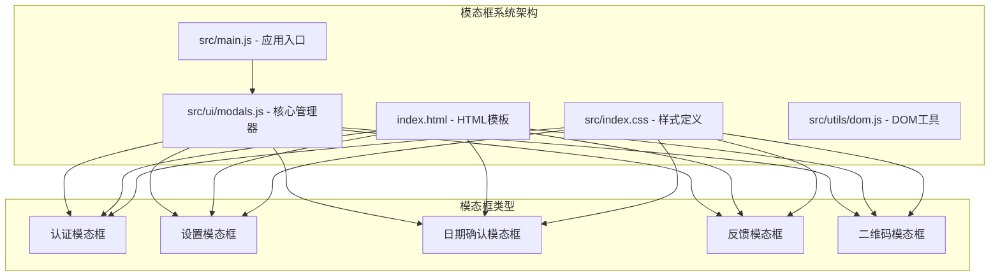
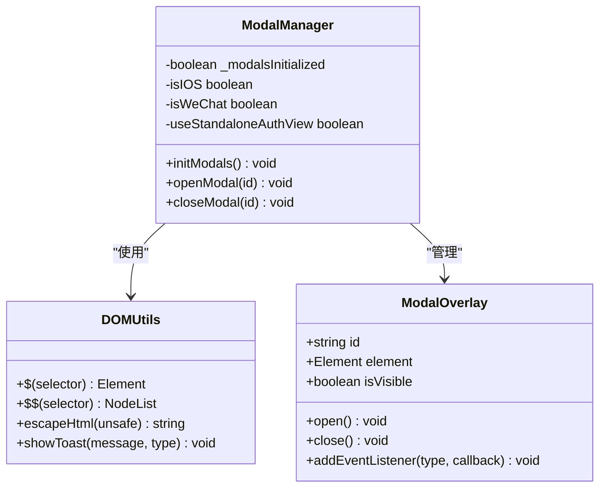
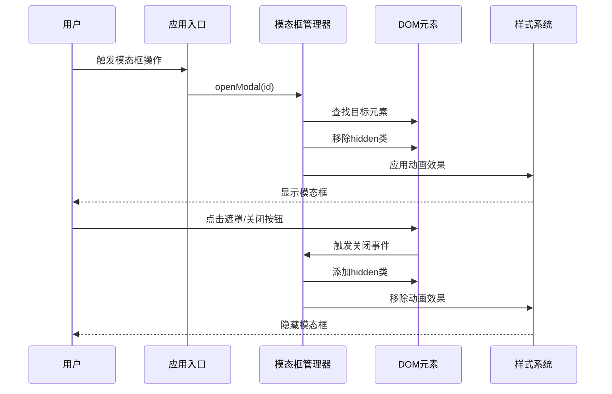
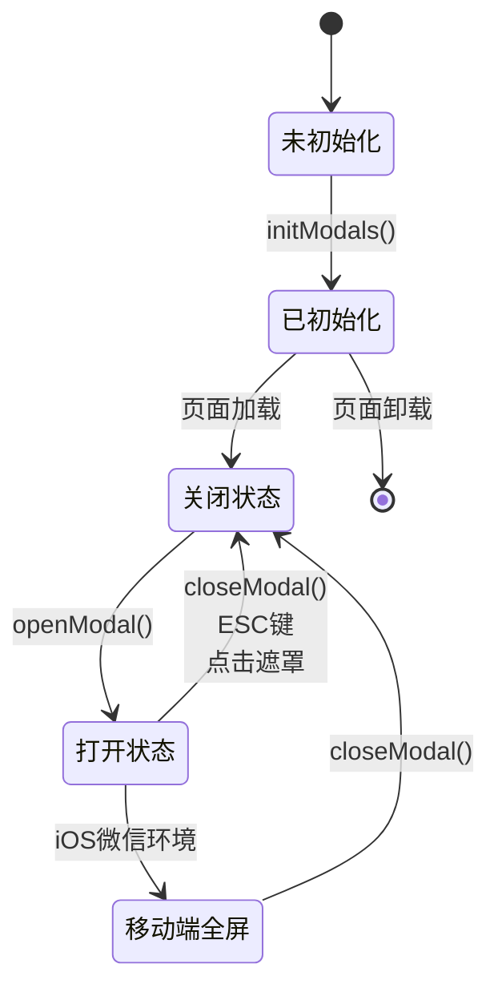
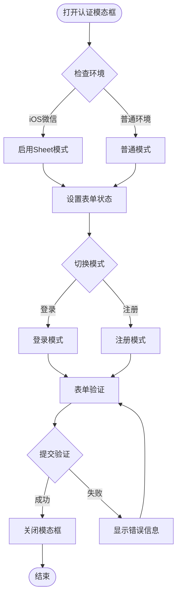
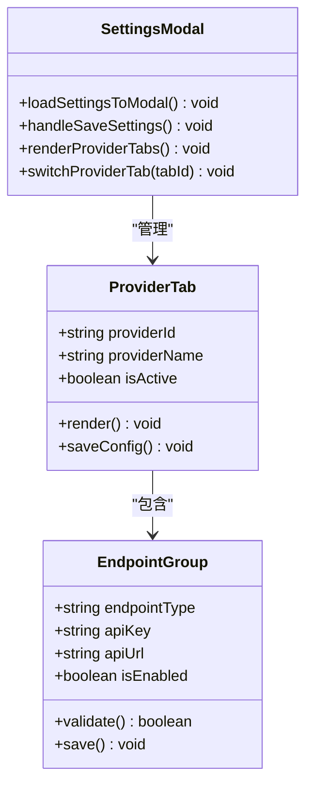
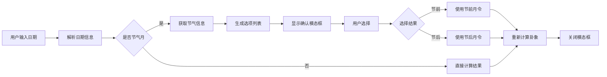
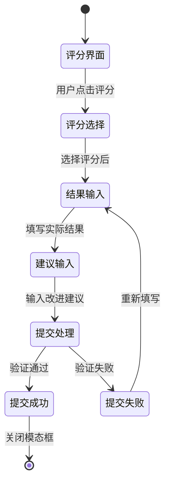
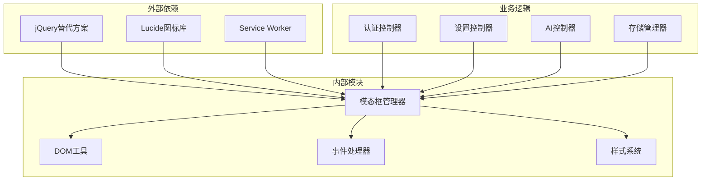

# 模态框系统

<cite>
**本文档引用的文件**
- [modals.js](file://src/ui/modals.js)
- [main.js](file://src/main.js)
- [index.html](file://index.html)
- [index.css](file://src/index.css)
- [dom.js](file://src/utils/dom.js)
</cite>

## 目录
1. [简介](#简介)
2. [项目结构](#项目结构)
3. [核心组件](#核心组件)
4. [架构概览](#架构概览)
5. [详细组件分析](#详细组件分析)
6. [依赖关系分析](#依赖关系分析)
7. [性能考量](#性能考量)
8. [故障排除指南](#故障排除指南)
9. [结论](#结论)

## 简介

模态框系统是本项目中的重要UI组件，负责处理各种用户交互场景，包括身份认证、设置配置、日期确认和反馈收集等。该系统采用轻量级设计，通过统一的JavaScript接口和CSS样式实现一致的用户体验。

系统支持多种类型的模态框，每种都有特定的功能和样式配置，同时提供了完整的键盘导航和无障碍支持。

## 项目结构

模态框系统主要由以下组件构成：

**图表来源**
- [modals.js:1-56](file://src/ui/modals.js#L1-L56)
- [main.js:1-800](file://src/main.js#L1-L800)
- [index.html:672-920](file://index.html#L672-L920)
- [index.css:2900-3100](file://src/index.css#L2900-L3100)

**章节来源**
- [modals.js:1-56](file://src/ui/modals.js#L1-L56)
- [index.html:672-920](file://index.html#L672-L920)

## 核心组件

### 模态框管理器

模态框管理器是系统的核心控制器，负责模态框的生命周期管理和事件处理。

**图表来源**
- [modals.js:1-56](file://src/ui/modals.js#L1-L56)
- [dom.js:1-41](file://src/utils/dom.js#L1-L41)

### 模态框类型

系统支持五种不同类型的模态框，每种都有特定的用途和样式：

| 模态框类型 | ID标识 | 主要功能 | 样式宽度 |
|------------|--------|----------|----------|
| 认证模态框 | modal-auth | 用户登录/注册 | slim (380px) |
| 设置模态框 | modal-settings | 系统配置 | wide (640px) |
| 日期确认模态框 | modal-date-clarify | 月令确认 | default |
| 反馈模态框 | modal-feedback | 卦例评价 | wide (640px) |
| 二维码模态框 | modal-qrcode | 品牌推广 | custom card |

**章节来源**
- [modals.js:11-32](file://src/ui/modals.js#L11-L32)
- [index.html:672-920](file://index.html#L672-L920)
- [index.css:2992-2998](file://src/index.css#L2992-L2998)

## 架构概览

模态框系统采用分层架构设计，确保了良好的可维护性和扩展性：

**图表来源**
- [main.js:296-554](file://src/main.js#L296-L554)
- [modals.js:11-56](file://src/ui/modals.js#L11-L56)

### 生命周期管理

模态框的完整生命周期包括初始化、显示、交互和销毁四个阶段：

**图表来源**
- [modals.js:34-56](file://src/ui/modals.js#L34-L56)

## 详细组件分析

### 认证模态框

认证模态框是最复杂的模态框类型，支持登录和注册两种模式，具有完整的表单验证和错误处理机制。

**图表来源**
- [modals.js:11-21](file://src/ui/modals.js#L11-L21)
- [index.html:672-793](file://index.html#L672-L793)

#### 表单字段结构

认证模态框包含以下核心字段：

| 字段类型 | ID标识 | 描述 | 验证规则 |
|----------|--------|------|----------|
| 用户名 | auth-username | 用户标识 | 必填，3-20字符 |
| 密码 | auth-password | 登录凭证 | 必填，6-20字符 |
| 确认密码 | auth-confirm-password | 注册确认 | 与密码匹配 |
| 邮箱 | auth-email | 账户绑定 | 可选，有效邮箱格式 |
| 验证码 | reset-code | 密码重置 | 6位数字 |

**章节来源**
- [index.html:688-747](file://index.html#L688-L747)

### 设置配置模态框

设置配置模态框提供API提供商的接入配置功能，支持多供应商集成和动态配置管理。

**图表来源**
- [main.js:544-550](file://src/main.js#L544-L550)
- [index.html:795-843](file://index.html#L795-L843)

### 日期确认模态框

日期确认模态框专门处理月令确认场景，解决节气前后的歧义问题。

**图表来源**
- [main.js:715-760](file://src/main.js#L715-L760)
- [index.html:844-855](file://index.html#L844-L855)

**章节来源**
- [main.js:715-760](file://src/main.js#L715-L760)

### 反馈收集模态框

反馈收集模态框提供卦例质量评估和改进建议收集功能。

**图表来源**
- [index.html:857-886](file://index.html#L857-L886)

**章节来源**
- [index.html:857-886](file://index.html#L857-L886)

## 依赖关系分析

模态框系统与其他组件的依赖关系如下：

**图表来源**
- [modals.js:4-5](file://src/ui/modals.js#L4-L5)
- [main.js:1-800](file://src/main.js#L1-L800)

### 关键依赖点

1. **DOM查询优化**: 使用自定义选择器函数替代jQuery，减少包体积
2. **事件委托模式**: 通过全局监听器处理多个模态框的统一行为
3. **条件渲染**: 根据设备环境动态调整模态框显示方式

**章节来源**
- [modals.js:4-5](file://src/ui/modals.js#L4-L5)
- [dom.js:4-5](file://src/utils/dom.js#L4-L5)

## 性能考量

### 渲染优化

模态框系统采用了多项性能优化策略：

1. **懒加载机制**: 模态框在首次使用时才进行初始化
2. **事件委托**: 减少事件监听器数量，提高事件处理效率
3. **CSS动画**: 使用GPU加速的CSS变换实现流畅动画
4. **条件渲染**: 根据设备能力选择最优的显示策略

### 内存管理

系统实现了完善的内存管理机制：

- 模态框关闭时自动清理事件监听器
- 避免创建不必要的DOM节点
- 使用requestAnimationFrame优化动画性能

## 故障排除指南

### 常见问题及解决方案

| 问题类型 | 症状 | 可能原因 | 解决方案 |
|----------|------|----------|----------|
| 模态框无法关闭 | 点击遮罩无效 | 事件监听器未正确绑定 | 检查initModals()调用 |
| 样式异常 | 模态框位置错误 | CSS类冲突 | 验证样式优先级 |
| 表单验证失败 | 提交时报错 | 字段验证规则 | 检查字段配置 |
| 移动端显示问题 | 屏幕适配不佳 | 媒体查询未生效 | 检查视口设置 |

### 调试技巧

1. **开发者工具**: 使用Elements面板检查DOM结构
2. **控制台日志**: 添加必要的调试信息
3. **网络监控**: 检查异步请求状态
4. **性能分析**: 使用Performance面板分析渲染性能

**章节来源**
- [modals.js:34-56](file://src/ui/modals.js#L34-L56)

## 结论

模态框系统通过精心设计的架构和实现，为用户提供了丰富而一致的交互体验。系统的主要优势包括：

1. **模块化设计**: 清晰的职责分离便于维护和扩展
2. **跨平台兼容**: 完善的移动端适配和响应式设计
3. **性能优化**: 多层次的性能优化确保流畅体验
4. **可访问性**: 良好的键盘导航和屏幕阅读器支持

该系统为项目的用户界面提供了坚实的基础，支持未来功能的扩展和改进。