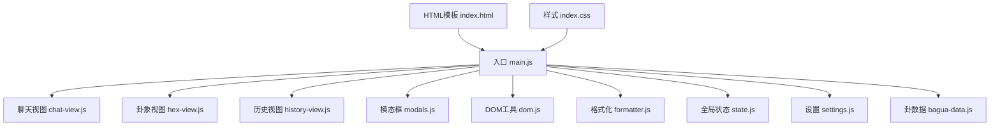
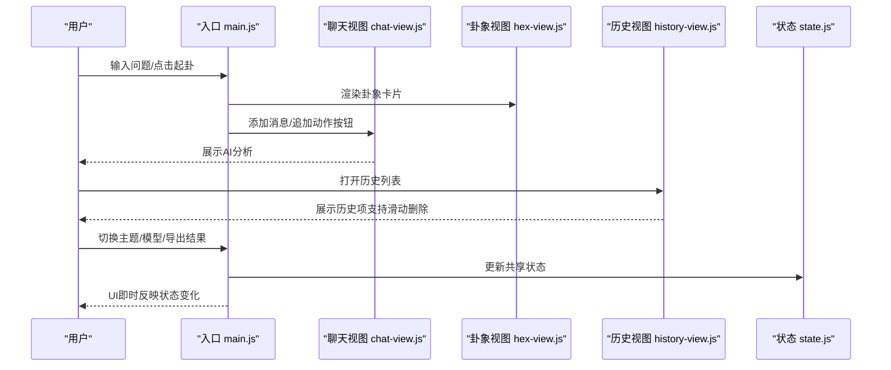
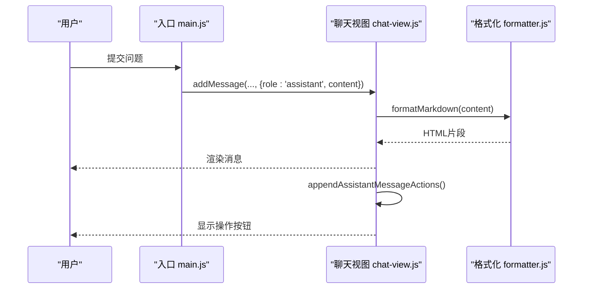
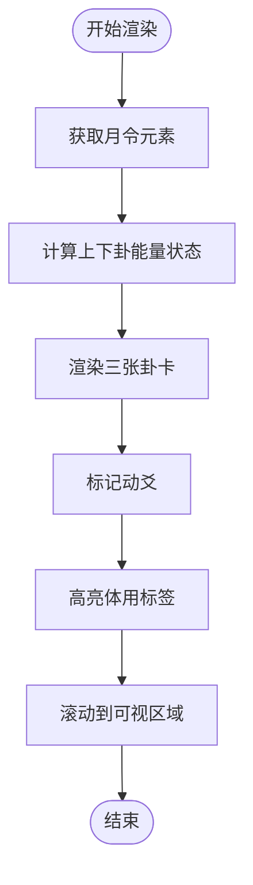
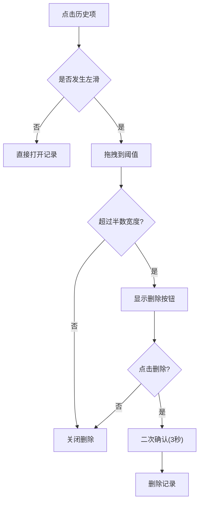
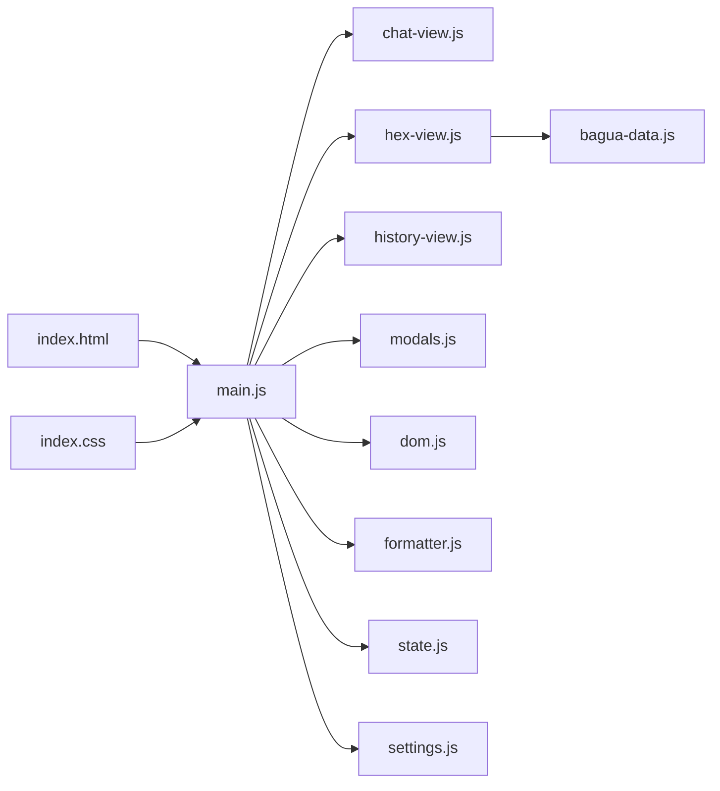

# 用户界面

<cite>
**本文档引用的文件**
- [src/main.js](file://src/main.js)
- [src/ui/chat-view.js](file://src/ui/chat-view.js)
- [src/ui/hex-view.js](file://src/ui/hex-view.js)
- [src/ui/history-view.js](file://src/ui/history-view.js)
- [src/ui/modals.js](file://src/ui/modals.js)
- [src/index.css](file://src/index.css)
- [src/utils/dom.js](file://src/utils/dom.js)
- [src/utils/formatter.js](file://src/utils/formatter.js)
- [src/controllers/state.js](file://src/controllers/state.js)
- [src/storage/settings.js](file://src/storage/settings.js)
- [src/core/bagua-data.js](file://src/core/bagua-data.js)
- [index.html](file://index.html)
</cite>

## 目录
1. [简介](#简介)
2. [项目结构](#项目结构)
3. [核心组件](#核心组件)
4. [架构总览](#架构总览)
5. [详细组件分析](#详细组件分析)
6. [依赖关系分析](#依赖关系分析)
7. [性能考量](#性能考量)
8. [故障排查指南](#故障排查指南)
9. [结论](#结论)
10. [附录](#附录)

## 简介
本项目为“梅花义理”AI断卦系统，围绕用户界面（UI）构建了模块化的视图层，涵盖聊天界面、六十四卦展示界面、历史记录界面以及模态框系统。UI采用响应式设计，适配桌面与移动端；通过主题系统实现浅色/深色模式切换；通过统一的状态中心协调各组件间的数据与行为。本文档将深入解析UI组件架构、数据流与交互流程，并提供组件API参考、样式定制指南与最佳实践。

## 项目结构
UI相关代码主要位于 src/ui 目录，配合 src/main.js 作为入口与编排者，样式集中在 src/index.css，工具函数位于 src/utils，状态与配置位于 src/controllers 与 src/storage。

图表来源
- [src/main.js:1-120](file://src/main.js#L1-L120)
- [src/ui/chat-view.js:1-114](file://src/ui/chat-view.js#L1-L114)
- [src/ui/hex-view.js:1-101](file://src/ui/hex-view.js#L1-L101)
- [src/ui/history-view.js:1-168](file://src/ui/history-view.js#L1-L168)
- [src/ui/modals.js:1-57](file://src/ui/modals.js#L1-L57)
- [src/utils/dom.js:1-41](file://src/utils/dom.js#L1-L41)
- [src/utils/formatter.js:1-92](file://src/utils/formatter.js#L1-L92)
- [src/controllers/state.js:1-24](file://src/controllers/state.js#L1-L24)
- [src/storage/settings.js:1-86](file://src/storage/settings.js#L1-L86)
- [src/core/bagua-data.js:1-136](file://src/core/bagua-data.js#L1-L136)
- [index.html:1-120](file://index.html#L1-L120)
- [src/index.css:1-120](file://src/index.css#L1-L120)

章节来源
- [src/main.js:166-250](file://src/main.js#L166-L250)
- [index.html:390-670](file://index.html#L390-L670)
- [src/index.css:1-120](file://src/index.css#L1-L120)

## 核心组件
- 聊天界面（AI对话与消息渲染）
- 六十四卦展示（本卦/变卦/对卦）
- 历史记录列表（滑动删除与选择）
- 模态框系统（登录/设置/反馈等）
- 主题系统（浅色/深色切换）
- 响应式布局（桌面/移动端）

章节来源
- [src/ui/chat-view.js:1-114](file://src/ui/chat-view.js#L1-L114)
- [src/ui/hex-view.js:1-101](file://src/ui/hex-view.js#L1-L101)
- [src/ui/history-view.js:1-168](file://src/ui/history-view.js#L1-L168)
- [src/ui/modals.js:1-57](file://src/ui/modals.js#L1-L57)
- [src/main.js:85-112](file://src/main.js#L85-L112)
- [src/index.css:1-120](file://src/index.css#L1-L120)

## 架构总览
UI采用“入口编排 + 视图模块 + 工具与状态”的分层设计：
- 入口负责初始化、事件绑定、主题与抽屉控制、导出与反馈等全局逻辑
- 视图模块负责各自领域的渲染与交互
- 工具模块提供DOM与文本格式化能力
- 状态模块集中管理用户、历史、模型选择等共享数据

图表来源
- [src/main.js:296-554](file://src/main.js#L296-L554)
- [src/ui/chat-view.js:7-42](file://src/ui/chat-view.js#L7-L42)
- [src/ui/hex-view.js:8-29](file://src/ui/hex-view.js#L8-L29)
- [src/ui/history-view.js:7-34](file://src/ui/history-view.js#L7-L34)
- [src/controllers/state.js:5-24](file://src/controllers/state.js#L5-L24)

## 详细组件分析

### 聊天界面（AI对话与消息渲染）
职责
- 动态插入消息（用户/助手/系统）
- 支持双列对比布局（简化版与专业版）
- 自动滚动至底部与位置判断
- 为助手消息追加操作按钮（反馈/导出/新起一卦）

关键API
- addMessage(container, { role, content, reasoning, modelLabel })
- appendAssistantMessageActions(msgEl)
- wrapDualLayout(existingMsgEl, leftLabel, rightLabel)
- addSystemMessage(container, text)
- isNearBottom(container, threshold)
- scrollChat(container, force)

交互流程
- 用户输入问题后，入口调用 performAIAnalysis，AI返回流式内容逐步渲染为消息
- 助手消息末尾追加操作按钮，支持一键导出、反馈与新起一卦
- 消息容器支持双列对比布局，便于模型对比

图表来源
- [src/main.js:963-981](file://src/main.js#L963-L981)
- [src/ui/chat-view.js:7-42](file://src/ui/chat-view.js#L7-L42)
- [src/utils/formatter.js:61-92](file://src/utils/formatter.js#L61-L92)

章节来源
- [src/ui/chat-view.js:1-114](file://src/ui/chat-view.js#L1-L114)
- [src/utils/formatter.js:1-92](file://src/utils/formatter.js#L1-L92)

### 六十四卦界面（本卦/变卦/对卦）
职责
- 渲染三张卦卡（本卦/变卦/对卦）
- 计算并标注上下卦能量状态（旺/相/休/囚/死）
- 标注动爻与体用（简化版/专业版差异）
- 滚动到可视区域

关键API
- renderResultView(container, result, isNew)
- renderHexCard(type, hexData, movingYao, monthElement, originalMovingYao)

渲染要点
- 上下卦名称与五行元素
- 能量状态按月令动态计算
- 动爻以特殊样式与标记突出
- 体用标签根据动爻位置区分

图表来源
- [src/ui/hex-view.js:8-29](file://src/ui/hex-view.js#L8-L29)
- [src/ui/hex-view.js:31-98](file://src/ui/hex-view.js#L31-L98)
- [src/core/bagua-data.js:80-92](file://src/core/bagua-data.js#L80-L92)

章节来源
- [src/ui/hex-view.js:1-101](file://src/ui/hex-view.js#L1-L101)
- [src/core/bagua-data.js:1-136](file://src/core/bagua-data.js#L1-L136)

### 历史记录界面（滑动删除与选择）
职责
- 渲染历史列表，支持左右滑动手势
- 左滑显示删除按钮，松手决定是否删除
- 点击条目触发加载对应记录
- 支持批量删除确认

交互细节
- 使用 pointer 事件实现手势锁定与拖拽
- 删除按钮带二次确认（3秒内再次点击确认）
- 仅当水平移动为主时触发滑动

图表来源
- [src/ui/history-view.js:15-168](file://src/ui/history-view.js#L15-L168)

章节来源
- [src/ui/history-view.js:1-168](file://src/ui/history-view.js#L1-L168)

### 模态框系统（登录/设置/反馈等）
职责
- 统一打开/关闭模态框
- 全局点击背景/关闭按钮关闭
- ESC键关闭可见模态框
- iOS微信环境下的Sheet模式适配

关键API
- openModal(id)
- closeModal(id)
- initModals()

平台适配
- iOS + 微信环境下，认证模态框以Sheet模式全屏滚动
- 全局监听Esc键关闭所有可见模态框

章节来源
- [src/ui/modals.js:1-57](file://src/ui/modals.js#L1-L57)
- [index.html:47-103](file://index.html#L47-L103)

### 主题系统（浅色/深色）
职责
- 读取本地存储的主题偏好
- 切换 data-theme 属性
- 更新按钮图标与文案
- 样式文件中基于 [data-theme="dark"] 的主题变量覆盖

关键API
- restoreTheme()
- toggleTheme()
- applyTheme(theme)

章节来源
- [src/main.js:85-112](file://src/main.js#L85-L112)
- [src/index.css:48-92](file://src/index.css#L48-L92)

### 响应式布局与跨设备兼容
- 桌面端：侧边栏抽屉、双列对比、悬浮按钮
- 移动端：抽屉遮罩、Sheet模式登录、自动隐藏/显示新起一卦按钮
- 滚动与尺寸变更使用节流/防抖优化
- 模态框在iOS微信下采用绝对定位与可滚动容器

章节来源
- [src/main.js:114-165](file://src/main.js#L114-L165)
- [src/main.js:357-371](file://src/main.js#L357-L371)
- [index.html:47-103](file://index.html#L47-L103)
- [src/index.css:1576-1600](file://src/index.css#L1576-L1600)

### 组件API参考

- 聊天视图
  - addMessage(container, payload)
    - 参数：container（DOM容器）、payload（role/content/reasoning/modelLabel）
    - 返回：新增消息元素
  - appendAssistantMessageActions(msgEl)
    - 为助手消息追加操作按钮
  - wrapDualLayout(existingMsgEl, leftLabel, rightLabel)
    - 包装为双列对比布局，返回面板与右侧目标容器
  - addSystemMessage(container, text)
  - isNearBottom(container, threshold)
  - scrollChat(container, force)

- 六十四卦视图
  - renderResultView(container, result, isNew)
  - renderHexCard(type, hexData, movingYao, monthElement, originalMovingYao)

- 历史视图
  - renderHistoryList(container, history, currentId, onSelect, onDelete)

- 模态框
  - openModal(id)
  - closeModal(id)
  - initModals()

- 工具
  - escapeHtml(unsafe)
  - showToast(message, type)

章节来源
- [src/ui/chat-view.js:1-114](file://src/ui/chat-view.js#L1-L114)
- [src/ui/hex-view.js:1-101](file://src/ui/hex-view.js#L1-L101)
- [src/ui/history-view.js:1-168](file://src/ui/history-view.js#L1-L168)
- [src/ui/modals.js:1-57](file://src/ui/modals.js#L1-L57)
- [src/utils/dom.js:1-41](file://src/utils/dom.js#L1-L41)

### 样式定制指南与CSS变量
- 主题变量（:root 与 [data-theme="dark"]）
  - 颜色：--accent-plum、--bg-primary、--text-primary 等
  - 阴影：--shadow-xs/sm/md/lg
  - 圆角：--radius-xl/lg/md/sm
  - 字体族：--font-serif、--font-sans
- 卦象卡片与动爻样式
  - 能量状态类：energy-wang/xiang/xiu/qiu/si
  - 动爻高亮与标记：.is-moving、.moving-marker
- 聊天与双列对比
  - .dual-columns/.dual-col/.dual-col-header
  - .model-comparison-panel/.model-column
- 模态框与表单
  - .modal-overlay/.modal/.modal-body
  - 表单控件与按钮样式

章节来源
- [src/index.css:1-120](file://src/index.css#L1-L120)
- [src/index.css:618-950](file://src/index.css#L618-L950)
- [src/index.css:950-1599](file://src/index.css#L950-L1599)

### 用户交互流程与状态管理最佳实践
- 状态集中：通过 state.js 管理 currentUser/history/currentResult 等
- 入口编排：main.js 统一绑定事件、切换页面模式、处理导出/反馈
- 视图解耦：各视图模块仅关注自身渲染与交互，通过API与入口协作
- 性能优化：滚动/尺寸变更事件节流/防抖；消息渲染按需插入；模态框按需初始化

章节来源
- [src/controllers/state.js:1-24](file://src/controllers/state.js#L1-L24)
- [src/main.js:296-554](file://src/main.js#L296-L554)

## 依赖关系分析
UI组件之间的依赖关系如下：

图表来源
- [src/main.js:1-50](file://src/main.js#L1-L50)
- [src/ui/chat-view.js:1-10](file://src/ui/chat-view.js#L1-L10)
- [src/ui/hex-view.js:1-10](file://src/ui/hex-view.js#L1-L10)
- [src/ui/history-view.js:1-10](file://src/ui/history-view.js#L1-L10)
- [src/ui/modals.js:1-10](file://src/ui/modals.js#L1-L10)
- [src/utils/dom.js:1-10](file://src/utils/dom.js#L1-L10)
- [src/utils/formatter.js:1-10](file://src/utils/formatter.js#L1-L10)
- [src/controllers/state.js:1-10](file://src/controllers/state.js#L1-L10)
- [src/storage/settings.js:1-10](file://src/storage/settings.js#L1-L10)
- [src/core/bagua-data.js:1-10](file://src/core/bagua-data.js#L1-L10)
- [index.html:1-20](file://index.html#L1-L20)
- [src/index.css:1-20](file://src/index.css#L1-L20)

章节来源
- [src/main.js:1-50](file://src/main.js#L1-L50)
- [src/core/bagua-data.js:1-10](file://src/core/bagua-data.js#L1-L10)

## 性能考量
- 事件节流/防抖：滚动与窗口尺寸变更使用节流/防抖，减少重绘压力
- 按需渲染：历史列表与模态框按需初始化，避免不必要的DOM
- DOM操作最小化：聊天消息批量插入，卦象渲染一次性完成
- 主题切换：通过 data-theme 切换，避免重复样式计算

## 故障排查指南
- 模态框无法关闭
  - 检查 initModals 是否已调用
  - 确认点击背景或关闭按钮是否触发
- 滑动历史项无效
  - 确认 pointer 事件是否被垂直滚动锁定
  - 检查滑动阈值与 transform 设置
- 聊天消息不显示
  - 确认 addMessage 调用与容器存在
  - 检查 formatMarkdown 输出是否为空
- 动爻标记不显示
  - 确认传入 movingYao 与原始卦数据一致
  - 检查 CSS 类 .is-moving 是否生效
- 主题切换异常
  - 检查本地存储键值与 data-theme 设置
  - 确认 [data-theme="dark"] 样式覆盖是否正确

章节来源
- [src/ui/modals.js:34-57](file://src/ui/modals.js#L34-L57)
- [src/ui/history-view.js:58-143](file://src/ui/history-view.js#L58-L143)
- [src/ui/chat-view.js:7-21](file://src/ui/chat-view.js#L7-L21)
- [src/ui/hex-view.js:90-98](file://src/ui/hex-view.js#L90-L98)
- [src/main.js:85-112](file://src/main.js#L85-L112)

## 结论
本UI系统以模块化与低耦合为核心设计原则，通过入口统一编排、视图模块专注渲染、工具与状态模块提供支撑，实现了聊天、卦象、历史与模态框的清晰分工。配合主题系统与响应式布局，满足多终端体验需求。建议在扩展新功能时遵循现有API与状态管理模式，确保一致性与可维护性。

## 附录
- 可访问性建议
  - 为按钮与模态框提供明确的标题与描述
  - 确保键盘可达（ESC关闭、Tab顺序）
  - 为图片与图标提供替代文本
- 性能优化建议
  - 对长列表使用虚拟滚动
  - 图片与资源懒加载
  - 减少主线程阻塞，使用 Web Worker 处理复杂计算