# 聊天界面

<cite>
**本文档引用的文件**
- [src/ui/chat-view.js](file://src/ui/chat-view.js)
- [src/main.js](file://src/main.js)
- [src/utils/dom.js](file://src/utils/dom.js)
- [src/utils/formatter.js](file://src/utils/formatter.js)
- [src/index.css](file://src/index.css)
- [index.html](file://index.html)
- [src/controllers/ai-controller.js](file://src/controllers/ai-controller.js)
- [src/storage/auth.js](file://src/storage/auth.js)
</cite>

## 更新摘要
**变更内容**
- 新增基于用户层级的追问限制功能，支持终身Pro用户5次追问和普通Pro用户3次追问
- 增强动态行动按钮显示机制，根据用户权限和追问次数智能控制按钮状态
- 完善追问输入框的交互逻辑，包括输入验证、取消功能和自动聚焦
- 优化Pro用户权限检测和用户层级识别机制
- 追问功能支持上下文保持且不扣除配额

## 目录
1. [简介](#简介)
2. [项目结构](#项目结构)
3. [核心组件](#核心组件)
4. [架构概览](#架构概览)
5. [详细组件分析](#详细组件分析)
6. [依赖分析](#依赖分析)
7. [性能考量](#性能考量)
8. [故障排除指南](#故障排除指南)
9. [结论](#结论)
10. [附录](#附录)

## 简介
本文件聚焦于聊天界面组件的实现与工作机制，涵盖消息渲染（用户消息、助手消息、系统消息）、消息添加与滚动控制、双栏分析布局、消息操作按钮、DOM 操作最佳实践、性能优化建议、消息格式化与 HTML 转义、安全防护以及移动端响应式适配。特别关注新增的高级交互功能，包括基于用户层级的追问限制和动态行动按钮显示机制。

## 项目结构
聊天界面位于应用主页面的"AI Chat"区域，采用模块化组织：
- 视图层：聊天消息渲染与布局（chat-view.js）
- 工具层：DOM 辅助与文本格式化（dom.js、formatter.js）
- 控制层：AI 分析与消息流式渲染（ai-controller.js）
- 权限层：用户认证与权限管理（auth.js）
- 样式层：消息样式、双栏布局与移动端适配（index.css）
- 页面结构：聊天容器与输入框（index.html）

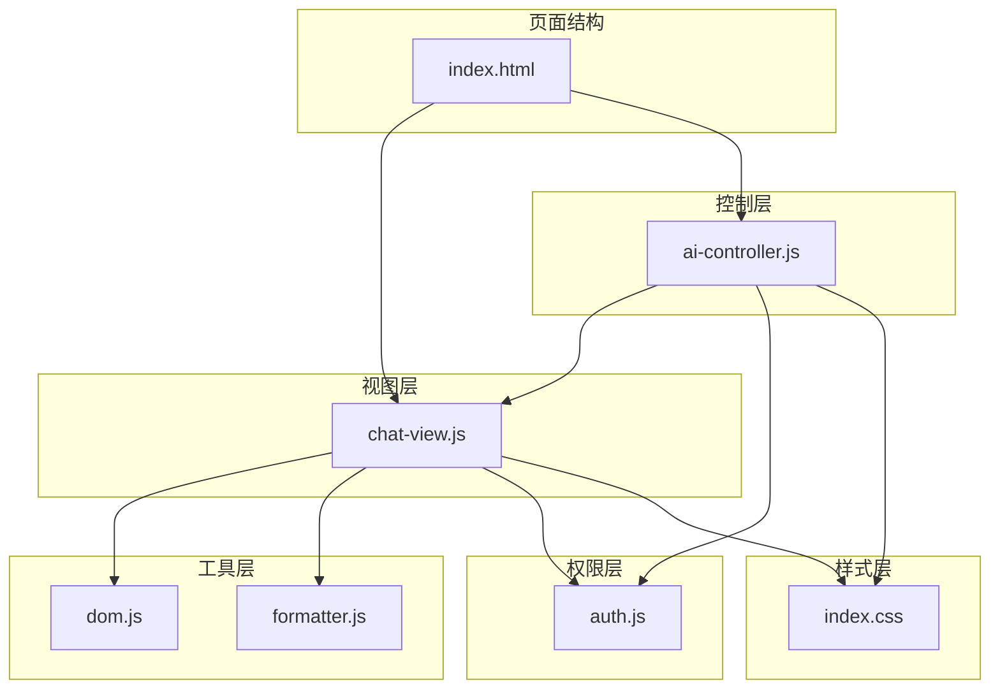

**图表来源**
- [index.html](file://index.html)
- [src/ui/chat-view.js](file://src/ui/chat-view.js)
- [src/controllers/ai-controller.js](file://src/controllers/ai-controller.js)
- [src/storage/auth.js](file://src/storage/auth.js)
- [src/utils/dom.js](file://src/utils/dom.js)
- [src/utils/formatter.js](file://src/utils/formatter.js)
- [src/index.css](file://src/index.css)

**章节来源**
- [index.html](file://index.html)
- [src/ui/chat-view.js](file://src/ui/chat-view.js)
- [src/controllers/ai-controller.js](file://src/controllers/ai-controller.js)
- [src/storage/auth.js](file://src/storage/auth.js)
- [src/utils/dom.js](file://src/utils/dom.js)
- [src/utils/formatter.js](file://src/utils/formatter.js)
- [src/index.css](file://src/index.css)

## 核心组件
- 聊天消息渲染器：负责用户消息、助手消息、系统消息的渲染与插入。
- 双栏分析布局：将单条助手消息包装为左右两列，用于模型对比或版本对比。
- 滚动控制：智能判断是否需要滚动到底部，保证用户体验。
- 消息操作按钮：卦例点评、结果导出、新起一卦、追问功能。
- 权限控制系统：基于用户层级的追问限制和动态按钮显示。
- 文本格式化与安全转义：Markdown 渲染、HTML 转义、标题规范化。
- DOM 工具：选择器封装、吐司提示、HTML 转义。

**章节来源**
- [src/ui/chat-view.js](file://src/ui/chat-view.js)
- [src/storage/auth.js](file://src/storage/auth.js)
- [src/utils/dom.js](file://src/utils/dom.js)
- [src/utils/formatter.js](file://src/utils/formatter.js)
- [src/index.css](file://src/index.css)

## 架构概览
聊天界面的数据流与控制流如下：

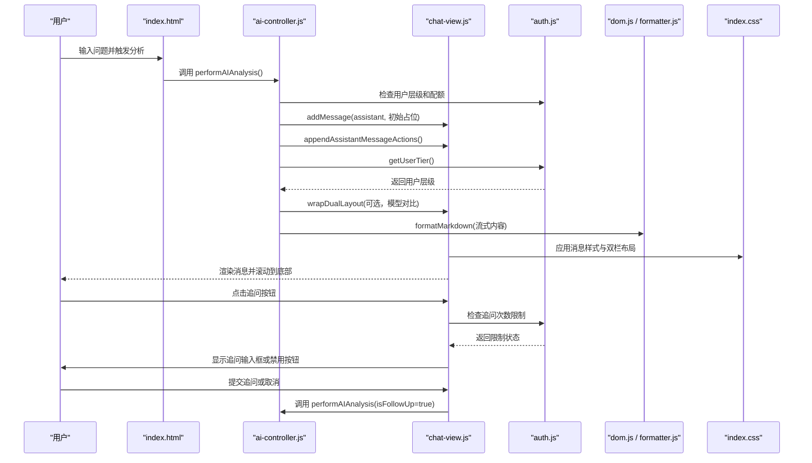

**图表来源**
- [src/controllers/ai-controller.js](file://src/controllers/ai-controller.js)
- [src/ui/chat-view.js](file://src/ui/chat-view.js)
- [src/storage/auth.js](file://src/storage/auth.js)
- [src/utils/formatter.js](file://src/utils/formatter.js)
- [src/index.css](file://src/index.css)

## 详细组件分析

### 聊天消息渲染机制
- 用户消息：通过插入带类名的容器元素实现，样式强调右侧对齐与内边距。
- 助手消息：初始插入占位内容（如"思考中"进度条），随后以流式方式更新内容。
- 系统消息：使用 HTML 转义后插入，避免注入风险。

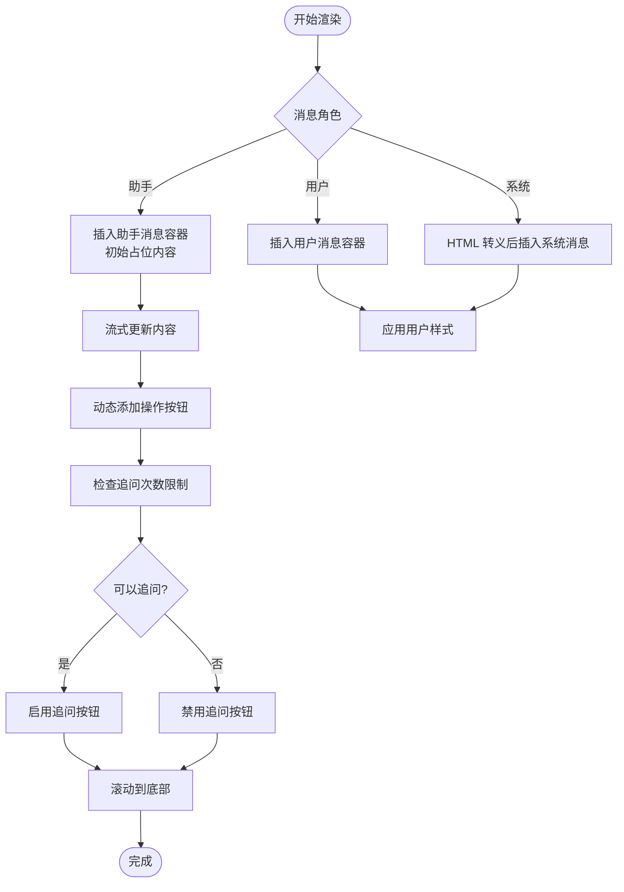

**图表来源**
- [src/ui/chat-view.js](file://src/ui/chat-view.js)
- [src/storage/auth.js](file://src/storage/auth.js)
- [src/utils/dom.js](file://src/utils/dom.js)
- [src/utils/formatter.js](file://src/utils/formatter.js)
- [src/index.css](file://src/index.css)

**章节来源**
- [src/ui/chat-view.js](file://src/ui/chat-view.js)
- [src/storage/auth.js](file://src/storage/auth.js)
- [src/utils/dom.js](file://src/utils/dom.js)
- [src/utils/formatter.js](file://src/utils/formatter.js)
- [src/index.css](file://src/index.css)

### 基于用户层级的追问限制系统
**新增功能**：系统根据用户层级动态调整追问次数限制，提供差异化服务体验。

- 终身Pro用户：最多5次追问
- 管理员用户：继承终身Pro权限，最多5次追问
- 普通Pro用户：最多3次追问（月度/年度Pro用户）
- 免费用户：无追问权限

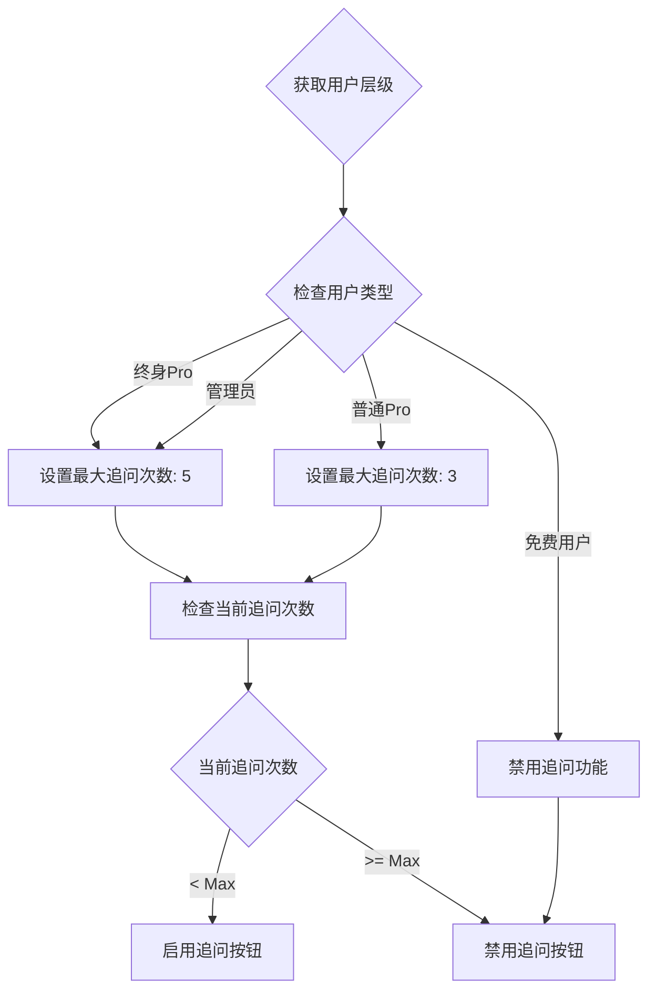

**图表来源**
- [src/storage/auth.js](file://src/storage/auth.js)
- [src/main.js](file://src/main.js)
- [src/ui/chat-view.js](file://src/ui/chat-view.js)

**章节来源**
- [src/storage/auth.js](file://src/storage/auth.js)
- [src/main.js](file://src/main.js)
- [src/ui/chat-view.js](file://src/ui/chat-view.js)

### 动态行动按钮显示机制
**增强功能**：根据用户权限和追问状态智能控制按钮的显示与交互。

- Pro用户专属按钮：卦例点评、结果导出、新起一卦、追问功能
- 追问按钮状态：根据剩余次数动态启用/禁用
- 移动端适配：自动同步按钮可见性状态

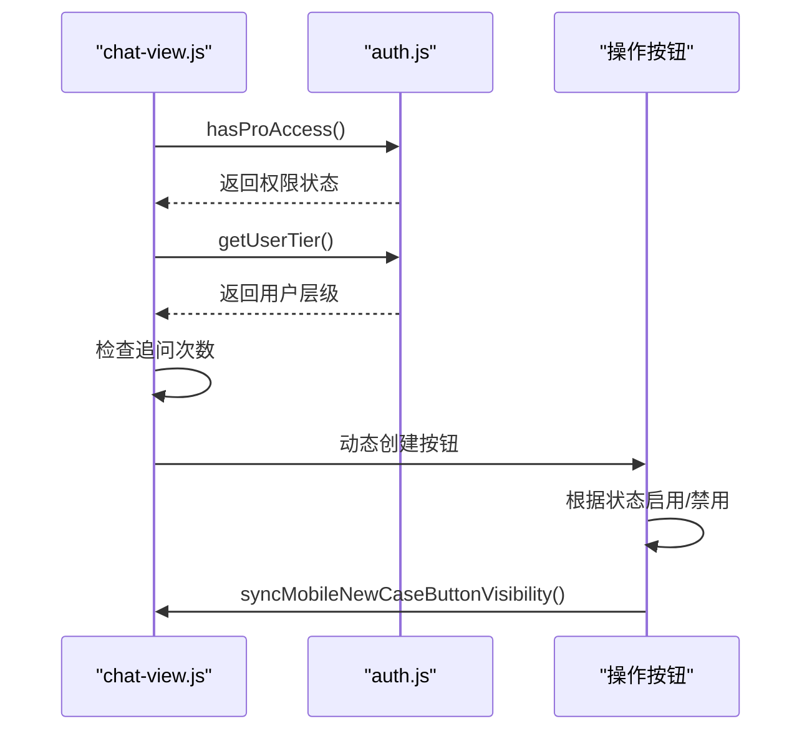

**图表来源**
- [src/ui/chat-view.js](file://src/ui/chat-view.js)
- [src/storage/auth.js](file://src/storage/auth.js)

**章节来源**
- [src/ui/chat-view.js](file://src/ui/chat-view.js)
- [src/storage/auth.js](file://src/storage/auth.js)

### 追问功能完整实现
**新增功能**：提供完整的追问交互流程，支持多轮对话和上下文保持。

- 追问输入框：动态创建、自动聚焦、取消功能
- 追问计数：基于数据集的追问次数跟踪
- 追问执行：不扣除用户配额，独立计费模式
- 上下文保持：将追问内容作为用户消息插入历史

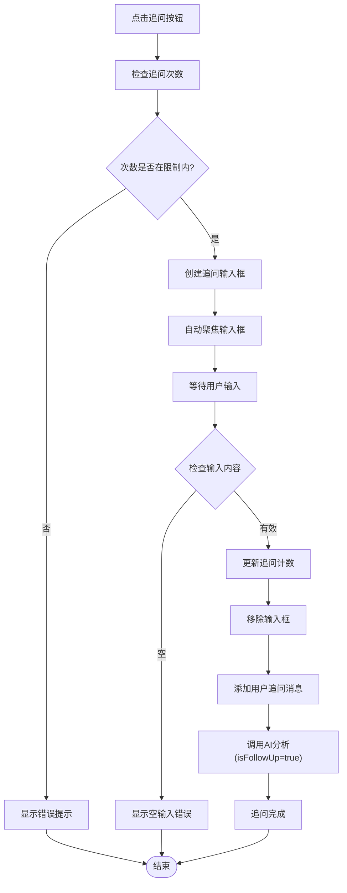

**图表来源**
- [src/main.js](file://src/main.js)
- [src/controllers/ai-controller.js](file://src/controllers/ai-controller.js)

**章节来源**
- [src/main.js](file://src/main.js)
- [src/controllers/ai-controller.js](file://src/controllers/ai-controller.js)

### 消息添加与滚动控制
- 消息添加：通过 insertAdjacentHTML 插入，返回新节点以便后续操作。
- 滚动控制：根据容器是否可滚动与当前位置阈值决定是否滚动到底部；支持根元素滚动与容器滚动两种场景。

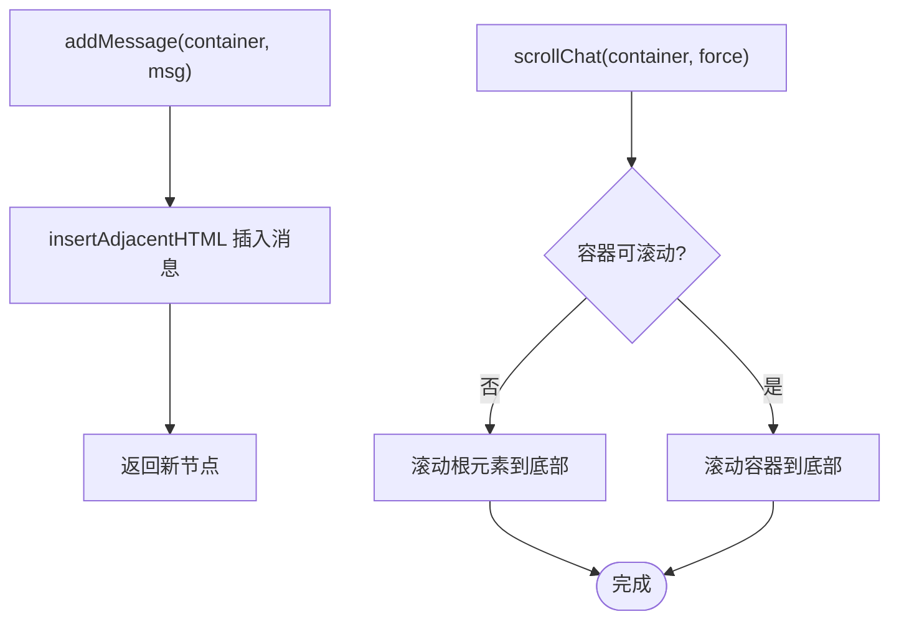

**图表来源**
- [src/ui/chat-view.js](file://src/ui/chat-view.js)

**章节来源**
- [src/ui/chat-view.js](file://src/ui/chat-view.js)

### 双栏分析布局
- 包装策略：将现有助手消息替换为双栏容器，左侧为旧模型/版本，右侧为新模型/版本。
- 同步更新：右侧列初始显示加载指示，流式渲染完成后左侧内容保持不变，右侧更新为最新结果。
- 样式设计：双栏头部包含渐变色小圆点与标签，列体具有统一内边距与最大高度。

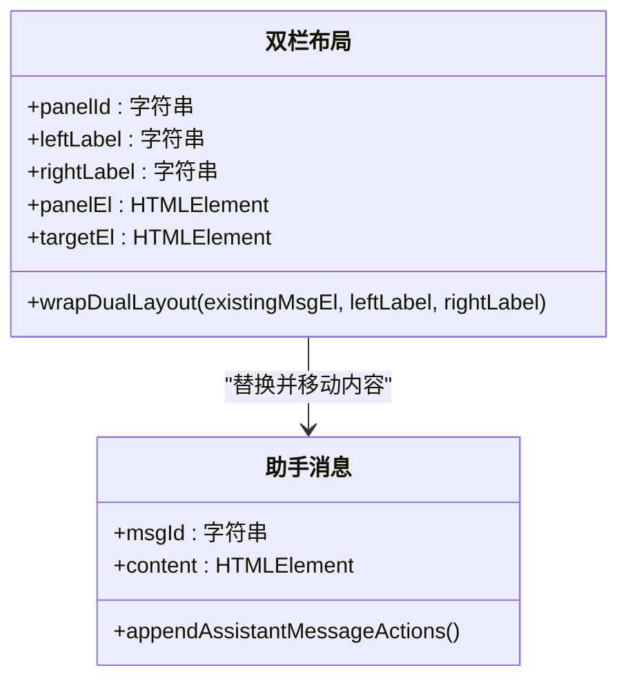

**图表来源**
- [src/ui/chat-view.js](file://src/ui/chat-view.js)
- [src/index.css](file://src/index.css)

**章节来源**
- [src/ui/chat-view.js](file://src/ui/chat-view.js)
- [src/index.css](file://src/index.css)

### 消息操作按钮
- 按钮集合：卦例点评、结果导出、新起一卦、追问功能。
- 动态注入：在助手消息内容末尾插入操作行，避免重复渲染。
- 权限控制：根据用户层级和追问次数动态启用/禁用按钮。
- 交互行为：通过全局函数暴露到 window 对象，供按钮 onclick 调用。

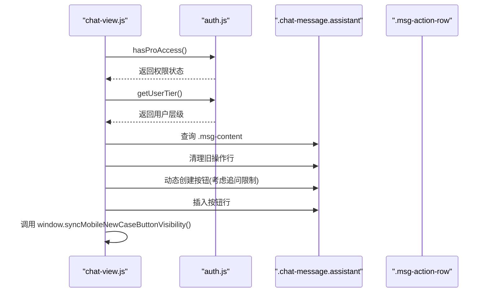

**图表来源**
- [src/ui/chat-view.js](file://src/ui/chat-view.js)
- [src/storage/auth.js](file://src/storage/auth.js)

**章节来源**
- [src/ui/chat-view.js](file://src/ui/chat-view.js)
- [src/storage/auth.js](file://src/storage/auth.js)
- [src/main.js](file://src/main.js)

### 消息格式化、HTML 转义与安全防护
- 格式化：将 Markdown 标题、加粗、斜体、列表等转换为 HTML，并对标题进行规范化映射。
- 转义：对系统消息与文本内容进行 HTML 转义，防止 XSS。
- 流式渲染：在流式输出过程中自动闭合未完成的加粗标记，避免闪烁。

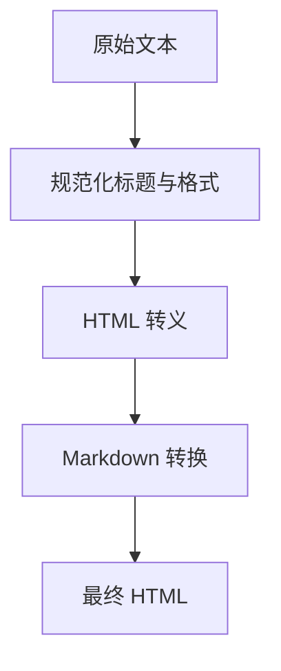

**图表来源**
- [src/utils/formatter.js](file://src/utils/formatter.js)
- [src/utils/dom.js](file://src/utils/dom.js)

**章节来源**
- [src/utils/formatter.js](file://src/utils/formatter.js)
- [src/utils/dom.js](file://src/utils/dom.js)

### 响应式设计与移动端适配
- 移动端布局：侧边栏改为固定抽屉，顶部与底部间距适配安全区域。
- 聊天区域：在窄屏下调整卡片尺寸、字体大小与间距，提升可读性。
- 模态框：在 iOS 微信环境下采用全屏 sheet 模式，优化输入体验。
- 滚动与可见性：监听滚动与窗口尺寸变化，动态控制"新起一卦"浮动按钮的显示与隐藏。

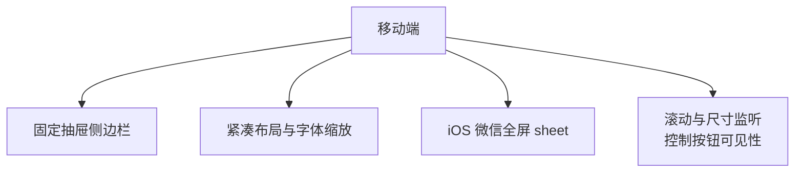

**图表来源**
- [src/index.css](file://src/index.css)
- [src/main.js](file://src/main.js)
- [index.html](file://index.html)

**章节来源**
- [src/index.css](file://src/index.css)
- [src/main.js](file://src/main.js)
- [index.html](file://index.html)

## 依赖分析
- chat-view.js 依赖 dom.js（选择器与转义）、formatter.js（Markdown 格式化）和 auth.js（权限检查）。
- ai-controller.js 依赖 chat-view.js（消息添加、双栏布局、滚动控制）和 formatter.js（内容格式化）。
- main.js 依赖 auth.js（用户层级检查）和 chat-view.js（消息操作）。
- 权限层通过 auth.js 为所有组件提供统一的用户状态管理。

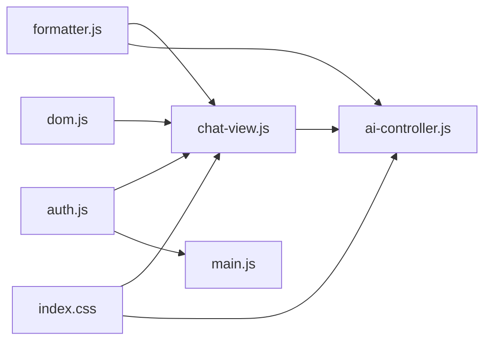

**图表来源**
- [src/ui/chat-view.js](file://src/ui/chat-view.js)
- [src/utils/dom.js](file://src/utils/dom.js)
- [src/utils/formatter.js](file://src/utils/formatter.js)
- [src/storage/auth.js](file://src/storage/auth.js)
- [src/controllers/ai-controller.js](file://src/controllers/ai-controller.js)
- [src/main.js](file://src/main.js)
- [src/index.css](file://src/index.css)

**章节来源**
- [src/ui/chat-view.js](file://src/ui/chat-view.js)
- [src/utils/dom.js](file://src/utils/dom.js)
- [src/utils/formatter.js](file://src/utils/formatter.js)
- [src/storage/auth.js](file://src/storage/auth.js)
- [src/controllers/ai-controller.js](file://src/controllers/ai-controller.js)
- [src/main.js](file://src/main.js)
- [src/index.css](file://src/index.css)

## 性能考量
- DOM 操作最小化：使用 insertAdjacentHTML 一次性插入，避免多次查询与重排。
- 滚动节流：在移动端滚动与窗口尺寸变化事件中使用节流/防抖，降低重绘频率。
- 流式渲染：在流式输出中仅更新内容区域，保留"思考中"动画 DOM，减少重建成本。
- 权限检查缓存：用户层级信息通过 getUserTier() 获取，避免重复计算。
- 追问状态持久化：使用 dataset 属性存储追问次数，减少额外状态管理开销。

## 故障排除指南
- 导出结果为空：检查 state 中的 modelAnalyses 与 DOM 中的 .chat-message.assistant 内容，必要时降级提取。
- 模型切换对比：确认 wrapDualLayout 成功替换节点并正确移动左侧内容。
- 滚动异常：检查 isNearBottom 与 scrollChat 的阈值与容器滚动属性，确保根元素与容器滚动场景均覆盖。
- 移动端按钮不可见：确认 updateMobileNewCaseButtonVisibility 的可见性逻辑与 requestAnimationFrame 调用。
- 追问功能异常：检查 getUserTier() 返回值、dataset.followUpCount 数据类型转换和 maxFollowUp 计算逻辑。
- 权限判断错误：确认 hasProAccess() 和 getUserTier() 的调用顺序和返回值处理。

**章节来源**
- [src/main.js](file://src/main.js)
- [src/ui/chat-view.js](file://src/ui/chat-view.js)
- [src/controllers/ai-controller.js](file://src/controllers/ai-controller.js)
- [src/storage/auth.js](file://src/storage/auth.js)

## 结论
聊天界面通过清晰的模块划分与稳健的 DOM 操作实现了高效的消息渲染与流式更新。新增的基于用户层级的追问限制功能提供了精细化的权限控制，增强了用户体验的差异化。动态行动按钮显示机制确保了界面的智能化和个性化。双栏布局满足模型对比需求，滚动控制与响应式设计提升了跨设备体验。格式化与转义保障了内容质量与安全性。建议在后续迭代中进一步抽象消息模板与按钮行为，以增强可维护性与可扩展性。

## 附录
- 关键函数路径
  - [addMessage](file://src/ui/chat-view.js)
  - [appendAssistantMessageActions](file://src/ui/chat-view.js)
  - [wrapDualLayout](file://src/ui/chat-view.js)
  - [isNearBottom](file://src/ui/chat-view.js)
  - [scrollChat](file://src/ui/chat-view.js)
  - [escapeHtml](file://src/utils/dom.js)
  - [formatMarkdown](file://src/utils/formatter.js)
  - [performAIAnalysis](file://src/controllers/ai-controller.js)
  - [performComparisonAnalysis](file://src/controllers/ai-controller.js)
  - [continueAIAnalysis](file://src/controllers/ai-controller.js)
  - [getUserTier](file://src/storage/auth.js)
  - [hasProAccess](file://src/storage/auth.js)
  - [startFollowUp](file://src/main.js)
  - [submitFollowUp](file://src/main.js)
  - [cancelFollowUp](file://src/main.js)